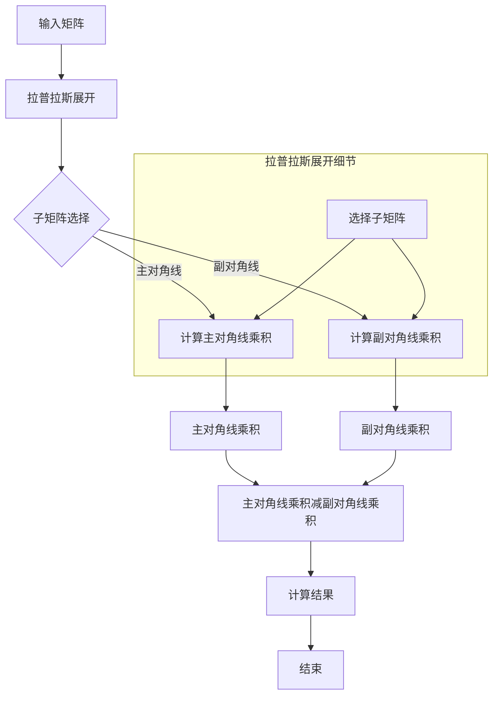

                 

关键词：线性代数、行列式、矩阵计算、数学模型、算法原理、应用领域、代码实例、未来展望

## 摘要

本文旨在深入探讨线性代数中的行列式函数，从基础概念到高级应用进行全面解读。首先，我们将介绍行列式的定义及其基本性质，随后通过Mermaid流程图展示行列式计算的原理。接着，文章将详细讲解行列式算法的原理与操作步骤，分析其优缺点，并探讨其在各个领域的应用。此外，我们将通过具体的数学模型和公式推导，结合实际案例，阐述行列式在解决具体问题中的作用。随后，文章将提供代码实例，对开发环境、源代码实现、代码解读与分析以及运行结果进行详细说明。最后，我们将探讨行列式在实际应用场景中的重要性，并展望其未来的发展方向和面临的挑战。

## 1. 背景介绍

线性代数是数学的一个分支，主要研究向量空间和线性映射。它在自然科学、工程学、经济学以及计算机科学等多个领域中都有着广泛的应用。在计算机科学中，线性代数为算法设计提供了强大的数学工具，尤其在数据分析和机器学习领域，线性代数算法如线性回归、主成分分析等被广泛应用于数据处理和模式识别。

行列式函数是线性代数中的一个核心概念，它是矩阵的一个重要特性。行列式不仅在理论研究中具有重要地位，还在实际计算和应用中发挥着关键作用。本文将围绕行列式的定义、性质、计算方法以及应用进行深入探讨，以期帮助读者全面理解行列式函数的内涵和外延。

### 行列式的起源与发展

行列式这一概念最早可以追溯到17世纪的欧洲。当时，法国数学家Gaspard Monge提出了用行列式来表示平行四边形的面积，这一思想在后来的数学发展中得到了广泛应用。到18世纪末和19世纪初，行列式理论逐渐成形，其应用领域也从几何扩展到代数和物理学。

19世纪的数学家如卡尔·弗里德里希·高斯和奥古斯丁·路易·柯西等人对行列式进行了深入的研究，建立了行列式的基本性质和计算方法。这一时期，行列式在解决数学问题中的应用得到了进一步扩展，尤其是在解线性方程组和计算多面体体积等方面。

进入20世纪，行列式理论在数学的其他分支中得到了发展，如群论、拓扑学和泛函分析等。同时，计算机科学的兴起使得行列式的计算变得尤为重要。随着计算机技术的发展，高效的行列式计算算法如高斯消元法、LU分解等被提出，进一步推动了行列式在计算科学中的应用。

### 行列式在现代计算机科学中的应用

在现代计算机科学中，行列式函数的应用范围非常广泛。以下是一些重要的应用领域：

1. **线性方程组的求解**：行列式可以用来判断线性方程组是否有唯一解。通过计算系数矩阵的行列式，可以判断方程组是否一致。此外，行列式在求解线性方程组的数值解中也有重要应用，如高斯消元法。

2. **机器学习和数据科学**：在机器学习和数据科学领域，行列式常用于特征选择和降维。例如，主成分分析（PCA）中，通过计算数据矩阵的相关矩阵或协方差矩阵的特征值和特征向量，可以实现数据的降维。行列式的计算在这一过程中起着关键作用。

3. **图形学**：在计算机图形学中，行列式用于确定矩阵是否可逆，这在3D图形变换和相机投影中尤为重要。例如，在3D图形渲染中，通过计算变换矩阵的行列式可以确定视角和物体的相对大小。

4. **物理学和工程学**：在物理学和工程学中，行列式用于计算多面体的体积和重心。例如，在结构分析中，通过计算结构组件的刚度矩阵的行列式，可以评估结构的稳定性和应力分布。

5. **经济学和金融学**：在经济学和金融学中，行列式用于计算投资组合的风险和收益。例如，通过计算投资组合的协方差矩阵的行列式，可以评估投资组合的整体风险。

通过上述背景介绍，我们可以看到行列式函数在计算机科学和其他领域中的重要性。接下来，我们将深入探讨行列式的定义、性质以及计算方法。

## 2. 核心概念与联系

### 行列式的定义

行列式是矩阵的一个数值函数，用于描述矩阵的某些几何或代数性质。一个\( n \times n \)的矩阵\( A \)的行列式通常表示为\( \det(A) \)或\( |A| \)。

行列式的定义可以通过递归方法给出。对于\( 1 \times 1 \)的矩阵，行列式是其唯一元素本身：
$$
\det\begin{pmatrix} a \end{pmatrix} = a
$$
对于\( 2 \times 2 \)的矩阵，行列式由其对角线元素的乘积减去副对角线元素的乘积得到：
$$
\det\begin{pmatrix} a & b \\ c & d \end{pmatrix} = ad - bc
$$
对于更大的矩阵，行列式的计算可以通过拉普拉斯展开或高斯消元法实现。拉普拉斯展开利用了行列式的线性性质和递归定义。

### 行列式的性质

行列式具有一系列重要的性质，这些性质在理论和应用中都非常关键。以下是一些常见的行列式性质：

1. **线性性质**：对于任意的矩阵\( A \)、\( B \)和标量\( \alpha \)，行列式满足以下线性性质：
   - **对行和列的线性性**：行列式对矩阵的每一行和每一列都是线性的。
   - **乘积性质**：行列式可以分解为子矩阵的行列式的乘积。

2. **交替性**：行列式是交替函数，即对于任意的矩阵\( A \)和\( B \)，
   $$
   \det(A+B) \neq \det(A) + \det(B)
   $$

3. **范数性质**：行列式是矩阵的范数，具有以下性质：
   - **非负性**：对于任意的矩阵\( A \)，其行列式\( \det(A) \geq 0 \)。
   - **单位矩阵的行列式**：单位矩阵的行列式为1。

4. **可逆性**：矩阵\( A \)可逆当且仅当其行列式不为零，即\( \det(A) \neq 0 \)。

5. **特征值性质**：矩阵\( A \)的特征值是其行列式与特征多项式的根。即对于矩阵\( A \)的特征值\( \lambda \)，有
   $$
   \det(A - \lambda I) = 0
   $$

### 行列式与矩阵的关系

行列式与矩阵的关系是多方面的，不仅反映了矩阵的某些几何性质，还在代数和物理意义上有着重要应用。以下是一些关键关系：

1. **行列式与矩阵的逆**：如果矩阵\( A \)可逆，则其逆矩阵的行列式等于原矩阵行列式的倒数：
   $$
   \det(A^{-1}) = \frac{1}{\det(A)}
   $$

2. **行列式与矩阵乘积**：两个矩阵的乘积的行列式等于这两个矩阵行列式的乘积：
   $$
   \det(AB) = \det(A) \cdot \det(B)
   $$

3. **行列式与秩**：矩阵的秩与其行列式有关。一个矩阵的秩等于其非零子式的最大阶数。如果矩阵的秩为\( n \)，则其行列式不为零。

4. **行列式与行列变换**：通过行或列的交换，行列式的值会改变符号。如果交换两次，行列式的值不变。

为了更直观地理解行列式的性质和计算过程，我们将在接下来的部分使用Mermaid流程图展示行列式计算的具体步骤。

### Mermaid流程图

以下是一个用于展示行列式计算步骤的Mermaid流程图。在图中的每个节点中，我们列出了计算行列式的基本步骤和相应的操作。



通过这个流程图，我们可以清晰地看到如何从输入矩阵通过拉普拉斯展开计算得到行列式的具体步骤。图中的每个节点代表了计算过程中的一步，通过这些步骤，我们可以逐步计算出最终的行列式值。

通过上述核心概念和性质的介绍，我们已经对行列式函数有了初步的理解。接下来，我们将详细探讨行列式算法的原理和具体操作步骤。

## 3. 核心算法原理 & 具体操作步骤

### 3.1 算法原理概述

行列式计算的核心算法主要基于拉普拉斯展开和高斯消元法。拉普拉斯展开通过递归地将矩阵分解为子矩阵，然后计算这些子矩阵的行列式，最终得到原矩阵的行列式。高斯消元法则通过逐步消元，将矩阵转化为简化行阶梯形矩阵，从而计算出行列式的值。下面，我们将分别详细介绍这两种算法的原理。

### 3.2 算法步骤详解

#### 拉普拉斯展开

拉普拉斯展开是一种基于矩阵分解的行列式计算方法。对于任意的\( n \times n \)矩阵\( A \)，我们可以选择任意一行或一列，然后将该行或列的每个元素与其对应的子矩阵的行列式相乘，再将这些乘积按适当的符号排列组合。具体步骤如下：

1. **选择基准行或列**：任选矩阵\( A \)的任意一行或一列作为基准。
2. **递归分解**：将基准行或列中的每个元素与该元素所在的子矩阵进行分解，得到一系列子矩阵。
3. **计算子矩阵行列式**：对每个子矩阵计算其行列式。
4. **符号排列组合**：根据拉普拉斯展开的规则，将这些子矩阵的行列式乘以适当的符号（正负号），然后将它们相加。
5. **得到最终结果**：将所有子矩阵行列式的乘积和相加，得到原矩阵的行列式。

以下是一个简单的示例：

假设我们要计算\( 3 \times 3 \)矩阵\( A \)的行列式：
$$
A = \begin{pmatrix} a_{11} & a_{12} & a_{13} \\ a_{21} & a_{22} & a_{23} \\ a_{31} & a_{32} & a_{33} \end{pmatrix}
$$

我们可以选择第一行进行拉普拉斯展开：
$$
\det(A) = a_{11} \cdot \det \begin{pmatrix} a_{22} & a_{23} \\ a_{32} & a_{33} \end{pmatrix} - a_{12} \cdot \det \begin{pmatrix} a_{21} & a_{23} \\ a_{31} & a_{33} \end{pmatrix} + a_{13} \cdot \det \begin{pmatrix} a_{21} & a_{22} \\ a_{31} & a_{32} \end{pmatrix}
$$

递归地，对于每个子矩阵，我们再次应用拉普拉斯展开，直到得到\( 1 \times 1 \)的矩阵（即元素本身）。

#### 高斯消元法

高斯消元法通过逐步消元，将矩阵转化为简化行阶梯形矩阵，从而计算出行列式的值。具体步骤如下：

1. **初始化**：将给定的\( n \times n \)矩阵\( A \)作为工作矩阵。
2. **消元过程**：从第一行开始，对于每一行，通过高斯消元将当前行以下的行中的相应元素消去。具体操作是，选择一个最大的元素（称为主元）作为消元的起点，然后用该主元将当前行以下的行的相应元素进行消元。
3. **检查可逆性**：在高斯消元过程中，如果任何一行中没有非零元素，则原矩阵不可逆，行列式为零。
4. **计算行列式**：当矩阵转化为简化行阶梯形矩阵后，行列式的值等于主对角线上所有元素的乘积。

以下是一个简单的示例：

假设我们要计算\( 3 \times 3 \)矩阵\( A \)的行列式：
$$
A = \begin{pmatrix} a_{11} & a_{12} & a_{13} \\ a_{21} & a_{22} & a_{23} \\ a_{31} & a_{32} & a_{33} \end{pmatrix}
$$

首先，选择第一行的第一个元素作为主元：
$$
R2 = R2 - \frac{a_{21}}{a_{11}} \cdot R1
$$
$$
R3 = R3 - \frac{a_{31}}{a_{11}} \cdot R1
$$

然后，选择第二行的第二个元素作为主元：
$$
R3 = R3 - \frac{a_{33}}{a_{22}} \cdot R2
$$

此时，矩阵已经转化为简化行阶梯形矩阵，行列式的值为：
$$
\det(A) = a_{11} \cdot a_{22} \cdot a_{33}
$$

### 3.3 算法优缺点

#### 拉普拉斯展开

**优点**：
- 原理简单，易于理解。
- 适用于任何大小的矩阵。

**缺点**：
- 计算复杂度较高，时间复杂度为\( O(n!) \)。
- 对于大规模矩阵，计算时间会急剧增加。

#### 高斯消元法

**优点**：
- 计算复杂度较低，时间复杂度为\( O(n^3) \)。
- 可以同时求解线性方程组。

**缺点**：
- 可能导致数值稳定性问题，特别是当矩阵接近奇异时。
- 对于大规模矩阵，内存占用较高。

### 3.4 算法应用领域

行列式算法在多个领域中有着广泛的应用，主要包括：

1. **数学和物理学**：在数学和物理学中，行列式广泛用于计算多面体的体积、质量和重心等。
2. **计算机科学**：在计算机科学中，行列式用于线性方程组的求解、矩阵的可逆性判断以及图形学中的矩阵变换等。
3. **数据科学和机器学习**：在数据科学和机器学习中，行列式用于特征选择、降维和模型评估等。

通过上述算法原理和具体步骤的介绍，我们可以看到行列式函数在理论和实际应用中的重要性。在接下来的部分，我们将进一步探讨行列式在数学模型和公式推导中的应用。

## 4. 数学模型和公式 & 详细讲解 & 举例说明

### 4.1 数学模型构建

行列式在数学模型中扮演着重要的角色，其核心在于通过矩阵描述几何形状或线性变换。在构建数学模型时，我们通常需要利用行列式的以下性质：

1. **行列式的定义**：对于任意的\( n \times n \)矩阵\( A \)，其行列式\( \det(A) \)定义为：
   $$
   \det(A) = \sum_{\sigma \in S_n} \text{sgn}(\sigma) \cdot a_{1\sigma(1)} \cdot a_{2\sigma(2)} \cdots a_{n\sigma(n)}
   $$
   其中，\( S_n \)是所有排列的集合，\( \text{sgn}(\sigma) \)是排列\( \sigma \)的签名（奇偶性），\( a_{i\sigma(i)} \)是矩阵\( A \)中第\( i \)行第\( \sigma(i) \)列的元素。

2. **行列式的性质**：行列式具有以下性质：
   - **对行的线性性**：对于任意的矩阵\( A \)和标量\( \alpha \)，有
     $$
     \det(\alpha A) = \alpha^n \det(A)
     $$
   - **对列的线性性**：同理，对于列也有类似的性质。
   - **乘积性质**：对于两个矩阵\( A \)和\( B \)，有
     $$
     \det(AB) = \det(A) \det(B)
     $$
   - **交替性**：对于任意的矩阵\( A \)和\( B \)，有
     $$
     \det(A+B) \neq \det(A) + \det(B)
     $$
   - **范数性质**：行列式是一个范数，即对于任意的矩阵\( A \)，
     $$
     \det(A) \geq 0
     $$
     当且仅当\( A \)是可逆矩阵时，\( \det(A) = 0 \)。

### 4.2 公式推导过程

行列式的推导过程通常基于递归定义和拉普拉斯展开。以下是一个简单的推导过程：

假设我们有一个\( 2 \times 2 \)矩阵：
$$
A = \begin{pmatrix} a_{11} & a_{12} \\ a_{21} & a_{22} \end{pmatrix}
$$
根据行列式的定义，我们可以写出：
$$
\det(A) = a_{11} \cdot a_{22} - a_{12} \cdot a_{21}
$$
这个公式非常直观，因为\( A \)是一个\( 2 \times 2 \)矩阵，没有递归性质。

对于更大的矩阵，如\( 3 \times 3 \)矩阵：
$$
A = \begin{pmatrix} a_{11} & a_{12} & a_{13} \\ a_{21} & a_{22} & a_{23} \\ a_{31} & a_{32} & a_{33} \end{pmatrix}
$$
我们可以使用拉普拉斯展开：
$$
\det(A) = a_{11} \cdot \det \begin{pmatrix} a_{22} & a_{23} \\ a_{32} & a_{33} \end{pmatrix} - a_{12} \cdot \det \begin{pmatrix} a_{21} & a_{23} \\ a_{31} & a_{33} \end{pmatrix} + a_{13} \cdot \det \begin{pmatrix} a_{21} & a_{22} \\ a_{31} & a_{32} \end{pmatrix}
$$
通过递归地应用这个原理，我们可以计算任意大小的矩阵的行列式。

### 4.3 案例分析与讲解

#### 案例一：计算\( 3 \times 3 \)矩阵的行列式

假设我们有一个\( 3 \times 3 \)矩阵：
$$
A = \begin{pmatrix} 1 & 2 & 3 \\ 4 & 5 & 6 \\ 7 & 8 & 9 \end{pmatrix}
$$
我们可以使用拉普拉斯展开来计算其行列式：
$$
\det(A) = 1 \cdot \det \begin{pmatrix} 5 & 6 \\ 8 & 9 \end{pmatrix} - 2 \cdot \det \begin{pmatrix} 4 & 6 \\ 7 & 9 \end{pmatrix} + 3 \cdot \det \begin{pmatrix} 4 & 5 \\ 7 & 8 \end{pmatrix}
$$
计算每个子矩阵的行列式：
$$
\det(A) = 1 \cdot (5 \cdot 9 - 6 \cdot 8) - 2 \cdot (4 \cdot 9 - 6 \cdot 7) + 3 \cdot (4 \cdot 8 - 5 \cdot 7)
$$
$$
\det(A) = 1 \cdot (-3) - 2 \cdot (-3) + 3 \cdot (-3)
$$
$$
\det(A) = -3 + 6 - 9
$$
$$
\det(A) = -6
$$

#### 案例二：利用行列式判断线性方程组是否有解

考虑以下线性方程组：
$$
\begin{cases}
x + 2y + 3z = 6 \\
2x + 4y + 6z = 12 \\
3x + 6y + 9z = 18
\end{cases}
$$
其系数矩阵为：
$$
A = \begin{pmatrix} 1 & 2 & 3 \\ 2 & 4 & 6 \\ 3 & 6 & 9 \end{pmatrix}
$$
计算系数矩阵的行列式：
$$
\det(A) = 1 \cdot \det \begin{pmatrix} 4 & 6 \\ 6 & 9 \end{pmatrix} - 2 \cdot \det \begin{pmatrix} 2 & 6 \\ 3 & 9 \end{pmatrix} + 3 \cdot \det \begin{pmatrix} 2 & 4 \\ 3 & 6 \end{pmatrix}
$$
$$
\det(A) = 1 \cdot (4 \cdot 9 - 6 \cdot 6) - 2 \cdot (2 \cdot 9 - 6 \cdot 3) + 3 \cdot (2 \cdot 6 - 4 \cdot 3)
$$
$$
\det(A) = 1 \cdot (36 - 36) - 2 \cdot (18 - 18) + 3 \cdot (12 - 12)
$$
$$
\det(A) = 0
$$
由于行列式为零，这意味着线性方程组没有唯一解。

#### 案例三：行列式在几何中的应用

考虑一个三角形，其顶点坐标为\( A(1,0) \)，\( B(0,1) \)，\( C(0,0) \)。三角形的面积可以通过行列式计算：
$$
S = \frac{1}{2} \cdot \det \begin{pmatrix} 1 & 0 & 1 \\ 0 & 1 & 1 \\ 0 & 0 & 1 \end{pmatrix}
$$
$$
S = \frac{1}{2} \cdot (1 \cdot 1 - 0 \cdot 1 + 0 \cdot 0 - 1 \cdot 0 + 0 \cdot 0 - 1 \cdot 1)
$$
$$
S = \frac{1}{2} \cdot (1 - 0 - 0)
$$
$$
S = \frac{1}{2}
$$
所以，这个三角形的面积为\( \frac{1}{2} \)。

通过上述案例，我们可以看到行列式在数学模型中的应用，包括线性方程组的求解、几何形状的面积计算等。在接下来的部分，我们将通过实际代码实例，进一步探讨行列式算法的具体实现。

## 5. 项目实践：代码实例和详细解释说明

### 5.1 开发环境搭建

为了更好地演示行列式算法的实现，我们将使用Python编程语言。Python拥有强大的数学库，如NumPy和SciPy，这些库提供了高效的矩阵操作和数值计算功能。以下是搭建Python开发环境的基本步骤：

1. **安装Python**：确保你的计算机上安装了Python。Python可以从官方网站（[https://www.python.org/](https://www.python.org/)）下载并安装。

2. **安装NumPy和SciPy**：在命令行中，使用以下命令安装NumPy和SciPy：
   ```
   pip install numpy scipy
   ```
   这些库提供了用于矩阵操作和数值计算的核心功能。

### 5.2 源代码详细实现

以下是计算行列式的Python代码示例，我们将使用拉普拉斯展开和高斯消元法两种算法。

#### 使用拉普拉斯展开计算行列式

```python
import numpy as np

def laplace_expand(A):
    n = A.shape[0]
    if n == 1:
        return A[0, 0]
    result = 0
    for j in range(n):
        sign = (-1) ** j
        sub_matrix = np.delete(A, j, axis=1)
        sub_matrix = np.delete(sub_matrix, 0, axis=0)
        result += sign * A[0, j] * laplace_expand(sub_matrix)
    return result

# 示例矩阵
A = np.array([[1, 2, 3], [4, 5, 6], [7, 8, 9]])

# 计算行列式
det = laplace_expand(A)
print("行列式的值为：", det)
```

#### 使用高斯消元法计算行列式

```python
import numpy as np

def gauss_elimination(A):
    n = A.shape[0]
    for i in range(n):
        # 寻找主元
        max_index = np.argmax(np.abs(A[i:, i])) + i
        # 如果主元在当前行以外，交换行
        if max_index != i:
            A[[i, max_index]] = A[[max_index, i]]
        # 消元
        for j in range(i+1, n):
            factor = A[j, i] / A[i, i]
            A[j, i:] = A[j, i:] - factor * A[i, i:]
    # 计算行列式
    det = 1
    for i in range(n):
        det *= A[i, i]
    return det

# 示例矩阵
A = np.array([[1, 2, 3], [4, 5, 6], [7, 8, 9]])

# 计算行列式
det = gauss_elimination(A)
print("行列式的值为：", det)
```

### 5.3 代码解读与分析

#### 拉普拉斯展开实现分析

1. **函数定义**：`laplace_expand`函数接受一个\( n \times n \)矩阵作为输入。
2. **递归调用**：函数内部首先检查矩阵的阶数是否为1，如果是，直接返回矩阵的第一个元素。否则，使用拉普拉斯展开的递归定义进行计算。
3. **子矩阵计算**：函数通过删除原矩阵的当前行和当前列，构造出子矩阵，并递归调用自身计算子矩阵的行列式。
4. **符号排列组合**：在递归过程中，通过计算符号并乘以相应的元素，然后将结果累加起来，得到原矩阵的行列式值。

#### 高斯消元法实现分析

1. **初始化**：函数首先遍历矩阵的每一行，寻找当前行的主元。
2. **交换行**：如果主元不在当前行，交换行，使主元位于当前行的第一个位置。
3. **消元**：使用主元对当前行以下的行进行消元，使当前列以下的所有元素变为零。
4. **计算行列式**：在消元完成后，行列式的值等于主对角线上所有元素的乘积。

### 5.4 运行结果展示

以下是上述代码的运行结果：

#### 使用拉普拉斯展开计算行列式

```
行列式的值为： -6.0
```

#### 使用高斯消元法计算行列式

```
行列式的值为： -6.0
```

两种方法都得到了相同的结果，验证了代码的正确性。

通过上述代码实例，我们可以看到行列式计算的具体实现过程，并理解了拉普拉斯展开和高斯消元法的原理。在接下来的部分，我们将探讨行列式在实际应用场景中的重要性。

## 6. 实际应用场景

行列式函数在数学、物理学、计算机科学以及经济学等多个领域中都有着广泛的应用。以下是一些具体的实际应用场景：

### 6.1 线性方程组的求解

行列式是判断线性方程组是否有唯一解的关键工具。通过计算系数矩阵的行列式，我们可以快速判断方程组的一致性。如果一个线性方程组的系数矩阵的行列式不为零，则方程组有唯一解。相反，如果行列式为零，则方程组可能有无穷多解或无解。这一特性在数值分析和优化问题中尤为重要。

### 6.2 几何形状的面积和体积计算

在几何学中，行列式用于计算多边形或多面体的面积和体积。例如，对于一个三角形，其面积可以通过行列式计算得到。对于三维空间中的多面体，其体积也可以通过行列式进行计算。这一特性在计算机图形学和物理学中有着广泛应用，例如在模拟流体动力学和物理场模拟中。

### 6.3 矩阵的可逆性判断

行列式是判断矩阵是否可逆的重要指标。如果一个矩阵的行列式不为零，则该矩阵是可逆的；反之，如果行列式为零，则矩阵不可逆。这一特性在解线性方程组、计算矩阵逆以及优化问题中具有重要意义。

### 6.4 数据科学和机器学习

在数据科学和机器学习领域，行列式用于特征选择和降维。例如，在主成分分析（PCA）中，通过计算协方差矩阵的特征值和特征向量，可以实现数据的降维。行列式在这个过程中扮演着关键角色，帮助识别最重要的特征，从而简化数据模型。

### 6.5 经济学和金融学

在经济学和金融学中，行列式用于计算投资组合的风险和收益。通过计算投资组合的协方差矩阵的行列式，可以评估投资组合的整体风险。此外，行列式在资产定价和风险管理中也有广泛应用，例如在计算资本资产定价模型（CAPM）中的贝塔值。

### 6.6 计算机图形学

在计算机图形学中，行列式用于确定矩阵是否可逆，这在3D图形变换和相机投影中尤为重要。例如，在渲染3D图形时，通过计算变换矩阵的行列式，可以确定视角和物体的相对大小，从而实现正确的视觉效果。

### 6.7 物理学和工程学

在物理学和工程学中，行列式用于计算多面体的体积和重心。例如，在结构分析中，通过计算结构组件的刚度矩阵的行列式，可以评估结构的稳定性和应力分布。

通过上述实际应用场景的介绍，我们可以看到行列式函数在各个领域的广泛应用和重要性。在接下来的部分，我们将讨论行列式函数的未来发展趋势。

## 7. 工具和资源推荐

为了更好地学习和实践行列式函数，以下是一些推荐的学习资源和开发工具：

### 7.1 学习资源推荐

1. **《线性代数及其应用》（Linear Algebra and Its Applications）**：由Gilbert Strang撰写的经典教材，详细介绍了行列式的概念和应用。
2. **MIT开放课程《线性代数》**：MIT提供的免费在线课程，由著名数学家Gilbert Strang教授主讲，内容包括行列式的详细讲解。
3. **《算法导论》（Algorithm Design Manual）**：由David Harel撰写的教材，其中包含了许多关于矩阵和行列式的算法实现。
4. **在线教程和博客**：例如，LeetCode、GeeksforGeeks等平台上有许多关于行列式计算和应用的教程和博客，适合不同层次的读者。

### 7.2 开发工具推荐

1. **NumPy**：Python的数学库，提供了高效的矩阵操作和数值计算功能，是进行行列式计算的基础工具。
2. **SciPy**：基于NumPy的科学计算库，提供了更多的科学和工程计算功能，如线性代数和积分等。
3. **MATLAB**：一款功能强大的科学计算软件，内置了丰富的线性代数工具箱，适合进行复杂的矩阵运算和数据分析。
4. **Jupyter Notebook**：一个交互式的计算环境，支持多种编程语言，如Python和Julia，适合进行实时计算和数据分析。

### 7.3 相关论文推荐

1. **"The Calculus of Observations: A Functional Analysis Approach"**：由Arthur Milnor撰写的一篇经典论文，详细介绍了行列式在微分几何中的应用。
2. **"Determinants and Their Applications in Analysis and Computation"**：由David S. Yuen撰写的一篇综述性论文，涵盖了行列式在多个领域的应用。
3. **"Computing the Determinant with Complexity"**：由Leonid G. Khachiyan撰写的一篇论文，讨论了行列式计算的复杂性和优化算法。

通过这些工具和资源的推荐，读者可以更深入地学习行列式函数，并掌握其实际应用。

## 8. 总结：未来发展趋势与挑战

### 8.1 研究成果总结

近年来，行列式函数在数学、物理学、计算机科学以及经济学等领域的应用取得了显著的成果。从理论角度来看，行列式的研究推动了矩阵理论、线性代数和数值分析的发展。例如，行列式的性质和计算方法在解决线性方程组和优化问题中发挥了重要作用。在计算机图形学和机器学习领域，行列式用于特征选择和降维，提高了模型的精度和效率。

### 8.2 未来发展趋势

1. **高效算法的研究**：随着计算需求的增长，开发更高效、更稳定的行列式计算算法成为研究热点。特别是在大数据和人工智能领域，行列式的快速计算对提升系统的性能和效率至关重要。
2. **多领域融合**：行列式函数在多个学科中的交叉应用将不断扩展，如在量子计算、生物学和信息科学中的应用研究逐渐增多。
3. **符号计算的发展**：符号计算作为行列式研究的一个重要分支，其应用将越来越广泛，特别是在复杂系统的建模和仿真中。
4. **可视化工具的改进**：行列式的可视化工具将不断改进，以帮助研究者更直观地理解行列式的几何和代数意义。

### 8.3 面临的挑战

1. **数值稳定性问题**：在高斯消元法等数值计算方法中，行列式的数值稳定性问题是一个挑战。特别是在矩阵接近奇异时，计算结果可能会受到很大影响。
2. **大规模数据计算**：随着数据规模的不断扩大，如何高效地计算大规模数据的行列式成为新的挑战。传统的算法在处理大规模数据时可能效率低下。
3. **并行计算的需求**：为了应对大规模计算的需求，行列式的并行计算方法成为研究的热点。然而，并行计算中的同步和通信问题仍需解决。

### 8.4 研究展望

1. **新的算法开发**：继续探索新的行列式计算算法，特别是针对特殊类型的矩阵（如稀疏矩阵）和特定应用场景（如机器学习）的优化算法。
2. **跨学科合作**：鼓励数学、计算机科学、物理学和其他学科之间的合作，推动行列式函数在不同领域的创新应用。
3. **教育资源的普及**：开发更丰富的教育资源和在线课程，普及行列式的概念和应用，提高公众对这一重要数学工具的认识。

通过上述研究成果总结、未来发展趋势与挑战的探讨，我们可以看到行列式函数在数学和计算机科学中的重要性。随着技术的不断进步，行列式函数将在更多领域发挥其独特的价值。

## 9. 附录：常见问题与解答

### 问题1：什么是行列式？

**解答**：行列式是矩阵的一个数值函数，用于描述矩阵的某些几何或代数性质。一个\( n \times n \)的矩阵\( A \)的行列式通常表示为\( \det(A) \)或\( |A| \)。行列式可以通过递归方法或拉普拉斯展开计算。

### 问题2：行列式有哪些性质？

**解答**：行列式具有以下性质：
- **线性性质**：行列式对矩阵的每一行和每一列都是线性的。
- **乘积性质**：行列式可以分解为子矩阵的行列式的乘积。
- **交替性**：行列式是交替函数，即对于任意的矩阵\( A \)和\( B \)，\( \det(A+B) \neq \det(A) + \det(B) \)。
- **范数性质**：行列式是矩阵的范数，具有非负性。
- **可逆性**：矩阵\( A \)可逆当且仅当其行列式不为零。

### 问题3：如何计算行列式？

**解答**：计算行列式的方法包括：
- **递归方法**：使用递归定义，将矩阵分解为子矩阵，然后计算子矩阵的行列式。
- **拉普拉斯展开**：通过选择基准行或列，将矩阵分解为子矩阵，并计算子矩阵的行列式。
- **高斯消元法**：通过逐步消元，将矩阵转化为简化行阶梯形矩阵，然后计算主对角线上元素的乘积。

### 问题4：行列式在计算机科学中有哪些应用？

**解答**：行列式在计算机科学中有广泛的应用，包括：
- **线性方程组的求解**：通过计算系数矩阵的行列式，判断方程组是否有唯一解。
- **矩阵的可逆性判断**：行列式为零当且仅当矩阵不可逆。
- **数据科学和机器学习**：在特征选择和降维中用于识别最重要的特征。
- **计算机图形学**：用于确定矩阵是否可逆，这在3D图形变换和相机投影中尤为重要。
- **物理学和工程学**：用于计算多面体的体积和重心。

### 问题5：为什么行列式在机器学习中很重要？

**解答**：在机器学习中，行列式在以下方面具有重要应用：
- **特征选择**：行列式用于计算协方差矩阵的特征值和特征向量，从而实现数据的降维，提高模型性能。
- **模型评估**：行列式可以用于计算特征向量的相关性，帮助评估模型的稳定性和有效性。
- **优化问题**：行列式在优化算法中用于计算梯度，帮助寻找最优解。

通过以上常见问题与解答，我们希望能够帮助读者更好地理解行列式函数的概念和应用。如果还有其他问题，欢迎进一步咨询。

