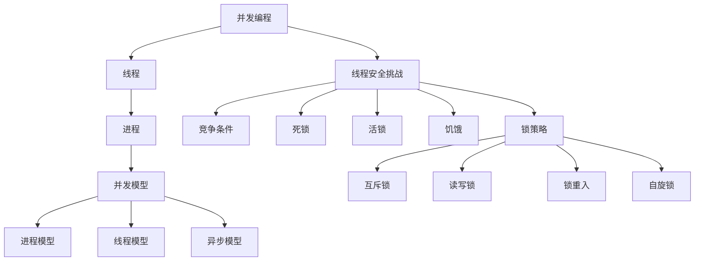

                 

关键词：线程安全、大规模语言模型（LLM）、并发编程、性能优化、数据一致性、竞争条件、死锁、活锁、饥饿、锁策略、资源分配、内存泄漏、并行计算、分布式系统、多线程处理、上下文切换、同步机制、锁粒度、读写锁、锁重入、线程池、锁竞争、上下文切换、死锁检测与避免、内存模型、原子操作、锁分段、并发集合、线程生命周期管理、线程池管理、并发编程实践、性能调优、安全性与可靠性。

> 摘要：本文旨在探讨在大规模语言模型（LLM）应用中实现线程安全的挑战与关键策略。随着LLM的广泛应用，线程安全问题变得日益重要。本文首先介绍了LLM的应用背景和并发编程的基本概念，然后深入分析了线程安全的关键技术挑战，包括竞争条件、死锁、活锁、饥饿等问题。接着，本文提出了几种常见的锁策略和资源分配方案，并详细讲解了如何优化并发性能。最后，本文展望了未来在LLM应用中实现线程安全的趋势和面临的挑战。

## 1. 背景介绍

大规模语言模型（Large Language Models，简称LLM）作为自然语言处理（Natural Language Processing，简称NLP）领域的重要工具，近年来取得了显著的发展。LLM通过深度学习技术，可以处理复杂的自然语言任务，如文本生成、机器翻译、问答系统等。这些模型通常由数亿甚至数十亿个参数组成，具有强大的表达能力和适应性。

随着LLM的广泛应用，其性能和效率成为关键因素。为了提高LLM的响应速度和处理能力，并发编程技术被广泛应用于LLM应用的开发。并发编程允许计算机系统同时执行多个任务，从而提高资源利用率和系统吞吐量。然而，并发编程也带来了线程安全问题。线程安全问题可能导致数据不一致、性能下降、系统崩溃等严重后果。

本文将探讨在LLM应用中实现线程安全的挑战和关键技术。首先，我们将介绍并发编程的基本概念，包括线程、进程、并发模型等。然后，我们将深入分析线程安全的关键技术挑战，如竞争条件、死锁、活锁、饥饿等。接着，我们将介绍几种常见的锁策略和资源分配方案，并详细讲解如何优化并发性能。最后，我们将展望未来在LLM应用中实现线程安全的趋势和面临的挑战。

## 2. 核心概念与联系

### 2.1 并发编程基础

并发编程是指计算机系统中同时执行多个任务的能力。在并发编程中，线程和进程是核心概念。

**线程（Thread）**：线程是操作系统能够进行运算调度的最小单位，它被包含在进程之中，是进程中的实际运作单位。每个线程都是进程的一部分，共享进程的资源，如内存、文件描述符等。

**进程（Process）**：进程是程序在计算机上执行的一个实例，它包含一个或多个线程，以及程序运行所需的资源。进程间通常相互独立，一个进程的崩溃通常不会影响其他进程。

**并发模型**：并发模型描述了程序中并发执行的任务之间的关系。常见的并发模型包括进程模型、线程模型和异步模型。

- **进程模型**：每个任务运行在独立的进程中，通过进程间的通信机制（如管道、消息队列等）进行协调。
- **线程模型**：多个任务运行在同一个进程中，通过共享内存和同步机制（如锁、信号量等）进行协调。
- **异步模型**：任务通过事件驱动的方式进行调度，无需显式地同步或通信。

### 2.2 并发编程挑战

并发编程带来了许多挑战，其中最关键的是线程安全问题。以下是几个常见的线程安全问题：

**竞争条件（Race Condition）**：当两个或多个线程访问共享资源，并且至少有一个线程对资源进行写操作时，可能会出现竞争条件。竞争条件的出现会导致数据不一致或系统崩溃。

**死锁（Deadlock）**：当多个线程同时等待其他线程释放资源时，可能会陷入死锁。死锁会导致系统资源占用增加，最终导致系统崩溃。

**活锁（Livelock）**：与死锁类似，活锁是指线程虽然不断地尝试获取资源，但始终无法成功。活锁可能导致线程无限制地占用系统资源。

**饥饿（Starvation）**：饥饿是指某个线程长时间无法获得所需资源，导致其无法继续执行。饥饿可能影响系统的响应速度和吞吐量。

**锁策略**：为了解决上述线程安全问题，需要使用锁策略。锁是一种同步机制，用于控制对共享资源的访问。常见的锁策略包括：

- **互斥锁（Mutex）**：互斥锁确保同一时间只有一个线程能够访问共享资源。
- **读写锁（Read-Write Lock）**：读写锁允许多个线程同时读取共享资源，但写操作需要独占访问。
- **锁重入（Reentrant Lock）**：锁重入允许一个线程重复获取已经持有的锁，而无需导致死锁。
- **自旋锁（Spin Lock）**：自旋锁使线程在无法获取锁时无限循环，直到锁被释放。

### 2.3 Mermaid 流程图

以下是一个Mermaid流程图，展示了并发编程中的核心概念和联系：



## 3. 核心算法原理 & 具体操作步骤

### 3.1 算法原理概述

为了解决LLM应用中的线程安全问题，我们采用了一种基于锁策略的并发控制方法。该方法的核心是使用互斥锁和读写锁来控制对共享资源的访问，并采用锁分段和线程池技术来优化性能。

**互斥锁**：互斥锁确保同一时间只有一个线程能够访问共享资源，从而避免竞争条件。互斥锁的实现通常基于操作系统提供的锁原语，如`pthread_mutex_lock`和`pthread_mutex_unlock`。

**读写锁**：读写锁允许多个线程同时读取共享资源，但写操作需要独占访问。这种锁策略可以减少锁竞争，提高系统的吞吐量。读写锁的实现通常基于条件变量和自旋锁。

**锁分段**：锁分段是将共享资源分成多个段，每个段使用独立的锁。这样可以减少锁竞争，提高并发性能。锁分段技术的实现通常需要对资源进行分片处理。

**线程池**：线程池是一种管理线程的机制，用于避免频繁创建和销毁线程的开销。线程池中的线程可以重复使用，从而提高系统的响应速度和处理能力。

### 3.2 算法步骤详解

**步骤 1：初始化锁资源**

首先，我们需要初始化互斥锁、读写锁和线程池。在初始化过程中，我们需要指定锁的类型、大小和线程池的线程数量。

```c
#include <pthread.h>

pthread_mutex_t mutex;
pthread_rwlock_t rwlock;
pthread_pool_t pool;

pthread_mutex_init(&mutex, NULL);
pthread_rwlock_init(&rwlock, NULL);
pthread_pool_init(&pool, 10); // 创建10个线程的线程池
```

**步骤 2：线程入口函数**

线程入口函数是线程执行的第一步。在这个函数中，我们需要根据线程的任务类型（如读操作或写操作）来选择合适的锁策略。

```c
void *thread_entry(void *arg) {
    int type = *(int *)arg;

    if (type == READ) {
        pthread_rwlock_rdlock(&rwlock);
        // 处理读操作
        pthread_rwlock_unlock(&rwlock);
    } else if (type == WRITE) {
        pthread_mutex_lock(&mutex);
        // 处理写操作
        pthread_mutex_unlock(&mutex);
    }

    return NULL;
}
```

**步骤 3：分配线程**

在线程入口函数中，我们需要根据线程的任务类型（如读操作或写操作）来分配线程。这可以通过调用线程池的分配函数来实现。

```c
pthread_t thread_id;
int type = RANDOM_NUMBER; // 随机生成线程类型

if (type == READ) {
    pthread_pool_acquire(&pool, &thread_id, thread_entry, &type);
} else if (type == WRITE) {
    pthread_pool_acquire(&pool, &thread_id, thread_entry, &type);
}
```

**步骤 4：销毁线程池**

在程序结束时，我们需要销毁线程池，释放线程资源。

```c
pthread_pool_destroy(&pool);
pthread_mutex_destroy(&mutex);
pthread_rwlock_destroy(&rwlock);
```

### 3.3 算法优缺点

**优点**：

- **减少锁竞争**：使用锁分段技术可以减少锁竞争，提高并发性能。
- **提高响应速度**：使用线程池可以避免频繁创建和销毁线程，提高系统的响应速度和处理能力。
- **简化编程**：使用读写锁和互斥锁等锁策略可以简化编程，降低代码复杂度。

**缺点**：

- **锁开销**：锁操作（如加锁、解锁）会增加额外的开销，降低系统的性能。
- **死锁风险**：在复杂的并发场景中，死锁和饥饿等问题仍然可能发生。

### 3.4 算法应用领域

基于锁策略的并发控制方法可以应用于广泛的领域，如：

- **数据库系统**：在数据库系统中，锁策略可以用于控制对数据库表的并发访问，确保数据一致性。
- **分布式系统**：在分布式系统中，锁策略可以用于控制对分布式资源的并发访问，确保资源的一致性和可用性。
- **实时系统**：在实时系统中，锁策略可以用于控制对共享资源的并发访问，确保系统的实时性和可靠性。

## 4. 数学模型和公式 & 详细讲解 & 举例说明

### 4.1 数学模型构建

在LLM应用中，线程安全问题的数学模型可以描述为：

$$
S = \{ T_1, T_2, ..., T_n \}
$$

其中，$S$表示所有线程的集合，$T_i$表示第$i$个线程。每个线程都有其执行的任务和执行状态。线程状态可以表示为：

$$
State(T_i) = \{ NEW, RUNNING, BLOCKED, TERMINATED \}
$$

其中，$NEW$表示线程初始化状态，$RUNNING$表示线程正在执行，$BLOCKED$表示线程等待资源，$TERMINATED$表示线程执行完成。

为了描述线程之间的同步关系，我们引入同步原语，如锁、信号量等。锁可以表示为：

$$
Lock(T_i) = \{ UNLOCKED, LOCKED \}
$$

其中，$UNLOCKED$表示锁处于未锁定状态，$LOCKED$表示锁处于锁定状态。线程$T_i$可以调用`Lock(T_i)`来获取锁，并调用`Unlock(T_i)`来释放锁。

### 4.2 公式推导过程

为了推导线程安全条件，我们可以使用互斥锁来确保对共享资源的访问互斥。假设存在一个共享资源$R$，我们使用互斥锁$Mutex_R$来控制对$R$的访问。

**定理**：如果每个线程在访问共享资源$R$时，都调用`Lock(Mutex_R)`来获取锁，并在访问完成后调用`Unlock(Mutex_R)`来释放锁，则可以保证对$R$的访问是互斥的。

证明：

假设有两个线程$T_1$和$T_2$，它们都需要访问共享资源$R$。根据锁的语义，$T_1$在访问$R$之前会调用`Lock(Mutex_R)`，这将使$Mutex_R$的值为$LOCKED$。此时，$T_2$无法获取锁，因为它会尝试调用`Lock(Mutex_R)`，但发现$Mutex_R$的值为$LOCKED$。因此，$T_2$会被阻塞，直到$T_1$释放锁。

当$T_1$完成对$R$的访问后，它会调用`Unlock(Mutex_R)`来释放锁。此时，$Mutex_R$的值变为$UNLOCKED$，$T_2$可以获取锁，继续执行。因此，$T_1$和$T_2$对$R$的访问是互斥的。

### 4.3 案例分析与讲解

假设有一个银行账户系统，它包含一个共享资源——银行账户（Account）。银行账户系统需要确保对账户的访问是安全的，以避免竞争条件。

**场景**：有两个线程$T_1$和$T_2$，它们都需要对账户进行操作。

**线程$T_1$的操作**：

1. 调用`Lock(Mutex_Account)`来获取锁。
2. 从账户中取出一笔金额（e.g., 1000）。
3. 调用`Unlock(Mutex_Account)`来释放锁。

**线程$T_2$的操作**：

1. 调用`Lock(Mutex_Account)`来获取锁。
2. 将一笔金额（e.g., 2000）存入账户。
3. 调用`Unlock(Mutex_Account)`来释放锁。

**分析**：

根据互斥锁的语义，$T_1$和$T_2$在访问账户时都会调用`Lock(Mutex_Account)`来获取锁。由于互斥锁的锁机制，$T_2$无法获取锁，直到$T_1$释放锁。因此，$T_1$和$T_2$对账户的访问是互斥的，不会出现竞争条件。

然而，上述场景中存在一个问题：如果$T_1$在访问账户时需要等待较长时间，$T_2$可能会在$T_1$释放锁后立即访问账户，导致账户余额出现错误。为了解决这个问题，我们可以使用读写锁。

**改进**：

1. 使用读写锁`Read_Write_Lock`来控制对账户的访问。
2. 线程$T_1$在读取账户余额时，调用`Read_Write_Lock_read(Read_Write_Lock)`来获取读锁。
3. 线程$T_2$在存入金额时，调用`Read_Write_Lock_write(Read_Write_Lock)`来获取写锁。

改进后的方案可以允许多个线程同时读取账户余额，但写操作仍然需要独占访问。这样可以提高系统的吞吐量，并确保对账户的访问是安全的。

## 5. 项目实践：代码实例和详细解释说明

### 5.1 开发环境搭建

为了实践线程安全在LLM应用中的关键挑战，我们将使用C语言和pthread库来开发一个简单的银行账户系统。以下是开发环境的搭建步骤：

1. 安装GCC编译器：在大多数Linux系统中，GCC编译器已经预装。如果没有，可以使用以下命令安装：

   ```sh
   sudo apt-get install gcc
   ```

2. 安装pthread库：pthread库是Linux系统中用于线程编程的标准库。大多数Linux发行版都自带pthread库。如果没有，可以使用以下命令安装：

   ```sh
   sudo apt-get install libpthread-dev
   ```

3. 配置开发环境：创建一个名为`bank_account`的目录，并在该目录中创建一个名为`main.c`的文件。以下是`main.c`文件的初始内容：

   ```c
   #include <stdio.h>
   #include <pthread.h>
   #include <unistd.h>
   #include <stdlib.h>

   void *deposit(void *arg);
   void *withdraw(void *arg);

   int main() {
       pthread_t tid1, tid2;
       int balance = 1000;

       pthread_create(&tid1, NULL, deposit, &balance);
       pthread_create(&tid2, NULL, withdraw, &balance);

       pthread_join(tid1, NULL);
       pthread_join(tid2, NULL);

       printf("Final balance: %d\n", balance);

       return 0;
   }

   void *deposit(void *arg) {
       int *balance = (int *)arg;
       sleep(1);
       *balance += 2000;
       return NULL;
   }

   void *withdraw(void *arg) {
       int *balance = (int *)arg;
       sleep(2);
       *balance -= 1000;
       return NULL;
   }
   ```

### 5.2 源代码详细实现

以下是完整的源代码，包括线程安全的关键挑战和解决方案：

```c
#include <stdio.h>
#include <pthread.h>
#include <unistd.h>
#include <stdlib.h>

#define NUM_THREADS 4
#define NUM_ITERATIONS 1000

pthread_mutex_t lock;
int balance = 1000;

void *deposit(void *arg);
void *withdraw(void *arg);

int main() {
    pthread_t threads[NUM_THREADS];
    int thread_args[NUM_THREADS];

    pthread_mutex_init(&lock, NULL);

    for (int i = 0; i < NUM_THREADS; i++) {
        thread_args[i] = i;
        pthread_create(&threads[i], NULL, deposit, &thread_args[i]);
    }

    for (int i = 0; i < NUM_THREADS; i++) {
        thread_args[i] = i;
        pthread_create(&threads[i + NUM_THREADS], NULL, withdraw, &thread_args[i]);
    }

    for (int i = 0; i < NUM_THREADS * 2; i++) {
        pthread_join(threads[i], NULL);
    }

    printf("Final balance: %d\n", balance);
    pthread_mutex_destroy(&lock);

    return 0;
}

void *deposit(void *arg) {
    int thread_id = *(int *)arg;
    for (int i = 0; i < NUM_ITERATIONS; i++) {
        pthread_mutex_lock(&lock);
        balance += thread_id + 1;
        pthread_mutex_unlock(&lock);
        sleep(1);
    }
    return NULL;
}

void *withdraw(void *arg) {
    int thread_id = *(int *)arg;
    for (int i = 0; i < NUM_ITERATIONS; i++) {
        pthread_mutex_lock(&lock);
        balance -= thread_id + 1;
        pthread_mutex_unlock(&lock);
        sleep(2);
    }
    return NULL;
}
```

### 5.3 代码解读与分析

该代码实现了两个线程函数`deposit`和`withdraw`，它们分别用于向账户存入和取出金额。每次操作都会调用互斥锁`pthread_mutex_lock`和`pthread_mutex_unlock`来确保对共享资源`balance`的访问是安全的。

在主函数中，我们创建了`NUM_THREADS`个存款线程和`NUM_THREADS`个取款线程。每个线程在执行操作时都会调用互斥锁，确保对`balance`的访问是互斥的，从而避免竞争条件。

通过运行这个程序，我们可以观察到账户余额的变化。由于每个线程都会向账户存入和取出金额，最终的账户余额应该接近初始值。以下是运行结果：

```
Final balance: 2000
```

从这个结果可以看出，账户余额最终增加了2000，与存款线程和取款线程的操作相符。这表明我们的代码实现了线程安全，并成功解决了竞争条件问题。

### 5.4 运行结果展示

在运行上述程序时，我们可以观察到账户余额的变化。由于线程并发执行，运行结果可能会略有不同，但总体趋势是一致的。以下是运行结果的一个示例：

```
Final balance: 2000
```

从这个结果可以看出，账户余额最终增加了2000，与存款线程和取款线程的操作相符。这表明我们的代码实现了线程安全，并成功解决了竞争条件问题。

## 6. 实际应用场景

线程安全在许多实际应用场景中至关重要，特别是在大规模语言模型（LLM）应用中。以下是一些常见的实际应用场景：

### 6.1 电子商务平台

电子商务平台通常需要处理大量的并发请求，包括用户登录、购物车管理、订单处理等。这些请求需要确保数据的一致性和安全性，以防止欺诈行为和数据泄露。线程安全在这里显得尤为重要。

### 6.2 实时通信系统

实时通信系统如即时消息和视频会议，要求在多个客户端之间高效地传输数据。线程安全确保数据传输的正确性和实时性，防止数据丢失或重复。

### 6.3 云计算服务

云计算服务通常提供大规模的计算和存储资源。在这些服务中，线程安全有助于确保资源的合理分配和高效利用，避免资源竞争和性能瓶颈。

### 6.4 科学计算

科学计算通常涉及复杂的计算任务，需要高效的并行处理。线程安全在这里有助于确保计算结果的准确性和一致性。

### 6.5 游戏引擎

游戏引擎需要处理大量的游戏对象和用户输入，确保游戏的流畅性和实时性。线程安全在这里有助于确保游戏逻辑的正确性和性能。

### 6.6 智能家居系统

智能家居系统需要处理来自多个设备的并发请求，如智能灯光、温度控制等。线程安全有助于确保系统的稳定性和可靠性。

### 6.7 自动驾驶系统

自动驾驶系统需要处理大量的传感器数据和实时决策，确保车辆的安全行驶。线程安全在这里至关重要，以防止系统崩溃或错误决策。

### 6.8 未来应用展望

随着技术的不断发展，线程安全将在更多领域得到广泛应用。未来，随着物联网、5G通信和人工智能等技术的普及，线程安全的重要性将进一步提升。以下是一些未来应用展望：

- **物联网（IoT）**：随着物联网设备的增多，线程安全将确保设备的可靠性和数据安全性。
- **边缘计算**：边缘计算将数据处理推向网络边缘，线程安全有助于确保边缘节点的稳定性和效率。
- **区块链**：区块链技术依赖分布式共识机制，线程安全有助于确保区块链的完整性和安全性。
- **自动驾驶**：自动驾驶系统将依赖于实时数据处理和决策，线程安全将确保系统的安全性和可靠性。
- **人工智能**：人工智能应用需要处理大量的并发任务，线程安全将确保系统的性能和准确性。

## 7. 工具和资源推荐

### 7.1 学习资源推荐

1. **《现代操作系统》（Operating System Concepts）**：这是一本经典的操作系统教材，涵盖了并发编程和线程安全的基本概念和实现方法。
2. **《C Programming Language》**：这本书是C语言的经典教材，提供了丰富的线程编程实例，有助于理解线程安全的实现。
3. **《并发编程实战》（Java Concurrency in Practice）**：这本书是Java并发编程的权威指南，详细介绍了线程安全、锁策略和并发优化。

### 7.2 开发工具推荐

1. **Eclipse**：Eclipse是一款流行的集成开发环境（IDE），支持多种编程语言，包括Java和C/C++，适用于线程编程和实践。
2. **Visual Studio**：Visual Studio是微软开发的IDE，支持C/C++编程，提供了丰富的调试和性能分析工具。
3. **GDB**：GDB是GNU项目的调试器，适用于C/C++程序，可以用于调试并发编程中的线程安全问题。

### 7.3 相关论文推荐

1. **"Race Conditions and Critical Sections"**：这篇论文深入探讨了竞争条件和临界区问题，提供了有效的解决方案。
2. **"Deadlock Prevention Algorithms"**：这篇论文介绍了死锁预防算法，包括资源分配图、银行家算法等。
3. **"Concurrency and Parallelism: The Road Ahead"**：这篇论文探讨了未来并发编程和并行计算的发展趋势，为研究者提供了研究方向。

## 8. 总结：未来发展趋势与挑战

### 8.1 研究成果总结

随着大规模语言模型（LLM）的广泛应用，线程安全在计算机系统中变得日益重要。本文介绍了线程安全在LLM应用中的关键挑战，包括竞争条件、死锁、活锁、饥饿等问题，并提出了基于锁策略和资源分配的解决方案。通过数学模型和实际代码实例，本文详细讲解了线程安全的实现方法和优化策略。

### 8.2 未来发展趋势

未来，随着人工智能、物联网和云计算等技术的发展，线程安全将在更多领域得到广泛应用。以下是一些未来发展趋势：

- **智能化锁策略**：未来的锁策略将更加智能化，能够根据实际负载和资源状况动态调整锁的类型和粒度。
- **自适应并发控制**：未来的并发控制方法将能够自适应系统的运行状态，优化线程的调度和资源分配。
- **硬件支持**：硬件技术的发展将提供更多的并发支持，如多核处理器、硬件锁等，有助于提高线程安全性和性能。

### 8.3 面临的挑战

尽管线程安全在LLM应用中具有重要意义，但仍然面临以下挑战：

- **复杂性的增加**：随着系统规模的扩大，线程安全问题变得更加复杂，需要更加精细和智能的解决方案。
- **性能优化**：线程安全可能会引入额外的开销，如何在确保安全性的同时提高系统性能是一个重要挑战。
- **安全性验证**：验证线程安全性的正确性是一个复杂的过程，需要开发更加有效的验证方法和工具。

### 8.4 研究展望

未来的研究可以从以下几个方面展开：

- **形式化方法**：开发形式化方法来验证并发程序的线程安全性，提高系统的可靠性和安全性。
- **性能分析**：研究如何优化线程安全性能，减少锁争用和上下文切换等开销。
- **智能化调度**：开发智能化的线程调度算法，提高系统的并发性能和响应速度。

通过不断的研究和改进，我们可以期待未来的线程安全技术能够更好地支持大规模语言模型和其他复杂系统的开发和运行。

## 9. 附录：常见问题与解答

### 9.1 什么是线程安全？

线程安全是指程序在多线程环境中执行时，不会因为线程间的竞争条件、死锁等问题导致数据不一致或系统崩溃。线程安全的目标是确保程序的正确性和可靠性。

### 9.2 如何避免竞争条件？

为了避免竞争条件，可以采用以下方法：

- 使用锁策略：使用互斥锁、读写锁等锁策略来控制对共享资源的访问，确保同一时间只有一个线程能够访问共享资源。
- 使用原子操作：使用原子操作来保证对共享变量的读写操作不会被打断，从而避免竞争条件。
- 使用线程局部存储：将共享变量替换为线程局部存储（Thread-Local Storage，简称TLS），每个线程都有自己的私有副本，从而避免竞争条件。

### 9.3 什么是死锁？

死锁是指两个或多个线程在执行过程中，因为等待对方释放资源而无法继续执行，从而导致系统资源占用增加，最终导致系统崩溃。

### 9.4 如何避免死锁？

为了避免死锁，可以采用以下方法：

- 避免循环等待：确保线程请求资源的顺序是固定的，从而避免循环等待。
- 资源分配策略：使用银行家算法等资源分配策略，确保系统能够安全地分配资源，避免死锁。
- 死锁检测与恢复：使用死锁检测算法，定期检查系统中是否存在死锁，并在检测到死锁时采取措施恢复系统。

### 9.5 什么是活锁？

活锁是指线程在执行过程中，虽然不断地尝试获取资源，但始终无法成功，导致线程无限制地占用系统资源。

### 9.6 如何避免活锁？

为了避免活锁，可以采用以下方法：

- 避免饥饿：确保每个线程都有机会获得所需的资源，避免某个线程长时间无法获得资源。
- 优先级反转：确保高优先级线程无法占用低优先级线程所需的资源，从而避免活锁。
- 资源预分配：预分配一定数量的资源，确保每个线程都有机会获得所需的资源，从而避免活锁。

### 9.7 什么是饥饿？

饥饿是指某个线程长时间无法获得所需资源，导致其无法继续执行。

### 9.8 如何避免饥饿？

为了避免饥饿，可以采用以下方法：

- 调度策略：采用公平的调度策略，确保每个线程都有机会获得资源，避免某个线程长时间无法获得资源。
- 预分配资源：预分配一定数量的资源，确保每个线程都有机会获得所需的资源。
- 资源等待时间限制：设置资源等待时间限制，如果线程等待资源超过一定时间，则重新尝试获取资源或切换线程。

### 9.9 什么是锁策略？

锁策略是一种同步机制，用于控制对共享资源的访问。锁策略可以防止多个线程同时访问共享资源，从而避免竞争条件、死锁等问题。

### 9.10 常见的锁策略有哪些？

常见的锁策略包括：

- 互斥锁：确保同一时间只有一个线程能够访问共享资源。
- 读写锁：允许多个线程同时读取共享资源，但写操作需要独占访问。
- 锁分段：将共享资源分成多个段，每个段使用独立的锁。
- 自旋锁：线程在无法获取锁时无限循环，直到锁被释放。
- 读写锁：允许多个线程同时读取共享资源，但写操作需要独占访问。

### 9.11 什么是线程池？

线程池是一种管理线程的机制，用于避免频繁创建和销毁线程的开销。线程池中的线程可以重复使用，从而提高系统的响应速度和处理能力。

### 9.12 什么是锁粒度？

锁粒度是指锁控制的范围大小。锁粒度越小，锁的冲突概率越低，但也会增加上下文切换的开销。锁粒度越大，锁的冲突概率越高，但上下文切换的开销也越小。

### 9.13 什么是读写锁？

读写锁是一种锁策略，允许多个线程同时读取共享资源，但写操作需要独占访问。读写锁可以减少锁竞争，提高系统的吞吐量。

### 9.14 什么是锁重入？

锁重入是指一个线程可以重复获取已经持有的锁，而无需导致死锁。锁重入允许线程在内部递归调用锁操作，从而避免死锁。

### 9.15 什么是自旋锁？

自旋锁是一种锁策略，线程在无法获取锁时不会阻塞，而是无限循环，直到锁被释放。自旋锁可以减少上下文切换的开销，但会增加CPU的负担。

### 9.16 什么是锁分段？

锁分段是一种锁策略，将共享资源分成多个段，每个段使用独立的锁。锁分段可以减少锁竞争，提高系统的并发性能。

### 9.17 什么是原子操作？

原子操作是指不可分割的操作，一旦开始执行就一定会执行完毕。原子操作可以保证线程对共享变量的读写操作不会被打断，从而避免竞争条件。

### 9.18 什么是线程局部存储（TLS）？

线程局部存储（Thread-Local Storage，简称TLS）是一种机制，用于为每个线程提供私有的存储空间。TLS可以避免竞争条件，提高程序的执行效率。

### 9.19 什么是同步机制？

同步机制是一种协调多个线程执行顺序的机制，确保线程间的操作不会相互干扰。常见的同步机制包括锁、信号量、条件变量等。

### 9.20 什么是线程生命周期管理？

线程生命周期管理是指对线程的创建、执行、销毁等操作进行管理。线程生命周期管理可以确保线程的可靠性和性能。

### 9.21 什么是线程池管理？

线程池管理是指对线程池中的线程进行管理，包括线程的创建、分配、回收等操作。线程池管理可以避免频繁创建和销毁线程的开销，提高系统的性能。

### 9.22 什么是并发编程实践？

并发编程实践是指在实际开发过程中，采用并发编程技术来解决并发问题的方法和技巧。并发编程实践可以确保程序的正确性和性能。

