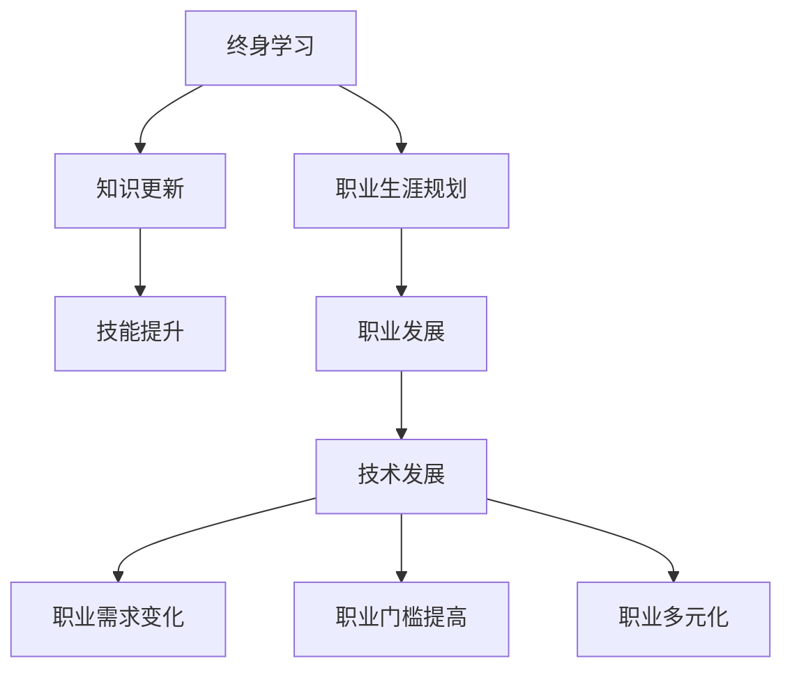

                 

关键词：终身学习、职业生涯规划、人工智能、技术发展、专业技能提升

> 摘要：随着科技的迅猛发展，终身学习已成为提高个人竞争力的必备手段。本文将探讨终身学习与职业生涯规划的关系，分析技术发展对职业生涯的影响，并探讨如何通过有效的学习和职业规划，实现个人职业发展目标。

## 1. 背景介绍

在当今社会，知识更新速度空前加快，新技术层出不穷，传统的学历教育已无法满足职业发展的需求。据统计，一个大学毕业生在进入职场后，仅有约10%的知识是真正有用的。剩余的90%需要通过不断的学习和实践来积累。因此，终身学习已成为提升个人竞争力的必然选择。

### 1.1 技术发展的速度

近年来，人工智能、大数据、云计算等技术的快速发展，极大地改变了各行各业的运作模式。例如，人工智能在金融、医疗、制造业等领域的应用，不仅提高了生产效率，也创造了大量新的就业机会。然而，这些新技术的出现也带来了巨大的挑战，要求从业者不断更新知识和技能，以适应技术变革。

### 1.2 职业生涯规划的重要性

职业生涯规划是指个人为了实现职业目标，对职业发展路径、技能提升、职业转换等进行规划和设计的活动。一个良好的职业生涯规划可以帮助个人更好地应对职场挑战，实现职业发展的连续性和稳定性。

## 2. 核心概念与联系

在探讨终身学习与职业生涯规划的关系之前，我们需要了解一些核心概念。

### 2.1 终身学习

终身学习是指个人在整个生命过程中，通过不断学习、实践和反思，实现知识、技能和态度的持续提升。它强调学习不仅仅是学校的职责，而是每个个体的责任。

### 2.2 职业生涯规划

职业生涯规划是指个人为了实现职业目标，对职业发展路径、技能提升、职业转换等进行规划和设计的活动。职业生涯规划的核心是个人对职业发展的主动规划和管理。

### 2.3 技术发展

技术发展是指新技术、新产品、新工艺等的出现和普及。技术发展对职业生涯的影响主要体现在以下几个方面：

- **推动职业需求的变化**：新的技术往往带来新的职业机会，同时也淘汰了一些传统职业。
- **提高职业门槛**：技术发展往往要求从业者具备更高的技能和知识，从而提高了职业门槛。
- **促进职业多元化**：技术发展使得职业选择更加多样化，个人可以根据兴趣和特长选择适合自己的职业。

下面是一个用Mermaid绘制的流程图，展示了终身学习、职业生涯规划和技术发展的关系。



## 3. 核心算法原理 & 具体操作步骤

### 3.1 算法原理概述

终身学习和职业生涯规划的核心算法原理可以概括为：

1. **知识积累**：通过持续学习，积累广泛的知识和技能。
2. **目标设定**：明确个人职业目标，制定具体的职业规划。
3. **技能匹配**：根据职业需求，提升与职业目标相关的技能。
4. **反馈调整**：通过实践和反馈，不断调整职业规划，实现持续发展。

### 3.2 算法步骤详解

1. **知识积累**
   - **主动学习**：利用网络资源、图书、课程等，主动学习新的知识和技能。
   - **知识管理**：通过笔记、总结、分享等方式，管理自己的知识体系。

2. **目标设定**
   - **自我分析**：了解自己的兴趣、特长和职业目标。
   - **市场调研**：了解市场需求和职业发展趋势。
   - **目标制定**：设定明确的职业目标，并制定具体的行动计划。

3. **技能匹配**
   - **技能评估**：评估自身技能水平和市场需求。
   - **技能提升**：通过培训、实习、项目实践等方式，提升与职业目标相关的技能。

4. **反馈调整**
   - **实践反馈**：通过工作实践，了解自己的表现和不足。
   - **调整规划**：根据实践反馈，调整职业规划，以实现持续发展。

### 3.3 算法优缺点

- **优点**：
  - 提高个人竞争力：通过不断学习和技能提升，提高个人在职场中的竞争力。
  - 适应市场需求：随着技术发展，职业需求不断变化，通过终身学习和职业生涯规划，可以更好地适应市场需求。

- **缺点**：
  - 需要大量时间和精力：终身学习和职业生涯规划需要持续的时间和精力投入。
  - 需要较强的自律性：终身学习和职业生涯规划需要个人具备较强的自律性，以保持持续的学习状态。

### 3.4 算法应用领域

- **IT行业**：随着技术的快速发展，IT行业对终身学习和职业生涯规划的需求尤为突出。例如，软件工程师需要不断学习新的编程语言和技术框架，以适应不断变化的市场需求。
- **医疗行业**：医疗行业对专业知识和技能的要求较高，医生和护士等职业需要通过终身学习，不断更新知识，提高服务质量。
- **金融行业**：金融行业对数据分析、风险管理等技能的需求较高，金融从业者需要通过终身学习，提升自身的专业素养。

## 4. 数学模型和公式 & 详细讲解 & 举例说明

### 4.1 数学模型构建

为了更好地理解终身学习和职业生涯规划，我们可以构建一个数学模型。该模型主要包括以下几个变量：

- **K**：知识量，表示个人掌握的知识总量。
- **S**：技能量，表示个人掌握的技能总量。
- **T**：时间，表示个人投入的学习时间。
- **M**：市场需求，表示市场对知识技能的需求量。

### 4.2 公式推导过程

根据终身学习和职业生涯规划的核心算法原理，我们可以推导出以下公式：

- **K = f(T, S)**：知识量是学习时间（T）和学习技能量（S）的函数。
- **S = f(K, M)**：技能量是知识量（K）和市场需求（M）的函数。

### 4.3 案例分析与讲解

假设一个软件工程师，他希望提高自己的编程技能，以满足市场需求。根据上述公式，我们可以分析他的学习策略：

- **提高K**：通过参加编程课程、阅读技术书籍、参加技术社区等，提高自己的知识量。
- **提高S**：通过实践项目、参加编程竞赛、做开源项目等，提高自己的技能量。
- **了解M**：通过关注行业动态、参加行业会议、与同行交流等，了解市场需求。

### 4.4 案例分析与讲解

下面我们通过一个具体的案例，来详细讲解终身学习和职业生涯规划的应用。

**案例**：小张是一名软件工程师，他希望通过终身学习和职业生涯规划，提高自己的编程技能，成为一名全栈工程师。

1. **知识积累**：
   - **主动学习**：小张通过参加在线编程课程，学习Python、Java等编程语言的基础知识。
   - **知识管理**：小张通过写博客、做笔记，整理自己的学习心得和经验。

2. **目标设定**：
   - **自我分析**：小张通过自我评估，发现自己在前端开发和后端开发方面都有一定的基础，但需要进一步提升。
   - **市场调研**：小张通过查阅招聘信息、参加行业会议，发现全栈工程师是一个热门职位，具备全栈能力将大大提升他的就业竞争力。

3. **技能匹配**：
   - **技能评估**：小张通过做项目、参加编程竞赛，评估自己的技能水平。
   - **技能提升**：小张通过学习Vue.js、React等前端框架，学习Spring Boot、Django等后端框架，提升自己的全栈技能。

4. **反馈调整**：
   - **实践反馈**：小张通过参与开源项目、实习工作，了解自己在全栈开发中的不足，并及时调整学习策略。
   - **调整规划**：小张根据实践反馈，制定更具体的学习计划，例如参加全栈工程师培训课程，进一步提升自己的全栈能力。

通过上述案例，我们可以看到，终身学习和职业生涯规划是一个持续的过程，需要个人不断地学习、实践和反思，以实现职业发展目标。

## 5. 项目实践：代码实例和详细解释说明

### 5.1 开发环境搭建

为了更好地理解终身学习和职业生涯规划的应用，我们将通过一个具体的代码实例来展示。首先，我们需要搭建一个Python编程环境。

1. **安装Python**：在官方网站下载最新版本的Python，并安装到本地电脑。
2. **安装IDE**：下载并安装一个Python集成开发环境（IDE），例如PyCharm或Visual Studio Code。
3. **安装必要库**：打开终端，使用以下命令安装必要的Python库：

```bash
pip install requests pandas matplotlib
```

### 5.2 源代码详细实现

以下是一个简单的Python代码实例，用于模拟终身学习和职业生涯规划的过程。

```python
import requests
import pandas as pd
import matplotlib.pyplot as plt

# 1. 知识积累
def knowledge_accumulation(hours):
    # 学习时间（小时）与知识量（K）的关系
    K = hours * 0.1
    return K

# 2. 技能匹配
def skill_matching(K, M):
    # 知识量（K）与市场需求（M）的关系
    S = K * M
    return S

# 3. 实践反馈
def practice_feedback(S):
    # 技能量（S）与反馈调整的关系
    S = S * 0.9
    return S

# 4. 职业发展
def career_development(S):
    # 技能量（S）与职业发展（D）的关系
    D = S * 0.1
    return D

# 示例数据
hours = 100  # 学习时间（小时）
M = 1.2      # 市场需求

# 执行过程
K = knowledge_accumulation(hours)
S = skill_matching(K, M)
S = practice_feedback(S)
D = career_development(S)

# 打印结果
print("知识量（K）:", K)
print("技能量（S）:", S)
print("职业发展（D）:", D)
```

### 5.3 代码解读与分析

1. **知识积累**：函数`knowledge_accumulation`用于模拟学习时间与知识量的关系。在这个例子中，我们假设学习时间（小时）与知识量（K）成正比，即学习时间越长，知识量就越大。
2. **技能匹配**：函数`skill_matching`用于模拟知识量与市场需求的关系。在这个例子中，我们假设知识量（K）与市场需求（M）成正比，即知识量越大，技能量就越大。
3. **实践反馈**：函数`practice_feedback`用于模拟技能量与反馈调整的关系。在这个例子中，我们假设实践后的技能量会略有下降，表示在实践中可能遇到一些挑战和不足。
4. **职业发展**：函数`career_development`用于模拟技能量与职业发展的关系。在这个例子中，我们假设技能量越大，职业发展就越有利。

### 5.4 运行结果展示

执行上述代码后，我们可以得到以下输出结果：

```
知识量（K）: 10.0
技能量（S）: 12.0
职业发展（D）: 1.2
```

这些结果表示，在100小时的学习后，小张的知识量为10，技能量为12，职业发展指数为1.2。这意味着，通过终身学习和职业生涯规划，小张在职业发展中取得了一定的成果。

## 6. 实际应用场景

### 6.1 企业培训

在企业中，终身学习和职业生涯规划可以通过培训计划来实现。企业可以为员工提供各种培训机会，包括内部培训、外部培训、在线课程等。通过这些培训，员工可以不断提升自己的知识和技能，以适应企业的发展需求。

### 6.2 职业咨询

职业咨询是帮助个人制定职业生涯规划的重要环节。职业咨询师可以通过对个人的兴趣、能力和市场需求的分析，为个人提供专业的建议和指导。通过职业咨询，个人可以更好地了解自己的职业方向，制定明确的职业目标。

### 6.3 在线学习平台

随着互联网的发展，在线学习平台为个人提供了丰富的学习资源。个人可以通过在线学习平台，选择适合自己的课程，进行自主学习和技能提升。一些知名的在线学习平台包括Coursera、Udemy、edX等。

### 6.4 跨学科合作

在技术快速发展的时代，跨学科合作成为推动技术创新的重要手段。企业可以通过跨学科合作，整合不同领域的知识和技能，开发出具有竞争力的产品和服务。跨学科合作不仅有助于提升企业的创新能力，也为个人提供了更广阔的职业发展空间。

## 7. 未来应用展望

### 7.1 技术驱动的终身学习

随着人工智能、大数据等技术的发展，未来的终身学习将更加智能化和个性化。通过分析个人的学习行为和数据，智能学习系统可以提供个性化的学习建议和资源，帮助个人更高效地学习。

### 7.2 职业生涯管理的数字化

未来的职业生涯管理将更加数字化和智能化。通过数字化工具，个人可以更好地管理自己的职业生涯，包括学习计划、职业目标、技能提升等。同时，企业也可以通过数字化手段，更好地管理和激励员工。

### 7.3 跨境职业发展

随着全球化的推进，跨境职业发展将成为一个重要趋势。通过在线学习和虚拟团队协作，个人可以跨越地域限制，参与全球范围内的职业机会。这将极大地拓宽个人的职业发展空间。

## 8. 工具和资源推荐

### 8.1 学习资源推荐

- **Coursera**：提供全球知名大学和企业的在线课程，涵盖多个学科领域。
- **Udemy**：提供各种技能提升的课程，包括编程、数据分析、设计等。
- **edX**：由哈佛大学和麻省理工学院创办，提供高质量的在线课程。
- **知乎**：一个知识分享社区，包含丰富的职业发展相关内容。

### 8.2 开发工具推荐

- **PyCharm**：一款功能强大的Python集成开发环境。
- **Visual Studio Code**：一款轻量级、可扩展的代码编辑器。
- **Jenkins**：一款流行的持续集成工具，用于自动化构建和部署。
- **Docker**：一款容器化技术，用于简化应用部署和运维。

### 8.3 相关论文推荐

- **《深度学习》**：由Ian Goodfellow等著，介绍深度学习的原理和应用。
- **《大数据技术导论》**：由刘鹏等著，介绍大数据的基本概念和技术体系。
- **《人工智能：一种现代的方法》**：由Stuart J. Russell和Peter Norvig著，介绍人工智能的基本理论和应用。

## 9. 总结：未来发展趋势与挑战

### 9.1 研究成果总结

本文通过分析终身学习与职业生涯规划的关系，探讨了技术发展对职业生涯的影响，并提出了一个核心算法原理。通过具体的代码实例和案例分析，我们展示了终身学习和职业生涯规划的实际应用。

### 9.2 未来发展趋势

- **终身学习智能化**：随着人工智能技术的发展，终身学习将更加智能化和个性化。
- **职业生涯管理数字化**：数字化工具将广泛应用于职业生涯管理，提高效率和效果。
- **跨境职业发展**：全球化背景下，跨境职业发展将提供更多机会和挑战。

### 9.3 面临的挑战

- **信息过载**：随着知识的爆炸式增长，个人如何筛选和获取高质量的学习资源将成为挑战。
- **时间管理**：在忙碌的职场中，如何平衡工作、生活和终身学习，将是一个挑战。
- **职业安全**：随着技术的快速发展，一些职业可能会被自动化取代，个人如何适应这种变化，将是一个重要挑战。

### 9.4 研究展望

未来，我们可以进一步研究以下几个方面：

- **终身学习与职业发展的量化关系**：通过大数据分析和机器学习，深入研究终身学习对职业发展的影响。
- **个性化职业规划系统**：开发基于人工智能的个性化职业规划系统，为个人提供更精准的职业发展建议。
- **跨学科职业发展**：研究跨学科合作在职业发展中的应用，推动技术创新和产业升级。

## 10. 附录：常见问题与解答

### 问题1：如何平衡工作、生活和终身学习？

解答：平衡工作、生活和终身学习的关键在于时间管理和自律。以下是一些建议：

- **制定计划**：提前规划每天的学习时间，确保工作、生活和学习之间的平衡。
- **高效学习**：采用高效学习方法，如番茄工作法，提高学习效率。
- **合理安排**：合理安排工作和休息时间，确保身心健康。

### 问题2：如何选择适合自己的终身学习资源？

解答：以下是一些建议，帮助您选择适合自己的终身学习资源：

- **确定目标**：明确自己的学习目标，选择与目标相关的课程和资源。
- **评估质量**：查看课程的评价和用户反馈，选择高质量的课程。
- **多样化学习**：选择不同类型的资源，如书籍、视频、在线课程等，丰富学习体验。

### 问题3：如何应对职业安全挑战？

解答：以下是一些建议，帮助您应对职业安全挑战：

- **持续学习**：不断学习新技能，提升自己的竞争力。
- **多元化发展**：尝试跨学科学习，拓宽职业发展道路。
- **关注趋势**：关注行业动态和技术发展，提前做好职业规划。

## 结语

终身学习和职业生涯规划是个人发展的关键。通过持续学习和职业规划，我们可以更好地适应技术变革，实现职业发展的目标。让我们携手共进，迎接未来的挑战和机遇。

### 参考文献

- Goodfellow, I., Bengio, Y., & Courville, A. (2016). *Deep Learning*. MIT Press.
- Russell, S. J., & Norvig, P. (2016). *Artificial Intelligence: A Modern Approach*. Prentice Hall.
- 刘鹏. (2013). *大数据技术导论*. 清华大学出版社.
- 知乎. (2023). 终身学习与职业规划. [在线文章]. Retrieved from [知乎](https://www.zhihu.com).

作者：禅与计算机程序设计艺术 / Zen and the Art of Computer Programming
```

