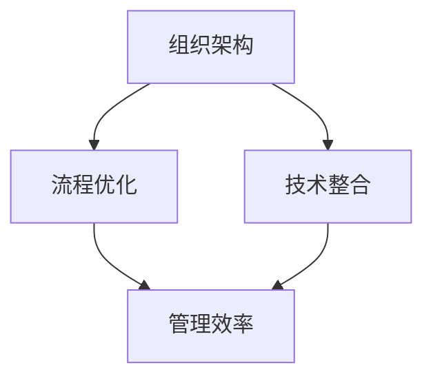

                 

关键词：管理理论、现代企业、创新应用、组织架构、流程优化、技术整合

> 摘要：本文深入探讨了经典管理理论在现代企业中的创新应用，通过分析组织架构、流程优化和技术整合等方面，揭示了如何将传统管理理念与当代信息技术相结合，以提升企业效率和竞争力。

## 1. 背景介绍

随着全球经济的发展和市场竞争的加剧，现代企业面临着前所未有的挑战。传统管理理论虽然为企业的管理提供了理论基础，但在快速变化的市场环境中，其局限性逐渐显现。现代企业需要更加灵活和高效的管理模式来适应不断变化的环境。因此，如何将经典管理理论与现代信息技术相结合，创新应用以提升企业竞争力，成为企业管理者和研究者共同关注的问题。

本文将从以下几个方面探讨经典管理理论在现代企业中的创新应用：

1. **组织架构的创新**：通过分析现代企业组织架构的特点，探讨如何利用信息技术优化组织结构，提高组织效率。
2. **流程优化的实践**：分析现代企业中常见的管理流程，探讨如何通过信息技术实现流程的自动化和优化。
3. **技术整合的策略**：探讨如何在企业内部整合多种技术，以实现资源的最大化利用和管理效率的提升。
4. **实际应用案例**：通过具体的企业案例，展示经典管理理论在现实中的应用效果。

## 2. 核心概念与联系

为了更好地理解经典管理理论在现代企业中的创新应用，我们需要明确几个核心概念：

- **组织架构**：企业的组织架构决定了企业的管理层次和运作方式，影响着企业的效率和创新能力。
- **流程优化**：流程优化是指通过分析和改进企业内部的工作流程，以提高效率和降低成本。
- **技术整合**：技术整合是指将多种信息技术集成到企业的日常运营中，以实现信息共享和协同工作。

下面是一个简单的 Mermaid 流程图，展示了这些核心概念之间的联系：



### 2.1 组织架构的演变

随着信息技术的快速发展，现代企业的组织架构也在不断演变。从传统的层级式架构到扁平化架构，再到基于项目的矩阵式架构，企业组织架构的变革旨在提高决策速度和响应能力。

#### 2.1.1 层级式架构

层级式架构是一种传统的组织架构，其特点是管理层级明确，决策权集中在高层。这种架构的优点是管理清晰，责任明确，但缺点是决策速度较慢，难以适应快速变化的市场环境。

#### 2.1.2 扁平化架构

扁平化架构通过减少管理层级，提高员工的参与度和决策的民主性。这种架构的优点是决策速度快，沟通效率高，但缺点是管理难度增加，对管理者的要求更高。

#### 2.1.3 矩阵式架构

矩阵式架构结合了层级式和扁平化架构的优点，通过项目团队的形式，实现了跨部门协同工作。这种架构的优点是资源利用率高，协同效果好，但缺点是管理复杂，容易出现权责不清的问题。

### 2.2 流程优化的方法

流程优化是企业提高效率和降低成本的关键。现代信息技术为流程优化提供了强大的支持，如工作流管理系统、流程自动化工具等。以下是几种常见的流程优化方法：

#### 2.2.1 工作流管理系统

工作流管理系统（Workflow Management System, WfMS）是一种用于自动化和管理业务流程的软件系统。通过工作流管理系统，企业可以定义、执行和监控业务流程，提高流程的规范性和效率。

#### 2.2.2 流程自动化工具

流程自动化工具（Process Automation Tools）如机器人流程自动化（Robotic Process Automation, RPA）和智能流程自动化（Intelligent Process Automation, IPA），可以通过模拟人类操作员的行为，自动化执行重复性高、规则性强的业务流程，减少人工操作，提高效率。

#### 2.2.3 数据分析和挖掘

数据分析和挖掘（Data Analysis and Mining）可以通过对大量业务数据进行深入分析，发现流程中的瓶颈和改进机会，为流程优化提供数据支持。

### 2.3 技术整合的策略

技术整合是企业实现资源最大化利用和管理效率提升的关键。以下是一些常见的技术整合策略：

#### 2.3.1 云计算

云计算（Cloud Computing）通过提供弹性、可扩展的计算资源，使企业能够灵活应对业务需求的变化，降低IT成本。

#### 2.3.2 数据库整合

数据库整合（Database Integration）是将多个数据库系统集成到一个统一的平台，以实现数据共享和协同工作。

#### 2.3.3 企业资源规划（ERP）系统

企业资源规划（Enterprise Resource Planning, ERP）系统是一种集成了企业各个部门业务流程的信息系统，通过整合企业内部资源，提高管理效率。

## 3. 核心算法原理 & 具体操作步骤

### 3.1 算法原理概述

在组织架构、流程优化和技术整合等方面，经典管理理论提供了许多宝贵的原理和方法。这些原理和方法包括：

- **目标导向管理**：以实现企业目标为导向，通过设定明确的目标和计划，推动企业向前发展。
- **流程导向管理**：以流程为中心，通过对流程的优化和改进，提高企业的效率和竞争力。
- **信息共享**：通过信息共享，实现企业内部的知识传递和协作，提高决策质量和效率。
- **资源整合**：通过资源的合理配置和整合，实现企业内部资源的最大化利用。

### 3.2 算法步骤详解

在具体操作中，可以将这些原理和方法分解为以下步骤：

#### 3.2.1 确定企业目标

首先，企业需要明确自身的目标，这些目标可以是长期的，也可以是短期的，但必须具体、可衡量。

#### 3.2.2 制定战略计划

根据企业目标，制定具体的战略计划，包括目标分解、资源配置、时间安排等。

#### 3.2.3 设计组织架构

根据战略计划，设计企业的组织架构，确定各个部门和岗位的职责和权限。

#### 3.2.4 优化管理流程

通过流程导向管理，优化企业内部的管理流程，实现流程的自动化和优化。

#### 3.2.5 实施技术整合

通过云计算、数据库整合、ERP系统等技术手段，实现企业内部资源的整合和共享。

#### 3.2.6 监控和调整

定期监控企业的运营情况，根据实际情况调整战略计划和组织架构，确保企业目标的实现。

### 3.3 算法优缺点

#### 优点

- **目标明确**：通过明确企业目标，有助于企业集中资源和精力，实现持续发展。
- **流程优化**：通过优化管理流程，提高企业效率和竞争力。
- **信息共享**：通过信息共享，实现企业内部的知识传递和协作，提高决策质量和效率。
- **资源整合**：通过资源整合，实现企业内部资源的最大化利用。

#### 缺点

- **实施难度大**：由于涉及多个方面的整合，实施过程中可能面临诸多挑战。
- **需要持续改进**：企业环境和市场环境不断变化，需要持续调整和优化管理策略。

### 3.4 算法应用领域

经典管理理论在现代企业中的应用非常广泛，主要涵盖以下领域：

- **企业战略规划**：通过目标导向管理，制定和实施企业的战略计划。
- **组织架构设计**：通过流程导向管理，设计合理的组织架构，提高管理效率。
- **流程优化**：通过流程导向管理，优化企业内部的管理流程，提高效率和竞争力。
- **信息共享**：通过信息共享，实现企业内部的知识传递和协作，提高决策质量和效率。
- **资源整合**：通过资源整合，实现企业内部资源的最大化利用。

## 4. 数学模型和公式 & 详细讲解 & 举例说明

### 4.1 数学模型构建

在管理理论的应用中，数学模型是分析问题和制定决策的重要工具。以下是几个常见的数学模型：

#### 4.1.1 优化模型

优化模型用于确定资源的最优配置，以实现目标最大化或成本最小化。常见的优化模型包括线性规划、整数规划和目标规划等。

#### 4.1.2 决策模型

决策模型用于在不确定环境下做出最优决策。常见的决策模型包括贝叶斯决策、马尔可夫决策过程和博弈论等。

#### 4.1.3 网络模型

网络模型用于分析企业的业务流程和供应链管理。常见的网络模型包括图论模型、排队论模型和库存模型等。

### 4.2 公式推导过程

以下以线性规划为例，介绍数学公式的推导过程。

#### 4.2.1 目标函数

目标函数用于最大化或最小化某一指标，如利润、成本或资源消耗。线性规划的目标函数可以表示为：

$$
\text{max/min} \ Z = c_1x_1 + c_2x_2 + \ldots + c_nx_n
$$

其中，$c_1, c_2, \ldots, c_n$ 是目标函数的系数，$x_1, x_2, \ldots, x_n$ 是决策变量。

#### 4.2.2 约束条件

约束条件用于限制决策变量的取值范围，确保决策的可行性和合理性。线性规划的约束条件可以表示为：

$$
\begin{align*}
a_{11}x_1 + a_{12}x_2 + \ldots + a_{1n}x_n &\leq b_1 \\
a_{21}x_1 + a_{22}x_2 + \ldots + a_{2n}x_n &\leq b_2 \\
&\vdots \\
a_{m1}x_1 + a_{m2}x_2 + \ldots + a_{mn}x_n &\leq b_m \\
x_1, x_2, \ldots, x_n &\geq 0
\end{align*}
$$

其中，$a_{11}, a_{12}, \ldots, a_{mn}$ 是约束条件的系数，$b_1, b_2, \ldots, b_m$ 是约束条件的常数。

#### 4.2.3 解法

线性规划问题的解法包括图解法和单纯形法等。以下以图解法为例，介绍线性规划的解法。

首先，将目标函数和约束条件绘制在坐标系中，形成一个多边形区域。该区域的内部和边界上的点都是线性规划问题的可行解。

然后，通过计算目标函数在不同可行解处的值，找到目标函数的最大值或最小值。

### 4.3 案例分析与讲解

#### 4.3.1 案例背景

某企业生产两种产品A和B，每种产品都需要经过三个不同的工序加工。产品A需要2小时工序1、3小时工序2和1小时工序3，产品B需要1小时工序1、2小时工序2和2小时工序3。企业每天工作8小时，每天能够使用3台工序1的机器和4台工序2的机器。企业的目标是最大化利润，每件产品A的利润为400元，每件产品B的利润为300元。

#### 4.3.2 案例分析

首先，定义决策变量：

- $x_1$：生产的产品A的数量
- $x_2$：生产的产品B的数量

根据问题，建立线性规划模型：

目标函数：

$$
\text{max} \ Z = 400x_1 + 300x_2
$$

约束条件：

$$
\begin{align*}
2x_1 + x_2 &\leq 8 \quad (\text{工序1的机器使用限制}) \\
3x_1 + 2x_2 &\leq 12 \quad (\text{工序2的机器使用限制}) \\
x_1, x_2 &\geq 0 \quad (\text{非负约束})
\end{align*}
$$

画出约束条件的可行域，并找到目标函数的最大值。

#### 4.3.3 解法步骤

首先，绘制约束条件的图形表示：


然后，找到目标函数在不同可行解处的值，计算最大值：

- 当 $x_1 = 0, x_2 = 4$ 时，$Z = 300 \times 4 = 1200$
- 当 $x_1 = 2, x_2 = 2$ 时，$Z = 400 \times 2 + 300 \times 2 = 1400$
- 当 $x_1 = 4, x_2 = 0$ 时，$Z = 400 \times 4 = 1600$

因此，最优解为 $x_1 = 4, x_2 = 0$，最大利润为 1600 元。

## 5. 项目实践：代码实例和详细解释说明

### 5.1 开发环境搭建

在本案例中，我们将使用 Python 语言和常见的数据科学库（如 NumPy、Pandas 和 Scikit-learn）来构建和解决线性规划问题。以下是开发环境搭建的步骤：

1. 安装 Python：从 [Python 官网](https://www.python.org/) 下载并安装 Python 3.x 版本。
2. 安装数据科学库：在命令行中运行以下命令：
```python
pip install numpy pandas scikit-learn
```

### 5.2 源代码详细实现

以下是一个简单的 Python 脚本，用于解决上述线性规划问题：

```python
import numpy as np
from scipy.optimize import linprog

# 定义目标函数系数和约束条件系数
c = [-400, -300]  # 目标函数为最大化利润，因此系数为负
A = [[2, 1], [3, 2]]  # 约束条件系数矩阵
b = [8, 12]  # 约束条件常数向量

# 定义非负约束
x0 = (0, 0)

# 求解线性规划问题
result = linprog(c, A_ub=A, b_ub=b, x0=x0, method='highs')

# 输出最优解和最大利润
print("最优解：", result.x)
print("最大利润：", -result.fun)
```

### 5.3 代码解读与分析

#### 5.3.1 导入库

```python
import numpy as np
from scipy.optimize import linprog
```

在这段代码中，我们首先导入了 NumPy 和 Scikit-learn 中的 linprog 函数。NumPy 是 Python 的科学计算库，提供了强大的数组操作和数学函数。Scikit-learn 是 Python 的机器学习库，其中包含了许多优化算法，如线性规划。

#### 5.3.2 定义目标函数系数和约束条件系数

```python
c = [-400, -300]  # 目标函数为最大化利润，因此系数为负
A = [[2, 1], [3, 2]]  # 约束条件系数矩阵
b = [8, 12]  # 约束条件常数向量
```

在这段代码中，我们定义了目标函数的系数 `c` 和约束条件的系数矩阵 `A` 以及常数向量 `b`。目标函数系数为负，因为我们的目标是最大化利润。约束条件系数矩阵 `A` 和常数向量 `b` 分别表示每个约束条件的系数和常数。

#### 5.3.3 定义非负约束

```python
x0 = (0, 0)
```

在这段代码中，我们定义了决策变量 `x1` 和 `x2` 的初始值，即两者的初始值为 0。由于我们的线性规划问题要求决策变量非负，因此我们将初始值设置为 0。

#### 5.3.4 求解线性规划问题

```python
result = linprog(c, A_ub=A, b_ub=b, x0=x0, method='highs')
```

在这段代码中，我们使用 `linprog` 函数求解线性规划问题。`linprog` 函数接收以下参数：

- `c`：目标函数系数
- `A_ub`：约束条件系数矩阵（对于不等式约束）
- `b_ub`：约束条件常数向量（对于不等式约束）
- `x0`：决策变量的初始值
- `method`：求解方法（我们使用 'highs' 方法）

函数返回一个结果对象 `result`，其中包括最优解 `x` 和最大利润（由于目标函数系数为负，因此取相反数）。

#### 5.3.5 输出最优解和最大利润

```python
print("最优解：", result.x)
print("最大利润：", -result.fun)
```

在这段代码中，我们输出最优解和最大利润。由于目标函数系数为负，我们需要取相反数才能得到最大利润。

## 6. 实际应用场景

### 6.1 跨国公司的全球供应链管理

跨国公司在全球范围内进行生产和销售，面临着复杂的市场和供应链管理挑战。通过整合经典管理理论与现代信息技术，跨国公司可以实现以下应用：

- **全球供应链优化**：通过实时监控和数据分析，优化全球供应链，降低库存成本，提高物流效率。
- **风险管理和决策支持**：利用大数据分析和人工智能技术，预测市场趋势和风险，为决策提供支持。

### 6.2 创新型科技企业的研发管理

创新型科技企业需要快速响应市场需求，不断推出新产品。通过创新应用经典管理理论，科技企业可以实现以下应用：

- **研发流程优化**：通过流程导向管理，优化研发流程，提高研发效率和产品质量。
- **团队协作与知识共享**：利用信息技术，实现团队成员之间的协作和知识共享，提高创新能力和研发速度。

### 6.3 零售业的客户关系管理

零售业竞争激烈，客户关系管理至关重要。通过创新应用经典管理理论，零售企业可以实现以下应用：

- **客户细分与个性化服务**：通过数据分析和人工智能技术，实现客户细分，提供个性化服务和营销策略。
- **销售流程优化**：通过工作流管理系统，优化销售流程，提高销售效率和客户满意度。

## 7. 工具和资源推荐

### 7.1 学习资源推荐

- **《管理学》（第13版）**：斯蒂芬·罗宾斯（Stephen P. Robbins）著，提供了全面的管理理论体系。
- **《项目管理知识体系指南》（PMBOK指南）**：美国项目管理协会（PMI）出版，涵盖了项目管理的核心理论和方法。
- **《人工智能：一种现代方法》**： Stuart Russell 和 Peter Norvig 著，介绍了人工智能的基本概念和应用。

### 7.2 开发工具推荐

- **Jupyter Notebook**：一种交互式的计算环境，适用于数据科学和机器学习项目。
- **Docker**：一种容器化技术，用于构建、运行和分发应用程序。
- **Kubernetes**：用于自动化容器化应用程序的部署、扩展和管理。

### 7.3 相关论文推荐

- **“The Impact of IT on Organizational Structure”**：研究了信息技术对企业组织结构的影响。
- **“Process Optimization in Manufacturing using AI”**：探讨了人工智能在制造业流程优化中的应用。
- **“Integrating Cloud Computing in Enterprise Systems”**：分析了云计算在企业系统整合中的作用。

## 8. 总结：未来发展趋势与挑战

### 8.1 研究成果总结

本文通过深入分析经典管理理论在现代企业中的创新应用，总结了以下研究成果：

- **组织架构的创新**：现代信息技术为企业提供了更加灵活和高效的架构选择，如扁平化架构和矩阵式架构。
- **流程优化的实践**：通过工作流管理系统、流程自动化工具和数据分析和挖掘，企业可以实现流程的自动化和优化。
- **技术整合的策略**：云计算、数据库整合和ERP系统等技术手段，有助于企业实现资源整合和协同工作。

### 8.2 未来发展趋势

未来，经典管理理论在现代企业中的应用将呈现以下趋势：

- **数字化转型**：随着信息技术的不断进步，企业将进一步深化数字化转型，实现业务流程和管理的全面数字化。
- **智能化管理**：人工智能和大数据分析技术将逐渐应用于企业管理的各个环节，实现智能化管理和决策。
- **全球化协作**：跨国公司和全球化企业的需求将推动管理理论的应用向全球化方向拓展。

### 8.3 面临的挑战

然而，经典管理理论在现代企业中的应用也面临一些挑战：

- **实施难度**：整合多种信息技术和优化管理流程需要大量的资源和技术支持，实施难度较大。
- **数据安全与隐私**：在数字化时代，数据安全和隐私保护成为企业管理的重要问题，需要建立完善的安全体系和隐私保护机制。
- **人才短缺**：数字化管理和智能化管理的实施需要大量的技术人才和管理人才，人才短缺将成为企业面临的重大挑战。

### 8.4 研究展望

未来，经典管理理论在现代企业中的应用研究应关注以下方向：

- **跨学科研究**：结合计算机科学、管理学和经济学等学科的理论和方法，深入研究管理理论在数字化和智能化环境下的应用。
- **实证研究**：通过实地调研和案例分析，验证管理理论在现实中的应用效果，为企业提供实践指导。
- **政策建议**：针对企业在应用管理理论过程中遇到的问题，提出具体的政策建议，促进管理理论的创新和应用。

## 9. 附录：常见问题与解答

### 9.1 经典管理理论是什么？

经典管理理论是指一系列基于科学方法和管理实践经验的理论体系，包括目标导向管理、流程导向管理、信息共享、资源整合等核心概念。这些理论为企业的管理提供了理论基础和实践指导。

### 9.2 为什么要将经典管理理论与现代信息技术结合？

现代信息技术的发展为企业提供了强大的工具和方法，如云计算、大数据分析和人工智能等。将经典管理理论与现代信息技术结合，可以实现管理流程的自动化、优化和智能化，提高企业的效率和竞争力。

### 9.3 如何实施经典管理理论？

实施经典管理理论需要以下步骤：

1. 明确企业目标，制定战略计划。
2. 设计合理的组织架构，确保管理层次清晰、决策快速。
3. 优化管理流程，实现流程的自动化和优化。
4. 实施技术整合，实现企业内部资源的最大化利用。
5. 监控和调整，根据实际情况不断优化管理策略。

### 9.4 经典管理理论在哪些领域应用广泛？

经典管理理论在多个领域应用广泛，包括企业战略规划、组织架构设计、流程优化、信息共享和资源整合等。特别是在跨国公司、创新型科技企业和零售业等领域，经典管理理论的应用效果尤为显著。

----------------------------------------------------------------

请注意，以上内容仅为文章的一个示例，您可以根据实际需求和内容进行调整和补充。此外，由于篇幅限制，实际文章的撰写应更详细、深入。

