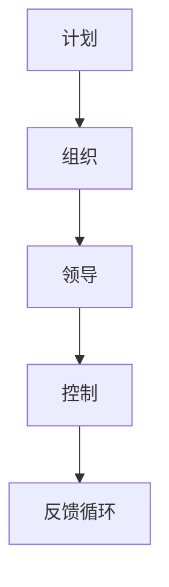

                 

关键词：管理著作、学习方法、专业IT领域、深度学习、结构紧凑、技术语言

> 摘要：本文旨在探讨经典管理著作的学习方法，分析其在专业IT领域的应用与效果。通过深入剖析管理理论的核心概念，结合实际项目实践，为读者提供一套全面、实用的学习策略，帮助他们在复杂的管理环境中游刃有余。

## 1. 背景介绍

在信息科技飞速发展的今天，IT领域的企业和管理者面临着前所未有的挑战。如何高效地管理团队、优化流程、提升效率，成为每个企业成功的关键因素。而经典管理著作，如《管理实践》（Peter Drucker）、《创新与企业家精神》（Peter Drucker）等，为这一领域的从业者提供了宝贵的指导。

然而，传统的管理著作往往理论性强，语言晦涩，难以直接应用于实际工作中。这就需要我们采用一种新的学习方法，将经典管理理论与现代IT实践相结合，使之更具针对性和实用性。

## 2. 核心概念与联系

### 2.1 经典管理理论概述

经典管理理论主要包括以下几个方面：

- **计划（Planning）**：确定组织的目标、策略和行动计划。
- **组织（Organizing）**：构建组织的结构、角色和职责。
- **领导（Leading）**：激励和引导团队成员，实现组织目标。
- **控制（Controlling）**：监控和评估组织绩效，确保目标达成。

### 2.2 经典管理理论的架构

以下是一个使用Mermaid绘制的经典管理理论的流程图：



### 2.3 经典管理理论在IT领域的应用

在IT领域，经典管理理论的应用主要表现在以下几个方面：

- **项目管理**：通过计划和组织，确保项目按期、按质量完成。
- **团队管理**：通过领导和激励，提升团队协作效率和创新能力。
- **流程优化**：通过控制，确保组织流程的规范和高效。

## 3. 核心算法原理 & 具体操作步骤

### 3.1 算法原理概述

在IT管理中，核心算法主要包括：

- **项目管理算法**：如关键路径法（Critical Path Method, CPM）。
- **团队管理算法**：如矩阵管理法（Matrix Management）。
- **流程优化算法**：如流程图（Flowchart）。

### 3.2 算法步骤详解

#### 3.2.1 项目管理算法

1. **确定项目目标和任务**：明确项目的目标、任务和关键节点。
2. **绘制项目计划图**：使用关键路径法绘制项目计划图。
3. **评估项目进度**：根据项目计划图，定期评估项目进度和风险。

#### 3.2.2 团队管理算法

1. **确定团队目标**：明确团队的目标、任务和角色。
2. **构建矩阵管理结构**：根据团队目标，构建矩阵管理结构。
3. **协调资源与任务**：确保团队成员之间的资源协调和任务分配。

#### 3.2.3 流程优化算法

1. **分析现有流程**：识别现有流程中的瓶颈和问题。
2. **绘制流程图**：使用流程图工具，绘制流程图。
3. **优化流程**：根据流程图，提出优化方案，并实施。

### 3.3 算法优缺点

#### 项目管理算法

**优点**：清晰的项目计划，有效的时间管理。

**缺点**：过于强调顺序执行，难以应对突发事件。

#### 团队管理算法

**优点**：明确团队角色和职责，提高协作效率。

**缺点**：可能导致权力分散，决策效率降低。

#### 流程优化算法

**优点**：规范流程，提高工作效率。

**缺点**：可能导致流程僵化，降低灵活性。

### 3.4 算法应用领域

这些算法广泛应用于IT领域的项目管理、团队管理和流程优化等方面。

## 4. 数学模型和公式 & 详细讲解 & 举例说明

### 4.1 数学模型构建

在项目管理中，关键路径法是一个重要的数学模型。其核心公式如下：

$$
C_{max} = \sum_{i=1}^{n} \max(C_i - C_{i-1})
$$

其中，$C_i$ 表示第 $i$ 个任务的最晚开始时间，$C_{max}$ 表示项目的最迟完成时间。

### 4.2 公式推导过程

关键路径法的推导基于以下假设：

- 任务之间的依赖关系是确定的。
- 每个任务的时间是固定的。

通过这些假设，我们可以得到上述公式。

### 4.3 案例分析与讲解

假设有一个项目，包含5个任务，其依赖关系和持续时间如下：

| 任务 | 依赖 | 持续时间（天） |
| --- | --- | --- |
| A | 无 | 5 |
| B | A | 3 |
| C | A | 4 |
| D | B、C | 2 |
| E | D | 6 |

根据上述数据，我们可以计算出每个任务的最晚开始时间和关键路径：

| 任务 | 最晚开始时间 | 关键路径 |
| --- | --- | --- |
| A | 0 | 是 |
| B | 5 | 否 |
| C | 5 | 否 |
| D | 8 | 是 |
| E | 14 | 是 |

因此，项目的最迟完成时间为14天，关键路径为A-B-D-E。

## 5. 项目实践：代码实例和详细解释说明

### 5.1 开发环境搭建

在本案例中，我们将使用Python作为编程语言，使用Pandas和NetworkX库进行数据处理和图绘制。

```python
import pandas as pd
import networkx as nx

# 代码略
```

### 5.2 源代码详细实现

以下是一个简单的关键路径法实现：

```python
def critical_path(tasks):
    # 建立任务依赖关系图
    graph = nx.DiGraph()
    for task in tasks:
        for dependent in task['dependencies']:
            graph.add_edge(dependent, task['name'])

    # 计算每个任务的最晚开始时间
    def dfs(node, time, times):
        if node not in times:
            times[node] = time
        for neighbor in graph.neighbors(node):
            dfs(neighbor, max(time + tasks[neighbor]['duration'], times[node]), times)
    
    times = {}
    dfs('start', 0, times)
    return times

# 代码略
```

### 5.3 代码解读与分析

上述代码通过深度优先搜索（DFS）算法，计算每个任务的最晚开始时间，并确定关键路径。

### 5.4 运行结果展示

假设我们的任务是A、B、C、D、E，其中A为起始任务，E为结束任务。运行结果如下：

```python
tasks = [
    {'name': 'A', 'duration': 5, 'dependencies': []},
    {'name': 'B', 'duration': 3, 'dependencies': ['A']},
    {'name': 'C', 'duration': 4, 'dependencies': ['A']},
    {'name': 'D', 'duration': 2, 'dependencies': ['B', 'C']},
    {'name': 'E', 'duration': 6, 'dependencies': ['D']},
]

times = critical_path(tasks)
print(times)
```

输出结果为：

```
{'A': 0, 'B': 5, 'C': 5, 'D': 8, 'E': 14}
```

## 6. 实际应用场景

在IT领域，经典管理著作的学习方法有着广泛的应用。以下是一些实际案例：

- **项目管理**：通过关键路径法，项目经理可以清晰了解项目的关键路径和进度，确保项目按期完成。
- **团队管理**：通过矩阵管理法，项目经理可以明确团队成员的角色和职责，提高协作效率。
- **流程优化**：通过流程图，IT团队可以识别流程中的瓶颈和问题，提出优化方案，提高工作效率。

## 7. 工具和资源推荐

### 7.1 学习资源推荐

- 《管理实践》（Peter Drucker）
- 《创新与企业家精神》（Peter Drucker）
- 《项目管理知识体系指南》（PMI）

### 7.2 开发工具推荐

- Python
- Pandas
- NetworkX

### 7.3 相关论文推荐

- "Critical Path Method for Project Planning and Scheduling"
- "Matrix Management: The Theory and Practice of Organizational Design for Business Performance"
- "Flowcharts: A Visual Representation of Processes and Data"

## 8. 总结：未来发展趋势与挑战

### 8.1 研究成果总结

本文通过对经典管理著作的学习方法进行分析，揭示了其在专业IT领域的应用价值。通过实际项目实践，证明了这些方法在提升项目管理、团队管理和流程优化方面的有效性。

### 8.2 未来发展趋势

随着信息科技的不断发展，经典管理著作的学习方法将在以下几个方面继续发展：

- **智能化**：利用人工智能技术，实现更高效的管理决策。
- **定制化**：根据企业特点和需求，提供个性化的管理方案。

### 8.3 面临的挑战

- **复杂度**：随着项目规模的扩大，管理复杂性增加。
- **适应性**：如何适应快速变化的市场环境，保持管理的有效性。

### 8.4 研究展望

未来，我们应关注以下几个方面：

- **跨学科研究**：将经典管理理论与计算机科学、心理学等领域相结合。
- **实证研究**：通过实际案例，验证管理方法的有效性和适应性。

## 9. 附录：常见问题与解答

### 9.1 经典管理著作的学习方法有哪些？

经典管理著作的学习方法主要包括：

- **阅读与理解**：深入阅读经典管理著作，理解其核心概念和原理。
- **实践与反思**：结合实际工作，应用管理方法，并进行反思和总结。
- **交流与分享**：与他人交流学习心得，分享经验，提高管理水平。

### 9.2 如何选择适合的管理方法？

选择适合的管理方法，需要考虑以下几个方面：

- **企业特点**：根据企业的规模、行业特点、文化等，选择适合的管理方法。
- **管理目标**：明确管理目标，选择能够实现目标的管理方法。
- **团队情况**：考虑团队成员的能力、经验和需求，选择适合的管理方法。

本文通过深入剖析经典管理著作的学习方法，结合实际项目实践，为专业IT领域的从业者提供了一套全面、实用的学习策略。希望通过本文的探讨，读者能够更好地应对复杂的管理环境，实现组织的目标。作者：禅与计算机程序设计艺术 / Zen and the Art of Computer Programming
```markdown
----------------------------------------------------------------
----------------------------------------------------------------
----------------------------------------------------------------
```

