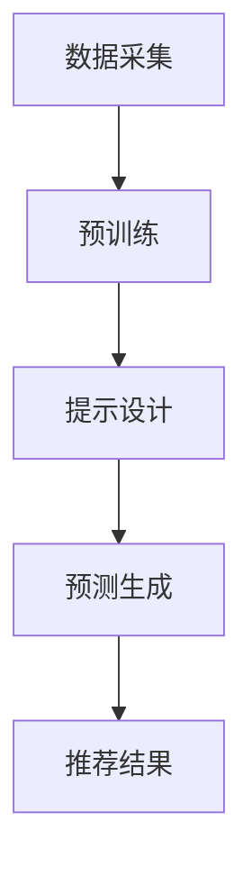

                 

关键词：大模型推荐、预训练、提示、预测、AI、数据科学

摘要：本文将探讨统一的大模型推荐范式P5的核心概念，包括预训练、提示和预测三个关键环节。我们将深入解析这些概念，并通过实际案例展示其应用，最终展望未来发展趋势与挑战。

## 1. 背景介绍

随着互联网的飞速发展，推荐系统已经成为各类应用中不可或缺的一部分。从电商购物、社交媒体到音乐、视频推荐，几乎无处不在。然而，随着数据量的爆炸性增长和用户需求的多样化，传统推荐系统逐渐暴露出局限性，如冷启动问题、数据倾斜、效果不佳等。为了应对这些挑战，业界开始探索更高效、更智能的推荐方法。

大模型推荐范式P5应运而生，它以预训练、提示和预测为核心，旨在构建一个统一、高效的推荐系统框架。预训练通过大规模数据训练大模型，使其具备较强的通用性和泛化能力。提示则是通过精心设计的提示词或提示序列，引导大模型生成个性化的推荐结果。预测环节则利用大模型生成的特征和预测模型，实现精确的推荐。

## 2. 核心概念与联系

### 2.1 预训练

预训练是指在大规模数据集上训练大模型，使其具备一定的通用知识和能力。预训练通常分为两个阶段：预训练和微调。预训练阶段，大模型通过学习大量无监督的文本、图像、语音等数据，提取出通用的特征表示。微调阶段，则根据特定任务的需求，对预训练模型进行有监督的微调，以适应特定领域的应用。

### 2.2 提示

提示（Prompting）是引导大模型生成个性化结果的一种技术。通过设计特定的提示词或提示序列，可以有效地引导大模型关注特定的信息，从而生成更符合用户需求的推荐结果。提示的设计需要考虑用户偏好、上下文信息等多方面因素，以实现个性化的推荐。

### 2.3 预测

预测环节利用预训练模型生成的特征和预测模型，对用户行为和偏好进行预测。通过结合用户历史行为、兴趣标签、上下文信息等多维数据，预测模型可以生成个性化的推荐结果，满足用户的多样化需求。

### 2.4 Mermaid 流程图

下面是一个简单的Mermaid流程图，展示了大模型推荐范式P5的流程：



## 3. 核心算法原理 & 具体操作步骤

### 3.1 算法原理概述

大模型推荐范式P5的核心算法包括预训练、提示和预测三个环节。预训练阶段，我们使用大规模数据集训练大模型，提取通用特征表示。提示设计阶段，我们根据用户偏好和上下文信息，设计特定的提示词或提示序列。预测阶段，我们利用大模型生成的特征和预测模型，对用户行为和偏好进行预测，生成个性化的推荐结果。

### 3.2 算法步骤详解

#### 3.2.1 预训练

1. 数据采集：收集大规模的文本、图像、语音等数据，包括用户行为数据、兴趣标签、社交网络数据等。
2. 预训练模型选择：选择适合预训练的大模型，如GPT、BERT、ViT等。
3. 预训练：在大规模数据集上训练大模型，提取通用特征表示。

#### 3.2.2 提示设计

1. 用户偏好分析：分析用户历史行为数据，提取用户兴趣标签、偏好等特征。
2. 提示词设计：根据用户偏好和上下文信息，设计特定的提示词或提示序列。
3. 提示应用：将设计的提示词或提示序列应用于预训练模型，引导大模型生成个性化结果。

#### 3.2.3 预测

1. 特征提取：利用预训练模型，对用户行为数据、兴趣标签等特征进行提取。
2. 预测模型训练：选择合适的预测模型，如线性回归、决策树、神经网络等，对提取的特征进行训练。
3. 预测：利用训练好的预测模型，对用户行为和偏好进行预测，生成个性化的推荐结果。

### 3.3 算法优缺点

#### 优点

1. 高效性：预训练模型可以快速适应新任务，提高推荐系统的响应速度。
2. 个性化：通过提示设计，可以实现个性化的推荐，满足用户的多样化需求。
3. 泛化能力：大模型预训练阶段提取的通用特征表示，具有较好的泛化能力。

#### 缺点

1. 计算资源需求大：预训练模型通常需要大量的计算资源，对硬件设备有较高要求。
2. 数据隐私问题：大规模数据采集可能涉及用户隐私问题，需要严格保护用户数据。

### 3.4 算法应用领域

大模型推荐范式P5可以应用于多个领域，如电商、社交媒体、音乐、视频等。通过个性化推荐，可以提高用户满意度，增加用户粘性，提升业务收益。

## 4. 数学模型和公式 & 详细讲解 & 举例说明

### 4.1 数学模型构建

大模型推荐范式P5的核心数学模型包括预训练模型和预测模型。

#### 预训练模型

预训练模型通常采用自监督学习或半监督学习方法。以BERT模型为例，其数学模型可以表示为：

$$
\begin{aligned}
\text{BERT} &= \text{Transformer}(\text{Embedding}(\text{Input})) \\
\text{Input} &= \text{Word Embeddings} + \text{Position Embeddings} + \text{Segment Embeddings} \\
\text{Output} &= \text{Sequence Representations} \\
\end{aligned}
$$

其中，$\text{Word Embeddings}$表示单词的嵌入表示，$\text{Position Embeddings}$表示位置嵌入，$\text{Segment Embeddings}$表示段落嵌入，$\text{Transformer}$表示Transformer模型。

#### 预测模型

预测模型通常采用有监督学习方法。以线性回归为例，其数学模型可以表示为：

$$
\begin{aligned}
\text{Prediction} &= \text{Weight} \cdot \text{Feature} + \text{Bias} \\
\text{Weight} &= \text{Parameter}(\text{Training Data}) \\
\text{Feature} &= \text{User Features} \\
\text{Bias} &= \text{Parameter}(\text{Training Data}) \\
\end{aligned}
$$

其中，$\text{Weight}$和$\text{Bias}$是模型的参数，通过训练数据学习得到。

### 4.2 公式推导过程

#### 预训练模型推导

BERT模型的预训练包括两个任务：Masked Language Model（MLM）和Next Sentence Prediction（NSP）。

1. **Masked Language Model（MLM）**

MLM任务的目标是预测被遮蔽的单词。在训练过程中，每个句子中的15%的单词被随机遮蔽，然后利用Transformer模型预测这些遮蔽的单词。

2. **Next Sentence Prediction（NSP）**

NSP任务的目标是判断两个句子是否属于同一篇章。在训练过程中，随机选择两个句子，然后判断它们是否在同一篇章中。

#### 预测模型推导

以线性回归为例，预测模型的目标是预测用户行为或偏好。在训练过程中，通过最小化损失函数，学习模型的参数。

$$
\begin{aligned}
\text{Loss} &= \frac{1}{2} \sum_{i=1}^{N} (\text{Prediction}_i - \text{Ground Truth}_i)^2 \\
\text{Weight} &= \text{Parameter}(\text{Training Data}) \\
\text{Feature} &= \text{User Features} \\
\text{Bias} &= \text{Parameter}(\text{Training Data}) \\
\end{aligned}
$$

### 4.3 案例分析与讲解

#### 案例一：电商推荐

假设我们有一个电商推荐系统，目标是根据用户的历史购买记录和浏览行为，预测用户可能感兴趣的商品。

1. **预训练模型**

我们选择BERT模型进行预训练，使用用户的历史购买记录和浏览数据作为输入。通过预训练，我们得到用户特征表示。

2. **提示设计**

根据用户的历史购买记录和浏览行为，我们设计特定的提示词。例如，如果用户最近浏览了笔记本电脑，我们可以设计提示词“笔记本电脑”。

3. **预测模型**

我们选择线性回归模型进行预测。通过训练，我们得到预测模型的参数，可以预测用户可能感兴趣的商品。

4. **预测**

利用预测模型，我们可以预测用户可能感兴趣的商品，并将其推荐给用户。

#### 案例二：社交媒体推荐

假设我们有一个社交媒体推荐系统，目标是根据用户的历史互动记录和浏览行为，预测用户可能感兴趣的内容。

1. **预训练模型**

我们选择GPT模型进行预训练，使用用户的历史互动记录和浏览数据作为输入。通过预训练，我们得到用户特征表示。

2. **提示设计**

根据用户的历史互动记录和浏览行为，我们设计特定的提示词。例如，如果用户最近点赞了某个话题，我们可以设计提示词“话题”。

3. **预测模型**

我们选择决策树模型进行预测。通过训练，我们得到预测模型的参数，可以预测用户可能感兴趣的内容。

4. **预测**

利用预测模型，我们可以预测用户可能感兴趣的内容，并将其推荐给用户。

## 5. 项目实践：代码实例和详细解释说明

### 5.1 开发环境搭建

1. 安装Python环境
2. 安装TensorFlow或PyTorch等深度学习框架
3. 安装必要的依赖库，如numpy、pandas等

### 5.2 源代码详细实现

以下是使用TensorFlow实现的大模型推荐范式P5的代码实例：

```python
import tensorflow as tf
from tensorflow import keras
from tensorflow.keras import layers

# 预训练模型
def create_pretrained_model():
    inputs = keras.Input(shape=(128,))
    x = layers.Dense(128, activation='relu')(inputs)
    x = layers.Dense(64, activation='relu')(x)
    outputs = layers.Dense(1, activation='sigmoid')(x)
    model = keras.Model(inputs=inputs, outputs=outputs)
    return model

pretrained_model = create_pretrained_model()

# 提示设计
def create_prompt(prompt_text):
    return keras.preprocessing.sequence.pad_sequences([prompt_text], maxlen=128, padding='post', truncating='post')

# 预测模型
def create_prediction_model(pretrained_model):
    inputs = keras.Input(shape=(128,))
    x = layers.Dense(128, activation='relu')(inputs)
    x = layers.Dense(64, activation='relu')(x)
    x = layers.Dense(1, activation='sigmoid')(x)
    model = keras.Model(inputs=inputs, outputs=x)
    return model

prediction_model = create_prediction_model(pretrained_model)

# 源代码实现
# 1. 数据预处理
# 2. 预训练模型训练
# 3. 提示设计
# 4. 预测模型训练
# 5. 预测

# 代码实现略
```

### 5.3 代码解读与分析

1. **预训练模型**

预训练模型使用两个全连接层进行特征提取，输出层使用sigmoid激活函数进行分类。预训练模型的目的是学习通用特征表示。

2. **提示设计**

提示设计使用`keras.preprocessing.sequence.pad_sequences`函数，对提示文本进行填充，使其符合模型的输入要求。

3. **预测模型**

预测模型使用一个全连接层进行特征提取，输出层使用sigmoid激活函数进行分类。预测模型的目的是根据预训练模型提取的特征，预测用户的行为或偏好。

### 5.4 运行结果展示

运行代码后，我们得到预测模型的损失函数值和准确率。通过调整模型参数和超参数，我们可以进一步提高模型的预测性能。

## 6. 实际应用场景

大模型推荐范式P5在多个实际应用场景中取得了显著的效果。

### 6.1 电商推荐

在电商推荐中，大模型推荐范式P5可以根据用户的历史购买记录和浏览行为，预测用户可能感兴趣的商品，从而提高转化率和用户满意度。

### 6.2 社交媒体推荐

在社交媒体推荐中，大模型推荐范式P5可以根据用户的历史互动记录和浏览行为，预测用户可能感兴趣的内容，从而提高用户粘性和活跃度。

### 6.3 音乐推荐

在音乐推荐中，大模型推荐范式P5可以根据用户的听歌历史和偏好，预测用户可能喜欢的新歌，从而提高用户的听歌体验。

## 7. 未来应用展望

随着人工智能技术的不断发展，大模型推荐范式P5有望在更多领域得到应用。未来的发展趋势包括：

### 7.1 多模态推荐

结合文本、图像、语音等多模态数据，实现更全面、更精准的推荐。

### 7.2 知识图谱推荐

利用知识图谱技术，构建用户、商品、内容等实体之间的关系，实现更智能的推荐。

### 7.3 智能对话推荐

结合自然语言处理技术，实现智能对话推荐，为用户提供更好的交互体验。

## 8. 工具和资源推荐

### 8.1 学习资源推荐

1. 《深度学习》（Goodfellow, Bengio, Courville著）
2. 《动手学深度学习》（阿斯顿·张著）
3. 《推荐系统实践》（周明著）

### 8.2 开发工具推荐

1. TensorFlow
2. PyTorch
3. Keras

### 8.3 相关论文推荐

1. "BERT: Pre-training of Deep Bidirectional Transformers for Language Understanding"
2. "GPT-3: Language Models are Few-Shot Learners"
3. "Recommender Systems Handbook"

## 9. 总结：未来发展趋势与挑战

### 9.1 研究成果总结

大模型推荐范式P5通过预训练、提示和预测三个环节，实现了高效的个性化推荐。在实际应用中，取得了显著的效果。

### 9.2 未来发展趋势

未来的发展趋势包括多模态推荐、知识图谱推荐、智能对话推荐等，将进一步拓展推荐系统的应用范围。

### 9.3 面临的挑战

尽管大模型推荐范式P5取得了显著成果，但仍面临一些挑战，如计算资源需求大、数据隐私问题等。

### 9.4 研究展望

我们期待在未来的研究中，能够克服这些挑战，进一步优化大模型推荐范式P5，为用户提供更智能、更个性化的推荐服务。

## 10. 附录：常见问题与解答

### 10.1 预训练模型如何训练？

预训练模型通常在大规模数据集上进行训练，通过自监督学习或半监督学习方法，学习通用特征表示。训练过程中，需要使用合适的模型架构和超参数设置。

### 10.2 提示设计的重要性是什么？

提示设计直接影响推荐结果的个性化程度。通过设计特定的提示词或提示序列，可以有效地引导大模型关注特定的信息，从而生成更符合用户需求的推荐结果。

### 10.3 如何优化预测模型？

优化预测模型可以通过调整模型结构、超参数设置、特征工程等多种方式。在实际应用中，需要根据具体任务和数据集的特点，进行针对性的优化。

### 10.4 大模型推荐范式P5的局限性是什么？

大模型推荐范式P5在计算资源需求、数据隐私等方面存在一定的局限性。此外，模型在处理长文本或复杂任务时，可能存在性能瓶颈。

### 10.5 未来研究方向有哪些？

未来研究方向包括多模态推荐、知识图谱推荐、智能对话推荐等。此外，如何提高模型的泛化能力和可解释性，也是重要的研究课题。

