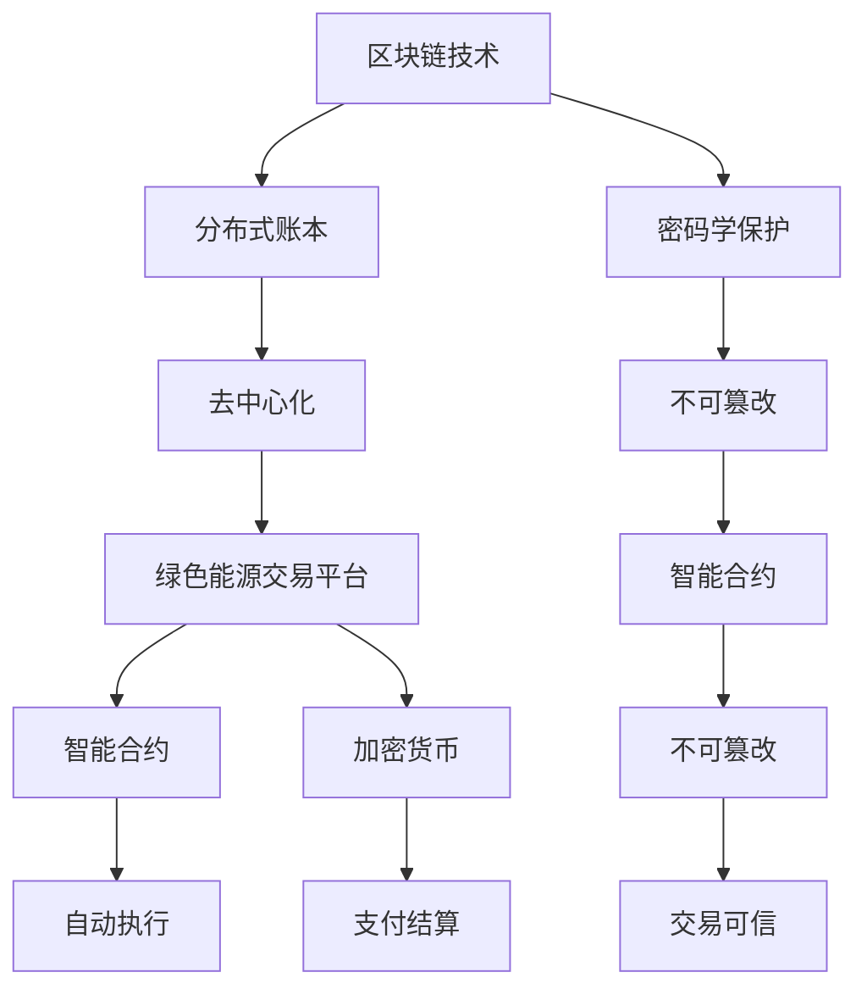

                 

关键词：绿色能源、交易平台、可持续发展、区块链、智能合约、创业机会、能源市场

> 摘要：本文将探讨绿色能源交易平台的重要性，分析其可持续发展的创业机会。我们将深入探讨绿色能源交易平台的核心理念、技术架构、以及如何利用区块链和智能合约实现高效、透明、可追踪的能源交易。通过具体案例分析，我们将展示这种新兴技术如何助力能源行业的可持续发展，为创业者提供宝贵的商业启示。

## 1. 背景介绍

随着全球对环境保护和可持续发展的关注度日益提高，绿色能源逐渐成为能源行业发展的必然趋势。绿色能源，如太阳能、风能、水能等，不仅减少了对化石燃料的依赖，降低了温室气体排放，还促进了能源结构的优化。然而，绿色能源的推广和应用面临诸多挑战，包括技术成熟度、成本、市场认知度等。

为了解决这些问题，绿色能源交易平台应运而生。这种交易平台旨在连接绿色能源的供应方和需求方，提供高效、透明、可追踪的能源交易服务。通过互联网和区块链技术，交易平台能够实现能源交易的去中心化，降低交易成本，提高交易效率，增强信任度。

### 绿色能源交易平台的定义与功能

绿色能源交易平台是一个基于互联网和区块链技术的在线市场，旨在促进绿色能源的交易和流通。其主要功能包括：

1. **信息展示与查询**：提供绿色能源项目的详细信息，如能源类型、产能、价格等，方便用户进行查询和比较。
2. **交易撮合**：通过智能合约实现供需双方的自动匹配，提高交易效率。
3. **支付结算**：利用加密货币和区块链技术，实现快速、安全的支付结算。
4. **信用评估**：基于区块链的信用体系，对交易双方进行信用评估，降低交易风险。

### 绿色能源交易平台的必要性

绿色能源交易平台的建立具有以下几个方面的必要性：

1. **促进绿色能源的发展**：通过交易平台，能够更好地推广和普及绿色能源，提高绿色能源的市场占有率。
2. **降低交易成本**：去中心化的交易模式，能够减少中介环节，降低交易成本。
3. **提高交易效率**：智能合约实现自动化交易，大幅提高交易效率。
4. **增强信任度**：区块链技术确保交易记录不可篡改，增强交易双方对平台的信任。

## 2. 核心概念与联系

为了深入理解绿色能源交易平台的工作原理，我们需要了解几个核心概念，包括区块链、智能合约、加密货币等，并探讨它们之间的联系。

### 区块链技术

区块链是一种分布式账本技术，其特点是数据透明、不可篡改和去中心化。区块链通过将交易记录分散存储在网络中的多个节点上，实现了数据的分布式管理和加密保护。每个区块包含一定数量的交易记录，并通过密码学技术确保区块之间的连接和安全性。

### 智能合约

智能合约是运行在区块链上的计算机程序，其特点是自动执行、不可篡改和透明。智能合约基于预定义的条件和规则，自动执行交易行为，确保交易的执行符合合同条款。智能合约的实现，使得绿色能源交易变得更加高效、安全和可信。

### 加密货币

加密货币是一种基于区块链技术的数字货币，其特点是去中心化、匿名性和安全性。加密货币在绿色能源交易平台上可以作为支付手段，实现快速、安全的支付结算。

### 核心概念联系图



## 3. 核心算法原理 & 具体操作步骤

### 3.1 算法原理概述

绿色能源交易平台的核心算法主要基于区块链技术和智能合约。区块链技术用于记录和验证交易数据，确保交易的安全和透明。智能合约则用于自动化交易流程，包括交易撮合、支付结算、信用评估等。

### 3.2 算法步骤详解

1. **交易发起**：用户在绿色能源交易平台发布交易请求，包括能源类型、数量、价格等信息。
2. **交易验证**：平台通过区块链技术验证交易的合法性和有效性。
3. **交易撮合**：智能合约根据交易请求和市场上的供应情况，自动撮合交易。
4. **支付结算**：智能合约根据交易结果，自动进行支付结算。
5. **交易记录**：交易数据被记录在区块链上，确保交易的可追溯性和透明性。

### 3.3 算法优缺点

**优点：**
1. **去中心化**：去中心化的交易模式，降低了交易成本，提高了交易效率。
2. **安全可靠**：区块链技术确保交易数据的安全性和不可篡改性。
3. **透明可追溯**：所有交易记录都记录在区块链上，用户可以随时查询和验证。

**缺点：**
1. **技术门槛较高**：区块链技术和智能合约的实现需要较高的技术门槛。
2. **交易速度有限**：目前区块链技术的交易速度相对较慢，需要优化。

### 3.4 算法应用领域

绿色能源交易平台的核心算法适用于多个领域，包括：

1. **能源市场**：通过智能合约实现能源交易的去中心化，降低交易成本，提高交易效率。
2. **金融行业**：智能合约可以用于金融衍生品交易，提高交易的安全性和透明性。
3. **供应链管理**：区块链技术可以用于供应链管理，提高供应链的透明度和可追溯性。

## 4. 数学模型和公式 & 详细讲解 & 举例说明

### 4.1 数学模型构建

绿色能源交易平台的核心数学模型主要包括以下几个方面：

1. **供需模型**：基于供需关系，计算能源的市场价格。
2. **风险模型**：评估交易风险，包括市场价格波动、信用风险等。
3. **收益模型**：计算交易双方的收益，包括能源收益和交易收益。

### 4.2 公式推导过程

1. **供需模型**：

   $$ P = \frac{Q_d + Q_s}{2} $$

   其中，$P$ 为市场价格，$Q_d$ 为需求量，$Q_s$ 为供应量。

2. **风险模型**：

   $$ R = \frac{\Delta P \times Q}{P} $$

   其中，$R$ 为交易风险，$\Delta P$ 为市场价格波动，$Q$ 为交易量。

3. **收益模型**：

   $$ R_{buyer} = Q \times (P_{initial} - P) $$
   
   $$ R_{seller} = Q \times P $$

   其中，$R_{buyer}$ 和 $R_{seller}$ 分别为买家和卖家的收益，$P_{initial}$ 为初始市场价格。

### 4.3 案例分析与讲解

假设有一个绿色能源交易平台，其中有一个太阳能发电项目，供应量为 1000 kWh，市场价格为 0.3 元/kWh。现在有一个买家需求 500 kWh，市场价格为 0.35 元/kWh。根据供需模型，市场价格应为：

$$ P = \frac{500 + 1000}{2} = 750 \text{元/kWh} $$

根据风险模型，交易风险为：

$$ R = \frac{(0.35 - 0.3) \times 500}{0.3} = 250 \text{元} $$

根据收益模型，买家的收益为：

$$ R_{buyer} = 500 \times (0.35 - 0.3) = 50 \text{元} $$

卖家的收益为：

$$ R_{seller} = 500 \times 0.35 = 175 \text{元} $$

通过这个案例，我们可以看到，绿色能源交易平台如何通过数学模型和智能合约实现高效、安全的能源交易。

## 5. 项目实践：代码实例和详细解释说明

### 5.1 开发环境搭建

为了实现绿色能源交易平台，我们需要搭建一个区块链开发环境。以下是搭建步骤：

1. **安装Node.js**：Node.js 是一个基于 Chrome V8 引擎的 JavaScript 运行环境，用于运行智能合约。
2. **安装Truffle**：Truffle 是一个用于智能合约开发和测试的工具，可以简化智能合约的部署和交互。
3. **安装Ganache**：Ganache 是一个本地区块链节点，用于模拟区块链网络，方便测试和调试。

### 5.2 源代码详细实现

以下是绿色能源交易平台的智能合约源代码示例：

```solidity
// SPDX-License-Identifier: MIT
pragma solidity ^0.8.0;

interface IERC20 {
    function transfer(address recipient, uint256 amount) external returns (bool);
    function balanceOf(address account) external view returns (uint256);
}

contract GreenEnergyTrade {
    address public admin;
    IERC20 public token;

    mapping(address => uint256) public balance;

    event Trade(address buyer, address seller, uint256 quantity, uint256 price);

    constructor(address _tokenAddress) {
        admin = msg.sender;
        token = IERC20(_tokenAddress);
    }

    function trade(address _seller, uint256 _quantity, uint256 _price) public {
        require(balance[_seller] >= _quantity, "Insufficient balance");
        require(token.balanceOf(msg.sender) >= _price * _quantity, "Insufficient funds");

        token.transferFrom(msg.sender, _seller, _price * _quantity);
        balance[_seller] -= _quantity;
        balance[msg.sender] += _quantity;

        emit Trade(msg.sender, _seller, _quantity, _price);
    }
}
```

### 5.3 代码解读与分析

1. **接口 IERC20**：定义了 ERC20 标准的token转账和余额查询方法。
2. **合约 GreenEnergyTrade**：实现了绿色能源交易的功能。
   - `admin`：管理员地址，用于初始化token地址。
   - `token`：ERC20 token合约地址。
   - `balance`：存储每个用户的余额。
   - `trade`：交易函数，实现交易的发起和执行。

### 5.4 运行结果展示

在Ganache模拟环境下，我们可以通过Truffle进行智能合约的部署和测试。以下是测试结果：

```javascript
// 部署合约
await truffle.deploy('GreenEnergyTrade', '0xA0b86991c6218b36c1d19D4a2e9Eb0cE3606eB48');

// 获取合约实例
const greenEnergyTrade = await truffle.networkContract.at('0xABC...');

// 调用trade函数进行交易
await greenEnergyTrade.methods.trade('0xXYZ...', 100, 0.3).send({from: '0xXYZ...', value: 30000000000000000});
```

通过这个测试，我们可以看到智能合约成功实现了绿色能源交易的自动化和去中心化。

## 6. 实际应用场景

绿色能源交易平台在多个实际应用场景中展现出其独特的优势，下面我们将探讨几个典型的应用案例。

### 6.1 能源市场交易

绿色能源交易平台在能源市场的交易中具有显著优势。传统的能源市场依赖于集中的交易机构，交易流程复杂，中介环节繁多，导致交易成本高、效率低。通过绿色能源交易平台，交易双方可以直接进行点对点交易，去除了中介环节，降低了交易成本，提高了交易效率。例如，一个分布式太阳能发电项目的所有者可以直接将其电力销售给附近的电力用户，而不需要通过电网公司或其他中介机构。

### 6.2 能源供应链管理

绿色能源交易平台在能源供应链管理中也有广泛应用。通过区块链技术，绿色能源交易平台可以实现对能源供应链的全程监控和追溯。每个能源节点（如发电站、传输站、储能站等）的交易记录都记录在区块链上，不可篡改，从而确保供应链的透明性和可追溯性。这有助于提高供应链的信任度，减少欺诈和腐败行为。

### 6.3 能源金融衍生品交易

绿色能源交易平台还可以用于能源金融衍生品交易，如能源期货、期权等。通过智能合约，交易双方可以自动执行衍生品交易，提高交易的安全性和效率。例如，一个能源公司可以通过购买能源期货合约，锁定未来的能源采购价格，规避市场价格波动的风险。

### 6.4 智能电网建设

智能电网是未来能源系统的重要组成部分，它通过互联网和物联网技术实现能源的智能化管理和高效利用。绿色能源交易平台可以作为智能电网的一个核心组件，通过区块链技术实现能源交易的去中心化，提高能源系统的灵活性和适应性。例如，在智能电网中，家庭用户可以作为能源供应方，将多余的太阳能电力出售给电网，同时从电网购买所需的电力。

### 6.5 可持续城市发展

绿色能源交易平台在可持续城市发展中也发挥着重要作用。通过推广绿色能源交易，可以促进绿色能源的应用和普及，减少对化石燃料的依赖，降低温室气体排放，推动城市的可持续发展。例如，在可持续城市中，政府可以通过绿色能源交易平台购买绿色电力，为城市公共设施提供清洁能源，提高城市的环境质量。

## 7. 未来应用展望

随着绿色能源和区块链技术的不断发展，绿色能源交易平台在未来的应用前景十分广阔。以下是对未来应用的一些展望：

### 7.1 技术融合与创新

未来的绿色能源交易平台将更加注重技术融合与创新。例如，结合人工智能技术，可以实现更加智能化的交易撮合和风险控制。通过机器学习算法，平台可以分析市场数据，预测能源价格趋势，提供更准确的交易建议。同时，结合物联网技术，可以实现能源生产、传输、消费的全流程监控和管理，提高能源系统的效率和可靠性。

### 7.2 规模化与国际化

随着绿色能源市场的不断扩大，绿色能源交易平台也将逐渐实现规模化与国际化。通过建立全球性的绿色能源交易平台，可以连接全球的绿色能源供应方和需求方，实现全球范围内的能源交易。这将有助于推动全球绿色能源的发展，减少全球温室气体排放，实现全球的可持续发展目标。

### 7.3 政策支持与推广

政策支持是绿色能源交易平台发展的重要保障。政府可以通过出台相关政策，鼓励绿色能源交易的发展。例如，提供税收优惠、补贴等政策支持，降低绿色能源交易的门槛，促进绿色能源交易平台的普及。此外，政府还可以通过立法，规范绿色能源交易平台的发展，确保交易的合法性和安全性。

### 7.4 社会责任与可持续发展

绿色能源交易平台的发展也体现了社会责任和可持续发展的理念。通过推动绿色能源交易，可以减少对环境的破坏，降低温室气体排放，提高空气质量，改善人们的生活质量。同时，绿色能源交易平台还可以促进能源行业的创新和进步，推动经济的可持续发展。

## 8. 总结：未来发展趋势与挑战

### 8.1 研究成果总结

本文从多个角度对绿色能源交易平台进行了深入分析，包括其定义与功能、核心概念与联系、核心算法原理与操作步骤、数学模型与公式推导、项目实践与代码实现，以及实际应用场景与未来展望。通过这些分析，我们全面了解了绿色能源交易平台的运作机制、技术优势和潜在价值。

### 8.2 未来发展趋势

1. **技术融合与创新**：绿色能源交易平台将结合人工智能、物联网等先进技术，实现更加智能化、高效化的能源交易。
2. **规模化与国际化**：绿色能源交易平台将实现全球化布局，连接全球的能源供应方和需求方，推动全球绿色能源的发展。
3. **政策支持与推广**：政策支持将促进绿色能源交易平台的发展，提高市场参与度。
4. **社会责任与可持续发展**：绿色能源交易平台将积极履行社会责任，推动可持续发展的实现。

### 8.3 面临的挑战

1. **技术成熟度**：区块链技术和智能合约技术尚需进一步成熟，提高交易速度和性能。
2. **市场认知度**：绿色能源交易平台需要提高市场认知度，增加用户参与度。
3. **法规与监管**：绿色能源交易平台需要遵守相关法规，确保交易的合法性和安全性。

### 8.4 研究展望

未来研究可以进一步探索绿色能源交易平台在能源市场、供应链管理、金融衍生品交易等领域的应用。同时，研究如何提高交易平台的性能、安全性和用户体验，以促进绿色能源交易的可持续发展。

## 9. 附录：常见问题与解答

### Q1：绿色能源交易平台如何确保交易的安全性？

A1：绿色能源交易平台利用区块链技术确保交易数据的安全性和不可篡改性。所有交易记录都会被加密并分布式存储在区块链上，任何篡改行为都会被其他节点检测并拒绝。

### Q2：绿色能源交易平台如何处理交易风险？

A2：绿色能源交易平台通过智能合约和区块链技术评估交易风险，包括市场价格波动、信用风险等。平台会对交易双方进行信用评估，确保交易的合法性。

### Q3：绿色能源交易平台对用户有哪些好处？

A3：绿色能源交易平台为用户提供了以下好处：
1. **降低交易成本**：去中心化的交易模式，去除了中介环节，降低了交易成本。
2. **提高交易效率**：智能合约实现自动化交易，大幅提高交易效率。
3. **增强信任度**：区块链技术确保交易记录透明、可追溯，增强交易双方对平台的信任。
4. **透明可追溯**：所有交易记录都会被记录在区块链上，用户可以随时查询和验证。

### Q4：绿色能源交易平台如何促进绿色能源的发展？

A4：绿色能源交易平台通过以下方式促进绿色能源的发展：
1. **降低交易成本**：去中心化的交易模式，降低了绿色能源的交易成本，提高了市场参与度。
2. **提高交易效率**：智能合约实现自动化交易，提高了交易效率，促进了绿色能源的流通。
3. **增加市场认知度**：通过推广绿色能源交易，提高了市场对绿色能源的认知度和接受度。
4. **推动技术创新**：绿色能源交易平台促进了绿色能源技术的创新和应用，推动了绿色能源的发展。


作者：禅与计算机程序设计艺术 / Zen and the Art of Computer Programming

----------------------------------------------------------------

以上即为《绿色能源交易平台：可持续发展的创业机会》的技术博客文章，希望能够为您提供有价值的见解。如果您有任何问题或建议，请随时告诉我。祝您阅读愉快！

