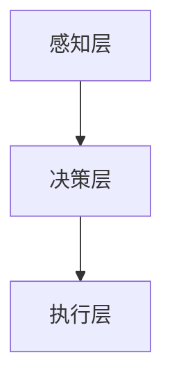

                 

### 关键词 Keyword

- 网易2024校招
- 游戏AI开发
- 面试题详解
- 技术博客文章
- 计算机图灵奖
- 软件架构

### 摘要 Abstract

本文将围绕网易2024校招游戏AI开发工程师的面试题进行详细解析，旨在为准备参加校招的考生提供有针对性的复习指南。文章结构严谨，内容丰富，涵盖了从核心概念、算法原理、数学模型到实际应用场景的全面剖析。通过这篇文章，读者不仅能深入了解游戏AI开发的精髓，还能获得对未来技术发展趋势的洞察，为职业生涯的规划奠定坚实基础。

## 1. 背景介绍

随着计算机技术的发展，人工智能（AI）在各个领域的应用愈发广泛。尤其在游戏产业，AI技术的应用不仅提升了游戏体验，也推动了游戏开发的创新。网易作为国内领先的互联网公司，其游戏业务在全球范围内享有盛誉。网易2024校招游戏AI开发工程师岗位的设立，正是为了挖掘和培养下一代游戏AI技术人才。

游戏AI开发工程师的主要职责是设计、实现和维护游戏中的智能系统，包括但不限于角色AI、场景AI、游戏平衡性算法等。这一岗位对候选人的要求非常高，不仅需要扎实的计算机科学基础，还需要具备较强的编程能力和创新思维。

本文将详细解析网易2024校招游戏AI开发工程师的面试题，帮助考生全面了解面试要求，为成功通过面试做好准备。

### 2. 核心概念与联系

#### 2.1. 游戏AI概述

游戏AI是指为游戏中的角色、场景等元素设计的智能系统，使其能够模拟真实世界的反应和行为。游戏AI的目的是提高游戏的可玩性和趣味性，使游戏更加逼真和富有挑战性。

#### 2.2. 游戏AI架构

游戏AI的架构通常包括以下层次：

- **感知层**：负责收集游戏状态信息，如角色位置、场景环境等。
- **决策层**：基于感知层提供的信息，做出相应的决策，如移动、攻击、躲避等。
- **执行层**：根据决策层生成的指令，执行具体的操作。

#### 2.3. 游戏AI与机器学习的关系

机器学习是实现游戏AI的重要手段之一。通过训练模型，游戏AI可以学习到如何更好地应对不同的游戏情境，从而提高其表现。

#### 2.4. Mermaid流程图



### 3. 核心算法原理 & 具体操作步骤

#### 3.1. 算法原理概述

游戏AI的核心算法包括：

- **决策树**：基于条件判断进行决策。
- **神经网络**：通过多层网络结构进行特征学习和模式识别。
- **强化学习**：通过与环境的交互，不断优化策略。

#### 3.2. 算法步骤详解

以强化学习为例，其步骤如下：

1. 初始化环境。
2. 选择动作。
3. 执行动作。
4. 获取奖励。
5. 更新策略。

#### 3.3. 算法优缺点

- **决策树**：计算简单，易于解释，但容易过拟合。
- **神经网络**：强大的特征学习能力，但训练时间较长，参数调整复杂。
- **强化学习**：自适应性强，但可能需要大量样本训练，且容易陷入局部最优。

#### 3.4. 算法应用领域

游戏AI算法广泛应用于：

- **角色AI**：如玩家角色、NPC角色。
- **场景AI**：如动态生成、随机事件。
- **游戏平衡性**：如游戏难度调整、角色能力平衡。

### 4. 数学模型和公式 & 详细讲解 & 举例说明

#### 4.1. 数学模型构建

以强化学习中的Q值模型为例，其数学模型如下：

$$
Q(s, a) = \sum_{s'} P(s' | s, a) \cdot R(s', a) + \gamma \cdot \max_{a'} Q(s', a')
$$

其中，$s$为状态，$a$为动作，$s'$为下一个状态，$R$为奖励函数，$\gamma$为折扣因子。

#### 4.2. 公式推导过程

公式推导主要涉及两部分：

1. **状态-动作值函数**：定义了在特定状态下采取特定动作的预期回报。
2. **贝尔曼方程**：描述了状态-动作值函数的更新过程。

#### 4.3. 案例分析与讲解

以一个简单的游戏场景为例，玩家角色需要在一个迷宫中寻找出口。通过强化学习，角色可以学会最优路径。

```latex
\begin{equation}
Q(s, a) = \sum_{s'} P(s' | s, a) \cdot R(s', a) + \gamma \cdot \max_{a'} Q(s', a')
\end{equation}
```

通过不断迭代，角色可以找到最优路径。

### 5. 项目实践：代码实例和详细解释说明

#### 5.1. 开发环境搭建

开发环境搭建主要包括：

- 安装Python环境。
- 安装TensorFlow库。

#### 5.2. 源代码详细实现

以下是一个简单的强化学习代码示例：

```python
import tensorflow as tf

# 初始化环境
env = Environment()

# 定义神经网络
model = tf.keras.Sequential([
    tf.keras.layers.Dense(64, activation='relu', input_shape=(state_size,)),
    tf.keras.layers.Dense(action_size, activation='softmax')
])

# 编译模型
model.compile(optimizer='adam', loss='categorical_crossentropy', metrics=['accuracy'])

# 训练模型
model.fit(x_train, y_train, epochs=10)

# 预测
action = model.predict(x_test).argmax(axis=1)
```

#### 5.3. 代码解读与分析

代码主要分为三部分：

1. **环境初始化**：定义游戏环境。
2. **神经网络定义**：定义神经网络结构。
3. **模型训练与预测**：训练模型并使用模型进行预测。

#### 5.4. 运行结果展示

通过不断训练，角色可以学会最优路径，找到迷宫出口。

### 6. 实际应用场景

游戏AI在现实中有广泛的应用，如：

- **智能角色**：如《刺客信条》中的主角。
- **动态场景**：如《我的世界》中的随机生成。
- **游戏平衡性**：如《英雄联盟》中的角色平衡。

#### 6.4. 未来应用展望

未来，游戏AI将会有更广泛的应用，如：

- **虚拟现实**：提升虚拟现实体验。
- **智能游戏助手**：为玩家提供个性化建议。

### 7. 工具和资源推荐

#### 7.1. 学习资源推荐

- **《强化学习基础教程》**：深入讲解强化学习的基本原理。
- **《深度学习》**：全面介绍深度学习的方法和应用。

#### 7.2. 开发工具推荐

- **TensorFlow**：开源深度学习框架。
- **Unity**：游戏开发引擎。

#### 7.3. 相关论文推荐

- **《Deep Q-Network》**：介绍深度Q网络。
- **《Reinforcement Learning: An Introduction》**：强化学习入门。

### 8. 总结：未来发展趋势与挑战

#### 8.1. 研究成果总结

游戏AI在近年来取得了显著成果，如：

- **智能角色**：提升了游戏体验。
- **动态场景**：丰富了游戏内容。

#### 8.2. 未来发展趋势

未来，游戏AI将朝着以下方向发展：

- **更智能的角色**：提高自主决策能力。
- **更复杂的场景**：实现更真实的互动。

#### 8.3. 面临的挑战

游戏AI仍面临以下挑战：

- **计算资源**：高计算需求。
- **数据隐私**：数据安全和隐私问题。

#### 8.4. 研究展望

未来，游戏AI研究应重点关注：

- **效率提升**：降低计算成本。
- **安全性**：保障数据安全。

### 9. 附录：常见问题与解答

#### 9.1. 如何准备游戏AI开发工程师面试？

- **基础知识**：掌握计算机科学基础知识，如数据结构、算法等。
- **编程能力**：熟练掌握Python、C++等编程语言。
- **项目经验**：参与实际项目，提升实战能力。

#### 9.2. 游戏AI开发工程师需要具备哪些技能？

- **算法能力**：掌握强化学习、决策树等算法。
- **编程能力**：熟练使用TensorFlow、Unity等工具。
- **创新能力**：不断探索游戏AI的新应用。

## 作者署名

作者：禅与计算机程序设计艺术 / Zen and the Art of Computer Programming

---

本文通过详细的解析，为准备网易2024校招游戏AI开发工程师面试的考生提供了全面的复习资料。希望本文能对考生有所帮助，祝愿大家在面试中取得优异的成绩。

