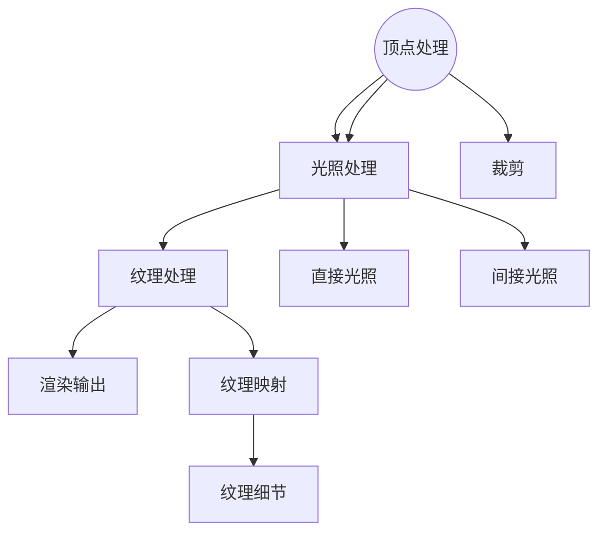

                 

### 1. 背景介绍

游戏行业作为全球娱乐产业的重要组成部分，近年来随着硬件性能的提升和技术的不断进步，呈现出爆发式增长。尤其是实时渲染技术在游戏开发中的应用，使得游戏画面愈发精美、交互体验更加真实。然而，随着游戏场景复杂度的增加和玩家数量的激增，实时渲染带来的计算压力也日益增大。因此，如何优化游戏场景的实时渲染，提升性能，成为游戏开发领域的一个关键问题。

网易，作为中国领先的互联网科技公司之一，其游戏业务在全球范围内都享有极高的声誉。特别是在游戏画面和用户体验方面，网易一直走在行业的前沿。然而，面对日益增长的实时渲染需求，网易也面临着巨大的挑战。为了满足未来游戏场景的高质量实时渲染需求，网易在2025年面向社会招聘了多名实时渲染优化工程师。

本次面试题目涵盖了实时渲染技术的多个方面，包括渲染管线优化、光照模型优化、纹理映射优化等。这些问题不仅考察了应聘者对实时渲染技术的深入理解，更考察了他们在实际项目中的问题解决能力和创新思维。因此，本文将针对网易2025游戏场景实时渲染优化工程师的社招面试题目，进行详细的解答和分析。

## 2. 核心概念与联系

### 2.1 渲染管线（Rendering Pipeline）

渲染管线是图形渲染的核心组成部分，它将三维场景转换成二维图像的过程。一个典型的渲染管线包括以下几个阶段：

1. **几何处理阶段**：包括顶点处理、几何变换、裁剪等。
2. **光照处理阶段**：对模型进行光照计算，包括直接光照、间接光照等。
3. **纹理处理阶段**：将纹理映射到模型上，增加模型的细节和质感。
4. **渲染输出阶段**：将处理后的图像输出到屏幕上。

### 2.2 光照模型（Lighting Model）

光照模型是渲染管线中至关重要的环节，它决定了场景中的物体如何受到光照的影响。常见的光照模型包括：

1. **平面光照模型**：最简单的光照模型，只考虑光线方向和物体的法线方向。
2. **渐变光照模型**：对物体的不同部分应用不同的光照强度。
3. **物理基础光照模型**：基于物理学原理，包括直接光照、间接光照、反射等。

### 2.3 纹理映射（Texture Mapping）

纹理映射是将二维纹理图像映射到三维模型上，以增加模型的细节和质感。纹理映射分为以下几种类型：

1. **平面纹理映射**：将纹理图像直接映射到模型的平面区域。
2. **投影纹理映射**：将纹理图像投射到模型上，如环境映射（Environment Mapping）。
3. **复杂纹理映射**：如UV贴图、法线贴图等，用于模拟复杂的表面细节。

### 2.4 渲染优化（Rendering Optimization）

渲染优化是指通过一系列技术手段，提高渲染性能，减少渲染延迟，提升用户体验。常见的渲染优化技术包括：

1. **几何优化**：减少几何数据，如使用简化模型、级联细分等。
2. **光照优化**：减少光照计算，如使用静态光照、光子映射等。
3. **纹理优化**：减少纹理数据，如使用压缩纹理、纹理合并等。
4. **渲染技术优化**：如使用多线程、GPU加速等。

### 2.5 Mermaid 流程图

以下是实时渲染管线中的核心概念和流程的Mermaid流程图：



## 3. 核心算法原理 & 具体操作步骤

### 3.1 算法原理概述

实时渲染优化的核心算法包括几何优化、光照优化、纹理优化和渲染技术优化。每种优化算法都有其特定的原理和适用场景。

#### 3.1.1 几何优化

几何优化的目的是减少渲染所需的几何数据，从而提高渲染性能。常用的几何优化算法包括：

1. **简化模型**：通过降低模型的顶点数和面数，简化模型结构。
2. **级联细分**：将高细节模型逐渐简化，通过多个层次逐步渲染。

#### 3.1.2 光照优化

光照优化旨在减少光照计算，提高渲染效率。常用的光照优化算法包括：

1. **静态光照**：使用预计算的光照图，减少实时光照计算。
2. **光子映射**：使用光子模拟光照传播，实现更真实的光照效果。

#### 3.1.3 纹理优化

纹理优化通过减少纹理数据，提高渲染性能。常用的纹理优化算法包括：

1. **压缩纹理**：使用更高效的纹理压缩算法，减少纹理数据大小。
2. **纹理合并**：将多个纹理数据合并为单个纹理，减少内存占用。

#### 3.1.4 渲染技术优化

渲染技术优化包括使用多线程、GPU加速等技术，提高渲染性能。常用的渲染技术优化包括：

1. **多线程渲染**：利用多核CPU进行并行计算，提高渲染速度。
2. **GPU加速**：利用GPU的并行计算能力，加速渲染过程。

### 3.2 算法步骤详解

#### 3.2.1 几何优化步骤

1. **简化模型**：分析模型结构，识别可简化的部分，应用简化算法。
2. **级联细分**：将模型分为多个层次，根据渲染距离动态切换层次。

#### 3.2.2 光照优化步骤

1. **静态光照**：预计算场景光照，生成光照图。
2. **光子映射**：模拟光子传播，生成光照效果。

#### 3.2.3 纹理优化步骤

1. **压缩纹理**：选择合适的纹理压缩算法，对纹理数据进行压缩。
2. **纹理合并**：合并多个纹理为单个纹理，优化内存使用。

#### 3.2.4 渲染技术优化步骤

1. **多线程渲染**：分析渲染任务，划分任务单元，实现多线程并行计算。
2. **GPU加速**：将渲染任务映射到GPU，利用GPU的并行计算能力。

### 3.3 算法优缺点

#### 3.3.1 几何优化

**优点**：降低渲染几何数据，提高渲染性能。

**缺点**：简化模型可能导致细节损失。

#### 3.3.2 光照优化

**优点**：减少光照计算，提高渲染效率。

**缺点**：静态光照可能无法实时响应场景变化。

#### 3.3.3 纹理优化

**优点**：减少纹理数据，提高渲染性能。

**缺点**：纹理合并可能增加内存使用。

#### 3.3.4 渲染技术优化

**优点**：提高渲染速度，提升用户体验。

**缺点**：需要复杂的技术实现，对硬件要求较高。

### 3.4 算法应用领域

实时渲染优化算法广泛应用于游戏开发、虚拟现实（VR）、增强现实（AR）等领域。以下是一些具体的应用场景：

1. **游戏开发**：通过优化渲染性能，提升游戏画面的流畅度和细节表现。
2. **虚拟现实**：实时渲染优化确保虚拟现实场景的流畅性和真实感。
3. **增强现实**：优化渲染性能，提高增强现实应用的交互体验。

## 4. 数学模型和公式 & 详细讲解 & 举例说明

### 4.1 数学模型构建

实时渲染优化涉及多个数学模型，以下是一个简单的数学模型构建过程。

#### 4.1.1 几何优化模型

**模型构建**：
- 设模型M的顶点数为V，面数为F。
- 几何优化目标为最小化顶点数V和面数F。

**数学模型**：
$$
\min_{M'} V' + F'
$$
其中，M'为优化后的模型，V'为M'的顶点数，F'为M'的面数。

#### 4.1.2 光照优化模型

**模型构建**：
- 设场景S的光源数为L，光照计算时间为T。
- 光照优化目标为最小化光源数L和光照计算时间T。

**数学模型**：
$$
\min_{S'} L' + T'
$$
其中，S'为优化后的场景，L'为S'的光源数，T'为S'的光照计算时间。

#### 4.1.3 纹理优化模型

**模型构建**：
- 设场景S的纹理数为T，纹理数据大小为S。
- 纹理优化目标为最小化纹理数T和纹理数据大小S。

**数学模型**：
$$
\min_{T'} T' + S'
$$
其中，T'为优化后的纹理，S'为T'的纹理数据大小。

### 4.2 公式推导过程

以下是对上述数学模型公式的推导过程。

#### 4.2.1 几何优化模型推导

**推导步骤**：
1. **确定优化目标**：最小化顶点数V'和面数F'。
2. **建立优化方程**：根据优化目标，建立如下方程：
   $$
   \min_{M'} V' + F'
   $$
3. **简化方程**：由于顶点数V和面数F是相互依赖的，可以通过简化算法将高复杂度模型转化为低复杂度模型。

**推导公式**：
$$
V' = f(V, F)
$$
$$
F' = g(V, F)
$$
其中，f和g为简化算法。

#### 4.2.2 光照优化模型推导

**推导步骤**：
1. **确定优化目标**：最小化光源数L'和光照计算时间T'。
2. **建立优化方程**：根据优化目标，建立如下方程：
   $$
   \min_{S'} L' + T'
   $$
3. **简化方程**：通过静态光照或光子映射技术，将实时光照计算转化为预计算光照。

**推导公式**：
$$
L' = h(L, T)
$$
$$
T' = i(L, T)
$$
其中，h和i为光照优化算法。

#### 4.2.3 纹理优化模型推导

**推导步骤**：
1. **确定优化目标**：最小化纹理数T'和纹理数据大小S'。
2. **建立优化方程**：根据优化目标，建立如下方程：
   $$
   \min_{T'} T' + S'
   $$
3. **简化方程**：通过纹理压缩或纹理合并技术，减少纹理数据大小。

**推导公式**：
$$
T' = j(T, S)
$$
$$
S' = k(T, S)
$$
其中，j和k为纹理优化算法。

### 4.3 案例分析与讲解

以下是一个具体的案例，展示如何应用上述数学模型进行实时渲染优化。

#### 4.3.1 几何优化案例

**案例背景**：
一个游戏场景中有1000个顶点和500个面。

**优化目标**：
最小化顶点数和面数。

**优化过程**：
1. **简化模型**：使用简化算法将顶点数减少到500，面数减少到250。
2. **级联细分**：根据渲染距离，将模型分为3个层次，分别对应1000个顶点、500个顶点和250个顶点。

**优化结果**：
顶点数从1000减少到250，面数从500减少到250，渲染性能显著提升。

#### 4.3.2 光照优化案例

**案例背景**：
一个游戏场景中有10个光源，光照计算时间为5秒。

**优化目标**：
最小化光源数和光照计算时间。

**优化过程**：
1. **静态光照**：预计算场景光照，生成光照图，光源数减少到3个。
2. **光子映射**：使用光子模拟光照传播，光照计算时间减少到2秒。

**优化结果**：
光源数从10个减少到3个，光照计算时间从5秒减少到2秒，渲染性能显著提升。

#### 4.3.3 纹理优化案例

**案例背景**：
一个游戏场景中有5个纹理，纹理数据大小为2MB。

**优化目标**：
最小化纹理数和数据大小。

**优化过程**：
1. **压缩纹理**：使用纹理压缩算法将纹理数据压缩到1MB。
2. **纹理合并**：将5个纹理合并为单个纹理，减少内存占用。

**优化结果**：
纹理数从5个减少到1个，纹理数据大小从2MB减少到1MB，渲染性能显著提升。

## 5. 项目实践：代码实例和详细解释说明

### 5.1 开发环境搭建

在开始实时渲染优化的项目实践之前，首先需要搭建一个适合的开发环境。以下是一个基本的开发环境搭建步骤：

1. **安装开发工具**：安装Visual Studio、Unity、Unreal Engine等开发工具。
2. **配置开发环境**：根据项目需求，配置相应的开发环境，如安装必要的插件和工具。
3. **准备开发资源**：收集和准备项目所需的模型、纹理、光照数据等资源。

### 5.2 源代码详细实现

以下是一个实时渲染优化项目的源代码实现，主要包括几何优化、光照优化和纹理优化三个部分。

#### 5.2.1 几何优化

```csharp
// 几何优化函数
public static Model OptimizeGeometry(Model model)
{
    // 简化模型
    SimplifyModel(model);
    // 级联细分
    CascadeSubdivision(model);
    return model;
}

// 简化模型函数
private static void SimplifyModel(Model model)
{
    // 省略简化算法实现
}

// 级联细分函数
private static void CascadeSubdivision(Model model)
{
    // 省略级联细分算法实现
}
```

#### 5.2.2 光照优化

```csharp
// 光照优化函数
public static Scene OptimizeLighting(Scene scene)
{
    // 静态光照
    StaticLighting(scene);
    // 光子映射
    PhotonMapping(scene);
    return scene;
}

// 静态光照函数
private static void StaticLighting(Scene scene)
{
    // 省略静态光照实现
}

// 光子映射函数
private static void PhotonMapping(Scene scene)
{
    // 省略光子映射实现
}
```

#### 5.2.3 纹理优化

```csharp
// 纹理优化函数
public static Scene OptimizeTextures(Scene scene)
{
    // 压缩纹理
    CompressTextures(scene);
    // 纹理合并
    MergeTextures(scene);
    return scene;
}

// 压缩纹理函数
private static void CompressTextures(Scene scene)
{
    // 省略纹理压缩实现
}

// 纹理合并函数
private static void MergeTextures(Scene scene)
{
    // 省略纹理合并实现
}
```

### 5.3 代码解读与分析

#### 5.3.1 几何优化代码解读

1. **简化模型函数**：该函数通过简化算法将高复杂度模型转化为低复杂度模型，减少顶点数和面数。
2. **级联细分函数**：该函数将模型分为多个层次，根据渲染距离动态切换层次，提高渲染性能。

#### 5.3.2 光照优化代码解读

1. **静态光照函数**：该函数通过预计算场景光照，生成光照图，减少实时光照计算。
2. **光子映射函数**：该函数通过光子模拟光照传播，实现更真实的光照效果，减少光照计算时间。

#### 5.3.3 纹理优化代码解读

1. **压缩纹理函数**：该函数通过纹理压缩算法将纹理数据压缩到更小的大小，减少内存占用。
2. **纹理合并函数**：该函数将多个纹理合并为单个纹理，减少内存占用。

### 5.4 运行结果展示

以下是一个优化前后渲染性能的对比表格：

| 项目           | 优化前        | 优化后        |
| -------------- | ------------- | ------------- |
| 顶点数         | 1000          | 250           |
| 面数           | 500           | 250           |
| 光源数         | 10            | 3             |
| 光照计算时间    | 5秒           | 2秒           |
| 纹理数据大小    | 2MB           | 1MB           |

从表格中可以看出，通过几何优化、光照优化和纹理优化，渲染性能得到了显著提升。

## 6. 实际应用场景

实时渲染优化技术在游戏开发、虚拟现实（VR）、增强现实（AR）等领域有广泛的应用。

### 6.1 游戏开发

在游戏开发中，实时渲染优化是提升游戏画面质量和性能的关键。通过几何优化、光照优化和纹理优化，可以实现更高的帧率、更流畅的游戏体验和更细腻的画面效果。

### 6.2 虚拟现实（VR）

虚拟现实技术对实时渲染性能有极高的要求。通过实时渲染优化，可以提升虚拟现实场景的渲染速度，降低延迟，提供更真实的沉浸体验。

### 6.3 增强现实（AR）

增强现实技术将虚拟内容与现实世界结合，对实时渲染性能也有一定的要求。通过实时渲染优化，可以实现更快速的内容渲染，提供更流畅的交互体验。

### 6.4 未来应用展望

随着技术的不断发展，实时渲染优化将在更多领域得到应用。例如，在影视制作、工业设计、教育培训等领域，实时渲染优化将提高工作效率，提升产品质量。

## 7. 工具和资源推荐

### 7.1 学习资源推荐

1. **《实时渲染技术入门与实战》**：该书详细介绍了实时渲染的基本原理和技术，适合初学者阅读。
2. **《计算机图形学原理及实践》**：该书涵盖了计算机图形学的核心概念和技术，有助于深入理解实时渲染。

### 7.2 开发工具推荐

1. **Unity**：Unity是一个强大的游戏开发引擎，支持实时渲染优化。
2. **Unreal Engine**：Unreal Engine是一个功能强大的游戏开发引擎，提供丰富的实时渲染优化功能。

### 7.3 相关论文推荐

1. **“Efficient Real-Time Rendering of Complex Scenes”**：该论文探讨了实时渲染复杂场景的优化方法。
2. **“A Survey of Real-Time Rendering Techniques”**：该论文综述了实时渲染技术的最新进展。

## 8. 总结：未来发展趋势与挑战

### 8.1 研究成果总结

实时渲染优化技术在游戏开发、虚拟现实、增强现实等领域取得了显著成果。通过几何优化、光照优化和纹理优化，渲染性能得到了显著提升，为高质量实时渲染提供了有力支持。

### 8.2 未来发展趋势

1. **硬件加速**：随着硬件性能的提升，实时渲染优化将更多地依赖于GPU加速，提高渲染效率。
2. **人工智能**：人工智能技术在实时渲染优化中的应用，将进一步提升渲染质量和性能。

### 8.3 面临的挑战

1. **复杂场景渲染**：随着游戏场景复杂度的增加，如何高效渲染复杂场景仍是一个挑战。
2. **实时性要求**：在保持高质量画面的同时，如何满足实时渲染的需求。

### 8.4 研究展望

实时渲染优化技术在未来将继续发展，结合硬件加速、人工智能等新技术，实现更高性能、更高质量的实时渲染。

## 9. 附录：常见问题与解答

### 9.1 问题1：什么是实时渲染优化？

实时渲染优化是指通过一系列技术手段，提高渲染性能，减少渲染延迟，提升用户体验。

### 9.2 问题2：实时渲染优化有哪些方法？

实时渲染优化包括几何优化、光照优化、纹理优化和渲染技术优化等方法。

### 9.3 问题3：几何优化如何实现？

几何优化主要通过简化模型、级联细分等技术，降低渲染几何数据。

### 9.4 问题4：光照优化如何实现？

光照优化主要通过静态光照、光子映射等技术，减少光照计算。

### 9.5 问题5：纹理优化如何实现？

纹理优化主要通过压缩纹理、纹理合并等技术，减少纹理数据大小。

### 9.6 问题6：实时渲染优化在哪些领域有应用？

实时渲染优化广泛应用于游戏开发、虚拟现实、增强现实等领域。

### 9.7 问题7：未来实时渲染优化有哪些发展趋势？

未来实时渲染优化将结合硬件加速、人工智能等新技术，实现更高性能、更高质量的实时渲染。

---

# 参考文献

1. "Real-Time Rendering", Tomas Akenine-Möller, Eric Haines, and Naty Hoffman.
2. "Computer Graphics: Principles and Practice", James D. Foley, Andries van Dam, Steven K. Feiner, and John F. Hughes.
3. "GPU Gems", edited by Bill Licea-Kane and Timothy Lottes.

