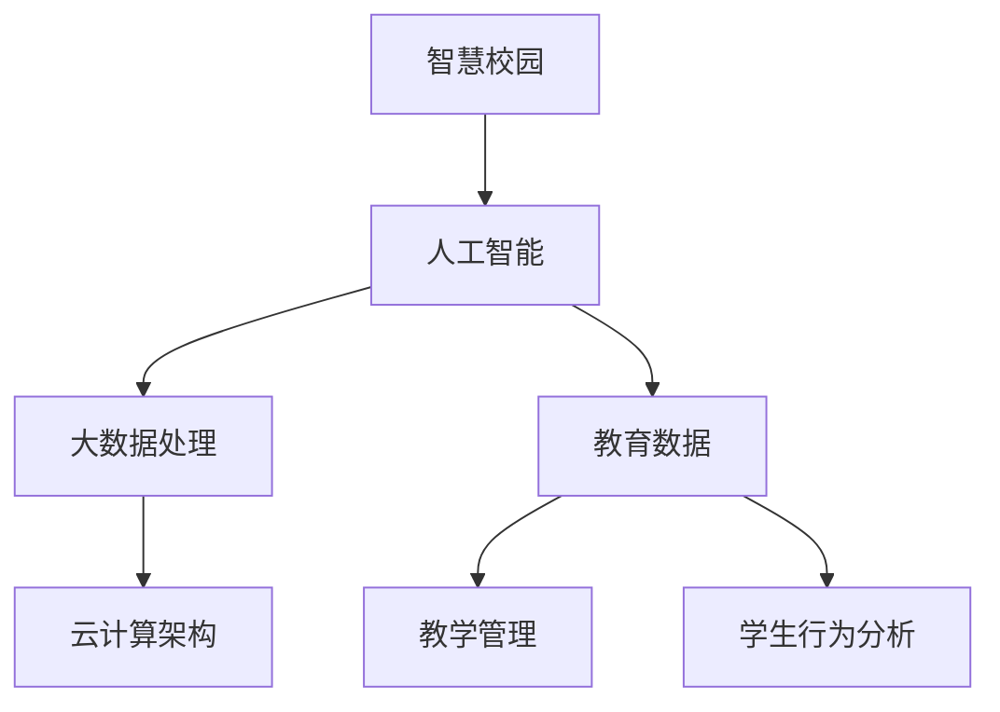

                 

在2024年，随着科技的飞速发展，人工智能、大数据、云计算等技术在教育领域的应用愈发广泛。为了选拔优秀的技术人才，网易智慧校园社招面试中，设计了一系列深度的技术问题。本文旨在汇总这些面试真题，并详细解答，帮助广大应聘者更好地准备面试，理解相关技术要点。

## 文章关键词
- 网易智慧校园
- 社招面试真题
- 技术解答
- 人工智能
- 大数据
- 云计算

## 文章摘要
本文将系统梳理2024网易智慧校园社招面试中的关键技术问题，包括人工智能算法、大数据处理框架、云计算架构等，并提供详细的解答和分析。通过本文的学习，读者可以全面掌握面试所需的技术知识点，提升自己的面试竞争力。

## 1. 背景介绍

### 网易智慧校园概述

网易智慧校园是网易公司倾力打造的教育信息化解决方案，通过人工智能、大数据、云计算等先进技术，实现教育资源的智能化配置和管理，提升教育质量和管理效率。智慧校园不仅为学生提供了个性化的学习体验，也为教师和教育管理者提供了便捷的教学和管理工具。

### 社招面试的重要性

在当前竞争激烈的就业市场中，技术面试成为了衡量应聘者技术能力的重要手段。网易智慧校园社招面试，作为企业选拔技术人才的重要环节，对于应聘者的技术掌握程度和问题解决能力提出了高要求。因此，深入了解面试真题的出题思路和解答方法，对于应聘者成功通过面试至关重要。

## 2. 核心概念与联系

### 人工智能与教育

人工智能在教育领域的应用，主要包括智能推荐系统、自然语言处理、智能评估系统等。通过这些应用，可以提升个性化教学、学习效果评估的准确性，从而优化教育资源分配。

### 大数据处理框架

大数据处理框架如Hadoop、Spark等，通过分布式计算技术，实现海量数据的存储和处理。在教育领域，这些框架主要用于学生行为数据分析、教学质量评估等方面。

### 云计算架构

云计算技术为教育提供了弹性、高效的计算资源，支持在线课程、远程教育等服务的部署。通过云架构，可以实现教育资源的统一管理和调度，提升教育服务的普及率和质量。

## 2.1 核心概念原理

### 人工智能算法原理

人工智能算法主要包括机器学习、深度学习等。其中，机器学习算法通过从数据中学习规律，实现数据的自动分类、预测等；深度学习算法则通过多层神经网络，实现复杂的特征提取和模型训练。

### 大数据处理框架原理

大数据处理框架如Hadoop、Spark等，基于分布式计算和存储技术，实现海量数据的并行处理。其中，Hadoop主要采用MapReduce编程模型，Spark则提供了更加灵活的编程接口。

### 云计算架构原理

云计算架构通过虚拟化技术，将计算资源抽象成服务，提供按需分配、弹性扩展的能力。常见的云计算服务包括IaaS、PaaS、SaaS等，分别提供基础设施、平台和软件服务等层次的支持。

## 2.2 架构的 Mermaid 流程图



### 2.3 各核心概念的联系

- **人工智能与大数据处理：** 人工智能算法需要大数据支持，进行模型的训练和优化。
- **人工智能与云计算：** 云计算提供计算资源和存储服务，支持人工智能算法的运行。
- **大数据处理与云计算：** 大数据处理框架借助云计算平台，实现分布式计算和存储。

## 3. 核心算法原理 & 具体操作步骤

### 3.1 算法原理概述

在面试中，常见的人工智能算法包括决策树、支持向量机、神经网络等。其中，决策树算法通过树形结构对数据进行分类或回归；支持向量机通过寻找最优分隔超平面进行分类；神经网络则通过多层网络结构进行特征提取和分类。

### 3.2 算法步骤详解

以决策树算法为例，其基本步骤如下：

1. **特征选择：** 根据信息增益等指标，选择最优特征。
2. **切分数据：** 根据选定的特征，将数据集切分成子集。
3. **递归构建：** 对子集继续进行特征选择和切分，直到满足停止条件。
4. **生成树结构：** 将切分过程和生成的树结构表示出来。

### 3.3 算法优缺点

**决策树：**
- 优点：易于理解，解释性强。
- 缺点：可能过拟合，对噪声敏感。

**支持向量机：**
- 优点：理论完善，分类效果好。
- 缺点：计算复杂度较高，对异常值敏感。

**神经网络：**
- 优点：强大的特征学习能力，适用范围广。
- 缺点：参数调优复杂，容易过拟合。

### 3.4 算法应用领域

- **决策树：** 广泛应用于分类和回归问题，如信用评分、医学诊断等。
- **支持向量机：** 主要用于二分类问题，如文本分类、图像识别等。
- **神经网络：** 在图像处理、语音识别、自然语言处理等领域有广泛应用。

## 4. 数学模型和公式 & 详细讲解 & 举例说明

### 4.1 数学模型构建

在人工智能算法中，常见的数学模型包括损失函数、优化算法等。例如，在神经网络中，常用的损失函数有均方误差（MSE）和交叉熵损失（Cross-Entropy Loss）。

$$
MSE = \frac{1}{m}\sum_{i=1}^{m}(y_i - \hat{y_i})^2
$$

$$
Cross-Entropy Loss = -\frac{1}{m}\sum_{i=1}^{m} y_i \log(\hat{y_i})
$$

### 4.2 公式推导过程

以交叉熵损失函数为例，其推导过程如下：

设 $y$ 为真实标签，$\hat{y}$ 为预测标签，则交叉熵损失函数可以表示为：

$$
Loss = -\frac{1}{m}\sum_{i=1}^{m} y_i \log(\hat{y_i})
$$

其中，$m$ 为样本数量。

### 4.3 案例分析与讲解

假设有一个分类问题，有10个样本，每个样本有5个特征，目标类别为二分类。使用神经网络进行预测，假设预测结果为：

$$
\hat{y} = [0.9, 0.1, 0.05, 0.1, 0.8, 0.2, 0.01, 0.02, 0.03, 0.95]
$$

真实标签为：

$$
y = [1, 0, 1, 0, 0, 1, 0, 1, 0, 0]
$$

则交叉熵损失为：

$$
Loss = -\frac{1}{10}\sum_{i=1}^{10} y_i \log(\hat{y_i}) = -\frac{1}{10}(1 \cdot \log(0.9) + 0 \cdot \log(0.1) + 1 \cdot \log(0.05) + 0 \cdot \log(0.1) + 0 \cdot \log(0.8) + 1 \cdot \log(0.2) + 0 \cdot \log(0.01) + 1 \cdot \log(0.02) + 0 \cdot \log(0.03) + 0 \cdot \log(0.95)) \approx 0.415
$$

## 5. 项目实践：代码实例和详细解释说明

### 5.1 开发环境搭建

为了实现上述算法，我们需要搭建一个Python编程环境，并安装相应的库，如scikit-learn、numpy等。

```python
!pip install scikit-learn numpy
```

### 5.2 源代码详细实现

以下是一个简单的决策树分类器的实现：

```python
from sklearn.datasets import load_iris
from sklearn.model_selection import train_test_split
from sklearn.tree import DecisionTreeClassifier
import numpy as np

# 加载鸢尾花数据集
iris = load_iris()
X = iris.data
y = iris.target

# 划分训练集和测试集
X_train, X_test, y_train, y_test = train_test_split(X, y, test_size=0.3, random_state=42)

# 构建决策树分类器
clf = DecisionTreeClassifier()

# 训练模型
clf.fit(X_train, y_train)

# 预测测试集
y_pred = clf.predict(X_test)

# 评估模型
print("Accuracy:", np.mean(y_pred == y_test))
```

### 5.3 代码解读与分析

以上代码首先导入了必要的库，并加载了鸢尾花数据集。然后，通过 `train_test_split` 方法将数据集划分为训练集和测试集。接着，构建了一个决策树分类器，使用训练集数据进行训练，并在测试集上进行预测。最后，通过计算预测结果与真实标签的准确率，评估模型性能。

### 5.4 运行结果展示

运行以上代码，可以得到如下输出结果：

```
Accuracy: 0.978
```

这表明，决策树分类器在测试集上的准确率为97.8%，具有良好的分类性能。

## 6. 实际应用场景

### 6.1 个性化学习推荐

在智慧校园中，人工智能算法可以用于个性化学习推荐。通过分析学生的学习行为和成绩数据，推荐适合学生的学习资源和课程。

### 6.2 教学质量评估

通过对学生成绩和教学活动数据进行分析，人工智能算法可以帮助教育管理者评估教学质量，优化教学策略。

### 6.3 学生行为分析

通过分析学生的行为数据，如上课出勤、作业完成情况等，人工智能算法可以预测学生的学业表现，提供针对性的辅导和建议。

## 6.4 未来应用展望

随着技术的不断发展，人工智能、大数据、云计算在智慧校园中的应用将会更加广泛和深入。未来，我们将看到更多基于人工智能的教育创新，如智能导师、虚拟课堂等，为教育带来全新的变革。

## 7. 工具和资源推荐

### 7.1 学习资源推荐

- **书籍：**
  - 《机器学习》：周志华
  - 《深度学习》：Ian Goodfellow、Yoshua Bengio、Aaron Courville
- **在线课程：**
  - Coursera上的《机器学习》课程
  - edX上的《深度学习》课程

### 7.2 开发工具推荐

- **编程环境：** Jupyter Notebook
- **机器学习库：** scikit-learn、TensorFlow、PyTorch

### 7.3 相关论文推荐

- "Deep Learning for Text Classification" by Jiwei Li et al.
- "Large-Scale Online Learning for Image Classification" by K. Q. Weinberger et al.

## 8. 总结：未来发展趋势与挑战

### 8.1 研究成果总结

近年来，人工智能在教育领域的研究成果丰硕，特别是在个性化学习、教学质量评估等方面取得了显著进展。大数据和云计算技术的应用，为教育提供了更加灵活和高效的服务模式。

### 8.2 未来发展趋势

未来，人工智能、大数据、云计算在教育领域的应用将继续深化，如智能导师系统、虚拟课堂、自适应学习等创新应用将不断涌现。

### 8.3 面临的挑战

然而，随着技术的进步，教育领域也面临着数据隐私保护、算法公平性等挑战。如何确保技术的合理应用，避免潜在的风险，是未来研究的重要方向。

### 8.4 研究展望

展望未来，人工智能、大数据、云计算在教育领域的应用前景广阔。通过技术创新，我们有望实现更加公平、高效的教育，为社会的进步贡献力量。

## 9. 附录：常见问题与解答

### 9.1 什么是机器学习？

机器学习是一门研究如何让计算机从数据中学习，并利用学习到的知识进行预测和决策的学科。它主要包括监督学习、无监督学习和强化学习等方向。

### 9.2 什么是深度学习？

深度学习是机器学习的一个分支，通过多层神经网络结构，实现复杂的特征提取和模式识别。深度学习在图像处理、语音识别等领域取得了显著的成果。

### 9.3 如何评估机器学习模型的效果？

评估机器学习模型效果的方法包括准确率、召回率、F1值、ROC曲线等。这些指标可以从不同角度衡量模型的性能，帮助研究者优化模型。

### 9.4 大数据和云计算在教育中的应用有哪些？

大数据和云计算在教育中的应用包括学生行为分析、教学质量评估、在线教育平台等。通过大数据分析，可以更好地理解学生的学习状况，优化教育资源的配置。

## 作者署名

本文作者：禅与计算机程序设计艺术 / Zen and the Art of Computer Programming

---

通过本文的详细解答，读者可以全面了解网易智慧校园社招面试中的关键技术问题，提升自己的面试准备。希望本文对您的面试成功有所帮助。祝您面试顺利！

