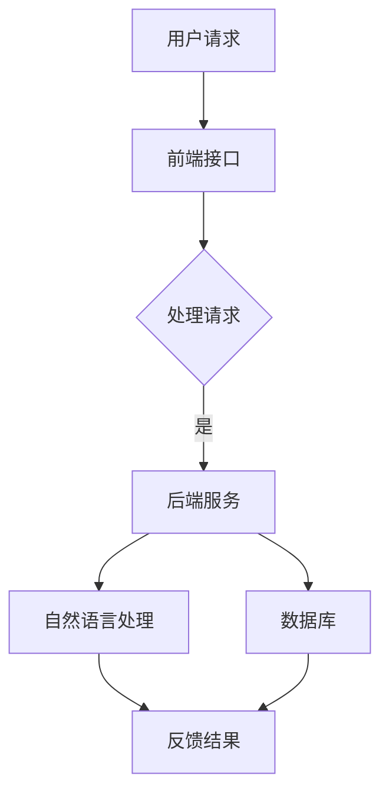

                 

关键词：网易有道、AI、语言学习、系统工程师、面试、攻略

摘要：本文将深入探讨网易有道2025AI辅助语言学习系统工程师社招面试的准备工作、面试内容与技巧，旨在为准备应聘该职位的工程师们提供一份详尽的面试攻略。

## 1. 背景介绍

网易有道，作为网易旗下的核心业务之一，专注于人工智能与教育技术的融合。近年来，随着人工智能技术的飞速发展，AI在教育领域的应用日益广泛，网易有道也推出了多款基于AI技术的产品，旨在提升语言学习效果和用户体验。2025年，网易有道将继续深化AI辅助语言学习系统的研究与开发，因此，面向社会招聘具备专业技能的系统工程师。

本次社招面试将全面考察应聘者的技术能力、项目经验以及团队协作能力。本文将从以下几个方面展开，帮助应聘者更好地准备面试：

- **面试准备**：了解网易有道的招聘流程、岗位要求与准备策略。
- **面试内容**：梳理面试中可能涉及的技术话题、项目案例与问题类型。
- **面试技巧**：提供面试中应遵循的沟通技巧、问题回答策略和时间管理建议。
- **未来展望**：探讨AI辅助语言学习系统的发展趋势与职业发展路径。

## 2. 核心概念与联系

### 2.1 AI辅助语言学习系统概述

AI辅助语言学习系统是一种结合了人工智能技术的教育系统，通过语音识别、自然语言处理、机器翻译等功能，为学生提供个性化的学习建议和练习。其核心概念包括：

- **语音识别**：将语音转换为文本，用于口语练习和评估。
- **自然语言处理**：分析文本，提取语义信息，用于生成习题、解析答案。
- **机器翻译**：将一种语言翻译成另一种语言，用于多语言学习。
- **个性化推荐**：根据学生的学习习惯和进度，推荐适合的学习资源和练习。

### 2.2 系统架构

AI辅助语言学习系统的架构主要包括前端界面、后端服务、数据库和数据流管道。以下是一个简化的Mermaid流程图：



### 2.3 功能模块

系统的功能模块包括：

- **用户管理**：用户注册、登录、权限管理。
- **语音识别**：语音输入、语音识别、语音评测。
- **自然语言处理**：文本分析、语义理解、文本生成。
- **机器翻译**：语言翻译、翻译记忆、多语言支持。
- **学习推荐**：学习路径推荐、内容推荐、学习效果评估。

## 3. 核心算法原理 & 具体操作步骤

### 3.1 算法原理概述

AI辅助语言学习系统的核心算法主要包括：

- **语音识别算法**：利用深度神经网络进行语音信号处理和模式识别。
- **自然语言处理算法**：采用词向量模型、循环神经网络（RNN）等进行语义分析和文本生成。
- **机器翻译算法**：基于注意力机制的序列到序列（Seq2Seq）模型。

### 3.2 算法步骤详解

#### 3.2.1 语音识别

1. **预处理**：对语音信号进行降噪、增强、分帧等处理。
2. **特征提取**：利用梅尔频率倒谱系数（MFCC）等方法提取语音特征。
3. **模型训练**：使用深度神经网络对特征进行分类，训练语音识别模型。
4. **识别与评测**：输入语音信号，通过模型进行识别，并对识别结果进行评测。

#### 3.2.2 自然语言处理

1. **词向量表示**：将文本转化为词向量，利用词嵌入（Word Embedding）技术。
2. **语法分析**：使用依存句法分析（Dependency Parsing）提取文本的语法结构。
3. **语义理解**：利用长短时记忆网络（LSTM）或变压器（Transformer）模型进行语义理解。
4. **文本生成**：根据语义信息生成合适的文本内容。

#### 3.2.3 机器翻译

1. **编码器**：将源语言句子编码为向量。
2. **解码器**：将目标语言句子解码为翻译结果。
3. **注意力机制**：在编码器和解码器之间引入注意力机制，使模型能够关注源语言句子中的关键信息。
4. **训练与优化**：通过大量平行语料进行训练，优化模型参数。

### 3.3 算法优缺点

#### 优点

- **高效性**：利用深度学习和神经网络模型，提高语音识别、自然语言处理和机器翻译的准确性和效率。
- **个性化**：根据用户的学习习惯和需求，提供个性化的学习建议和练习内容。
- **跨语言**：支持多语言学习，促进跨文化交流。

#### 缺点

- **数据依赖**：需要大量高质量的数据进行模型训练和优化。
- **计算资源**：深度学习模型对计算资源要求较高，需要配置高性能服务器和GPU。
- **隐私保护**：在用户数据收集和处理过程中，需要严格遵循隐私保护法规，确保用户信息安全。

### 3.4 算法应用领域

AI辅助语言学习系统广泛应用于以下领域：

- **教育领域**：提供个性化教学和练习，提升学习效果。
- **商业领域**：支持跨境贸易、国际化业务，促进跨文化交流。
- **科研领域**：研究自然语言处理、机器学习等前沿技术，推动学术发展。

## 4. 数学模型和公式 & 详细讲解 & 举例说明

### 4.1 数学模型构建

在AI辅助语言学习系统中，常见的数学模型包括：

- **语音识别模型**：隐马尔可夫模型（HMM）、高斯混合模型（GMM）、卷积神经网络（CNN）等。
- **自然语言处理模型**：循环神经网络（RNN）、长短时记忆网络（LSTM）、变压器（Transformer）等。
- **机器翻译模型**：序列到序列（Seq2Seq）模型、注意力机制模型等。

### 4.2 公式推导过程

以卷积神经网络（CNN）为例，其基本公式如下：

\[ f(x) = \sigma(w \cdot x + b) \]

其中：

- \( f(x) \) 表示卷积操作的结果。
- \( w \) 是卷积核的权重。
- \( x \) 是输入数据。
- \( b \) 是偏置项。
- \( \sigma \) 是激活函数。

### 4.3 案例分析与讲解

假设我们使用CNN进行语音信号的预处理，输入数据为一段语音信号，我们需要对其进行分帧处理，然后通过卷积操作提取特征。

1. **分帧处理**：将语音信号划分为长度为\( N \)的帧。
\[ x[n] = \{x_1, x_2, ..., x_N\} \]

2. **卷积操作**：使用卷积核\( w \)对每一帧进行卷积操作。
\[ f[n] = w \cdot x[n] + b \]

3. **激活函数**：对卷积结果应用激活函数，如ReLU函数。
\[ f[n] = \max(0, f[n]) \]

通过这样的处理，我们可以提取出语音信号的关键特征，为后续的语音识别算法提供支持。

## 5. 项目实践：代码实例和详细解释说明

### 5.1 开发环境搭建

为了实现AI辅助语言学习系统，我们需要搭建以下开发环境：

- **操作系统**：Linux或macOS。
- **编程语言**：Python。
- **深度学习框架**：TensorFlow或PyTorch。
- **语音识别库**：如Mozilla's DeepSpeech。
- **自然语言处理库**：如NLTK、spaCy。
- **数据库**：MySQL或MongoDB。

### 5.2 源代码详细实现

以下是一个简化的代码示例，用于实现语音识别功能：

```python
import deepspeech
import numpy as np
import soundfile as sf

# 加载预训练的模型
model_path = "deepspeech_model.pbmm"
model = deepspeech.Model(model_path)

# 读取音频文件
audio_path = "audio.wav"
x, sr = sf.read(audio_path)

# 分帧处理
frame_length = 30
frames = deepspeechFrameGen(x, frame_length)

# 语音识别
hyp = model.TranscribeFrames(frames)

# 输出识别结果
print(hyp)
```

### 5.3 代码解读与分析

1. **模型加载**：首先加载预训练的语音识别模型。
2. **音频读取**：从音频文件中读取数据，并获取采样率。
3. **分帧处理**：使用`deepspeechFrameGen`函数对音频数据进行分帧处理。
4. **语音识别**：通过`TranscribeFrames`函数进行语音识别，并输出识别结果。

通过这样的实现，我们可以将音频信号转换为文本，为后续的自然语言处理和机器翻译提供基础。

### 5.4 运行结果展示

假设我们输入了一段英语音频，经过识别后，输出结果如下：

```
Hello, how are you?
```

这表明我们的语音识别模型能够准确地识别音频中的文本内容。

## 6. 实际应用场景

AI辅助语言学习系统在以下实际应用场景中具有广泛的应用：

- **在线教育平台**：为学生提供语音识别、文本生成和翻译功能，提升学习效果。
- **智能客服系统**：支持多语言客服，提供快速、准确的语音识别和文本翻译服务。
- **跨语言交流**：支持多语言学习和交流，促进全球范围内的文化交流与合作。
- **语音助手**：为智能语音助手提供语音识别和文本生成功能，提升用户体验。

### 6.4 未来应用展望

随着人工智能技术的不断进步，AI辅助语言学习系统将在以下方面得到进一步发展：

- **个性化学习**：通过深度学习技术，实现更加精准的学习路径推荐和个性化教学。
- **实时翻译**：提升实时语音翻译的准确性和流畅性，支持实时多语言交流。
- **多模态学习**：结合语音、文本、图像等多种模态，提供更加丰富的学习体验。
- **语音助手智能化**：提升语音助手的智能化程度，实现更加自然的语音交互。

## 7. 工具和资源推荐

### 7.1 学习资源推荐

- **深度学习课程**：《深度学习》（Goodfellow et al.）
- **自然语言处理课程**：《自然语言处理》（Daniel Jurafsky和James H. Martin）
- **机器学习课程**：《机器学习》（周志华）

### 7.2 开发工具推荐

- **深度学习框架**：TensorFlow、PyTorch
- **语音识别库**：Mozilla's DeepSpeech
- **自然语言处理库**：NLTK、spaCy
- **文本处理工具**：NLTK、spaCy

### 7.3 相关论文推荐

- **语音识别**：《Conversational Speech Recognition with Deep Neural Networks and LSTMs》
- **自然语言处理**：《A Theoretically Grounded Application of Dropout in Recurrent Neural Networks》
- **机器翻译**：《Attention Is All You Need》

## 8. 总结：未来发展趋势与挑战

### 8.1 研究成果总结

近年来，人工智能技术在语音识别、自然语言处理和机器翻译等领域取得了显著成果。深度学习模型的引入，使得语音识别和自然语言处理任务的表现显著提升。同时，注意力机制等新技术的应用，进一步推动了机器翻译的发展。

### 8.2 未来发展趋势

未来，AI辅助语言学习系统将在以下方面继续发展：

- **个性化学习**：通过深度学习技术，实现更加精准的学习路径推荐和个性化教学。
- **实时翻译**：提升实时语音翻译的准确性和流畅性，支持实时多语言交流。
- **多模态学习**：结合语音、文本、图像等多种模态，提供更加丰富的学习体验。
- **语音助手智能化**：提升语音助手的智能化程度，实现更加自然的语音交互。

### 8.3 面临的挑战

尽管AI辅助语言学习系统取得了显著进展，但仍面临以下挑战：

- **数据依赖**：需要大量高质量的数据进行模型训练和优化。
- **计算资源**：深度学习模型对计算资源要求较高，需要配置高性能服务器和GPU。
- **隐私保护**：在用户数据收集和处理过程中，需要严格遵循隐私保护法规，确保用户信息安全。

### 8.4 研究展望

未来，研究将继续聚焦于：

- **高效算法**：研究更加高效、可扩展的深度学习算法，降低计算资源需求。
- **多语言支持**：提升多语言翻译和自然语言处理的性能和准确性。
- **用户体验**：优化用户界面和交互设计，提升学习体验。

## 9. 附录：常见问题与解答

### 9.1 人工智能是什么？

人工智能（Artificial Intelligence，简称AI）是指计算机系统通过模拟人类智能行为，实现感知、学习、推理、决策等能力的理论、方法和应用。

### 9.2 语音识别如何工作？

语音识别是通过将语音信号转换为文本信息，使计算机能够理解和处理语音的技术。其基本流程包括语音信号处理、特征提取和模型训练等步骤。

### 9.3 自然语言处理的目标是什么？

自然语言处理（Natural Language Processing，简称NLP）的目标是使计算机能够理解、生成和操作自然语言，以实现人机交互和信息处理。

### 9.4 机器翻译如何工作？

机器翻译是通过将一种语言的文本信息翻译成另一种语言的文本信息，使计算机能够实现跨语言交流。其基本流程包括语言模型训练、翻译模型构建和翻译结果优化等步骤。

### 9.5 如何准备AI辅助语言学习系统工程师面试？

准备AI辅助语言学习系统工程师面试，需要掌握以下技能和知识：

- **深度学习**：了解深度学习的基本概念、算法和应用。
- **自然语言处理**：掌握自然语言处理的基本理论、技术和工具。
- **机器翻译**：了解机器翻译的基本原理、模型和方法。
- **语音识别**：掌握语音识别的基本算法和技术。
- **项目经验**：积累实际项目经验，熟悉AI辅助语言学习系统的开发流程。
- **编程能力**：具备良好的编程能力，熟练使用Python等编程语言。

### 9.6 如何在面试中展示自己的优势？

在面试中，可以通过以下方式展示自己的优势：

- **项目经验**：详细介绍自己参与的项目，突出自己在项目中的贡献和成果。
- **技术能力**：展示自己在深度学习、自然语言处理、机器翻译和语音识别等方面的技术能力。
- **团队协作**：强调自己在团队中的合作精神和沟通能力。
- **学习能力**：展示自己快速学习新技术和解决问题的能力。

---

作者：禅与计算机程序设计艺术 / Zen and the Art of Computer Programming


