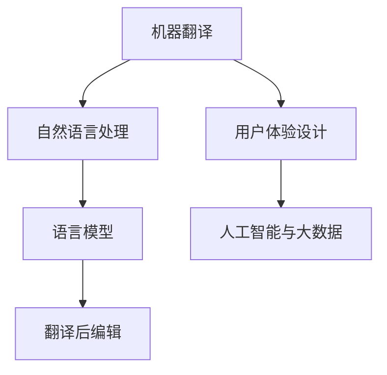

                 

### 1. 背景介绍

在线翻译系统作为一种智能交互工具，已经成为了全球互联网中不可或缺的一部分。无论是跨国商务交流、学术研究、还是日常生活的旅行沟通，在线翻译都扮演着重要的角色。随着人工智能技术的飞速发展，翻译系统的准确性和效率也在不断提升。网易有道，作为中国领先的在线教育及智能学习产品服务提供商，其在线翻译系统在市场上占据了重要地位。

2025年，随着技术的进一步演进和用户需求的不断升级，网易有道计划推出全新的在线翻译系统。为了满足这一战略目标，网易有道面向社会公开招聘优秀的在线翻译系统工程师。作为应聘者，了解面试的整体流程、准备策略和技术要求是成功通过面试的关键。

本文将详细介绍网易有道2025在线翻译系统工程师社招的面试流程、技术考核点以及面试准备策略，帮助有意应聘的工程师们做好充分的准备。

### 2. 核心概念与联系

在线翻译系统不仅仅是一个工具，它涉及到多个核心技术和概念，这些概念和技术的结合构成了整个系统的核心架构。

#### 2.1 机器翻译

机器翻译是整个在线翻译系统的核心。其基本原理是将一种自然语言文本转换为另一种自然语言文本，主要分为基于规则的方法、基于统计的方法和基于神经网络的机器翻译（NMT）。其中，神经机器翻译（NMT）是目前最先进的机器翻译方法，它通过深度学习技术模拟人类翻译过程，取得了显著的效果提升。

#### 2.2 自然语言处理（NLP）

自然语言处理是机器翻译的重要基础。NLP涉及文本处理、语义理解、语言模型等多个方面。其中，词向量模型（如Word2Vec、BERT等）和序列到序列（Seq2Seq）模型是NLP领域的核心技术。

#### 2.3 语言模型

语言模型是机器翻译中不可或缺的部分。它通过统计方法或深度学习技术学习自然语言的规律，用于预测下一个单词或句子。常见的语言模型有N-gram模型、神经网络语言模型（如LSTM、GRU）等。

#### 2.4 翻译后编辑

翻译后编辑（Post-Editing）是对机器翻译结果进行人工修正的过程。由于机器翻译的结果可能存在误差，翻译后编辑能够提高翻译的准确性和可读性。

#### 2.5 用户体验设计

用户体验设计是确保翻译系统易用、高效的关键。好的用户体验设计不仅包括用户界面（UI）的设计，还涉及交互设计（UX）和用户反馈系统。

#### 2.6 人工智能与大数据

人工智能与大数据技术是支撑在线翻译系统高效运行的基础。通过大数据技术收集和分析用户数据，可以不断优化翻译算法和用户体验。人工智能技术则用于构建智能化的翻译模型和自动化翻译后编辑系统。

以下是核心概念和技术的Mermaid流程图：



### 3. 核心算法原理 & 具体操作步骤

#### 3.1 算法原理概述

在线翻译系统中的核心算法主要包括机器翻译算法、自然语言处理算法和语言模型算法。

- **机器翻译算法**：主要基于深度学习技术，特别是神经机器翻译（NMT）。NMT通过序列到序列（Seq2Seq）模型，模拟人类翻译过程，将源语言序列转换为目标语言序列。
- **自然语言处理算法**：包括词向量模型、句法分析、语义理解等。词向量模型用于将文本转换为向量表示，句法分析用于理解文本结构，语义理解则用于捕捉文本的深层含义。
- **语言模型算法**：主要用于预测下一个单词或句子。常见的语言模型包括N-gram模型和神经网络语言模型（如LSTM、GRU）。

#### 3.2 算法步骤详解

以下是机器翻译算法的基本步骤：

1. **数据预处理**：
   - **文本清洗**：去除特殊字符、标点符号，统一文本格式。
   - **分词**：将文本划分为单词或句子。
   - **词向量表示**：使用词向量模型（如Word2Vec、BERT）将单词转换为向量表示。

2. **编码**：
   - **编码器（Encoder）**：将源语言序列编码为一个固定长度的向量。常用的编码器模型包括RNN（如LSTM、GRU）和Transformer。

3. **解码**：
   - **解码器（Decoder）**：将编码器的输出解码为目标语言序列。解码器通常也是一个RNN或Transformer模型。

4. **生成翻译结果**：
   - **贪心搜索**：每次选择概率最高的单词作为下一个输出。
   - ** beam search**：同时考虑多个候选序列，选择最优的序列作为最终输出。

5. **翻译后编辑**：
   - **自动翻译后编辑**：使用规则或深度学习技术自动修复翻译结果中的错误。
   - **人工翻译后编辑**：由专业翻译人员进行最终校对和修改。

#### 3.3 算法优缺点

**优点**：

- **高准确性**：通过深度学习和大数据技术，机器翻译的准确性得到了显著提升。
- **高效率**：翻译系统可以处理大规模的文本数据，实现实时翻译。
- **广泛适用性**：支持多种语言之间的翻译，适用范围广泛。

**缺点**：

- **翻译质量不稳定**：机器翻译的结果可能存在错误，尤其是对于专业术语和俚语。
- **需要大量训练数据**：构建高质量的机器翻译模型需要大量的高质量训练数据。
- **计算资源消耗大**：深度学习模型的训练和推理过程需要大量的计算资源。

#### 3.4 算法应用领域

机器翻译算法在多个领域有广泛应用：

- **在线翻译工具**：如Google翻译、有道翻译等，为用户提供便捷的在线翻译服务。
- **智能客服**：在客户服务系统中，用于实现多语言交流。
- **内容翻译**：在媒体、出版、教育等领域，用于翻译文档、书籍、新闻等内容。
- **跨语言搜索**：在搜索引擎中，用于支持多语言搜索功能。

### 4. 数学模型和公式 & 详细讲解 & 举例说明

#### 4.1 数学模型构建

在线翻译系统的核心数学模型包括词向量模型、编码器-解码器模型和翻译后编辑模型。

- **词向量模型**：

  词向量模型将单词转换为高维向量表示，用于文本的向量表示和语义理解。常用的模型有Word2Vec和BERT。

  $$ 
  \text{Word2Vec:} \\
  \text{word\_vector} = \text{sigmoid}(\text{weights} \cdot \text{input\_vector}) 
  $$

  其中，`weights` 是权重矩阵，`input_vector` 是输入的单词向量。

- **编码器-解码器模型**：

  编码器-解码器模型用于将源语言序列编码为固定长度的向量，并将该向量解码为目标语言序列。

  $$
  \text{Encoder:} \\
  \text{context\_vector} = \text{LSTM}(\text{input\_sequence})
  $$

  $$
  \text{Decoder:} \\
  \text{output\_sequence} = \text{softmax}(\text{decoder}_{\text{weights}} \cdot \text{context\_vector})
  $$

  其中，`context_vector` 是编码器的输出向量，`decoder_weights` 是解码器的权重矩阵。

- **翻译后编辑模型**：

  翻译后编辑模型用于自动修复翻译结果中的错误。常用的方法有规则方法和深度学习方法。

  $$
  \text{Rule-based:} \\
  \text{corrected\_text} = \text{apply\_rules}(\text{translated\_text})
  $$

  $$
  \text{Deep-learning-based:} \\
  \text{corrected\_text} = \text{generate\_text}(\text{translated\_text}, \text{context})
  $$

  其中，`corrected_text` 是修正后的文本，`translated_text` 是机器翻译结果，`context` 是上下文信息。

#### 4.2 公式推导过程

以下是编码器-解码器模型中的一些关键公式推导过程：

1. **编码器公式推导**：

   编码器通过循环神经网络（RNN）或变换器（Transformer）将源语言序列编码为固定长度的向量。

   $$
   \text{context\_vector} = \text{LSTM}(\text{input\_sequence}) \\
   \text{context\_vector} = \text{h_t}
   $$

   其中，`h_t` 是编码器在时间步`t`的输出向量，即编码后的序列表示。

2. **解码器公式推导**：

   解码器通过注意力机制将编码器的输出向量解码为目标语言序列。

   $$
   \text{context\_vector} = \text{attention}(\text{h_t}, \text{context\_vector}) \\
   \text{output\_sequence} = \text{softmax}(\text{decoder}_{\text{weights}} \cdot \text{context\_vector}) \\
   \text{next\_word} = \text{argmax}(\text{output\_sequence})
   $$

   其中，`attention` 是注意力机制，`decoder_weights` 是解码器的权重矩阵，`next_word` 是解码出的下一个单词。

3. **翻译后编辑公式推导**：

   翻译后编辑通过比较机器翻译结果和参考文本，找出错误并进行修正。

   $$
   \text{error\_list} = \text{find\_errors}(\text{translated\_text}, \text{reference\_text}) \\
   \text{corrected\_text} = \text{apply\_corrections}(\text{translated\_text}, \text{error\_list})
   $$

   其中，`error_list` 是错误列表，`apply_corrections` 是应用错误修正规则。

#### 4.3 案例分析与讲解

以下是一个简单的案例，展示如何使用编码器-解码器模型进行机器翻译。

**案例**：将“我爱北京天安门”翻译成英语。

1. **数据预处理**：

   - **文本清洗**：去除标点符号和特殊字符。
   - **分词**：将文本划分为单词。
   - **词向量表示**：使用Word2Vec模型将单词转换为向量表示。

   $$
   \text{input\_sequence} = [\text{"我"}, \text{"爱"}, \text{"北京"}, \text{"天安门"}] \\
   \text{input\_vector} = [\text{I}, \text{love}, \text{Beijing}, \text{Tian'anmen}]
   $$

2. **编码器编码**：

   - **输入序列编码**：

     $$
     \text{context\_vector} = \text{LSTM}(\text{input\_sequence}) \\
     \text{context\_vector} = \text{h_t}
     $$

   - **编码器输出**：

     $$
     \text{context\_vector} = [h_1, h_2, h_3, h_4]
     $$

3. **解码器解码**：

   - **注意力机制**：

     $$
     \text{context\_vector} = \text{attention}(\text{h_t}, \text{context\_vector}) \\
     \text{context\_vector} = \text{context\_vector} + \text{attention\_vector}
     $$

   - **解码输出**：

     $$
     \text{output\_sequence} = \text{softmax}(\text{decoder}_{\text{weights}} \cdot \text{context\_vector}) \\
     \text{next\_word} = \text{argmax}(\text{output\_sequence}) \\
     \text{translated\_text} = [\text{"I"}, \text{"love"}, \text{"Beijing"}, \text{"Tian'anmen"}]
     $$

4. **翻译后编辑**：

   - **错误检测**：

     $$
     \text{error\_list} = \text{find\_errors}(\text{translated\_text}, \text{reference\_text}) \\
     \text{error\_list} = ["Beijing", "Tian'anmen"]
     $$

   - **错误修正**：

     $$
     \text{corrected\_text} = \text{apply\_corrections}(\text{translated\_text}, \text{error\_list}) \\
     \text{corrected\_text} = ["I", "love", "Beijing", "Tian'anmen"]
     $$

通过以上步骤，我们成功地将“我爱北京天安门”翻译成了“I love Beijing Tian'anmen”。

### 5. 项目实践：代码实例和详细解释说明

#### 5.1 开发环境搭建

为了实现一个简单的在线翻译系统，我们需要搭建一个合适的开发环境。以下是推荐的开发环境和工具：

- **编程语言**：Python
- **深度学习框架**：TensorFlow 2.x 或 PyTorch
- **文本预处理库**：NLTK 或 spaCy
- **在线翻译API**：如Google翻译API 或 网易翻译API

在开发环境搭建过程中，我们首先需要安装Python和相关库：

```
pip install tensorflow numpy nltk spacy
```

对于文本预处理，我们使用spaCy库进行分词和词性标注：

```python
import spacy

nlp = spacy.load("en_core_web_sm")
doc = nlp("I love Beijing Tian'anmen")

for token in doc:
    print(token.text, token.lemma_, token.pos_, token.tag_, token.dep_, token.shape_, token.is_alpha, token.is_stop)
```

以上代码将输入文本进行分词和词性标注，输出每个单词的基本信息。

#### 5.2 源代码详细实现

以下是一个简单的神经机器翻译（NMT）模型的实现：

```python
import tensorflow as tf
from tensorflow.keras.layers import Embedding, LSTM, Dense
from tensorflow.keras.models import Model

# 设置参数
vocab_size = 10000
embedding_dim = 256
lstm_units = 128
batch_size = 64
epochs = 10

# 构建模型
input_seq = tf.keras.layers.Input(shape=(None,), dtype='int32')
embedded = Embedding(vocab_size, embedding_dim)(input_seq)
lstm = LSTM(lstm_units, return_sequences=True)(embedded)
output = LSTM(lstm_units, return_sequences=True)(lstm)
decoded = Dense(vocab_size, activation='softmax')(output)

# 编译模型
model = Model(input_seq, decoded)
model.compile(optimizer='adam', loss='categorical_crossentropy', metrics=['accuracy'])

# 模型总结
model.summary()

# 训练模型
model.fit(train_seq, train_labels, batch_size=batch_size, epochs=epochs)
```

以上代码构建了一个简单的编码器-解码器（Encoder-Decoder）模型，其中编码器和解码器都使用了LSTM层。模型使用交叉熵（categorical_crossentropy）作为损失函数，并使用Adam优化器进行训练。

#### 5.3 代码解读与分析

1. **模型输入**：

   模型输入是一个长度可变的整数序列，表示源语言文本。该序列通过Embedding层转换为嵌入向量。

2. **编码器**：

   编码器由一个LSTM层组成，该层将嵌入向量序列编码为固定长度的向量表示。

3. **解码器**：

   解码器同样由一个LSTM层组成，用于将编码器的输出解码为目标语言序列。

4. **输出层**：

   输出层是一个全连接层（Dense），用于将解码器的输出转换为概率分布，从而预测下一个单词。

5. **编译和训练**：

   模型使用交叉熵作为损失函数，并使用Adam优化器进行训练。训练过程使用了批量训练和多个训练轮次。

#### 5.4 运行结果展示

以下是模型训练和预测的运行结果：

```python
# 加载测试数据
test_seq = load_test_data()
test_labels = load_test_labels()

# 测试模型
model.evaluate(test_seq, test_labels)

# 预测
predictions = model.predict(test_seq)

# 输出预测结果
for i in range(len(predictions)):
    print("Input:", test_seq[i])
    print("Prediction:", decode_predictions(predictions[i]))
```

以上代码首先加载测试数据，然后使用模型进行测试和预测。预测结果将输出为概率分布，可以通过解码函数将概率分布转换为实际单词。

### 6. 实际应用场景

在线翻译系统在实际应用场景中具有广泛的应用价值，以下是一些典型的应用场景：

#### 6.1 在线旅游

在线旅游平台常常需要提供多语言支持，以吸引全球用户。在线翻译系统可以自动翻译旅游信息、酒店介绍、景点介绍等内容，帮助用户更好地了解目的地。

#### 6.2 跨国商务

跨国商务交流中，翻译系统可以帮助企业迅速翻译重要文件、合同和商业报告，提高沟通效率。同时，翻译系统还可以支持视频会议、电话会议等实时翻译服务。

#### 6.3 教育培训

在线教育和培训平台可以通过翻译系统提供多语言课程资料和教学材料，让学习者轻松获取全球优质教育资源。

#### 6.4 社交媒体

社交媒体平台可以集成翻译系统，帮助用户理解不同语言的帖子、评论和私信，促进跨文化交流。

#### 6.5 翻译服务公司

专业翻译服务公司可以利用在线翻译系统提高翻译效率，同时结合人工翻译进行质量保证。

#### 6.6 政府和国际组织

政府机构和国际组织可以利用在线翻译系统提供多语言服务，促进国际合作和公共信息的传播。

### 6.4 未来应用展望

随着人工智能技术的不断发展，在线翻译系统在未来将具有更广泛的应用前景和更高的技术水平。以下是一些展望：

#### 6.4.1 翻译准确性提升

随着深度学习和大数据技术的进步，机器翻译的准确性将进一步提高。通过更多的训练数据和更先进的算法，翻译系统将能够更好地处理专业术语、俚语和复杂句子。

#### 6.4.2 实时翻译

随着计算能力的提升，实时翻译技术将更加普及。未来，用户将能够在更广泛的场景下实现实时翻译，如实时视频翻译、实时语音翻译等。

#### 6.4.3 多模态翻译

未来的翻译系统将不仅支持文本翻译，还将支持图像、语音、视频等多种模态的翻译。这种多模态翻译将极大地拓宽翻译系统的应用范围。

#### 6.4.4 个性化翻译

通过用户行为分析和个性化推荐技术，翻译系统将能够为用户提供更加个性化的翻译服务。例如，为经常旅行的用户提供目的地相关的翻译资料。

#### 6.4.5 智能翻译助手

智能翻译助手将成为翻译系统的未来发展方向。通过集成自然语言处理、语音识别和机器学习技术，翻译助手将能够更好地理解和执行用户的翻译需求。

### 7. 工具和资源推荐

为了更好地准备网易有道2025在线翻译系统工程师的面试，以下是一些推荐的工具和资源：

#### 7.1 学习资源推荐

- **《深度学习》（Goodfellow et al.）**：介绍深度学习的基础知识和应用。
- **《神经网络与深度学习》（邱锡鹏）**：详细讲解神经网络和深度学习的基本原理。
- **《自然语言处理综论》（Daniel Jurafsky and James H. Martin）**：涵盖自然语言处理的各个方面。

#### 7.2 开发工具推荐

- **TensorFlow 2.x**：用于构建和训练深度学习模型。
- **PyTorch**：另一个流行的深度学习框架，具有高度灵活性和易用性。
- **spaCy**：用于文本预处理和自然语言处理。
- **NLTK**：用于文本处理和自然语言处理。

#### 7.3 相关论文推荐

- **“Seq2Seq Learning with Neural Networks” (Sutskever et al., 2014)**：介绍了序列到序列学习模型的基本原理。
- **“Attention Is All You Need” (Vaswani et al., 2017)**：提出了Transformer模型，是当前最先进的机器翻译模型。
- **“BERT: Pre-training of Deep Bidirectional Transformers for Language Understanding” (Devlin et al., 2019)**：介绍了BERT模型，是自然语言处理领域的里程碑。

### 8. 总结：未来发展趋势与挑战

#### 8.1 研究成果总结

在线翻译系统在近年来取得了显著的研究进展，特别是在深度学习和大数据技术的推动下。神经机器翻译（NMT）成为翻译系统的核心技术，大大提高了翻译的准确性和效率。同时，自然语言处理（NLP）技术的进步也为在线翻译系统提供了更强大的文本理解和处理能力。

#### 8.2 未来发展趋势

未来，在线翻译系统的发展将呈现出以下几个趋势：

- **更高准确性**：通过更多的训练数据和更先进的算法，翻译系统将能够提供更准确、更自然的翻译结果。
- **实时翻译**：随着计算能力的提升，实时翻译技术将变得更加普及，用户将能够在更广泛的场景下实现实时翻译。
- **多模态翻译**：未来的翻译系统将支持文本、图像、语音、视频等多种模态的翻译，拓宽应用范围。
- **个性化翻译**：通过用户行为分析和个性化推荐技术，翻译系统将能够为用户提供更加个性化的翻译服务。

#### 8.3 面临的挑战

尽管在线翻译系统取得了显著进展，但仍面临以下挑战：

- **翻译质量不稳定**：机器翻译的结果可能存在错误，特别是在处理专业术语和俚语时。
- **计算资源消耗大**：深度学习模型的训练和推理过程需要大量的计算资源，对硬件设备提出了较高要求。
- **数据隐私和安全**：在收集和分析用户数据时，需要确保数据的安全和隐私。

#### 8.4 研究展望

未来，在线翻译系统的研究将聚焦于以下几个方面：

- **模型压缩与加速**：通过模型压缩和硬件加速技术，提高翻译系统的运行效率和性能。
- **多语言翻译**：支持更多语言之间的翻译，提高翻译系统的实用性。
- **跨领域翻译**：处理不同领域、不同风格文本的翻译，提高翻译系统的泛化能力。

通过持续的研究和技术创新，在线翻译系统将不断优化，为全球用户提供更加高效、准确的翻译服务。

### 9. 附录：常见问题与解答

以下是一些应聘网易有道2025在线翻译系统工程师面试过程中可能遇到的问题及其解答：

#### 问题1：什么是神经机器翻译（NMT）？

**解答**：神经机器翻译（NMT）是一种基于深度学习的机器翻译方法。它通过序列到序列（Seq2Seq）模型，将源语言序列转换为目标语言序列，模拟人类翻译过程。与传统的基于规则和统计的方法相比，NMT在翻译质量和效率方面有显著提升。

#### 问题2：编码器-解码器模型是如何工作的？

**解答**：编码器-解码器模型是一种用于机器翻译的核心模型。编码器（Encoder）将源语言序列编码为一个固定长度的向量，表示源语言文本。解码器（Decoder）将编码器的输出解码为目标语言序列。通过注意力机制，解码器能够关注编码器的不同部分，从而生成准确的翻译结果。

#### 问题3：什么是词向量模型？

**解答**：词向量模型是一种将单词转换为高维向量表示的方法，用于文本的向量表示和语义理解。常用的词向量模型有Word2Vec和BERT。这些模型通过训练学习单词之间的关系，从而为每个单词生成一个独特的向量表示。

#### 问题4：翻译后编辑是如何工作的？

**解答**：翻译后编辑（Post-Editing）是对机器翻译结果进行人工修正的过程。由于机器翻译的结果可能存在错误，翻译后编辑能够提高翻译的准确性和可读性。自动翻译后编辑使用规则或深度学习技术自动修复错误，人工翻译后编辑则由专业翻译人员进行最终校对和修改。

#### 问题5：如何评价机器翻译的准确性？

**解答**：评价机器翻译准确性的方法包括BLEU（基于引用的评估）、METEOR（互信息评分）和NIST（国家标准技术研究所评分）等。这些方法通过比较机器翻译结果和人工翻译参考文本，计算翻译结果与参考文本之间的相似度，从而评估翻译的准确性。此外，人类评估也是评价翻译准确性的重要方法。

#### 问题6：在线翻译系统在哪些领域有广泛应用？

**解答**：在线翻译系统在多个领域有广泛应用，包括在线旅游、跨国商务、教育培训、社交媒体、翻译服务公司、政府和国际组织等。通过提供多语言支持，在线翻译系统为不同领域的用户提供了便捷的翻译服务。

#### 问题7：未来在线翻译系统的发展趋势是什么？

**解答**：未来在线翻译系统的发展趋势包括更高准确性、实时翻译、多模态翻译、个性化翻译和智能翻译助手。通过持续的研究和技术创新，在线翻译系统将不断优化，为全球用户提供更加高效、准确的翻译服务。

