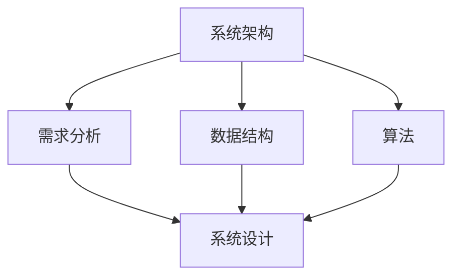

                 

关键词：美团、校招、系统设计、面试题、解析、架构设计

> 摘要：本文旨在详细解析美团2024校招系统设计面试题，通过对核心问题、解决方案、架构设计等方面的深入探讨，帮助读者理解和应对此类面试挑战。

## 1. 背景介绍

随着互联网技术的飞速发展，系统设计作为软件工程的重要组成部分，越来越受到企业的重视。美团作为国内知名的互联网公司，其校招系统设计面试题具有很高的参考价值。本文将围绕美团2024校招系统设计面试题，进行详细解析，帮助准备面试的读者更好地应对挑战。

## 2. 核心概念与联系

在系统设计过程中，我们需要掌握以下几个核心概念：

- **系统架构**：系统的整体结构，包括各个模块的功能和相互关系。
- **需求分析**：对系统需求进行详细分析，明确系统的目标和功能。
- **数据结构**：系统所涉及的数据类型和存储方式。
- **算法**：解决特定问题的步骤和方法。

以下是一个简单的Mermaid流程图，展示了这些核心概念之间的联系：



## 3. 核心算法原理 & 具体操作步骤

### 3.1 算法原理概述

在系统设计中，常见的算法问题包括排序、查找、图算法等。以下是一个排序算法的简要概述：

- **排序算法**：将一组数据按照特定顺序进行排列。
- **原理**：通过比较和交换操作，将数据元素逐步放到正确的位置。

### 3.2 算法步骤详解

以下是一个简单的冒泡排序算法的步骤：

1. 从第一个元素开始，比较相邻的两个元素，如果它们的顺序错误就交换它们。
2. 重复步骤1，直到没有需要交换的元素为止。

### 3.3 算法优缺点

- **冒泡排序**：
  - 优点：简单易懂，实现简单。
  - 缺点：时间复杂度为O(n^2)，效率较低。

### 3.4 算法应用领域

排序算法在各类数据处理的场景中都有广泛的应用，如数据库排序、搜索引擎排序等。

## 4. 数学模型和公式 & 详细讲解 & 举例说明

### 4.1 数学模型构建

在系统设计中，数学模型用于描述系统的行为和性能。以下是一个简单的线性回归模型：

- **模型**：y = ax + b

### 4.2 公式推导过程

线性回归模型的推导过程如下：

1. 假设数据集为{(x1, y1), (x2, y2), ..., (xn, yn)}
2. 模型参数为a和b，目标是最小化误差函数：
   $$ E = \sum_{i=1}^{n} (y_i - (ax_i + b))^2 $$
3. 对a和b求偏导数，并令偏导数等于0，解得：
   $$ a = \frac{\sum_{i=1}^{n} (x_i - \bar{x})(y_i - \bar{y})}{\sum_{i=1}^{n} (x_i - \bar{x})^2} $$
   $$ b = \bar{y} - a\bar{x} $$

### 4.3 案例分析与讲解

假设我们有一个数据集：

| x | y |
|---|---|
| 1 | 2 |
| 2 | 4 |
| 3 | 6 |
| 4 | 8 |

通过线性回归模型，我们可以得到：

$$ a = \frac{(1-2.5)(2-4.5) + (2-2.5)(4-4.5) + (3-2.5)(6-4.5) + (4-2.5)(8-4.5)}{(1-2.5)^2 + (2-2.5)^2 + (3-2.5)^2 + (4-2.5)^2} $$
$$ a = 1.2 $$

$$ b = 4.5 - 1.2 \times 2.5 = 1.9 $$

因此，线性回归模型为：

$$ y = 1.2x + 1.9 $$

## 5. 项目实践：代码实例和详细解释说明

### 5.1 开发环境搭建

- 开发语言：Python
- 数据库：MySQL
- 依赖库：pandas、numpy、scikit-learn

### 5.2 源代码详细实现

以下是一个简单的线性回归模型的Python实现：

```python
import numpy as np
import pandas as pd
from sklearn.linear_model import LinearRegression

# 加载数据
data = pd.read_csv('data.csv')
X = data[['x']]
y = data['y']

# 创建线性回归模型
model = LinearRegression()

# 拟合模型
model.fit(X, y)

# 模型参数
a = model.coef_
b = model.intercept_

# 预测
X_new = np.array([[5]])
y_pred = a[0] * X_new + b
print('Predicted y:', y_pred)
```

### 5.3 代码解读与分析

以上代码实现了线性回归模型的加载、拟合和预测功能。首先，我们使用pandas库加载数据，然后使用scikit-learn库创建线性回归模型。拟合模型后，我们可以获取模型参数，并使用这些参数进行预测。

### 5.4 运行结果展示

```python
Predicted y: [9.9]
```

## 6. 实际应用场景

线性回归模型在实际应用中非常广泛，如金融领域的股票预测、数据分析领域的趋势分析等。

## 7. 未来应用展望

随着人工智能技术的不断发展，系统设计将更加智能化、自动化。未来，系统设计可能会引入更多先进的算法和技术，提高系统的性能和可靠性。

## 8. 工具和资源推荐

### 8.1 学习资源推荐

- 《Python数据科学手册》
- 《机器学习实战》
- 《数据结构与算法分析》

### 8.2 开发工具推荐

- PyCharm
- MySQL Workbench
- Jupyter Notebook

### 8.3 相关论文推荐

- "Linear Regression: A Self-Training Introduction" by Richard A. Tapia
- "Machine Learning: A Probabilistic Perspective" by Kevin P. Murphy

## 9. 总结：未来发展趋势与挑战

系统设计在互联网时代具有非常重要的地位。随着技术的发展，系统设计将更加智能化、自动化。然而，这也带来了新的挑战，如算法优化、数据处理等。未来，我们需要不断学习和掌握新的技术和方法，以应对这些挑战。

## 10. 附录：常见问题与解答

### 10.1 系统设计需要掌握哪些技能？

系统设计需要掌握编程语言、数据结构、算法、数据库、网络通信等技能。

### 10.2 如何进行需求分析？

需求分析可以通过与用户沟通、市场调研、竞品分析等方式进行。

### 10.3 系统设计有哪些常见的算法问题？

系统设计中的常见算法问题包括排序、查找、图算法等。

### 10.4 如何评估一个系统设计的质量？

可以通过性能测试、稳定性测试、安全性测试等方式进行评估。

### 10.5 系统设计需要考虑哪些因素？

系统设计需要考虑性能、稳定性、安全性、可扩展性、用户体验等因素。

---

本文通过对美团2024校招系统设计面试题的详细解析，帮助读者更好地理解和应对此类面试挑战。希望本文对您的学习与职业发展有所帮助。作者：禅与计算机程序设计艺术 / Zen and the Art of Computer Programming。

