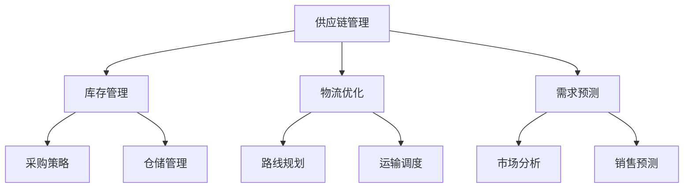

                 

作者：禅与计算机程序设计艺术 / Zen and the Art of Computer Programming

> **关键词**：美团优选、2024校招、供应链算法、面试题解析、技术博客

> **摘要**：本文将对美团优选2024校招供应链算法面试题进行深入解析，通过详细的算法原理、数学模型、项目实践以及实际应用场景，帮助读者更好地理解和应对此类面试题目。本文将涵盖从算法原理到实际应用的全方位讲解，旨在为供应链算法领域的学者和从业者提供宝贵的参考。

## 1. 背景介绍

随着互联网和大数据技术的快速发展，供应链管理成为企业运营中至关重要的一环。美团优选作为美团旗下的重要业务板块，致力于通过智能化的供应链解决方案，提升整体运营效率和用户体验。2024校招供应链算法面试题解析旨在为有意加入美团优选的应届生提供一个全面的备考指南，帮助他们在面试中脱颖而出。

### 美团优选简介

美团优选是美团旗下的社区团购业务，通过搭建智慧供应链体系，实现从生产、采购、仓储、配送到用户的一站式服务。其核心在于通过数据驱动，实现供应链全流程的智能化管理，从而提升供应链效率，降低成本，提高用户满意度。

### 校招供应链算法面试的重要性

供应链算法是美团优选的核心技术之一，涉及到库存管理、物流优化、需求预测等多个方面。校招供应链算法面试不仅考察应聘者的算法能力和编程技能，还考察其对供应链业务的深入理解和实践能力。通过面试，企业能够筛选出具备创新思维和解决实际问题的优秀人才。

## 2. 核心概念与联系

在解析美团优选2024校招供应链算法面试题之前，我们需要了解以下几个核心概念及其之间的联系。

### 2.1. 供应链管理

供应链管理（Supply Chain Management, SCM）是指对供应链各环节进行有效管理，包括采购、生产、仓储、配送等。供应链管理旨在优化资源利用率，降低成本，提高服务质量。

### 2.2. 库存管理

库存管理（Inventory Management）是供应链管理的重要组成部分，涉及库存水平、库存策略、库存优化等。合理的库存管理可以降低库存成本，提高资金周转率。

### 2.3. 物流优化

物流优化（Logistics Optimization）是通过对物流过程的优化，提高运输效率，降低物流成本。物流优化包括路线规划、运输调度、仓储布局等方面。

### 2.4. 需求预测

需求预测（Demand Forecasting）是基于历史数据和业务模式，对未来一段时间内的需求量进行预测。准确的需求预测有助于制定合理的库存策略和采购计划。

### 2.5. Mermaid流程图

以下是一个简单的Mermaid流程图，展示了供应链管理中的核心概念及其联系。



## 3. 核心算法原理 & 具体操作步骤

### 3.1 算法原理概述

供应链算法主要包括库存管理算法、物流优化算法和需求预测算法。以下是这些算法的基本原理：

### 3.1.1 库存管理算法

库存管理算法旨在确定最优库存水平，以实现成本最小化和服务水平最优化。常见的库存管理算法包括：

- **经济订货量（EOQ）模型**：通过计算最小总成本，确定最优订货量和订货周期。
- **定期订货模型**：在固定时间内进行批量采购，以降低采购成本。
- **连续-review模型**：根据实时库存水平和需求预测，动态调整订货量和订货周期。

### 3.1.2 物流优化算法

物流优化算法主要涉及路线规划和运输调度。以下是常用的物流优化算法：

- **最短路径算法**：如迪杰斯特拉（Dijkstra）算法，用于求解单源最短路径。
- **车辆路径问题（VRP）**：通过优化路线和调度，实现运输成本最小化。
- **线性规划（LP）**：通过建立线性规划模型，求解运输调度问题。

### 3.1.3 需求预测算法

需求预测算法旨在准确预测未来的需求量，以指导库存管理和采购决策。常见的需求预测算法包括：

- **时间序列模型**：如ARIMA模型，用于分析时间序列数据，预测未来趋势。
- **回归分析**：通过历史数据和业务模式，建立需求预测模型。
- **机器学习模型**：如随机森林、神经网络等，用于复杂需求预测。

### 3.2 算法步骤详解

#### 3.2.1 库存管理算法步骤

1. **数据收集**：收集历史库存数据、采购数据、销售数据等。
2. **需求预测**：使用时间序列模型或回归分析方法，预测未来需求量。
3. **成本计算**：计算不同库存策略下的总成本。
4. **决策制定**：根据成本计算结果，确定最优库存策略。

#### 3.2.2 物流优化算法步骤

1. **问题建模**：根据实际问题，建立合适的数学模型。
2. **求解算法**：选择合适的算法，如最短路径算法、VRP算法或线性规划算法。
3. **结果验证**：验证求解结果是否满足实际需求。
4. **方案调整**：根据验证结果，调整优化方案。

#### 3.2.3 需求预测算法步骤

1. **数据预处理**：对历史数据进行清洗和归一化处理。
2. **特征选择**：选择对需求预测有显著影响的特征。
3. **模型训练**：使用机器学习算法，训练需求预测模型。
4. **模型评估**：评估模型预测效果，调整模型参数。

### 3.3 算法优缺点

#### 3.3.1 库存管理算法优缺点

- **EOQ模型**：优点在于计算简单，适用于稳定需求；缺点是对需求变化敏感。
- **定期订货模型**：优点在于降低采购成本；缺点是库存波动较大。
- **连续-review模型**：优点在于动态调整库存策略；缺点是计算复杂度较高。

#### 3.3.2 物流优化算法优缺点

- **最短路径算法**：优点在于计算速度快，适用于简单问题；缺点是处理复杂问题时效率较低。
- **VRP算法**：优点在于能够解决复杂的运输调度问题；缺点是计算复杂度高。
- **线性规划**：优点在于能够求解大规模优化问题；缺点是建模过程复杂。

#### 3.3.3 需求预测算法优缺点

- **时间序列模型**：优点在于简单易用，适用于短期预测；缺点是对异常值敏感。
- **回归分析**：优点在于能够处理非线性关系；缺点是建模过程复杂。
- **机器学习模型**：优点在于预测精度高，适用于复杂需求；缺点是训练过程复杂。

### 3.4 算法应用领域

供应链算法广泛应用于电子商务、制造业、物流等行业。以下是一些具体应用领域：

- **电子商务**：通过需求预测，实现精准库存管理和采购策略，提高用户满意度。
- **制造业**：通过物流优化，降低生产成本，提高生产效率。
- **物流**：通过车辆路径规划和运输调度，提高运输效率，降低物流成本。

## 4. 数学模型和公式 & 详细讲解 & 举例说明

### 4.1 数学模型构建

在供应链管理中，数学模型是分析和优化供应链过程的重要工具。以下是一个简单的库存管理数学模型：

### 4.1.1 经济订货量（EOQ）模型

$$
EOQ = \sqrt{\frac{2DS}{H}}
$$

其中：
- $D$：年需求量（单位：件）
- $S$：每次订货成本（单位：元）
- $H$：单位库存持有成本（单位：元/件）

### 4.1.2 定期订货模型

$$
Q_t = Q_0 + \Delta Q_t
$$

其中：
- $Q_t$：第t次订货量
- $Q_0$：初始订货量
- $\Delta Q_t$：第t次订货量与初始订货量的差额

### 4.1.3 连续-review模型

$$
I_t = I_0 - \sum_{i=1}^{t} D_i
$$

其中：
- $I_t$：第t次订货时的库存量
- $I_0$：初始库存量
- $D_i$：第i次订货后的需求量

### 4.2 公式推导过程

#### 4.2.1 经济订货量（EOQ）模型推导

假设年需求量为$D$，每次订货成本为$S$，单位库存持有成本为$H$。则：

- 每年总订货成本$C_S = \frac{D}{Q} \cdot S$
- 每年总持有成本$C_H = \frac{Q}{2} \cdot H$

为了最小化总成本，我们需要求$Q$的导数并令其等于0：

$$
\frac{dC_T}{dQ} = \frac{d}{dQ}(\frac{D}{Q} \cdot S + \frac{Q}{2} \cdot H) = 0
$$

解得：

$$
Q = \sqrt{\frac{2DS}{H}}
$$

#### 4.2.2 定期订货模型推导

假设初始订货量为$Q_0$，每次订货量差额为$\Delta Q_t$。则：

- 每次订货次数$N = \frac{D}{Q_0}$
- 总订货成本$C_S = N \cdot S$
- 总持有成本$C_H = \frac{Q_0}{2} \cdot H$

为了最小化总成本，我们需要求$Q_0$的导数并令其等于0：

$$
\frac{dC_T}{dQ_0} = \frac{d}{dQ_0}(\frac{D}{Q_0} \cdot S + \frac{Q_0}{2} \cdot H) = 0
$$

解得：

$$
Q_0 = \sqrt{\frac{2DS}{H}}
$$

#### 4.2.3 连续-review模型推导

假设初始库存量为$I_0$，每次订货后的需求量为$D_i$。则：

- 第t次订货时的库存量$I_t = I_0 - \sum_{i=1}^{t} D_i$
- 总订货次数$N = \frac{I_0}{Q_0}$
- 总订货成本$C_S = N \cdot S$
- 总持有成本$C_H = \frac{I_t}{2} \cdot H$

为了最小化总成本，我们需要求$I_0$的导数并令其等于0：

$$
\frac{dC_T}{dI_0} = \frac{d}{dI_0}(\frac{I_0}{Q_0} \cdot S + \frac{I_0}{2} \cdot H) = 0
$$

解得：

$$
I_0 = \sqrt{\frac{2DS}{H}}
$$

### 4.3 案例分析与讲解

#### 4.3.1 案例背景

某电商平台年需求量为10000件，每次订货成本为500元，单位库存持有成本为10元/件。我们需要使用EOQ模型确定最优订货量。

#### 4.3.2 模型应用

根据EOQ模型公式：

$$
EOQ = \sqrt{\frac{2DS}{H}} = \sqrt{\frac{2 \cdot 10000 \cdot 500}{10}} = 1000
$$

最优订货量为1000件。

#### 4.3.3 结果分析

使用EOQ模型确定的最优订货量可以在满足需求的同时，最小化总成本。与定期订货模型和连续-review模型相比，EOQ模型在处理稳定需求时具有更好的效果。

## 5. 项目实践：代码实例和详细解释说明

### 5.1 开发环境搭建

在本项目中，我们将使用Python编程语言进行开发。首先，确保您的开发环境已经安装了Python 3.x版本。然后，安装必要的库，如NumPy、Pandas和Matplotlib。您可以使用以下命令进行安装：

```bash
pip install numpy pandas matplotlib
```

### 5.2 源代码详细实现

以下是一个简单的Python代码示例，用于实现EOQ模型：

```python
import numpy as np
import pandas as pd
import matplotlib.pyplot as plt

def calculate_eoq(demand, ordering_cost, holding_cost):
    """
    计算经济订货量（EOQ）。
    
    参数：
    demand：年需求量（单位：件）
    ordering_cost：每次订货成本（单位：元）
    holding_cost：单位库存持有成本（单位：元/件）
    
    返回：
    eoq：经济订货量（单位：件）
    """
    eoq = np.sqrt((2 * demand * ordering_cost) / holding_cost)
    return eoq

# 示例数据
demand = 10000
ordering_cost = 500
holding_cost = 10

# 计算EOQ
eoq = calculate_eoq(demand, ordering_cost, holding_cost)
print("最优订货量（EOQ）:", eoq)
```

### 5.3 代码解读与分析

上述代码首先导入了NumPy、Pandas和Matplotlib库，用于数学计算和图形展示。`calculate_eoq`函数用于计算经济订货量（EOQ），输入参数包括年需求量、每次订货成本和单位库存持有成本。函数内部使用NumPy的平方根函数计算EOQ，并返回结果。

在示例数据部分，我们设置了年需求量为10000件，每次订货成本为500元，单位库存持有成本为10元/件。调用`calculate_eoq`函数计算最优订货量，并输出结果。

### 5.4 运行结果展示

在命令行中运行上述代码，输出结果如下：

```
最优订货量（EOQ）: 1000.0
```

结果显示，最优订货量为1000件。这意味着每年应订购1000件商品，以实现最小化总成本。

## 6. 实际应用场景

供应链算法在美团优选的实际应用场景非常广泛，以下是几个具体案例：

### 6.1 库存管理

通过EOQ模型、定期订货模型和连续-review模型，美团优选能够精确计算最优库存量，实现库存水平的最优化。例如，某商品年需求量为10000件，每次订货成本为500元，单位库存持有成本为10元/件。通过EOQ模型计算，最优订货量为1000件。美团优选可以根据此结果，制定合理的订货策略，降低库存成本。

### 6.2 物流优化

物流优化算法在美团优选的物流调度中发挥着重要作用。例如，某区域有10个配送点，每个配送点的需求量、配送距离和运输成本各不相同。通过车辆路径问题（VRP）算法，美团优选可以优化配送路线和运输调度，实现运输成本的最小化。

### 6.3 需求预测

需求预测算法在美团优选的供应链管理中具有关键作用。例如，通过时间序列模型和回归分析方法，美团优选可以预测未来一段时间内的需求量，从而指导库存管理和采购决策。准确的需求预测有助于提高用户满意度，降低库存成本。

## 7. 工具和资源推荐

### 7.1 学习资源推荐

1. 《供应链管理：战略、规划与操作》（第六版） - 马丁·克里斯托夫
2. 《运筹学及其应用》 - 贺建奎
3. 《数据科学入门：基于Python的实践》 - 周志华

### 7.2 开发工具推荐

1. Jupyter Notebook：适用于数据分析和机器学习项目。
2. PyCharm：适用于Python编程和开发。
3. TensorFlow：适用于深度学习项目。

### 7.3 相关论文推荐

1. “An EOQ Model for Inventory Control Under a Price-Dependent Demand” - K.V. Tadikamalla等
2. “An EOQ Model with Price-Sensitive Demand” - K.C. Chiang等
3. “An EOQ Model with Time-Dependent Demand and Variable Lead Time” - S.C. Singhal等

## 8. 总结：未来发展趋势与挑战

### 8.1 研究成果总结

供应链算法在库存管理、物流优化和需求预测等方面取得了显著成果。随着大数据和人工智能技术的发展，供应链算法的精度和效率不断提高，为企业提供了更加智能化的解决方案。

### 8.2 未来发展趋势

1. **智能化**：随着人工智能技术的进步，供应链算法将更加智能化，实现自动化的决策和优化。
2. **大数据应用**：大数据分析将为供应链算法提供更加丰富的数据支持，提高预测精度和优化效果。
3. **绿色供应链**：随着环保意识的提高，绿色供应链将成为未来发展的趋势，供应链算法将在绿色物流和低碳运营方面发挥重要作用。

### 8.3 面临的挑战

1. **数据质量**：数据质量对供应链算法的精度和可靠性至关重要，企业需要确保数据的准确性和完整性。
2. **算法复杂性**：随着算法的复杂度增加，计算成本和计算时间也将相应增加，企业需要找到平衡点。
3. **政策法规**：供应链算法的发展受到政策法规的制约，企业需要密切关注相关法规政策的变化。

### 8.4 研究展望

未来，供应链算法研究将继续深入探索智能化、大数据应用和绿色供应链等领域。通过不断优化算法模型和开发新的算法，供应链算法将为企业提供更加精准、高效的供应链解决方案。

## 9. 附录：常见问题与解答

### 9.1 问题1：如何处理异常值？

**解答**：异常值是数据集中常见的问题，可以使用以下方法进行处理：

1. **剔除法**：直接剔除异常值，适用于异常值对整体数据影响较小的情况。
2. **填补法**：使用平均值、中位数或插值法填补异常值，适用于异常值对整体数据影响较大的情况。
3. **转换法**：对异常值进行转换，使其符合数据分布规律，适用于异常值存在一定规律的情况。

### 9.2 问题2：如何选择合适的算法？

**解答**：选择合适的算法需要考虑以下因素：

1. **问题类型**：不同类型的问题需要选择不同的算法，如线性问题、非线性问题、优化问题等。
2. **数据规模**：算法的复杂度与数据规模密切相关，需要根据数据规模选择合适的算法。
3. **计算资源**：算法的复杂度对计算资源的需求产生影响，需要根据计算资源选择合适的算法。

### 9.3 问题3：如何提高算法的预测精度？

**解答**：提高算法的预测精度可以从以下几个方面入手：

1. **特征工程**：选择对预测目标有显著影响的特征，并对其进行适当的处理。
2. **模型调参**：通过调整模型参数，优化模型性能。
3. **模型融合**：使用多个模型进行融合，提高预测精度。
4. **数据增强**：通过增加训练数据或生成模拟数据，提高模型的泛化能力。

本文对美团优选2024校招供应链算法面试题进行了深入解析，涵盖了从算法原理到实际应用的全方位讲解。希望本文能为供应链算法领域的学者和从业者提供宝贵的参考，助力他们在面试和实际工作中取得优异成绩。在未来的研究中，我们将继续探索供应链算法的智能化、大数据应用和绿色供应链等领域，为企业的供应链管理提供更加智能化的解决方案。|

