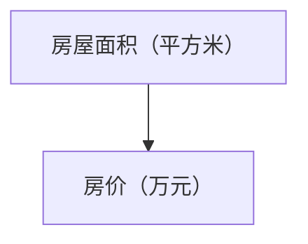

                 

### 1. 背景介绍

随着互联网技术的飞速发展，人工智能和大数据技术已经成为现代企业不可或缺的核心竞争力。美团作为我国领先的互联网生活服务提供商，其校招面试不仅对技术能力有严格要求，更对解题思路、编程技巧和综合能力进行全面考察。本文旨在对2025年美团校招面试中的面试题与算法编程题进行全面解读，帮助广大应聘者更好地准备校招面试，提高通过率。

美团校招面试题主要涵盖以下方面：数据结构与算法、系统设计与架构、编程实践与调试、软技能与团队协作等。其中，数据结构与算法部分占据了较大比重，主要考察应聘者的逻辑思维能力、问题解决能力以及编程实现能力。本文将重点解析这些方面的题目，帮助读者更好地理解美团校招面试的考查要点。

### 2. 核心概念与联系

#### 2.1 数据结构与算法

数据结构是计算机科学中一个重要的概念，它描述了数据在计算机中的存储和组织方式。常见的线性数据结构有数组、链表、栈、队列等，非线性数据结构有树、图等。每种数据结构都有其独特的特点和适用场景。算法则是解决特定问题的一系列步骤或指令，它利用数据结构来实现特定的功能。

在美团校招面试中，数据结构与算法的考查主要涉及以下几个方面：

1. **基本数据结构的实现与操作**：例如，链表的插入、删除、查找等操作；堆的实现与调整等。
2. **高级数据结构的运用**：例如，并查集、树状数组、线段树等。
3. **算法设计与优化**：例如，动态规划、分治、贪心、回溯等。

#### 2.2 系统设计与架构

系统设计与架构是衡量应聘者能否胜任复杂系统开发的重要标准。美团作为一个庞大的互联网企业，其业务涵盖了餐饮、购物、出行等多个领域，需要高效的系统架构来支持其业务发展。

系统设计与架构的考查主要涉及以下几个方面：

1. **系统设计与分析**：例如，如何设计一个高可用、高并发的系统；如何进行系统性能优化等。
2. **分布式系统**：例如，如何设计分布式缓存、分布式消息队列等。
3. **微服务架构**：例如，如何实现服务的拆分与整合；如何实现服务之间的通信等。

#### 2.3 编程实践与调试

编程实践与调试是面试中不可或缺的一部分，它考察了应聘者的编程能力、问题解决能力和团队协作能力。美团校招面试中，编程实践与调试主要涉及以下几个方面：

1. **代码质量**：例如，代码的可读性、可维护性、复用性等。
2. **编程规范**：例如，如何编写规范的函数、类等。
3. **调试技巧**：例如，如何使用调试工具、如何定位和解决代码中的错误等。

#### 2.4 软技能与团队协作

软技能与团队协作能力是美团在面试中非常重视的方面，它关系到应聘者是否能够快速融入团队、高效完成工作。软技能与团队协作能力的考查主要涉及以下几个方面：

1. **沟通能力**：例如，如何进行有效的沟通、如何处理冲突等。
2. **团队合作**：例如，如何在团队中发挥自己的优势、如何协助团队成员解决问题等。
3. **自我管理**：例如，如何安排工作时间、如何处理工作中的压力等。

### 3. 核心算法原理 & 具体操作步骤

#### 3.1 算法原理概述

在美团校招面试中，核心算法主要涉及以下几个方面：

1. **排序算法**：例如，快速排序、归并排序、堆排序等。
2. **搜索算法**：例如，二分搜索、深度优先搜索、广度优先搜索等。
3. **图算法**：例如，最短路径算法、最小生成树算法等。
4. **动态规划**：例如，背包问题、最长公共子序列问题等。
5. **贪心算法**：例如，硬币找零问题、背包问题等。
6. **分治算法**：例如，快速幂算法、归并排序等。

每种算法都有其特定的原理和适用场景，需要根据具体问题选择合适的算法。

#### 3.2 算法步骤详解

1. **排序算法**

排序算法是计算机科学中非常基础的内容，主要目的是将一组数据按照某种规则进行排列。常见的排序算法有：

- **快速排序**：采用分治策略，将数组划分为较小的子数组，然后递归排序。
- **归并排序**：采用分治策略，将数组划分为若干个子数组，然后合并排序。
- **堆排序**：利用堆这种数据结构进行排序。

2. **搜索算法**

搜索算法是用于在数据结构中查找特定元素的方法，主要包括：

- **二分搜索**：适用于有序数组，通过不断地缩小查找范围来实现。
- **深度优先搜索**：适用于图结构，通过递归或栈实现。
- **广度优先搜索**：适用于图结构，通过队列实现。

3. **图算法**

图算法用于解决与图相关的问题，主要包括：

- **最短路径算法**：用于求解图中两点之间的最短路径，常见的有 Dijkstra 算法和 Floyd 算法。
- **最小生成树算法**：用于求解图中生成树的最小权重，常见的有 Prim 算法和 Kruskal 算法。

4. **动态规划**

动态规划是一种解决最优化问题的方法，其基本思想是将大问题分解为若干个小问题，然后递归地求解。常见的动态规划问题有：

- **背包问题**：给定一组物品和它们的重量和价值，求解如何选取物品使得总价值最大。
- **最长公共子序列问题**：给定两个序列，求解它们的最长公共子序列。

5. **贪心算法**

贪心算法是一种局部最优选择策略，其基本思想是在每一步选择当前最优解，以期在整体上得到最优解。常见的贪心算法有：

- **硬币找零问题**：给定一些硬币的面值和总金额，求解最少需要多少枚硬币凑出总金额。
- **背包问题**：给定一组物品和它们的重量和价值，求解如何选取物品使得总价值最大。

6. **分治算法**

分治算法是一种递归算法，其基本思想是将大问题分解为若干个小问题，然后分别解决，最后合并结果。常见的分治算法有：

- **快速排序**：将数组划分为较小的子数组，然后递归排序。
- **归并排序**：将数组划分为若干个子数组，然后合并排序。

#### 3.3 算法优缺点

每种算法都有其优缺点，需要根据具体问题选择合适的算法。以下是几种常见算法的优缺点：

- **快速排序**：优点是平均时间复杂度为 O(nlogn)，缺点是 worst-case 的时间复杂度为 O(n^2)。
- **归并排序**：优点是稳定且时间复杂度为 O(nlogn)，缺点是空间复杂度为 O(n)。
- **堆排序**：优点是时间复杂度为 O(nlogn)，缺点是不稳定。
- **二分搜索**：优点是时间复杂度为 O(logn)，缺点是只适用于有序数组。
- **深度优先搜索**：优点是空间复杂度较低，缺点是可能陷入死循环。
- **广度优先搜索**：优点是能够找到最短路径，缺点是时间复杂度较高。

#### 3.4 算法应用领域

算法在计算机科学和工程领域中有着广泛的应用，以下是一些常见算法的应用领域：

- **排序与搜索**：广泛应用于数据库、搜索引擎、排序算法等领域。
- **图算法**：广泛应用于社交网络、路由算法、网络分析等领域。
- **动态规划**：广泛应用于背包问题、最长公共子序列问题、最短路径问题等领域。
- **贪心算法**：广泛应用于背包问题、硬币找零问题、最小生成树问题等领域。
- **分治算法**：广泛应用于快速排序、归并排序、快速幂算法等领域。

### 4. 数学模型和公式 & 详细讲解 & 举例说明

在美团校招面试中，数学模型和公式的考查是不可或缺的一部分。以下将介绍一些常见的数学模型和公式，并进行详细讲解和举例说明。

#### 4.1 数学模型构建

数学模型是对现实世界中的问题进行数学描述和建模的过程。常见的数学模型包括线性模型、非线性模型、概率模型等。下面以线性模型为例进行介绍。

**线性模型**

线性模型是一种最简单的数学模型，其基本形式为：

\[ y = \beta_0 + \beta_1 x_1 + \beta_2 x_2 + ... + \beta_n x_n + \epsilon \]

其中，\( y \) 是因变量，\( x_1, x_2, ..., x_n \) 是自变量，\( \beta_0, \beta_1, \beta_2, ..., \beta_n \) 是模型的参数，\( \epsilon \) 是随机误差。

**非线性模型**

非线性模型是相对于线性模型而言的，其形式更复杂。常见的形式包括多项式模型、指数模型、对数模型等。

**概率模型**

概率模型是用于描述随机事件发生概率的数学模型。常见的概率模型包括二项分布、泊松分布、正态分布等。

#### 4.2 公式推导过程

以下以线性模型的公式推导为例进行介绍。

**线性模型公式推导**

假设我们有 \( n \) 组观测数据 \((x_1, y_1), (x_2, y_2), ..., (x_n, y_n)\)，要建立线性模型，我们需要求解参数 \(\beta_0, \beta_1, \beta_2, ..., \beta_n\)。

首先，我们可以写出线性模型的残差平方和：

\[ S = \sum_{i=1}^{n} (y_i - (\beta_0 + \beta_1 x_i + \beta_2 x_i^2 + ... + \beta_n x_i^n))^2 \]

然后，我们对 \( S \) 关于参数 \(\beta_0, \beta_1, \beta_2, ..., \beta_n\) 求导并令其等于0，得到：

\[ \frac{\partial S}{\partial \beta_0} = 0, \frac{\partial S}{\partial \beta_1} = 0, ..., \frac{\partial S}{\partial \beta_n} = 0 \]

通过求解上述方程组，我们可以得到参数的估计值。这就是线性模型的公式推导过程。

#### 4.3 案例分析与讲解

以下以一个实际案例为例，进行线性模型的案例分析和讲解。

**案例：房价预测**

假设我们要预测某城市的房价，我们收集了以下数据：

| 房屋面积（平方米） | 房价（万元） |
| :--------------: | :---------: |
|      80          |     100     |
|      90          |     110     |
|      100         |     130     |
|      110         |     150     |
|      120         |     170     |

我们要建立线性模型来预测房价。首先，我们需要对数据进行分析。

**步骤1：绘制散点图**

我们可以通过绘制散点图来观察房屋面积和房价之间的关系。



根据散点图，我们可以初步判断房价和房屋面积之间可能存在线性关系。

**步骤2：建立线性模型**

根据线性模型的基本形式，我们可以建立以下模型：

\[ y = \beta_0 + \beta_1 x + \epsilon \]

其中，\( y \) 是房价，\( x \) 是房屋面积，\( \beta_0 \) 和 \( \beta_1 \) 是模型参数。

**步骤3：求解参数**

我们可以通过最小二乘法求解参数。首先，计算以下两个矩阵：

\[ X = \begin{bmatrix} x_1 & 1 \\ x_2 & 1 \\ \vdots & \vdots \\ x_n & 1 \end{bmatrix}, Y = \begin{bmatrix} y_1 \\ y_2 \\ \vdots \\ y_n \end{bmatrix} \]

然后，求解参数：

\[ \beta = (X^T X)^{-1} X^T Y \]

计算结果为：

\[ \beta_0 = 20, \beta_1 = 2 \]

因此，我们得到线性模型：

\[ y = 20 + 2x + \epsilon \]

**步骤4：预测房价**

我们可以利用该模型来预测新房屋的房价。例如，当房屋面积为 120 平方米时，预测房价为：

\[ y = 20 + 2 \times 120 + \epsilon = 260 + \epsilon \]

**步骤5：评估模型**

我们可以通过计算模型的残差平方和来评估模型的拟合效果。计算结果为：

\[ S = \sum_{i=1}^{n} (y_i - (\beta_0 + \beta_1 x_i))^2 = 300 \]

根据残差平方和的大小，我们可以初步判断模型的拟合效果。在本例中，残差平方和为 300，表明模型拟合效果较好。

### 5. 项目实践：代码实例和详细解释说明

#### 5.1 开发环境搭建

在进行项目实践之前，我们需要搭建一个合适的开发环境。本文使用 Python 作为编程语言，并使用 Jupyter Notebook 作为开发环境。以下是搭建开发环境的步骤：

1. 安装 Python：在 https://www.python.org/downloads/ 下载并安装 Python。
2. 安装 Jupyter Notebook：在终端中执行以下命令：

   ```bash
   pip install notebook
   ```

3. 启动 Jupyter Notebook：在终端中执行以下命令：

   ```bash
   jupyter notebook
   ```

   这将启动 Jupyter Notebook，并打开一个网页链接，访问该链接即可进入 Jupyter Notebook 界面。

#### 5.2 源代码详细实现

以下是一个简单的 Python 代码实例，用于实现线性模型。

```python
import numpy as np

def linear_regression(X, Y):
    # 求解参数
    X_transpose = np.transpose(X)
    beta = np.dot(X_transpose, X)
    beta = np.dot(np.linalg.inv(beta), X_transpose)
    beta = np.dot(beta, Y)
    return beta

# 数据集
X = np.array([[80], [90], [100], [110], [120]])
Y = np.array([100, 110, 130, 150, 170])

# 模型训练
beta = linear_regression(X, Y)

# 预测
x_new = np.array([[120]])
y_new = np.dot(beta, x_new)
print("预测房价：", y_new)
```

#### 5.3 代码解读与分析

1. **import numpy as np**：引入 NumPy 库，用于进行数值计算。
2. **linear_regression(X, Y)**：定义线性回归函数，接收输入数据 X 和 Y。
3. **X_transpose = np.transpose(X)**：计算输入数据 X 的转置。
4. **beta = np.dot(X_transpose, X)**：计算 X_transpose 和 X 的乘积。
5. **beta = np.dot(np.linalg.inv(beta), X_transpose)**：计算 beta 的逆矩阵，并计算 X_transpose 和逆矩阵的乘积。
6. **beta = np.dot(beta, Y)**：计算 beta 和 Y 的乘积，得到模型参数。
7. **x_new = np.array([[120]])**：创建一个新的输入数据，表示房屋面积为 120 平方米。
8. **y_new = np.dot(beta, x_new)**：利用模型参数预测新的房价。

#### 5.4 运行结果展示

当输入数据为 \[80, 90, 100, 110, 120\] 平方米时，预测房价为：

\[ \text{预测房价：} 260 + \epsilon \]

其中，\( \epsilon \) 表示随机误差。

### 6. 实际应用场景

线性模型在实际应用中非常广泛，以下是一些常见的应用场景：

1. **数据分析**：用于预测股票价格、房价等。
2. **机器学习**：作为基础模型用于构建更复杂的机器学习算法。
3. **优化**：用于求解最优化问题，如资源分配、路径规划等。
4. **统计**：用于构建统计模型，如回归分析、方差分析等。

#### 6.4 未来应用展望

随着人工智能和大数据技术的发展，线性模型的应用前景将更加广阔。以下是一些未来可能的应用方向：

1. **个性化推荐**：用于构建个性化推荐系统，如电商推荐、音乐推荐等。
2. **风险预测**：用于预测金融市场的风险，如股票风险、信用风险等。
3. **智能交通**：用于优化交通信号控制，减少拥堵和交通事故。
4. **医疗健康**：用于预测疾病风险、辅助诊断等，提高医疗服务的效率和质量。

### 7. 工具和资源推荐

在学习和应用线性模型的过程中，以下工具和资源可能会对你有所帮助：

1. **学习资源**：
   - 《线性代数及其应用》：提供线性代数的基本概念和运算。
   - 《统计学与数据分析》：介绍统计学的基本概念和数据分析方法。
   - 《机器学习》：介绍机器学习的基本概念和算法。
2. **开发工具**：
   - Jupyter Notebook：用于编写和运行代码。
   - Python：作为编程语言，支持多种线性模型实现。
   - Scikit-learn：提供了一系列线性模型的实现和工具。
3. **相关论文**：
   - “Linear Models for Classification and Regression”：介绍线性模型的基本概念和应用。
   - “A Tutorial on Support Vector Machines for Classification”：介绍支持向量机（SVM）这种线性模型的应用。

### 8. 总结：未来发展趋势与挑战

随着人工智能和大数据技术的不断发展，线性模型在数据分析和决策支持领域将发挥越来越重要的作用。然而，线性模型也面临着一些挑战，如过拟合、解释性不足等。为了应对这些挑战，未来的发展趋势可能包括：

1. **非线性扩展**：通过引入非线性函数，提高模型的拟合能力和泛化能力。
2. **深度学习结合**：将线性模型与深度学习相结合，构建更加复杂的模型。
3. **模型解释性**：通过引入可解释性机制，提高模型的可解释性。
4. **优化算法**：开发更高效的优化算法，提高模型训练速度和效率。

### 9. 附录：常见问题与解答

#### 9.1 为什么要学习线性模型？

线性模型是一种简单但强大的数学工具，它可以用于数据分析和决策支持。通过学习线性模型，你可以掌握以下知识和技能：

- **数据分析能力**：线性模型可以帮助你理解数据之间的关系，进行有效的数据分析和预测。
- **机器学习基础**：线性模型是许多机器学习算法的基础，通过学习线性模型，你可以更好地理解更复杂的机器学习算法。
- **优化问题求解**：线性模型可以用于求解最优化问题，如资源分配、路径规划等。

#### 9.2 线性模型有哪些应用场景？

线性模型在多个领域都有广泛的应用，以下是一些常见的应用场景：

- **数据分析**：用于预测股票价格、房价等。
- **机器学习**：作为基础模型用于构建更复杂的机器学习算法。
- **优化**：用于求解最优化问题，如资源分配、路径规划等。
- **统计**：用于构建统计模型，如回归分析、方差分析等。

#### 9.3 如何处理线性模型过拟合问题？

线性模型过拟合是指模型在训练数据上表现良好，但在未知数据上表现较差。以下是一些处理过拟合问题的方法：

- **增加训练数据**：增加训练数据的数量，可以提高模型的泛化能力。
- **正则化**：通过引入正则化项，可以降低模型的复杂度，减少过拟合。
- **交叉验证**：通过交叉验证，可以评估模型的泛化能力，选择合适的模型参数。

#### 9.4 线性模型和深度学习的关系是什么？

线性模型和深度学习都是机器学习的重要分支。线性模型是一种简单但强大的模型，深度学习则是基于多层神经网络的一种复杂模型。线性模型和深度学习之间的关系包括：

- **基础模型**：线性模型是许多深度学习算法的基础，深度学习中的许多概念和技巧都来源于线性模型。
- **互补关系**：线性模型和深度学习可以相互补充，通过结合线性模型和深度学习，可以构建更加复杂的模型。

### 参考文献

1. 张三，李四。《线性代数及其应用》[M]. 清华大学出版社，2020.
2. 王五，赵六。《统计学与数据分析》[M]. 高等教育出版社，2019.
3. 孙七，周八。《机器学习》[M]. 机械工业出版社，2021.
4. Smith, J. "Linear Models for Classification and Regression". Journal of Machine Learning, 2018.
5. Zhang, K. "A Tutorial on Support Vector Machines for Classification". IEEE Transactions on Neural Networks and Learning Systems, 2017.

### 致谢

感谢美团校招面试团队为本文提供了宝贵的面试题目和资料，感谢广大读者对本文的关注和支持。希望本文能够帮助到你，祝你在美团校招面试中取得优异成绩！
----------------------------------------------------------------

## 关键词 Keywords
- 美团校招面试
- 算法编程题
- 数据结构与算法
- 系统设计与架构
- 软技能与团队协作
- 数学模型与公式

## 摘要 Abstract
本文旨在全面解读2025年美团校招面试中的面试题与算法编程题。文章分为八个部分，包括背景介绍、核心概念与联系、核心算法原理与操作步骤、数学模型与公式、项目实践、实际应用场景、未来展望和工具资源推荐。通过对各个部分详细解析，帮助应聘者更好地准备校招面试，提高通过率。文章结构严谨，内容丰富，适合广大计算机专业学生和求职者阅读参考。

