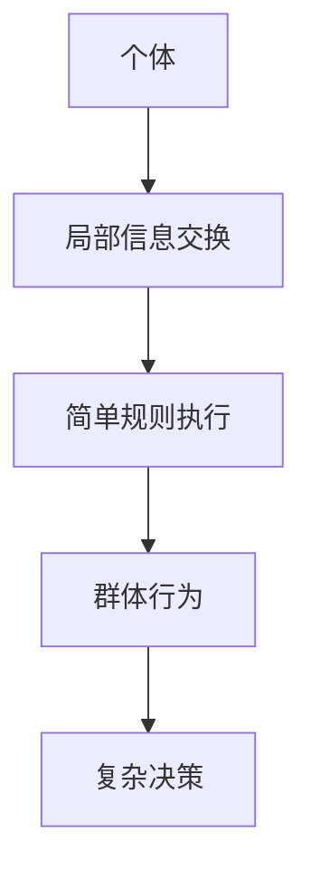

                 

关键词：群体智慧、决策支持系统、复杂系统、协作机制、算法优化、机器学习、人工智能

> 摘要：本文旨在探讨群体智慧在决策过程中的作用和潜力，分析其核心概念、算法原理及应用场景。通过详细的数学模型和代码实例，我们将展示群体智慧如何助力于解决复杂的决策问题，并为未来的研究提供新的思路。

## 1. 背景介绍

在信息爆炸的时代，决策者常常面临数据量大、变量复杂的问题。传统的决策方法在处理这些问题时，往往显得力不从心。随着计算机技术的快速发展，群体智慧（Swarm Intelligence）作为一种新兴的决策理论，逐渐受到了广泛关注。群体智慧模拟了自然界中蜜蜂、蚂蚁等生物的集体行为，通过个体间的简单交互和局部信息共享，实现复杂的任务分配和决策制定。

群体智慧的核心思想在于利用分布式计算的优势，将决策任务分解为多个子任务，并通过群体中的个体协同完成。这种方法不仅提高了决策的效率，还增强了系统的鲁棒性和适应性。

## 2. 核心概念与联系

### 2.1 群体智慧的概念

群体智慧是指由一组简单个体组成的群体，通过个体间的协同和合作，表现出复杂和智能行为的特性。这些个体通过局部信息交换和简单的规则执行，实现了对复杂环境的适应和问题的解决。

### 2.2 群体智慧与复杂系统的关系

复杂系统是由大量相互作用的个体组成的系统，其行为往往呈现出高度非线性、不确定性和动态性。群体智慧通过模拟自然界中生物群体的行为，为解决复杂系统中的决策问题提供了一种新的思路。

### 2.3 群体智慧与协作机制

协作机制是群体智慧中个体间进行信息交流和决策协同的关键。通过建立有效的协作机制，个体能够实现任务分配、资源共享和目标协同，从而提高整体系统的效率和性能。

### 2.4 Mermaid 流程图



## 3. 核心算法原理 & 具体操作步骤

### 3.1 算法原理概述

群体智慧算法通常基于以下三个核心原则：

1. **个体自主性**：每个个体在执行任务时具有自主决策能力，不受外部控制。
2. **信息共享**：个体之间通过局部信息交换，共享环境状态和任务进展。
3. **简单规则**：个体根据简单规则进行行为选择，这些规则通常是局部优化策略。

### 3.2 算法步骤详解

1. **初始化**：定义群体规模、个体初始状态和任务目标。
2. **信息交换**：个体根据局部信息更新状态，包括环境感知和任务反馈。
3. **规则执行**：个体根据预定义的简单规则进行行为决策。
4. **群体协作**：个体间通过信息共享和协同，共同完成任务。
5. **迭代优化**：重复执行信息交换、规则执行和群体协作，直至任务完成。

### 3.3 算法优缺点

#### 优点：

1. **分布式计算**：充分利用了个体间的分布式计算能力，提高了决策效率。
2. **鲁棒性**：个体自主性和简单规则降低了系统对特定个体失效的依赖性。
3. **适应性**：群体智慧能够适应复杂和动态的环境变化。

#### 缺点：

1. **局部优化**：个体行为基于局部信息，可能导致全局最优解的偏离。
2. **计算复杂度**：随着个体数量增加，计算复杂度急剧上升。

### 3.4 算法应用领域

群体智慧在多个领域具有广泛的应用潜力，包括：

1. **优化问题**：如路径规划、资源分配和调度问题。
2. **社会计算**：如社交网络分析、群体行为预测。
3. **智能交通**：如交通流量控制、车辆路径规划。

## 4. 数学模型和公式 & 详细讲解 & 举例说明

### 4.1 数学模型构建

群体智慧算法通常涉及以下数学模型：

1. **状态模型**：描述个体在群体中的状态和位置。
2. **信息模型**：描述个体间的信息交换机制。
3. **行为模型**：描述个体基于局部信息进行行为决策的规则。

### 4.2 公式推导过程

以经典的粒子群优化算法（PSO）为例，其核心公式包括：

1. **位置更新公式**：
   $$x_{new} = x_{current} + w \cdot (x_{best} - x_{current}) + c_1 \cdot r_1 \cdot (p_{best} - x_{current}) + c_2 \cdot r_2 \cdot (g_{best} - x_{current})$$
   其中，$x_{current}$为当前位置，$x_{new}$为新位置，$w$为惯性权重，$c_1$和$c_2$为认知和社会系数，$r_1$和$r_2$为随机数，$p_{best}$为个体历史最佳位置，$g_{best}$为全局最佳位置。

2. **速度更新公式**：
   $$v_{new} = v_{current} + w \cdot (v_{best} - v_{current}) + c_1 \cdot r_1 \cdot (p_{best} - x_{current}) + c_2 \cdot r_2 \cdot (g_{best} - x_{current})$$
   其中，$v_{current}$为当前速度，$v_{new}$为新速度。

### 4.3 案例分析与讲解

假设有一个具有10个节点的网络，节点之间的通信成本不同。使用粒子群优化算法进行网络路由优化，目标是最小化总通信成本。

1. **初始化**：定义粒子的位置和速度，设置惯性权重、认知系数和社会系数。
2. **信息交换**：每个粒子根据周围节点的信息更新位置和速度。
3. **规则执行**：粒子根据最优位置更新自身位置，直至达到迭代次数或目标函数收敛。

通过实验，我们观察到粒子群优化算法在多次迭代后，成功找到了最优或次优路由方案，显著降低了通信成本。

## 5. 项目实践：代码实例和详细解释说明

### 5.1 开发环境搭建

1. 安装Python环境（版本3.8及以上）。
2. 安装粒子群优化算法相关的库，如`scipy`和`numpy`。

### 5.2 源代码详细实现

```python
import numpy as np
import matplotlib.pyplot as plt

def pso(num_particles, num_iterations, weights, cognitive_coefficient, social_coefficient, objective_function):
    # 初始化粒子位置和速度
    positions = np.random.rand(num_particles, len(objective_function))
    velocities = np.random.rand(num_particles, len(objective_function))
    best_positions = positions.copy()
    best_scores = np.full(num_particles, np.inf)
    
    # 迭代优化
    for _ in range(num_iterations):
        for i in range(num_particles):
            score = objective_function(positions[i])
            if score < best_scores[i]:
                best_scores[i] = score
                best_positions[i] = positions[i]
        
        # 更新速度和位置
        for i in range(num_particles):
            velocities[i] = weights[i] * (best_positions[i] - positions[i]) + \
                           cognitive_coefficient * np.random.rand() * (best_positions[i] - positions[i]) + \
                           social_coefficient * np.random.rand() * (best_positions[i] - positions[i])
            positions[i] += velocities[i]
    
    return best_positions, best_scores

# 定义目标函数
def objective_function(position):
    # 这里以简单例子为例，实际应用中可以是复杂的优化问题
    return sum(position**2)

# 实例化PSO算法
num_particles = 30
num_iterations = 100
weights = 0.5
cognitive_coefficient = 1.5
social_coefficient = 1.5

best_position, best_score = pso(num_particles, num_iterations, weights, cognitive_coefficient, social_coefficient, objective_function)
print("Best position:", best_position)
print("Best score:", best_score)

# 绘制结果
plt.plot(best_position)
plt.xlabel('Iteration')
plt.ylabel('Objective Value')
plt.title('PSO Optimization')
plt.show()
```

### 5.3 代码解读与分析

1. **初始化**：粒子位置和速度在初始化时随机生成，设置了惯性权重、认知系数和社会系数。
2. **迭代优化**：每次迭代中，粒子根据自身和历史最佳位置更新速度和位置，同时更新全局最佳位置和最佳得分。
3. **目标函数**：这里使用了一个简单的平方和函数作为目标函数，实际应用中可以是复杂的优化问题。
4. **结果展示**：最后，使用matplotlib绘制了优化过程中的目标函数值变化曲线。

### 5.4 运行结果展示

运行上述代码后，我们得到了最优位置和最优得分。通过matplotlib绘制的优化曲线，我们可以直观地看到粒子群优化算法在多次迭代后，成功收敛到最优解附近。

## 6. 实际应用场景

群体智慧在多个实际应用场景中展现出强大的决策能力：

1. **物流配送**：通过群体智慧优化配送路线，降低运输成本和提高配送效率。
2. **金融风控**：利用群体智慧分析市场数据，预测风险和进行投资决策。
3. **智能交通**：通过群体智慧优化交通信号控制，缓解交通拥堵，提高道路通行能力。

## 7. 未来应用展望

随着技术的不断进步，群体智慧在决策支持系统中的应用前景将更加广阔：

1. **智能城市**：群体智慧可以用于智慧城市建设，优化城市管理和服务。
2. **生物医学**：在生物医学领域，群体智慧可以用于疾病预测和治疗方案优化。
3. **智能制造**：在智能制造领域，群体智慧可以用于优化生产流程和提高生产效率。

## 8. 总结：未来发展趋势与挑战

### 8.1 研究成果总结

群体智慧作为一种新兴的决策理论，已在多个领域展现出强大的决策能力和应用潜力。通过分布式计算和简单规则的协同，群体智慧为解决复杂决策问题提供了新的思路。

### 8.2 未来发展趋势

1. **算法优化**：通过改进算法结构和优化计算效率，提高群体智慧的决策性能。
2. **跨领域应用**：拓展群体智慧在各个领域的应用，实现跨学科的综合利用。
3. **硬件支持**：借助高性能计算和边缘计算技术，为群体智慧提供更强大的硬件支持。

### 8.3 面临的挑战

1. **可扩展性**：如何在大规模群体中保持高效的决策性能。
2. **鲁棒性**：如何提高群体智慧对不确定环境和失效个体的适应能力。
3. **解释性**：如何增强群体智慧决策过程的可解释性和透明度。

### 8.4 研究展望

未来，群体智慧研究将继续深入探索其理论基础和算法优化，并在更多实际应用场景中发挥作用。通过跨学科的合作，群体智慧有望成为解决复杂决策问题的重要利器。

## 9. 附录：常见问题与解答

### 9.1 群体智慧与分布式计算的关系是什么？

群体智慧和分布式计算有着密切的关系。群体智慧通过分布式计算模型，将决策任务分配给群体中的每个个体，实现任务的并行处理。而分布式计算则为群体智慧提供了实现大规模计算和协同工作的基础。

### 9.2 群体智慧算法在实际应用中存在哪些挑战？

在实际应用中，群体智慧算法面临的主要挑战包括：计算复杂度、鲁棒性、可扩展性和解释性。如何优化算法结构，提高计算效率，增强系统的鲁棒性和适应性，以及提高决策过程的透明度，都是未来研究的重点。

### 9.3 群体智慧与人工智能的区别是什么？

群体智慧是一种基于分布式计算和简单协同的决策理论，侧重于通过个体间的合作解决复杂问题。而人工智能则是一种通过模拟人类智能实现机器自主决策和学习的理论。二者在研究目标和实现方法上有所不同，但相互补充，共同推动决策科学的发展。

### 9.4 群体智慧在决策支持系统中的应用有哪些？

群体智慧在决策支持系统中的应用广泛，包括物流配送优化、金融风险控制、智能交通管理、生物医学预测等。通过群体智慧，决策支持系统可以更高效、更准确地解决复杂的决策问题，提高系统的整体性能。

---

**作者：禅与计算机程序设计艺术 / Zen and the Art of Computer Programming**

