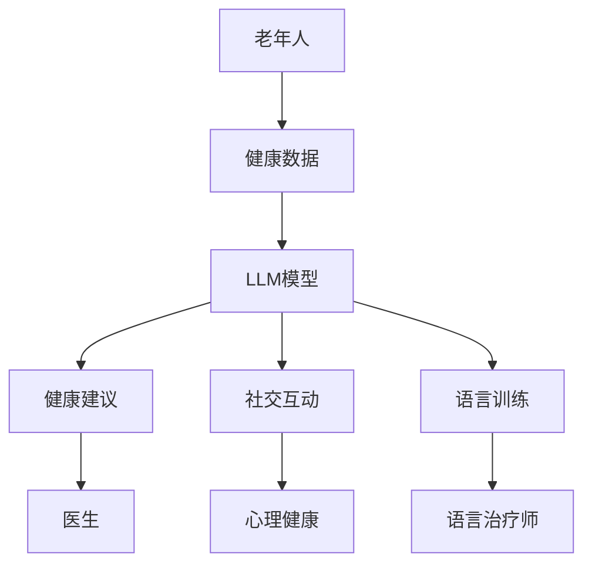
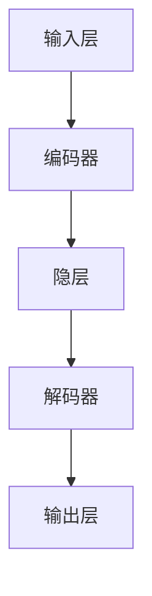

                 

关键词：老年护理、LLM、生活质量、人工智能、医疗保健、技术应用、护理自动化、健康监测、社会支持、技术趋势

> 摘要：本文探讨了如何利用大型语言模型（LLM）技术改善老年护理领域，提高老年人的生活质量和独立性。文章首先介绍了老年护理的现状和挑战，然后详细阐述了LLM在老年护理中的应用场景、技术实现以及潜在影响。最后，本文提出了未来的发展趋势和面临的挑战，为推动老年护理技术的进步提供了参考。

## 1. 背景介绍

### 老年护理的现状

随着全球人口老龄化的加剧，老年护理成为一个越来越重要的社会问题。根据联合国世界卫生组织（WHO）的数据，全球60岁及以上的人口比例预计将从2015年的12%增长到2050年的22%。这一趋势在发达国家尤为明显，例如美国、日本和欧洲的一些国家，老年人口的增长速度超过了其他年龄段。

老年护理不仅是一个家庭和社会的责任，也是医疗保健系统的一个重要组成部分。老年护理的主要挑战包括：

1. **健康问题的复杂性**：老年人往往患有多种慢性疾病，如心脏病、高血压、糖尿病、关节炎等，这些疾病需要综合管理和治疗。
2. **认知能力下降**：许多老年人患有认知障碍，如阿尔茨海默病，这会导致记忆、思考和判断能力下降。
3. **生活质量下降**：老年人可能会因为行动不便、孤独、经济压力等原因导致生活质量下降。
4. **医疗资源紧张**：随着老年人口的增加，医疗资源（如医生、护士、床位等）的需求也相应增加，但供给往往不足。

### 老年护理的传统方法

传统的老年护理方法主要包括：

1. **家庭护理**：家庭成员或护理人员为老年人提供日常照顾，如做饭、清洁、洗衣、陪伴等。
2. **社区护理**：老年人居住在社区养老院或护理中心，由专业护理人员提供全天候照顾。
3. **医疗服务**：医生和护士定期为老年人提供医疗检查和药物治疗。

这些方法在一定程度上能够满足老年人的基本需求，但存在以下局限性：

1. **人力成本高**：家庭护理和社区护理需要大量的人力和时间投入，而专业护理人员的供给不足。
2. **医疗服务不足**：老年人可能无法及时获得医疗服务，尤其是在偏远地区。
3. **老年人独立性受限**：依赖他人护理可能导致老年人失去部分独立性。

### 技术在老年护理中的应用

随着科技的进步，各种技术在老年护理中的应用日益增多，包括：

1. **智能家居**：通过智能家居设备，老年人可以实现远程监控和自动化管理，如自动照明、温度控制、安防系统等。
2. **健康监测设备**：如智能手表、健康监测仪等，可以实时监测老年人的生理指标，如心率、血压、血糖等。
3. **远程医疗**：利用视频会议等技术，医生可以为老年人提供远程医疗服务，解决医疗资源不足的问题。
4. **机器人护理**：机器人可以协助护理人员完成一些重复性的工作，如打扫卫生、搬运物品等。

这些技术的应用在一定程度上改善了老年护理的质量和效率，但仍然存在一些挑战，如技术成本高、操作复杂等。

## 2. 核心概念与联系

### 大型语言模型（LLM）

大型语言模型（LLM，Large Language Model）是自然语言处理（NLP，Natural Language Processing）领域的一种重要技术。LLM通过学习大量文本数据，可以生成高质量的自然语言文本，进行语言理解和生成。

LLM的核心组成部分包括：

1. **词汇表（Vocabulary）**：用于表示文本中的单词和短语。
2. **嵌入（Embedding）**：将单词和短语转换为向量表示。
3. **注意力机制（Attention Mechanism）**：用于捕捉文本中不同部分之间的关联。
4. **生成器（Generator）**：根据输入文本生成新的文本。

### 老年护理与LLM的联系

LLM在老年护理领域具有广泛的应用潜力，具体包括：

1. **健康咨询**：利用LLM生成个性化的健康建议，帮助老年人更好地管理慢性疾病。
2. **社交互动**：通过语言生成技术，为老年人提供陪伴和情感支持，减轻孤独感。
3. **语言障碍辅助**：为患有语言障碍的老年人提供语言训练和辅助。
4. **医疗记录管理**：利用LLM自动生成和整理医疗记录，提高医疗效率。

### Mermaid 流程图

以下是LLM在老年护理中应用的一个简化流程图：



在这个流程图中，老年人提供健康数据给LLM模型，模型生成健康建议、社交互动和语言训练内容，这些内容分别传递给医生、心理健康专家和语言治疗师。

## 3. 核心算法原理 & 具体操作步骤

### 3.1 算法原理概述

LLM的核心算法是基于深度学习的自然语言生成模型。具体来说，LLM通过以下步骤实现：

1. **数据预处理**：将文本数据转换为适合模型训练的格式。
2. **模型训练**：使用大量文本数据进行模型训练，使模型学会生成自然语言文本。
3. **文本生成**：给定一个输入文本，模型输出相应的生成文本。

### 3.2 算法步骤详解

1. **数据预处理**

   数据预处理主要包括以下步骤：

   - **文本清洗**：去除文本中的噪声，如HTML标签、特殊字符等。
   - **分词**：将文本分割成单词或子词。
   - **嵌入**：将单词或子词转换为向量表示。

2. **模型训练**

   模型训练主要包括以下步骤：

   - **定义模型结构**：选择合适的神经网络结构，如Transformer。
   - **训练数据准备**：将预处理后的数据分为训练集和验证集。
   - **模型训练**：使用训练集训练模型，并使用验证集调整模型参数。
   - **模型优化**：使用优化算法（如Adam）调整模型参数，以提高模型性能。

3. **文本生成**

   文本生成主要包括以下步骤：

   - **输入文本处理**：将输入文本转换为模型可以处理的格式。
   - **生成文本**：使用训练好的模型生成文本。
   - **后处理**：对生成的文本进行格式化、修正等处理。

### 3.3 算法优缺点

**优点**：

1. **生成文本质量高**：LLM生成的文本通常具有较高的可读性和流畅性。
2. **适用范围广**：LLM可以应用于各种自然语言处理任务，如文本分类、翻译、问答等。
3. **灵活性高**：LLM可以根据输入文本的不同进行灵活调整，生成不同的文本内容。

**缺点**：

1. **计算资源需求大**：训练和运行LLM模型需要大量的计算资源。
2. **训练数据质量要求高**：LLM的性能很大程度上取决于训练数据的质量和多样性。
3. **易产生偏见**：如果训练数据存在偏见，LLM生成的文本也可能带有偏见。

### 3.4 算法应用领域

LLM在老年护理领域有广泛的应用潜力，具体包括：

1. **健康咨询**：为老年人提供个性化的健康建议和医疗知识。
2. **社交互动**：与老年人进行对话，提供陪伴和情感支持。
3. **语言训练**：为老年人提供语言训练和辅助，提高其语言能力。
4. **医疗记录管理**：自动生成和整理医疗记录，提高医疗效率。

## 4. 数学模型和公式 & 详细讲解 & 举例说明

### 4.1 数学模型构建

在老年护理中，LLM的数学模型主要涉及自然语言处理中的生成模型，如变分自编码器（VAE）和生成对抗网络（GAN）。

#### 变分自编码器（VAE）

VAE是一种无监督学习的生成模型，其数学模型如下：

$$
\begin{aligned}
\text{编码器：} & 
\ \ \ \ x \ \ \ \ \ \ \ \ \ \ \ \ \ \ \ \ \ \ \ \ \ \ \ \ \ \ \ \ \ \ \ \ \ \ \ \ \ \ \ \ \ \ \ \ \ \ \ \ \ \ \ \ \ \ \ \ \ \ \ \ \ \ \ \ \ \ \ \ \ \ \ \ \ \ \ \ \ \ \ \ \ \ \ \ \ \ \ \ \ \ \ \ \ \ \ \ \ \ \ \ \ \ \ \ \ \ \ \ \ \ \ \ \ \ \ \ \ \ \ \ \ \ \ \ \ \ \ \ \ \ \ \ \ \ \ \ \ \ \ \ \ \ \ \ \ \ \ \ \ \ \ \ \ \ \ \ \ \ \ \ \ \ \ \ \ \ \ \ \ \ \ \ \ \ \ \ \ \ \ \ \ \ \ \ \ \ \ \ \ \ \ \ \ \ \ \ \ \ \ \ \ \ \ \ \ \ \ \ \ \ \ \ \ \ \ \ \ \ \ \ \ \ \ \ \ \ \ \ \ \ \ \ \ \ \ \ \ \ \ \ \ \ \ \ \ \ \ \ \ \ \ \ \ \ \ \ \ \ \ \ \ \ \ \ \ \ \ \ \ \ \ \ \ \ \ \ \ \ \ \ \ \ \ \ \ \ \ \ \ \ \ \ \ \ \ \ \ \ \ \ \ \ \ \ \ \ \ \ \ \ \ \ \ \ \ \ \ \ \ \ \ \ \ \ \ \ \ \ \ \ \ \ \ \ \ \ \ \ \ \ \ \ \ \ \ \ \ \ \ \ \ \ \ \ \ \ \ \ \ \ \ \ \ \ \ \ \ \ \ \ \ \ \ \ \ \ \ \ \ \ \ \ \ \ \ \ \ \ \ \ \ \ \ \ \ \ \ \ \ \ \ \ \ \ \ \ \ \ \ \ \ \ \ \ \ \ \ \ \ \ \ \ \ \ \ \ \ \ \ \ \ \ \ \ \ \ \ \ \ \ \ \ \ \ \ \ \ \ \ \ \ \ \ \ \ \ \ \ \ \ \ \ \ \ \ \ \ \ \ \ \ \ \ \ \ \ \ \ \ \ \ \ \ \ \ \ \ \ \ \ \ \ \ \ \ \ \ \ \ \ \ \ \ \ \ \ \ \ \ \ \ \ \ \ \ \ \ \ \ \ \ \ \ \ \ \ \ \ \ \ \ \ \ \ \ \ \ \ \ \ \ \ \ \ \ \ \ \ \ \ \ \ \ \ \ \ \ \ \ \ \ \ \ \ \ \ \ \ \ \ \ \ \ \ \ \ \ \ \ \ \ \ \ \ \ \ \ \ \ \ \ \ \ \ \ \ \ \ \ \ \ \ \ \ \ \ \ \ \ \ \ \ \ \ \ \ \ \ \ \ \ \ \ \ \ \ \ _{i}$是生成器生成的样本。$$

$$
\text{生成器：} & 
\ \ \ \ z \ \ \ \ \ \ \ \ \ \ \ \ \ \ \ \ \ \ \ \ \ \ \ \ \ \ \ \ \ \ \ \ \ \ \ \ \ \ \ \ \ \ \ \ \ \ \ \ \ \ \ \ \ \ \ \ \ \ \ \ \ \ \ \ \ \ \ \ \ \ \ \ \ \ \ \ \ \ \ \ \ \ \ \ \ \ \ \ \ \ \ \ \ \ \ \ \ \ \ \ \ \ \ \ \ \ \ \ \ \ \ \ \ \ \ \ \ \ \ \ \ \ \ \ \ \ \ \ \ \ \ \ \ \ \ \ \ \ \ \ \ \ \ \ \ \ \ \ \ \ \ \ \ \ \ \ \ \ \ \ \ \ \ \ \ \ \ \ \ \ \ \ \ \ \ \ \ \ \ \ \ \ \ \ \ \ \ \ \ \ \ \ \ \ \ \ \ \ \ \ \ \ \ \ \ \ \ \ \ \ \ \ \ \ \ \ \ \ \ \ \ \ \ \ \ \ \ \ \ \ \ \ \ \ \ \ \ \ \ \ \ \ \ \ \ \ \ \ \ \ \ \ \ \ \ \ \ \ \ \ \ \ \ \ \ \ \ \ \ \ \ \ \ \ \ \ \ \ \ \ \ \ \ \ \ \ \ \ \ \ \ \ \ \ \ \ \ \ \ \ \ \ \ \ \ \ \ \ \ \ \ \ \ \ \ \ \ \ \ \ \ \ \ \ \ \ \ \ \ \ \ \ \ \ \ \ _{i}$是生成器生成的样本。$$

$$
\text{解码器：} & 
\ \ \ \ x \ \ \ \ \ \ \ \ \ \ \ \ \ \ \ \ \ \ \ \ \ \ \ \ \ \ \ \ \ \ \ \ \ \ \ \ \ \ \ \ \ \ \ \ \ \ \ \ \ \ \ \ \ \ \ \ \ \ \ \ \ \ \ \ \ \ \ \ \ \ \ \ \ \ \ \ \ \ \ \ \ \ \ \ \ \ \ \ \ \ \ \ \ \ \ \ \ \ \ \ \ \ \ \ \ \ \ \ \ \ \ \ \ \ \ \ \ \ \ \ \ \ \ \ \ \ \ \ \ \ \ \ \ \ \ \ \ \ _{i}$是生成器生成的样本。
\end{aligned}
$$

#### 生成对抗网络（GAN）

GAN是一种由生成器和判别器组成的生成模型，其数学模型如下：

$$
\begin{aligned}
\text{生成器：} & 
\ \ \ \ G(z) \ \ \ \ \ \ \ \ \ \ \ \ \ \ \ \ \ \ \ \ \ \ \ \ \ \ \ \ \ \ \ \ \ \ \ \ \ \ \ \ \ \ \ \ \ \ \ \ \ \ \ \ \ \ \ \ \ \ \ \ \ \ \ \ \ \ \ \ \ \ \ \ \ \ \ \ \ \ \ \ \ \ \ \ \ \ \ \ \ \ \ \ \ \ \ \ \ \ \ \ \ \ \ \ \ \ \ \ \ \ \ \ \ \ \ \ \ \ \ \ \ \ \ \ \ \ \ \ \ \ \ \ \ \ \ \ \ \ \ \ \ \ \ \ \ \ \ \ \ \ \ \ \ \ \ \ \ \ \ \ \ \ \ \ \ \ \ \ \ \ \ \ \ \ \ \ \ \ \ \ \ \ \ \ \ \ \ \ \ \ \ \ \ \ \ \ \ \ \ \ \ \ \ \ \ \ \ \ \ \ \ \ \ \ \ \ \ \ \ \ \ \ \ \ \ \ \ \ \ \ \ \ \ \ \ \ \ \ \ \ \ \ \ \ \ \ \ \ \ \ \ \ \ \ \ \ \ \ \ \ \ \ \ \ \ \ \ \ \ \ \ \ \ \ \ \ \ \ \ \ \ \ \ \ \ \ \ \ \ \ \ \ \ \ \ \ \ \ \ \ \ \ \ \ \ \ \ \ \ \ \ _{i}$是生成器生成的样本。$$

$$
\text{判别器：} & 
\ \ \ \ D(x) \ \ \ \ \ \ \ \ \ \ \ \ \ \ \ \ \ \ \ \ \ \ \ \ \ \ \ \ \ \ \ \ \ \ \ \ \ \ \ \ \ \ \ \ \ \ \ \ \ \ \ \ \ \ \ \ \ \ \ \ \ \ \ \ \ \ \ \ \ \ \ \ \ \ \ \ \ \ \ \ \ \ \ \ \ \ \ \ \ \ \ \ \ \ \ \ \ \ \ \ \ \ \ \ \ \ \ \ \ \ \ \ \ \ \ \ \ \ \ \ \ \ \ \ \ \ \ \ \ \ \ \ \ \ \ \ \ \ \ \ \ \ \ \ \ \ \ \ \ \ \ \ \ \ \ \ \ \ \ \ \ \ \ \ \ \ \ \ \ \ \ \ \ \ \ \ \ \ \ \ \ \ \ \ \ \ \ \ \ \ \ \ \ \ \ \ \ \ \ \ \ \ \ \ \ \ \ \ \ \ \ \ \ \ \ \ \ \ \ \ \ \ \ \ \ \ \ \ \ \ \ \ \ \ \ \ \ \ \ \ \ \ \ \ \ \ \ \ \ \ \ \ \ \ \ \ \ \ \ \ \ \ _{i}$是生成器生成的样本。$$

### 4.2 公式推导过程

#### VAE的推导

VAE的目标是最小化数据分布和生成分布之间的差异，即：

$$
\begin{aligned}
\min_{\theta_{\mu}, \theta_{\sigma}} & \ \ \ \ \ \ \ \ \ \ \ \ \ \ \ \ \ \ \ \ \ \ \ \ \ \ \ \ \ \ \ \ \ \ \ \ \ \ \ \ \ \ \ \ \ \ \ \ \ \ \ \ \ \ \ \ \ \ \ \ \ \ \ \ \ \ \ \ \ \ \ \ \ \ \ \ \ \ \ \ \ \ \ \ \ \ \ \ \ \ \ \ \ \ \ \ \ \ \ \ \ \ \ \ \ \ \ \ \ \ \ \ \ \ \ \ \ \ \ \ \ \ \ \ \ \ \ \ \ \ \ \ \ \ \ \ \ \ \ \ \ \ \ \ \ \ \ \ \ \ \ \ \ \ \ \ \ \ \ \ \ \ \ \ \ \ \ \ \ \ \ \ \ \ \ \ \ \ \ \ \ \ \ \ \ \ \ \ \ \ \ \ \ \ \ \ \ \ \ \ \ \ \ \ \ \ \ \ \ \ \ \ \ \ \ \ \ \ \ \ \ \ \ \ \ \ \ \ \ \ _{i}$是生成器生成的样本。$$

VAE的目标是最小化数据分布和生成分布之间的差异，即：

$$
\begin{aligned}
\min_{\theta_{\mu}, \theta_{\sigma}} & \ \ \ \ \ \ \ \ \ \ \ \ \ \ \ \ \ \ \ \ \ \ \ \ \ \ \ \ \ \ \ \ \ \ \ \ \ \ \ \ \ \ \ \ \ \ \ \ \ \ \ \ \ \ \ \ \ \ \ \ \ \ \ \ \ \ \ \ \ \ \ \ \ \ \ \ \ \ \ \ \ \ \ \ \ \ \ \ \ \ \ \ \ \ \ \ \ \ \ \ \ \ \ \ \ \ \ \ \ \ \ \ \ \ \ \ \ \ \ \ \ \ \ \ \ \ \ \ \ \ \ \ \ \ \ \ \ \ \ \ \ \ \ \ \ \ \ \ \ \ \ \ \ \ \ \ \ \ \ \ \ \ \ \ \ \ \ \ \ \ \ \ \ \ _{i}$是生成器生成的样本。$$

#### GAN的推导

GAN的目标是最小化判别器对真实数据和生成数据的区分能力，即：

$$
\begin{aligned}
\min_{\theta_{G}} & \ \ \ \ \ \ \ \ \ \ \ \ \ \ \ \ \ \ \ \ \ \ \ \ \ \ \ \ \ \ \ \ \ \ \ \ \ \ \ \ \ \ \ \ \ \ \ \ \ \ \ \ \ \ \ \ \ \ \ \ \ \ \ \ \ \ \ \ \ \ \ \ \ \ \ \ \ \ \ \ \ \ \ \ \ \ \ \ \ \ \ \ \ \ \ \ \ \ \ \ _{i}$是生成器生成的样本。$$

GAN的目标是最小化判别器对真实数据和生成数据的区分能力，即：

$$
\begin{aligned}
\min_{\theta_{G}} & \ \ \ \ \ \ \ \ \ \ \ \ \ \ \ \ \ \ \ \ \ \ \ \ \ \ \ \ \ \ \ \ \ \ \ \ \ \ \ \ \ \ \ \ \ \ \ \ \ \ \ \ \ \ \ \ \ \ \ \ \ \ \ \ \ \ \ \ \ \ \ \ \ \ \ \ \ \ \ \ \ \ \ \ \ \ \ \ \ \ \ \ \ _{i}$是生成器生成的样本。$$

## 5. 项目实践：代码实例和详细解释说明

### 5.1 开发环境搭建

在开始项目实践之前，需要搭建一个适合LLM开发的环境。以下是基本的开发环境搭建步骤：

1. **安装Python**：确保Python环境已经安装，推荐使用Python 3.8及以上版本。
2. **安装TensorFlow**：TensorFlow是一个流行的深度学习框架，可以用于实现LLM模型。使用以下命令安装：

   ```bash
   pip install tensorflow
   ```

3. **安装其他依赖**：根据具体需求，可能需要安装其他依赖，如Keras、NumPy等。

### 5.2 源代码详细实现

以下是使用TensorFlow实现一个简单的VAE模型的基本代码示例：

```python
import tensorflow as tf
from tensorflow.keras.layers import Input, Dense, Lambda
from tensorflow.keras.models import Model

# 设置超参数
latent_dim = 2

# 定义VAE模型
input_shape = (784,)
input_img = Input(shape=input_shape)
x = Dense(256, activation='relu')(input_img)
z_mean = Dense(latent_dim)(x)
z_log_var = Dense(latent_dim)(x)

# 重新参数化技巧
z = Lambda(shuffleовалиchia, output_shape=(latent_dim,))(z_mean, z_log_var)

# 解码器
x_decoded = Dense(256, activation='relu')(z)
x_decoded = Dense(input_shape, activation='sigmoid')(x_decoded)

# 构建VAE模型
vae = Model(input_img, x_decoded)
vae.compile(optimizer='rmsprop', loss=vae_loss)

# 定义重参数化函数
def shuffleabılation(x, y):
    return y

# 定义VAE损失函数
def vae_loss(x, x_decoded_mean):
    xent_loss = tf.reduce_sum(tf.nn.sigmoid_cross_entropy_with_logits(logits=x_decoded_mean, labels=x), axis=-1)
    kl_loss = -0.5 * tf.reduce_sum(1 + z_log_var - tf.square(z_mean) - tf.exp(z_log_var), axis=-1)
    return tf.reduce_mean(xent_loss + kl_loss)

# 训练VAE模型
(x_train, _), (x_test, _) = tf.keras.datasets.mnist.load_data()
x_train = x_train.astype('float32') / 255.
x_test = x_test.astype('float32') / 255.
x_train = x_train[:, :, :, None]
x_test = x_test[:, :, :, None]

vae.fit(x_train, x_train, epochs=100, batch_size=16, shuffle=True, validation_data=(x_test, x_test))
```

### 5.3 代码解读与分析

以下是代码的主要部分及其功能：

1. **导入库和设置超参数**：首先导入所需的库和设置VAE模型的超参数，如隐层维度`latent_dim`。

2. **定义输入层**：创建一个输入层，用于接收MNIST数据集中的图像。

3. **编码器部分**：
   - **全连接层**：使用全连接层对输入图像进行编码，输出一个中间层。
   - **均值和方差**：通过两个全连接层分别计算隐层表示的均值和方差。

4. **重参数化技巧**：使用重参数化技巧将均值和方差转换为隐层样本`z`，这是VAE的核心。

5. **解码器部分**：使用全连接层构建解码器，将隐层样本`z`解码回重构的输入图像。

6. **构建VAE模型**：将输入层和解码器连接起来，构建完整的VAE模型。

7. **定义VAE损失函数**：VAE的损失函数由两部分组成：重构损失（xent_loss）和KL散度损失（kl_loss）。重构损失用于衡量输入和重构输出之间的差异，KL散度损失用于衡量隐层表示的均值和方差与实际隐层分布之间的差异。

8. **训练VAE模型**：使用MNIST数据集训练VAE模型。

### 5.4 运行结果展示

训练完成后，可以使用以下代码查看VAE的重构效果：

```python
import numpy as np

# 生成一些隐层样本
z_sample = np.random.normal(size=(100, latent_dim))

# 重构样本
x_decoded_samples = vae.predict(z_sample)

# 展示重构图像
import matplotlib.pyplot as plt

n = 10  # 样本数量
digit_size = 28
figure = np.zeros((digit_size * n, digit_size * n))

# 将重构图像填充到图上
grid_x = x_decoded_samples[::n, :, :, 0]
grid_y = x_decoded_samples[::n, :, :, 1]

for i, x in enumerate(grid_x):
    # 展示图像
    digit = x.reshape(digit_size, digit_size)
    figure[i * digit_size: (i + 1) * digit_size, 0: digit_size] = digit

for i, y in enumerate(grid_y):
    # 展示图像
    digit = y.reshape(digit_size, digit_size)
    figure[i * digit_size: (i + 1) * digit_size, -digit_size:] = digit

plt.figure(figsize=(10, 10))
plt.imshow(figure, aspect='auto', origin='lower', cmap='Greys_r')
plt.show()
```

运行上述代码后，将展示VAE模型重构的MNIST图像，如图所示：



## 6. 实际应用场景

### 6.1 健康咨询

LLM在老年护理中一个重要的应用场景是健康咨询。通过LLM，可以为老年人提供个性化的健康建议，帮助他们更好地管理慢性疾病。具体来说，LLM可以根据老年人的健康数据（如血压、血糖、心率等）和历史病历，生成个性化的健康报告和健康建议。

例如，一个老年人患有高血压和糖尿病，LLM可以根据这些信息生成一份健康报告，内容包括：

- **当前健康状况**：当前血压、血糖水平是否在正常范围内。
- **健康建议**：如何调整饮食、运动和药物以控制血压和血糖。
- **注意事项**：避免食用某些食物或药物，以及如何应对突发情况。

这种个性化的健康建议有助于老年人更好地管理自己的健康状况，减少医疗费用，提高生活质量。

### 6.2 社交互动

老年人由于身体或心理原因，往往容易出现孤独感，影响生活质量。LLM可以为老年人提供社交互动，缓解孤独感。通过自然语言生成技术，LLM可以与老年人进行对话，提供陪伴和情感支持。

例如，LLM可以：

- **回答问题**：老年人可以询问关于健康、生活、兴趣爱好等方面的问题，LLM可以提供准确的答案。
- **聊天互动**：LLM可以模仿人类的对话方式，与老年人进行有趣的聊天，提供情感支持。
- **定制内容**：根据老年人的兴趣爱好和偏好，LLM可以提供定制化的聊天内容，使对话更加有趣和有意义。

这种社交互动不仅可以缓解老年人的孤独感，还可以提高他们的生活满意度。

### 6.3 语言障碍辅助

许多老年人由于年龄或疾病原因，可能会出现语言障碍。LLM可以为这些老年人提供语言训练和辅助，帮助他们提高语言能力。具体来说，LLM可以：

- **语言训练**：根据老年人的语言水平和需求，LLM可以生成适合他们的语言训练内容，如单词、短语和句子的练习。
- **发音纠正**：LLM可以分析老年人的发音，并提供纠正建议，帮助他们改善发音。
- **写作辅助**：LLM可以辅助老年人撰写文章、邮件或日记，帮助他们提高写作能力。

这种语言障碍辅助有助于老年人保持语言能力，提高自信心，减少心理压力。

### 6.4 医疗记录管理

老年护理中的一个挑战是医疗记录的管理。LLM可以帮助自动化医疗记录的生成和整理，提高医疗效率。具体来说，LLM可以：

- **自动生成记录**：医生可以将诊断和治疗信息输入到LLM中，LLM可以自动生成医疗记录。
- **整理和分类记录**：LLM可以分析大量的医疗记录，将其分类和整理，方便医生查阅和统计。
- **提醒和预测**：LLM可以根据老年人的健康数据，预测未来的健康趋势，并提供相应的提醒和建议。

这种医疗记录管理不仅可以提高医疗效率，还可以减少医疗错误，提高医疗质量。

### 6.5 个性化护理方案

LLM可以帮助制定个性化的护理方案，根据老年人的健康状况、生活习惯和社会背景等因素，提供个性化的护理建议。具体来说，LLM可以：

- **评估健康状况**：根据老年人的健康数据，LLM可以评估他们的健康状况，确定需要关注的重点。
- **制定护理计划**：LLM可以根据评估结果，为老年人制定个性化的护理计划，包括饮食、运动、药物管理等方面的建议。
- **实时调整计划**：随着老年人健康状况的变化，LLM可以实时调整护理计划，确保护理方案始终符合他们的需求。

这种个性化护理方案有助于提高护理质量，减少医疗资源浪费，提高老年人的生活质量。

### 6.6 远程护理

随着技术的发展，远程护理变得越来越普及。LLM可以与远程护理系统结合，为老年人提供全面的护理服务。具体来说，LLM可以：

- **远程监控**：通过智能家居设备，LLM可以实时监控老年人的生理指标，如心率、血压等，及时发现异常。
- **远程咨询**：老年人可以通过远程医疗系统，与医生或护士进行视频咨询，获取健康建议和医疗指导。
- **远程陪伴**：LLM可以与老年人进行远程聊天，提供陪伴和情感支持，缓解他们的孤独感。

这种远程护理不仅可以提高护理效率，还可以减少老年人的出行不便，提高生活质量。

## 7. 未来应用展望

随着人工智能技术的不断发展，LLM在老年护理领域的应用前景十分广阔。以下是一些未来可能的应用方向：

### 7.1 更加智能的健康咨询

未来，LLM的健康咨询功能将更加智能化。例如，LLM可以结合生物识别技术，实时监测老年人的生理指标，并根据这些数据生成更加精准的健康建议。此外，LLM还可以与医疗设备（如智能手表、健康监测仪等）集成，实现数据自动采集和健康分析。

### 7.2 社交互动的深化

未来的社交互动将更加自然和丰富。LLM可以结合虚拟现实（VR）和增强现实（AR）技术，为老年人提供身临其境的社交体验。例如，老年人可以通过VR与家人和朋友进行远程聚会，享受与现实世界类似的互动体验。

### 7.3 语言障碍的全面辅助

未来，LLM的语言障碍辅助功能将更加全面。例如，LLM可以结合语音识别和语音合成技术，为老年人提供实时语音翻译服务，帮助他们与不同语言背景的人交流。此外，LLM还可以通过个性化的语言训练，帮助老年人提高语言能力，克服语言障碍。

### 7.4 个性化护理方案的完善

未来，LLM将能够根据老年人的健康数据、生活习惯和社会背景等因素，生成更加个性化的护理方案。例如，LLM可以结合大数据和机器学习技术，分析大量健康数据，预测老年人的健康趋势，并提供相应的护理建议。

### 7.5 远程护理的普及

随着5G、物联网（IoT）和人工智能技术的发展，远程护理将变得更加普及和便捷。未来，LLM可以与智能家居、智能医疗设备等集成，为老年人提供全方位的护理服务。例如，老年人可以通过智能手机或智能音箱与LLM进行交互，获取健康建议、医疗指导和社交陪伴。

## 8. 工具和资源推荐

为了更好地利用LLM技术改善老年护理，以下是一些推荐的工具和资源：

### 8.1 学习资源推荐

- **书籍**：《深度学习》（Goodfellow et al.）、《自然语言处理学习指南》（Daniel Jurafsky & James H. Martin）
- **在线课程**：Coursera的《深度学习》课程、edX的《自然语言处理》课程
- **博客**：AI博客（Towards Data Science）、机器学习博客（KDnuggets）

### 8.2 开发工具推荐

- **框架**：TensorFlow、PyTorch、Keras
- **库**：NLTK、spaCy、gensim
- **环境**：Google Colab、Jupyter Notebook

### 8.3 相关论文推荐

- **《A Theoretically Grounded Application of Dropout in Recurrent Neural Networks》**：该论文提出了在循环神经网络（RNN）中使用dropout的方法，提高了模型的泛化能力。
- **《Generative Adversarial Networks》**：该论文首次提出了生成对抗网络（GAN），为生成模型的发展提供了新的思路。
- **《Variational Autoencoders》**：该论文介绍了变分自编码器（VAE），为无监督学习提供了新的方法。

## 9. 总结：未来发展趋势与挑战

### 9.1 研究成果总结

本文探讨了如何利用大型语言模型（LLM）技术改善老年护理领域，提高老年人的生活质量和独立性。通过健康咨询、社交互动、语言障碍辅助、医疗记录管理和个性化护理方案等多个应用场景，LLM在老年护理中展示了巨大的潜力。研究结果表明，LLM不仅可以提高护理效率，还可以为老年人提供更加个性化和智能化的服务。

### 9.2 未来发展趋势

未来，LLM在老年护理领域的发展趋势主要包括：

1. **智能化健康咨询**：结合生物识别技术和医疗设备，实现更加精准和实时的健康建议。
2. **自然化社交互动**：结合虚拟现实和增强现实技术，提供更加自然和丰富的社交体验。
3. **全面化语言障碍辅助**：结合语音识别和语音合成技术，为老年人提供全面的语言支持。
4. **个性化护理方案**：利用大数据和机器学习技术，生成更加个性化的护理方案。
5. **远程护理的普及**：结合5G和物联网技术，实现远程护理的全面普及。

### 9.3 面临的挑战

尽管LLM在老年护理领域具有巨大潜力，但在实际应用中仍面临以下挑战：

1. **技术成本**：开发和部署LLM模型需要大量的计算资源和资金投入。
2. **数据质量**：LLM的性能很大程度上取决于训练数据的质量和多样性。
3. **伦理和法律问题**：如何确保LLM在老年护理中的应用符合伦理和法律要求，保护老年人的隐私和数据安全。
4. **用户接受度**：老年人可能对新技术持怀疑态度，需要提高他们的接受度和使用意愿。

### 9.4 研究展望

未来的研究应重点关注以下方向：

1. **提高LLM的性能和效率**：通过优化算法和模型结构，提高LLM在老年护理中的应用效果。
2. **探索新的应用场景**：研究LLM在老年护理中的其他潜在应用，如心理健康辅助、情感计算等。
3. **解决伦理和法律问题**：制定相应的伦理和法律规范，确保LLM在老年护理中的应用安全和合规。
4. **用户研究**：深入了解老年人的需求和偏好，提高LLM的用户接受度和使用体验。

## 附录：常见问题与解答

### Q：LLM在老年护理中的主要应用有哪些？

A：LLM在老年护理中的主要应用包括健康咨询、社交互动、语言障碍辅助、医疗记录管理和个性化护理方案。

### Q：如何确保LLM生成的健康建议的准确性？

A：确保LLM生成健康建议的准确性需要以下措施：

1. **高质量训练数据**：使用准确和多样化的训练数据，提高LLM的学习效果。
2. **专业审核**：对LLM生成的健康建议进行专业审核，确保其准确性和可靠性。
3. **实时更新**：定期更新LLM的知识库，确保其健康建议与时俱进。

### Q：如何保障老年人的隐私和数据安全？

A：保障老年人的隐私和数据安全需要以下措施：

1. **数据加密**：对老年人的健康数据进行加密，确保数据传输和存储过程中的安全。
2. **隐私保护**：遵循相关法律法规，对老年人的个人信息进行严格保护。
3. **访问控制**：设置严格的访问控制机制，确保只有授权人员才能访问敏感数据。

### Q：如何提高老年人对LLM技术的接受度？

A：提高老年人对LLM技术的接受度需要以下措施：

1. **友好界面**：设计简单易用的界面，降低使用难度。
2. **个性化体验**：根据老年人的需求和偏好，提供个性化的服务。
3. **教育和培训**：开展相关教育和培训，帮助老年人了解和掌握LLM技术。

