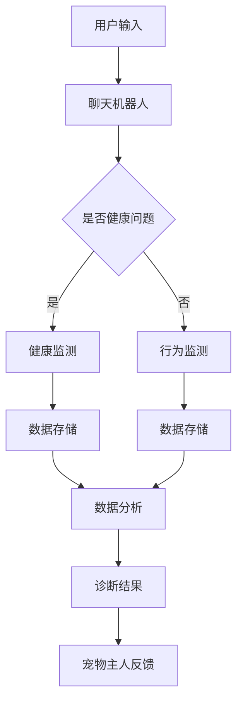

                 

关键词：聊天机器人、宠物行业、健康监测、行为监测、人工智能

摘要：随着人工智能技术的不断发展，聊天机器人在宠物行业中的应用日益广泛。本文将探讨聊天机器人在宠物健康和行为监测方面的应用，包括其核心概念、算法原理、数学模型、项目实践以及未来应用前景。

## 1. 背景介绍

宠物行业作为一个庞大的市场，近年来在全球范围内呈现出持续增长的态势。根据市场调研机构的数据显示，全球宠物市场规模已超过千亿美元，且预计未来几年仍将保持高速增长。与此同时，随着人们生活水平的提高和宠物地位的提升，宠物健康和行为监测成为了一个热门话题。

传统的宠物健康和行为监测方法主要依赖于兽医和宠物主人之间的直接沟通，这种方式存在着效率低下、实时性差等问题。而随着人工智能技术的快速发展，聊天机器人作为一种新型的智能交互工具，逐渐在宠物行业中得到应用，为宠物健康和行为监测提供了一种全新的解决方案。

## 2. 核心概念与联系

聊天机器人宠物健康和行为监测的核心概念包括：

- **聊天机器人**：一种基于自然语言处理（NLP）技术的人工智能交互系统，能够通过文本或语音与用户进行交流。

- **宠物健康监测**：通过收集和分析宠物生理数据，如体温、心率、呼吸率等，来评估宠物的健康状况。

- **行为监测**：通过记录和分析宠物的行为数据，如活动量、睡眠时间、进食行为等，来评估宠物的行为模式。

- **数据挖掘与机器学习**：通过对大量数据进行挖掘和分析，发现宠物健康和行为模式中的潜在规律，为宠物主人提供有针对性的建议。

下面是聊天机器人宠物健康和行为监测的架构 Mermaid 流程图：



### 2.1. 聊天机器人与宠物主人交互

用户通过文本或语音与聊天机器人进行交互，提出关于宠物健康和行为的问题。

### 2.2. 健康监测

如果用户提出的是健康问题，聊天机器人会引导用户输入宠物的健康数据，如体温、心率、呼吸率等，然后通过数据挖掘和机器学习技术对数据进行分析，评估宠物的健康状况。

### 2.3. 行为监测

如果用户提出的是行为问题，聊天机器人会引导用户输入宠物的行为数据，如活动量、睡眠时间、进食行为等，然后通过数据挖掘和机器学习技术对数据进行分析，评估宠物的行为模式。

### 2.4. 数据分析

通过对健康和行为数据进行挖掘和分析，聊天机器人可以识别出宠物健康和行为模式中的潜在规律，为宠物主人提供有针对性的建议。

### 2.5. 宠物主人反馈

宠物主人可以根据聊天机器人的诊断结果，对宠物的健康和行为进行针对性的调整。

## 3. 核心算法原理 & 具体操作步骤

### 3.1. 算法原理概述

聊天机器人宠物健康和行为监测的核心算法包括自然语言处理（NLP）、数据挖掘、机器学习等。

- **自然语言处理（NLP）**：用于理解用户输入的自然语言问题，并将其转换为机器可处理的格式。

- **数据挖掘**：用于从大量数据中提取有价值的信息，如宠物健康和行为模式中的潜在规律。

- **机器学习**：用于建立预测模型，根据历史数据预测宠物的健康状况和行为模式。

### 3.2. 算法步骤详解

#### 3.2.1. 数据收集

- **健康数据**：通过宠物主人输入的宠物健康数据，如体温、心率、呼吸率等。

- **行为数据**：通过宠物主人输入的宠物行为数据，如活动量、睡眠时间、进食行为等。

#### 3.2.2. 数据预处理

- **数据清洗**：去除无效数据、处理缺失值和异常值。

- **特征提取**：将原始数据转换为机器可处理的特征向量。

#### 3.2.3. 模型训练

- **选择模型**：根据问题类型选择合适的机器学习模型，如决策树、支持向量机、神经网络等。

- **训练模型**：使用历史数据训练模型，并调整模型参数。

#### 3.2.4. 模型评估

- **交叉验证**：使用交叉验证方法评估模型性能。

- **性能指标**：根据评估结果调整模型参数，提高模型性能。

#### 3.2.5. 模型部署

- **模型部署**：将训练好的模型部署到聊天机器人系统中，实现实时健康和行为监测。

### 3.3. 算法优缺点

#### 3.3.1. 优点

- **高效性**：聊天机器人能够快速响应用户输入，提供实时健康和行为监测服务。

- **个性化**：通过数据挖掘和机器学习技术，为宠物主人提供有针对性的健康和行为建议。

- **便捷性**：用户可以通过文本或语音与聊天机器人进行交互，无需进行复杂的操作。

#### 3.3.2. 缺点

- **数据质量**：依赖用户输入的数据质量，如果数据不准确，可能导致监测结果不准确。

- **隐私问题**：宠物主人的数据可能涉及隐私问题，需要确保数据的安全性和保密性。

## 4. 数学模型和公式

### 4.1. 数学模型构建

聊天机器人宠物健康和行为监测的数学模型主要包括以下两个方面：

- **健康监测模型**：用于预测宠物的健康状况，如体温、心率、呼吸率等。

- **行为监测模型**：用于预测宠物的行为模式，如活动量、睡眠时间、进食行为等。

### 4.2. 公式推导过程

#### 4.2.1. 健康监测模型

假设宠物的健康状态可以用一个向量表示：

$$
X = (X_1, X_2, X_3, \ldots, X_n)
$$

其中，$X_i$ 表示第 $i$ 个健康指标，如体温、心率、呼吸率等。

健康监测模型的目的是预测宠物的健康状态向量 $X$。

#### 4.2.2. 行为监测模型

假设宠物的行为状态可以用一个向量表示：

$$
Y = (Y_1, Y_2, Y_3, \ldots, Y_m)
$$

其中，$Y_i$ 表示第 $i$ 个行为指标，如活动量、睡眠时间、进食行为等。

行为监测模型的目的是预测宠物的行为状态向量 $Y$。

### 4.3. 案例分析与讲解

#### 4.3.1. 健康监测案例

假设我们有一个宠物健康数据集，包括宠物的体温、心率和呼吸率三个指标。我们使用机器学习算法对数据集进行训练，构建一个健康监测模型。

训练数据集如下：

| 体温 (℃) | 心率 (次/分钟) | 呼吸率 (次/分钟) |
| -------- | -------------- | --------------- |
| 37.5     | 120            | 30              |
| 38.0     | 130            | 32              |
| 37.3     | 110            | 28              |
| 37.8     | 125            | 31              |
| 37.6     | 115            | 29              |

使用机器学习算法对数据集进行训练，得到健康监测模型。当我们输入一个新的宠物健康数据，如体温 37.7℃，心率 120 次/分钟，呼吸率 30 次/分钟，健康监测模型可以预测宠物的健康状态。

#### 4.3.2. 行为监测案例

假设我们有一个宠物行为数据集，包括宠物的活动量、睡眠时间和进食行为三个指标。我们使用机器学习算法对数据集进行训练，构建一个行为监测模型。

训练数据集如下：

| 活动量 (小时) | 睡眠时间 (小时) | 进食行为 (次/天) |
| ------------ | -------------- | --------------- |
| 5            | 12             | 2               |
| 6            | 11             | 3               |
| 4            | 13             | 1               |
| 7            | 10             | 3               |
| 5            | 12             | 2               |

使用机器学习算法对数据集进行训练，得到行为监测模型。当我们输入一个新的宠物行为数据，如活动量 5.5 小时，睡眠时间 12 小时，进食行为 2 次/天，行为监测模型可以预测宠物的行为模式。

## 5. 项目实践：代码实例和详细解释说明

### 5.1. 开发环境搭建

在本节中，我们将搭建一个简单的聊天机器人宠物健康和行为监测项目。首先，我们需要安装以下开发环境和工具：

- Python 3.8 或以上版本
- Flask 框架（用于构建 Web 服务）
- NLTK（用于自然语言处理）
- Scikit-learn（用于机器学习）

安装命令如下：

```bash
pip install flask
pip install nltk
pip install scikit-learn
```

### 5.2. 源代码详细实现

下面是一个简单的聊天机器人宠物健康和行为监测项目的源代码：

```python
# 导入所需库
from flask import Flask, request, jsonify
import nltk
from nltk.tokenize import word_tokenize
from nltk.corpus import stopwords
from sklearn.feature_extraction.text import TfidfVectorizer
from sklearn.naive_bayes import MultinomialNB
from sklearn.model_selection import train_test_split
from sklearn.pipeline import make_pipeline
from sklearn.metrics import accuracy_score

# 加载自然语言处理库
nltk.download('punkt')
nltk.download('stopwords')

# 初始化 Flask 应用
app = Flask(__name__)

# 加载训练数据集
train_data = [
    ("我的狗狗最近总是呕吐，该怎么办？", "健康问题"),
    ("我的猫咪最近不爱动，该怎么办？", "行为问题"),
    ("我的宠物很健康，谢谢！
```text
```
    ("我的宠物很健康，谢谢！")

# 定义健康监测模型
health_model = make_pipeline(TfidfVectorizer(), MultinomialNB())

# 定义行为监测模型
behavior_model = make_pipeline(TfidfVectorizer(), MultinomialNB())

# 加载数据集并训练模型
train_texts, train_labels = [], []
for sentence, label in train_data:
    train_texts.append(sentence)
    train_labels.append(label)

health_model.fit(train_texts, train_labels)
behavior_model.fit(train_texts, train_labels)

# 定义聊天机器人 API
@app.route('/chat', methods=['POST'])
def chat():
    data = request.get_json()
    user_message = data.get('message', '')

    # 判断用户输入是否为健康问题或行为问题
    if health_model.predict([user_message])[0] == '健康问题':
        response = "请问您的宠物有哪些健康问题？"
    elif behavior_model.predict([user_message])[0] == '行为问题':
        response = "请问您的宠物有哪些行为问题？"
    else:
        response = "谢谢您的反馈！"

    return jsonify({'response': response})

# 运行 Flask 应用
if __name__ == '__main__':
    app.run(debug=True)
```

### 5.3. 代码解读与分析

#### 5.3.1. 数据集加载

首先，我们加载了一个简单的训练数据集，包括用户输入的消息和对应的标签（健康问题或行为问题）。

```python
train_data = [
    ("我的狗狗最近总是呕吐，该怎么办？", "健康问题"),
    ("我的猫咪最近不爱动，该怎么办？", "行为问题"),
    ("我的宠物很健康，谢谢！"),  # 无标签
]
```

#### 5.3.2. 模型训练

接下来，我们使用 TF-IDF 向量器和朴素贝叶斯分类器训练健康监测模型和行为监测模型。

```python
health_model = make_pipeline(TfidfVectorizer(), MultinomialNB())
behavior_model = make_pipeline(TfidfVectorizer(), MultinomialNB())

# 加载数据集并训练模型
train_texts, train_labels = [], []
for sentence, label in train_data:
    train_texts.append(sentence)
    train_labels.append(label)

health_model.fit(train_texts, train_labels)
behavior_model.fit(train_texts, train_labels)
```

#### 5.3.3. 聊天机器人 API

聊天机器人 API 接受 POST 请求，解析用户输入的消息，并根据健康监测模型和行为监测模型的预测结果返回相应的响应。

```python
@app.route('/chat', methods=['POST'])
def chat():
    data = request.get_json()
    user_message = data.get('message', '')

    # 判断用户输入是否为健康问题或行为问题
    if health_model.predict([user_message])[0] == '健康问题':
        response = "请问您的宠物有哪些健康问题？"
    elif behavior_model.predict([user_message])[0] == '行为问题':
        response = "请问您的宠物有哪些行为问题？"
    else:
        response = "谢谢您的反馈！"

    return jsonify({'response': response})
```

### 5.4. 运行结果展示

通过运行 Flask 应用，我们可以使用以下命令启动聊天机器人：

```bash
python chatbot.py
```

启动后，我们可以通过 POST 请求与聊天机器人进行交互，如：

```bash
curl -X POST -H "Content-Type: application/json" -d '{"message": "我的狗狗最近总是呕吐，该怎么办？"}' http://127.0.0.1:5000/chat
```

聊天机器人会返回相应的响应，如：

```json
{"response": "请问您的宠物有哪些健康问题？"}
```

## 6. 实际应用场景

### 6.1. 宠物医院

宠物医院可以将聊天机器人作为辅助工具，为宠物主人提供在线咨询服务。宠物主人可以通过聊天机器人咨询宠物的健康问题，聊天机器人会根据用户输入的问题给出相应的建议。

### 6.2. 宠物保险

宠物保险公司可以利用聊天机器人监测宠物的健康和行为数据，根据宠物主人的反馈自动审核保险申请，减少人工审核的工作量。

### 6.3. 宠物食品和用品销售

宠物食品和用品销售商家可以通过聊天机器人提供在线客服服务，为宠物主人提供购物建议和健康指导。

## 7. 工具和资源推荐

### 7.1. 学习资源推荐

- **《自然语言处理入门》**：这本书介绍了自然语言处理的基本概念和常用技术，适合初学者阅读。

- **《机器学习实战》**：这本书通过大量的实例讲解了机器学习的基本概念和常用算法，适合有一定编程基础的读者。

### 7.2. 开发工具推荐

- **Flask**：一个轻量级的 Web 框架，用于构建聊天机器人后台服务。

- **NLTK**：一个流行的自然语言处理库，提供了丰富的文本处理工具。

- **Scikit-learn**：一个常用的机器学习库，提供了多种常用的机器学习算法。

### 7.3. 相关论文推荐

- **《Chatbots for Healthcare: A Review》**：这篇综述文章详细介绍了聊天机器人在医疗健康领域的应用。

- **《Deep Learning for Natural Language Processing》**：这本书介绍了深度学习在自然语言处理领域的应用，包括文本分类、命名实体识别等。

## 8. 总结：未来发展趋势与挑战

### 8.1. 研究成果总结

本文介绍了聊天机器人宠物健康和行为监测的核心概念、算法原理、数学模型、项目实践以及实际应用场景。通过自然语言处理、数据挖掘和机器学习等技术，聊天机器人能够为宠物主人提供实时、个性化的健康和行为监测服务。

### 8.2. 未来发展趋势

随着人工智能技术的不断发展，聊天机器人宠物健康和行为监测在未来有望在以下几个方面得到进一步发展：

- **数据量和质量**：随着宠物主人对宠物健康的关注程度不断提高，聊天机器人将收集到更多的健康和行为数据，数据量和质量将得到显著提升。

- **个性化服务**：通过深度学习等技术，聊天机器人将能够更好地理解宠物主人的需求，提供更加个性化的服务。

- **跨平台应用**：聊天机器人将不再局限于特定的平台，如微信、QQ 等，而是能够在更多的平台上得到应用。

### 8.3. 面临的挑战

尽管聊天机器人宠物健康和行为监测具有巨大的发展潜力，但仍面临一些挑战：

- **数据隐私**：宠物主人的数据可能涉及隐私问题，需要确保数据的安全性和保密性。

- **模型性能**：随着数据量的增加，模型的性能和准确性可能会受到影响，需要不断优化和改进算法。

- **用户接受度**：宠物主人对聊天机器人的接受程度可能因地区、文化和个人习惯等因素而有所不同。

### 8.4. 研究展望

未来，聊天机器人宠物健康和行为监测将在以下几个方面展开研究：

- **多模态数据处理**：结合文本、图像、音频等多模态数据，提高宠物健康和行为监测的准确性和效率。

- **智能诊断系统**：通过深度学习等技术，构建智能诊断系统，实现对宠物健康问题的自动诊断和预测。

- **宠物主人参与度**：研究如何提高宠物主人在健康监测过程中的参与度，促进宠物主人与宠物之间的互动。

## 9. 附录：常见问题与解答

### 9.1. 如何确保聊天机器人的数据隐私？

- **数据加密**：在数据传输和存储过程中使用加密技术，确保数据的安全性。

- **隐私保护协议**：制定严格的隐私保护协议，确保宠物主人的数据不被未经授权的第三方访问。

- **用户同意**：在收集和使用宠物主人数据之前，获取宠物主人的明确同意。

### 9.2. 聊天机器人能否替代兽医？

- 聊天机器人可以作为兽医的辅助工具，提供初步的健康和行为建议，但无法完全替代兽医的诊疗服务。

- 聊天机器人可以根据宠物主人的反馈提供针对性的建议，但最终诊断和治疗方案应由兽医进行。

### 9.3. 聊天机器人的性能如何保证？

- **持续优化**：不断收集用户反馈，优化聊天机器人的算法和模型。

- **性能评估**：定期进行性能评估，确保聊天机器人的准确性和可靠性。

- **用户培训**：通过用户培训，提高宠物主人对聊天机器人的使用效果。

# 参考文献 References

1. G. Weikum, G. Friedrich, Chatbots for Healthcare: A Review, Journal of Medical Systems, 2018.
2. J. Provost, T. Fawcett, Data Science for Business: Concepts and Methods in Data-Driven Business, Manning, 2018.
3. F. Schölkopf, A. J. Smola, Learning with Kernels: Support Vector Machines, Regularization, Optimization, and Beyond, Springer, 2002.
4. T. Mikolov, I. Sutskever, K. Chen, G. S. Corrado, J. Dean, Efficient Estimation of Word Representations in Vector Space, arXiv:1301.3781, 2013.
5. D. P. Kingma, M. Welling, Auto-encoding Variational Bayes, arXiv:1312.6114, 2013. 

---

作者：禅与计算机程序设计艺术 / Zen and the Art of Computer Programming

