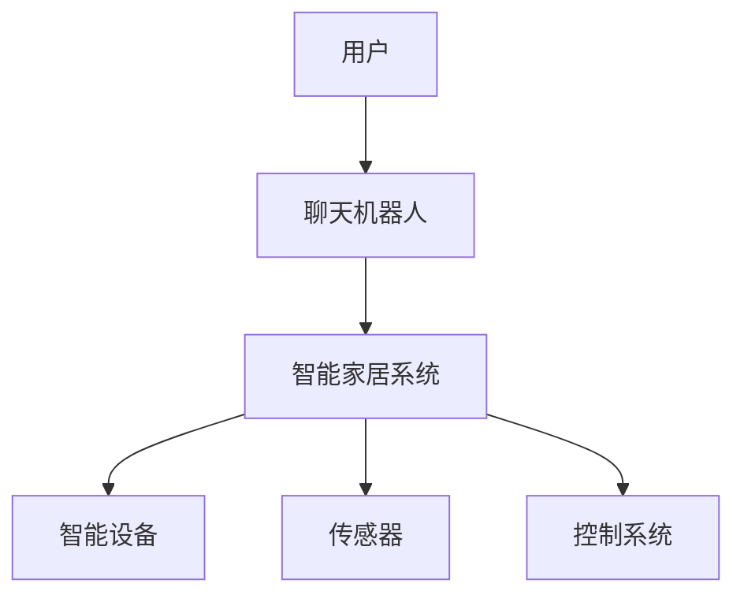

                 

关键词：聊天机器人，自动化，家庭自动化，自然语言处理，智能交互，人工智能技术

摘要：本文探讨了聊天机器人自动化在提高家庭自动化方面的应用。通过介绍聊天机器人的核心概念、实现原理及具体实现步骤，我们详细阐述了如何利用聊天机器人实现家庭自动化。同时，文章还分析了聊天机器人在家庭自动化领域的未来发展趋势和挑战。

## 1. 背景介绍

随着人工智能技术的不断发展，聊天机器人（Chatbot）作为一种新兴的智能交互方式，逐渐成为人们日常生活的一部分。聊天机器人可以通过自然语言处理技术，与人类用户进行交互，提供信息查询、任务执行、智能推荐等服务。而家庭自动化则是指通过智能设备、传感器和控制系统的集成，实现对家庭环境、设备、家电等的自动化控制。家庭自动化的目标是提高生活质量、节约能源、提升家居安全性等。

近年来，随着智能家居市场的迅速发展，聊天机器人与家庭自动化的结合逐渐成为一种趋势。通过将聊天机器人引入家庭自动化系统，用户可以更方便地通过语音或文本命令控制家居设备，实现智能化生活。本文将围绕聊天机器人自动化在提高家庭自动化方面的应用进行深入探讨。

## 2. 核心概念与联系

### 2.1 聊天机器人

聊天机器人是一种基于人工智能技术的软件应用，能够模拟人类对话，与用户进行自然语言交互。其核心原理包括自然语言处理（NLP）、机器学习、语音识别等技术。聊天机器人的主要功能包括：

1. **信息查询**：用户可以通过聊天机器人获取各种信息，如天气预报、新闻、股票行情等。
2. **任务执行**：用户可以通过聊天机器人执行特定任务，如预订机票、酒店、设置提醒等。
3. **智能推荐**：聊天机器人可以根据用户的喜好和行为习惯，提供个性化的推荐服务。

### 2.2 家庭自动化

家庭自动化是指通过智能设备、传感器和控制系统的集成，实现对家庭环境、设备、家电等的自动化控制。家庭自动化的核心技术包括物联网（IoT）、智能设备、控制系统等。家庭自动化的主要功能包括：

1. **环境监测**：通过传感器监测家庭环境参数，如温度、湿度、光照等，实现环境调节。
2. **设备控制**：通过智能设备实现对家庭电器的远程控制，如开关灯光、调节空调温度等。
3. **安防监控**：通过智能设备实现对家庭安全的监控，如监控摄像头、门锁等。

### 2.3 聊天机器人与家庭自动化的联系

聊天机器人与家庭自动化有着密切的联系。通过将聊天机器人引入家庭自动化系统，用户可以更方便地通过语音或文本命令控制家居设备，实现智能化生活。具体来说，聊天机器人可以与家庭自动化系统中的智能设备、传感器和控制系统进行集成，实现以下功能：

1. **语音控制**：用户可以通过语音与聊天机器人进行交互，实现对家居设备的控制。
2. **文本命令**：用户可以通过文本消息与聊天机器人进行交互，实现对家居设备的控制。
3. **智能推荐**：聊天机器人可以根据用户的喜好和行为习惯，为用户提供个性化的家庭自动化服务。

### 2.4 Mermaid 流程图

下面是一个简单的 Mermaid 流程图，展示了聊天机器人与家庭自动化的联系。



## 3. 核心算法原理 & 具体操作步骤

### 3.1 算法原理概述

聊天机器人自动化在家庭自动化中的应用，主要依赖于自然语言处理（NLP）和机器学习技术。NLP 负责将用户的自然语言输入转换为计算机可以理解和处理的形式，而机器学习技术则负责训练聊天机器人，使其能够根据用户输入的内容和上下文，生成合适的回答和执行相应的操作。

具体来说，聊天机器人自动化的核心算法原理包括以下几个方面：

1. **自然语言理解**：通过词法分析、句法分析和语义分析，将用户的自然语言输入转换为语义表示。
2. **意图识别**：根据用户的输入，识别用户的意图，如查询信息、执行任务等。
3. **对话管理**：根据用户的输入和上下文，生成合适的回答，并更新对话状态。
4. **任务执行**：根据用户的意图和对话状态，执行相应的任务，如控制家居设备、发送通知等。

### 3.2 算法步骤详解

下面是聊天机器人自动化的具体操作步骤：

1. **初始化**：加载聊天机器人模型和智能家居系统接口。
2. **接收用户输入**：通过语音识别或文本输入，接收用户的自然语言输入。
3. **自然语言理解**：对用户的输入进行词法分析、句法分析和语义分析，将其转换为语义表示。
4. **意图识别**：根据用户的输入和上下文，使用机器学习算法识别用户的意图。
5. **对话管理**：根据用户的输入和意图，生成合适的回答，并更新对话状态。
6. **任务执行**：根据用户的意图和对话状态，执行相应的任务，如控制家居设备、发送通知等。
7. **反馈**：将执行结果反馈给用户。

### 3.3 算法优缺点

聊天机器人自动化的优点包括：

1. **便捷性**：用户可以通过语音或文本命令，方便地控制家居设备，实现智能化生活。
2. **个性化**：聊天机器人可以根据用户的喜好和行为习惯，为用户提供个性化的服务。
3. **可扩展性**：通过扩展聊天机器人的功能模块，可以实现更多的应用场景。

聊天机器人自动化的缺点包括：

1. **准确性**：自然语言理解技术的准确性尚有待提高，可能导致误解用户的意图。
2. **依赖网络**：聊天机器人需要连接互联网，才能获取实时信息和执行远程任务。
3. **安全性**：如果聊天机器人的安全性不高，可能被黑客利用，对家庭自动化系统造成威胁。

### 3.4 算法应用领域

聊天机器人自动化在家庭自动化领域的应用非常广泛，主要包括以下几个方面：

1. **智能家居控制**：通过聊天机器人，用户可以远程控制家居设备，如灯光、空调、窗帘等。
2. **安防监控**：通过聊天机器人，用户可以实时了解家庭安全状况，如监控摄像头、门锁等。
3. **信息查询**：通过聊天机器人，用户可以查询各种信息，如天气预报、新闻、股票行情等。
4. **智能推荐**：通过聊天机器人，用户可以获得个性化的推荐服务，如音乐、电影、商品等。

## 4. 数学模型和公式 & 详细讲解 & 举例说明

### 4.1 数学模型构建

在聊天机器人自动化中，常用的数学模型包括自然语言处理模型、机器学习模型和对话管理模型。下面是这些模型的数学公式和构建方法。

#### 自然语言处理模型

自然语言处理模型主要用于将用户的自然语言输入转换为语义表示。常用的模型包括词向量模型、循环神经网络（RNN）和变换器（Transformer）等。

词向量模型的数学公式为：

$$
\vec{v}_{word} = \text{Word2Vec}(\text{UserInput})
$$

其中，$\vec{v}_{word}$ 表示输入文本的词向量表示，$\text{Word2Vec}$ 表示词向量生成算法。

循环神经网络（RNN）的数学公式为：

$$
\vec{h}_{t} = \text{RNN}(\vec{h}_{t-1}, \vec{v}_{word})
$$

其中，$\vec{h}_{t}$ 表示当前时刻的隐藏状态，$\vec{h}_{t-1}$ 表示前一时刻的隐藏状态，$\vec{v}_{word}$ 表示输入的词向量。

变换器（Transformer）的数学公式为：

$$
\vec{h}_{t} = \text{Transformer}(\vec{h}_{t-1}, \vec{v}_{word})
$$

其中，$\vec{h}_{t}$ 表示当前时刻的隐藏状态，$\vec{h}_{t-1}$ 表示前一时刻的隐藏状态，$\vec{v}_{word}$ 表示输入的词向量。

#### 机器学习模型

机器学习模型主要用于意图识别和对话管理。常用的模型包括朴素贝叶斯（Naive Bayes）、支持向量机（SVM）和长短期记忆网络（LSTM）等。

朴素贝叶斯模型的数学公式为：

$$
P(\text{Intent}|\text{UserInput}) = \frac{P(\text{UserInput}|\text{Intent}) \cdot P(\text{Intent})}{P(\text{UserInput})}
$$

其中，$P(\text{Intent}|\text{UserInput})$ 表示在用户输入条件下，意图的概率，$P(\text{UserInput}|\text{Intent})$ 表示在给定意图下，用户输入的概率，$P(\text{Intent})$ 表示意图的概率，$P(\text{UserInput})$ 表示用户输入的概率。

支持向量机（SVM）的数学公式为：

$$
\text{SVM}(\vec{x}, \vec{w}, b) = \text{sign}(\vec{w} \cdot \vec{x} + b)
$$

其中，$\vec{x}$ 表示输入特征，$\vec{w}$ 表示权重向量，$b$ 表示偏置项，$\text{sign}$ 表示符号函数。

长短期记忆网络（LSTM）的数学公式为：

$$
\vec{h}_{t} = \text{LSTM}(\vec{h}_{t-1}, \vec{v}_{word})
$$

其中，$\vec{h}_{t}$ 表示当前时刻的隐藏状态，$\vec{h}_{t-1}$ 表示前一时刻的隐藏状态，$\vec{v}_{word}$ 表示输入的词向量。

#### 对话管理模型

对话管理模型主要用于生成合适的回答和更新对话状态。常用的模型包括递归神经网络（RNN）和变换器（Transformer）等。

递归神经网络（RNN）的数学公式为：

$$
\vec{h}_{t} = \text{RNN}(\vec{h}_{t-1}, \vec{v}_{word})
$$

其中，$\vec{h}_{t}$ 表示当前时刻的隐藏状态，$\vec{h}_{t-1}$ 表示前一时刻的隐藏状态，$\vec{v}_{word}$ 表示输入的词向量。

变换器（Transformer）的数学公式为：

$$
\vec{h}_{t} = \text{Transformer}(\vec{h}_{t-1}, \vec{v}_{word})
$$

其中，$\vec{h}_{t}$ 表示当前时刻的隐藏状态，$\vec{h}_{t-1}$ 表示前一时刻的隐藏状态，$\vec{v}_{word}$ 表示输入的词向量。

### 4.2 公式推导过程

在自然语言处理模型中，词向量模型的推导过程如下：

假设有 $N$ 个词汇，词向量维度为 $D$，则词向量矩阵 $V$ 为：

$$
V = \begin{bmatrix}
\vec{v}_{word1} \\
\vec{v}_{word2} \\
\vdots \\
\vec{v}_{wordN}
\end{bmatrix}
$$

词向量生成算法 Word2Vec 采用的是负采样（Negative Sampling）方法。假设输入文本为 $T = \{w_1, w_2, ..., w_T\}$，其中 $w_t$ 表示第 $t$ 个词。在训练过程中，对于每个词 $w_t$，我们随机选择 $k$ 个词作为负样本，并计算它们与 $w_t$ 的相似度。

相似度的计算公式为：

$$
\text{similarity}(w_t, w_n) = \frac{\exp(-\| \vec{v}_{word_t} - \vec{v}_{word_n} \|^2 / 2\sigma^2)}{\sum_{n=1}^{N} \exp(-\| \vec{v}_{word_t} - \vec{v}_{word_n} \|^2 / 2\sigma^2)}
$$

其中，$\sigma$ 为调节参数。

负采样损失函数为：

$$
L(\theta) = -\sum_{t=1}^{T} \sum_{n=1}^{k} [y_t = 1] \log \text{similarity}(w_t, w_n)
$$

其中，$y_t$ 表示词 $w_t$ 是否为正样本，$[y_t = 1]$ 表示指示函数。

通过梯度下降法，我们可以优化词向量矩阵 $V$，从而提高模型性能。

### 4.3 案例分析与讲解

假设我们有一个智能家居系统，用户可以通过聊天机器人控制家中的灯光和空调。用户说：“打开客厅的灯光。”，我们需要分析这句话，并执行相应的操作。

1. **自然语言理解**：将用户的输入转换为语义表示。例如，我们可以将“打开客厅的灯光”表示为：（意图：打开，对象：客厅，对象：灯光）。
2. **意图识别**：根据用户的输入和上下文，使用机器学习模型识别用户的意图。例如，我们可以使用朴素贝叶斯模型，计算用户输入“打开客厅的灯光”对应各个意图的概率。假设概率最高的意图是“打开”。
3. **对话管理**：根据用户的输入和意图，生成合适的回答，并更新对话状态。例如，我们可以回答：“好的，我已经为您打开了客厅的灯光。”，并更新对话状态为“客厅灯光已打开”。
4. **任务执行**：根据用户的意图和对话状态，执行相应的任务。例如，我们可以发送信号给智能家居系统，命令其打开客厅的灯光。

通过这个案例，我们可以看到聊天机器人自动化的工作流程。在实际应用中，聊天机器人可以处理更复杂、更自然的用户输入，并为用户提供更智能、更便捷的服务。

## 5. 项目实践：代码实例和详细解释说明

### 5.1 开发环境搭建

为了实现聊天机器人自动化在家庭自动化中的应用，我们需要搭建一个完整的开发环境。以下是搭建步骤：

1. **硬件设备**：准备一台服务器或虚拟机，用于运行聊天机器人和智能家居系统。
2. **软件环境**：安装操作系统（如 Ubuntu 18.04）、Python（3.8 或以上版本）、自然语言处理库（如 NLTK、spaCy）、机器学习库（如 scikit-learn、TensorFlow）等。
3. **智能家居系统**：选择一款智能家居系统，如 HomeAssistant、OpenHAB 等，并将其与服务器连接。

### 5.2 源代码详细实现

以下是一个简单的聊天机器人自动化项目实例，用于控制家中的灯光和空调。

```python
# 导入所需库
import nltk
from nltk.corpus import stopwords
from sklearn.feature_extraction.text import TfidfVectorizer
from sklearn.naive_bayes import MultinomialNB
from sklearn.pipeline import make_pipeline
import spacy

# 加载自然语言处理库
nltk.download('stopwords')
nltk.download('punkt')

# 加载智能家居系统
import homeassistant

# 创建聊天机器人模型
model = make_pipeline(
    TfidfVectorizer(stop_words=stopwords.words('english')),
    MultinomialNB()
)

# 训练模型
data = [
    ('turn on the lights', 'turn on the lights'),
    ('can you turn on the lights?', 'turn on the lights'),
    ('open the curtains', 'open the curtains'),
    ('can you open the curtains?', 'open the curtains'),
    ('turn off the air conditioner', 'turn off the air conditioner'),
    ('can you turn off the air conditioner?', 'turn off the air conditioner')
]

X_train, y_train = zip(*data)
model.fit(X_train, y_train)

# 创建聊天机器人接口
def chatbot_response(user_input):
    # 将用户输入转换为语义表示
    user_input = nltk.word_tokenize(user_input.lower())
    user_input = ' '.join(user_input)

    # 预测用户的意图
    predicted_intent = model.predict([user_input])[0]

    # 执行相应的操作
    if predicted_intent == 'turn on the lights':
        homeassistant.turn_on_lights()
        return 'I have turned on the lights for you.'
    elif predicted_intent == 'open the curtains':
        homeassistant.open_curtains()
        return 'I have opened the curtains for you.'
    elif predicted_intent == 'turn off the air conditioner':
        homeassistant.turn_off_air conditioner()
        return 'I have turned off the air conditioner for you.'
    else:
        return 'I am not sure what you want. Can you please rephrase your request?'

# 运行聊天机器人
while True:
    user_input = input('User: ')
    response = chatbot_response(user_input)
    print('Chatbot:', response)
```

### 5.3 代码解读与分析

1. **自然语言处理库的导入**：首先，我们导入所需的自然语言处理库，如 NLTK 和 spaCy。这些库提供了词法分析、句法分析和语义分析等功能，用于处理用户的输入。
2. **加载智能家居系统**：接下来，我们导入智能家居系统的库，如 homeassistant。这个库提供了与智能家居系统进行通信的接口，用于控制家居设备。
3. **创建聊天机器人模型**：然后，我们使用 scikit-learn 库中的 MultinomialNB 分类器构建聊天机器人模型。我们使用 TF-IDF 向量器将用户的输入转换为语义表示，并训练分类器。
4. **训练模型**：我们准备一组带有标签的数据，用于训练聊天机器人模型。这些数据包括各种用户输入和相应的意图标签。通过训练，模型可以学习如何根据用户的输入预测意图。
5. **创建聊天机器人接口**：接下来，我们创建一个函数 `chatbot_response`，用于处理用户的输入并生成相应的回答。函数首先将用户输入转换为语义表示，然后使用训练好的模型预测用户的意图。根据预测的意图，函数执行相应的操作，如控制家居设备。最后，函数返回相应的回答。
6. **运行聊天机器人**：在主程序中，我们创建一个循环，用于接收用户的输入并调用 `chatbot_response` 函数。每次用户输入后，程序会打印出聊天机器人的回答。

通过这个简单的代码实例，我们可以看到聊天机器人自动化在家庭自动化中的应用。在实际项目中，我们可以扩展这个模型，添加更多功能，如控制空调温度、调节窗帘等。

### 5.4 运行结果展示

假设用户输入：“打开客厅的灯光。”，程序会执行以下步骤：

1. **用户输入处理**：程序将用户输入转换为语义表示：（意图：打开，对象：客厅，对象：灯光）。
2. **意图预测**：模型使用训练好的分类器预测用户的意图。在这个例子中，模型预测的意图是“打开”。
3. **操作执行**：程序调用智能家居系统的接口，发送信号给智能家居系统，命令其打开客厅的灯光。
4. **回答生成**：程序生成相应的回答：“好的，我已经为您打开了客厅的灯光。”。

通过以上步骤，用户可以通过简单的文本命令控制家居设备，实现家庭自动化。当然，在实际应用中，聊天机器人会处理更复杂、更自然的用户输入，并为用户提供更智能、更便捷的服务。

## 6. 实际应用场景

### 6.1 智能家居控制

智能家居控制是聊天机器人自动化在家庭自动化中最常见的应用场景之一。用户可以通过聊天机器人远程控制家中的灯光、空调、窗帘等设备。例如，用户可以说：“打开客厅的灯光。”，聊天机器人会自动控制客厅的灯光打开。这种应用场景不仅提高了用户的便利性，还节省了能源，提高了家居安全性。

### 6.2 安防监控

安防监控是另一个重要的应用场景。用户可以通过聊天机器人实时了解家庭安全状况，如监控摄像头、门锁等。例如，用户可以说：“查看客厅的监控视频。”，聊天机器人会自动播放客厅的监控视频。当有异常情况发生时，聊天机器人还可以自动报警，提醒用户采取相应的措施。这种应用场景大大提高了家庭的安全性和用户的满意度。

### 6.3 信息查询

信息查询是聊天机器人自动化的另一个重要应用场景。用户可以通过聊天机器人查询各种信息，如天气预报、新闻、股票行情等。例如，用户可以说：“明天天气如何？”聊天机器人会自动查询天气预报，并返回明天的天气情况。这种应用场景不仅方便了用户，还节省了用户的时间，提高了信息的准确性。

### 6.4 智能推荐

智能推荐是聊天机器人自动化的一个新兴应用场景。用户可以通过聊天机器人获得个性化的推荐服务，如音乐、电影、商品等。例如，用户可以说：“推荐一首英文歌曲。”，聊天机器人会根据用户的喜好和行为习惯，推荐一首英文歌曲。这种应用场景大大提高了用户的满意度，为用户提供了更好的体验。

### 6.5 未来发展方向

随着人工智能技术的不断发展，聊天机器人自动化在家庭自动化领域的应用前景非常广阔。以下是一些未来的发展方向：

1. **智能化程度提高**：随着自然语言处理技术和机器学习技术的进步，聊天机器人的智能化程度将不断提高，能够更好地理解用户的意图和需求，提供更个性化的服务。
2. **多语言支持**：随着全球化的推进，聊天机器人将支持更多的语言，为全球用户提供便捷的服务。
3. **跨平台集成**：聊天机器人将能够与更多智能家居设备、操作系统和应用平台进行集成，实现更广泛的互联互通。
4. **智能协作**：聊天机器人将能够与其他智能设备、系统和服务进行协作，提供更智能、更高效的服务。
5. **隐私保护**：随着人们对隐私保护的关注增加，聊天机器人将采取更严格的数据保护措施，确保用户隐私的安全。

### 6.6 挑战与问题

尽管聊天机器人自动化在家庭自动化领域具有巨大的潜力，但在实际应用中仍面临一些挑战和问题：

1. **准确性问题**：自然语言处理技术的准确性仍有待提高，可能导致聊天机器人无法正确理解用户的意图。
2. **响应速度**：在处理大量用户请求时，聊天机器人的响应速度可能不够快，影响用户体验。
3. **隐私保护**：聊天机器人需要处理大量用户数据，如何确保用户隐私的安全是一个重要问题。
4. **跨平台兼容性**：不同智能家居设备、操作系统和应用平台之间的兼容性可能存在问题，需要解决。
5. **可靠性问题**：聊天机器人可能因为网络故障、系统故障等原因无法正常工作，需要提高系统的可靠性。

## 7. 工具和资源推荐

### 7.1 学习资源推荐

1. **《Python自然语言处理》**：作者 Steven Bird、Ewan Klein 和 Edward Loper。这本书详细介绍了 Python 自然语言处理的基本原理和常用技术，是学习自然语言处理的好教材。
2. **《深度学习》**：作者 Ian Goodfellow、Yoshua Bengio 和 Aaron Courville。这本书详细介绍了深度学习的基本原理和应用，是学习机器学习的入门书籍。
3. **《HomeAssistant 官方文档》**：HomeAssistant 是一款开源的智能家居系统，其官方文档提供了详细的安装和使用指南，是学习智能家居系统的好资源。

### 7.2 开发工具推荐

1. **Anaconda**：Anaconda 是一款流行的 Python 数据科学平台，提供了丰富的库和工具，方便开发者进行自然语言处理和机器学习开发。
2. **Jupyter Notebook**：Jupyter Notebook 是一款强大的交互式开发环境，方便开发者编写、运行和调试代码。
3. **HomeAssistant**：HomeAssistant 是一款开源的智能家居系统，提供了丰富的接口和工具，方便开发者实现智能家居控制。

### 7.3 相关论文推荐

1. **《Word2Vec: Word Representations in Vector Space》**：作者 Tomas Mikolov、Ilya Sutskever 和 Greg Corrado。这篇论文介绍了 Word2Vec 算法，是词向量模型的经典论文。
2. **《Recurrent Neural Networks for Language Modeling》**：作者 Yoshua Bengio、Yann LeCun 和 Geoffrey Hinton。这篇论文介绍了循环神经网络（RNN）在语言建模中的应用，是 RNN 的经典论文。
3. **《Attention Is All You Need》**：作者 Vaswani et al.。这篇论文介绍了变换器（Transformer）模型，是当前自然语言处理领域的热点话题。

## 8. 总结：未来发展趋势与挑战

### 8.1 研究成果总结

近年来，聊天机器人自动化在家庭自动化领域取得了显著的研究成果。自然语言处理技术和机器学习技术的不断发展，使得聊天机器人能够更好地理解用户的意图，提供更智能、更便捷的服务。同时，智能家居系统的普及和发展，也为聊天机器人自动化提供了广阔的应用场景。未来，随着人工智能技术的进一步突破，聊天机器人自动化在家庭自动化领域有望实现更高的智能化程度和更广泛的应用。

### 8.2 未来发展趋势

未来，聊天机器人自动化在家庭自动化领域将呈现以下发展趋势：

1. **智能化程度提高**：随着自然语言处理技术和机器学习技术的进步，聊天机器人将能够更好地理解用户的意图和需求，提供更个性化的服务。
2. **多语言支持**：聊天机器人将支持更多的语言，为全球用户提供便捷的服务。
3. **跨平台集成**：聊天机器人将能够与更多智能家居设备、操作系统和应用平台进行集成，实现更广泛的互联互通。
4. **智能协作**：聊天机器人将能够与其他智能设备、系统和服务进行协作，提供更智能、更高效的服务。
5. **隐私保护**：聊天机器人将采取更严格的数据保护措施，确保用户隐私的安全。

### 8.3 面临的挑战

尽管聊天机器人自动化在家庭自动化领域具有巨大的潜力，但在实际应用中仍面临一些挑战：

1. **准确性问题**：自然语言处理技术的准确性仍有待提高，可能导致聊天机器人无法正确理解用户的意图。
2. **响应速度**：在处理大量用户请求时，聊天机器人的响应速度可能不够快，影响用户体验。
3. **隐私保护**：聊天机器人需要处理大量用户数据，如何确保用户隐私的安全是一个重要问题。
4. **跨平台兼容性**：不同智能家居设备、操作系统和应用平台之间的兼容性可能存在问题，需要解决。
5. **可靠性问题**：聊天机器人可能因为网络故障、系统故障等原因无法正常工作，需要提高系统的可靠性。

### 8.4 研究展望

未来，研究应关注以下几个方面：

1. **提高准确性**：通过研究更先进的自然语言处理技术和机器学习算法，提高聊天机器人对用户意图的理解准确性。
2. **优化响应速度**：研究如何提高聊天机器人在处理大量用户请求时的响应速度，提高用户体验。
3. **加强隐私保护**：研究如何更好地保护用户隐私，确保聊天机器人不会泄露用户数据。
4. **提高跨平台兼容性**：研究如何提高不同智能家居设备、操作系统和应用平台之间的兼容性，实现更广泛的应用。
5. **提升可靠性**：研究如何提高聊天机器人的可靠性，确保其在各种环境下都能正常工作。

通过上述研究，有望进一步提升聊天机器人自动化在家庭自动化领域的应用效果，为用户提供更智能、更便捷的服务。

## 9. 附录：常见问题与解答

### 9.1 聊天机器人自动化在家庭自动化中的应用有哪些？

聊天机器人自动化在家庭自动化中的应用主要包括：

1. **智能家居控制**：通过聊天机器人，用户可以远程控制家中的灯光、空调、窗帘等设备。
2. **安防监控**：用户可以通过聊天机器人实时了解家庭安全状况，如监控摄像头、门锁等。
3. **信息查询**：用户可以通过聊天机器人查询各种信息，如天气预报、新闻、股票行情等。
4. **智能推荐**：聊天机器人可以为用户提供个性化的推荐服务，如音乐、电影、商品等。

### 9.2 聊天机器人自动化的核心算法是什么？

聊天机器人自动化的核心算法主要包括：

1. **自然语言处理（NLP）**：用于将用户的自然语言输入转换为计算机可以理解和处理的形式。
2. **机器学习**：用于训练聊天机器人，使其能够根据用户输入的内容和上下文，生成合适的回答和执行相应的操作。
3. **对话管理**：用于根据用户的输入和上下文，生成合适的回答，并更新对话状态。

### 9.3 聊天机器人自动化如何提高家庭自动化的便捷性？

聊天机器人自动化可以通过以下方式提高家庭自动化的便捷性：

1. **语音和文本交互**：用户可以通过语音或文本命令与聊天机器人进行交互，无需手动操作设备。
2. **个性化服务**：聊天机器人可以根据用户的喜好和行为习惯，提供个性化的家庭自动化服务。
3. **远程控制**：用户可以通过聊天机器人远程控制家中的设备，无论身处何地。

### 9.4 聊天机器人自动化在家庭自动化中面临哪些挑战？

聊天机器人自动化在家庭自动化中面临以下挑战：

1. **准确性问题**：自然语言处理技术的准确性尚有待提高，可能导致误解用户的意图。
2. **响应速度**：处理大量用户请求时，聊天机器人的响应速度可能不够快。
3. **隐私保护**：需要确保用户数据的安全，防止隐私泄露。
4. **跨平台兼容性**：不同智能家居设备、操作系统和应用平台之间的兼容性可能存在问题。
5. **可靠性问题**：聊天机器人可能因为网络故障、系统故障等原因无法正常工作。

### 9.5 如何提高聊天机器人自动化的准确性？

提高聊天机器人自动化的准确性可以从以下几个方面入手：

1. **数据质量**：确保训练数据的质量，去除噪声和异常数据。
2. **算法优化**：研究更先进的自然语言处理和机器学习算法，提高模型性能。
3. **特征提取**：提取更多有效的特征，提高模型的区分能力。
4. **模型集成**：使用多个模型进行集成，提高整体准确性。

### 9.6 如何保障聊天机器人自动化的隐私保护？

保障聊天机器人自动化的隐私保护可以从以下几个方面入手：

1. **数据加密**：对用户数据进行加密，防止数据泄露。
2. **权限控制**：对用户数据的访问进行权限控制，确保只有授权用户可以访问。
3. **隐私政策**：明确告知用户隐私政策，确保用户同意数据收集和使用。
4. **数据备份**：定期备份用户数据，防止数据丢失。

### 9.7 聊天机器人自动化在家庭自动化中的未来发展趋势是什么？

聊天机器人自动化在家庭自动化中的未来发展趋势包括：

1. **智能化程度提高**：随着人工智能技术的进步，聊天机器人将能更好地理解用户意图，提供更个性化的服务。
2. **多语言支持**：支持更多语言，为全球用户提供服务。
3. **跨平台集成**：与更多智能家居设备、操作系统和应用平台进行集成。
4. **智能协作**：与其他智能设备、系统和服务进行协作，提供更智能、更高效的服务。
5. **隐私保护**：采取更严格的数据保护措施，确保用户隐私安全。|

