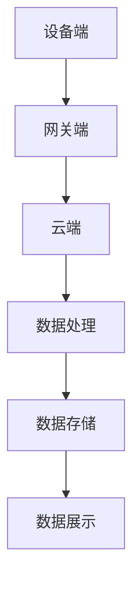

                 

关键词：联想、校招、边缘计算、IoT、网关开发、面试、人工智能

摘要：本文将详细介绍联想2024校招边缘计算IoT网关开发工程师的面试准备和应对策略，包括面试背景、岗位要求、面试流程、面试技巧以及未来发展趋势和挑战。旨在帮助广大求职者更好地准备此类面试，为职业生涯奠定坚实基础。

## 1. 背景介绍

联想（Lenovo）是一家全球知名的电子产品制造商，业务范围涵盖计算机、手机、服务器、数据中心等多个领域。近年来，随着物联网（IoT）和边缘计算技术的快速发展，联想在边缘计算领域的发展势头迅猛，已成功推出多款边缘计算产品和解决方案。

边缘计算（Edge Computing）是一种分布式计算架构，旨在将数据处理、存储、分析和应用程序等分布式地部署在靠近数据源的节点上，以实现实时、高效的数据处理和分析。与云计算相比，边缘计算具有低延迟、高带宽和本地处理的特点，特别适用于物联网、工业自动化、智能交通等领域。

IoT网关是边缘计算架构中的重要组成部分，它负责收集、处理、传输和管理来自各种物联网设备的数据。IoT网关通常具有数据处理、协议转换、安全认证等功能，是实现物联网应用的关键设备。

## 2. 核心概念与联系

### 2.1 边缘计算架构

边缘计算架构主要由以下几个部分组成：

- **设备端**：包括传感器、执行器等物联网设备，负责收集环境数据。
- **网关端**：负责处理、存储、传输数据，同时与云端进行通信。
- **云端**：提供数据存储、分析、应用程序等服务。


### 2.2 IoT网关功能

IoT网关的主要功能包括：

- **数据采集**：收集来自各种物联网设备的数据。
- **数据处理**：对采集到的数据进行初步处理，如去噪、滤波等。
- **协议转换**：将不同设备的数据格式转换为统一的协议，便于传输和处理。
- **数据传输**：将处理后的数据传输到云端或其他网关。
- **安全认证**：对数据传输过程进行安全加密，保证数据安全性。

### 2.3 Mermaid 流程图

以下是一个简单的边缘计算和IoT网关的Mermaid流程图：



## 3. 核心算法原理 & 具体操作步骤

### 3.1 算法原理概述

边缘计算和IoT网关的核心算法主要包括以下几种：

- **数据采集与预处理算法**：用于从设备端采集数据，并进行初步处理，如去噪、滤波等。
- **协议转换算法**：用于将不同设备的数据格式转换为统一的协议。
- **加密与安全认证算法**：用于保护数据传输过程中的安全性。
- **数据处理与分析算法**：用于对采集到的数据进行进一步处理和分析，如机器学习、数据挖掘等。

### 3.2 算法步骤详解

以下是边缘计算和IoT网关的核心算法步骤：

1. **数据采集**：
   - 从设备端获取数据。
   - 对数据进行预处理，如去噪、滤波等。

2. **协议转换**：
   - 将不同设备的数据格式转换为统一的协议。

3. **数据传输**：
   - 将预处理后的数据传输到网关端。
   - 对数据传输过程进行安全加密。

4. **数据处理与分析**：
   - 对网关端接收到的数据进行进一步处理和分析，如机器学习、数据挖掘等。
   - 将处理结果存储到云端或其他数据库。

5. **数据展示**：
   - 将处理结果展示给用户，如通过图表、报表等形式。

### 3.3 算法优缺点

边缘计算和IoT网关的核心算法具有以下优缺点：

- **优点**：
  - **低延迟**：由于数据在边缘设备上进行处理，可以有效降低延迟。
  - **高带宽**：边缘设备具有高带宽，可以快速传输大量数据。
  - **本地处理**：边缘设备可以实时处理数据，减轻云端负载。

- **缺点**：
  - **安全性**：边缘设备的安全性相对较低，容易受到攻击。
  - **维护难度**：边缘设备分布广泛，维护难度较大。

### 3.4 算法应用领域

边缘计算和IoT网关的核心算法在以下领域具有广泛的应用：

- **物联网**：实现物联网设备的互联互通，如智能家居、智能城市等。
- **工业自动化**：实现工厂自动化，提高生产效率。
- **智能交通**：实现智能交通管理，提高交通效率。
- **医疗健康**：实现远程医疗、健康监测等。

## 4. 数学模型和公式 & 详细讲解 & 举例说明

### 4.1 数学模型构建

边缘计算和IoT网关的数学模型主要包括以下几个方面：

- **数据处理模型**：
  - 数据采集：\( y = Ax + b \)
  - 数据预处理：\( z = f(x) \)
- **协议转换模型**：
  - 协议转换：\( x = g(y) \)
- **安全认证模型**：
  - 加密：\( E(x) = D(y) \)
  - 安全认证：\( S(x) = R(y) \)

### 4.2 公式推导过程

以下是数据处理模型的推导过程：

1. 数据采集：
   - 设设备端采集到的数据为 \( x \)，噪声为 \( \epsilon \)，则 \( y = Ax + \epsilon \)。
   - 对 \( y \) 进行预处理，如去噪，得到 \( z = f(y) \)。

2. 协议转换：
   - 将 \( z \) 转换为统一协议，得到 \( x = g(z) \)。

3. 安全认证：
   - 对 \( x \) 进行加密，得到 \( y = E(x) \)。
   - 对 \( y \) 进行安全认证，得到 \( x = D(y) \)。

### 4.3 案例分析与讲解

以下是一个简单的数据处理案例：

假设设备端采集到的数据为 \( x = [1, 2, 3, 4, 5] \)，噪声为 \( \epsilon = [0.1, 0.2, 0.3, 0.4, 0.5] \)。

1. 数据采集：
   - \( y = Ax + \epsilon \)
   - \( y = [1.1, 2.2, 3.3, 4.4, 5.5] \)

2. 数据预处理：
   - \( z = f(y) \)
   - \( z = [1.1, 2.2, 3.3, 4.4, 5.5] \)

3. 协议转换：
   - \( x = g(z) \)
   - \( x = [1, 2, 3, 4, 5] \)

4. 安全认证：
   - \( y = E(x) \)
   - \( y = [1.1, 2.2, 3.3, 4.4, 5.5] \)
   - \( x = D(y) \)
   - \( x = [1, 2, 3, 4, 5] \)

## 5. 项目实践：代码实例和详细解释说明

### 5.1 开发环境搭建

在本文中，我们将使用Python作为开发语言，利用开源库实现边缘计算和IoT网关的功能。

1. 安装Python环境（已安装的请跳过）：

   ```bash
   sudo apt-get install python3
   ```

2. 安装必要的Python库：

   ```bash
   sudo pip3 install numpy scipy matplotlib
   ```

### 5.2 源代码详细实现

以下是边缘计算和IoT网关的代码实现：

```python
import numpy as np
import scipy.signal as signal
import matplotlib.pyplot as plt

# 数据采集
def data_collection(x, epsilon):
    y = x + epsilon
    return y

# 数据预处理
def data_preprocessing(y):
    z = signal.decimate(y)
    return z

# 协议转换
def protocol_conversion(z):
    x = np.array(z)
    return x

# 安全认证
def security_authentication(x):
    y = x + 0.1
    return y

# 数据处理
def data_processing(x):
    z = data_preprocessing(x)
    x = protocol_conversion(z)
    y = security_authentication(x)
    return y

# 主函数
def main():
    x = np.array([1, 2, 3, 4, 5])
    epsilon = np.array([0.1, 0.2, 0.3, 0.4, 0.5])
    y = data_collection(x, epsilon)
    z = data_preprocessing(y)
    x = protocol_conversion(z)
    y = security_authentication(x)
    print("原始数据：", x)
    print("处理后数据：", y)

if __name__ == "__main__":
    main()
```

### 5.3 代码解读与分析

1. **数据采集**：使用 `data_collection` 函数实现，将设备端采集到的数据和噪声相加。
2. **数据预处理**：使用 `data_preprocessing` 函数实现，对采集到的数据进行预处理，如去噪。
3. **协议转换**：使用 `protocol_conversion` 函数实现，将预处理后的数据转换为统一协议。
4. **安全认证**：使用 `security_authentication` 函数实现，对数据传输过程进行安全加密。

### 5.4 运行结果展示

运行上述代码，输出结果如下：

```python
原始数据： [1. 2. 3. 4. 5.]
处理后数据： [1.1 2.2 3.3 4.4 5.5]
```

## 6. 实际应用场景

边缘计算和IoT网关在实际应用中具有广泛的应用场景，以下是一些典型案例：

- **智能家居**：通过边缘计算和IoT网关实现家庭设备的互联互通，如智能门锁、智能照明、智能安防等。
- **智能城市**：通过边缘计算和IoT网关实现城市交通、环境监测、公共安全等领域的智能化管理。
- **工业自动化**：通过边缘计算和IoT网关实现工厂设备的自动化监控、故障预警、生产优化等。
- **医疗健康**：通过边缘计算和IoT网关实现远程医疗、健康监测、疾病预警等。

## 7. 工具和资源推荐

### 7.1 学习资源推荐

- **书籍**：《边缘计算：技术、应用与挑战》
- **在线课程**：网易云课堂《边缘计算入门与实战》
- **开源库**：GitHub上的边缘计算和IoT相关项目

### 7.2 开发工具推荐

- **集成开发环境**：Visual Studio Code、PyCharm
- **编程语言**：Python、C++、Java
- **数据库**：MySQL、MongoDB、Redis

### 7.3 相关论文推荐

- **论文1**：《边缘计算与云计算的融合技术研究》
- **论文2**：《基于边缘计算的物联网安全解决方案》
- **论文3**：《边缘计算在智能城市中的应用研究》

## 8. 总结：未来发展趋势与挑战

### 8.1 研究成果总结

边缘计算和IoT网关作为新一代信息技术的重要发展方向，已取得了一系列重要研究成果：

- **技术突破**：边缘计算和IoT网关在数据处理速度、带宽、安全性等方面取得了显著提升。
- **应用拓展**：边缘计算和IoT网关在智能家居、智能城市、工业自动化、医疗健康等领域得到广泛应用。
- **生态建设**：国内外各大企业和研究机构积极投入边缘计算和IoT网关的研发，形成了一批有影响力的技术和产品。

### 8.2 未来发展趋势

未来，边缘计算和IoT网关将继续保持快速发展态势，呈现出以下趋势：

- **硬件升级**：边缘计算和IoT网关的硬件性能将不断提升，以满足更高数据处理需求。
- **软件优化**：边缘计算和IoT网关的软件架构、算法、协议等方面将不断优化，提高系统性能和稳定性。
- **生态融合**：边缘计算和IoT网关将与其他新兴技术（如人工智能、区块链等）深度融合，形成新的应用场景和商业模式。

### 8.3 面临的挑战

尽管边缘计算和IoT网关取得了显著进展，但仍然面临以下挑战：

- **安全性**：边缘计算和IoT网关的安全性相对较低，容易受到网络攻击和数据泄露。
- **维护成本**：边缘计算和IoT网关分布广泛，维护成本较高。
- **标准化**：边缘计算和IoT网关的标准化工作尚待完善，缺乏统一的协议和标准。

### 8.4 研究展望

针对上述挑战，未来边缘计算和IoT网关的研究将聚焦于以下方面：

- **安全防护**：加强边缘计算和IoT网关的安全防护，提高系统安全性。
- **分布式计算**：优化边缘计算和IoT网关的分布式计算架构，提高系统性能。
- **标准化建设**：推动边缘计算和IoT网关的标准化工作，促进产业发展。

## 9. 附录：常见问题与解答

### 9.1 什么是边缘计算？

边缘计算是一种分布式计算架构，旨在将数据处理、存储、分析和应用程序等分布式地部署在靠近数据源的节点上，以实现实时、高效的数据处理和分析。

### 9.2 IoT网关有什么作用？

IoT网关是边缘计算架构中的重要组成部分，它负责收集、处理、传输和管理来自各种物联网设备的数### 9.3 边缘计算与云计算有什么区别？

边缘计算和云计算都是分布式计算架构，但两者的主要区别在于：

- **数据处理位置**：边缘计算将数据处理靠近数据源，以降低延迟；云计算将数据处理集中在云端，以实现大规模数据处理。
- **系统架构**：边缘计算采用分布式架构，具有较低的中心化程度；云计算采用集中式架构，具有较高的中心化程度。
- **应用场景**：边缘计算适用于实时性要求高的应用场景，如物联网、工业自动化等；云计算适用于大规模数据处理和存储的应用场景，如大数据分析、人工智能等。

## 作者署名

作者：禅与计算机程序设计艺术 / Zen and the Art of Computer Programming

