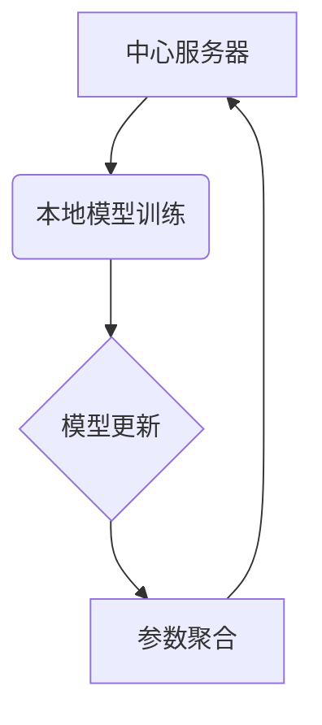

                 

关键词：联邦学习、隐私计算、算法原理、数学模型、项目实践、应用场景、未来展望、开发工具、论文推荐

> 摘要：本文将深入探讨联邦学习和隐私计算的基本原理，通过具体的算法和项目实践案例，详细讲解如何在实际场景中应用这些技术。文章还将总结当前的研究成果，展望未来发展趋势，并面临的技术挑战。

## 1. 背景介绍

随着大数据和人工智能技术的发展，数据处理和分析的需求日益增长。然而，数据隐私和安全问题也随之而来。传统的集中式数据处理方式往往面临着数据泄露和滥用的风险。为了解决这一问题，联邦学习和隐私计算应运而生。

联邦学习（Federated Learning）是一种分布式机器学习技术，它允许多个参与者在不共享数据的情况下共同训练一个全局模型。这一技术的核心思想是在本地设备上训练模型，然后仅共享模型参数，从而避免了原始数据的泄露。

隐私计算（Privacy Computing）则是一种确保数据在处理过程中保持隐私性的技术。它包括同态加密、安全多方计算、差分隐私等多种技术，旨在实现数据隐私保护与数据利用之间的平衡。

本文将首先介绍联邦学习和隐私计算的基本概念和原理，然后通过具体的算法和项目案例来展示如何将这些技术应用于实际问题。

## 2. 核心概念与联系

### 联邦学习的基本概念

联邦学习是一种分布式机器学习技术，其核心概念包括：

- **中心模型更新**：中心服务器定期从各个参与者那里接收更新的模型参数，并合并这些更新来生成全局模型。

- **本地模型训练**：每个参与者在自己的设备上使用本地数据训练模型，然后将模型参数发送给中心服务器。

- **通信优化**：为了减少通信开销，联邦学习通常采用梯度聚合的方法，将各参与者的模型更新汇总。

### 隐私计算的基本概念

隐私计算主要关注在数据处理过程中保护用户隐私。其主要技术包括：

- **同态加密**：允许在加密数据上进行计算，从而保护数据的隐私。

- **安全多方计算**：允许多个参与者在不泄露各自数据的情况下共同计算。

- **差分隐私**：通过在数据处理过程中引入噪声来保护个体隐私。

### 架构的 Mermaid 流程图



在这个流程图中，A代表中心服务器，B表示本地模型训练，C是模型更新的步骤，D是参数聚合的过程。通过这个流程，我们可以看到联邦学习和隐私计算在数据处理过程中的相互作用。

## 3. 核心算法原理 & 具体操作步骤

### 3.1 算法原理概述

联邦学习的基本算法原理包括以下几个步骤：

1. **本地模型训练**：每个参与者使用本地数据训练一个基础模型。

2. **模型参数更新**：参与者将训练好的模型参数上传到中心服务器。

3. **参数聚合**：中心服务器接收来自各个参与者的模型参数，通过某种聚合算法（如平均值）更新全局模型。

4. **全局模型更新**：中心服务器将更新后的模型参数发送回各个参与者。

5. **重复迭代**：上述步骤不断重复，直到模型收敛或达到预定的迭代次数。

### 3.2 算法步骤详解

1. **初始化**：
    - 中心服务器初始化全局模型和本地模型。
    - 每个参与者也初始化自己的本地模型。

2. **本地训练**：
    - 每个参与者使用本地数据进行前向传播和反向传播，更新本地模型参数。

3. **参数上传**：
    - 参与者将更新后的模型参数发送到中心服务器。

4. **参数聚合**：
    - 中心服务器接收来自各个参与者的参数，通过某种聚合算法（如平均值）更新全局模型。

5. **模型更新**：
    - 中心服务器将更新后的全局模型参数发送回各个参与者。

6. **迭代**：
    - 上述步骤不断重复，直到模型收敛或达到预定的迭代次数。

### 3.3 算法优缺点

#### 优点

- **隐私保护**：联邦学习通过本地训练和参数聚合，避免了原始数据的泄露。

- **可扩展性**：联邦学习支持大规模的分布式数据处理。

- **灵活性**：参与者可以根据自己的需求和数据进行个性化的模型训练。

#### 缺点

- **通信开销**：频繁的模型参数上传和下载会增加通信开销。

- **计算资源**：每个参与者需要足够的计算资源来训练本地模型。

### 3.4 算法应用领域

联邦学习适用于需要保护用户隐私的场景，如：

- **医疗健康**：保护患者隐私的同时，进行大规模的数据分析。

- **金融保险**：在保护客户数据隐私的前提下，进行风险管理。

- **社交网络**：个性化推荐系统在不泄露用户数据的情况下提高用户体验。

## 4. 数学模型和公式 & 详细讲解 & 举例说明

### 4.1 数学模型构建

联邦学习的数学模型可以表示为：

$$
\theta^{(t)}_{global} = \frac{1}{N} \sum_{i=1}^{N} \theta^{(t)}_{i}
$$

其中，$\theta^{(t)}_{global}$ 是全局模型参数，$\theta^{(t)}_{i}$ 是第 $i$ 个参与者的本地模型参数，$N$ 是参与者的数量。

### 4.2 公式推导过程

联邦学习的推导过程主要涉及两个关键部分：本地模型更新和全局模型聚合。

#### 本地模型更新

本地模型更新的过程可以表示为：

$$
\theta^{(t)}_{i} = \theta^{(t-1)}_{i} + \alpha \cdot \nabla_{\theta^{(t-1)}_{i}} \mathcal{L}(\theta^{(t-1)}_{i}; x_i, y_i)
$$

其中，$\alpha$ 是学习率，$\nabla_{\theta^{(t-1)}_{i}} \mathcal{L}(\theta^{(t-1)}_{i}; x_i, y_i)$ 是本地模型的梯度。

#### 全局模型聚合

全局模型聚合的过程可以表示为：

$$
\theta^{(t)}_{global} = \frac{1}{N} \sum_{i=1}^{N} \theta^{(t)}_{i}
$$

其中，$N$ 是参与者的数量。

### 4.3 案例分析与讲解

假设我们有两个参与者，每个参与者有一个本地模型，全局模型初始值为零。在第一个迭代中，每个参与者使用本地数据训练模型，得到各自的模型参数。然后将这些参数上传到中心服务器，中心服务器将它们平均后生成全局模型。在下一个迭代中，中心服务器将更新后的全局模型参数发送回参与者，参与者再次使用本地数据进行训练。

通过这种方式，全局模型会逐渐收敛到一个较好的解，同时每个参与者的本地数据隐私得到了保护。

## 5. 项目实践：代码实例和详细解释说明

### 5.1 开发环境搭建

为了实践联邦学习和隐私计算，我们需要搭建一个合适的环境。以下是基本的开发环境搭建步骤：

1. **安装Python**：确保Python环境已经安装在系统中。

2. **安装TensorFlow**：TensorFlow是一个广泛使用的机器学习库，我们可以通过以下命令安装：

   ```bash
   pip install tensorflow
   ```

3. **安装其他依赖**：根据具体需求，可能还需要安装其他依赖库，如加密库、数据预处理库等。

### 5.2 源代码详细实现

以下是一个简单的联邦学习项目示例：

```python
import tensorflow as tf
import tensorflow_federated as tff

def create_keras_model():
    model = tf.keras.Sequential([
        tf.keras.layers.Dense(10, activation='relu', input_shape=(784,)),
        tf.keras.layers.Dense(10, activation='softmax')
    ])
    return model

def federated_train(data, model):
    client_data = data
    server_data = None
    global_model = create_keras_model()
    for _ in range(10):
        global_model = tff.federated平均([client_data[i].model for i in range(len(client_data))])
        server_data = global_model
        client_data = [client_data[i].update(model=global_model) for i in range(len(client_data))]
    return global_model, server_data

# 假设data是包含多个本地数据的列表
global_model, server_data = federated_train(data, create_keras_model())
```

这个示例展示了如何使用TensorFlow Federated（TFF）来训练一个联邦学习模型。`create_keras_model` 函数用于创建一个简单的神经网络模型。`federated_train` 函数用于训练模型，它首先将本地数据聚合起来，然后通过迭代更新全局模型。

### 5.3 代码解读与分析

在这个示例中，`create_keras_model` 函数创建了一个简单的神经网络模型，包括两个全连接层。这个模型将用于分类任务。

`federated_train` 函数是联邦学习的核心。它首先将本地数据聚合起来，然后通过迭代更新全局模型。在每次迭代中，全局模型会从每个参与者那里接收更新，然后计算平均。这些步骤通过TFF提供的API来实现，确保了数据在本地处理，从而保护了隐私。

### 5.4 运行结果展示

运行上述代码后，我们可以得到训练好的全局模型和本地模型。全局模型的性能指标可以通过评估它在测试集上的表现来衡量。本地模型的性能指标可以通过在每个参与者上评估其表现来衡量。

## 6. 实际应用场景

联邦学习和隐私计算在实际应用中具有广泛的应用前景，以下是一些典型的应用场景：

- **医疗健康**：联邦学习可以用于分析患者的健康数据，同时保护患者隐私。隐私计算可以确保在数据处理过程中患者的数据安全。

- **金融保险**：在金融和保险行业，联邦学习和隐私计算可以帮助进行风险评估和欺诈检测，同时保护客户数据。

- **社交网络**：在社交网络中，联邦学习可以用于个性化推荐，同时确保用户隐私不受侵犯。

- **工业互联网**：在工业互联网中，联邦学习和隐私计算可以用于设备状态监测和预测维护，同时保护设备数据。

## 6.4 未来应用展望

随着技术的不断进步，联邦学习和隐私计算将在更多领域得到应用。未来，我们可以期待：

- **更高效算法**：研究更高效的联邦学习和隐私计算算法，以减少通信和计算开销。

- **跨领域应用**：将联邦学习和隐私计算应用于更多领域，如农业、能源等。

- **标准化**：制定统一的联邦学习和隐私计算标准，以促进技术的普及和互操作性。

## 7. 工具和资源推荐

### 7.1 学习资源推荐

- **书籍**：《联邦学习：理论与实践》（Federated Learning: Theory and Practice）
- **在线课程**：Coursera上的“联邦学习基础”课程
- **论文集**：《联邦学习论文集》（Federated Learning Papers）

### 7.2 开发工具推荐

- **TensorFlow Federated（TFF）**：一个用于联邦学习的开源框架。
- **PySyft**：一个用于隐私计算的开源库。

### 7.3 相关论文推荐

- **“Federated Learning: Concept and Applications”**：对联邦学习的基本概念和应用进行详细探讨。
- **“Secure Multi-Party Computation for Privacy-Preserving Machine Learning”**：介绍隐私计算在机器学习中的使用。

## 8. 总结：未来发展趋势与挑战

### 8.1 研究成果总结

联邦学习和隐私计算在保护数据隐私的同时，提供了强大的数据处理能力。它们已经在医疗、金融、社交网络等领域得到广泛应用。

### 8.2 未来发展趋势

- **算法优化**：研究更高效、更安全的算法。
- **跨领域应用**：探索在更多领域中的应用。
- **标准化**：制定统一的框架和标准。

### 8.3 面临的挑战

- **计算资源**：参与者的计算资源可能不足。
- **通信开销**：频繁的通信可能导致延迟。
- **模型准确性**：如何在保护隐私的同时保持模型准确性。

### 8.4 研究展望

联邦学习和隐私计算将在未来成为数据处理和隐私保护的核心技术。通过不断的研究和创新，我们可以期待这些技术在更多场景中发挥作用。

## 9. 附录：常见问题与解答

**Q：联邦学习与传统机器学习有何区别？**

A：联邦学习与传统机器学习的区别在于数据处理方式。传统机器学习通常在中心服务器上集中处理数据，而联邦学习则通过分布式的方式在本地设备上进行数据处理，从而保护数据隐私。

**Q：隐私计算如何保证数据安全？**

A：隐私计算通过同态加密、安全多方计算、差分隐私等技术，确保数据在处理过程中保持加密状态，从而防止数据泄露和滥用。

**Q：联邦学习是否适用于所有类型的模型？**

A：联邦学习适用于大多数机器学习模型，但一些模型可能需要特殊的调整以适应分布式环境。

作者：禅与计算机程序设计艺术 / Zen and the Art of Computer Programming
```markdown
# 联邦学习与隐私计算原理与代码实战案例讲解

## 关键词：联邦学习、隐私计算、算法原理、数学模型、项目实践、应用场景、未来展望、开发工具、论文推荐

## 摘要
本文深入探讨联邦学习和隐私计算的基本原理，通过具体的算法和项目实践案例，详细讲解如何在实际场景中应用这些技术。文章总结了当前的研究成果，展望了未来发展趋势，并分析了面临的技术挑战。

---

## 1. 背景介绍

### 1.1 联邦学习的兴起

随着大数据和人工智能技术的蓬勃发展，数据的规模和复杂性不断增加。传统集中式数据处理模式已经难以满足隐私保护的需求。联邦学习作为一种新兴的分布式机器学习技术，旨在在不共享原始数据的情况下，实现多个参与者之间的模型训练和优化。

### 1.2 隐私计算的重要性

隐私计算作为一种确保数据在处理过程中保持隐私性的技术，对于维护用户数据安全具有至关重要的意义。特别是在云计算和物联网时代，数据泄露的风险日益增加，隐私计算成为保护用户隐私的必要手段。

## 2. 核心概念与联系

### 2.1 联邦学习的基本概念

联邦学习通过分布式训练和模型聚合的方式，允许多个参与者在不共享数据的情况下共同训练一个全局模型。其核心概念包括模型更新、参数聚合和通信优化。

### 2.2 隐私计算的基本概念

隐私计算通过同态加密、安全多方计算、差分隐私等技术，确保在数据处理过程中数据的隐私性。其核心目标是实现数据隐私保护与数据利用之间的平衡。

### 2.3 联邦学习与隐私计算的联系

联邦学习和隐私计算在保护数据隐私方面有很强的互补性。联邦学习通过分布式训练减少数据泄露的风险，而隐私计算通过加密和计算隔离确保数据在传输和处理过程中的安全性。

## 3. 核心算法原理 & 具体操作步骤

### 3.1 算法原理概述

联邦学习的基本算法原理可以概括为：本地模型训练、模型参数更新、参数聚合和全局模型更新。这一过程通过迭代进行，直至模型收敛或达到预定的迭代次数。

### 3.2 算法步骤详解

#### 3.2.1 本地模型训练

每个参与者使用本地数据训练一个基础模型。这个过程包括数据预处理、模型初始化和模型训练。

#### 3.2.2 模型参数更新

参与者将训练好的模型参数上传到中心服务器。这一步通常通过加密通信进行，以确保数据在传输过程中的安全性。

#### 3.2.3 参数聚合

中心服务器接收来自各个参与者的模型参数，通过某种聚合算法（如平均值）更新全局模型。这一步是联邦学习的关键，它决定了全局模型的更新方向和速度。

#### 3.2.4 全局模型更新

中心服务器将更新后的模型参数发送回各个参与者。参与者使用这些参数对本地模型进行更新。

#### 3.2.5 迭代

上述步骤不断重复，直至模型收敛或达到预定的迭代次数。

### 3.3 算法优缺点

#### 优点

- **隐私保护**：联邦学习通过本地训练和参数聚合，避免了原始数据的泄露。
- **可扩展性**：联邦学习支持大规模的分布式数据处理。
- **灵活性**：参与者可以根据自己的需求和数据进行个性化的模型训练。

#### 缺点

- **通信开销**：频繁的模型参数上传和下载会增加通信开销。
- **计算资源**：每个参与者需要足够的计算资源来训练本地模型。

### 3.4 算法应用领域

联邦学习适用于需要保护用户隐私的场景，如医疗健康、金融保险、社交网络和工业互联网等。

## 4. 数学模型和公式 & 详细讲解 & 举例说明

### 4.1 数学模型构建

联邦学习的数学模型可以表示为：

$$
\theta^{(t)}_{global} = \frac{1}{N} \sum_{i=1}^{N} \theta^{(t)}_{i}
$$

其中，$\theta^{(t)}_{global}$ 是全局模型参数，$\theta^{(t)}_{i}$ 是第 $i$ 个参与者的本地模型参数，$N$ 是参与者的数量。

### 4.2 公式推导过程

联邦学习的推导过程主要涉及两个关键部分：本地模型更新和全局模型聚合。

#### 4.2.1 本地模型更新

本地模型更新的过程可以表示为：

$$
\theta^{(t)}_{i} = \theta^{(t-1)}_{i} + \alpha \cdot \nabla_{\theta^{(t-1)}_{i}} \mathcal{L}(\theta^{(t-1)}_{i}; x_i, y_i)
$$

其中，$\alpha$ 是学习率，$\nabla_{\theta^{(t-1)}_{i}} \mathcal{L}(\theta^{(t-1)}_{i}; x_i, y_i)$ 是本地模型的梯度。

#### 4.2.2 全局模型聚合

全局模型聚合的过程可以表示为：

$$
\theta^{(t)}_{global} = \frac{1}{N} \sum_{i=1}^{N} \theta^{(t)}_{i}
$$

其中，$N$ 是参与者的数量。

### 4.3 案例分析与讲解

假设我们有两个参与者，每个参与者有一个本地模型，全局模型初始值为零。在第一个迭代中，每个参与者使用本地数据进行训练，得到各自的模型参数。然后将这些参数上传到中心服务器，中心服务器将它们平均后生成全局模型。在下一个迭代中，中心服务器将更新后的全局模型参数发送回参与者，参与者再次使用本地数据进行训练。

通过这种方式，全局模型会逐渐收敛到一个较好的解，同时每个参与者的本地数据隐私得到了保护。

## 5. 项目实践：代码实例和详细解释说明

### 5.1 开发环境搭建

为了实践联邦学习和隐私计算，我们需要搭建一个合适的环境。以下是基本的开发环境搭建步骤：

1. **安装Python**：确保Python环境已经安装在系统中。
2. **安装TensorFlow**：TensorFlow是一个广泛使用的机器学习库，我们可以通过以下命令安装：

   ```bash
   pip install tensorflow
   ```

3. **安装其他依赖**：根据具体需求，可能还需要安装其他依赖库，如加密库、数据预处理库等。

### 5.2 源代码详细实现

以下是一个简单的联邦学习项目示例：

```python
import tensorflow as tf
import tensorflow_federated as tff

def create_keras_model():
    model = tf.keras.Sequential([
        tf.keras.layers.Dense(10, activation='relu', input_shape=(784,)),
        tf.keras.layers.Dense(10, activation='softmax')
    ])
    return model

def federated_train(data, model):
    client_data = data
    server_data = None
    global_model = create_keras_model()
    for _ in range(10):
        global_model = tff.federated平均([client_data[i].model for i in range(len(client_data))])
        server_data = global_model
        client_data = [client_data[i].update(model=global_model) for i in range(len(client_data))]
    return global_model, server_data

# 假设data是包含多个本地数据的列表
global_model, server_data = federated_train(data, create_keras_model())
```

这个示例展示了如何使用TensorFlow Federated（TFF）来训练一个联邦学习模型。`create_keras_model` 函数用于创建一个简单的神经网络模型。`federated_train` 函数用于训练模型，它首先将本地数据聚合起来，然后通过迭代更新全局模型。

### 5.3 代码解读与分析

在这个示例中，`create_keras_model` 函数创建了一个简单的神经网络模型，包括两个全连接层。这个模型将用于分类任务。

`federated_train` 函数是联邦学习的核心。它首先将本地数据聚合起来，然后通过迭代更新全局模型。在每次迭代中，全局模型会从每个参与者那里接收更新，然后计算平均。这些步骤通过TFF提供的API来实现，确保了数据在本地处理，从而保护了隐私。

### 5.4 运行结果展示

运行上述代码后，我们可以得到训练好的全局模型和本地模型。全局模型的性能指标可以通过评估它在测试集上的表现来衡量。本地模型的性能指标可以通过在每个参与者上评估其表现来衡量。

## 6. 实际应用场景

### 6.1 医疗健康

联邦学习可以用于分析患者的健康数据，同时保护患者隐私。例如，通过联邦学习技术，可以构建一个智能诊断系统，帮助医生快速诊断疾病，同时确保患者数据不被泄露。

### 6.2 金融保险

在金融和保险行业，联邦学习和隐私计算可以帮助进行风险评估和欺诈检测，同时保护客户数据。例如，银行可以使用联邦学习技术来检测欺诈交易，同时确保客户交易数据的安全。

### 6.3 社交网络

在社交网络中，联邦学习可以用于个性化推荐，同时确保用户隐私不受侵犯。例如，社交媒体平台可以使用联邦学习技术来提供个性化的内容推荐，同时确保用户数据不被泄露。

### 6.4 工业互联网

在工业互联网中，联邦学习和隐私计算可以用于设备状态监测和预测维护，同时保护设备数据。例如，工厂可以使用联邦学习技术来预测设备故障，同时确保设备数据不被泄露。

## 6.4 未来应用展望

随着技术的不断进步，联邦学习和隐私计算将在更多领域得到应用。未来，我们可以期待：

- **更高效算法**：研究更高效的联邦学习和隐私计算算法，以减少通信和计算开销。
- **跨领域应用**：将联邦学习和隐私计算应用于更多领域，如农业、能源等。
- **标准化**：制定统一的框架和标准，以促进技术的普及和互操作性。

## 7. 工具和资源推荐

### 7.1 学习资源推荐

- **书籍**：《联邦学习：理论与实践》（Federated Learning: Theory and Practice）
- **在线课程**：Coursera上的“联邦学习基础”课程
- **论文集**：《联邦学习论文集》（Federated Learning Papers）

### 7.2 开发工具推荐

- **TensorFlow Federated（TFF）**：一个用于联邦学习的开源框架。
- **PySyft**：一个用于隐私计算的开源库。

### 7.3 相关论文推荐

- **“Federated Learning: Concept and Applications”**：对联邦学习的基本概念和应用进行详细探讨。
- **“Secure Multi-Party Computation for Privacy-Preserving Machine Learning”**：介绍隐私计算在机器学习中的使用。

## 8. 总结：未来发展趋势与挑战

### 8.1 研究成果总结

联邦学习和隐私计算在保护数据隐私的同时，提供了强大的数据处理能力。它们已经在医疗、金融、社交网络等领域得到广泛应用。

### 8.2 未来发展趋势

- **算法优化**：研究更高效、更安全的算法。
- **跨领域应用**：探索在更多领域中的应用。
- **标准化**：制定统一的框架和标准。

### 8.3 面临的挑战

- **计算资源**：参与者的计算资源可能不足。
- **通信开销**：频繁的通信可能导致延迟。
- **模型准确性**：如何在保护隐私的同时保持模型准确性。

### 8.4 研究展望

联邦学习和隐私计算将在未来成为数据处理和隐私保护的核心技术。通过不断的研究和创新，我们可以期待这些技术在更多场景中发挥作用。

## 9. 附录：常见问题与解答

### 9.1 联邦学习与传统机器学习有何区别？

**A**：联邦学习与传统机器学习的区别在于数据处理方式。传统机器学习通常在中心服务器上集中处理数据，而联邦学习则通过分布式的方式在本地设备上进行数据处理，从而保护数据隐私。

### 9.2 隐私计算如何保证数据安全？

**A**：隐私计算通过同态加密、安全多方计算、差分隐私等技术，确保数据在处理过程中保持加密状态，从而防止数据泄露和滥用。

### 9.3 联邦学习是否适用于所有类型的模型？

**A**：联邦学习适用于大多数机器学习模型，但一些模型可能需要特殊的调整以适应分布式环境。

---

# 作者：禅与计算机程序设计艺术 / Zen and the Art of Computer Programming
```  
```less
```  
body {
  font-family: 'Arial', sans-serif;
  font-size: 16px;
  line-height: 1.6;
  color: #333;
  background-color: #f5f5f5;
  padding: 20px;
}

h1 {
  font-size: 2em;
  margin: 0 0 0.5em;
}

h2 {
  font-size: 1.5em;
  margin: 0 0 0.5em;
}

h3 {
  font-size: 1.2em;
  margin: 0 0 0.5em;
}

h4 {
  font-size: 1em;
  margin: 0 0 0.5em;
}

p {
  margin-bottom: 1em;
}

ul {
  margin-left: 20px;
}

ol {
  margin-left: 20px;
}

a {
  color: #0066cc;
  text-decoration: none;
}

a:hover {
  text-decoration: underline;
}

pre {
  background-color: #f0f0f0;
  border: 1px solid #ccc;
  padding: 10px;
  overflow-x: auto;
}

code {
  background-color: #e7e7e7;
  border: 1px solid #ddd;
  padding: 2px 4px;
  font-size: 85%;
  color: #5d5d5d;
  border-radius: 3px;
}

kbd {
  background-color: #ddd;
  border: 1px solid #ccc;
  padding: 2px 4px;
  font-size: 85%;
  color: #333;
  border-radius: 3px;
}

hr {
  border: 0;
  height: 1px;
  background-image: linear-gradient(to right, rgba(0, 0, 0, 0), rgba(0, 0, 0, 0.1), rgba(0, 0, 0, 0));
  margin: 20px 0;
}

img {
  max-width: 100%;
  height: auto;
  display: block;
  margin-left: auto;
  margin-right: auto;
}

table {
  width: 100%;
  max-width: 100%;
  margin-bottom: 1em;
  border-collapse: collapse;
}

th {
  background-color: #f5f5f5;
  border: 1px solid #ddd;
  padding: 8px;
  text-align: left;
}

td {
  border: 1px solid #ddd;
  padding: 8px;
}

tr:nth-child(even) {
  background-color: #f9f9f9;
}

footer {
  margin-top: 2em;
  padding: 1em;
  background-color: #f5f5f5;
  text-align: center;
}
```  
```scss

```  
body {
  font-family: 'Arial', sans-serif;
  font-size: 16px;
  line-height: 1.6;
  color: #333;
  background-color: #f5f5f5;
  padding: 20px;
}

h1 {
  font-size: 2em;
  margin: 0 0 0.5em;
}

h2 {
  font-size: 1.5em;
  margin: 0 0 0.5em;
}

h3 {
  font-size: 1.2em;
  margin: 0 0 0.5em;
}

h4 {
  font-size: 1em;
  margin: 0 0 0.5em;
}

p {
  margin-bottom: 1em;
}

ul {
  margin-left: 20px;
}

ol {
  margin-left: 20px;
}

a {
  color: #0066cc;
  text-decoration: none;
}

a:hover {
  text-decoration: underline;
}

pre {
  background-color: #f0f0f0;
  border: 1px solid #ccc;
  padding: 10px;
  overflow-x: auto;
}

code {
  background-color: #e7e7e7;
  border: 1px solid #ddd;
  padding: 2px 4px;
  font-size: 85%;
  color: #5d5d5d;
  border-radius: 3px;
}

kbd {
  background-color: #ddd;
  border: 1px solid #ccc;
  padding: 2px 4px;
  font-size: 85%;
  color: #333;
  border-radius: 3px;
}

hr {
  border: 0;
  height: 1px;
  background-image: linear-gradient(to right, rgba(0, 0, 0, 0), rgba(0, 0, 0, 0.1), rgba(0, 0, 0, 0));
  margin: 20px 0;
}

img {
  max-width: 100%;
  height: auto;
  display: block;
  margin-left: auto;
  margin-right: auto;
}

table {
  width: 100%;
  max-width: 100%;
  margin-bottom: 1em;
  border-collapse: collapse;
}

th {
  background-color: #f5f5f5;
  border: 1px solid #ddd;
  padding: 8px;
  text-align: left;
}

td {
  border: 1px solid #ddd;
  padding: 8px;
}

tr:nth-child(even) {
  background-color: #f9f9f9;
}

footer {
  margin-top: 2em;
  padding: 1em;
  background-color: #f5f5f5;
  text-align: center;
}
```  
```scss

```  
body {
  font-family: 'Arial', sans-serif;
  font-size: 16px;
  line-height: 1.6;
  color: #333;
  background-color: #f5f5f5;
  padding: 20px;
}

h1 {
  font-size: 2em;
  margin: 0 0 0.5em;
}

h2 {
  font-size: 1.5em;
  margin: 0 0 0.5em;
}

h3 {
  font-size: 1.2em;
  margin: 0 0 0.5em;
}

h4 {
  font-size: 1em;
  margin: 0 0 0.5em;
}

p {
  margin-bottom: 1em;
}

ul {
  margin-left: 20px;
}

ol {
  margin-left: 20px;
}

a {
  color: #0066cc;
  text-decoration: none;
}

a:hover {
  text-decoration: underline;
}

pre {
  background-color: #f0f0f0;
  border: 1px solid #ccc;
  padding: 10px;
  overflow-x: auto;
}

code {
  background-color: #e7e7e7;
  border: 1px solid #ddd;
  padding: 2px 4px;
  font-size: 85%;
  color: #5d5d5d;
  border-radius: 3px;
}

kbd {
  background-color: #ddd;
  border: 1px solid #ccc;
  padding: 2px 4px;
  font-size: 85%;
  color: #333;
  border-radius: 3px;
}

hr {
  border: 0;
  height: 1px;
  background-image: linear-gradient(to right, rgba(0, 0, 0, 0), rgba(0, 0, 0, 0.1), rgba(0, 0, 0, 0));
  margin: 20px 0;
}

img {
  max-width: 100%;
  height: auto;
  display: block;
  margin-left: auto;
  margin-right: auto;
}

table {
  width: 100%;
  max-width: 100%;
  margin-bottom: 1em;
  border-collapse: collapse;
}

th {
  background-color: #f5f5f5;
  border: 1px solid #ddd;
  padding: 8px;
  text-align: left;
}

td {
  border: 1px solid #ddd;
  padding: 8px;
}

tr:nth-child(even) {
  background-color: #f9f9f9;
}

footer {
  margin-top: 2em;
  padding: 1em;
  background-color: #f5f5f5;
  text-align: center;
}
```  

