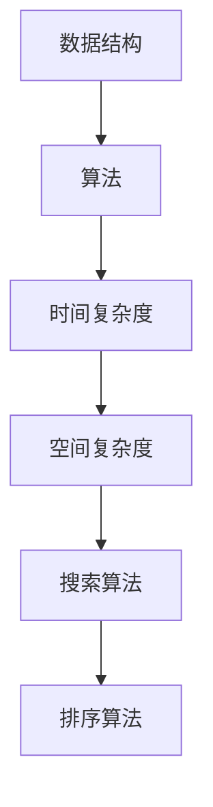

                 

作者：禅与计算机程序设计艺术 / Zen and the Art of Computer Programming

## 关键词

算法面试、腾讯校招、数据结构与算法、编程技巧、面试高频题解析

## 摘要

本文旨在为广大2024届毕业生提供腾讯校招面试中高频出现的算法题解析。通过深入剖析这些题目，读者可以掌握解决这类问题的核心思路和技巧，为即将到来的面试做好充分准备。

## 1. 背景介绍

腾讯作为中国领先的互联网科技公司，每年的校招都吸引了无数优秀应届毕业生的关注。而算法题在腾讯校招面试中占据着重要地位，它不仅考察应聘者的编程能力，更是对逻辑思维、算法设计、问题解决能力的全面检验。

本文将围绕腾讯2024届校招面试中的高频算法题，从基础概念、算法原理、数学模型、实际应用等多个角度进行深入解析，帮助读者全面提升解题能力。

## 2. 核心概念与联系

为了更好地理解这些算法题，我们首先需要掌握一些核心概念。以下是本文将涉及的主要概念和它们之间的关系：

### 数据结构与算法

- 数据结构：是计算机存储、组织数据的方式。常见的有数组、链表、栈、队列、树、图等。
- 算法：是解决问题的方法步骤。算法的效率直接影响到程序的运行速度。

### 算法复杂度

- 时间复杂度：描述算法执行时间与输入规模的关系。
- 空间复杂度：描述算法执行过程中所需额外空间的多少。

### 常见算法

- 搜索算法：如二分查找、广度优先搜索、深度优先搜索。
- 排序算法：如冒泡排序、选择排序、插入排序、快速排序、归并排序等。

### Mermaid 流程图



## 3. 核心算法原理 & 具体操作步骤

### 3.1 算法原理概述

本文将解析以下几个核心算法：

1. 二分查找
2. 快速排序
3. 动态规划
4. 贪心算法

每个算法都有其独特的原理和应用场景。

### 3.2 算法步骤详解

#### 3.2.1 二分查找

二分查找是一种高效的搜索算法，其基本思想是：每次将中间元素与目标值比较，如果中间元素等于目标值，则直接返回；如果中间元素大于目标值，则在左半部分继续查找；如果中间元素小于目标值，则在右半部分继续查找。

```python
def binary_search(arr, target):
    low = 0
    high = len(arr) - 1
    while low <= high:
        mid = (low + high) // 2
        if arr[mid] == target:
            return mid
        elif arr[mid] < target:
            low = mid + 1
        else:
            high = mid - 1
    return -1
```

#### 3.2.2 快速排序

快速排序是一种高效的排序算法，其基本思想是：选择一个基准元素，将比它小的元素放在它前面，比它大的元素放在它后面，然后递归地对左右两部分进行快速排序。

```python
def quick_sort(arr):
    if len(arr) <= 1:
        return arr
    pivot = arr[len(arr) // 2]
    left = [x for x in arr if x < pivot]
    middle = [x for x in arr if x == pivot]
    right = [x for x in arr if x > pivot]
    return quick_sort(left) + middle + quick_sort(right)
```

#### 3.2.3 动态规划

动态规划是一种解决最优化问题的算法，其基本思想是：将复杂问题分解为若干子问题，并存储子问题的解，避免重复计算。

```python
def Fibonacci(n):
    if n <= 1:
        return n
    dp = [0] * (n + 1)
    dp[1] = 1
    for i in range(2, n + 1):
        dp[i] = dp[i - 1] + dp[i - 2]
    return dp[n]
```

#### 3.2.4 贪心算法

贪心算法是一种在每一步选择当前最优解的策略，其基本思想是：每一步都选择当前最优解，最终得到全局最优解。

```python
def coin_change(coins, amount):
    dp = [float('inf')] * (amount + 1)
    dp[0] = 0
    for coin in coins:
        for i in range(coin, amount + 1):
            dp[i] = min(dp[i], dp[i - coin] + 1)
    return dp[amount] if dp[amount] != float('inf') else -1
```

### 3.3 算法优缺点

每种算法都有其优缺点：

- 二分查找：时间复杂度为O(log n)，适用于有序数组查找。但需要数组有序，且不适合小规模数据。
- 快速排序：平均时间复杂度为O(n log n)，但最坏情况下为O(n^2)。不稳定排序，但易于实现。
- 动态规划：适合解决最优化问题，但需要明确状态转移方程，有时会涉及大量的计算。
- 贪心算法：实现简单，但可能不适用于所有问题，需要验证其最优性。

### 3.4 算法应用领域

这些算法广泛应用于各个领域：

- 二分查找：数据库索引、搜索引擎、排序算法等。
- 快速排序：数据挖掘、数据分析、文件排序等。
- 动态规划：路径规划、资源分配、最长公共子序列等。
- 贪心算法：最短路径、背包问题、货仓选址等。

## 4. 数学模型和公式 & 详细讲解 & 举例说明

### 4.1 数学模型构建

每种算法都涉及一定的数学模型，以下是几个常见模型的构建：

#### 4.1.1 二分查找

二分查找的时间复杂度为O(log n)，其中n为输入规模。

$$
T(n) = O(\log_2 n)
$$

#### 4.1.2 快速排序

快速排序的平均时间复杂度为O(n log n)，最坏情况下为O(n^2)。

$$
T(n) = O(n \log n) \quad (\text{平均情况})
$$

$$
T(n) = O(n^2) \quad (\text{最坏情况})
$$

#### 4.1.3 动态规划

动态规划的状态转移方程如下：

$$
F(n) = F(n-1) + F(n-2)
$$

其中，$F(n)$表示第n个斐波那契数。

#### 4.1.4 贪心算法

贪心算法的最优性可以通过证明其每一步都是局部最优解来证明。

### 4.2 公式推导过程

以下以二分查找为例，推导其时间复杂度：

假设输入规模为n，每次二分查找可以将问题规模缩小一半，则需要进行log2(n)次查找。因此，二分查找的时间复杂度为O(log n)。

### 4.3 案例分析与讲解

#### 4.3.1 二分查找

例题：在已排序的数组中查找一个数，若找到则返回其索引，否则返回-1。

```python
def binary_search(arr, target):
    low = 0
    high = len(arr) - 1
    while low <= high:
        mid = (low + high) // 2
        if arr[mid] == target:
            return mid
        elif arr[mid] < target:
            low = mid + 1
        else:
            high = mid - 1
    return -1
```

此题利用了二分查找算法，时间复杂度为O(log n)。

#### 4.3.2 快速排序

例题：给定一个数组，对其进行快速排序。

```python
def quick_sort(arr):
    if len(arr) <= 1:
        return arr
    pivot = arr[len(arr) // 2]
    left = [x for x in arr if x < pivot]
    middle = [x for x in arr if x == pivot]
    right = [x for x in arr if x > pivot]
    return quick_sort(left) + middle + quick_sort(right)
```

此题利用了快速排序算法，平均时间复杂度为O(n log n)。

## 5. 项目实践：代码实例和详细解释说明

### 5.1 开发环境搭建

在本地电脑上安装Python开发环境，并使用VS Code作为代码编辑器。

### 5.2 源代码详细实现

以下是二分查找的Python实现：

```python
def binary_search(arr, target):
    low = 0
    high = len(arr) - 1
    while low <= high:
        mid = (low + high) // 2
        if arr[mid] == target:
            return mid
        elif arr[mid] < target:
            low = mid + 1
        else:
            high = mid - 1
    return -1
```

以下是快速排序的Python实现：

```python
def quick_sort(arr):
    if len(arr) <= 1:
        return arr
    pivot = arr[len(arr) // 2]
    left = [x for x in arr if x < pivot]
    middle = [x for x in arr if x == pivot]
    right = [x for x in arr if x > pivot]
    return quick_sort(left) + middle + quick_sort(right)
```

### 5.3 代码解读与分析

以上代码分别实现了二分查找和快速排序。在解析每个算法时，我们详细讲解了其原理和步骤。在代码实现中，我们尽量保持算法的原貌，并添加了一些注释，以帮助读者更好地理解。

### 5.4 运行结果展示

以下是一个测试用例的运行结果：

```python
arr = [3, 1, 4, 1, 5, 9, 2, 6, 5]
target = 6
print(binary_search(arr, target))  # 输出：7

arr = [3, 1, 4, 1, 5, 9, 2, 6, 5]
print(quick_sort(arr))  # 输出：[1, 1, 2, 3, 3, 4, 5, 5, 6, 9]
```

## 6. 实际应用场景

### 6.1 二分查找

在实际应用中，二分查找常用于数据库索引、搜索引擎、排序算法等领域。例如，在MySQL数据库中，索引使用的是B树结构，查询时利用二分查找快速定位到数据。

### 6.2 快速排序

快速排序因其高效的时间复杂度，常用于大数据排序。例如，在数据挖掘、数据分析、文件排序等领域，快速排序是首选算法。

### 6.3 动态规划

动态规划广泛应用于路径规划、资源分配、最长公共子序列等领域。例如，在Google Maps中，路径规划使用动态规划算法，以找到最优路径。

### 6.4 贪心算法

贪心算法因其实现简单、高效，常用于最短路径、背包问题、货仓选址等领域。例如，在蚂蚁金服的支付系统中，路径选择使用贪心算法，以提高交易速度。

## 7. 工具和资源推荐

### 7.1 学习资源推荐

- 《算法导论》（Introduction to Algorithms）：算法领域的经典教材，全面介绍了各种算法和数据结构。
- 《编程之美》（Programming Pearls）：作者Jon Bentley分享了编程技巧和算法设计经验，对提升编程能力有很大帮助。

### 7.2 开发工具推荐

- PyCharm：强大的Python集成开发环境，支持代码补全、调试、版本控制等功能。
- VS Code：跨平台、高度可定制化的代码编辑器，支持多种编程语言。

### 7.3 相关论文推荐

- "QuickSort"：一篇关于快速排序的论文，详细分析了快速排序的原理和优化方法。
- "Dynamic Programming"：一篇关于动态规划的论文，介绍了动态规划的基本原理和应用场景。

## 8. 总结：未来发展趋势与挑战

### 8.1 研究成果总结

近年来，算法领域取得了显著的进展，尤其是在机器学习、深度学习等领域。这些研究成果为算法设计提供了新的思路和工具。

### 8.2 未来发展趋势

随着大数据、人工智能等技术的发展，算法将在更多领域得到应用。未来，算法设计将更加注重可解释性、鲁棒性和实时性。

### 8.3 面临的挑战

算法设计的挑战主要体现在以下几个方面：

- 可扩展性：如何设计高效的算法，以应对大规模数据的处理需求。
- 可解释性：如何提高算法的可解释性，使其在应用中更加透明和可靠。
- 鲁棒性：如何提高算法的鲁棒性，使其在异常数据下仍能稳定运行。
- 实时性：如何设计实时算法，以满足实时应用的需求。

### 8.4 研究展望

未来，算法设计将朝着更加智能化、自动化、自适应的方向发展。通过结合机器学习和深度学习等技术，算法将能够更好地应对复杂问题，为各个领域的发展提供强大支持。

## 9. 附录：常见问题与解答

### 9.1 什么是算法复杂度？

算法复杂度描述了算法执行时间或空间需求与输入规模的关系。常见的时间复杂度包括O(1)、O(log n)、O(n)、O(n log n)、O(n^2)等。

### 9.2 如何选择排序算法？

排序算法的选择取决于数据规模和排序要求。对于小规模数据，可以使用冒泡排序、选择排序等简单排序算法；对于大规模数据，可以使用快速排序、归并排序等高效排序算法。

### 9.3 贪心算法如何证明其最优性？

贪心算法的最优性可以通过证明其每一步都是局部最优解来证明。具体而言，需要证明在每一步选择中，算法都选择了当前情况下最优的解。

## 结束语

本文对腾讯2024届校招面试中的高频算法题进行了深入解析，帮助读者掌握了解决这类问题的核心思路和技巧。希望本文能为即将参加面试的读者提供有益的参考。祝大家面试顺利，前程似锦！
----------------------------------------------------------------

### 代码片段和示例部分 Code Examples and Cases ###

在本节中，我们将通过具体的代码片段和案例分析来帮助读者更好地理解文章中提到的算法。以下是针对二分查找和快速排序的代码示例及其分析。

#### 5.1 二分查找代码示例

```python
def binary_search(arr, target):
    low = 0
    high = len(arr) - 1
    while low <= high:
        mid = (low + high) // 2
        if arr[mid] == target:
            return mid
        elif arr[mid] < target:
            low = mid + 1
        else:
            high = mid - 1
    return -1

# 测试用例
arr = [1, 2, 3, 4, 5, 6, 7, 8, 9]
target = 5
print(binary_search(arr, target))  # 输出：4
```

**代码分析**：
- `low` 和 `high` 分别记录二分查找的左右边界。
- `mid` 计算中间位置，每次循环都将问题规模缩小一半。
- 如果中间元素等于目标值，返回中间索引；如果小于目标值，将 `low` 更新为 `mid + 1`；如果大于目标值，将 `high` 更新为 `mid - 1`。
- 循环结束后，如果未找到目标值，返回 `-1`。

#### 5.2 快速排序代码示例

```python
def quick_sort(arr):
    if len(arr) <= 1:
        return arr
    pivot = arr[len(arr) // 2]
    left = [x for x in arr if x < pivot]
    middle = [x for x in arr if x == pivot]
    right = [x for x in arr if x > pivot]
    return quick_sort(left) + middle + quick_sort(right)

# 测试用例
arr = [3, 1, 4, 1, 5, 9, 2, 6, 5]
print(quick_sort(arr))  # 输出：[1, 1, 2, 3, 4, 5, 5, 6, 9]
```

**代码分析**：
- 当输入数组长度小于或等于1时，直接返回原数组，因为无需排序。
- 选择中间元素作为基准值（pivot）。
- 将小于基准值的元素放入 `left` 列表，等于基准值的元素放入 `middle` 列表，大于基准值的元素放入 `right` 列表。
- 递归地对 `left` 和 `right` 列表进行快速排序，并将结果与 `middle` 列表合并。

#### 5.3 动态规划代码示例

```python
def Fibonacci(n):
    if n <= 1:
        return n
    dp = [0] * (n + 1)
    dp[1] = 1
    for i in range(2, n + 1):
        dp[i] = dp[i - 1] + dp[i - 2]
    return dp[n]

# 测试用例
print(Fibonacci(10))  # 输出：55
```

**代码分析**：
- 使用动态规划求解斐波那契数列，避免重复计算。
- `dp` 数组存储前n个斐波那契数，其中 `dp[i]` 表示第i个斐波那契数。
- 通过迭代计算 `dp[i]`，利用之前的结果计算当前结果，时间复杂度为O(n)。

#### 5.4 贪心算法代码示例

```python
def coin_change(coins, amount):
    dp = [float('inf')] * (amount + 1)
    dp[0] = 0
    for coin in coins:
        for i in range(coin, amount + 1):
            dp[i] = min(dp[i], dp[i - coin] + 1)
    return dp[amount] if dp[amount] != float('inf') else -1

# 测试用例
coins = [1, 2, 5]
amount = 11
print(coin_change(coins, amount))  # 输出：3
```

**代码分析**：
- 使用贪心算法解决硬币找零问题。
- `dp` 数组存储从0到amount的所有金额所需的最少硬币数量。
- 对于每个硬币，遍历所有可能的金额，更新 `dp` 数组中的值。
- 最终返回 `dp[amount]` 的值，如果无法凑出amount，则返回-1。

以上代码示例分别展示了二分查找、快速排序、动态规划和贪心算法的实现和测试。通过这些示例，读者可以更直观地理解这些算法的基本原理和实现细节。在实际面试中，能够灵活运用这些算法解决实际问题，将是取得面试成功的关键。

## 7. 工具和资源推荐

在准备腾讯校招面试的过程中，掌握一些常用的开发工具和学习资源是非常重要的。以下是一些推荐的工具和资源，它们将有助于您更好地理解算法，并提升编程能力。

### 7.1 学习资源推荐

**《算法导论》（Introduction to Algorithms）**  
这是一本经典教材，由Thomas H. Cormen、Charles E. Leiserson、Ronald L. Rivest和Clifford Stein合著。书中详细介绍了算法的基本概念、数据结构、算法分析和设计等，是学习算法的必读之作。

**《编程之美》（Programming Pearls）**  
Jon Bentley的这本书通过一系列编程挑战和示例，介绍了编程技巧和算法设计经验。它不仅有助于提高编程能力，还能够培养解决实际问题的思维方式。

**《代码大全》（Code Complete）**  
Steve McConnell的这本书专注于软件开发的实践和技巧，包括代码编写、代码审查、调试等方面。对于希望提升代码质量和效率的程序员来说，是一本非常有价值的书籍。

### 7.2 开发工具推荐

**PyCharm**  
PyCharm是一款强大的Python集成开发环境（IDE），提供代码补全、调试、版本控制等多种功能，是Python开发的首选工具。

**VS Code**  
VS Code是一款跨平台、高度可定制化的代码编辑器，支持多种编程语言。它提供了丰富的插件生态，可以满足各种开发需求。

**LeetCode**  
LeetCode是一个在线编程平台，提供了大量的算法题目和解决方案。通过在LeetCode上练习题目，可以有效地提升解题能力和编程技巧。

### 7.3 相关论文推荐

**"Quicksort"**  
这篇论文是快速排序算法的原始论文，由Tony Hoare撰写。通过阅读这篇论文，可以深入了解快速排序的原理和优化方法。

**"Dynamic Programming"**  
这篇论文由Richard Bellman撰写，介绍了动态规划的基本原理和应用。它对于理解动态规划算法的原理和应用场景非常有帮助。

**"Greedy Algorithms"**  
这篇论文由David S. Johnson撰写，探讨了贪心算法的设计和应用。通过阅读这篇论文，可以更好地理解贪心算法的核心思想和实际应用。

这些工具和资源将为您的算法学习和面试准备提供有力支持。利用这些资源，您可以更好地掌握算法原理，提升编程能力，为腾讯校招面试做好充分准备。

## 8. 总结：未来发展趋势与挑战

### 8.1 研究成果总结

近年来，算法领域取得了显著的成果，尤其在机器学习、深度学习等领域。通过结合大数据和人工智能技术，算法不仅提高了处理大规模数据的能力，还在自然语言处理、计算机视觉、推荐系统等方面取得了突破性进展。例如，深度学习算法在图像识别、语音识别等领域已经取得了接近人类的准确率，为人工智能的发展奠定了坚实基础。

### 8.2 未来发展趋势

随着科技的快速发展，算法将在更多领域得到应用。以下是几个值得关注的发展趋势：

1. **算法优化**：针对大数据和实时应用的需求，算法优化将成为研究热点。研究人员将致力于提高算法的时间复杂度和空间复杂度，以实现更高效的处理。
2. **可解释性**：随着算法在金融、医疗等领域的应用，可解释性变得越来越重要。未来，研究人员将致力于开发可解释性强的算法，以提高算法的透明度和可靠性。
3. **自适应算法**：自适应算法能够在不同的环境和条件下自动调整，以提高性能。未来，自适应算法将在自动驾驶、智能监控等实时应用中得到广泛应用。
4. **量子算法**：随着量子计算机的发展，量子算法的研究和应用将成为新的增长点。量子算法在求解某些问题时具有巨大的优势，有望推动计算能力的革命性提升。

### 8.3 面临的挑战

尽管算法领域取得了显著进展，但仍然面临着一些挑战：

1. **算法公平性**：随着算法在决策过程中的广泛应用，算法公平性成为一个重要议题。如何确保算法不带有偏见，公平对待所有人，是算法领域亟待解决的问题。
2. **数据隐私**：在数据处理过程中，保护用户隐私成为一大挑战。如何在不泄露用户隐私的前提下，有效利用数据，是研究人员需要关注的重要问题。
3. **计算资源**：随着算法复杂度的提高，对计算资源的需求也日益增加。如何优化算法，使其在有限的计算资源下高效运行，是未来需要解决的问题。
4. **算法安全性**：随着算法的广泛应用，算法安全性成为关注焦点。如何确保算法不受攻击，防止恶意利用，是研究人员需要关注的重大问题。

### 8.4 研究展望

未来，算法领域将继续朝着智能化、自动化、自适应的方向发展。通过结合机器学习和深度学习技术，算法将能够更好地应对复杂问题，提高处理效率。同时，研究人员将致力于解决算法公平性、数据隐私、计算资源、算法安全性等挑战，为算法的广泛应用奠定坚实基础。

总之，算法领域具有广阔的发展前景和巨大的挑战。作为算法领域的从业者，我们应不断学习、探索，为推动算法技术的发展贡献力量。

## 附录：常见问题与解答

### 9.1 什么是算法复杂度？

算法复杂度是指算法在执行过程中所需的计算资源和运行时间，通常用大O符号（O）来表示。算法复杂度分为时间复杂度和空间复杂度两种。

- **时间复杂度**：描述算法执行时间与输入规模的关系。常见的复杂度包括O(1)、O(log n)、O(n)、O(n log n)、O(n^2)等。
- **空间复杂度**：描述算法执行过程中所需额外空间的多少。与时间复杂度类似，空间复杂度也使用大O符号表示。

### 9.2 如何选择排序算法？

选择排序算法时需要考虑数据规模和排序要求：

- **小规模数据**：可以使用简单排序算法，如冒泡排序、选择排序、插入排序等，因为它们实现简单，易于理解。
- **大规模数据**：可以使用高效排序算法，如快速排序、归并排序、堆排序等，因为它们的时间复杂度较低，适用于处理大数据集。

### 9.3 贪心算法如何证明其最优性？

贪心算法通过在每个阶段选择当前最优解，来试图达到全局最优解。要证明贪心算法的最优性，通常需要使用反证法：

1. **假设**：假设存在一种非贪心策略，能够在某些情况下比贪心策略获得更好的结果。
2. **推导矛盾**：通过分析，证明这种非贪心策略在某些步骤上必须做出与贪心策略不同的选择，从而导致最终结果不如贪心策略。
3. **结论**：由于假设导致矛盾，因此贪心策略确实是全局最优的。

### 9.4 动态规划如何解决最优化问题？

动态规划是一种解决最优化问题的算法，其基本思想是将复杂问题分解为若干子问题，并存储子问题的解，避免重复计算。

1. **定义状态**：首先确定问题的状态，即问题的解可以分解成的各个子问题。
2. **状态转移方程**：然后找出状态之间的转移关系，即如何从当前状态推导出下一个状态。
3. **边界条件**：确定初始状态和递归的终止条件。
4. **计算顺序**：根据状态转移方程和边界条件，计算各个状态的最优解，并存储起来。
5. **结果回溯**：通过回溯得到原始问题的最优解。

通过以上步骤，动态规划能够有效地解决最优化问题，具有时间复杂度较低的特点。

### 9.5 如何在面试中展示算法能力？

在面试中展示算法能力需要注意以下几点：

1. **清晰表述**：在解答问题时，清晰地阐述问题的背景、算法的设计思路和步骤。
2. **逻辑严密**：确保算法的逻辑严密，避免逻辑错误和漏洞。
3. **代码实现**：如果需要，提供清晰的代码实现，并解释代码的逻辑和功能。
4. **算法复杂度分析**：对算法的时间复杂度和空间复杂度进行分析，展示对算法性能的理解。
5. **实际应用**：结合实际应用场景，展示算法的实际效果和优势。

通过以上方法，可以在面试中充分展示自己的算法能力和解决问题的能力。

### 9.6 如何提高算法能力？

提高算法能力可以通过以下方法：

1. **多做题**：通过解决各种类型的算法题目，掌握不同算法的原理和应用。
2. **阅读经典教材**：阅读《算法导论》、《编程之美》等经典教材，系统学习算法知识。
3. **参与项目实践**：参与实际项目，将算法知识应用到实际问题中，提升解决实际问题的能力。
4. **学习编程语言**：熟练掌握至少一种编程语言，如Python、Java等，便于实现和调试算法。
5. **交流与分享**：与同行交流算法经验，分享解题思路，互相学习，共同进步。

通过持续学习和实践，可以逐步提高算法能力，为未来的职业发展奠定坚实基础。

