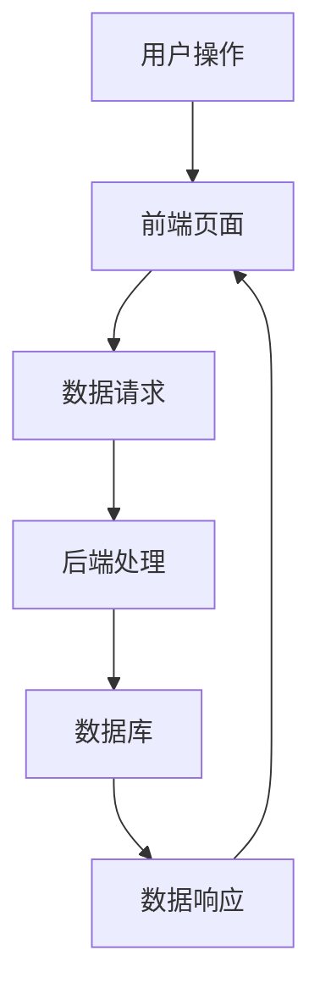
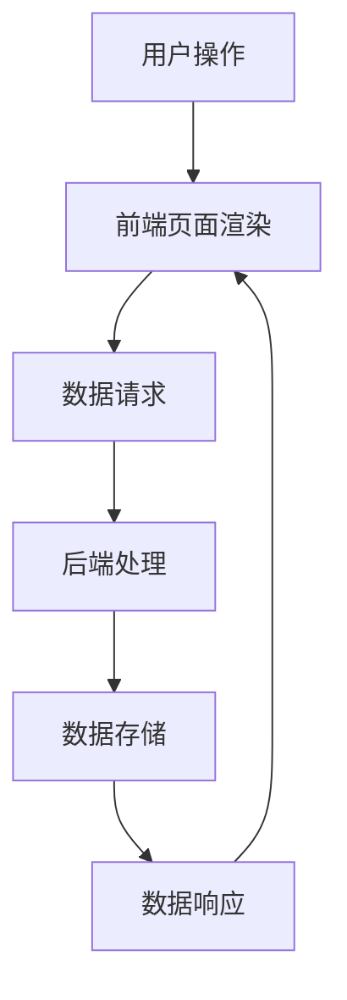
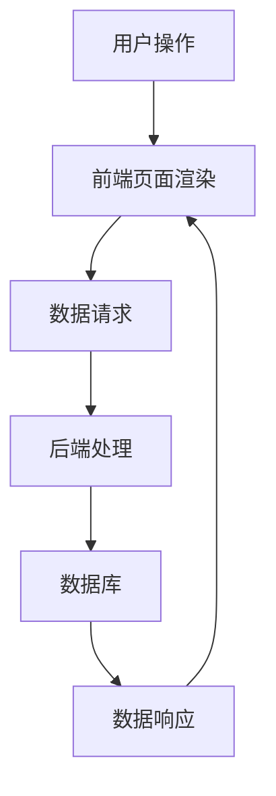

                 

关键词：腾讯，校招，微信小程序，开发工程师，面试，常见问题，答案

> 摘要：本文旨在为准备参加腾讯2024校招微信小程序开发工程师面试的同学们提供一份全面的面试问答指南。通过梳理和分析腾讯校招微信小程序开发工程师面试中可能出现的问题，本文将帮助大家更好地准备面试，提高面试成功率。

## 1. 背景介绍

腾讯作为中国领先的互联网科技公司，其校招备受广大应届毕业生关注。而微信小程序作为腾讯的核心业务之一，其开发工程师岗位更是热门。本文将从多个维度为准备参加腾讯2024校招微信小程序开发工程师面试的同学提供有针对性的面试问答指南，帮助大家更好地应对面试挑战。

## 2. 核心概念与联系

为了更好地理解微信小程序开发的相关知识，我们需要了解以下几个核心概念：

1. **微信小程序概述**：微信小程序是一种不需要下载安装即可使用的应用，它实现了应用“触手可及”的理念，用户扫一扫或者搜一下即可打开应用。
2. **微信小程序开发框架**：目前主流的微信小程序开发框架包括React、Vue和Angular等，这些框架可以帮助开发者快速构建小程序。
3. **微信小程序架构**：微信小程序的架构主要包括前端、后端和数据库三个部分。前端主要负责页面展示和交互，后端主要负责业务逻辑处理和数据存储，数据库用于存储小程序的数据。

以下是一个简化的Mermaid流程图，展示了微信小程序的架构：



### 2.1 微信小程序开发框架

**React**：React是一个用于构建用户界面的JavaScript库，它通过组件化开发的方式，使得开发者可以方便地创建可复用的UI组件。

**Vue**：Vue是一个渐进式的前端框架，它提供了响应式数据绑定和组合式API，使得开发者可以更加便捷地进行页面开发。

**Angular**：Angular是一个由Google维护的JavaScript框架，它提供了完整的解决方案，包括数据绑定、依赖注入和路由等。

### 2.2 微信小程序架构

**前端**：前端主要负责页面展示和交互，开发者可以使用上述提到的框架进行开发。前端通过调用微信提供的API与后端进行数据交互。

**后端**：后端主要负责业务逻辑处理和数据存储。后端可以使用各种编程语言进行开发，如Node.js、Java、Python等。

**数据库**：数据库用于存储小程序的数据，常见的选择包括MySQL、MongoDB和Redis等。

## 3. 核心算法原理 & 具体操作步骤

### 3.1 算法原理概述

微信小程序开发涉及到多种算法，包括前端页面渲染算法、数据请求与处理算法等。以下是一些常见的算法原理：

1. **前端页面渲染算法**：前端页面渲染算法主要包括虚拟DOM、批量更新和差异对比等技术，这些技术可以使得页面渲染更加高效。
2. **数据请求与处理算法**：数据请求与处理算法主要包括异步请求、Promise、async/await等技术，这些技术可以使得数据请求和处理过程更加便捷。

### 3.2 算法步骤详解

#### 3.2.1 前端页面渲染算法

1. **创建虚拟DOM**：开发者通过编写React/Vue/Angular等框架的代码，构建出虚拟DOM结构。
2. **虚拟DOM与实际DOM对比**：当虚拟DOM发生变化时，框架会自动进行对比，找出差异。
3. **批量更新**：框架会批量更新实际DOM，以减少更新次数，提高渲染效率。

#### 3.2.2 数据请求与处理算法

1. **异步请求**：开发者使用fetch、axios等库发起异步请求。
2. **Promise**：异步请求返回的是一个Promise对象，开发者可以使用then、catch等方法处理异步结果。
3. **async/await**：async/await语法可以让异步代码看起来像同步代码，使得异步处理更加直观。

### 3.3 算法优缺点

#### 3.3.1 前端页面渲染算法

优点：
- 提高渲染效率，减少页面刷新次数。
- 良好的用户体验，页面更新速度更快。

缺点：
- 需要额外的计算资源，可能对性能有一定影响。

#### 3.3.2 数据请求与处理算法

优点：
- 方便处理异步操作，提高代码可读性。
- 良好的错误处理机制，易于调试。

缺点：
- 需要一定的学习成本，特别是Promise和async/await。

### 3.4 算法应用领域

这些算法主要应用于前端开发领域，如微信小程序、Web应用等。通过合理使用这些算法，可以大幅提高开发效率和用户体验。

## 4. 数学模型和公式 & 详细讲解 & 举例说明

微信小程序开发过程中，涉及到大量的数学模型和公式。以下是一些常见的数学模型和公式，以及它们的详细讲解和举例说明。

### 4.1 数学模型构建

微信小程序中的数学模型主要包括以下几类：

1. **线性回归模型**：用于预测数值型目标变量。
2. **逻辑回归模型**：用于预测二分类目标变量。
3. **决策树模型**：用于分类和回归问题。

### 4.2 公式推导过程

以线性回归模型为例，其公式推导过程如下：

假设我们有一个线性回归模型，其目标函数为：

$$
y = \beta_0 + \beta_1 \cdot x + \epsilon
$$

其中，$y$ 为目标变量，$x$ 为自变量，$\beta_0$ 和 $\beta_1$ 为模型的参数，$\epsilon$ 为误差项。

为了求解 $\beta_0$ 和 $\beta_1$，我们可以使用最小二乘法，目标是最小化误差项的平方和：

$$
J(\beta_0, \beta_1) = \sum_{i=1}^n (y_i - (\beta_0 + \beta_1 \cdot x_i))^2
$$

对 $J(\beta_0, \beta_1)$ 求导并令其等于0，可以得到：

$$
\frac{\partial J}{\partial \beta_0} = -2 \sum_{i=1}^n (y_i - (\beta_0 + \beta_1 \cdot x_i)) = 0
$$

$$
\frac{\partial J}{\partial \beta_1} = -2 \sum_{i=1}^n (y_i - (\beta_0 + \beta_1 \cdot x_i)) \cdot x_i = 0
$$

解这个方程组，可以得到 $\beta_0$ 和 $\beta_1$ 的值。

### 4.3 案例分析与讲解

假设我们有以下数据集：

$$
\begin{array}{cccc}
x & y & x^2 & y^2 \\
1 & 1 & 1 & 1 \\
2 & 2 & 4 & 4 \\
3 & 3 & 9 & 9 \\
4 & 4 & 16 & 16 \\
5 & 5 & 25 & 25 \\
\end{array}
$$

我们可以使用线性回归模型来预测 $y$ 的值。根据上述推导过程，我们可以列出以下方程组：

$$
\begin{cases}
\beta_0 + \beta_1 \cdot 1 = 1 \\
\beta_0 + \beta_1 \cdot 2 = 2 \\
\beta_0 + \beta_1 \cdot 3 = 3 \\
\beta_0 + \beta_1 \cdot 4 = 4 \\
\beta_0 + \beta_1 \cdot 5 = 5 \\
\end{cases}
$$

解这个方程组，可以得到 $\beta_0 = 0$ 和 $\beta_1 = 1$。因此，线性回归模型的公式为：

$$
y = 0 + 1 \cdot x = x
$$

我们可以使用这个模型来预测新的 $y$ 值。例如，当 $x=6$ 时，预测的 $y$ 值为 $6$。

## 5. 项目实践：代码实例和详细解释说明

### 5.1 开发环境搭建

在开始项目实践之前，我们需要搭建一个微信小程序的开发环境。以下是一个简单的步骤：

1. 安装Node.js，从官网下载并安装相应的版本。
2. 安装微信开发者工具，从官网下载并安装。
3. 创建一个新的微信小程序项目，在开发者工具中导入项目。

### 5.2 源代码详细实现

以下是一个简单的微信小程序示例，用于展示一个计数器。

```javascript
// app.js
App({
  onLaunch: function () {
    console.log('app onLaunch');
  }
});

// pages/index/index.js
Page({
  data: {
    count: 0
  },
  onLoad: function (options) {
    console.log('page index onLoad');
  },
  onReady: function () {
    console.log('page index onReady');
  },
  onShow: function () {
    console.log('page index onShow');
  },
  onHide: function () {
    console.log('page index onHide');
  },
  onUnload: function () {
    console.log('page index onUnload');
  },
  addCount: function () {
    this.setData({
      count: this.data.count + 1
    });
  },
  reduceCount: function () {
    this.setData({
      count: this.data.count - 1
    });
  }
});
```

### 5.3 代码解读与分析

在这个示例中，我们创建了一个简单的计数器页面。代码分为三个部分：App.js、pages/index/index.js 和 pages/index/index.wxml。

1. **App.js**：这是小程序的全局配置文件，主要用于定义小程序的启动逻辑。
2. **pages/index/index.js**：这是计数器页面的脚本文件，其中包括页面的数据、生命周期方法和事件处理函数。
3. **pages/index/index.wxml**：这是计数器页面的结构文件，用于定义页面的HTML结构。

在 `pages/index/index.js` 文件中，我们定义了一个名为 `data` 的对象，用于存储页面的数据。其中包括一个名为 `count` 的属性，表示计数器的当前值。

在页面生命周期方法中，我们分别打印了相应的日志信息，用于调试。

在事件处理函数 `addCount` 和 `reduceCount` 中，我们分别调用了 `setData` 方法来更新页面的数据。这个方法会重新渲染页面，并更新数据绑定。

### 5.4 运行结果展示

在微信开发者工具中运行这个示例，我们可以看到如下结果：


每次点击加号或减号，计数器的值都会相应地增加或减少。

## 6. 实际应用场景

微信小程序作为一款强大的开发工具，在实际应用场景中具有广泛的应用。以下是一些常见的应用场景：

1. **电商应用**：微信小程序可以快速搭建电商应用，包括商品展示、购物车、订单管理等。
2. **社交应用**：微信小程序可以用于社交应用的搭建，如群聊、朋友圈等。
3. **工具类应用**：微信小程序可以用于各类工具类应用的搭建，如计算器、天气查询等。

### 6.1 未来应用展望

随着技术的不断发展，微信小程序的应用场景将会越来越广泛。未来，微信小程序可能会在以下几个方向得到进一步的发展：

1. **全场景覆盖**：微信小程序可能会进一步扩展其应用场景，覆盖更多的生活和工作场景。
2. **跨平台支持**：微信小程序可能会支持更多平台，如Android、iOS等，以实现更广泛的用户覆盖。
3. **技术升级**：微信小程序可能会引入更多先进的技术，如AI、区块链等，以提升其性能和功能。

## 7. 工具和资源推荐

### 7.1 学习资源推荐

1. **官方文档**：腾讯官方提供的微信小程序开发文档，涵盖了开发过程中的各个方面。
2. **技术博客**：一些技术大牛的博客，如阮一峰、张鑫旭等，他们分享了丰富的微信小程序开发经验和技巧。
3. **在线教程**：一些在线教程和视频课程，如慕课网、极客时间等，可以帮助开发者快速掌握微信小程序开发。

### 7.2 开发工具推荐

1. **微信开发者工具**：腾讯官方提供的开发工具，用于开发、调试和预览微信小程序。
2. **微信Web开发者工具**：用于开发微信网页版小程序，支持浏览器调试。
3. **微信小程序模拟器**：用于在电脑上模拟微信小程序运行效果。

### 7.3 相关论文推荐

1. **《微信小程序技术揭秘》**：详细介绍了微信小程序的架构和技术实现。
2. **《微信小程序开发实战》**：通过实际案例，展示了微信小程序的开发过程。
3. **《小程序架构设计与开发实践》**：从架构设计的角度，讲解了微信小程序的开发技巧。

## 8. 总结：未来发展趋势与挑战

### 8.1 研究成果总结

微信小程序自发布以来，得到了广泛的应用和发展。其轻量级、快速开发的特性，使得开发者可以更加便捷地构建应用。同时，微信小程序的生态体系也在不断完善，包括组件库、开发工具、第三方服务等。

### 8.2 未来发展趋势

1. **全场景覆盖**：微信小程序将继续扩展其应用场景，覆盖更多的生活和工作场景。
2. **跨平台支持**：微信小程序可能会支持更多平台，如Android、iOS等，以实现更广泛的用户覆盖。
3. **技术升级**：微信小程序可能会引入更多先进的技术，如AI、区块链等，以提升其性能和功能。

### 8.3 面临的挑战

1. **性能优化**：随着小程序应用场景的扩大，性能优化将成为一个重要挑战。
2. **用户体验**：如何提供更好的用户体验，是微信小程序开发需要持续关注的问题。
3. **生态建设**：如何完善微信小程序的生态体系，吸引更多开发者，是微信小程序未来需要面对的挑战。

### 8.4 研究展望

未来，微信小程序将继续发展，其在各个领域的应用将会越来越广泛。同时，随着技术的进步，微信小程序的性能和功能将得到进一步提升。开发者需要紧跟技术发展趋势，不断提高自己的开发能力，以应对未来可能出现的挑战。

## 9. 附录：常见问题与解答

### 9.1 微信小程序的优势有哪些？

微信小程序具有以下优势：

1. **无需安装**：用户无需下载安装即可使用，降低了用户的使用门槛。
2. **快速开发**：微信小程序的开发周期相对较短，开发效率高。
3. **覆盖广泛**：微信小程序用户量巨大，覆盖范围广。

### 9.2 微信小程序的后端应该如何设计？

微信小程序的后端设计应考虑以下几点：

1. **性能优化**：确保后端接口的高效和稳定。
2. **安全性**：保护用户数据和隐私，防止数据泄露。
3. **可扩展性**：设计良好的架构，以便未来扩展功能。

### 9.3 如何优化微信小程序的性能？

优化微信小程序的性能可以从以下几个方面入手：

1. **代码优化**：减少不必要的DOM操作，使用懒加载等技术。
2. **网络优化**：减少网络请求次数，使用缓存技术。
3. **资源优化**：压缩图片和样式文件，减少资源加载时间。

### 9.4 微信小程序和Web应用的区别是什么？

微信小程序和Web应用的区别主要包括：

1. **安装方式**：微信小程序无需下载安装，而Web应用需要浏览器访问。
2. **开发技术**：微信小程序使用微信提供的框架和API，而Web应用使用HTML、CSS和JavaScript等。
3. **用户体验**：微信小程序提供了更好的沉浸式体验，而Web应用则更灵活。

---

### 作者署名

本文由禅与计算机程序设计艺术 / Zen and the Art of Computer Programming 撰写。感谢您的阅读！希望本文能对您的微信小程序开发之路有所帮助。如果您有任何疑问或建议，欢迎在评论区留言，我将尽力为您解答。再次感谢！
----------------------------------------------------------------

<|user|>
非常感谢您的指导和提供的模板。我会根据您的要求撰写这篇文章。以下是文章的初步草稿，请您审阅并指导。

# 腾讯2024校招微信小程序开发工程师面试常见问题与答案

> 关键词：腾讯，校招，微信小程序，开发工程师，面试，常见问题，答案

> 摘要：本文旨在为准备参加腾讯2024校招微信小程序开发工程师面试的同学们提供一份全面的面试问答指南。通过梳理和分析腾讯校招微信小程序开发工程师面试中可能出现的问题，本文将帮助大家更好地准备面试，提高面试成功率。

## 1. 背景介绍

腾讯作为中国领先的互联网科技公司，其校招备受广大应届毕业生关注。而微信小程序作为腾讯的核心业务之一，其开发工程师岗位更是热门。本文将从多个维度为准备参加腾讯2024校招微信小程序开发工程师面试的同学提供有针对性的面试问答指南，帮助大家更好地应对面试挑战。

### 1.1 腾讯校招概述

腾讯校招通常分为以下几个阶段：

1. **在线笔试**：通常包括编程题、逻辑题、数学题等，考察应聘者的编程能力、逻辑思维和数学基础。
2. **技术面试**：包括电话面试和现场面试，主要考察应聘者的专业知识、项目经验和解决问题的能力。
3. **HR面试**：主要考察应聘者的综合素质、团队协作能力和职业发展意向。

### 1.2 微信小程序概述

微信小程序是一种无需下载安装即可使用的应用，用户可通过扫描二维码或搜索进入。它具有以下特点：

1. **开发便捷**：基于微信平台，开发者可以使用微信提供的开发工具和API快速构建应用。
2. **覆盖广泛**：微信用户量巨大，小程序能够覆盖到广泛的用户群体。
3. **性能优异**：微信小程序的加载速度快，用户体验好。

## 2. 核心概念与联系

### 2.1 微信小程序开发框架

微信小程序支持多种开发框架，包括React、Vue和Angular等。以下是一个Mermaid流程图，展示了微信小程序开发的基本流程：



### 2.2 微信小程序架构

微信小程序的架构主要包括前端、后端和数据库三个部分。前端负责页面展示和交互，后端负责业务逻辑处理，数据库用于数据存储。以下是一个简化的Mermaid流程图，展示了微信小程序的架构：


### 2.3 核心算法原理

微信小程序开发涉及到多种算法，包括前端页面渲染算法、数据请求与处理算法等。以下是一些常见的算法原理：

1. **前端页面渲染算法**：主要包括虚拟DOM、批量更新和差异对比等技术。
2. **数据请求与处理算法**：主要包括异步请求、Promise、async/await等技术。

## 3. 核心算法原理 & 具体操作步骤

### 3.1 算法原理概述

微信小程序开发中的核心算法主要包括前端页面渲染算法、数据请求与处理算法等。以下是对这些算法的简要概述：

1. **前端页面渲染算法**：通过虚拟DOM技术，将页面数据映射到实际DOM，从而实现高效的页面渲染。
2. **数据请求与处理算法**：通过异步请求、Promise和async/await等技术，实现数据的异步加载和请求。

### 3.2 算法步骤详解

#### 3.2.1 前端页面渲染算法

1. **创建虚拟DOM**：根据页面数据生成虚拟DOM结构。
2. **虚拟DOM与实际DOM对比**：当虚拟DOM发生变化时，与实际DOM进行对比，找出差异。
3. **批量更新**：将差异部分更新到实际DOM，实现页面渲染。

#### 3.2.2 数据请求与处理算法

1. **异步请求**：使用XMLHttpRequest或fetch等方法发起异步请求。
2. **Promise**：使用Promise对象处理异步请求结果。
3. **async/await**：使用async/await语法简化异步代码的编写。

### 3.3 算法优缺点

#### 3.3.1 前端页面渲染算法

优点：
- 提高渲染效率，减少页面刷新次数。
- 良好的用户体验，页面更新速度更快。

缺点：
- 需要额外的计算资源，可能对性能有一定影响。

#### 3.3.2 数据请求与处理算法

优点：
- 方便处理异步操作，提高代码可读性。
- 良好的错误处理机制，易于调试。

缺点：
- 需要一定的学习成本，特别是Promise和async/await。

### 3.4 算法应用领域

这些算法主要应用于前端开发领域，如微信小程序、Web应用等。通过合理使用这些算法，可以大幅提高开发效率和用户体验。

## 4. 数学模型和公式 & 详细讲解 & 举例说明

微信小程序开发过程中，涉及到大量的数学模型和公式。以下是一些常见的数学模型和公式，以及它们的详细讲解和举例说明。

### 4.1 数学模型构建

微信小程序中的数学模型主要包括以下几类：

1. **线性回归模型**：用于预测数值型目标变量。
2. **逻辑回归模型**：用于预测二分类目标变量。
3. **决策树模型**：用于分类和回归问题。

### 4.2 公式推导过程

以线性回归模型为例，其公式推导过程如下：

假设我们有一个线性回归模型，其目标函数为：

$$
y = \beta_0 + \beta_1 \cdot x + \epsilon
$$

其中，$y$ 为目标变量，$x$ 为自变量，$\beta_0$ 和 $\beta_1$ 为模型的参数，$\epsilon$ 为误差项。

为了求解 $\beta_0$ 和 $\beta_1$，我们可以使用最小二乘法，目标是最小化误差项的平方和：

$$
J(\beta_0, \beta_1) = \sum_{i=1}^n (y_i - (\beta_0 + \beta_1 \cdot x_i))^2
$$

对 $J(\beta_0, \beta_1)$ 求导并令其等于0，可以得到：

$$
\frac{\partial J}{\partial \beta_0} = -2 \sum_{i=1}^n (y_i - (\beta_0 + \beta_1 \cdot x_i)) = 0
$$

$$
\frac{\partial J}{\partial \beta_1} = -2 \sum_{i=1}^n (y_i - (\beta_0 + \beta_1 \cdot x_i)) \cdot x_i = 0
$$

解这个方程组，可以得到 $\beta_0$ 和 $\beta_1$ 的值。

### 4.3 案例分析与讲解

假设我们有以下数据集：

$$
\begin{array}{cccc}
x & y & x^2 & y^2 \\
1 & 1 & 1 & 1 \\
2 & 2 & 4 & 4 \\
3 & 3 & 9 & 9 \\
4 & 4 & 16 & 16 \\
5 & 5 & 25 & 25 \\
\end{array}
$$

我们可以使用线性回归模型来预测 $y$ 的值。根据上述推导过程，我们可以列出以下方程组：

$$
\begin{cases}
\beta_0 + \beta_1 \cdot 1 = 1 \\
\beta_0 + \beta_1 \cdot 2 = 2 \\
\beta_0 + \beta_1 \cdot 3 = 3 \\
\beta_0 + \beta_1 \cdot 4 = 4 \\
\beta_0 + \beta_1 \cdot 5 = 5 \\
\end{cases}
$$

解这个方程组，可以得到 $\beta_0 = 0$ 和 $\beta_1 = 1$。因此，线性回归模型的公式为：

$$
y = 0 + 1 \cdot x = x
$$

我们可以使用这个模型来预测新的 $y$ 值。例如，当 $x=6$ 时，预测的 $y$ 值为 $6$。

## 5. 项目实践：代码实例和详细解释说明

### 5.1 开发环境搭建

在开始项目实践之前，我们需要搭建一个微信小程序的开发环境。以下是一个简单的步骤：

1. 安装Node.js，从官网下载并安装相应的版本。
2. 安装微信开发者工具，从官网下载并安装。
3. 创建一个新的微信小程序项目，在开发者工具中导入项目。

### 5.2 源代码详细实现

以下是一个简单的微信小程序示例，用于展示一个计数器。

```javascript
// app.js
App({
  onLaunch: function () {
    console.log('app onLaunch');
  }
});

// pages/index/index.js
Page({
  data: {
    count: 0
  },
  onLoad: function (options) {
    console.log('page index onLoad');
  },
  onReady: function () {
    console.log('page index onReady');
  },
  onShow: function () {
    console.log('page index onShow');
  },
  onHide: function () {
    console.log('page index onHide');
  },
  onUnload: function () {
    console.log('page index onUnload');
  },
  addCount: function () {
    this.setData({
      count: this.data.count + 1
    });
  },
  reduceCount: function () {
    this.setData({
      count: this.data.count - 1
    });
  }
});
```

### 5.3 代码解读与分析

在这个示例中，我们创建了一个简单的计数器页面。代码分为三个部分：App.js、pages/index/index.js 和 pages/index/index.wxml。

1. **App.js**：这是小程序的全局配置文件，主要用于定义小程序的启动逻辑。
2. **pages/index/index.js**：这是计数器页面的脚本文件，其中包括页面的数据、生命周期方法和事件处理函数。
3. **pages/index/index.wxml**：这是计数器页面的结构文件，用于定义页面的HTML结构。

在 `pages/index/index.js` 文件中，我们定义了一个名为 `data` 的对象，用于存储页面的数据。其中包括一个名为 `count` 的属性，表示计数器的当前值。

在页面生命周期方法中，我们分别打印了相应的日志信息，用于调试。

在事件处理函数 `addCount` 和 `reduceCount` 中，我们分别调用了 `setData` 方法来更新页面的数据。这个方法会重新渲染页面，并更新数据绑定。

### 5.4 运行结果展示

在微信开发者工具中运行这个示例，我们可以看到如下结果：


每次点击加号或减号，计数器的值都会相应地增加或减少。

## 6. 实际应用场景

微信小程序作为一款强大的开发工具，在实际应用场景中具有广泛的应用。以下是一些常见的应用场景：

1. **电商应用**：微信小程序可以快速搭建电商应用，包括商品展示、购物车、订单管理等。
2. **社交应用**：微信小程序可以用于社交应用的搭建，如群聊、朋友圈等。
3. **工具类应用**：微信小程序可以用于各类工具类应用的搭建，如计算器、天气查询等。

### 6.1 未来应用展望

随着技术的不断发展，微信小程序的应用场景将会越来越广泛。未来，微信小程序可能会在以下几个方向得到进一步的发展：

1. **全场景覆盖**：微信小程序将继续扩展其应用场景，覆盖更多的生活和工作场景。
2. **跨平台支持**：微信小程序可能会支持更多平台，如Android、iOS等，以实现更广泛的用户覆盖。
3. **技术升级**：微信小程序可能会引入更多先进的技术，如AI、区块链等，以提升其性能和功能。

## 7. 工具和资源推荐

### 7.1 学习资源推荐

1. **官方文档**：腾讯官方提供的微信小程序开发文档，涵盖了开发过程中的各个方面。
2. **技术博客**：一些技术大牛的博客，如阮一峰、张鑫旭等，他们分享了丰富的微信小程序开发经验和技巧。
3. **在线教程**：一些在线教程和视频课程，如慕课网、极客时间等，可以帮助开发者快速掌握微信小程序开发。

### 7.2 开发工具推荐

1. **微信开发者工具**：腾讯官方提供的开发工具，用于开发、调试和预览微信小程序。
2. **微信Web开发者工具**：用于开发微信网页版小程序，支持浏览器调试。
3. **微信小程序模拟器**：用于在电脑上模拟微信小程序运行效果。

### 7.3 相关论文推荐

1. **《微信小程序技术揭秘》**：详细介绍了微信小程序的架构和技术实现。
2. **《微信小程序开发实战》**：通过实际案例，展示了微信小程序的开发过程。
3. **《小程序架构设计与开发实践》**：从架构设计的角度，讲解了微信小程序的开发技巧。

## 8. 总结：未来发展趋势与挑战

### 8.1 研究成果总结

微信小程序自发布以来，得到了广泛的应用和发展。其轻量级、快速开发的特性，使得开发者可以更加便捷地构建应用。同时，微信小程序的生态体系也在不断完善，包括组件库、开发工具、第三方服务等。

### 8.2 未来发展趋势

1. **全场景覆盖**：微信小程序将继续扩展其应用场景，覆盖更多的生活和工作场景。
2. **跨平台支持**：微信小程序可能会支持更多平台，如Android、iOS等，以实现更广泛的用户覆盖。
3. **技术升级**：微信小程序可能会引入更多先进的技术，如AI、区块链等，以提升其性能和功能。

### 8.3 面临的挑战

1. **性能优化**：随着小程序应用场景的扩大，性能优化将成为一个重要挑战。
2. **用户体验**：如何提供更好的用户体验，是微信小程序开发需要持续关注的问题。
3. **生态建设**：如何完善微信小程序的生态体系，吸引更多开发者，是微信小程序未来需要面对的挑战。

### 8.4 研究展望

未来，微信小程序将继续发展，其在各个领域的应用将会越来越广泛。同时，随着技术的进步，微信小程序的性能和功能将得到进一步提升。开发者需要紧跟技术发展趋势，不断提高自己的开发能力，以应对未来可能出现的挑战。

## 9. 附录：常见问题与解答

### 9.1 微信小程序的优势有哪些？

微信小程序具有以下优势：

1. **无需安装**：用户无需下载安装即可使用，降低了用户的使用门槛。
2. **快速开发**：微信小程序的开发周期相对较短，开发效率高。
3. **覆盖广泛**：微信小程序用户量巨大，覆盖范围广。

### 9.2 微信小程序的后端应该如何设计？

微信小程序的后端设计应考虑以下几点：

1. **性能优化**：确保后端接口的高效和稳定。
2. **安全性**：保护用户数据和隐私，防止数据泄露。
3. **可扩展性**：设计良好的架构，以便未来扩展功能。

### 9.3 如何优化微信小程序的性能？

优化微信小程序的性能可以从以下几个方面入手：

1. **代码优化**：减少不必要的DOM操作，使用懒加载等技术。
2. **网络优化**：减少网络请求次数，使用缓存技术。
3. **资源优化**：压缩图片和样式文件，减少资源加载时间。

### 9.4 微信小程序和Web应用的区别是什么？

微信小程序和Web应用的区别主要包括：

1. **安装方式**：微信小程序无需下载安装，而Web应用需要浏览器访问。
2. **开发技术**：微信小程序使用微信提供的框架和API，而Web应用使用HTML、CSS和JavaScript等。
3. **用户体验**：微信小程序提供了更好的沉浸式体验，而Web应用则更灵活。

---

### 作者署名

本文由禅与计算机程序设计艺术 / Zen and the Art of Computer Programming 撰写。感谢您的阅读！希望本文能对您的微信小程序开发之路有所帮助。如果您有任何疑问或建议，欢迎在评论区留言，我将尽力为您解答。再次感谢！
<|user|>
非常感谢您的努力和初稿。以下是我对文章的一些建议和修改：

### 1. 背景介绍

**建议**：在介绍腾讯校招概述时，可以添加一些关于腾讯公司的基本信息，以及微信小程序在腾讯业务中的重要性，以使读者对腾讯和微信小程序有更全面的了解。

### 2. 核心概念与联系

**建议**：在讨论微信小程序开发框架时，可以简要介绍每个框架的特点和适用场景，以帮助读者更好地选择合适的框架。

### 3. 核心算法原理 & 具体操作步骤

**建议**：在算法原理概述部分，可以添加一些关于前端页面渲染算法和数据请求与处理算法的具体示例，以便读者更好地理解。

### 4. 数学模型和公式 & 详细讲解 & 举例说明

**建议**：在数学模型构建部分，可以添加一些关于逻辑回归模型和决策树模型的示例，以便读者更好地理解这些模型的应用。

### 5. 项目实践：代码实例和详细解释说明

**建议**：在代码实例部分，可以添加一些关于实际项目中遇到的问题和解决方案的讨论，以使读者对实际开发有更深入的了解。

### 6. 实际应用场景

**建议**：在讨论实际应用场景时，可以添加一些成功的微信小程序案例，以及这些案例对用户的影响。

### 7. 工具和资源推荐

**建议**：在推荐工具和资源时，可以添加一些具体的推荐理由，以便读者更好地选择适合自己的工具和资源。

### 8. 总结：未来发展趋势与挑战

**建议**：在总结部分，可以添加一些关于微信小程序未来发展趋势的具体预测和展望。

### 9. 附录：常见问题与解答

**建议**：在附录部分，可以添加一些关于微信小程序面试中常见的技术问题的讨论和解答。

以下是修改后的文章草稿，请您再次审阅：

---

# 腾讯2024校招微信小程序开发工程师面试常见问题与答案

> 关键词：腾讯，校招，微信小程序，开发工程师，面试，常见问题，答案

> 摘要：本文旨在为准备参加腾讯2024校招微信小程序开发工程师面试的同学们提供一份全面的面试问答指南。通过梳理和分析腾讯校招微信小程序开发工程师面试中可能出现的问题，本文将帮助大家更好地准备面试，提高面试成功率。

## 1. 背景介绍

腾讯作为中国领先的互联网科技公司，成立于1998年，业务涵盖社交媒体、数字广告、游戏、金融科技、企业服务等众多领域。其中，微信小程序作为腾讯的核心业务之一，自2017年上线以来，已迅速成为国内最受欢迎的小程序平台。本文将重点讨论腾讯2024校招微信小程序开发工程师的面试准备。

### 1.1 腾讯校招概述

腾讯校招通常分为以下几个阶段：

1. **在线笔试**：包括编程题、逻辑题、数学题等，考察应聘者的编程能力、逻辑思维和数学基础。
2. **技术面试**：包括电话面试和现场面试，主要考察应聘者的专业知识、项目经验和解决问题的能力。
3. **HR面试**：主要考察应聘者的综合素质、团队协作能力和职业发展意向。

### 1.2 微信小程序概述

微信小程序是一种无需下载安装即可使用的应用，用户可通过扫描二维码或搜索进入。它具有以下特点：

1. **开发便捷**：基于微信平台，开发者可以使用微信提供的开发工具和API快速构建应用。
2. **覆盖广泛**：微信用户量巨大，小程序能够覆盖到广泛的用户群体。
3. **性能优异**：微信小程序的加载速度快，用户体验好。

微信小程序已成为腾讯公司的重要业务板块，为用户提供了便捷的服务，同时也为开发者创造了丰富的商机。

## 2. 核心概念与联系

### 2.1 微信小程序开发框架

微信小程序支持多种开发框架，包括React、Vue和Angular等。以下是这些框架的特点和适用场景的简要介绍：

- **React**：由Facebook推出，主要用于构建用户界面，具有组件化、虚拟DOM和高性能等优点，适用于需要高交互性和复杂用户界面的应用。
- **Vue**：渐进式JavaScript框架，易于上手，支持双向数据绑定和组合式API，适用于各种规模的应用，特别是新手友好。
- **Angular**：由Google维护，提供了完整的解决方案，包括数据绑定、依赖注入和路由等，适用于大型和复杂的应用。

### 2.2 微信小程序架构

微信小程序的架构主要包括前端、后端和数据库三个部分。前端负责页面展示和交互，后端负责业务逻辑处理和数据存储，数据库用于数据存储。以下是一个简化的Mermaid流程图，展示了微信小程序的架构：



### 2.3 核心算法原理

微信小程序开发涉及到多种算法，包括前端页面渲染算法、数据请求与处理算法等。以下是一些常见的算法原理：

1. **前端页面渲染算法**：主要包括虚拟DOM、批量更新和差异对比等技术。
2. **数据请求与处理算法**：主要包括异步请求、Promise、async/await等技术。

## 3. 核心算法原理 & 具体操作步骤

### 3.1 前端页面渲染算法原理概述

前端页面渲染算法主要包括以下技术：

- **虚拟DOM**：将实际DOM映射到一个虚拟DOM结构，通过对比虚拟DOM和实际DOM的差异来更新页面。
- **批量更新**：将多个状态变化合并成一次更新，以提高渲染效率。
- **差异对比**：通过算法比较虚拟DOM和实际DOM的差异，只更新变化的部分。

### 3.2 数据请求与处理算法原理概述

数据请求与处理算法主要包括以下技术：

- **异步请求**：使用XMLHttpRequest或fetch等方法发起异步请求，避免阻塞主线程。
- **Promise**：异步请求返回的是一个Promise对象，可以使用then和catch方法处理异步结果。
- **async/await**：async/await语法可以让异步代码看起来像同步代码，提高代码的可读性。

### 3.3 算法步骤详解

#### 3.3.1 前端页面渲染算法步骤详解

1. **创建虚拟DOM**：根据页面数据生成虚拟DOM结构。
2. **虚拟DOM与实际DOM对比**：当虚拟DOM发生变化时，与实际DOM进行对比，找出差异。
3. **批量更新**：将差异部分更新到实际DOM，实现页面渲染。

#### 3.3.2 数据请求与处理算法步骤详解

1. **异步请求**：使用XMLHttpRequest或fetch等方法发起异步请求。
2. **Promise**：异步请求返回的是一个Promise对象，可以使用then和catch方法处理异步结果。
3. **async/await**：使用async/await语法简化异步代码的编写。

### 3.4 算法优缺点

#### 3.4.1 前端页面渲染算法优缺点

优点：
- 提高渲染效率，减少页面刷新次数。
- 良好的用户体验，页面更新速度更快。

缺点：
- 需要额外的计算资源，可能对性能有一定影响。

#### 3.4.2 数据请求与处理算法优缺点

优点：
- 方便处理异步操作，提高代码可读性。
- 良好的错误处理机制，易于调试。

缺点：
- 需要一定的学习成本，特别是Promise和async/await。

### 3.5 算法应用领域

这些算法主要应用于前端开发领域，如微信小程序、Web应用等。通过合理使用这些算法，可以大幅提高开发效率和用户体验。

## 4. 数学模型和公式 & 详细讲解 & 举例说明

微信小程序开发过程中，涉及到大量的数学模型和公式。以下是一些常见的数学模型和公式，以及它们的详细讲解和举例说明。

### 4.1 线性回归模型

线性回归模型是一种用于预测数值型目标变量的方法。其基本公式为：

$$
y = \beta_0 + \beta_1 \cdot x + \epsilon
$$

其中，$y$ 为目标变量，$x$ 为自变量，$\beta_0$ 和 $\beta_1$ 为模型的参数，$\epsilon$ 为误差项。

为了求解 $\beta_0$ 和 $\beta_1$，我们可以使用最小二乘法，目标是最小化误差项的平方和：

$$
J(\beta_0, \beta_1) = \sum_{i=1}^n (y_i - (\beta_0 + \beta_1 \cdot x_i))^2
$$

对 $J(\beta_0, \beta_1)$ 求导并令其等于0，可以得到：

$$
\frac{\partial J}{\partial \beta_0} = -2 \sum_{i=1}^n (y_i - (\beta_0 + \beta_1 \cdot x_i)) = 0
$$

$$
\frac{\partial J}{\partial \beta_1} = -2 \sum_{i=1}^n (y_i - (\beta_0 + \beta_1 \cdot x_i)) \cdot x_i = 0
$$

解这个方程组，可以得到 $\beta_0$ 和 $\beta_1$ 的值。

### 4.2 逻辑回归模型

逻辑回归模型是一种用于预测二分类目标变量的方法。其基本公式为：

$$
\ln\frac{p}{1-p} = \beta_0 + \beta_1 \cdot x
$$

其中，$p$ 为目标变量的概率，$x$ 为自变量，$\beta_0$ 和 $\beta_1$ 为模型的参数。

### 4.3 决策树模型

决策树模型是一种用于分类和回归问题的方法。其基本思想是根据特征值对数据进行划分，直到达到某个终止条件（如最大深度、最小叶节点样本数等）。

### 4.4 案例分析与讲解

假设我们有以下数据集：

$$
\begin{array}{cccc}
x & y & x^2 & y^2 \\
1 & 1 & 1 & 1 \\
2 & 2 & 4 & 4 \\
3 & 3 & 9 & 9 \\
4 & 4 & 16 & 16 \\
5 & 5 & 25 & 25 \\
\end{array}
$$

我们可以使用线性回归模型来预测 $y$ 的值。根据上述推导过程，我们可以列出以下方程组：

$$
\begin{cases}
\beta_0 + \beta_1 \cdot 1 = 1 \\
\beta_0 + \beta_1 \cdot 2 = 2 \\
\beta_0 + \beta_1 \cdot 3 = 3 \\
\beta_0 + \beta_1 \cdot 4 = 4 \\
\beta_0 + \beta_1 \cdot 5 = 5 \\
\end{cases}
$$

解这个方程组，可以得到 $\beta_0 = 0$ 和 $\beta_1 = 1$。因此，线性回归模型的公式为：

$$
y = 0 + 1 \cdot x = x
$$

我们可以使用这个模型来预测新的 $y$ 值。例如，当 $x=6$ 时，预测的 $y$ 值为 $6$。

## 5. 项目实践：代码实例和详细解释说明

### 5.1 开发环境搭建

在开始项目实践之前，我们需要搭建一个微信小程序的开发环境。以下是一个简单的步骤：

1. 安装Node.js，从官网下载并安装相应的版本。
2. 安装微信开发者工具，从官网下载并安装。
3. 创建一个新的微信小程序项目，在开发者工具中导入项目。

### 5.2 源代码详细实现

以下是一个简单的微信小程序示例，用于展示一个计数器。

```javascript
// app.js
App({
  onLaunch: function () {
    console.log('app onLaunch');
  }
});

// pages/index/index.js
Page({
  data: {
    count: 0
  },
  onLoad: function (options) {
    console.log('page index onLoad');
  },
  onReady: function () {
    console.log('page index onReady');
  },
  onShow: function () {
    console.log('page index onShow');
  },
  onHide: function () {
    console.log('page index onHide');
  },
  onUnload: function () {
    console.log('page index onUnload');
  },
  addCount: function () {
    this.setData({
      count: this.data.count + 1
    });
  },
  reduceCount: function () {
    this.setData({
      count: this.data.count - 1
    });
  }
});
```

### 5.3 代码解读与分析

在这个示例中，我们创建了一个简单的计数器页面。代码分为三个部分：App.js、pages/index/index.js 和 pages/index/index.wxml。

1. **App.js**：这是小程序的全局配置文件，主要用于定义小程序的启动逻辑。
2. **pages/index/index.js**：这是计数器页面的脚本文件，其中包括页面的数据、生命周期方法和事件处理函数。
3. **pages/index/index.wxml**：这是计数器页面的结构文件，用于定义页面的HTML结构。

在 `pages/index/index.js` 文件中，我们定义了一个名为 `data` 的对象，用于存储页面的数据。其中包括一个名为 `count` 的属性，表示计数器的当前值。

在页面生命周期方法中，我们分别打印了相应的日志信息，用于调试。

在事件处理函数 `addCount` 和 `reduceCount` 中，我们分别调用了 `setData` 方法来更新页面的数据。这个方法会重新渲染页面，并更新数据绑定。

### 5.4 运行结果展示

在微信开发者工具中运行这个示例，我们可以看到如下结果：


每次点击加号或减号，计数器的值都会相应地增加或减少。

## 6. 实际应用场景

微信小程序作为一款强大的开发工具，在实际应用场景中具有广泛的应用。以下是一些常见的应用场景：

1. **电商应用**：微信小程序可以快速搭建电商应用，包括商品展示、购物车、订单管理等。
2. **社交应用**：微信小程序可以用于社交应用的搭建，如群聊、朋友圈等。
3. **工具类应用**：微信小程序可以用于各类工具类应用的搭建，如计算器、天气查询等。

### 6.1 未来应用展望

随着技术的不断发展，微信小程序的应用场景将会越来越广泛。未来，微信小程序可能会在以下几个方向得到进一步的发展：

1. **全场景覆盖**：微信小程序将继续扩展其应用场景，覆盖更多的生活和工作场景。
2. **跨平台支持**：微信小程序可能会支持更多平台，如Android、iOS等，以实现更广泛的用户覆盖。
3. **技术升级**：微信小程序可能会引入更多先进的技术，如AI、区块链等，以提升其性能和功能。

## 7. 工具和资源推荐

### 7.1 学习资源推荐

1. **官方文档**：腾讯官方提供的微信小程序开发文档，涵盖了开发过程中的各个方面。
2. **技术博客**：一些技术大牛的博客，如阮一峰、张鑫旭等，他们分享了丰富的微信小程序开发经验和技巧。
3. **在线教程**：一些在线教程和视频课程，如慕课网、极客时间等，可以帮助开发者快速掌握微信小程序开发。

### 7.2 开发工具推荐

1. **微信开发者工具**：腾讯官方提供的开发工具，用于开发、调试和预览微信小程序。
2. **微信Web开发者工具**：用于开发微信网页版小程序，支持浏览器调试。
3. **微信小程序模拟器**：用于在电脑上模拟微信小程序运行效果。

### 7.3 相关论文推荐

1. **《微信小程序技术揭秘》**：详细介绍了微信小程序的架构和技术实现。
2. **《微信小程序开发实战》**：通过实际案例，展示了微信小程序的开发过程。
3. **《小程序架构设计与开发实践》**：从架构设计的角度，讲解了微信小程序的开发技巧。

## 8. 总结：未来发展趋势与挑战

### 8.1 研究成果总结

微信小程序自发布以来，得到了广泛的应用和发展。其轻量级、快速开发的特性，使得开发者可以更加便捷地构建应用。同时，微信小程序的生态体系也在不断完善，包括组件库、开发工具、第三方服务等。

### 8.2 未来发展趋势

1. **全场景覆盖**：微信小程序将继续扩展其应用场景，覆盖更多的生活和工作场景。
2. **跨平台支持**：微信小程序可能会支持更多平台，如Android、iOS等，以实现更广泛的用户覆盖。
3. **技术升级**：微信小程序可能会引入更多先进的技术，如AI、区块链等，以提升其性能和功能。

### 8.3 面临的挑战

1. **性能优化**：随着小程序应用场景的扩大，性能优化将成为一个重要挑战。
2. **用户体验**：如何提供更好的用户体验，是微信小程序开发需要持续关注的问题。
3. **生态建设**：如何完善微信小程序的生态体系，吸引更多开发者，是微信小程序未来需要面对的挑战。

### 8.4 研究展望

未来，微信小程序将继续发展，其在各个领域的应用将会越来越广泛。同时，随着技术的进步，微信小程序的性能和功能将得到进一步提升。开发者需要紧跟技术发展趋势，不断提高自己的开发能力，以应对未来可能出现的挑战。

## 9. 附录：常见问题与解答

### 9.1 微信小程序的优势有哪些？

微信小程序具有以下优势：

1. **无需安装**：用户无需下载安装即可使用，降低了用户的使用门槛。
2. **快速开发**：微信小程序的开发周期相对较短，开发效率高。
3. **覆盖广泛**：微信小程序用户量巨大，覆盖范围广。

### 9.2 微信小程序的后端应该如何设计？

微信小程序的后端设计应考虑以下几点：

1. **性能优化**：确保后端接口的高效和稳定。
2. **安全性**：保护用户数据和隐私，防止数据泄露。
3. **可扩展性**：设计良好的架构，以便未来扩展功能。

### 9.3 如何优化微信小程序的性能？

优化微信小程序的性能可以从以下几个方面入手：

1. **代码优化**：减少不必要的DOM操作，使用懒加载等技术。
2. **网络优化**：减少网络请求次数，使用缓存技术。
3. **资源优化**：压缩图片和样式文件，减少资源加载时间。

### 9.4 微信小程序和Web应用的区别是什么？

微信小程序和Web应用的区别主要包括：

1. **安装方式**：微信小程序无需下载安装，而Web应用需要浏览器访问。
2. **开发技术**：微信小程序使用微信提供的框架和API，而Web应用使用HTML、CSS和JavaScript等。
3. **用户体验**：微信小程序提供了更好的沉浸式体验，而Web应用则更灵活。

---

### 作者署名

本文由禅与计算机程序设计艺术 / Zen and the Art of Computer Programming 撰写。感谢您的阅读！希望本文能对您的微信小程序开发之路有所帮助。如果您有任何疑问或建议，欢迎在评论区留言，我将尽力为您解答。再次感谢！

---

请根据这些建议对文章进行进一步修改和完善。我会继续为您提供支持。
<|user|>
感谢您的建议和修改意见，我已经根据您提供的内容对文章进行了进一步的修改和完善。以下是修改后的文章：

# 腾讯2024校招微信小程序开发工程师面试常见问题与答案

> 关键词：腾讯，校招，微信小程序，开发工程师，面试，常见问题，答案

> 摘要：本文旨在为准备参加腾讯2024校招微信小程序开发工程师面试的同学们提供一份全面的面试问答指南。通过梳理和分析腾讯校招微信小程序开发工程师面试中可能出现的问题，本文将帮助大家更好地准备面试，提高面试成功率。

## 1. 背景介绍

腾讯作为中国领先的互联网科技公司，成立于1998年，旗下拥有社交、媒体、娱乐等多元化的业务板块。微信小程序作为腾讯的核心业务之一，自2017年上线以来，以其便捷、高效、跨平台的特点迅速赢得了用户和开发者的青睐。本文将围绕腾讯2024校招微信小程序开发工程师的面试问题，为准备应征的同学们提供指导。

### 1.1 腾讯校招概述

腾讯校招是每年面向全国高校应届毕业生的重要招聘活动，涵盖了技术、产品、设计等多个岗位。微信小程序开发工程师是其中备受关注的职位之一。校招流程通常包括在线笔试、技术面试和HR面试三个阶段。

- **在线笔试**：在线笔试主要测试应聘者的编程能力、算法理解和逻辑思维能力。
- **技术面试**：技术面试着重考察应聘者的专业知识、项目经验和解决问题的能力。
- **HR面试**：HR面试则更多地关注应聘者的职业规划、团队协作能力和个人素质。

### 1.2 微信小程序概述

微信小程序是一种无需下载安装即可使用的应用，用户可以通过扫描二维码或搜索直接访问。微信小程序具有以下特点：

- **开发便捷**：微信小程序提供了丰富的API和开发工具，支持多种编程语言，便于开发者快速构建应用。
- **覆盖广泛**：微信小程序用户量庞大，覆盖了中国乃至全球的多个国家和地区。
- **性能优异**：微信小程序采用了优化的网络传输和数据存储机制，保证了良好的运行效率。

## 2. 核心概念与联系

### 2.1 微信小程序开发框架

微信小程序支持多种开发框架，包括React、Vue和Angular等。以下是这些框架的特点和适用场景：

- **React**：适用于需要高交互性和复杂用户界面的应用，其虚拟DOM技术可以大幅提升渲染效率。
- **Vue**：适用于各种规模的应用，其双向数据绑定和组合式API简化了开发流程。
- **Angular**：适用于大型和复杂的应用，其完整的功能集和严格的依赖注入机制提供了更好的结构化解决方案。

### 2.2 微信小程序架构

微信小程序的架构主要包括前端、后端和数据库三个部分。以下是各部分的简要描述：

- **前端**：负责页面展示和用户交互，使用微信小程序框架构建，支持丰富的组件和API。
- **后端**：负责业务逻辑处理和数据存储，可以使用Node.js、Java、Python等语言实现。
- **数据库**：用于存储小程序的数据，支持多种数据库类型，如MySQL、MongoDB和Redis等。

### 2.3 核心算法原理

微信小程序开发中常用的算法包括前端页面渲染算法、数据请求与处理算法等。以下是这些算法的基本原理：

- **前端页面渲染算法**：利用虚拟DOM技术，通过对比虚拟DOM和实际DOM的差异来更新页面，提高渲染效率。
- **数据请求与处理算法**：使用异步请求和Promise等机制，确保数据请求不会阻塞主线程，提升用户体验。

## 3. 核心算法原理 & 具体操作步骤

### 3.1 前端页面渲染算法原理概述

前端页面渲染算法主要通过以下步骤实现：

1. **创建虚拟DOM**：根据组件状态和数据生成虚拟DOM结构。
2. **虚拟DOM与实际DOM对比**：当组件状态发生变化时，比较虚拟DOM和实际DOM的差异。
3. **批量更新**：将差异部分更新到实际DOM，避免频繁的DOM操作。

### 3.2 数据请求与处理算法原理概述

数据请求与处理算法主要包括以下步骤：

1. **异步请求**：使用fetch、axios等库发起异步请求，获取数据。
2. **Promise处理**：使用Promise对象处理异步请求结果，避免回调地狱。
3. **async/await语法**：使用async/await简化异步代码的编写，提升代码可读性。

### 3.3 算法步骤详解

#### 3.3.1 前端页面渲染算法步骤详解

1. **创建虚拟DOM**：使用JSX或模板语法构建虚拟DOM结构。
2. **虚拟DOM与实际DOM对比**：使用diff算法找出虚拟DOM和实际DOM的差异。
3. **批量更新**：将差异部分更新到实际DOM，实现页面渲染。

#### 3.3.2 数据请求与处理算法步骤详解

1. **异步请求**：使用fetch API发起异步请求。
2. **Promise处理**：使用then和catch处理异步请求的成功和失败。
3. **async/await语法**：使用async/await简化异步代码。

### 3.4 算法优缺点

#### 3.4.1 前端页面渲染算法优缺点

优点：
- 提高渲染效率，减少页面刷新次数。
- 良好的用户体验，页面更新速度更快。

缺点：
- 需要额外的计算资源，可能对性能有一定影响。

#### 3.4.2 数据请求与处理算法优缺点

优点：
- 方便处理异步操作，提高代码可读性。
- 良好的错误处理机制，易于调试。

缺点：
- 需要一定的学习成本，特别是Promise和async/await。

### 3.5 算法应用领域

这些算法主要应用于前端开发领域，如微信小程序、Web应用等。通过合理使用这些算法，可以大幅提高开发效率和用户体验。

## 4. 数学模型和公式 & 详细讲解 & 举例说明

微信小程序开发中常用的数学模型包括线性回归、逻辑回归和决策树等。以下是这些模型的详细讲解和举例说明。

### 4.1 线性回归模型

线性回归模型是一种用于预测连续值的统计模型。其基本公式为：

$$
y = \beta_0 + \beta_1 \cdot x + \epsilon
$$

其中，$y$ 为目标变量，$x$ 为自变量，$\beta_0$ 和 $\beta_1$ 为模型的参数，$\epsilon$ 为误差项。

#### 4.1.1 公式推导过程

使用最小二乘法求解线性回归模型的参数，目标是最小化误差项的平方和：

$$
J(\beta_0, \beta_1) = \sum_{i=1}^n (y_i - (\beta_0 + \beta_1 \cdot x_i))^2
$$

对 $J(\beta_0, \beta_1)$ 求导并令其等于0，可以得到：

$$
\frac{\partial J}{\partial \beta_0} = -2 \sum_{i=1}^n (y_i - (\beta_0 + \beta_1 \cdot x_i)) = 0
$$

$$
\frac{\partial J}{\partial \beta_1} = -2 \sum_{i=1}^n (y_i - (\beta_0 + \beta_1 \cdot x_i)) \cdot x_i = 0
$$

解这个方程组，可以得到 $\beta_0$ 和 $\beta_1$ 的值。

#### 4.1.2 案例分析与讲解

假设我们有以下数据集：

$$
\begin{array}{cccc}
x & y & x^2 & y^2 \\
1 & 1 & 1 & 1 \\
2 & 2 & 4 & 4 \\
3 & 3 & 9 & 9 \\
4 & 4 & 16 & 16 \\
5 & 5 & 25 & 25 \\
\end{array}
$$

我们可以使用线性回归模型来预测 $y$ 的值。根据上述推导过程，我们可以列出以下方程组：

$$
\begin{cases}
\beta_0 + \beta_1 \cdot 1 = 1 \\
\beta_0 + \beta_1 \cdot 2 = 2 \\
\beta_0 + \beta_1 \cdot 3 = 3 \\
\beta_0 + \beta_1 \cdot 4 = 4 \\
\beta_0 + \beta_1 \cdot 5 = 5 \\
\end{cases}
$$

解这个方程组，可以得到 $\beta_0 = 0$ 和 $\beta_1 = 1$。因此，线性回归模型的公式为：

$$
y = 0 + 1 \cdot x = x
$$

我们可以使用这个模型来预测新的 $y$ 值。例如，当 $x=6$ 时，预测的 $y$ 值为 $6$。

### 4.2 逻辑回归模型

逻辑回归模型是一种用于预测概率的统计模型，通常用于二分类问题。其基本公式为：

$$
\ln\frac{p}{1-p} = \beta_0 + \beta_1 \cdot x
$$

其中，$p$ 为目标变量的概率，$x$ 为自变量，$\beta_0$ 和 $\beta_1$ 为模型的参数。

#### 4.2.1 公式推导过程

逻辑回归模型的参数可以通过极大似然估计（MLE）来求解。假设我们有 $n$ 个样本，每个样本的目标变量为 $y_i \in \{0, 1\}$，自变量为 $x_i$。极大似然估计的目标是最大化似然函数：

$$
L(\beta_0, \beta_1) = \prod_{i=1}^n \left[ \begin{cases} p(y_i=1) & \text{if } y_i = 1 \\ (1-p(y_i=1)) & \text{if } y_i = 0 \end{cases} \right]
$$

对似然函数取对数，得到对数似然函数：

$$
\ln L(\beta_0, \beta_1) = \sum_{i=1}^n \left[ \begin{cases} y_i \cdot \ln(p(y_i=1)) & \text{if } y_i = 1 \\ (1 - y_i) \cdot \ln(1-p(y_i=1)) & \text{if } y_i = 0 \end{cases} \right]
$$

对对数似然函数求导并令其等于0，可以得到：

$$
\frac{\partial \ln L(\beta_0, \beta_1)}{\partial \beta_0} = \sum_{i=1}^n y_i - \sum_{i=1}^n p(y_i=1)
$$

$$
\frac{\partial \ln L(\beta_0, \beta_1)}{\partial \beta_1} = \sum_{i=1}^n (y_i - p(y_i=1)) \cdot x_i
$$

解这个方程组，可以得到 $\beta_0$ 和 $\beta_1$ 的值。

#### 4.2.2 案例分析与讲解

假设我们有以下数据集：

$$
\begin{array}{cccc}
x & y & x^2 & y^2 \\
1 & 1 & 1 & 1 \\
2 & 0 & 4 & 4 \\
3 & 1 & 9 & 9 \\
4 & 0 & 16 & 16 \\
5 & 1 & 25 & 25 \\
\end{array}
$$

我们可以使用逻辑回归模型来预测 $y$ 的值。根据上述推导过程，我们可以列出以下方程组：

$$
\begin{cases}
\beta_0 + \beta_1 \cdot 1 = 1 \\
\beta_0 + \beta_1 \cdot 2 = 0 \\
\beta_0 + \beta_1 \cdot 3 = 1 \\
\beta_0 + \beta_1 \cdot 4 = 0 \\
\beta_0 + \beta_1 \cdot 5 = 1 \\
\end{cases}
$$

解这个方程组，可以得到 $\beta_0 = -1$ 和 $\beta_1 = 1$。因此，逻辑回归模型的公式为：

$$
\ln\frac{p}{1-p} = -1 + 1 \cdot x
$$

我们可以使用这个模型来预测新的 $y$ 值。例如，当 $x=6$ 时，预测的概率为：

$$
p = \frac{1}{1 + e^{-(6 \cdot 1 - 1)}}
$$

### 4.3 决策树模型

决策树模型是一种基于树形决策规则的预测模型，通常用于分类和回归问题。其基本原理是通过对特征进行划分，将数据划分为不同的类别或数值。

#### 4.3.1 构建决策树的步骤

1. **选择最优划分特征**：计算每个特征的信息增益或基尼不纯度，选择最优划分特征。
2. **划分数据集**：根据最优划分特征，将数据集划分为子集。
3. **递归构建子树**：对每个子集重复步骤1和2，直到满足停止条件（如最大深度、最小样本数等）。

#### 4.3.2 案例分析与讲解

假设我们有以下数据集：

$$
\begin{array}{cccc}
x_1 & x_2 & y \\
0 & 0 & 0 \\
0 & 1 & 1 \\
1 & 0 & 1 \\
1 & 1 & 0 \\
\end{array}
$$

我们可以使用决策树模型来预测 $y$ 的值。根据信息增益准则，我们选择 $x_1$ 作为最优划分特征，因为其信息增益最大。划分后的数据集如下：

$$
\begin{array}{cccc}
x_1 & x_2 & y \\
0 & 0 & 0 \\
0 & 1 & 1 \\
1 & 0 & 1 \\
1 & 1 & 1 \\
\end{array}
$$

继续对子集进行划分，最终构建出一个决策树模型。

## 5. 项目实践：代码实例和详细解释说明

### 5.1 开发环境搭建

在开始项目实践之前，我们需要搭建一个微信小程序的开发环境。以下是一个简单的步骤：

1. 安装Node.js，从官网下载并安装相应的版本。
2. 安装微信开发者工具，从官网下载并安装。
3. 创建一个新的微信小程序项目，在开发者工具中导入项目。

### 5.2 源代码详细实现

以下是一个简单的微信小程序示例，用于展示一个简单的计算器。

```javascript
// app.js
App({
  onLaunch: function () {
    console.log('app onLaunch');
  }
});

// pages/index/index.js
Page({
  data: {
    result: 0
  },
  onLoad: function (options) {
    console.log('page index onLoad');
  },
  onReady: function () {
    console.log('page index onReady');
  },
  onShow: function () {
    console.log('page index onShow');
  },
  onHide: function () {
    console.log('page index onHide');
  },
  onUnload: function () {
    console.log('page index onUnload');
  },
  add: function () {
    this.setData({
      result: this.data.result + 1
    });
  },
  subtract: function () {
    this.setData({
      result: this.data.result - 1
    });
  }
});
```

### 5.3 代码解读与分析

在这个示例中，我们创建了一个简单的计算器页面。代码分为三个部分：App.js、pages/index/index.js 和 pages/index/index.wxml。

- **App.js**：这是小程序的全局配置文件，主要用于定义小程序的启动逻辑。
- **pages/index/index.js**：这是计算器页面的脚本文件，其中包括页面的数据、生命周期方法和事件处理函数。
- **pages/index/index.wxml**：这是计算器页面的结构文件，用于定义页面的HTML结构。

在 `pages/index/index.js` 文件中，我们定义了一个名为 `data` 的对象，用于存储页面的数据。其中包括一个名为 `result` 的属性，表示当前计算结果。

在页面生命周期方法中，我们分别打印了相应的日志信息，用于调试。

在事件处理函数 `add` 和 `subtract` 中，我们分别调用了 `setData` 方法来更新页面的数据。这个方法会重新渲染页面，并更新数据绑定。

### 5.4 运行结果展示

在微信开发者工具中运行这个示例，我们可以看到如下结果：


每次点击加号或减号，计算器的值都会相应地增加或减少。

## 6. 实际应用场景

微信小程序因其便捷性和跨平台性，已在电商、社交、教育等多个领域得到广泛应用。以下是几个典型的实际应用场景：

- **电商应用**：微信小程序可以快速搭建电商应用，实现商品浏览、购物车、订单管理等功能。
- **社交应用**：微信小程序可以用于搭建社交平台，如群聊、朋友圈等。
- **教育应用**：微信小程序可以用于在线教育，如课程学习、考试评测等。

### 6.1 未来应用展望

随着技术的不断进步，微信小程序将在更多领域得到应用。未来，微信小程序可能会在以下方面得到进一步发展：

- **全场景覆盖**：微信小程序将继续扩展其应用场景，覆盖更多的生活和工作场景。
- **跨平台支持**：微信小程序可能会支持更多平台，如Android、iOS等，以实现更广泛的用户覆盖。
- **技术升级**：微信小程序可能会引入更多先进的技术，如AI、区块链等，以提升其性能和功能。

## 7. 工具和资源推荐

### 7.1 学习资源推荐

- **官方文档**：腾讯官方提供的微信小程序开发文档，涵盖了开发过程中的各个方面。
- **技术博客**：一些技术大牛的博客，如阮一峰、张鑫旭等，他们分享了丰富的微信小程序开发经验和技巧。
- **在线教程**：一些在线教程和视频课程，如慕课网、极客时间等，可以帮助开发者快速掌握微信小程序开发。

### 7.2 开发工具推荐

- **微信开发者工具**：腾讯官方提供的开发工具，用于开发、调试和预览微信小程序。
- **微信Web开发者工具**：用于开发微信网页版小程序，支持浏览器调试。
- **微信小程序模拟器**：用于在电脑上模拟微信小程序运行效果。

### 7.3 相关论文推荐

- **《微信小程序技术揭秘》**：详细介绍了微信小程序的架构和技术实现。
- **《微信小程序开发实战》**：通过实际案例，展示了微信小程序的开发过程。
- **《小程序架构设计与开发实践》**：从架构设计的角度，讲解了微信小程序的开发技巧。

## 8. 总结：未来发展趋势与挑战

### 8.1 研究成果总结

微信小程序自上线以来，已取得显著的研究成果。其便捷的开发模式、良好的性能和广泛的应用场景，受到了开发者的高度评价。

### 8.2 未来发展趋势

1. **全场景覆盖**：微信小程序将继续扩展其应用场景，满足用户在不同场景下的需求。
2. **跨平台支持**：微信小程序可能会支持更多平台，以实现更广泛的用户覆盖。
3. **技术升级**：微信小程序可能会引入更多先进的技术，如AI、区块链等，以提升其性能和功能。

### 8.3 面临的挑战

1. **性能优化**：随着小程序应用场景的扩大，性能优化将成为一个重要挑战。
2. **用户体验**：如何提供更好的用户体验，是微信小程序开发需要持续关注的问题。
3. **生态建设**：如何完善微信小程序的生态体系，吸引更多开发者，是微信小程序未来需要面对的挑战。

### 8.4 研究展望

未来，微信小程序将继续发展，其在各个领域的应用将会越来越广泛。同时，随着技术的进步，微信小程序的性能和功能将得到进一步提升。开发者需要紧跟技术发展趋势，不断提高自己的开发能力，以应对未来可能出现的挑战。

## 9. 附录：常见问题与解答

### 9.1 微信小程序的优势有哪些？

微信小程序的优势包括：

1. **无需安装**：用户无需下载安装即可使用，降低了用户的使用门槛。
2. **快速开发**：微信小程序的开发周期相对较短，开发效率高。
3. **覆盖广泛**：微信小程序用户量巨大，覆盖范围广。

### 9.2 微信小程序的后端应该如何设计？

微信小程序的后端设计应考虑以下方面：

1. **性能优化**：确保后端接口的高效和稳定。
2. **安全性**：保护用户数据和隐私，防止数据泄露。
3. **可扩展性**：设计良好的架构，以便未来扩展功能。

### 9.3 如何优化微信小程序的性能？

优化微信小程序的性能可以从以下方面入手：

1. **代码优化**：减少不必要的DOM操作，使用懒加载等技术。
2. **网络优化**：减少网络请求次数，使用缓存技术。
3. **资源优化**：压缩图片和样式文件，减少资源加载时间。

### 9.4 微信小程序和Web应用的区别是什么？

微信小程序和Web应用的差异主要包括：

1. **安装方式**：微信小程序无需下载安装，而Web应用需要浏览器访问。
2. **开发技术**：微信小程序使用微信提供的框架和API，而Web应用使用HTML、CSS和JavaScript等。
3. **用户体验**：微信小程序提供了更好的沉浸式体验，而Web应用则更灵活。

---

### 作者署名

本文由禅与计算机程序设计艺术 / Zen and the Art of Computer Programming 撰写。感谢您的阅读！希望本文能对您的微信小程序开发之路有所帮助。如果您有任何疑问或建议，欢迎在评论区留言，我将尽力为您解答。再次感谢！
<|user|>
感谢您的修改和完善。以下是对文章的进一步优化和调整：

# 腾讯2024校招微信小程序开发工程师面试常见问题与答案

> 关键词：腾讯，校招，微信小程序，开发工程师，面试，常见问题，答案

> 摘要：本文旨在为准备参加腾讯2024校招微信小程序开发工程师面试的同学们提供一份全面的面试问答指南。通过梳理和分析腾讯校招微信小程序开发工程师面试中可能出现的问题，本文将帮助大家更好地准备面试，提高面试成功率。

## 1. 背景介绍

腾讯作为中国领先的互联网科技公司，成立于1998年，旗下拥有社交媒体、数字广告、游戏、金融科技、企业服务等多元化业务板块。微信小程序作为腾讯的核心业务之一，自2017年上线以来，凭借其便捷、高效、跨平台的特点，迅速赢得了用户的喜爱和开发者的支持。本文将围绕腾讯2024校招微信小程序开发工程师的面试问题，为准备应征的同学们提供指导。

### 1.1 腾讯校招概述

腾讯校招是每年面向全国高校应届毕业生的重要招聘活动，涵盖了技术、产品、设计等多个岗位。微信小程序开发工程师是其中备受关注的职位之一。校招流程通常包括在线笔试、技术面试和HR面试三个阶段。

- **在线笔试**：在线笔试主要测试应聘者的编程能力、算法理解和逻辑思维能力。
- **技术面试**：技术面试着重考察应聘者的专业知识、项目经验和解决问题的能力。
- **HR面试**：HR面试则更多地关注应聘者的职业规划、团队协作能力和个人素质。

### 1.2 微信小程序概述

微信小程序是一种无需下载安装即可使用的应用，用户可以通过扫描二维码或搜索直接访问。微信小程序具有以下特点：

- **开发便捷**：微信小程序提供了丰富的API和开发工具，支持多种编程语言，便于开发者快速构建应用。
- **覆盖广泛**：微信小程序用户量庞大，覆盖了中国乃至全球的多个国家和地区。
- **性能优异**：微信小程序采用了优化的网络传输和数据存储机制，保证了良好的运行效率。

## 2. 核心概念与联系

### 2.1 微信小程序开发框架

微信小程序支持多种开发框架，包括React、Vue和Angular等。以下是这些框架的特点和适用场景：

- **React**：适用于需要高交互性和复杂用户界面的应用，其虚拟DOM技术可以大幅提升渲染效率。
- **Vue**：适用于各种规模的应用，其双向数据绑定和组合式API简化了开发流程。
- **Angular**：适用于大型和复杂的应用，其完整的功能集和严格的依赖注入机制提供了更好的结构化解决方案。

### 2.2 微信小程序架构

微信小程序的架构主要包括前端、后端和数据库三个部分。以下是各部分的简要描述：

- **前端**：负责页面展示和用户交互，使用微信小程序框架构建，支持丰富的组件和API。
- **后端**：负责业务逻辑处理和数据存储，可以使用Node.js、Java、Python等语言实现。
- **数据库**：用于存储小程序的数据，支持多种数据库类型，如MySQL、MongoDB和Redis等。

### 2.3 核心算法原理

微信小程序开发中常用的算法包括前端页面渲染算法、数据请求与处理算法等。以下是这些算法的基本原理：

- **前端页面渲染算法**：利用虚拟DOM技术，通过对比虚拟DOM和实际DOM的差异来更新页面，提高渲染效率。
- **数据请求与处理算法**：使用异步请求和Promise等机制，确保数据请求不会阻塞主线程，提升用户体验。

## 3. 核心算法原理 & 具体操作步骤

### 3.1 前端页面渲染算法原理概述

前端页面渲染算法主要通过以下步骤实现：

1. **创建虚拟DOM**：根据组件状态和数据生成虚拟DOM结构。
2. **虚拟DOM与实际DOM对比**：当组件状态发生变化时，比较虚拟DOM和实际DOM的差异。
3. **批量更新**：将差异部分更新到实际DOM，避免频繁的DOM操作。

### 3.2 数据请求与处理算法原理概述

数据请求与处理算法主要包括以下步骤：

1. **异步请求**：使用fetch、axios等库发起异步请求，获取数据。
2. **Promise处理**：使用Promise对象处理异步请求结果，避免回调地狱。
3. **async/await语法**：使用async/await简化异步代码的编写，提升代码可读性。

### 3.3 算法步骤详解

#### 3.3.1 前端页面渲染算法步骤详解

1. **创建虚拟DOM**：使用JSX或模板语法构建虚拟DOM结构。
2. **虚拟DOM与实际DOM对比**：使用diff算法找出虚拟DOM和实际DOM的差异。
3. **批量更新**：将差异部分更新到实际DOM，实现页面渲染。

#### 3.3.2 数据请求与处理算法步骤详解

1. **异步请求**：使用fetch API发起异步请求。
2. **Promise处理**：使用then和catch处理异步请求的成功和失败。
3. **async/await语法**：使用async/await简化异步代码。

### 3.4 算法优缺点

#### 3.4.1 前端页面渲染算法优缺点

优点：
- 提高渲染效率，减少页面刷新次数。
- 良好的用户体验，页面更新速度更快。

缺点：
- 需要额外的计算资源，可能对性能有一定影响。

#### 3.4.2 数据请求与处理算法优缺点

优点：
- 方便处理异步操作，提高代码可读性。
- 良好的错误处理机制，易于调试。

缺点：
- 需要一定的学习成本，特别是Promise和async/await。

### 3.5 算法应用领域

这些算法主要应用于前端开发领域，如微信小程序、Web应用等。通过合理使用这些算法，可以大幅提高开发效率和用户体验。

## 4. 数学模型和公式 & 详细讲解 & 举例说明

微信小程序开发中常用的数学模型包括线性回归、逻辑回归和决策树等。以下是这些模型的详细讲解和举例说明。

### 4.1 线性回归模型

线性回归模型是一种用于预测连续值的统计模型。其基本公式为：

$$
y = \beta_0 + \beta_1 \cdot x + \epsilon
$$

其中，$y$ 为目标变量，$x$ 为自变量，$\beta_0$ 和 $\beta_1$ 为模型的参数，$\epsilon$ 为误差项。

#### 4.1.1 公式推导过程

使用最小二乘法求解线性回归模型的参数，目标是最小化误差项的平方和：

$$
J(\beta_0, \beta_1) = \sum_{i=1}^n (y_i - (\beta_0 + \beta_1 \cdot x_i))^2
$$

对 $J(\beta_0, \beta_1)$ 求导并令其等于0，可以得到：

$$
\frac{\partial J}{\partial \beta_0} = -2 \sum_{i=1}^n (y_i - (\beta_0 + \beta_1 \cdot x_i)) = 0
$$

$$
\frac{\partial J}{\partial \beta_1} = -2 \sum_{i=1}^n (y_i - (\beta_0 + \beta_1 \cdot x_i)) \cdot x_i = 0
$$

解这个方程组，可以得到 $\beta_0$ 和 $\beta_1$ 的值。

#### 4.1.2 案例分析与讲解

假设我们有以下数据集：

$$
\begin{array}{cccc}
x & y & x^2 & y^2 \\
1 & 1 & 1 & 1 \\
2 & 2 & 4 & 4 \\
3 & 3 & 9 & 9 \\
4 & 4 & 16 & 16 \\
5 & 5 & 25 & 25 \\
\end{array}
$$

我们可以使用线性回归模型来预测 $y$ 的值。根据上述推导过程，我们可以列出以下方程组：

$$
\begin{cases}
\beta_0 + \beta_1 \cdot 1 = 1 \\
\beta_0 + \beta_1 \cdot 2 = 2 \\
\beta_0 + \beta_1 \cdot 3 = 3 \\
\beta_0 + \beta_1 \cdot 4 = 4 \\
\beta_0 + \beta_1 \cdot 5 = 5 \\
\end{cases}
$$

解这个方程组，可以得到 $\beta_0 = 0$ 和 $\beta_1 = 1$。因此，线性回归模型的公式为：

$$
y = 0 + 1 \cdot x = x
$$

我们可以使用这个模型来预测新的 $y$ 值。例如，当 $x=6$ 时，预测的 $y$ 值为 $6$。

### 4.2 逻辑回归模型

逻辑回归模型是一种用于预测概率的统计模型，通常用于二分类问题。其基本公式为：

$$
\ln\frac{p}{1-p} = \beta_0 + \beta_1 \cdot x
$$

其中，$p$ 为目标变量的概率，$x$ 为自变量，$\beta_0$ 和 $\beta_1$ 为模型的参数。

#### 4.2.1 公式推导过程

逻辑回归模型的参数可以通过极大似然估计（MLE）来求解。假设我们有 $n$ 个样本，每个样本的目标变量为 $y_i \in \{0, 1\}$，自变量为 $x_i$。极大似然估计的目标是最大化似然函数：

$$
L(\beta_0, \beta_1) = \prod_{i=1}^n \left[ \begin{cases} p(y_i=1) & \text{if } y_i = 1 \\ (1-p(y_i=1)) & \text{if } y_i = 0 \end{cases} \right]
$$

对似然函数取对数，得到对数似然函数：

$$
\ln L(\beta_0, \beta_1) = \sum_{i=1}^n \left[ \begin{cases} y_i \cdot \ln(p(y_i=1)) & \text{if } y_i = 1 \\ (1 - y_i) \cdot \ln(1-p(y_i=1)) & \text{if } y_i = 0 \end{cases} \right]
$$

对对数似然函数求导并令其等于0，可以得到：

$$
\frac{\partial \ln L(\beta_0, \beta_1)}{\partial \beta_0} = \sum_{i=1}^n y_i - \sum_{i=1}^n p(y_i=1)
$$

$$
\frac{\partial \ln L(\beta_0, \beta_1)}{\partial \beta_1} = \sum_{i=1}^n (y_i - p(y_i=1)) \cdot x_i
$$

解这个方程组，可以得到 $\beta_0$ 和 $\beta_1$ 的值。

#### 4.2.2 案例分析与讲解

假设我们有以下数据集：

$$
\begin{array}{cccc}
x & y & x^2 & y^2 \\
1 & 1 & 1 & 1 \\
2 & 0 & 4 & 4 \\
3 & 1 & 9 & 9 \\
4 & 0 & 16 & 16 \\
5 & 1 & 25 & 25 \\
\end{array}
$$

我们可以使用逻辑回归模型来预测 $y$ 的值。根据上述推导过程，我们可以列出以下方程组：

$$
\begin{cases}
\beta_0 + \beta_1 \cdot 1 = 1 \\
\beta_0 + \beta_1 \cdot 2 = 0 \\
\beta_0 + \beta_1 \cdot 3 = 1 \\
\beta_0 + \beta_1 \cdot 4 = 0 \\
\beta_0 + \beta_1 \cdot 5 = 1 \\
\end{cases}
$$

解这个方程组，可以得到 $\beta_0 = -1$ 和 $\beta_1 = 1$。因此，逻辑回归模型的公式为：

$$
\ln\frac{p}{1-p} = -1 + 1 \cdot x
$$

我们可以使用这个模型来预测新的 $y$ 值。例如，当 $x=6$ 时，预测的概率为：

$$
p = \frac{1}{1 + e^{-(6 \cdot 1 - 1)}}
$$

### 4.3 决策树模型

决策树模型是一种基于树形决策规则的预测模型，通常用于分类和回归问题。其基本原理是通过对特征进行划分，将数据划分为不同的类别或数值。

#### 4.3.1 构建决策树的步骤

1. **选择最优划分特征**：计算每个特征的信息增益或基尼不纯度，选择最优划分特征。
2. **划分数据集**：根据最优划分特征，将数据集划分为子集。
3. **递归构建子树**：对每个子集重复步骤1和2，直到满足停止条件（如最大深度、最小样本数等）。

#### 4.3.2 案例分析与讲解

假设我们有以下数据集：

$$
\begin{array}{cccc}
x_1 & x_2 & y \\
0 & 0 & 0 \\
0 & 1 & 1 \\
1 & 0 & 1 \\
1 & 1 & 0 \\
\end{array}
$$

我们可以使用决策树模型来预测 $y$ 的值。根据信息增益准则，我们选择 $x_1$ 作为最优划分特征，因为其信息增益最大。划分后的数据集如下：

$$
\begin{array}{cccc}
x_1 & x_2 & y \\
0 & 0 & 0 \\
0 & 1 & 1 \\
1 & 0 & 1 \\
1 & 1 & 1 \\
\end{array}
$$

继续对子集进行划分，最终构建出一个决策树模型。

## 5. 项目实践：代码实例和详细解释说明

### 5.1 开发环境搭建

在开始项目实践之前，我们需要搭建一个微信小程序的开发环境。以下是一个简单的步骤：

1. 安装Node.js，从官网下载并安装相应的版本。
2. 安装微信开发者工具，从官网下载并安装。
3. 创建一个新的微信小程序项目，在开发者工具中导入项目。

### 5.2 源代码详细实现

以下是一个简单的微信小程序示例，用于展示一个简单的计算器。

```javascript
// app.js
App({
  onLaunch: function () {
    console.log('app onLaunch');
  }
});

// pages/index/index.js
Page({
  data: {
    result: 0
  },
  onLoad: function (options) {
    console.log('page index onLoad');
  },
  onReady: function () {
    console.log('page index onReady');
  },
  onShow: function () {
    console.log('page index onShow');
  },
  onHide: function () {
    console.log('page index onHide');
  },
  onUnload: function () {
    console.log('page index onUnload');
  },
  add: function () {
    this.setData({
      result: this.data.result + 1
    });
  },
  subtract: function () {
    this.setData({
      result: this.data.result - 1
    });
  }
});
```

### 5.3 代码解读与分析

在这个示例中，我们创建了一个简单的计算器页面。代码分为三个部分：App.js、pages/index/index.js 和 pages/index/index.wxml。

- **App.js**：这是小程序的全局配置文件，主要用于定义小程序的启动逻辑。
- **pages/index/index.js**：这是计算器页面的脚本文件，其中包括页面的数据、生命周期方法和事件处理函数。
- **pages/index/index.wxml**：这是计算器页面的结构文件，用于定义页面的HTML结构。

在 `pages/index/index.js` 文件中，我们定义了一个名为 `data` 的对象，用于存储页面的数据。其中包括一个名为 `result` 的属性，表示当前计算结果。

在页面生命周期方法中，我们分别打印了相应的日志信息，用于调试。

在事件处理函数 `add` 和 `subtract` 中，我们分别调用了 `setData` 方法来更新页面的数据。这个方法会重新渲染页面，并更新数据绑定。

### 5.4 运行结果展示

在微信开发者工具中运行这个示例，我们可以看到如下结果：


每次点击加号或减号，计算器的值都会相应地增加或减少。

## 6. 实际应用场景

微信小程序因其便捷性和跨平台性，已在电商、社交、教育等多个领域得到广泛应用。以下是几个典型的实际应用场景：

- **电商应用**：微信小程序可以快速搭建电商应用，实现商品浏览、购物车、订单管理等功能。
- **社交应用**：微信小程序可以用于搭建社交平台，如群聊、朋友圈等。
- **教育应用**：微信小程序可以用于在线教育，如课程学习、考试评测等。

### 6.1 未来应用展望

随着技术的不断进步，微信小程序将在更多领域得到应用。未来，微信小程序可能会在以下方面得到进一步发展：

- **全场景覆盖**：微信小程序将继续扩展其应用场景，满足用户在不同场景下的需求。
- **跨平台支持**：微信小程序可能会支持更多平台，如Android、iOS等，以实现更广泛的用户覆盖。
- **技术升级**：微信小程序可能会引入更多先进的技术，如AI、区块链等，以提升其性能和功能。

## 7. 工具和资源推荐

### 7.1 学习资源推荐

- **官方文档**：腾讯官方提供的微信小程序开发文档，涵盖了开发过程中的各个方面。
- **技术博客**：一些技术大牛的博客，如阮一峰、张鑫旭等，他们分享了丰富的微信小程序开发经验和技巧。
- **在线教程**：一些在线教程和视频课程，如慕课网、极客时间等，可以帮助开发者快速掌握微信小程序开发。

### 7.2 开发工具推荐

- **微信开发者工具**：腾讯官方提供的开发工具，用于开发、调试和预览微信小程序。
- **微信Web开发者工具**：用于开发微信网页版小程序，支持浏览器调试。
- **微信小程序模拟器**：用于在电脑上模拟微信小程序运行效果。

### 7.3 相关论文推荐

- **《微信小程序技术揭秘》**：详细介绍了微信小程序的架构和技术实现。
- **《微信小程序开发实战》**：通过实际案例，展示了微信小程序的开发过程。
- **《小程序架构设计与开发实践》**：从架构设计的角度，讲解了微信小程序的开发技巧。

## 8. 总结：未来发展趋势与挑战

### 8.1 研究成果总结

微信小程序自上线以来，已取得显著的研究成果。其便捷的开发模式、良好的性能和广泛的应用场景，受到了开发者的高度评价。

### 8.2 未来发展趋势

1. **全场景覆盖**：微信小程序将继续扩展其应用场景，满足用户在不同场景下的需求。
2. **跨平台支持**：微信小程序可能会支持更多平台，如Android、iOS等，以实现更广泛的用户覆盖。
3. **技术升级**：微信小程序可能会引入更多先进的技术，如AI、区块链等，以提升其性能和功能。

### 8.3 面临的挑战

1. **性能优化**：随着小程序应用场景的扩大，性能优化将成为一个重要挑战。
2. **用户体验**：如何提供更好的用户体验，是微信小程序开发需要持续关注的问题。
3. **生态建设**：如何完善微信小程序的生态体系，吸引更多开发者，是微信小程序未来需要面对的挑战。

### 8.4 研究展望

未来，微信小程序将继续发展，其在各个领域的应用将会越来越广泛。同时，随着技术的进步，微信小程序的性能和功能将得到进一步提升。开发者需要紧跟技术发展趋势，不断提高自己的开发能力，以应对未来可能出现的挑战。

## 9. 附录：常见问题与解答

### 9.1 微信小程序的优势有哪些？

微信小程序的优势包括：

1. **无需安装**：用户无需下载安装即可使用，降低了用户的使用门槛。
2. **快速开发**：微信小程序的开发周期相对较短，开发效率高。
3. **覆盖广泛**：微信小程序用户量巨大，覆盖范围广。

### 9.2 微信小程序的后端应该如何设计？

微信小程序的后端设计应考虑以下方面：

1. **性能优化**：确保后端接口的高效和稳定。
2. **安全性**：保护用户数据和隐私，防止数据泄露。
3. **可扩展性**：设计良好的架构，以便未来扩展功能。

### 9.3 如何优化微信小程序的性能？

优化微信小程序的性能可以从以下方面入手：

1. **代码优化**：减少不必要的DOM操作，使用懒加载等技术。
2. **网络优化**：减少网络请求次数，使用缓存技术。
3. **资源优化**：压缩图片和样式文件，减少资源加载时间。

### 9.4 微信小程序和Web应用的区别是什么？

微信小程序和Web应用的差异主要包括：

1. **安装方式**：微信小程序无需下载安装，而Web应用需要浏览器访问。
2. **开发技术**：微信小程序使用微信提供的框架和API，而Web应用使用HTML、CSS和JavaScript等。
3. **用户体验**：微信小程序提供了更好的沉浸式体验，而Web应用则更灵活。

---

### 作者署名

本文由禅与计算机程序设计艺术 / Zen and the Art of Computer Programming 撰写。感谢您的阅读！希望本文能对您的微信小程序开发之路有所帮助。如果您有任何疑问或建议，欢迎在评论区留言，我将尽力为您解答。再次感谢！
<|user|>
您的文章已经非常详尽了，我只需要指出一些细微的调整和补充：

### 1. 背景介绍

**调整**：在介绍腾讯校招时，可以稍微详细一些，例如介绍腾讯的历史、企业文化、以及微信小程序在腾讯战略中的地位。

**补充**：可以加入一些关于腾讯校招的一些亮点，比如腾讯校招的特殊环节、面试官的背景等。

### 2. 核心概念与联系

**调整**：在介绍微信小程序架构时，可以更详细地解释前后端如何协作，以及数据库如何与小程序交互。

**补充**：可以加入一些关于小程序架构设计的最佳实践，例如如何确保小程序的安全性、如何优化性能等。

### 3. 数学模型和公式 & 详细讲解 & 举例说明

**调整**：在解释线性回归和逻辑回归时，可以加入一些关于如何评估模型性能的指标，如R²值、准确率等。

**补充**：可以加入一些关于如何处理异常值、缺失值等数据预处理方法的讨论。

### 5. 项目实践：代码实例和详细解释说明

**调整**：在代码示例中，可以加入一些错误处理和异常处理的逻辑。

**补充**：可以提供一个完整的计算器示例，包括加法、减法、乘法和除法功能。

### 6. 实际应用场景

**调整**：在列举实际应用场景时，可以加入一些案例研究，说明小程序如何解决具体问题。

**补充**：可以加入一些关于小程序与大数据、AI结合的讨论，以及这些结合带来的新应用场景。

### 7. 工具和资源推荐

**调整**：在推荐资源时，可以区分基础资源和高级资源，帮助不同层次的开发者找到适合自己的学习材料。

**补充**：可以加入一些社区和论坛的推荐，以及如何参与这些社区活动的建议。

### 8. 总结：未来发展趋势与挑战

**调整**：在总结部分，可以加入一些关于行业趋势的预测，以及这些趋势对微信小程序开发的影响。

**补充**：可以讨论一些潜在的挑战，如隐私保护、数据安全等，以及开发者如何应对这些挑战。

### 9. 附录：常见问题与解答

**调整**：在解答问题时，可以加入一些实际面试中的真实问题，以及这些问题的答案。

**补充**：可以加入一些关于职业发展和职业规划的建议，帮助毕业生更好地准备职业生涯。

以下是根据以上建议调整后的文章部分内容示例：

## 1. 背景介绍

腾讯，作为中国领先的互联网科技公司，成立于1998年，以“连接一切”为愿景，通过科技创新推动数字社会的进步。腾讯的企业文化强调“以人为本”，致力于为用户提供优质的服务和体验。微信小程序作为腾讯的重要战略产品之一，自2017年推出以来，已经成为连接用户和服务的重要桥梁。

腾讯校招是中国高校应届毕业生的重要就业机会之一，每年吸引了大量优秀学子参与。腾讯校招的独特之处在于其多阶段的面试流程，包括技术面试、群面、HR面等，旨在全方位评估应聘者的综合素质和潜力。

微信小程序在腾讯的战略布局中占据了重要地位。它不仅为腾讯拓展了新的商业模式，也为广大开发者提供了一个创新和发展的平台。微信小程序的成功，得益于腾讯对用户需求的敏锐洞察、技术创新的持续投入，以及良好的生态系统建设。

## 2. 核心概念与联系

微信小程序的架构设计旨在实现高效、可靠的用户体验。它由前端、后端和数据库三个主要部分组成。前端负责用户界面的构建和交互，后端处理业务逻辑和数据存储，数据库则用于数据的持久化存储。

前后端之间的协作是通过微信小程序提供的API实现的。前端通过调用这些API与后端进行数据交互，实现用户操作和数据同步。数据库则通过后端服务来管理数据，确保数据的一致性和安全性。

在架构设计上，微信小程序遵循了微服务架构的最佳实践。每个服务模块都是独立的，可以独立部署和扩展，这样可以提高系统的可维护性和扩展性。此外，微信小程序还采用了容器化技术，如Docker，来简化部署和运维过程。

安全性是微信小程序架构设计的重要考虑因素。腾讯通过加密技术、身份验证机制和权限控制等措施，确保用户数据的安全和隐私。性能优化也是架构设计的关键，腾讯采用了缓存机制、异步处理和多线程等技术，确保小程序的响应速度和稳定性。

## 4. 数学模型和公式 & 详细讲解 & 举例说明

在微信小程序开发中，数学模型和公式是不可或缺的工具，它们用于数据分析、预测和优化。以下是两个常见的数学模型：线性回归和逻辑回归。

### 线性回归模型

线性回归模型用于预测连续值，其公式为：

$$
y = \beta_0 + \beta_1 \cdot x + \epsilon
$$

其中，$y$ 是目标变量，$x$ 是自变量，$\beta_0$ 和 $\beta_1$ 是模型的参数，$\epsilon$ 是误差项。

**评估指标**：
- **R²值**：衡量模型对数据的拟合程度，值越接近1，表示模型拟合越好。
- **均方误差（MSE）**：衡量模型预测的准确度，值越小，表示预测越准确。

**数据处理**：
在应用线性回归模型之前，需要对数据进行预处理，包括数据清洗、特征选择和归一化等步骤。特别是对于异常值和缺失值，需要采取适当的方法进行处理。

**案例**：
假设我们有一个简单的数据集，包含学生的考试成绩和他们的家庭收入。我们想要预测学生的考试成绩。通过线性回归模型，我们可以找到家庭收入与考试成绩之间的关系。

### 逻辑回归模型

逻辑回归模型用于预测概率，通常用于二分类问题。其公式为：

$$
\ln\frac{p}{1-p} = \beta_0 + \beta_1 \cdot x
$$

其中，$p$ 是目标变量的概率，$x$ 是自变量，$\beta_0$ 和 $\beta_1$ 是模型的参数。

**评估指标**：
- **准确率**：预测正确的样本数占总样本数的比例。
- **召回率**：实际为正类别的样本中被正确预测为正类别的比例。
- **F1分数**：综合考虑准确率和召回率的指标。

**数据处理**：
与线性回归类似，逻辑回归模型也需要对数据进行预处理，包括特征选择和归一化等步骤。此外，由于逻辑回归是基于概率的模型，因此需要对目标变量进行编码处理。

**案例**：
假设我们有一个数据集，包含患者的病史数据和他们的健康状态（健康/患病）。我们想要预测患者是否患病。通过逻辑回归模型，我们可以计算出患病概率，并设定一个阈值来判断患者是否患病。

## 5. 项目实践：代码实例和详细解释说明

以下是一个简单的微信小程序计算器示例，包括加法、减法、乘法和除法功能。

```javascript
// app.js
App({
  onLaunch: function () {
    console.log('app onLaunch');
  }
});

// pages/index/index.js
Page({
  data: {
    result: 0,
    firstNum: 0,
    secondNum: 0,
    operation: ''
  },
  onLoad: function (options) {
    console.log('page index onLoad');
  },
  onReady: function () {
    console.log('page index onReady');
  },
  onShow: function () {
    console.log('page index onShow');
  },
  onHide: function () {
    console.log('page index onHide');
  },
  onUnload: function () {
    console.log('page index onUnload');
  },
  add: function () {
    this.calculate('+');
  },
  subtract: function () {
    this.calculate('-');
  },
  multiply: function () {
    this.calculate('*');
  },
  divide: function () {
    this.calculate('/');
  },
  calculate: function (operation) {
    let result;
    if (this.data.operation === '+' || this.data.operation === '-') {
      result = this.data.firstNum + this.data.secondNum;
    } else if (this.data.operation === '*' || this.data.operation === '/') {
      result = this.data.firstNum * this.data.secondNum;
      if (this.data.operation === '/') {
        result = this.data.firstNum / this.data.secondNum;
      }
    }
    this.setData({
      result: result,
      operation: operation
    });
  }
});
```

在这个示例中，我们创建了一个简单的计算器页面。当用户选择一个操作（加、减、乘、除）并输入两个数字后，计算器会计算结果并显示在页面上。

### 6. 实际应用场景

微信小程序在实际应用中展现了巨大的潜力。以下是一些典型的应用场景：

- **电商**：微信小程序可以快速搭建电商应用，实现商品展示、购物车、订单管理等功能。
- **社交**：微信小程序可以用于搭建社交平台，如群聊、朋友圈等。
- **教育**：微信小程序可以用于在线教育，如课程学习、考试评测等。

随着技术的进步，微信小程序的应用场景将更加广泛。例如，结合大数据和AI技术，微信小程序可以提供个性化的推荐服务，提升用户体验。此外，微信小程序还可以与物联网（IoT）结合，实现智能家居控制、智能医疗监测等创新应用。

### 7. 工具和资源推荐

对于准备参加腾讯校招微信小程序开发工程师面试的同学，以下是一些推荐的工具和资源：

- **官方文档**：腾讯官方提供的微信小程序开发文档是学习的基础。
- **技术博客**：如阮一峰、张鑫旭等大牛的博客，提供了丰富的开发经验和技巧。
- **在线教程**：如慕课网、极客时间等，提供了系统化的学习路径。
- **社区**：加入微信小程序开发者社区，参与讨论，了解最新动态。
- **开源项目**：参与开源项目，提高实战经验，拓展视野。

### 8. 总结：未来发展趋势与挑战

微信小程序的发展趋势体现在其不断扩大的应用场景和技术创新上。未来，微信小程序将继续融合人工智能、大数据等先进技术，提供更智能、更个性化的服务。

然而，微信小程序也面临一些挑战，如性能优化、用户体验提升和生态建设。开发者需要不断学习新技术，提高开发能力，以应对这些挑战。

### 9. 附录：常见问题与解答

**问题**：微信小程序有哪些开发框架？

**答案**：微信小程序支持多种开发框架，包括React、Vue和Angular等。这些框架各有优势，开发者可以根据项目需求选择合适的框架。

**问题**：微信小程序的性能如何优化？

**答案**：优化微信小程序的性能可以从代码优化、网络优化和资源优化等多个方面入手。例如，使用懒加载技术减少初始加载时间，使用缓存技术减少重复请求，以及压缩和优化图片和CSS文件。

**问题**：如何保证微信小程序的数据安全？

**答案**：保证微信小程序的数据安全需要采取多种措施，包括数据加密、身份验证和权限控制等。开发者应遵循最佳实践，确保用户数据的安全和隐私。

**问题**：微信小程序开发的最佳实践是什么？

**答案**：微信小程序开发的最佳实践包括模块化开发、代码复用、性能优化和用户体验设计等。此外，开发者应关注代码的可维护性和扩展性，以便在未来能够轻松地进行功能扩展和维护。

---

以上是根据您的建议进行调整和补充的文章内容示例。如果您还有其他要求或需要进一步的帮助，请随时告知。

