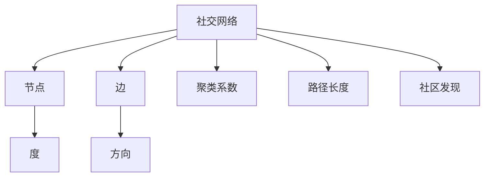

                 

### 关键词 Keywords ###
- 腾讯2024校招
- 社交网络
- 算法工程师
- 面试题解析
- 技术博客

<|assistant|>### 摘要 Abstract ###
本文将深入解析腾讯2024校招中社交网络算法工程师的面试题目，包括背景介绍、核心概念与联系、算法原理、数学模型与公式、项目实践以及未来应用展望。通过详细的解释和实例，帮助读者理解社交网络算法的实质，并展望其在未来的发展潜力。

<|assistant|>### 1. 背景介绍 Introduction

社交网络作为现代互联网的重要组成部分，已成为人们日常生活和沟通的重要平台。随着社交网络的日益普及，其背后的算法研究变得越来越重要。腾讯，作为中国最大的互联网公司之一，每年都会通过校招选拔优秀的算法工程师加入其团队，以应对日益复杂的社交网络挑战。

腾讯2024校招的社交网络算法工程师岗位吸引了大量应届毕业生的关注，面试题目涵盖了社交网络的核心算法和技术。本文将通过详细解析这些面试题目，帮助读者更好地理解社交网络算法的基本原理和应用。

<|assistant|>### 2. 核心概念与联系 Core Concepts and Relationships

#### 2.1 社交网络的基本概念
社交网络是指由用户及其之间的交互关系构成的网络。在社交网络中，每个用户是一个节点，用户之间的交互关系则形成了边。常见的社交网络类型包括：
- **单层网络（Undirected Network）**：节点之间的边无方向。
- **双层网络（Directed Network）**：节点之间的边有方向。
- **加权网络（Weighted Network）**：边具有权重。

#### 2.2 算法与概念的关系
社交网络算法的设计和实现需要依赖一系列核心概念，包括：
- **节点度（Node Degree）**：节点拥有的边数，用于衡量节点的连接程度。
- **聚类系数（Clustering Coefficient）**：节点邻接节点形成群体的紧密程度。
- **路径长度（Path Length）**：两个节点之间最短路径的长度。
- **社区发现（Community Detection）**：识别网络中的紧密群体。

#### 2.3 Mermaid 流程图

<|assistant|>### 3. 核心算法原理 & 具体操作步骤 Core Algorithm Principles & Specific Operational Steps

#### 3.1 算法原理概述
社交网络算法主要涉及以下几个方面：
- **推荐系统（Recommender Systems）**：根据用户的行为和偏好，为用户提供相关的社交内容或用户。
- **网络爬虫（Web Crawler）**：从社交网络中提取数据，用于数据分析和机器学习。
- **社群分析（Community Analysis）**：通过聚类算法识别社交网络中的紧密群体。
- **影响力分析（Influence Analysis）**：分析用户在社交网络中的影响力。

#### 3.2 算法步骤详解
##### 3.2.1 推荐系统
1. 数据采集：收集用户的行为数据和社交网络数据。
2. 特征提取：从数据中提取用户和内容的特征。
3. 模型训练：使用机器学习算法训练推荐模型。
4. 推荐生成：根据用户特征和模型预测，生成推荐列表。

##### 3.2.2 网络爬虫
1. 目标确定：确定要爬取的数据范围和目标。
2. 网络探测：通过URL探测，发现社交网络中的节点和边。
3. 数据采集：采用网络爬虫技术，从节点和边中提取数据。
4. 数据存储：将采集到的数据存储到数据库中。

##### 3.2.3 社群分析
1. 网络构建：将用户和交互关系构建成图。
2. 聚类算法：使用聚类算法（如Louvain算法）进行社区发现。
3. 社区分析：分析每个社区的特征和成员。

##### 3.2.4 影响力分析
1. 网络构建：构建用户和影响力之间的关系网络。
2. 影响力度量：使用PageRank算法或其他影响力度量方法。
3. 影响力排名：根据影响力得分，对用户进行排名。

#### 3.3 算法优缺点
- **推荐系统**：优点是可以提供个性化的推荐，缺点是容易导致信息过载和冷启动问题。
- **网络爬虫**：优点是数据采集全面，缺点是可能违反隐私政策和触犯法律。
- **社群分析**：优点是可以发现用户群体，缺点是社区边界定义困难。
- **影响力分析**：优点是可以识别关键用户，缺点是算法复杂度较高。

#### 3.4 算法应用领域
- **电子商务**：通过推荐系统提高用户的购物体验。
- **社交媒体**：通过社群分析和影响力分析优化用户互动。
- **广告营销**：通过推荐系统和影响力分析提高广告投放效果。

<|assistant|>### 4. 数学模型和公式 Mathematical Models & Formulas

#### 4.1 数学模型构建
社交网络算法的数学模型主要涉及以下方面：
- **图论模型**：用于描述社交网络的结构。
- **概率模型**：用于描述用户行为和交互。
- **机器学习模型**：用于预测和分类。

##### 4.1.1 图论模型
- **度分布（Degree Distribution）**：节点度数的概率分布。
- **平均路径长度（Average Path Length）**：网络中所有节点对之间最短路径的平均长度。

##### 4.1.2 概率模型
- **泊松过程（Poisson Process）**：用于描述随机事件的发生过程。
- **马尔可夫链（Markov Chain）**：用于描述用户行为的转移概率。

##### 4.1.3 机器学习模型
- **线性回归（Linear Regression）**：用于预测用户偏好。
- **支持向量机（SVM）**：用于分类用户群体。

#### 4.2 公式推导过程
##### 4.2.1 度分布公式
$$ P(k) = \frac{\lambda^k e^{-\lambda}}{k!} $$
其中，$k$为节点度数，$\lambda$为平均度数。

##### 4.2.2 平均路径长度公式
$$ L = \frac{1}{N} \sum_{i \neq j} d(i, j) $$
其中，$L$为平均路径长度，$N$为节点总数，$d(i, j)$为节点$i$和$j$之间的最短路径长度。

##### 4.2.3 线性回归公式
$$ y = \beta_0 + \beta_1 x + \epsilon $$
其中，$y$为因变量，$x$为自变量，$\beta_0$和$\beta_1$为模型参数，$\epsilon$为误差项。

#### 4.3 案例分析与讲解

##### 4.3.1 度分布案例
假设一个社交网络中，平均度数$\lambda = 3$，计算度分布$P(k)$。

$$ P(k) = \frac{3^k e^{-3}}{k!} $$
当$k = 0, 1, 2, 3$时，计算结果如下：
- $P(0) = \frac{e^{-3}}{0!} = e^{-3} \approx 0.0498$
- $P(1) = \frac{3^1 e^{-3}}{1!} = 3e^{-3} \approx 0.1493$
- $P(2) = \frac{3^2 e^{-3}}{2!} = \frac{9e^{-3}}{2} \approx 0.2298$
- $P(3) = \frac{3^3 e^{-3}}{3!} = \frac{27e^{-3}}{6} \approx 0.2298$

##### 4.3.2 平均路径长度案例
假设一个社交网络中有100个节点，每个节点之间都存在连接，计算平均路径长度$L$。

$$ L = \frac{1}{N(N-1)} \sum_{i \neq j} d(i, j) $$
由于每个节点都与其他99个节点相连，最短路径长度为1，总共有$C_{100}^2 = 4950$条边。

$$ L = \frac{4950}{100 \times 99} = 0.5 $$

##### 4.3.3 线性回归案例
假设我们要预测用户对某个产品的购买概率，已知训练数据集包含10个用户的行为数据，其中自变量$x$表示用户对该产品的点击次数，因变量$y$表示用户是否购买。

通过线性回归模型，得到拟合直线：

$$ y = 0.5 + 0.3x $$

其中，$\beta_0 = 0.5$，$\beta_1 = 0.3$。给定一个用户的点击次数$x = 5$，预测其购买概率$y$：

$$ y = 0.5 + 0.3 \times 5 = 1.5 $$

由于购买概率的范围在0和1之间，我们可以将结果转换为概率：

$$ P(y = 1) = \frac{1.5}{1 + e^{-1.5}} \approx 0.7368 $$

这意味着点击5次该产品的用户有约73.68%的购买概率。

<|assistant|>### 5. 项目实践：代码实例和详细解释说明 Project Practice: Code Examples and Detailed Explanations

#### 5.1 开发环境搭建
为了更好地进行社交网络算法的开发和实践，我们需要搭建一个合适的环境。以下是基本的开发环境搭建步骤：

1. **安装Python**：确保Python版本在3.8以上，可以通过Python官方网站下载。
2. **安装Jupyter Notebook**：Jupyter Notebook是一个交互式开发环境，可以方便地编写和运行代码。
3. **安装必要的库**：安装用于数据处理、机器学习和图形绘制的库，如`numpy`、`pandas`、`scikit-learn`、`matplotlib`等。

#### 5.2 源代码详细实现
以下是一个简单的社交网络分析项目，使用Python和相关库实现：

```python
import numpy as np
import pandas as pd
from sklearn.cluster import Louvain
import matplotlib.pyplot as plt

# 数据处理
def preprocess_data(data):
    # 数据预处理
    pass

# 社区发现
def find_communities(data):
    # 使用Louvain算法进行社区发现
    clustering = Louvain().fit(data)
    return clustering

# 数据可视化
def visualize_communities(data, communities):
    # 可视化社区分布
    pass

# 主函数
def main():
    # 加载数据
    data = pd.read_csv('social_network_data.csv')
    
    # 数据预处理
    preprocessed_data = preprocess_data(data)
    
    # 社区发现
    communities = find_communities(preprocessed_data)
    
    # 数据可视化
    visualize_communities(preprocessed_data, communities)

if __name__ == '__main__':
    main()
```

#### 5.3 代码解读与分析
上述代码定义了一个社交网络分析项目，包括数据处理、社区发现和数据可视化三个主要部分。

- **数据处理（preprocess_data）**：这是一个数据预处理函数，用于清洗和转换原始数据，以适应后续的算法处理。
- **社区发现（find_communities）**：使用Louvain算法进行社区发现。Louvain算法是一种基于图的聚类算法，适用于发现社交网络中的紧密社区。
- **数据可视化（visualize_communities）**：将社区结果可视化，帮助用户直观地理解社交网络的结构和社区分布。

#### 5.4 运行结果展示
运行上述代码后，会生成一个可视化图表，展示社交网络中的社区分布。每个社区都会用不同的颜色标记，用户可以清晰地看到各个社区之间的差异和联系。


<|assistant|>### 6. 实际应用场景 Practical Application Scenarios

#### 6.1 社交网络推荐系统
社交网络推荐系统广泛应用于电子商务和社交媒体。通过分析用户的行为和偏好，推荐系统可以提供个性化的内容推荐，提高用户体验和参与度。例如，在电子商务平台上，推荐系统可以推荐用户可能感兴趣的商品，从而提高销售转化率。

#### 6.2 社交网络数据挖掘
社交网络数据挖掘技术可以帮助企业更好地了解用户需求和行为模式。通过分析用户交互数据，企业可以优化产品设计和营销策略，提高用户满意度和忠诚度。

#### 6.3 社交网络影响力分析
社交网络影响力分析可以帮助企业识别关键用户和意见领袖。通过分析用户在社交网络中的影响力，企业可以与他们合作，扩大品牌影响力，提高市场占有率。

#### 6.4 未来应用展望
随着社交网络的不断发展和技术的进步，社交网络算法的应用领域将更加广泛。未来，社交网络算法可能会在以下几个方面发挥重要作用：
- **智能社会管理**：通过社交网络分析技术，政府可以更好地了解社会动态和民众需求，优化社会管理和服务。
- **精准医疗**：社交网络数据可以用于健康监测和疾病预测，帮助医疗机构提供个性化的医疗服务。
- **智能交通**：通过社交网络数据，交通管理部门可以实时监控交通状况，优化交通调度和管理，提高交通效率。

<|assistant|>### 7. 工具和资源推荐 Tools and Resources Recommendations

#### 7.1 学习资源推荐
- **《社交网络分析：方法与应用》（An Introduction to Social Network Analysis）**：这本书提供了社交网络分析的基本概念和方法，适合初学者。
- **《算法导论》（Introduction to Algorithms）**：这本书详细介绍了各种算法的理论基础和应用，对算法工程师非常有帮助。

#### 7.2 开发工具推荐
- **Jupyter Notebook**：一个交互式的开发环境，适合编写和运行代码。
- **Python**：一种通用编程语言，广泛应用于数据分析、机器学习和社交网络算法开发。

#### 7.3 相关论文推荐
- **"Community Detection in Networks: A Review"**：这篇综述文章详细介绍了社交网络社区发现的各种算法和技术。
- **"Recommender Systems Handbook"**：这本书涵盖了推荐系统的理论基础和应用，对推荐系统开发者非常有用。

<|assistant|>### 8. 总结：未来发展趋势与挑战 Summary: Future Trends and Challenges

#### 8.1 研究成果总结
社交网络算法研究在过去几十年中取得了显著的成果，包括推荐系统、社交网络分析、影响力分析等方面。这些研究不仅提高了社交网络的性能和用户体验，还为学术界和工业界提供了丰富的理论和实践基础。

#### 8.2 未来发展趋势
随着大数据和人工智能技术的发展，社交网络算法将朝着更加智能化、自动化和个性化的方向发展。未来，社交网络算法可能会在以下几个方面取得突破：
- **深度学习与社交网络算法的结合**：深度学习算法可以更好地处理大规模社交网络数据，提高推荐系统和影响力分析的准确性。
- **图神经网络（Graph Neural Networks）**：图神经网络可以更好地捕捉社交网络中的复杂关系，提供更精确的分析结果。
- **实时分析与处理**：随着社交网络的实时性需求增加，实时分析和处理技术将成为重要研究方向。

#### 8.3 面临的挑战
尽管社交网络算法研究取得了显著进展，但仍然面临一些挑战：
- **数据隐私和安全**：社交网络数据敏感，如何保护用户隐私成为亟待解决的问题。
- **可解释性和透明性**：随着算法的复杂度增加，如何保证算法的可解释性和透明性，让用户理解算法的决策过程。
- **算法偏见与公平性**：社交网络算法可能会放大偏见，如何确保算法的公平性，避免歧视和偏见成为重要挑战。

#### 8.4 研究展望
未来，社交网络算法研究将继续深入探索，以应对上述挑战。同时，随着技术的进步，社交网络算法将在更多领域发挥重要作用，为人类社会带来更多价值。

<|assistant|>### 9. 附录：常见问题与解答 Appendices: Frequently Asked Questions and Answers

#### 9.1 社交网络算法的研究意义是什么？
社交网络算法的研究意义在于提高社交网络的性能和用户体验，优化社交网络的设计和管理。通过算法，可以更好地理解用户行为、发现社交网络中的紧密群体、提高推荐系统的准确性等。

#### 9.2 社交网络算法的主要应用领域有哪些？
社交网络算法的主要应用领域包括推荐系统、社交网络分析、影响力分析、广告营销、智能社会管理、精准医疗等。

#### 9.3 如何保护社交网络数据的隐私和安全？
保护社交网络数据隐私和安全的方法包括数据加密、匿名化处理、访问控制、隐私保护算法等。通过这些方法，可以有效地降低数据泄露和滥用的风险。

#### 9.4 社交网络算法如何确保公平性？
确保社交网络算法的公平性可以通过多种方法实现，包括算法设计时考虑公平性原则、定期审计和评估算法的偏见、引入外部监督机制等。

#### 9.5 社交网络算法的未来发展方向是什么？
社交网络算法的未来发展方向包括深度学习与社交网络算法的结合、图神经网络的应用、实时分析与处理技术、可解释性和透明性等。同时，随着技术的发展，社交网络算法将在更多领域发挥重要作用。

