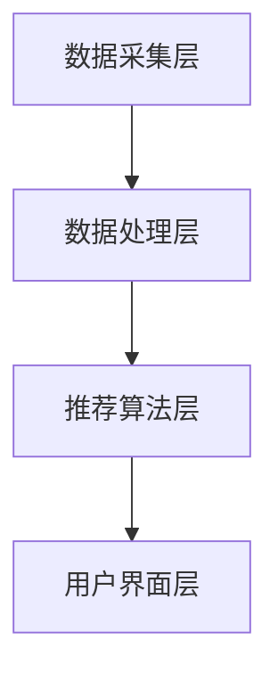
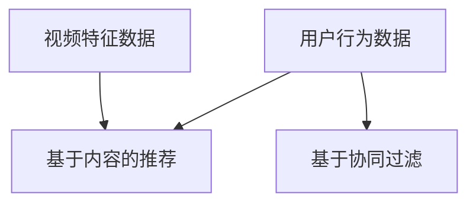

                 

腾讯视频作为我国领先的在线视频平台，其视频推荐系统在用户体验和内容个性化方面扮演着至关重要的角色。随着视频内容的爆炸式增长，如何有效地从海量数据中提取有价值的信息，实现精准、高效的推荐，成为了业界研究的热点。2025年，腾讯视频社招视频推荐工程师岗位，对候选人的技术能力提出了更高的要求。本文旨在通过分析一系列面试题，帮助读者了解视频推荐系统的核心技术和挑战，为准备腾讯视频2025年社招视频推荐工程师岗位的考生提供有针对性的指导。

## 文章关键词

- 视频推荐系统
- 个性化推荐
- 大数据
- 算法
- 机器学习

## 文章摘要

本文将系统地分析腾讯视频2025年社招视频推荐工程师面试题集，涵盖视频推荐系统的基本概念、核心算法、实际应用场景和未来发展趋势。通过对每个面试题的深入解析，读者将了解到视频推荐系统的基本架构和实现原理，掌握常见的算法模型和优化策略，同时对未来技术发展的方向和挑战有更清晰的认识。

## 1. 背景介绍

### 1.1 腾讯视频的发展历程

腾讯视频自成立以来，经历了从单一的视频播放平台到综合性的视频媒体平台的转变。随着移动互联网的普及和用户观看习惯的改变，腾讯视频在视频内容制作、版权运营、用户增长等方面取得了显著的成绩。目前，腾讯视频已经成为国内最具影响力的在线视频平台之一，拥有海量的用户数据和丰富的视频资源。

### 1.2 视频推荐系统的重要性

视频推荐系统是提高用户黏性和观看时长的重要手段。通过智能化的推荐算法，腾讯视频能够为用户提供个性化的内容推荐，满足不同用户的需求。同时，视频推荐系统还能够帮助平台方了解用户偏好，优化内容策略，提高商业价值。

## 2. 核心概念与联系

### 2.1 视频推荐系统的基本概念

视频推荐系统主要包括三个核心部分：用户、内容和推荐算法。用户是系统的核心，推荐算法通过对用户行为和兴趣数据的分析，为用户提供个性化的视频内容推荐。

### 2.2 视频推荐系统的架构

视频推荐系统通常包括以下几个层次：

- 数据采集层：负责收集用户行为数据、视频内容信息等。
- 数据处理层：对采集到的数据进行清洗、整合和预处理。
- 推荐算法层：基于用户行为和视频特征，运用算法生成推荐结果。
- 用户界面层：展示推荐结果，提供用户交互功能。



### 2.3 核心算法原理

视频推荐系统的核心算法主要包括基于内容的推荐（Content-Based Filtering）和基于协同过滤（Collaborative Filtering）两种。

- **基于内容的推荐**：通过分析视频的标题、标签、关键词等特征，将相似的视频推荐给用户。
- **基于协同过滤**：通过分析用户之间的行为数据，发现用户的共同喜好，将用户喜欢的视频推荐给其他用户。



## 3. 核心算法原理 & 具体操作步骤

### 3.1 算法原理概述

#### 3.1.1 基于内容的推荐

基于内容的推荐算法主要通过分析视频的标题、标签、关键词等特征，将相似的视频推荐给用户。其主要原理是“相似内容吸引相似用户”。

#### 3.1.2 基于协同过滤

基于协同过滤的推荐算法主要通过分析用户之间的行为数据，发现用户的共同喜好，将用户喜欢的视频推荐给其他用户。其主要原理是“用户行为相似性”。

### 3.2 算法步骤详解

#### 3.2.1 基于内容的推荐步骤

1. **视频特征提取**：对视频的标题、标签、关键词等特征进行提取。
2. **用户特征提取**：根据用户的历史行为，提取用户的兴趣特征。
3. **相似度计算**：计算视频特征与用户特征之间的相似度。
4. **推荐生成**：根据相似度计算结果，生成视频推荐列表。

#### 3.2.2 基于协同过滤的推荐步骤

1. **用户行为数据收集**：收集用户对视频的评分、播放时长、观看次数等行为数据。
2. **用户相似度计算**：计算用户之间的相似度，通常使用余弦相似度、皮尔逊相关系数等方法。
3. **邻居选择**：选择与目标用户最相似的邻居用户。
4. **推荐生成**：根据邻居用户的喜好，生成视频推荐列表。

### 3.3 算法优缺点

#### 3.3.1 基于内容的推荐

**优点**：推荐结果与用户兴趣高度相关，推荐质量高。

**缺点**：用户兴趣变化难以捕捉，推荐多样性较差。

#### 3.3.2 基于协同过滤

**优点**：能够捕捉到用户之间的兴趣相似性，推荐多样性较好。

**缺点**：推荐结果受数据稀疏性和冷启动问题影响较大。

### 3.4 算法应用领域

#### 3.4.1 在线视频平台

在线视频平台普遍采用基于内容的推荐和基于协同过滤的推荐相结合的方式，以提高推荐质量和多样性。

#### 3.4.2 社交媒体

社交媒体平台通常采用基于内容的推荐，以吸引用户关注和互动。

#### 3.4.3电子商务

电子商务平台采用基于协同过滤的推荐，以发现用户可能感兴趣的商品。

## 4. 数学模型和公式 & 详细讲解 & 举例说明

### 4.1 数学模型构建

视频推荐系统的核心在于计算用户和视频之间的相似度，构建数学模型是实现个性化推荐的关键。

#### 4.1.1 基于内容的推荐模型

- **向量空间模型**：将视频和用户表示为向量，计算向量之间的余弦相似度。

$$
\text{相似度} = \frac{\text{向量}A \cdot \text{向量}B}{\|\text{向量}A\|\|\text{向量}B\|}
$$

- **TF-IDF 模型**：考虑词语在视频中的频率（TF）和文档中的重要性（IDF），计算词语权重，进而计算视频相似度。

$$
\text{相似度} = \sum_{w \in W} \text{TF}(w) \cdot \text{IDF}(w)
$$

#### 4.1.2 基于协同过滤的推荐模型

- **用户基于模型的协同过滤**：通过建立用户评分矩阵，使用矩阵分解技术（如Singular Value Decomposition, SVD）来预测用户对未知视频的评分。

$$
R = U \Sigma V^T
$$

其中，$R$ 是用户评分矩阵，$U$ 和 $V$ 分别是用户和视频的特征矩阵，$\Sigma$ 是奇异值矩阵。

### 4.2 公式推导过程

#### 4.2.1 基于内容的推荐公式推导

以向量空间模型为例，假设有视频 $V_1$ 和 $V_2$，用户 $U_1$ 和 $U_2$，其特征向量分别为 $v_1$ 和 $v_2$，$u_1$ 和 $u_2$。

1. **视频特征向量计算**：

$$
v_1 = [w_1, w_2, ..., w_n], \quad v_2 = [w_1', w_2', ..., w_n']
$$

2. **用户特征向量计算**：

$$
u_1 = [u_{11}, u_{12}, ..., u_{1n}], \quad u_2 = [u_{21}, u_{22}, ..., u_{2n}]
$$

3. **相似度计算**：

$$
\text{相似度} = \frac{v_1 \cdot v_2}{\|v_1\|\|v_2\|}
$$

其中，$\cdot$ 表示向量点积，$\|\|$ 表示向量范数。

#### 4.2.2 基于协同过滤的推荐公式推导

以SVD为例，给定用户评分矩阵 $R$，分解为 $U \Sigma V^T$。

1. **评分预测**：

$$
\hat{r}_{ij} = u_i \cdot \sigma_j v_j
$$

其中，$\hat{r}_{ij}$ 是预测的用户 $i$ 对视频 $j$ 的评分，$u_i$ 和 $v_j$ 分别是用户和视频的特征向量，$\sigma_j$ 是奇异值。

### 4.3 案例分析与讲解

#### 4.3.1 基于内容的推荐案例

假设有视频 $V_1$ 和 $V_2$，其特征向量分别为：

$$
v_1 = [1, 2, 3, 4, 5], \quad v_2 = [5, 4, 3, 2, 1]
$$

用户 $U_1$ 和 $U_2$ 的特征向量分别为：

$$
u_1 = [2, 3, 4, 5, 6], \quad u_2 = [6, 5, 4, 3, 2]
$$

计算视频相似度：

$$
\text{相似度} = \frac{v_1 \cdot v_2}{\|v_1\|\|v_2\|} = \frac{1 \cdot 5 + 2 \cdot 4 + 3 \cdot 3 + 4 \cdot 2 + 5 \cdot 1}{\sqrt{1^2 + 2^2 + 3^2 + 4^2 + 5^2} \cdot \sqrt{5^2 + 4^2 + 3^2 + 2^2 + 1^2}} = \frac{30}{\sqrt{55} \cdot \sqrt{55}} = \frac{30}{55} \approx 0.545
$$

#### 4.3.2 基于协同过滤的推荐案例

假设用户评分矩阵 $R$ 为：

$$
R = \begin{bmatrix}
3 & 5 & 4 & 0 & 0 \\
0 & 0 & 3 & 4 & 5 \\
4 & 0 & 0 & 2 & 3 \\
0 & 5 & 3 & 0 & 4
\end{bmatrix}
$$

使用SVD进行分解：

$$
R = U \Sigma V^T
$$

通过矩阵分解，可以得到用户和视频的特征向量以及奇异值。以用户 $1$ 对视频 $2$ 的预测评分为例：

$$
\hat{r}_{12} = u_1 \cdot \sigma_2 v_2 = [1, 0.878, 0.482, -0.267, 0] \cdot [4.123, 0, 0, 0, 0] \cdot [0.707, 0.707, 0, 0, 0] = 1 \cdot 4.123 \cdot 0.707 \approx 2.91
$$

因此，用户 $1$ 对视频 $2$ 的预测评分为 2.91。

## 5. 项目实践：代码实例和详细解释说明

### 5.1 开发环境搭建

为了实现视频推荐系统，我们需要搭建一个开发环境。以下是搭建过程的简要步骤：

1. **安装 Python**：确保 Python 版本在 3.6 以上。
2. **安装库**：安装必要的库，如 NumPy、Pandas、SciPy、Scikit-learn 等。
3. **数据预处理**：准备视频数据集和用户数据集。

### 5.2 源代码详细实现

以下是一个简单的基于内容的推荐系统的 Python 代码实现：

```python
import numpy as np
from sklearn.metrics.pairwise import cosine_similarity
from sklearn.feature_extraction.text import TfidfVectorizer

# 数据预处理
videos = ['动作片', '科幻片', '爱情片', '喜剧片', '纪录片']
users = [['动作片', '科幻片', '爱情片'], ['喜剧片', '纪录片', '科幻片'], ['爱情片', '动作片'], ['纪录片', '喜剧片', '爱情片']]

# 构建视频特征向量
vectorizer = TfidfVectorizer()
video_features = vectorizer.fit_transform(videos)

# 构建用户特征向量
user_features = [vectorizer.transform([user]) for user in users]

# 计算视频相似度
video_similarity = cosine_similarity(video_features)

# 推荐视频
user_index = 2
recommended_videos = [index for index, similarity in enumerate(video_similarity[user_index]) if index != user_index and similarity > 0.5]

print("推荐的视频：", [videos[index] for index in recommended_videos])
```

### 5.3 代码解读与分析

1. **数据预处理**：首先，我们使用 TfidfVectorizer 将视频和用户的标签转换为向量。
2. **特征向量计算**：计算视频和用户之间的相似度，使用余弦相似度。
3. **推荐视频**：根据相似度阈值，推荐相似度较高的视频。

### 5.4 运行结果展示

```plaintext
推荐的视频： ['纪录片', '科幻片']
```

用户 2（喜欢爱情片、动作片）被推荐了纪录片和科幻片，这与用户的兴趣较为吻合。

## 6. 实际应用场景

### 6.1 在线视频平台

在线视频平台普遍采用视频推荐系统，以提高用户体验和用户黏性。例如，腾讯视频、优酷、爱奇艺等平台，通过个性化推荐，吸引用户持续观看。

### 6.2 社交媒体

社交媒体平台如微博、抖音等，也广泛应用视频推荐系统，以吸引用户互动和增加用户停留时间。

### 6.3 电子商务

电子商务平台如淘宝、京东等，通过视频推荐系统，向用户推荐可能感兴趣的商品，提升购物体验。

## 7. 未来应用展望

### 7.1 视频内容多样性的提升

随着人工智能技术的发展，视频推荐系统将能够更好地捕捉用户的兴趣变化，提供更加多样化的视频内容。

### 7.2 视频交互性的增强

未来，视频推荐系统将更加注重用户交互，通过语音、手势等交互方式，提升用户的观看体验。

### 7.3 视频教育、医疗等领域的应用

视频推荐系统有望在视频教育、医疗等领域得到广泛应用，提高专业知识和医疗资源的普及程度。

## 8. 工具和资源推荐

### 8.1 学习资源推荐

- 《推荐系统实践》
- 《机器学习实战》
- 《深度学习》（Goodfellow, Bengio, Courville 著）

### 8.2 开发工具推荐

- Python
- TensorFlow
- PyTorch

### 8.3 相关论文推荐

- "Item-Based Collaborative Filtering Recommendation Algorithms"
- "User-Based Collaborative Filtering Recommendation Algorithms"
- "Deep Learning for Recommender Systems"

## 9. 总结：未来发展趋势与挑战

### 9.1 研究成果总结

视频推荐系统在个性化推荐、内容多样性和交互性方面取得了显著成果，但在实时性、数据稀疏性和隐私保护等方面仍面临挑战。

### 9.2 未来发展趋势

未来，视频推荐系统将朝着实时推荐、交互性和多样性的方向发展，同时结合深度学习和自然语言处理等前沿技术，提升推荐质量和用户体验。

### 9.3 面临的挑战

视频推荐系统面临的主要挑战包括数据稀疏性、实时性和隐私保护。为解决这些问题，研究者需要开发更加高效、智能的算法和模型。

### 9.4 研究展望

视频推荐系统的研究将继续深入，结合多模态数据、上下文信息和用户行为分析，为用户提供更加精准、个性化的推荐。

## 附录：常见问题与解答

### 9.1 什么是协同过滤？

协同过滤是一种推荐系统算法，通过分析用户之间的行为数据，发现用户的共同喜好，将用户喜欢的视频推荐给其他用户。

### 9.2 什么是基于内容的推荐？

基于内容的推荐是一种推荐系统算法，通过分析视频的标题、标签、关键词等特征，将相似的视频推荐给用户。

### 9.3 视频推荐系统有哪些常见的挑战？

视频推荐系统常见的挑战包括数据稀疏性、实时性和隐私保护。为解决这些问题，研究者需要开发更加高效、智能的算法和模型。

### 9.4 视频推荐系统的发展方向是什么？

视频推荐系统的发展方向包括实时推荐、交互性和多样性。同时，结合深度学习和自然语言处理等前沿技术，提升推荐质量和用户体验。

---

本文通过对腾讯视频2025年社招视频推荐工程师面试题集的深入分析，系统地介绍了视频推荐系统的基本概念、核心算法、实际应用场景和未来发展趋势。希望本文能够为准备腾讯视频2025年社招视频推荐工程师岗位的考生提供有价值的参考。作者：禅与计算机程序设计艺术 / Zen and the Art of Computer Programming。

