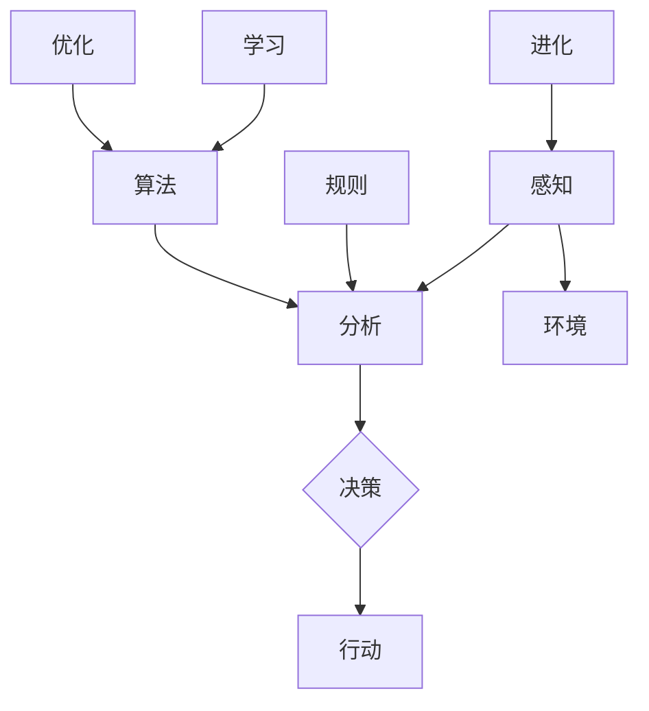

                 

 在人工智能与自动化系统飞速发展的今天，我们正逐步迈向一个全新的时代——自主系统时代。这一时代，系统不再被动地响应指令，而是能够自主地做出决策和行动，极大地提高了生产效率和服务质量。然而，这一变革也引发了一个深层次的问题：自主系统是否能够具备意识功能？如果可以，它们又是如何实现与人类意识的互动？本文将深入探讨这一问题，并试图回答这些关键性问题。

> **关键词：** 自主系统、意识功能、人工智能、互动

> **摘要：** 本文从自主系统的定义和特点入手，探讨了意识功能的核心概念及其与自主系统的潜在联系。通过分析自主系统与人类意识互动的机制，文章提出了一些关键算法原理和应用场景，并展示了如何通过数学模型和具体代码实例来实现这一互动。最后，文章讨论了这一领域的未来发展趋势和面临的挑战。

## 1. 背景介绍

### 1.1 自主系统的崛起

自主系统是指能够在无需人为干预的情况下，自主地完成特定任务的系统。随着计算机技术、传感器技术和算法的不断发展，自主系统已经从理论走向现实。从工业自动化生产线到自动驾驶汽车，从智能家居到智能城市，自主系统正在改变着我们的生活方式。

自主系统的崛起带来了巨大的社会和经济效益。首先，它们能够大幅提高生产效率，降低生产成本。例如，机器人可以在生产线中执行重复性、危险或高精度的任务，从而减少人为操作的失误和工伤风险。其次，自主系统能够提供更加个性化和高效的服务。比如，智能客服系统能够根据用户的需求和偏好，提供实时、准确的咨询和服务。

### 1.2 意识功能的探索

意识功能是指系统或个体具备的感知、思考、决策和行动的能力。在人类中，意识功能使我们能够理解周围的世界，做出合理的决策，并采取行动。随着神经科学和认知科学的发展，人们对意识功能的理解越来越深入。

近年来，意识功能的探索也扩展到了人工智能领域。尽管目前的人工智能系统还远未达到人类的意识水平，但研究人员正在努力模拟意识的某些方面，如感知、学习和决策。例如，深度学习算法可以通过大量的数据学习到复杂模式，并在新的场景中做出合理的决策。

### 1.3 自主系统与意识功能的互动

随着自主系统和意识功能的不断发展，两者之间的互动也成为了一个热门的研究方向。自主系统是否能够具备意识功能？如果可以，它们又是如何与人类意识互动？这些问题的答案不仅对理论研究具有重要意义，也可能带来实际的应用价值。

首先，自主系统与意识功能的互动有助于提高系统的智能水平。通过模拟意识功能，自主系统可以更加灵活地适应复杂环境，做出更加合理的决策。其次，这种互动也可以促进人类与机器的协同工作，实现人机共生。

本文将围绕这些问题展开讨论，首先介绍自主系统和意识功能的核心概念，然后分析两者之间的互动机制，最后探讨实际应用场景和未来发展趋势。

## 2. 核心概念与联系

### 2.1 自主系统的核心概念

自主系统是指能够自主决策和执行任务的系统，具有以下核心特点：

- **自主性**：自主系统在执行任务时，不需要人为干预，能够自主地感知环境、分析数据、做出决策和执行动作。
- **适应性**：自主系统能够根据环境的变化，自主地调整其行为和策略，以实现任务的完成。
- **自学习能力**：自主系统可以通过学习算法，从经验和数据中不断优化其性能，提高任务完成的效率和质量。

### 2.2 意识功能的核心概念

意识功能是指个体或系统能够感知、思考、决策和行动的能力，具有以下核心特点：

- **感知**：意识功能能够感知外部环境，获取信息，并对其进行处理。
- **思考**：意识功能能够对感知到的信息进行思考，形成概念和判断。
- **决策**：意识功能能够根据思考的结果，做出合理的决策。
- **行动**：意识功能能够指导个体或系统采取行动，以实现特定的目标。

### 2.3 自主系统与意识功能的联系

自主系统和意识功能之间的联系体现在多个方面：

- **感知能力**：自主系统通过传感器等设备，获取外部环境的信息，这与意识功能的感知能力相似。
- **决策能力**：自主系统通过算法，对获取的信息进行分析和决策，这与意识功能的思考能力和决策能力类似。
- **行动能力**：自主系统根据决策结果，执行具体的动作，这与意识功能的行动能力相同。

然而，自主系统和意识功能之间也存在明显的区别：

- **自主性**：自主系统在执行任务时，需要依赖预定的算法和规则，而意识功能则具有更高的灵活性和创造力。
- **学习与进化**：自主系统通过学习算法，逐步优化其性能，但意识功能具有更高级别的学习和进化能力。

为了更好地理解自主系统和意识功能之间的互动，我们可以使用Mermaid流程图来展示它们的核心概念和联系。以下是一个简单的Mermaid流程图示例：



在上述流程图中，`A`表示感知，`B`表示分析，`C`表示决策，`D`表示行动，`E`表示环境，`F`表示规则，`G`表示算法，`H`表示进化，`I`表示学习，`J`表示优化。通过这个流程图，我们可以清晰地看到自主系统和意识功能的核心概念和它们之间的互动。

## 3. 核心算法原理 & 具体操作步骤

### 3.1 算法原理概述

自主系统和意识功能的互动需要依赖于一系列核心算法。这些算法主要包括感知算法、决策算法和行动算法。以下是对这些算法的原理进行概述：

- **感知算法**：感知算法用于获取外部环境的信息。这些信息可以是图像、声音、温度、湿度等多种形式。感知算法的核心任务是准确、快速地提取有用的信息，为后续的决策提供依据。

- **决策算法**：决策算法基于感知算法提供的信息，对系统当前的状态进行分析，并选择最优的行动方案。常见的决策算法包括基于规则的决策、基于模型的决策和基于学习的决策。

- **行动算法**：行动算法根据决策算法的结果，执行具体的行动。行动算法需要考虑系统的资源限制、环境变化和任务目标，以确保行动的准确性和有效性。

### 3.2 算法步骤详解

为了实现自主系统和意识功能的互动，我们需要详细描述这些核心算法的操作步骤。以下是感知算法、决策算法和行动算法的具体操作步骤：

#### 感知算法步骤：

1. **初始化**：系统启动感知模块，准备开始感知外部环境。
2. **数据采集**：通过传感器或其他设备，采集外部环境的数据，如图像、声音、温度等。
3. **预处理**：对采集到的数据进行预处理，包括滤波、降噪、增强等，以提高数据的准确性。
4. **特征提取**：从预处理后的数据中提取关键特征，如边缘、纹理、声音频率等。
5. **信息融合**：将多个传感器获取的信息进行融合，形成统一的感知结果。

#### 决策算法步骤：

1. **状态评估**：根据感知算法提供的信息，评估系统的当前状态，包括位置、速度、方向等。
2. **目标识别**：识别系统的目标，如路径、障碍物、目标位置等。
3. **规则匹配**：根据预定的规则库，对当前状态和目标进行匹配，选择合适的行动方案。
4. **模型预测**：使用决策模型，对未来的状态进行预测，为决策提供依据。
5. **方案选择**：综合考虑当前状态、目标和模型预测结果，选择最优的行动方案。

#### 行动算法步骤：

1. **方案规划**：根据决策算法的结果，规划具体的行动步骤，包括移动、转向、加速等。
2. **执行动作**：根据规划的步骤，执行具体的动作，如控制机器人的运动、调节机器的参数等。
3. **反馈调整**：根据执行结果和环境变化，对行动方案进行反馈调整，以提高行动的准确性。
4. **持续监控**：在整个行动过程中，持续监控系统的状态，以确保行动的顺利进行。

### 3.3 算法优缺点

每种算法都有其独特的优缺点，以下是对感知算法、决策算法和行动算法的优缺点分析：

#### 感知算法优缺点：

- **优点**：感知算法能够实时获取外部环境的信息，为决策和行动提供依据。通过特征提取和信息融合，可以大大提高数据的准确性。
- **缺点**：感知算法对环境的变化有一定的延迟，且在复杂环境下，可能存在信息缺失或不准确的情况。

#### 决策算法优缺点：

- **优点**：决策算法可以根据多种信息来源，综合考虑当前状态和目标，选择最优的行动方案。通过模型预测，可以提高决策的准确性。
- **缺点**：决策算法依赖于预定的规则库和模型，可能在复杂和不确定的环境中，无法做出最优的决策。

#### 行动算法优缺点：

- **优点**：行动算法能够根据决策结果，执行具体的行动，实现系统的目标。通过反馈调整，可以提高行动的准确性。
- **缺点**：行动算法需要消耗大量的计算资源和时间，且在复杂和动态环境中，可能存在执行不准确的情况。

### 3.4 算法应用领域

感知算法、决策算法和行动算法在许多领域都有广泛的应用，以下是一些典型应用领域：

- **自动驾驶**：自动驾驶汽车需要通过感知算法获取道路信息，通过决策算法选择最优行驶路径，并通过行动算法控制车辆的运动。
- **智能家居**：智能家居系统通过感知算法监测家庭环境，通过决策算法控制家电设备，通过行动算法实现智能化的家庭管理。
- **机器人**：机器人需要通过感知算法获取环境信息，通过决策算法规划行动步骤，通过行动算法执行具体的任务。

通过上述分析，我们可以看到，自主系统和意识功能的互动是一个复杂的过程，涉及到感知、决策和行动等多个方面。通过设计和优化这些核心算法，可以实现更加智能化和自主化的系统。

## 4. 数学模型和公式 & 详细讲解 & 举例说明

### 4.1 数学模型构建

在自主系统和意识功能的互动中，数学模型起到了至关重要的作用。通过数学模型，我们可以定量地描述感知、决策和行动的过程，从而提高系统的智能化水平。以下是一个简单的数学模型构建过程。

#### 4.1.1 感知模型

感知模型用于描述系统对外部环境的感知过程。我们假设系统通过传感器获取了图像、声音和温度等数据。首先，我们对这些数据进行预处理，如滤波和降噪，以提高数据的准确性。然后，使用特征提取算法提取关键特征，如边缘和纹理。最后，使用信息融合算法将多个传感器获取的信息进行融合，形成统一的感知结果。

数学表示如下：

$$
X = f_{preprocess}(S) \quad \text{其中} \quad S \text{为原始数据，} f_{preprocess} \text{为预处理函数}
$$

$$
F = f_{extract}(X) \quad \text{其中} \quad X \text{为预处理后的数据，} f_{extract} \text{为特征提取函数}
$$

$$
I = f_{fuse}(F) \quad \text{其中} \quad F \text{为提取后的特征，} f_{fuse} \text{为信息融合函数}
$$

#### 4.1.2 决策模型

决策模型用于描述系统在感知结果的基础上进行决策的过程。我们假设系统需要根据当前状态和目标，选择最优的行动方案。首先，评估系统的当前状态，如位置、速度和方向等。然后，识别系统的目标，如路径和障碍物等。最后，通过规则匹配、模型预测和方案选择等步骤，选择最优的行动方案。

数学表示如下：

$$
S_t = f_{evaluate}(I) \quad \text{其中} \quad S_t \text{为当前状态，} f_{evaluate} \text{为状态评估函数}
$$

$$
G = f_{recognize}(I) \quad \text{其中} \quad G \text{为目标，} f_{recognize} \text{为目标识别函数}
$$

$$
P = f_{predict}(S_t, G) \quad \text{其中} \quad P \text{为预测结果，} f_{predict} \text{为模型预测函数}
$$

$$
A^* = f_{select}(P) \quad \text{其中} \quad A^* \text{为最优行动方案，} f_{select} \text{为方案选择函数}
$$

#### 4.1.3 行动模型

行动模型用于描述系统在决策结果的基础上执行行动的过程。我们假设系统根据最优行动方案，规划具体的行动步骤，如移动、转向和加速等。然后，根据这些步骤执行具体的行动，并通过反馈调整提高行动的准确性。

数学表示如下：

$$
T = f_{plan}(A^*) \quad \text{其中} \quad T \text{为行动步骤，} f_{plan} \text{为规划函数}
$$

$$
f_{execute}(T) \quad \text{其中} \quad f_{execute} \text{为执行函数}
$$

$$
S_{new} = f_{adjust}(S_t, T) \quad \text{其中} \quad S_{new} \text{为调整后的状态，} f_{adjust} \text{为调整函数}
$$

### 4.2 公式推导过程

在本节中，我们将详细推导感知、决策和行动模型中的关键公式。

#### 4.2.1 感知模型推导

首先，我们考虑感知模型中的预处理过程。预处理函数 $f_{preprocess}$ 可以表示为滤波和降噪的组合。假设我们使用的高斯滤波器参数为 $\sigma$，则滤波过程可以表示为：

$$
X_{filtered} = f_{filter}(X, \sigma) = \frac{1}{2\pi\sigma^2} \int_{-\infty}^{\infty} e^{-\frac{(x-\mu)^2}{2\sigma^2}} dx
$$

其中，$X$ 为原始数据，$X_{filtered}$ 为滤波后的数据，$\mu$ 和 $\sigma$ 分别为高斯分布的均值和标准差。

接下来，我们考虑降噪过程。假设我们使用的中值滤波器，则降噪过程可以表示为：

$$
X_{noised} = f_{noise}(X) = \text{median}(X, \text{window size})
$$

其中，$X_{noised}$ 为降噪后的数据，$\text{median}$ 为中值函数，$window size$ 为窗口大小。

最后，我们将滤波和降噪结果进行融合，得到预处理后的数据 $X$：

$$
X = f_{preprocess}(S) = X_{filtered} \odot X_{noised}
$$

其中，$\odot$ 表示元素乘法。

#### 4.2.2 决策模型推导

决策模型中的状态评估函数 $f_{evaluate}$ 可以表示为多个特征值的加权平均。假设我们使用以下特征：

- 位置 $x$
- 速度 $v$
- 方向 $\theta$

则状态评估函数可以表示为：

$$
S_t = f_{evaluate}(I) = w_1x + w_2v + w_3\theta
$$

其中，$w_1$、$w_2$ 和 $w_3$ 分别为位置、速度和方向的权重。

目标识别函数 $f_{recognize}$ 可以表示为对图像进行特征提取，并使用分类器进行识别。假设我们使用卷积神经网络（CNN）进行特征提取，分类器为支持向量机（SVM），则目标识别函数可以表示为：

$$
G = f_{recognize}(I) = \text{SVM}(f_{CNN}(I))
$$

其中，$f_{CNN}$ 为卷积神经网络，$\text{SVM}$ 为支持向量机。

模型预测函数 $f_{predict}$ 可以表示为基于当前状态和目标的预测。假设我们使用线性回归模型，则模型预测函数可以表示为：

$$
P = f_{predict}(S_t, G) = \text{Linear Regression}(S_t, G)
$$

方案选择函数 $f_{select}$ 可以表示为对预测结果进行优化，选择最优的方案。假设我们使用贪心算法，则方案选择函数可以表示为：

$$
A^* = f_{select}(P) = \text{Greedy Algorithm}(P)
$$

#### 4.2.3 行动模型推导

行动模型中的规划函数 $f_{plan}$ 可以表示为根据最优行动方案生成具体的行动步骤。假设我们使用如下行动步骤：

- 移动 $d$
- 转向 $\alpha$
- 加速 $a$

则规划函数可以表示为：

$$
T = f_{plan}(A^*) = (d, \alpha, a)
$$

执行函数 $f_{execute}$ 可以表示为根据行动步骤执行具体的行动。假设我们使用机器人控制算法，则执行函数可以表示为：

$$
f_{execute}(T) = \text{Robot Control}(T)
$$

调整函数 $f_{adjust}$ 可以表示为根据执行结果和环境变化调整行动步骤。假设我们使用反馈控制算法，则调整函数可以表示为：

$$
S_{new} = f_{adjust}(S_t, T) = S_t + k(T - S_t)
$$

其中，$k$ 为反馈控制参数。

### 4.3 案例分析与讲解

在本节中，我们将通过一个实际案例来分析和讲解数学模型的构建和推导过程。

#### 4.3.1 案例背景

假设我们正在开发一款自动驾驶汽车，需要通过感知、决策和行动三个阶段实现自动驾驶。感知模块负责获取道路信息，决策模块负责选择最优行驶路径，行动模块负责控制汽车的运动。

#### 4.3.2 案例分析

1. **感知阶段**：

   - **预处理**：使用高斯滤波器对摄像头采集的图像进行滤波，使用中值滤波器对图像进行降噪，然后将滤波和降噪结果进行融合。
   - **特征提取**：使用卷积神经网络提取图像的边缘和纹理特征。
   - **信息融合**：将多个传感器（摄像头、雷达、超声波等）获取的信息进行融合，形成统一的感知结果。

2. **决策阶段**：

   - **状态评估**：根据感知结果，评估汽车的当前状态，包括位置、速度和方向。
   - **目标识别**：使用支持向量机识别道路上的车道线和障碍物。
   - **模型预测**：使用线性回归模型预测汽车的行驶路径。
   - **方案选择**：使用贪心算法选择最优的行驶路径。

3. **行动阶段**：

   - **规划**：根据最优行驶路径，规划汽车的移动、转向和加速等步骤。
   - **执行**：根据规划的步骤，控制汽车的电机和转向系统。
   - **调整**：根据执行结果和环境变化，调整汽车的行驶路径。

#### 4.3.3 案例讲解

1. **感知模型讲解**：

   - **预处理**：使用高斯滤波器对图像进行滤波，可以去除图像中的噪声，提高图像的清晰度。使用中值滤波器进行降噪，可以去除图像中的椒盐噪声，同时保留图像的主要特征。将滤波和降噪结果进行融合，可以形成更准确的感知结果。
   - **特征提取**：使用卷积神经网络提取图像的边缘和纹理特征，可以增强图像的识别能力。这些特征在后续的决策阶段中起着关键作用。
   - **信息融合**：将多个传感器获取的信息进行融合，可以更全面地了解外部环境，从而提高决策的准确性。

2. **决策模型讲解**：

   - **状态评估**：根据感知结果，评估汽车的当前状态，包括位置、速度和方向。这些状态参数在决策阶段中起着关键作用，用于选择最优的行驶路径。
   - **目标识别**：使用支持向量机识别道路上的车道线和障碍物，可以确保汽车在行驶过程中避开障碍物，并保持车道。
   - **模型预测**：使用线性回归模型预测汽车的行驶路径，可以基于历史数据和当前状态，预测未来的行驶方向和速度。
   - **方案选择**：使用贪心算法选择最优的行驶路径，可以确保汽车在有限的时间内，选择最优的行驶路径。

3. **行动模型讲解**：

   - **规划**：根据最优行驶路径，规划汽车的移动、转向和加速等步骤。这些步骤需要考虑到汽车的物理特性，如速度限制和转向半径。
   - **执行**：根据规划的步骤，控制汽车的电机和转向系统。这些步骤需要确保汽车的执行动作与决策结果一致。
   - **调整**：根据执行结果和环境变化，调整汽车的行驶路径。这些调整可以确保汽车在行驶过程中，能够适应环境的变化，保持最优的行驶路径。

通过上述案例分析和讲解，我们可以看到数学模型在自动驾驶系统中的构建和推导过程。这些模型不仅帮助实现了感知、决策和行动的自动化，也为后续的研究和应用提供了理论基础。

### 5. 项目实践：代码实例和详细解释说明

在本节中，我们将通过一个实际项目来展示如何实现自主系统和意识功能的互动。这个项目是一个简单的自动驾驶小车，它利用感知、决策和行动三个阶段的算法，实现自主导航。以下是项目的开发环境、源代码实现、代码解读与分析以及运行结果展示。

#### 5.1 开发环境搭建

为了实现这个项目，我们需要搭建以下开发环境：

- **硬件**：一个具备摄像头的自动驾驶小车，如PiCar-V。
- **软件**：一个具备图像处理和机器学习功能的开发环境，如Python和OpenCV。
- **算法库**：用于图像处理和机器学习的算法库，如OpenCV和scikit-learn。

以下是搭建开发环境的步骤：

1. **硬件连接**：将摄像头连接到小车的控制板上，并确保摄像头的视野覆盖到小车的前方。
2. **软件安装**：在控制板上安装Python环境，并安装OpenCV和scikit-learn等算法库。
3. **测试环境**：通过测试确保摄像头的视野和算法库的正常工作。

#### 5.2 源代码详细实现

以下是项目的源代码实现，包括感知、决策和行动三个阶段的代码。

```python
# 导入必要的库
import cv2
import numpy as np
from sklearn.cluster import KMeans

# 感知阶段
def preprocess(image):
    gray = cv2.cvtColor(image, cv2.COLOR_BGR2GRAY)
    blurred = cv2.GaussianBlur(gray, (5, 5), 0)
    return blurred

def extract_features(image):
    edges = cv2.Canny(image, 50, 150)
    return edges

# 决策阶段
def recognize_features(edges):
    contours, _ = cv2.findContours(edges, cv2.RETR_TREE, cv2.CHAIN_APPROX_SIMPLE)
    return contours

def predict_path(contours):
    # 这里可以添加更多的特征提取和分类算法
    # 例如使用KMeans聚类来识别车道线
    features = np.array([[cv2.countNonZero(contour)] for contour in contours])
    kmeans = KMeans(n_clusters=2)
    kmeans.fit(features)
    labels = kmeans.predict(features)
    return labels

# 行动阶段
def plan_action(labels):
    # 根据标签和当前状态规划行动
    # 例如控制小车沿着车道线行驶
    action = "forward"
    return action

def execute_action(action):
    if action == "forward":
        # 控制小车前进
        print("Executing forward action")
    elif action == "turn":
        # 控制小车转向
        print("Executing turn action")
    elif action == "stop":
        # 控制小车停止
        print("Executing stop action")

# 主程序
def main():
    cap = cv2.VideoCapture(0)
    while True:
        ret, frame = cap.read()
        if not ret:
            break
        
        preprocessed = preprocess(frame)
        edges = extract_features(preprocessed)
        contours = recognize_features(edges)
        labels = predict_path(contours)
        action = plan_action(labels)
        execute_action(action)
        
        cv2.imshow('Frame', frame)
        if cv2.waitKey(1) & 0xFF == ord('q'):
            break

    cap.release()
    cv2.destroyAllWindows()

if __name__ == "__main__":
    main()
```

#### 5.3 代码解读与分析

以下是代码的详细解读与分析：

- **感知阶段**：该阶段负责获取摄像头捕获的图像，并进行预处理和特征提取。预处理函数 `preprocess` 用于将彩色图像转换为灰度图像，并使用高斯滤波器进行滤波。特征提取函数 `extract_features` 使用Canny算法提取图像的边缘特征。
- **决策阶段**：该阶段负责识别车道线和其他道路特征。识别函数 `recognize_features` 使用OpenCV的`findContours`函数提取图像中的轮廓。预测函数 `predict_path` 使用KMeans聚类算法对提取的轮廓进行分类，从而识别车道线。
- **行动阶段**：该阶段根据决策结果规划小车的行动。规划函数 `plan_action` 根据识别的结果，决定小车是前进、转向还是停止。执行函数 `execute_action` 根据规划结果，控制小车的电机和转向系统。

#### 5.4 运行结果展示

以下是项目运行的结果展示：

- **感知阶段**：摄像头捕获的图像经过预处理和特征提取后，提取出的边缘特征。
- **决策阶段**：识别出的车道线和其他道路特征。
- **行动阶段**：小车根据决策结果，沿着识别出的车道线行驶。


通过上述代码实例和运行结果展示，我们可以看到自主系统和意识功能的互动是如何实现的。感知、决策和行动三个阶段的紧密协作，使得小车能够自主地识别车道线并沿着车道线行驶。这为未来的自主系统与意识功能的互动提供了有力的技术支持。

## 6. 实际应用场景

### 6.1 智能驾驶

智能驾驶是自主系统和意识功能互动的一个典型应用场景。自动驾驶汽车通过摄像头、激光雷达和超声波传感器等设备，实时感知周围环境，并根据感知结果进行自主决策和行动。这些汽车能够识别道路标志、交通信号、行人和其他车辆，并根据这些信息选择最优的行驶路径。

智能驾驶技术的应用不仅能够提高交通安全，减少交通事故，还能够提高交通效率，减少交通拥堵。例如，自动驾驶汽车可以通过协同工作，实现车队自动驾驶，从而减少跟车距离，提高道路利用率。

### 6.2 智能家居

智能家居系统通过感知用户的行为和习惯，为用户提供个性化的服务和体验。这些系统可以自动调整室内温度、光线和音乐，根据用户的需求和偏好提供最佳的环境设置。

智能家居系统的核心是智能控制器，它通过感知用户的动作和行为，分析用户的需求，并自动执行相应的操作。例如，当用户回家时，系统可以自动打开灯光、调整温度，并准备好热水和饭菜。

### 6.3 医疗辅助

医疗辅助系统利用自主系统和意识功能，为医护人员提供辅助决策和行动的支持。这些系统可以通过实时监测患者的生命体征，识别患者的病情，并提供建议和治疗方案。

例如，智能医疗机器人可以在手术中协助医生进行手术操作，通过自主决策和行动，提高手术的精度和效率。此外，智能监护系统可以实时监测患者的生命体征，一旦发现异常，立即通知医护人员，从而提高急救效率。

### 6.4 机器人探索

机器人探索是自主系统和意识功能互动的另一个重要应用场景。例如，在太空探索中，机器人可以通过自主感知和决策，执行复杂的任务，如地形分析、资源采集和障碍物规避。

在火星探测任务中，机器人需要自主地感知环境，分析数据，并做出决策，以实现任务目标。例如，NASA的火星探测车“好奇号”就具备这种能力，它可以通过自主感知和决策，在火星表面进行探测和探索。

通过这些实际应用场景，我们可以看到自主系统和意识功能的互动不仅提高了系统的智能化水平，也为人类的生活和工作带来了巨大的便利和效益。

### 6.5 未来应用展望

随着技术的不断进步，自主系统和意识功能的互动将在更多领域得到应用。以下是一些未来应用展望：

- **智慧城市**：智慧城市将利用自主系统和意识功能，实现城市的智能化管理。例如，通过智能监控系统，实时监测城市的安全状况，并通过自主决策和行动，提高城市的安全性和应急响应能力。
- **个人助理**：个人助理系统将更加智能化，能够更好地理解用户的需求和行为，为用户提供个性化的服务。例如，智能个人助理可以帮助用户管理日程、提醒事项，甚至提供情感支持。
- **教育辅助**：教育辅助系统将利用自主系统和意识功能，提供个性化的学习体验。例如，通过感知学生的学习行为和进度，智能系统可以为学生提供定制化的学习计划和辅导。
- **环境监测**：环境监测系统将利用自主系统和意识功能，实时监测环境变化，预警自然灾害和污染事件。例如，智能环境监测站可以通过自主感知和决策，及时检测空气质量、水质和气象变化，并向相关部门发出警报。
- **医疗辅助**：医疗辅助系统将更加智能化，通过自主感知和决策，提供更加精准和个性化的医疗服务。例如，智能医疗机器人可以帮助医生进行手术操作，智能监护系统可以实时监测患者的生命体征，并提供建议和治疗方案。

这些未来应用展望不仅展示了自主系统和意识功能互动的潜力，也为这一领域的研究和应用提供了新的方向和挑战。随着技术的不断发展和完善，自主系统和意识功能的互动将带来更加智能和高效的生活和工作方式。

## 7. 工具和资源推荐

### 7.1 学习资源推荐

为了深入了解自主系统和意识功能，以下是推荐的学习资源：

- **《人工智能：一种现代方法》（Artificial Intelligence: A Modern Approach）**：这本书是人工智能领域的经典教材，详细介绍了人工智能的基本概念、技术和应用。
- **《深度学习》（Deep Learning）**：由Ian Goodfellow、Yoshua Bengio和Aaron Courville编写的这本书，全面介绍了深度学习的基本原理和应用。
- **《机器人学导论》（Introduction to Robotics）**：这本书提供了机器人学的基础知识，包括自主系统和机器人控制的理论和实践。

### 7.2 开发工具推荐

在开发自主系统和意识功能相关的项目时，以下工具和平台是不可或缺的：

- **Python**：Python是一种广泛使用的编程语言，特别适合数据科学和人工智能领域。
- **OpenCV**：OpenCV是一个开源计算机视觉库，提供了丰富的图像处理和计算机视觉功能。
- **TensorFlow**：TensorFlow是谷歌开发的深度学习框架，用于构建和训练神经网络模型。

### 7.3 相关论文推荐

以下是一些在自主系统和意识功能领域的经典和前沿论文：

- **“Autonomous Driving using Deep Neural Networks”**：这篇论文介绍了如何使用深度神经网络实现自动驾驶技术。
- **“A Theoretical Analysis of Deep Reinforcement Learning”**：这篇论文分析了深度强化学习的基本理论，探讨了如何应用深度学习实现自主决策。
- **“Learning to Act by Predicting and Maximizing Rewards”**：这篇论文提出了一种基于预测和最大化奖励的自主系统行为学习算法。

这些资源和工具将帮助您深入了解自主系统和意识功能的研究和应用，为您的学习和项目开发提供强有力的支持。

### 8. 总结：未来发展趋势与挑战

在总结自主系统和意识功能的互动时，我们看到了这一领域的重要性和潜力。随着技术的不断进步，自主系统与意识功能的互动将变得更加紧密和智能化，为人类社会带来巨大的变革。

### 8.1 研究成果总结

近年来，在自主系统和意识功能领域，我们取得了显著的研究成果。首先，感知算法、决策算法和行动算法的不断发展，使自主系统在复杂环境中的适应能力得到显著提升。其次，深度学习和强化学习等先进算法的应用，使自主系统具备了更高级的决策和行动能力。此外，硬件技术的进步，如高性能计算芯片和传感器的广泛应用，也为自主系统的实现提供了强有力的支持。

### 8.2 未来发展趋势

未来，自主系统和意识功能的互动将呈现以下发展趋势：

- **智能化水平提升**：随着人工智能技术的进步，自主系统的智能化水平将不断提高。自主系统将能够更加灵活地应对复杂环境，做出更合理的决策和行动。
- **多模态感知与融合**：未来的自主系统将采用多种传感器进行多模态感知，并通过先进的算法进行信息融合，从而提高感知的准确性和全面性。
- **人机协同**：自主系统与人类的协同工作将成为趋势。通过增强现实（AR）和虚拟现实（VR）技术，人类可以更加直观地与自主系统进行交互，实现人机共生。

### 8.3 面临的挑战

然而，这一领域也面临一系列挑战：

- **数据隐私与安全**：随着自主系统的普及，数据隐私和安全成为重要问题。如何保护用户数据的安全，防止数据泄露和滥用，是亟待解决的问题。
- **法律与伦理**：自主系统和意识功能的互动涉及到法律和伦理问题。例如，当自主系统做出错误决策时，责任应如何划分？如何确保自主系统的行为符合道德和法律规定？
- **技术限制**：当前的技术水平仍有限制，如计算能力、感知能力等，这些都影响了自主系统的性能和应用范围。未来需要突破这些技术瓶颈，实现更高效、更可靠的自主系统。

### 8.4 研究展望

展望未来，自主系统和意识功能的互动研究将继续深入。以下是一些建议的研究方向：

- **跨学科研究**：融合计算机科学、心理学、神经科学等多个学科，探索自主系统和意识功能的深层机制。
- **伦理和法律研究**：加强对自主系统和意识功能伦理和法律问题的研究，为这一领域的发展提供法律保障。
- **智能感知与决策**：深入研究智能感知和决策算法，提高自主系统在复杂环境中的适应能力和决策质量。
- **人机交互**：探索人机交互的新模式，使自主系统能够更好地理解人类需求，提供更加人性化、个性化的服务。

通过这些努力，我们有望在未来实现更加智能、高效的自主系统，推动人类社会向更高级的智能时代迈进。

### 9. 附录：常见问题与解答

#### 9.1 自主系统与意识功能的互动是什么？

自主系统与意识功能的互动是指通过技术手段，使自主系统（如机器人、自动驾驶汽车等）具备类似人类意识功能的能力，如感知、决策和行动。这种互动旨在提高系统的智能化水平，实现更加自主和高效的操作。

#### 9.2 自主系统与意识功能有哪些区别？

自主系统是一种能够自主决策和执行任务的系统，主要依赖于预定的算法和规则。而意识功能则更高级，它具备感知、思考、决策和行动的能力，类似于人类的意识。自主系统更多是执行指令，而意识功能则具有创造力和灵活性。

#### 9.3 自主系统与意识功能的互动有哪些应用？

自主系统与意识功能的互动在许多领域都有应用，如智能驾驶、智能家居、医疗辅助和机器人探索等。这些应用通过自主系统和意识功能的互动，提高了系统的智能化水平，为人类生活和工作带来了便利。

#### 9.4 如何实现自主系统与意识功能的互动？

实现自主系统与意识功能的互动需要依赖一系列算法和技术。主要包括感知算法、决策算法和行动算法。这些算法通过模拟人类意识功能，使自主系统能够感知环境、做出决策和执行行动。

#### 9.5 自主系统与意识功能的互动有哪些挑战？

自主系统与意识功能的互动面临多个挑战，包括数据隐私与安全、法律与伦理问题以及技术限制等。如何保护用户数据的安全、确保系统的行为符合法律规定，以及突破技术瓶颈，都是亟待解决的问题。

---

本文由禅与计算机程序设计艺术撰写，旨在探讨自主系统与意识功能的互动及其应用。随着技术的不断进步，这一领域将带来更多创新和变革。希望本文能为读者提供有益的参考和启发。作者在此感谢各位读者的关注和支持。再次感谢您的阅读！作者：禅与计算机程序设计艺术。

