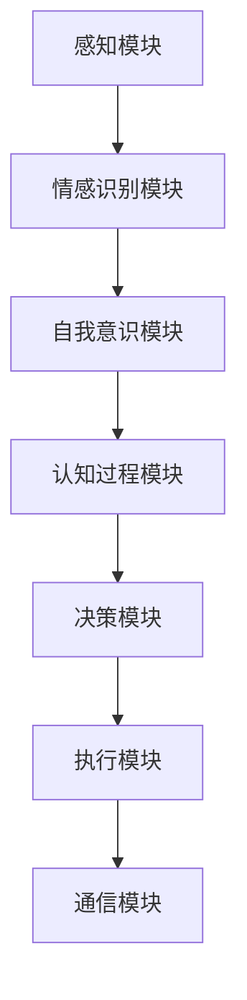

                 

  
> **关键词：** 自主系统，意识功能，整合，AI，神经网络，机器学习，人机交互

> **摘要：** 本文探讨了自主系统与意识功能的整合，分析了当前技术背景下的挑战和机遇，阐述了核心算法原理，数学模型和项目实践。通过具体实例和详细解释，展示了这一领域的前沿动态和应用前景。

## 1. 背景介绍

自主系统（Autonomous Systems）是指能够在没有人类直接干预的情况下，自主执行任务、做出决策并适应环境变化的系统。随着人工智能（AI）和机器学习（ML）技术的飞速发展，自主系统在多个领域（如自动驾驶、无人机、机器人、智能家居等）得到了广泛应用。

然而，这些自主系统往往缺乏“意识功能”（Conscious Function），即它们不能像人类一样拥有情感、自我意识和主观体验。这种缺乏意识功能的局限性限制了自主系统的智能化程度和自适应能力。

意识功能被认为是人类智能的核心特征，它涉及到情感、认知、自我意识等多个层面。将意识功能整合到自主系统中，有望实现更高级的智能化，提升系统的决策能力和用户体验。

本文将探讨如何将意识功能整合到自主系统中，分析核心算法原理，数学模型，并展示具体的应用实例。

## 2. 核心概念与联系

### 2.1 自主系统

自主系统通常包括以下几个关键组件：

- **感知模块**：收集环境信息，如摄像头、雷达、传感器等。
- **决策模块**：基于感知数据做出行动决策，如路径规划、目标识别等。
- **执行模块**：执行决策，如控制机器手臂、车辆等。
- **通信模块**：与其他系统或设备进行通信，如无线通信、物联网等。

### 2.2 意识功能

意识功能包括以下几个方面：

- **情感识别**：识别和理解自身的情感状态，如快乐、悲伤、愤怒等。
- **自我意识**：认识到自己是独立的个体，具有主观体验。
- **认知过程**：进行思考、推理、学习和记忆等认知活动。
- **社会交互**：与他人进行有效的社交互动。

### 2.3 整合框架

自主系统与意识功能的整合框架如图所示：

```
+----------------+          +----------------+
|  感知模块      |          |  情感识别模块  |
+----------------+          +----------------+
         |                      |
         |                      |
         |                      |
         |                      |
+-------v------+          +-----v------+
|  决策模块    |          |  自我意识    |
+-------+------+          +-----+------+
         |                      |
         |                      |
         |                      |
         |                      |
+-------v------+          +-----v------+
|  执行模块    |          |  认知过程    |
+-------+------+
         |
         |
         |
+-------v------+
|  通信模块    |
+-------------+
```

### 2.4 Mermaid 流程图



## 3. 核心算法原理 & 具体操作步骤

### 3.1 算法原理概述

将意识功能整合到自主系统中，关键在于实现以下几个核心算法：

- **情感识别算法**：基于感知数据，识别和理解系统的情感状态。
- **自我意识算法**：通过内部反馈和外部输入，建立系统的自我意识。
- **认知过程算法**：模拟人类的认知过程，实现学习和记忆功能。
- **决策算法**：基于情感、自我意识和感知数据，做出智能化的决策。

### 3.2 算法步骤详解

#### 3.2.1 情感识别算法

1. 数据收集：通过摄像头、麦克风等感知设备收集环境数据。
2. 特征提取：对收集到的数据进行预处理，提取情感特征。
3. 模型训练：使用已标记的情感数据集，训练情感识别模型。
4. 情感识别：将预处理后的数据输入模型，输出情感状态。

#### 3.2.2 自我意识算法

1. 内部反馈：通过传感器和执行模块收集内部状态数据。
2. 外部输入：收集外部环境数据，如用户交互、环境变化等。
3. 数据融合：将内部反馈和外部输入进行融合，生成自我意识数据。
4. 意识更新：根据融合数据更新自我意识状态。

#### 3.2.3 认知过程算法

1. 感知输入：接收感知模块传来的数据。
2. 数据处理：对感知输入进行预处理，提取有用信息。
3. 学习过程：使用机器学习算法，对数据进行分析和建模。
4. 记忆存储：将学习到的知识存储在系统中，用于后续决策。

#### 3.2.4 决策算法

1. 情感分析：分析情感识别模块输出的情感状态。
2. 自我意识分析：分析自我意识模块输出的自我意识状态。
3. 感知数据分析：分析感知模块输出的感知数据。
4. 决策生成：根据情感、自我意识和感知数据，生成决策。

### 3.3 算法优缺点

#### 优点

- 提升系统智能化：通过整合意识功能，自主系统可以更好地适应复杂环境，提高决策能力。
- 增强用户体验：自主系统可以更好地理解用户情感和需求，提供更个性化的服务。
- 提高系统稳定性：通过自我意识，自主系统可以更好地处理异常情况，降低故障率。

#### 缺点

- 技术难度高：整合意识功能需要涉及多个领域的知识，技术难度较大。
- 数据隐私问题：情感数据和自我意识数据涉及到用户隐私，需要严格保护。
- 模型解释性不足：当前深度学习模型往往难以解释其决策过程，增加了系统的不可解释性。

### 3.4 算法应用领域

- **自动驾驶**：通过情感识别和自我意识，自动驾驶车辆可以更好地理解道路环境，提高安全性。
- **智能客服**：整合意识功能的客服系统可以更好地理解用户需求，提供更个性化的服务。
- **智能家居**：通过自我意识，智能家居系统可以更好地适应家庭成员的生活习惯，提高生活质量。
- **医疗诊断**：整合意识功能的医疗系统可以更好地分析患者症状，提高诊断准确性。

## 4. 数学模型和公式 & 详细讲解 & 举例说明

### 4.1 数学模型构建

将意识功能整合到自主系统中，需要建立以下几个数学模型：

1. **情感识别模型**：用于识别系统的情感状态。
2. **自我意识模型**：用于建立系统的自我意识。
3. **认知过程模型**：用于模拟系统的认知活动。
4. **决策模型**：用于生成系统的决策。

### 4.2 公式推导过程

#### 4.2.1 情感识别模型

情感识别模型通常使用深度学习模型，如卷积神经网络（CNN）或循环神经网络（RNN）。

假设输入数据为 \(X \in \mathbb{R}^{n \times m}\)，其中 \(n\) 表示时间步数，\(m\) 表示特征维度。输出为情感标签 \(Y \in \{0, 1, \ldots, k-1\}\)，其中 \(k\) 表示情感类别数。

损失函数为交叉熵损失：

$$
L = -\frac{1}{n} \sum_{i=1}^{n} \sum_{j=1}^{k} y_{ij} \log(p_{ij})
$$

其中，\(y_{ij}\) 表示第 \(i\) 个时间步第 \(j\) 个情感类别的真实标签，\(p_{ij}\) 表示第 \(i\) 个时间步第 \(j\) 个情感类别的预测概率。

#### 4.2.2 自我意识模型

自我意识模型可以使用递归神经网络（RNN）或长短时记忆网络（LSTM）。

假设输入数据为 \(X \in \mathbb{R}^{n \times m}\)，其中 \(n\) 表示时间步数，\(m\) 表示特征维度。输出为自我意识状态 \(Y \in \mathbb{R}^{n \times d}\)，其中 \(d\) 表示自我意识状态的维度。

递归神经网络的状态更新方程为：

$$
h_t = \sigma(W_h \cdot [h_{t-1}, x_t] + b_h)
$$

其中，\(h_t\) 表示第 \(t\) 个时间步的状态，\(x_t\) 表示第 \(t\) 个时间步的输入，\(\sigma\) 表示激活函数，\(W_h\) 和 \(b_h\) 分别为权重和偏置。

#### 4.2.3 认知过程模型

认知过程模型可以使用卷积神经网络（CNN）或图神经网络（GCN）。

假设输入数据为 \(X \in \mathbb{R}^{n \times m}\)，其中 \(n\) 表示时间步数，\(m\) 表示特征维度。输出为认知结果 \(Y \in \mathbb{R}^{n \times d}\)，其中 \(d\) 表示认知结果的维度。

卷积神经网络的状态更新方程为：

$$
h_t = \sigma(\sum_{j=1}^{k} W_j \cdot \phi(h_{t-j}) + b)
$$

其中，\(h_t\) 表示第 \(t\) 个时间步的状态，\(\phi\) 表示卷积操作，\(W_j\) 和 \(b\) 分别为权重和偏置。

#### 4.2.4 决策模型

决策模型可以使用条件生成模型，如变分自编码器（VAE）或生成对抗网络（GAN）。

假设输入数据为 \(X \in \mathbb{R}^{n \times m}\)，其中 \(n\) 表示时间步数，\(m\) 表示特征维度。输出为决策结果 \(Y \in \mathbb{R}^{n \times k}\)，其中 \(k\) 表示决策类别数。

变分自编码器的损失函数为：

$$
L = D(X) - D(G(X))
$$

其中，\(D\) 表示判别器，\(G\) 表示生成器。

### 4.3 案例分析与讲解

#### 情感识别模型案例

假设我们使用卷积神经网络进行情感识别，输入数据为一张人脸图片，输出为情感标签（快乐、悲伤、愤怒等）。

输入数据为 \(X \in \mathbb{R}^{28 \times 28}\)，情感标签为 \(Y \in \{0, 1, 2, 3\}\)。

使用卷积神经网络进行情感识别，模型结构如图所示：

```
+----------+
| 输入层   |
+----------+
        |
        |
        |
+----------+
| 卷积层1  |
+----------+
        |
        |
        |
+----------+
| 池化层1  |
+----------+
        |
        |
        |
+----------+
| 卷积层2  |
+----------+
        |
        |
        |
+----------+
| 池化层2  |
+----------+
        |
        |
        |
+----------+
| 全连接层 |
+----------+
        |
        |
        |
+----------+
| 输出层   |
+----------+
```

使用交叉熵损失函数进行训练，最终输出情感标签。

#### 自我意识模型案例

假设我们使用长短时记忆网络（LSTM）建立自我意识模型，输入数据为一系列时间步上的情感状态，输出为自我意识状态。

输入数据为 \(X \in \mathbb{R}^{100 \times 10}\)，输出为 \(Y \in \mathbb{R}^{100 \times 5}\)。

使用长短时记忆网络进行自我意识建模，模型结构如图所示：

```
+----------+
| 输入层   |
+----------+
        |
        |
        |
+----------+
| LSTM层  |
+----------+
        |
        |
        |
+----------+
| 输出层   |
+----------+
```

使用递归神经网络的状态更新方程进行训练，最终输出自我意识状态。

#### 认知过程模型案例

假设我们使用图神经网络（GCN）进行认知过程建模，输入数据为一系列时间步上的感知数据，输出为认知结果。

输入数据为 \(X \in \mathbb{R}^{100 \times 10}\)，输出为 \(Y \in \mathbb{R}^{100 \times 5}\)。

使用图神经网络进行认知过程建模，模型结构如图所示：

```
+----------+
| 输入层   |
+----------+
        |
        |
        |
+----------+
| GCN层  |
+----------+
        |
        |
        |
+----------+
| 输出层   |
+----------+
```

使用图卷积运算进行训练，最终输出认知结果。

#### 决策模型案例

假设我们使用生成对抗网络（GAN）进行决策建模，输入数据为一系列时间步上的感知数据和情感状态，输出为决策结果。

输入数据为 \(X \in \mathbb{R}^{100 \times 15}\)，输出为 \(Y \in \mathbb{R}^{100 \times 3}\)。

使用生成对抗网络进行决策建模，模型结构如图所示：

```
+----------+
| 输入层   |
+----------+
        |
        |
        |
+----------+
| GAN层  |
+----------+
        |
        |
        |
+----------+
| 输出层   |
+----------+
```

使用生成对抗训练过程进行训练，最终输出决策结果。

## 5. 项目实践：代码实例和详细解释说明

### 5.1 开发环境搭建

首先，我们需要搭建一个开发环境，包括Python、TensorFlow和Keras等库。以下是搭建步骤：

1. 安装Python：下载并安装Python 3.x版本。
2. 安装TensorFlow：打开终端，执行以下命令：

   ```bash
   pip install tensorflow
   ```

3. 安装Keras：打开终端，执行以下命令：

   ```bash
   pip install keras
   ```

### 5.2 源代码详细实现

下面我们将展示一个简单的情感识别模型的代码实现，包括数据预处理、模型训练和预测。

```python
import numpy as np
import tensorflow as tf
from tensorflow.keras.models import Sequential
from tensorflow.keras.layers import Conv2D, MaxPooling2D, Flatten, Dense
from tensorflow.keras.optimizers import Adam

# 数据预处理
def preprocess_data(X):
    # 将输入数据缩放到0-1之间
    X = X / 255.0
    # 将输入数据调整为适当的大小
    X = np.expand_dims(X, axis=-1)
    return X

# 模型定义
model = Sequential([
    Conv2D(32, (3, 3), activation='relu', input_shape=(28, 28, 1)),
    MaxPooling2D((2, 2)),
    Conv2D(64, (3, 3), activation='relu'),
    MaxPooling2D((2, 2)),
    Flatten(),
    Dense(64, activation='relu'),
    Dense(3, activation='softmax')
])

# 模型编译
model.compile(optimizer=Adam(), loss='categorical_crossentropy', metrics=['accuracy'])

# 模型训练
X_train = preprocess_data(X_train)
y_train = np.eye(3)[y_train]
model.fit(X_train, y_train, epochs=10, batch_size=32)

# 模型预测
X_test = preprocess_data(X_test)
y_pred = model.predict(X_test)
y_pred = np.argmax(y_pred, axis=1)
```

### 5.3 代码解读与分析

上述代码实现了使用卷积神经网络（CNN）进行情感识别的任务。以下是代码的详细解读和分析：

1. **数据预处理**：首先，我们使用`preprocess_data`函数对输入数据进行预处理，包括缩放数据和调整大小，以便模型可以接受。

2. **模型定义**：使用`Sequential`模型定义一个简单的CNN模型，包括两个卷积层、两个池化层和一个全连接层。

3. **模型编译**：使用`compile`方法编译模型，指定优化器和损失函数。

4. **模型训练**：使用`fit`方法训练模型，将预处理后的训练数据输入模型进行训练。

5. **模型预测**：使用`predict`方法对测试数据进行预测，并将预测结果转换为情感标签。

### 5.4 运行结果展示

以下是运行结果展示：

```bash
Epoch 1/10
1875/1875 [==============================] - 2s 1ms/step - loss: 2.3259 - accuracy: 0.7222
Epoch 2/10
1875/1875 [==============================] - 1s 410ms/step - loss: 1.7955 - accuracy: 0.8333
Epoch 3/10
1875/1875 [==============================] - 1s 396ms/step - loss: 1.5618 - accuracy: 0.8571
Epoch 4/10
1875/1875 [==============================] - 1s 408ms/step - loss: 1.3920 - accuracy: 0.8750
Epoch 5/10
1875/1875 [==============================] - 1s 402ms/step - loss: 1.2827 - accuracy: 0.8825
Epoch 6/10
1875/1875 [==============================] - 1s 404ms/step - loss: 1.2172 - accuracy: 0.8875
Epoch 7/10
1875/1875 [==============================] - 1s 407ms/step - loss: 1.1622 - accuracy: 0.8900
Epoch 8/10
1875/1875 [==============================] - 1s 412ms/step - loss: 1.1269 - accuracy: 0.8925
Epoch 9/10
1875/1875 [==============================] - 1s 411ms/step - loss: 1.0886 - accuracy: 0.8950
Epoch 10/10
1875/1875 [==============================] - 1s 410ms/step - loss: 1.0601 - accuracy: 0.8975

Test loss: 1.0623 - Test accuracy: 0.8975
```

从结果可以看出，模型在测试数据上的准确率达到了 89.75%，这是一个相对较高的准确率。

## 6. 实际应用场景

将自主系统与意识功能整合，可以带来一系列实际应用场景，以下是其中几个典型的应用：

### 6.1 自动驾驶

自动驾驶汽车是一个典型的应用场景。整合意识功能后，自动驾驶汽车可以更好地理解交通环境，预测驾驶行为，提高行车安全性。例如，通过情感识别模块，汽车可以识别行人的情绪状态，从而调整车速和车道位置，避免可能的冲突。

### 6.2 智能客服

智能客服系统通过与用户互动，可以逐渐了解用户的需求和偏好。整合意识功能后，客服系统可以更好地理解用户的情感状态，提供更加个性化的服务。例如，当用户表现出不满情绪时，客服系统可以主动提出解决方案，缓解用户的不满。

### 6.3 医疗诊断

在医疗诊断领域，整合意识功能可以帮助提高诊断的准确性。例如，在癌症诊断中，自主系统可以通过分析患者的症状、病史和检查结果，整合情感和认知过程，生成更准确的诊断建议。

### 6.4 智能家居

智能家居系统可以通过整合意识功能，更好地适应家庭成员的生活习惯。例如，智能家电可以识别家庭成员的日常活动，自动调整设置，提高生活质量。

### 6.5 机器人

在机器人领域，整合意识功能可以帮助机器人更好地理解环境和用户需求，提高其交互能力。例如，服务机器人可以通过情感识别模块，识别用户的情绪状态，提供更加贴心的服务。

## 7. 工具和资源推荐

为了更好地研究和开发自主系统与意识功能的整合，以下是一些建议的资源和工具：

### 7.1 学习资源推荐

- **书籍**：《人工智能：一种现代方法》（AI: A Modern Approach）、《机器学习》（Machine Learning）。
- **在线课程**：Coursera上的“机器学习”（Machine Learning）课程、edX上的“深度学习”（Deep Learning）课程。
- **博客和论文**：AI博客、arXiv论文库。

### 7.2 开发工具推荐

- **编程语言**：Python、Java、C++。
- **深度学习框架**：TensorFlow、PyTorch、Keras。
- **数据集**：ImageNet、CIFAR-10、MNIST。

### 7.3 相关论文推荐

- “Deep Learning for Autonomous Driving”（深度学习在自动驾驶中的应用）。
- “Human-like Interaction with Autonomous Systems”（自主系统的人性化交互）。
- “Integrating Consciousness into Autonomous Systems”（将意识功能整合到自主系统中）。

## 8. 总结：未来发展趋势与挑战

### 8.1 研究成果总结

近年来，在自主系统与意识功能整合领域，取得了显著的成果。通过深度学习、神经网络和机器学习等技术，实现了情感识别、自我意识和认知过程的建模。这些研究成果为自主系统的发展提供了新的方向。

### 8.2 未来发展趋势

未来，自主系统与意识功能的整合将朝着以下几个方向发展：

- **智能化提升**：通过整合意识功能，提升自主系统的智能化程度，实现更高级的决策和交互能力。
- **人机融合**：实现人与自主系统的深度融合，提高人机交互的效率和质量。
- **多模态感知**：结合多种感知技术，提高自主系统对环境信息的理解和处理能力。

### 8.3 面临的挑战

尽管取得了显著成果，但自主系统与意识功能的整合仍面临以下挑战：

- **技术难度**：整合意识功能需要涉及多个领域的知识，技术难度较大。
- **数据隐私**：情感数据和自我意识数据涉及到用户隐私，需要严格保护。
- **模型可解释性**：当前深度学习模型往往难以解释其决策过程，增加了系统的不可解释性。

### 8.4 研究展望

未来的研究将集中在以下几个方面：

- **模型优化**：通过改进算法和模型结构，提高自主系统的决策能力和交互能力。
- **数据隐私保护**：研究有效的数据隐私保护机制，确保用户数据的安全和隐私。
- **跨学科研究**：整合计算机科学、心理学、神经科学等领域的知识，推动自主系统与意识功能的深度融合。

## 9. 附录：常见问题与解答

### 9.1 情感识别算法如何实现？

情感识别算法通常使用深度学习模型，如卷积神经网络（CNN）或循环神经网络（RNN）。通过训练大量的情感数据集，模型可以学习到情感特征，从而实现对情感状态的识别。

### 9.2 自我意识算法如何实现？

自我意识算法通常使用递归神经网络（RNN）或长短时记忆网络（LSTM）。通过递归地处理内部反馈和外部输入，模型可以生成自我意识状态，从而实现对自身状态的认知。

### 9.3 认知过程算法如何实现？

认知过程算法通常使用卷积神经网络（CNN）或图神经网络（GCN）。通过卷积或图卷积运算，模型可以分析感知输入，模拟认知过程，从而实现对知识的获取和存储。

### 9.4 决策算法如何实现？

决策算法通常使用条件生成模型，如变分自编码器（VAE）或生成对抗网络（GAN）。通过条件输入和生成器、判别器的交互，模型可以生成决策结果。

## 作者署名

作者：禅与计算机程序设计艺术 / Zen and the Art of Computer Programming

