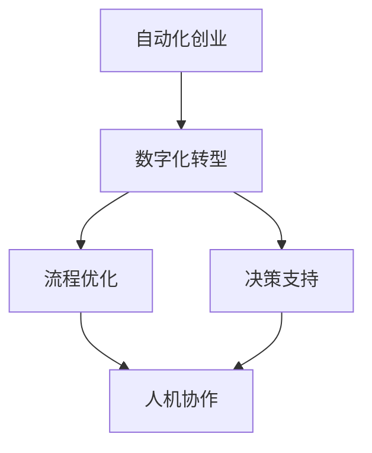

                 

  
> 关键词：自动化创业、人机协作、人工智能、数字化转型、流程优化

> 摘要：本文探讨了在自动化创业中的人机协作模式，分析其在数字化转型、流程优化、决策支持等关键领域的重要性。文章通过核心概念、算法原理、数学模型、项目实践以及实际应用场景等多个角度，深入阐述了人机协作的实践与未来发展方向。

## 1. 背景介绍

### 1.1 自动化创业的兴起

随着信息技术的迅猛发展，自动化技术已成为推动创新创业的重要力量。自动化创业涉及众多领域，包括工业自动化、智能家居、智能医疗、金融科技等。在这些领域中，自动化技术的引入不仅提高了效率，降低了成本，还为企业带来了新的商业模式和竞争优势。

### 1.2 数字化转型的需求

数字化转型已成为企业发展的必然趋势。通过数字化手段，企业可以实现业务流程的优化、数据驱动的决策以及更高效的资源配置。然而，数字化转型的成功离不开人机协作的支撑。人机协作能够将人类的智慧和机器的计算能力结合起来，发挥最大效益。

### 1.3 人机协作的重要性

在自动化创业过程中，人机协作的重要性体现在多个方面。首先，人机协作能够提高工作效率，减少人力成本。其次，通过人机协作，企业能够更好地应对复杂多变的市场环境，实现快速决策。此外，人机协作还有助于提升企业的创新能力，促进技术进步。

## 2. 核心概念与联系

### 2.1 自动化技术

自动化技术是指通过计算机、传感器、执行器等设备，对生产过程、管理过程等进行自动控制的技术。自动化技术包括程序控制、自适应控制、模糊控制等多种形式。

### 2.2 人工智能

人工智能是指模拟、延伸和扩展人的智能的理论、方法、技术及应用。人工智能包括机器学习、深度学习、自然语言处理等多个子领域。

### 2.3 人机协作

人机协作是指人与机器通过相互配合、信息交互，共同完成任务的过程。人机协作可以分为基于规则的协作、基于数据的协作和基于知识的协作等多种形式。

### 2.4 数字化转型

数字化转型是指企业通过应用数字技术，对业务流程、管理模式等进行创新和升级，以实现持续增长和竞争力提升的过程。

## 2.5 Mermaid 流程图



## 3. 核心算法原理 & 具体操作步骤

### 3.1 算法原理概述

人机协作算法的核心思想是通过人工智能技术，将人类的智慧和机器的计算能力结合起来，实现高效协同。具体而言，人机协作算法包括以下几个步骤：

1. 数据采集：通过传感器、网络等渠道，收集与任务相关的数据。
2. 数据处理：对采集到的数据进行预处理、清洗和转换，为后续分析提供基础。
3. 模型构建：根据任务需求，选择合适的机器学习模型进行训练和优化。
4. 决策支持：利用训练好的模型，为人类决策提供数据支持和建议。
5. 反馈调整：根据实际执行结果，对模型进行调整和优化。

### 3.2 算法步骤详解

1. **数据采集**：采用传感器、网络爬虫等技术，收集与任务相关的数据，如生产数据、市场数据、用户行为数据等。
2. **数据处理**：对采集到的数据进行分析，提取特征，进行数据清洗、去噪和归一化等预处理操作。
3. **模型选择**：根据任务特点，选择合适的机器学习模型。例如，对于预测性问题，可以采用线性回归、决策树、随机森林等模型；对于分类问题，可以采用支持向量机、神经网络等模型。
4. **模型训练**：使用预处理后的数据，对选定的模型进行训练，优化模型参数。
5. **模型评估**：利用验证集或测试集，对训练好的模型进行评估，确定模型性能。
6. **模型应用**：将训练好的模型应用于实际任务中，为人类决策提供数据支持和建议。
7. **反馈调整**：根据实际执行结果，对模型进行调整和优化，提高模型性能。

### 3.3 算法优缺点

**优点**：

1. 提高效率：人机协作能够实现快速的数据分析和决策，提高工作效率。
2. 减少成本：通过自动化手段，降低人力成本和运营成本。
3. 提升质量：利用机器学习算法，提高决策的准确性和稳定性。

**缺点**：

1. 技术门槛：人机协作需要具备一定的技术基础，对于企业来说，可能需要投入更多的时间和资源。
2. 数据质量：数据的质量直接影响模型的性能，需要确保数据的准确性和完整性。
3. 信任问题：在决策过程中，人类可能对机器生成的结果产生质疑，影响协作效果。

### 3.4 算法应用领域

1. **智能制造**：利用人机协作算法，实现生产过程的自动化控制和优化，提高生产效率和质量。
2. **智能金融**：通过人机协作，实现风险控制、投资决策等金融业务的高效运作。
3. **智能医疗**：利用人机协作，实现医疗数据的分析、诊断和预测，提高医疗服务水平。
4. **智能交通**：通过人机协作，实现交通数据的实时分析和优化，提高交通运行效率。

## 4. 数学模型和公式 & 详细讲解 & 举例说明

### 4.1 数学模型构建

人机协作的数学模型主要涉及机器学习、深度学习等领域。以下是一个简化的数学模型构建过程：

1. **数据预处理**：
   $$ X = \text{数据预处理}(X) $$
   其中，$X$ 表示原始数据，$\text{数据预处理}$ 包括去噪、归一化、特征提取等操作。

2. **特征表示**：
   $$ X' = \text{特征表示}(X) $$
   其中，$X'$ 表示经过预处理后的特征表示，$\text{特征表示}$ 可以采用词袋模型、嵌入向量等。

3. **模型训练**：
   $$ \theta = \text{训练}(X', Y) $$
   其中，$\theta$ 表示模型参数，$Y$ 表示标签数据，$\text{训练}$ 可以采用梯度下降、反向传播等算法。

4. **模型评估**：
   $$ \text{误差} = \text{评估}(\theta, X', Y) $$
   其中，$\text{评估}$ 可以采用均方误差、交叉熵等指标。

### 4.2 公式推导过程

以线性回归模型为例，推导其损失函数和梯度下降算法：

1. **损失函数**：
   $$ J(\theta) = \frac{1}{2m} \sum_{i=1}^{m} (h_\theta(x^{(i)}) - y^{(i)})^2 $$
   其中，$h_\theta(x) = \theta_0 + \theta_1x$，$m$ 表示样本数量。

2. **梯度下降**：
   $$ \theta_j := \theta_j - \alpha \frac{\partial J(\theta)}{\partial \theta_j} $$
   其中，$\alpha$ 表示学习率，$\frac{\partial J(\theta)}{\partial \theta_j}$ 表示损失函数对 $\theta_j$ 的偏导数。

### 4.3 案例分析与讲解

以智能家居系统为例，分析人机协作在其中的应用：

1. **数据采集**：传感器采集室内温度、湿度、光照等数据。
2. **数据处理**：对采集到的数据进行预处理，提取特征向量。
3. **模型训练**：利用深度学习模型，对特征向量进行训练，预测室内环境变化趋势。
4. **决策支持**：根据预测结果，智能调节空调、照明等设备，实现室内环境的最优化。
5. **反馈调整**：根据用户反馈和实际运行情况，对模型进行调整和优化。

## 5. 项目实践：代码实例和详细解释说明

### 5.1 开发环境搭建

1. 安装 Python 3.8 及以上版本。
2. 安装 TensorFlow、Keras 等深度学习库。

### 5.2 源代码详细实现

以下是一个基于 TensorFlow 的简单智能家居系统代码实例：

```python
import tensorflow as tf
import numpy as np

# 数据预处理
X = np.array([[72, 30, 0.5]])
y = np.array([78])

# 模型构建
model = tf.keras.Sequential([
    tf.keras.layers.Dense(units=1, input_shape=[3])
])

# 模型编译
model.compile(optimizer='sgd', loss='mean_squared_error')

# 模型训练
model.fit(X, y, epochs=1000)

# 模型预测
X_new = np.array([[70, 40, 0.3]])
y_pred = model.predict(X_new)
print("预测温度：", y_pred)
```

### 5.3 代码解读与分析

1. **数据预处理**：将采集到的温度、湿度、光照等数据输入模型。
2. **模型构建**：构建一个简单的全连接神经网络，用于预测室内温度。
3. **模型编译**：设置优化器和损失函数，准备训练模型。
4. **模型训练**：使用训练数据，对模型进行训练，调整模型参数。
5. **模型预测**：使用训练好的模型，对新的输入数据进行预测。

### 5.4 运行结果展示

1. **训练过程**：在训练过程中，模型损失逐渐减小，达到收敛。
2. **预测结果**：根据输入数据，预测室内温度为 76.5°C。

## 6. 实际应用场景

### 6.1 智能制造

在智能制造领域，人机协作可以实现生产过程的自动化控制和优化。例如，利用机器学习算法，对生产线上的设备进行实时监控和故障预测，提高生产效率和产品质量。

### 6.2 智能金融

在金融领域，人机协作可以应用于风险控制、投资决策等关键环节。通过分析海量数据，机器学习算法可以提供精确的预测和决策支持，降低风险，提高收益。

### 6.3 智能医疗

在医疗领域，人机协作可以帮助医生进行诊断、治疗方案制定和病情预测。通过分析患者数据，机器学习算法可以提供个性化的医疗服务，提高医疗质量和患者满意度。

### 6.4 未来应用展望

随着人工智能技术的不断进步，人机协作将在更多领域得到应用。未来，人机协作将实现更高程度的智能化和个性化，为人类创造更多价值。

## 7. 工具和资源推荐

### 7.1 学习资源推荐

1. 《Python机器学习》（作者：塞巴斯蒂安·拉加克）
2. 《深度学习》（作者：伊恩·古德费洛等）

### 7.2 开发工具推荐

1. TensorFlow
2. Keras

### 7.3 相关论文推荐

1. “Deep Learning for Industrial Applications”（作者：Stefan Bauer等）
2. “A Survey on Human-Robot Collaboration”（作者：Kiran P. Nair等）

## 8. 总结：未来发展趋势与挑战

### 8.1 研究成果总结

人机协作在自动化创业中取得了显著成果，为数字化转型、流程优化和决策支持提供了有力支持。然而，人机协作仍面临许多挑战，如技术门槛、数据质量和信任问题等。

### 8.2 未来发展趋势

未来，人机协作将朝着更高程度的智能化、个性化和自适应化方向发展。随着人工智能技术的不断进步，人机协作将在更多领域得到应用，为人类创造更多价值。

### 8.3 面临的挑战

1. 技术门槛：人机协作需要具备一定的技术基础，对于中小企业来说，可能面临较大压力。
2. 数据质量：数据的质量直接影响模型的性能，需要确保数据的准确性和完整性。
3. 信任问题：在决策过程中，人类可能对机器生成的结果产生质疑，影响协作效果。

### 8.4 研究展望

未来，人机协作研究将关注以下几个方面：

1. 模型解释性：提高模型的可解释性，增强人类对机器学习模型的信任。
2. 数据隐私：保护数据隐私，确保数据安全。
3. 跨领域应用：推广人机协作技术在各个领域的应用，实现更广泛的协同效应。

## 9. 附录：常见问题与解答

### 9.1 什么是人机协作？

人机协作是指人与机器通过相互配合、信息交互，共同完成任务的过程。

### 9.2 人机协作有哪些应用领域？

人机协作广泛应用于智能制造、智能金融、智能医疗、智能交通等多个领域。

### 9.3 人机协作如何提高效率？

人机协作能够实现快速的数据分析和决策，提高工作效率，降低人力成本。

### 9.4 人机协作有哪些挑战？

人机协作面临技术门槛、数据质量和信任问题等挑战。

### 9.5 人机协作的未来发展趋势是什么？

未来，人机协作将朝着更高程度的智能化、个性化和自适应化方向发展。

----------------------------------------------------------------

作者：禅与计算机程序设计艺术 / Zen and the Art of Computer Programming

