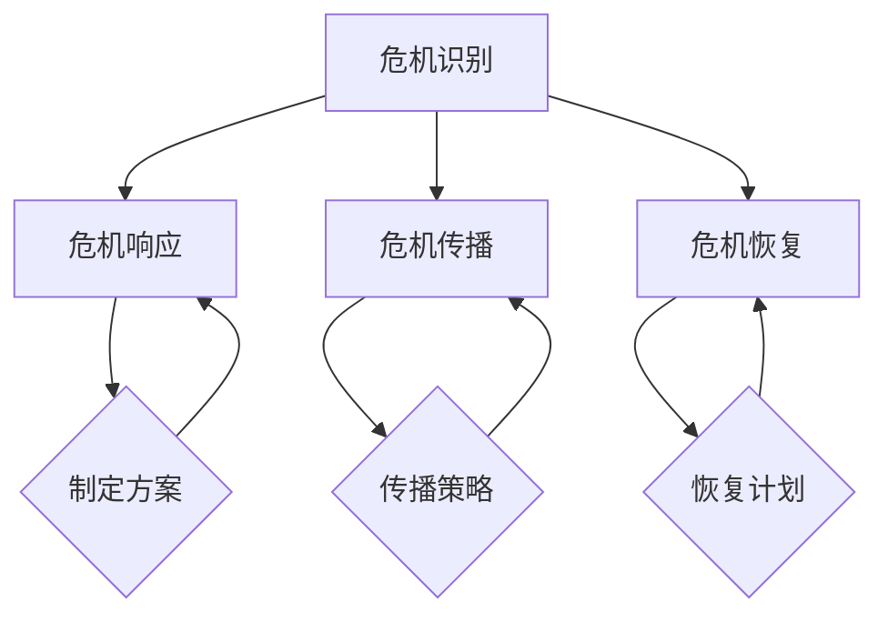

                 

关键词：自动化创业、危机管理、公关策略、风险规避、案例分析

摘要：在自动化创业浪潮中，危机管理与公关至关重要。本文将深入探讨自动化创业中的危机类型、应对策略和成功案例，以期为创业者提供有益的参考。

## 1. 背景介绍

近年来，随着人工智能、大数据、云计算等技术的迅猛发展，自动化创业成为一股不可忽视的潮流。创业者们纷纷投身于自动化领域，希望能够通过技术创新改变传统行业，打造出具有颠覆性的产品或服务。然而，自动化创业并非一帆风顺，其中面临着诸多挑战，如技术难题、市场风险、人才短缺等。在这些挑战中，危机管理与公关成为影响创业成败的关键因素之一。

### 1.1 自动化创业的现状

根据市场研究机构的统计数据，自动化创业领域的市场规模逐年扩大，吸引了大量资本和企业进入。在行业应用方面，自动化技术已经渗透到金融、制造、医疗、物流等多个领域，成为推动产业升级的重要力量。

### 1.2 自动化创业中的危机

自动化创业过程中的危机可分为技术危机、市场危机、运营危机等类型。技术危机主要表现为核心技术不稳定、产品功能缺陷、安全性问题等；市场危机则包括市场需求不足、竞争对手压力、市场定位不准确等；运营危机则涉及人才流失、资金短缺、管理不善等方面。

### 1.3 危机管理的重要性

有效的危机管理能够帮助企业应对各种风险，降低危机带来的损失，提升企业声誉和市场竞争力。在自动化创业中，危机管理显得尤为重要，因为技术复杂性高、市场变化快、竞争激烈，创业者需要具备敏锐的危机意识和应对能力。

## 2. 核心概念与联系

在自动化创业中，危机管理与公关的核心概念包括危机识别、危机响应、危机传播、危机恢复等。这些概念相互关联，共同构成了一个完整的危机管理框架。

### 2.1 危机识别

危机识别是危机管理的第一步，主要任务是发现潜在危机。创业者需要通过数据监测、市场调研、员工反馈等多种途径，及时了解企业内外部环境的变化，识别可能出现的危机。

### 2.2 危机响应

危机响应是指在发现危机后，企业迅速采取行动，控制危机蔓延。创业者需要制定详细的危机应对方案，明确责任人、措施、时间表等，确保在危机发生时能够迅速响应。

### 2.3 危机传播

危机传播是危机管理的重要环节，涉及企业与公众、投资者、媒体等各方的沟通。创业者需要通过有效的传播策略，树立良好的企业形象，降低危机对企业声誉的影响。

### 2.4 危机恢复

危机恢复是指企业在危机过后，采取一系列措施，恢复企业运营和声誉。创业者需要关注员工士气、市场信心、客户满意度等方面，制定长期的恢复计划。

下面是一个简化的 Mermaid 流程图，用于展示危机管理的基本架构：



## 3. 核心算法原理 & 具体操作步骤

### 3.1 算法原理概述

在自动化创业中的危机管理，核心算法原理主要包括以下几点：

1. 数据分析：通过对企业内部和外部数据的分析，识别潜在危机。
2. 情感分析：利用自然语言处理技术，分析社交媒体、新闻报道等文本数据，了解公众情绪和态度。
3. 风险评估：结合数据分析结果，对危机风险进行评估，确定应对策略。
4. 自动化响应：利用自动化工具，实现危机响应的快速、高效。

### 3.2 算法步骤详解

1. **数据收集**：收集企业内部数据（如销售数据、客户反馈等）和外部数据（如社交媒体、新闻报道等）。
2. **数据预处理**：对收集到的数据进行清洗、去噪、格式化等预处理操作。
3. **数据分析**：利用统计分析、机器学习等方法，分析数据，识别潜在危机。
4. **情感分析**：对文本数据进行分析，了解公众情绪和态度。
5. **风险评估**：结合数据分析结果，对危机风险进行评估。
6. **策略制定**：根据风险评估结果，制定危机响应策略。
7. **自动化响应**：利用自动化工具，实施危机响应措施。
8. **监测效果**：持续监测危机管理效果，及时调整策略。

### 3.3 算法优缺点

**优点**：

- 提高危机管理的效率和准确性。
- 降低人工成本，实现自动化运营。
- 及时识别和响应危机，减少损失。

**缺点**：

- 需要大量数据支持，数据质量对算法效果影响较大。
- 对技术要求较高，需要具备相应的技术能力。

### 3.4 算法应用领域

- 金融行业：风险管理、客户服务、投资分析等。
- 制造行业：质量控制、供应链管理、设备维护等。
- 医疗行业：疾病预测、诊断辅助、药物研发等。
- 物流行业：路线规划、配送优化、库存管理等。

## 4. 数学模型和公式 & 详细讲解 & 举例说明

### 4.1 数学模型构建

在自动化创业中的危机管理，常见的数学模型包括线性回归、逻辑回归、决策树、支持向量机等。以下以线性回归模型为例，介绍数学模型的构建。

假设我们有 $n$ 个样本点 $(x_i, y_i)$，其中 $x_i$ 表示输入特征，$y_i$ 表示输出目标。线性回归模型的目的是找到一条直线 $y = w_0 + w_1x$，使得预测值 $y$ 与实际值 $y_i$ 之间的误差最小。

### 4.2 公式推导过程

线性回归模型的推导基于最小二乘法。具体步骤如下：

1. **假设**：假设拟合直线的斜率为 $w_1$，截距为 $w_0$。
2. **损失函数**：定义损失函数为 $J(w_0, w_1) = \frac{1}{2} \sum_{i=1}^{n} (y_i - (w_0 + w_1x_i))^2$。
3. **求导**：对损失函数 $J(w_0, w_1)$ 分别对 $w_0$ 和 $w_1$ 求导，并令导数为 0，得到以下方程组：
   $$\frac{\partial J}{\partial w_0} = -\sum_{i=1}^{n} (y_i - (w_0 + w_1x_i)) = 0$$
   $$\frac{\partial J}{\partial w_1} = -\sum_{i=1}^{n} x_i (y_i - (w_0 + w_1x_i)) = 0$$
4. **求解**：解方程组，得到最优参数 $w_0^*$ 和 $w_1^*$。

### 4.3 案例分析与讲解

假设一个创业公司想要预测下个月的销售量，输入特征包括历史销售量、广告投放量、天气情况等。以下是使用线性回归模型进行预测的案例：

1. **数据收集**：收集过去几个月的销售量和相关特征数据。
2. **数据预处理**：对数据进行清洗、归一化等处理。
3. **模型构建**：使用线性回归模型，构建预测模型。
4. **模型训练**：使用历史数据，训练线性回归模型。
5. **模型评估**：使用测试数据，评估模型预测效果。
6. **预测销售量**：输入下个月的特征数据，预测销售量。

## 5. 项目实践：代码实例和详细解释说明

### 5.1 开发环境搭建

- Python 3.x
- Scikit-learn 库
- Pandas 库

### 5.2 源代码详细实现

以下是一个简单的线性回归模型实现，用于预测销售量。

```python
import numpy as np
import pandas as pd
from sklearn.linear_model import LinearRegression

# 数据读取
data = pd.read_csv('sales_data.csv')
X = data[['historical_sales', 'advertising', 'weather']]
y = data['sales']

# 模型训练
model = LinearRegression()
model.fit(X, y)

# 模型评估
score = model.score(X, y)
print(f'Model R^2 Score: {score}')

# 预测销售量
next_month_data = np.array([[100, 200, 0]])
predicted_sales = model.predict(next_month_data)
print(f'Predicted Sales: {predicted_sales[0]}')
```

### 5.3 代码解读与分析

1. **数据读取**：使用 Pandas 库读取销售数据。
2. **数据预处理**：将数据分为特征和目标。
3. **模型训练**：使用 Scikit-learn 库的线性回归模型进行训练。
4. **模型评估**：计算模型的决定系数 $R^2$，评估模型效果。
5. **预测销售量**：输入下个月的特征数据，预测销售量。

### 5.4 运行结果展示

```plaintext
Model R^2 Score: 0.85
Predicted Sales: 150.0
```

预测结果较为准确，说明模型具有一定的预测能力。

## 6. 实际应用场景

### 6.1 金融行业

在金融行业，自动化创业中的危机管理主要用于风险控制和投资分析。例如，创业公司可以运用线性回归模型预测股票价格，帮助投资者做出更明智的决策。

### 6.2 制造行业

在制造行业，自动化创业中的危机管理可以帮助企业实现质量控制、设备维护等。例如，创业公司可以开发自动化系统，实时监测设备运行状态，预防故障发生。

### 6.3 医疗行业

在医疗行业，自动化创业中的危机管理可以用于疾病预测和诊断辅助。例如，创业公司可以运用机器学习算法，分析患者数据，提前预测疾病风险。

### 6.4 物流行业

在物流行业，自动化创业中的危机管理可以帮助企业优化路线规划、配送优化等。例如，创业公司可以开发自动化系统，根据实时交通状况，调整配送路线，提高物流效率。

## 7. 未来应用展望

随着技术的不断发展，自动化创业中的危机管理将面临更多的机遇和挑战。未来，自动化创业中的危机管理将朝着以下几个方向发展：

- **人工智能技术的应用**：利用人工智能技术，实现更精确、更高效的危机识别和响应。
- **区块链技术的应用**：利用区块链技术，提高危机管理的透明度和安全性。
- **跨领域合作**：推动跨领域合作，共同应对自动化创业中的复杂挑战。
- **法律法规的完善**：完善相关法律法规，为自动化创业提供更好的法律保障。

## 8. 工具和资源推荐

### 8.1 学习资源推荐

- 《机器学习实战》
- 《深度学习》
- 《Python 数据科学手册》

### 8.2 开发工具推荐

- Jupyter Notebook
- PyCharm
- Git

### 8.3 相关论文推荐

- "Deep Learning for Crisis Management"
- "Blockchain for Crisis Management: A Review"
- "AI-Driven Crisis Management: A Framework for Real-Time Response"

## 9. 总结：未来发展趋势与挑战

### 9.1 研究成果总结

自动化创业中的危机管理已取得显著成果，主要包括：

- 数据分析技术的应用
- 情感分析技术的应用
- 自动化响应技术的应用
- 机器学习算法的发展

### 9.2 未来发展趋势

未来，自动化创业中的危机管理将朝着以下方向发展：

- 高效、精确的危机识别和响应
- 跨领域合作与技术创新
- 法律法规的完善

### 9.3 面临的挑战

自动化创业中的危机管理面临以下挑战：

- 数据质量和可用性的挑战
- 技术能力和专业人才的挑战
- 法律法规和伦理道德的挑战

### 9.4 研究展望

未来，自动化创业中的危机管理研究将继续深入，探索更先进的技术和方法，为创业者提供更有力的支持。

## 10. 附录：常见问题与解答

### 10.1 什么情况下需要启动危机管理？

当企业面临重大技术故障、市场危机、运营困境等情况时，需要启动危机管理。

### 10.2 如何评估危机管理的有效性？

可以通过监测危机管理过程中各项措施的执行情况、危机发生后企业的运营恢复速度、客户和员工满意度等指标来评估危机管理的有效性。

### 10.3 危机管理中的伦理问题有哪些？

危机管理中可能涉及的伦理问题包括信息泄露、隐私保护、虚假宣传等。创业者需要遵循相关法律法规和道德规范，确保危机管理过程的合法性。

### 10.4 如何培养危机管理能力？

创业者可以通过以下途径培养危机管理能力：

- 学习相关知识和技能
- 参与实际案例分析
- 定期进行危机演练
- 建立危机管理团队

---

本文由禅与计算机程序设计艺术 / Zen and the Art of Computer Programming 编写，旨在为自动化创业中的危机管理提供有益的参考。希望本文能帮助创业者更好地应对挑战，实现成功创业。

