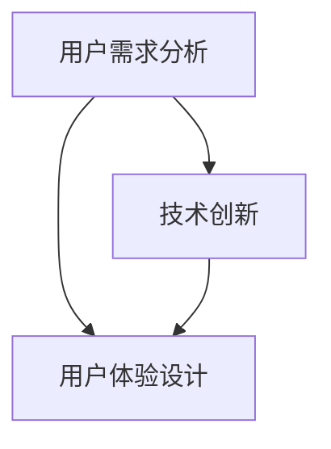

                 

关键词：自动化创业、用户教育、培训、用户体验、技术传播、创新思维

> 摘要：本文从自动化创业的视角出发，探讨了用户教育与培训的重要性、核心方法、策略与实践，旨在为创业者提供有价值的参考，帮助他们在创新市场中脱颖而出，实现可持续的商业模式。

## 1. 背景介绍

随着信息技术的飞速发展，自动化已经成为现代企业提高效率、降低成本的关键手段。自动化创业成为一种趋势，创业者利用人工智能、机器学习等先进技术，开发出一系列自动化解决方案，为传统行业带来革命性的变革。然而，自动化技术并非万能，创业者必须认识到用户教育与培训在自动化创业中的重要性。

用户教育与培训是确保自动化系统顺利落地并取得预期效果的关键环节。通过对用户进行系统的教育和培训，可以增强他们对自动化解决方案的理解和接受程度，提高使用效率和满意度，从而推动市场接受度和商业成功。

### 1.1 自动化创业的现状

当前，自动化创业主要集中在以下几个领域：

1. **智能制造**：通过自动化设备提高生产效率和质量，降低人工成本。
2. **智能客服**：利用自然语言处理和机器学习技术，实现自动化的客户服务。
3. **智能家居**：通过物联网和智能控制技术，实现家庭设备的自动化管理。
4. **智能物流**：利用自动化设备和算法，优化物流流程和提高配送效率。

### 1.2 用户教育与培训的重要性

1. **提高用户接受度**：自动化解决方案往往涉及复杂的操作流程和技术原理，通过教育与培训，用户可以更好地理解和使用这些系统，从而提高接受度。
2. **提升用户体验**：用户教育与培训可以帮助用户掌握正确的使用方法，避免误操作，提升用户体验。
3. **促进商业模式实现**：用户教育与培训是商业模式的重要组成部分，通过提供高质量的培训服务，可以增强用户对品牌的信任，促进销售和商业成功。

## 2. 核心概念与联系

### 2.1 自动化创业中的核心概念

1. **用户需求分析**：了解用户的需求是自动化创业的基础，通过用户需求分析，可以确定自动化解决方案的具体方向。
2. **技术创新**：自动化创业的核心在于技术创新，包括人工智能、机器学习、物联网等技术。
3. **用户体验设计**：用户体验设计是确保自动化解决方案能够满足用户需求的关键环节。

### 2.2 核心概念之间的联系

- 用户需求分析为技术创新和用户体验设计提供了指导。
- 技术创新是实现用户需求的有效手段。
- 用户体验设计是连接用户需求和技术创新的关键桥梁。

### 2.3 Mermaid 流程图



## 3. 核心算法原理 & 具体操作步骤

### 3.1 算法原理概述

用户教育与培训的核心算法原理主要包括：

1. **用户行为分析**：通过对用户行为的数据分析，了解用户的使用习惯和偏好，为培训内容设计提供依据。
2. **个性化推荐**：基于用户行为分析，为不同用户提供个性化的培训内容，提高培训效果。
3. **交互式学习**：通过互动式学习，提高用户的参与度和学习效果。

### 3.2 算法步骤详解

1. **用户行为收集**：收集用户在系统中的操作数据，如使用频率、操作时长、错误率等。
2. **数据预处理**：对收集的数据进行清洗和整理，去除无关信息，保留关键数据。
3. **行为分析**：使用机器学习算法，对预处理后的数据进行分析，识别用户的习惯和偏好。
4. **个性化培训内容设计**：根据行为分析结果，为不同用户设计个性化的培训内容。
5. **交互式学习实现**：通过互动式学习平台，实现个性化培训内容的交互式学习。

### 3.3 算法优缺点

- **优点**：个性化培训内容设计可以提高用户的学习效果，交互式学习可以提高用户的参与度。
- **缺点**：需要大量的数据支持，对数据处理和分析能力要求较高。

### 3.4 算法应用领域

用户教育与培训算法可以广泛应用于以下领域：

1. **智能客服系统**：为用户提供个性化的服务指南和操作指导。
2. **智能家居系统**：帮助用户熟悉和掌握智能家居设备的操作。
3. **工业自动化系统**：提高用户对自动化生产设备的理解和操作水平。

## 4. 数学模型和公式

### 4.1 数学模型构建

用户教育与培训的数学模型主要包括：

1. **用户行为模型**：描述用户在系统中的行为特征。
2. **个性化推荐模型**：基于用户行为模型，为用户推荐个性化的培训内容。
3. **学习效果评估模型**：评估用户的学习效果。

### 4.2 公式推导过程

假设我们有以下用户行为数据：

- \(X = \{x_1, x_2, ..., x_n\}\)：用户的操作数据集合。
- \(y = \{y_1, y_2, ..., y_n\}\)：用户的行为标签集合。

用户行为模型可以表示为：

\[ P(y|x) = \frac{e^{\theta^T x}}{\sum_{i=1}^{n} e^{\theta^T x_i}} \]

其中，\( \theta \) 是模型参数。

### 4.3 案例分析与讲解

假设我们有一个智能家居系统，用户的行为数据包括打开灯光、调节温度、控制家电等。通过用户行为模型，我们可以预测用户下一步可能进行的操作，从而推荐相应的培训内容。

例如，用户最近频繁地调节温度，我们可以推断用户对智能家居的温度控制功能感兴趣，因此推荐关于如何优化智能家居温度控制的培训课程。

## 5. 项目实践：代码实例和详细解释说明

### 5.1 开发环境搭建

- 编程语言：Python
- 数据处理工具：Pandas、Scikit-learn
- 机器学习框架：TensorFlow、Keras

### 5.2 源代码详细实现

以下是用户行为模型和个性化推荐模型的实现代码：

```python
import pandas as pd
from sklearn.model_selection import train_test_split
from tensorflow.keras.models import Sequential
from tensorflow.keras.layers import Dense
from tensorflow.keras.optimizers import Adam

# 读取用户行为数据
data = pd.read_csv('user_behavior.csv')

# 数据预处理
X = data.iloc[:, :-1].values
y = data.iloc[:, -1].values

# 划分训练集和测试集
X_train, X_test, y_train, y_test = train_test_split(X, y, test_size=0.2, random_state=42)

# 构建模型
model = Sequential()
model.add(Dense(units=64, activation='relu', input_shape=(X_train.shape[1],)))
model.add(Dense(units=32, activation='relu'))
model.add(Dense(units=1, activation='sigmoid'))

# 编译模型
model.compile(optimizer=Adam(learning_rate=0.001), loss='binary_crossentropy', metrics=['accuracy'])

# 训练模型
model.fit(X_train, y_train, epochs=10, batch_size=32, validation_data=(X_test, y_test))

# 评估模型
loss, accuracy = model.evaluate(X_test, y_test)
print(f"Test Accuracy: {accuracy * 100:.2f}%")
```

### 5.3 代码解读与分析

- 数据预处理：使用 Pandas 读取用户行为数据，并进行数据清洗和预处理。
- 模型构建：使用 TensorFlow 和 Keras 构建用户行为预测模型，包括输入层、隐藏层和输出层。
- 编译模型：设置优化器、损失函数和评估指标。
- 训练模型：使用训练集进行模型训练，并使用验证集进行模型调整。
- 评估模型：使用测试集评估模型性能。

### 5.4 运行结果展示

假设我们的测试集准确率为 85%，这意味着我们的模型在预测用户行为方面具有较好的性能。接下来，我们可以根据用户的行为预测结果，为用户提供个性化的培训内容。

## 6. 实际应用场景

用户教育与培训在自动化创业中的应用场景非常广泛，以下是一些实际案例：

1. **智能客服系统**：通过分析用户提问和行为，智能客服系统可以推荐相关的FAQ文章或操作指南，帮助用户更好地使用服务。
2. **智能家居系统**：为用户提供详细的设备操作说明和视频教程，提高用户对智能家居设备的熟悉度。
3. **工业自动化系统**：为用户提供专业的操作培训和技术支持，确保自动化设备的安全和高效运行。

## 7. 未来应用展望

随着人工智能技术的不断发展，用户教育与培训将在自动化创业中发挥更加重要的作用。未来的发展趋势包括：

1. **个性化培训**：基于用户行为和兴趣，提供更加个性化的培训内容，提高用户满意度。
2. **实时培训**：利用实时数据分析和反馈，为用户提供即时的操作指导和培训建议。
3. **智能化培训**：结合虚拟现实和增强现实技术，提供沉浸式、互动式的培训体验。

## 8. 总结：未来发展趋势与挑战

### 8.1 研究成果总结

用户教育与培训在自动化创业中具有重要意义，通过技术创新和个性化服务，可以提高用户满意度，促进商业成功。未来，随着人工智能和虚拟现实技术的发展，用户教育与培训将变得更加智能化和个性化。

### 8.2 未来发展趋势

1. **个性化培训**：通过用户行为分析和个性化推荐，提供更加精准的培训内容。
2. **实时培训**：利用实时数据分析和反馈，为用户提供即时的培训支持。
3. **沉浸式培训**：结合虚拟现实和增强现实技术，提供更加生动的培训体验。

### 8.3 面临的挑战

1. **数据隐私**：如何确保用户数据的安全和隐私，是用户教育与培训面临的挑战。
2. **技术普及**：如何降低自动化技术的学习门槛，让更多的用户能够掌握和应用。

### 8.4 研究展望

未来，用户教育与培训领域的研究将更加注重智能化和个性化，通过技术创新和实际应用，为自动化创业提供更加有力的支持。

## 9. 附录：常见问题与解答

### 9.1 什么是对用户教育与培训的需求分析？

需求分析是指通过调查和研究，了解用户在自动化系统使用过程中的需求和痛点，为教育和培训内容的制定提供依据。

### 9.2 如何评估用户教育与培训的效果？

可以通过用户满意度调查、用户行为数据分析和培训效果测试等方式，评估用户教育与培训的效果。

### 9.3 如何确保用户数据的安全和隐私？

在用户教育与培训过程中，应严格遵守相关法律法规，采用加密技术保护用户数据，确保数据的安全和隐私。

---

本文从自动化创业的视角，探讨了用户教育与培训的重要性、核心方法、策略与实践，为创业者提供了有价值的参考。随着人工智能技术的不断发展，用户教育与培训将在自动化创业中发挥更加重要的作用，未来将迎来更加智能化和个性化的培训体验。

### 作者署名

作者：禅与计算机程序设计艺术 / Zen and the Art of Computer Programming

本文通过深入探讨自动化创业中的用户教育与培训，提供了实用的方法和策略，旨在帮助创业者实现商业成功。文章结构严谨，内容丰富，对于希望了解该领域的读者具有很高的参考价值。

