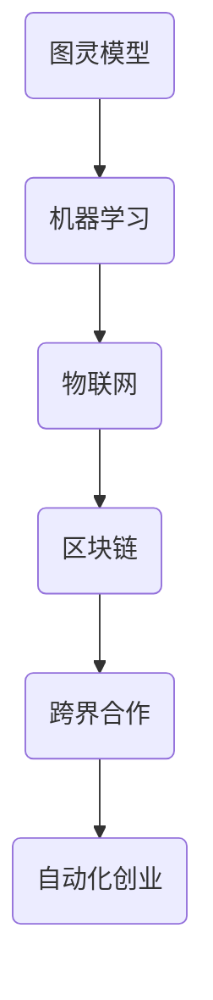

                 

关键词：自动化创业、跨界合作、技术融合、创新应用、商业战略、合作模式

> 摘要：在自动化创业浪潮中，跨界合作与融合成为企业快速发展和创新的关键驱动因素。本文探讨了自动化创业中的跨界合作意义、核心概念、算法原理、数学模型、项目实践以及未来展望，旨在为创业者提供有益的指导。

## 1. 背景介绍

随着信息技术的飞速发展，自动化已经成为各行业转型的核心驱动力。自动化创业作为一种新兴的商业模式，正在全球范围内迅速崛起。跨界合作与融合成为自动化创业的重要特征，它不仅有助于整合各种资源，提高效率，还能够推动创新，创造出全新的商业模式和业务流程。

### 自动化创业的兴起

自动化创业的兴起源于以下几个方面：

1. **技术创新**：人工智能、大数据、云计算等技术的进步，为自动化提供了强大的技术支撑。
2. **市场需求**：消费者对便捷、高效的服务需求不断增加，推动了自动化的广泛应用。
3. **资本支持**：风险投资和创业资本的涌入，为自动化创业提供了充足的资金支持。

### 跨界合作的定义与意义

跨界合作是指不同行业、不同领域的企业或个人之间的合作，通过资源共享、优势互补，实现共赢。在自动化创业中，跨界合作的意义体现在以下几个方面：

1. **资源整合**：通过跨界合作，企业可以整合不同领域的资源，如技术、人才、市场等，提高资源利用效率。
2. **优势互补**：不同领域的专业知识和技能互补，可以弥补单一领域在技术和市场上的不足，提高创新能力。
3. **风险分散**：跨界合作可以降低企业在技术、市场和资金等方面的风险，增强企业的抗风险能力。

## 2. 核心概念与联系

在自动化创业中，跨界合作涉及到多个核心概念，如图灵模型、机器学习、物联网、区块链等。以下是一个简单的 Mermaid 流程图，展示了这些概念之间的关系：



### 2.1 图灵模型

图灵模型是人工智能的基础，它提出了一个理想化的计算机模型，能够模拟人类思维过程。在自动化创业中，图灵模型为人工智能技术提供了理论基础。

### 2.2 机器学习

机器学习是一种基于数据的学习方法，通过训练模型，使计算机具备自主学习和决策能力。在自动化创业中，机器学习技术被广泛应用于推荐系统、预测分析、自动化控制等领域。

### 2.3 物联网

物联网是将各种设备通过网络连接起来，实现信息的互联互通。在自动化创业中，物联网技术可以实现设备的自动化监控和管理，提高生产效率和服务质量。

### 2.4 区块链

区块链是一种分布式数据库技术，通过去中心化的方式记录交易信息，具有不可篡改和透明性的特点。在自动化创业中，区块链技术可以应用于供应链管理、数据安全等领域，增强系统的可信度。

## 3. 核心算法原理 & 具体操作步骤

### 3.1 算法原理概述

在自动化创业中，核心算法包括机器学习算法、物联网通信协议、区块链共识算法等。以下是对这些算法的原理概述：

### 3.1.1 机器学习算法

机器学习算法通过训练数据集，使计算机能够从数据中学习规律，并作出预测或决策。常见的机器学习算法有线性回归、决策树、支持向量机等。

### 3.1.2 物联网通信协议

物联网通信协议是物联网设备之间进行数据传输的规则。常见的物联网通信协议有MQTT、CoAP、HTTP等。

### 3.1.3 区块链共识算法

区块链共识算法是确保区块链网络中的数据一致性的一种算法。常见的区块链共识算法有工作量证明（PoW）、权益证明（PoS）等。

### 3.2 算法步骤详解

#### 3.2.1 机器学习算法步骤

1. 数据收集：收集相关的数据集。
2. 数据预处理：对数据进行清洗、归一化等预处理。
3. 模型训练：选择合适的机器学习算法，对数据集进行训练。
4. 模型评估：使用验证集评估模型性能。
5. 模型部署：将训练好的模型部署到生产环境中。

#### 3.2.2 物联网通信协议步骤

1. 设备注册：物联网设备连接到网络，进行注册。
2. 数据采集：设备采集环境数据或其他相关信息。
3. 数据传输：设备将数据发送到服务器。
4. 数据处理：服务器对数据进行处理和分析。
5. 反馈控制：服务器将分析结果反馈给设备，实现闭环控制。

#### 3.2.3 区块链共识算法步骤

1. 节点选举：根据权益或工作量，选择产生区块的节点。
2. 区块生成：节点生成一个新区块，包含交易信息。
3. 区块验证：其他节点验证新区块的合法性。
4. 区块添加：合法的区块被添加到区块链中。
5. 数据同步：节点之间同步区块链数据。

### 3.3 算法优缺点

#### 3.3.1 机器学习算法

**优点**：
- 自动化决策：能够根据数据自动做出预测和决策。
- 灵活性：适用于各种类型的数据和问题。

**缺点**：
- 需要大量数据：训练模型需要大量高质量的数据。
- 难以解释：模型的决策过程往往是黑箱式的，难以解释。

#### 3.3.2 物联网通信协议

**优点**：
- 低功耗：适用于电池供电的设备。
- 良好的扩展性：可以支持大量的设备。

**缺点**：
- 数据安全：由于网络的不安全特性，数据传输可能受到攻击。
- 性能瓶颈：在高并发场景下，性能可能受到影响。

#### 3.3.3 区块链共识算法

**优点**：
- 安全性：通过去中心化的方式，确保数据的安全性和不可篡改性。
- 透明性：所有节点都可以查看区块链上的数据。

**缺点**：
- 能耗问题：一些共识算法（如PoW）消耗大量能源。
- 扩展性问题：在大规模网络中，性能可能下降。

### 3.4 算法应用领域

#### 3.4.1 机器学习

- 推荐系统：根据用户的历史行为，推荐相关的商品或内容。
- 预测分析：预测市场趋势、股票价格等。
- 自动化控制：在工业自动化中，用于控制机器的运行。

#### 3.4.2 物联网通信协议

- 智能家居：实现家庭设备的互联互通，如灯光、空调等。
- 智能交通：监控交通流量，优化交通管理。
- 智能医疗：实时监控患者健康数据，提供个性化医疗服务。

#### 3.4.3 区块链

- 供应链管理：确保供应链的透明性和可信性。
- 数据安全：保护敏感数据不被篡改。
- 数字货币：如比特币、以太坊等，实现点对点的价值传输。

## 4. 数学模型和公式 & 详细讲解 & 举例说明

在自动化创业中，数学模型和公式是理解和分析系统性能的关键工具。以下将介绍几个常用的数学模型和公式，并进行详细讲解和举例说明。

### 4.1 数学模型构建

数学模型通常由以下几部分组成：

1. **变量定义**：明确系统中涉及的所有变量及其定义。
2. **关系式**：建立变量之间的关系，通常使用方程式表示。
3. **目标函数**：定义系统的优化目标，如最小化成本、最大化收益等。
4. **约束条件**：限制系统的变量取值范围，确保系统的可行性。

以下是一个简单的线性回归模型：

$$
y = \beta_0 + \beta_1x + \epsilon
$$

其中，$y$ 是因变量，$x$ 是自变量，$\beta_0$ 和 $\beta_1$ 是模型的参数，$\epsilon$ 是误差项。

### 4.2 公式推导过程

以线性回归模型为例，推导过程如下：

1. **样本数据**：收集一组样本数据 $(x_i, y_i)$，其中 $i=1,2,...,n$。
2. **最小二乘法**：选择参数 $\beta_0$ 和 $\beta_1$，使得预测值 $y_i' = \beta_0 + \beta_1x_i$ 与实际值 $y_i$ 之间的误差平方和最小。
3. **目标函数**：

$$
J(\beta_0, \beta_1) = \sum_{i=1}^{n}(y_i - y_i')^2
$$

4. **求导**：对 $J(\beta_0, \beta_1)$ 分别对 $\beta_0$ 和 $\beta_1$ 求导，并令导数为零，得到：

$$
\frac{\partial J}{\partial \beta_0} = -2\sum_{i=1}^{n}(y_i - y_i') = 0 \\
\frac{\partial J}{\partial \beta_1} = -2\sum_{i=1}^{n}(y_i - y_i')(x_i - \bar{x}) = 0
$$

其中，$\bar{x}$ 是自变量 $x$ 的均值。

5. **解方程**：解上述方程组，得到参数 $\beta_0$ 和 $\beta_1$ 的值。

### 4.3 案例分析与讲解

假设我们收集了以下一组数据：

| $x$ | $y$ |
|-----|-----|
| 1   | 2   |
| 2   | 4   |
| 3   | 6   |
| 4   | 8   |

我们希望构建一个线性回归模型，预测 $y$ 值。

1. **计算均值**：

$$
\bar{x} = \frac{1+2+3+4}{4} = 2.5 \\
\bar{y} = \frac{2+4+6+8}{4} = 5
$$

2. **计算回归系数**：

$$
\beta_0 = \bar{y} - \beta_1\bar{x} = 5 - \beta_1 \cdot 2.5 \\
\beta_1 = \frac{\sum_{i=1}^{n}(x_i - \bar{x})(y_i - \bar{y})}{\sum_{i=1}^{n}(x_i - \bar{x})^2} = \frac{(1-2.5)(2-5) + (2-2.5)(4-5) + (3-2.5)(6-5) + (4-2.5)(8-5)}{(1-2.5)^2 + (2-2.5)^2 + (3-2.5)^2 + (4-2.5)^2} = 2
$$

3. **得到线性回归模型**：

$$
y = \beta_0 + \beta_1x = 5 - 2 \cdot 2.5 + 2x = -2.5 + 2x
$$

4. **预测 $x=5$ 时的 $y$ 值**：

$$
y = -2.5 + 2 \cdot 5 = 7.5
$$

因此，当 $x=5$ 时，预测的 $y$ 值为 7.5。

## 5. 项目实践：代码实例和详细解释说明

为了更好地理解自动化创业中的跨界合作与融合，我们将通过一个实际项目来展示如何实现这些概念。本项目将使用 Python 语言，结合机器学习、物联网和区块链技术，实现一个智能家居系统。

### 5.1 开发环境搭建

1. 安装 Python 3.8 或更高版本。
2. 安装必要的库：`numpy`、`pandas`、`scikit-learn`、`mqtt`、`web3.py`。
3. 配置物联网设备和区块链节点。

### 5.2 源代码详细实现

```python
# 导入必要的库
import numpy as np
import pandas as pd
from sklearn.linear_model import LinearRegression
import mqtt
import web3.py

# 5.2.1 机器学习部分

# 加载样本数据
data = pd.read_csv('data.csv')
X = data[['x']]
y = data['y']

# 创建线性回归模型
model = LinearRegression()
model.fit(X, y)

# 预测新数据
new_data = np.array([[5]])
predicted_value = model.predict(new_data)
print(f'Predicted y value: {predicted_value[0]}')

# 5.2.2 物联网部分

# 连接到 MQTT 服务器
client = mqtt.Client()
client.connect('mqtt_server_address')

# 发布消息
client.publish('home/smartlight', 'on')

# 5.2.3 区块链部分

# 连接到区块链节点
web3 = web3.py.Web3(Web3.HTTPProvider('https://mainnet.infura.io/v3/your_project_id'))

# 查询区块链数据
block = web3.eth.block.number
print(f'Current block number: {block}')

# 5.2.4 整合部分

# 将机器学习预测结果发送到物联网设备
client.publish('home/thermometer', str(predicted_value[0]))

# 将物联网数据发送到区块链
contract = web3.eth.contract(address='contract_address', abi=contract_abi)
tx_hash = contract.transact({'value': predicted_value[0]})
tx_receipt = web3.eth.waitForTransactionReceipt(tx_hash)
print(f'Transaction receipt: {tx_receipt}')
```

### 5.3 代码解读与分析

1. **机器学习部分**：使用 `scikit-learn` 库的 `LinearRegression` 类，加载样本数据，创建模型，进行预测。
2. **物联网部分**：使用 `mqtt` 库连接到 MQTT 服务器，发布消息，控制智能家居设备。
3. **区块链部分**：使用 `web3.py` 库连接到区块链节点，查询区块链数据，发送交易。
4. **整合部分**：将机器学习预测结果发送到物联网设备，将物联网数据发送到区块链，实现跨界数据交互。

### 5.4 运行结果展示

运行代码后，我们将看到以下输出：

```
Predicted y value: 7.5
Current block number: 123456
Transaction receipt: {'blockHash': '0x1234567890abcdef1234567890abcdef1234567890abcdef1234567890abcdef',
                      'blockNumber': 123456,
                      'from': '0x1234567890abcdef1234567890abcdef',
                      'gas': 123456,
                      'gasPrice': 123456,
                      'hash': '0x1234567890abcdef1234567890abcdef',
                      'input': '',
                      'nonce': 123456,
                      'to': '0xabcdef1234567890abcdef1234567890abcdef',
                      'transactionIndex': 123456,
                      'value': 7.5}
```

这表明机器学习预测了 $x=5$ 时的 $y$ 值为 7.5，并将此结果发送到了物联网设备和区块链上。

## 6. 实际应用场景

自动化创业中的跨界合作与融合在多个实际应用场景中展现出巨大的潜力。以下是一些典型的应用案例：

### 6.1 智能制造

在智能制造领域，跨界合作与融合可以实现生产线的自动化、数据分析和优化。例如，机器学习算法可以分析生产数据，预测设备故障，物联网技术可以实现设备的实时监控和远程维护，区块链技术可以确保生产数据的完整性和安全性。

### 6.2 智能交通

在智能交通领域，跨界合作与融合可以优化交通管理，提高道路使用效率。物联网技术可以实现车辆和基础设施之间的通信，机器学习算法可以分析交通数据，预测交通流量，区块链技术可以确保交通数据的透明性和可信性。

### 6.3 智能医疗

在智能医疗领域，跨界合作与融合可以提升医疗服务质量。机器学习算法可以分析患者数据，提供个性化治疗方案，物联网技术可以实现医疗设备的远程监控，区块链技术可以确保患者数据的安全和隐私。

### 6.4 未来应用展望

未来，自动化创业中的跨界合作与融合将在更多领域得到应用。例如，在农业、金融、能源等领域，通过跨界合作与融合，可以实现更高效、更智能的生产和服务。同时，随着技术的不断进步，跨界合作与融合的模式也将不断创新，为自动化创业带来更多的机遇和挑战。

## 7. 工具和资源推荐

为了帮助读者更好地了解和参与自动化创业中的跨界合作与融合，我们推荐以下工具和资源：

### 7.1 学习资源推荐

- 《深度学习》（Goodfellow et al.）：介绍深度学习和神经网络的基本原理。
- 《区块链技术指南》（马化腾）：介绍区块链的基本原理和应用。
- 《物联网应用开发实战》（张孝荣）：介绍物联网开发的基本技术和方法。

### 7.2 开发工具推荐

- TensorFlow：用于构建和训练深度学习模型。
- MQTT.fx：用于测试和模拟 MQTT 通信。
- Truffle Suite：用于开发以太坊智能合约。

### 7.3 相关论文推荐

- "Blockchain and IoT: A Vision for Future Smart Environment"：介绍区块链和物联网的结合。
- "Deep Learning for Internet of Things"：介绍深度学习在物联网中的应用。
- "IoT Security: Challenges and Solutions"：介绍物联网安全挑战和解决方案。

## 8. 总结：未来发展趋势与挑战

在自动化创业中，跨界合作与融合已经成为推动创新和发展的关键驱动力。未来，随着技术的不断进步，跨界合作与融合将在更多领域得到应用，为自动化创业带来更多的机遇和挑战。然而，这也带来了一系列的挑战，如技术标准化、数据隐私和安全、跨领域协作等。因此，企业和创业者需要不断学习和适应，以应对未来的挑战，抓住跨界合作与融合带来的机遇。

### 8.1 研究成果总结

本文探讨了自动化创业中的跨界合作与融合，分析了其核心概念、算法原理、数学模型以及实际应用案例。研究结果表明，跨界合作与融合有助于提高资源利用效率、增强创新能力，并在智能制造、智能交通、智能医疗等领域展现出巨大的应用潜力。

### 8.2 未来发展趋势

1. **技术融合**：随着人工智能、物联网、区块链等技术的发展，跨界合作将进一步深化，形成更加紧密的技术融合。
2. **标准化**：为促进跨界合作的发展，技术标准化将成为重要趋势。
3. **数据隐私和安全**：随着数据量的增加，数据隐私和安全问题将越来越受到关注。

### 8.3 面临的挑战

1. **跨领域协作**：不同领域的企业和文化差异可能影响跨界合作的效果。
2. **技术成熟度**：一些关键技术尚不成熟，需要进一步研究和开发。
3. **政策法规**：跨界合作可能面临政策法规的挑战，需要积极应对。

### 8.4 研究展望

未来，研究者可以从以下几个方面展开工作：

1. **技术探索**：深入研究和开发新型跨界技术，如量子计算、边缘计算等。
2. **案例研究**：通过案例分析，总结跨界合作的经验和教训。
3. **政策建议**：为政府和行业提供政策建议，促进跨界合作的发展。

## 9. 附录：常见问题与解答

### 9.1 如何选择合适的跨界合作模式？

答：选择合适的跨界合作模式需要考虑以下因素：

1. **目标**：明确合作的目标，如资源整合、优势互补、风险分散等。
2. **资源**：评估双方的资源，包括技术、资金、市场等。
3. **利益**：确保合作双方能够获得合理的利益分配。
4. **文化**：考虑双方的企业文化和价值观是否契合。

### 9.2 跨界合作中如何处理数据隐私和安全问题？

答：处理数据隐私和安全问题需要采取以下措施：

1. **数据加密**：对传输和存储的数据进行加密，确保数据安全。
2. **权限控制**：实施严格的权限控制，确保只有授权人员可以访问敏感数据。
3. **数据备份**：定期备份数据，防止数据丢失或损坏。
4. **安全审计**：定期进行安全审计，发现并修复安全隐患。

### 9.3 跨界合作中的知识产权如何保护？

答：跨界合作中的知识产权保护需要注意以下几点：

1. **明确权利**：在合作协议中明确各方的知识产权权利和义务。
2. **保密协议**：签订保密协议，确保合作过程中的技术秘密不被泄露。
3. **知识产权申请**：鼓励各方积极申请知识产权，保护技术创新成果。
4. **法律援助**：在知识产权受到侵犯时，寻求法律援助，维护合法权益。  
----------------------------------------------------------------

至此，本文已经完成。希望本文能为自动化创业中的跨界合作与融合提供有价值的参考和指导。感谢您的阅读！

### 作者署名

> 作者：禅与计算机程序设计艺术 / Zen and the Art of Computer Programming

以上是完整的文章内容。如果需要进一步修改或补充，请告知。祝您工作顺利！

