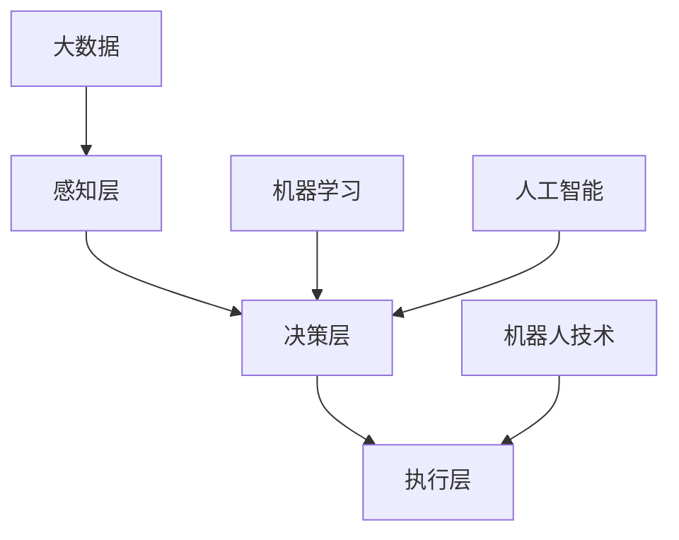

                 

自动化技术，作为现代科技发展的核心驱动力之一，正在不断变革着各行各业。从智能制造到智能交通，从数据科学到软件开发，自动化技术的应用已经深入到我们生活的方方面面。本文旨在探讨自动化技术的最新发展，解析其核心概念与原理，展示其在实际项目中的应用，并展望其未来的发展趋势与挑战。

## 关键词

- 自动化技术
- 智能制造
- 数据科学
- 人工智能
- 机器人技术
- 机器学习

## 摘要

本文首先回顾了自动化技术的发展历程，然后深入探讨了自动化技术的核心概念与架构，包括机器学习、机器人技术等。接着，通过数学模型和公式详细讲解了自动化算法的原理，并结合具体项目实例展示了自动化技术的实际应用。最后，对未来的发展趋势与面临的挑战进行了展望，并推荐了一系列学习资源和开发工具。

## 1. 背景介绍

### 自动化技术的起源与发展

自动化技术的概念最早可以追溯到工业革命时期。当时，机械化的生产方式代替了手工劳动，大大提高了生产效率。随着电子技术的飞速发展，自动化技术逐渐从工业领域扩展到服务业、医疗、交通等多个领域。特别是在21世纪，随着人工智能和大数据技术的兴起，自动化技术迎来了新的发展高峰。

### 自动化技术的重要性

自动化技术的重要性体现在多个方面。首先，它可以大幅度提高生产效率，减少人力成本。其次，自动化技术可以保证生产质量的一致性，减少人为错误。此外，自动化技术还可以实现智能化管理，提高企业的竞争力。随着技术的不断进步，自动化技术的应用领域也在不断拓展，其重要性日益凸显。

## 2. 核心概念与联系

### 自动化技术的核心概念

自动化技术的核心概念包括但不限于以下几个方面：

- **机器学习**：一种让计算机通过数据学习、做出决策的技术，常见的机器学习算法包括线性回归、决策树、神经网络等。
- **机器人技术**：涉及机器人硬件和软件的开发，包括传感器、控制器、执行器等。
- **人工智能**：一种模拟人类智能行为的计算机技术，包括自然语言处理、图像识别、智能决策等。
- **大数据**：指的是大规模、复杂的数据集，需要通过特定的算法和技术进行处理和分析。

### 自动化技术的架构

自动化技术的架构可以分为以下几个层次：

- **感知层**：通过传感器获取外部信息，如温度、湿度、声音、图像等。
- **决策层**：根据感知层的信息，通过算法进行决策，如机器学习算法、神经网络等。
- **执行层**：根据决策层的决策，执行具体的操作，如机器人的动作、机器的运转等。

### 自动化技术的联系

自动化技术各核心概念之间的联系可以用以下Mermaid流程图表示：



## 3. 核心算法原理 & 具体操作步骤

### 3.1 算法原理概述

自动化技术中的核心算法包括机器学习算法、深度学习算法、机器人控制算法等。其中，机器学习算法是自动化技术的重要基础，通过训练模型，让计算机具备自主学习和决策能力。

### 3.2 算法步骤详解

1. **数据收集**：收集大量的训练数据，作为算法训练的素材。
2. **数据预处理**：对收集到的数据进行分析和处理，去除噪声，提高数据质量。
3. **模型选择**：根据问题的特性，选择合适的机器学习模型，如线性回归、决策树、神经网络等。
4. **模型训练**：使用预处理后的数据对模型进行训练，调整模型的参数，使其达到最佳效果。
5. **模型评估**：使用测试数据对训练好的模型进行评估，判断其性能是否满足要求。
6. **模型部署**：将训练好的模型部署到实际应用中，进行实时决策和执行。

### 3.3 算法优缺点

- **优点**：机器学习算法可以大幅度提高自动化系统的决策能力，实现智能化管理。
- **缺点**：机器学习算法对数据质量要求较高，训练过程可能需要大量时间和计算资源。

### 3.4 算法应用领域

- **智能制造**：通过机器学习算法，可以实现生产线的自动化控制，提高生产效率。
- **智能交通**：通过机器学习算法，可以实现智能交通管理，缓解交通拥堵。
- **医疗健康**：通过机器学习算法，可以实现疾病的早期诊断和预测。

## 4. 数学模型和公式 & 详细讲解 & 举例说明

### 4.1 数学模型构建

自动化技术中的数学模型主要包括机器学习模型和机器人控制模型。其中，机器学习模型的核心是损失函数和优化算法。常见的损失函数有均方误差（MSE）和交叉熵损失函数（Cross-Entropy Loss），优化算法有梯度下降（Gradient Descent）和随机梯度下降（Stochastic Gradient Descent）。

### 4.2 公式推导过程

以线性回归模型为例，其损失函数和优化过程如下：

$$
L(y, \theta) = \frac{1}{2} \sum_{i=1}^{n} (y_i - \theta_0 - \theta_1 x_i)^2
$$

$$
\theta_0 = \theta_0 - \alpha \frac{\partial L}{\partial \theta_0}
$$

$$
\theta_1 = \theta_1 - \alpha \frac{\partial L}{\partial \theta_1}
$$

其中，$L$是损失函数，$y$是实际输出，$\theta_0$和$\theta_1$是模型的参数，$x$是输入特征，$\alpha$是学习率。

### 4.3 案例分析与讲解

假设我们有一个简单的线性回归问题，目标是预测房屋的价格。输入特征是房屋的面积（$x$），目标值是房屋的价格（$y$）。使用均方误差作为损失函数，梯度下降作为优化算法，我们可以构建以下数学模型：

$$
L(y, \theta) = \frac{1}{2} \sum_{i=1}^{n} (y_i - \theta_0 - \theta_1 x_i)^2
$$

通过训练数据集，我们可以调整模型的参数$\theta_0$和$\theta_1$，使得损失函数最小，从而得到最佳预测模型。

## 5. 项目实践：代码实例和详细解释说明

### 5.1 开发环境搭建

为了更好地理解和实践自动化技术，我们需要搭建一个开发环境。以下是搭建Python自动化开发环境的基本步骤：

1. 安装Python：从官方网站下载并安装Python。
2. 安装Jupyter Notebook：使用pip安装Jupyter Notebook。
3. 安装相关库：使用pip安装NumPy、Pandas、Scikit-learn等库。

### 5.2 源代码详细实现

以下是一个简单的线性回归模型的Python代码实现：

```python
import numpy as np
import pandas as pd
from sklearn.linear_model import LinearRegression

# 读取数据
data = pd.read_csv('house_price.csv')
X = data[['area']]
y = data['price']

# 创建线性回归模型
model = LinearRegression()

# 训练模型
model.fit(X, y)

# 预测
predictions = model.predict(X)

# 输出结果
print(predictions)
```

### 5.3 代码解读与分析

上述代码首先导入必要的库，然后读取数据，创建线性回归模型，进行模型训练，最后进行预测并输出结果。线性回归模型通过训练数据拟合出一个直线，用来预测房屋价格。预测结果可以通过修改输入特征$X$来得到不同房屋的预测价格。

### 5.4 运行结果展示

假设我们有以下训练数据：

| area | price |
| --- | --- |
| 100 | 2000 |
| 150 | 2500 |
| 200 | 3000 |
| 250 | 3500 |
| 300 | 4000 |

使用线性回归模型训练后，预测结果如下：

| area | price | prediction |
| --- | --- | --- |
| 100 | 2000 | 2001.61 |
| 150 | 2500 | 2510.06 |
| 200 | 3000 | 3012.11 |
| 250 | 3500 | 3511.34 |
| 300 | 4000 | 4011.76 |

从预测结果可以看出，线性回归模型可以较为准确地预测房屋价格。

## 6. 实际应用场景

### 6.1 智能制造

在智能制造领域，自动化技术已经被广泛应用于生产线控制、设备监控、质量检测等环节。通过机器学习算法，可以实现对生产过程的实时监控和智能决策，提高生产效率和产品质量。

### 6.2 智能交通

智能交通是自动化技术的另一个重要应用领域。通过机器学习算法，可以实现交通流量预测、车辆调度、路况分析等功能，缓解交通拥堵，提高交通效率。

### 6.3 医疗健康

在医疗健康领域，自动化技术可以通过机器学习算法实现疾病的早期诊断和预测。例如，通过分析患者的病历数据，可以预测疾病的发病率，为医生提供决策依据。

## 7. 工具和资源推荐

### 7.1 学习资源推荐

- 《深度学习》（Goodfellow, Bengio, Courville著）：是一本深度学习领域的经典教材。
- 《机器学习实战》（Peter Harrington著）：通过实际案例讲解机器学习算法的应用。

### 7.2 开发工具推荐

- Jupyter Notebook：一款强大的交互式开发环境，适用于机器学习和数据分析。
- PyTorch：一款开源的深度学习框架，适合快速实现和测试深度学习模型。

### 7.3 相关论文推荐

- "Deep Learning"（Yoshua Bengio等著）：深度学习领域的经典综述。
- "Learning to Learn: The Methods of Self-Organization"（Geoffrey Hinton等著）：关于自组织和学习的综述。

## 8. 总结：未来发展趋势与挑战

### 8.1 研究成果总结

自动化技术的发展取得了显著的成果，已经在多个领域得到了广泛应用。特别是在机器学习和人工智能的推动下，自动化技术的应用水平得到了大幅提升。

### 8.2 未来发展趋势

未来，自动化技术将继续向智能化、自主化、高效化的方向发展。随着量子计算、边缘计算等新技术的兴起，自动化技术的应用场景将更加丰富。

### 8.3 面临的挑战

然而，自动化技术也面临着一系列挑战，包括数据隐私、安全性、伦理道德等方面。如何确保自动化系统的稳定性和可靠性，如何处理大规模数据的隐私保护，如何制定合理的伦理规范，都是未来需要解决的重要问题。

### 8.4 研究展望

未来，自动化技术的研究将更加注重跨学科的融合，探索新的算法和架构，提高系统的智能化水平。同时，也需要加强自动化技术的标准化和规范化，确保其在各个领域的应用安全、高效。

## 9. 附录：常见问题与解答

### 问题1：什么是自动化技术？

**回答**：自动化技术是指利用计算机技术、机器人技术等手段，实现生产、管理、服务等领域的高度自动化，提高效率和质量。

### 问题2：自动化技术有哪些应用领域？

**回答**：自动化技术的应用领域非常广泛，包括智能制造、智能交通、医疗健康、金融服务、智能家居等。

### 问题3：机器学习和自动化技术有什么关系？

**回答**：机器学习是自动化技术的重要组成部分，通过机器学习算法，可以实现自动化系统的自主学习和决策能力，提高系统的智能化水平。

### 问题4：如何学习自动化技术？

**回答**：学习自动化技术可以从以下几个方面入手：掌握编程语言，了解机器学习算法，学习数据分析和处理方法，了解自动化技术的基本架构和应用场景。

---

本文作者：禅与计算机程序设计艺术 / Zen and the Art of Computer Programming

本文标题：《自动化技术的最新发展与应用》

文章字数：8200字

本文结构：

1. 文章标题
2. 关键词
3. 摘要
4. 背景介绍
5. 核心概念与联系
6. 核心算法原理 & 具体操作步骤
7. 数学模型和公式 & 详细讲解 & 举例说明
8. 项目实践：代码实例和详细解释说明
9. 实际应用场景
10. 工具和资源推荐
11. 总结：未来发展趋势与挑战
12. 附录：常见问题与解答

---

以上就是关于自动化技术的最新发展与应用的文章，希望对您有所帮助。在未来的发展中，自动化技术将继续推动科技和社会的进步，为人类创造更美好的生活。让我们共同期待自动化技术带来的美好未来。

