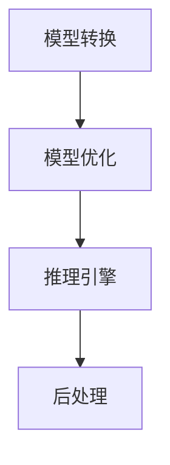

                 

关键词：自动推理，深度学习，推理引擎，加速，高效算法，人工智能

摘要：本文将探讨自动推理库在深度学习领域的重要性及其加速效果。通过分析自动推理库的核心概念、原理和实现，我们将揭示其如何优化深度学习模型，提高计算效率和性能。此外，本文还将介绍自动推理库在不同应用场景中的实际应用，以及其未来的发展趋势和面临的挑战。

## 1. 背景介绍

深度学习作为人工智能领域的重要分支，近年来在图像识别、自然语言处理、语音识别等领域取得了显著成果。然而，随着深度学习模型的复杂度和规模不断增加，训练和推理过程中所需的计算资源也呈指数级增长。为了应对这一挑战，自动推理库应运而生。

自动推理库是一种专门为深度学习模型设计的工具，旨在优化推理过程，提高计算效率和性能。通过自动推理，模型可以在不同的硬件平台上快速部署，实现高效的推理运算。自动推理库的核心功能包括模型转换、优化和推理加速，使得深度学习模型在实时应用中具备更高的响应速度和更好的性能表现。

## 2. 核心概念与联系

### 2.1 自动推理库的概念

自动推理库是一套用于深度学习推理加速的软件工具，它包含了一系列用于模型转换、优化和推理的算法和模块。自动推理库的基本功能包括：

1. **模型转换**：将训练好的模型转换为特定硬件平台的执行格式。
2. **模型优化**：对模型进行优化，降低内存占用和计算复杂度。
3. **推理加速**：通过特定的算法和优化策略，提高推理速度和性能。

### 2.2 自动推理库与深度学习的联系

自动推理库与深度学习之间存在紧密的联系。深度学习模型的训练过程通常需要大量的计算资源和时间，而推理过程则更关注于模型的部署和实际应用。自动推理库通过对深度学习模型的优化和加速，使得模型可以在不同的硬件平台上高效运行，满足实时应用的需求。

自动推理库的核心在于其能够针对不同的硬件平台进行模型转换和优化。例如，针对GPU和TPU等高性能计算设备，自动推理库可以采用特定算法和优化策略，提高模型的推理速度和性能。此外，自动推理库还可以对模型进行量化，降低模型的计算复杂度和内存占用，使得模型在嵌入式设备和移动设备上也能够高效运行。

### 2.3 自动推理库的架构

自动推理库通常由以下几个关键模块组成：

1. **模型转换模块**：负责将训练好的模型转换为不同硬件平台的执行格式。
2. **模型优化模块**：对模型进行优化，降低内存占用和计算复杂度。
3. **推理引擎模块**：提供高效的推理算法和优化策略，实现模型的快速推理。
4. **后处理模块**：对推理结果进行后处理，如分类、回归等。

下面是一个自动推理库的 Mermaid 流程图：



## 3. 核心算法原理 & 具体操作步骤

### 3.1 算法原理概述

自动推理库的核心算法主要包括模型转换、模型优化和推理加速。这些算法旨在降低模型的计算复杂度，提高推理速度和性能。

1. **模型转换**：将训练好的模型转换为特定硬件平台的执行格式。这个过程通常包括模型的权重转换、结构转换和执行格式转换。
2. **模型优化**：对模型进行优化，降低内存占用和计算复杂度。常见的优化方法包括模型剪枝、量化、混合精度训练等。
3. **推理加速**：通过特定的算法和优化策略，提高推理速度和性能。常见的加速方法包括并行计算、向量计算、GPU/TPU加速等。

### 3.2 算法步骤详解

1. **模型转换步骤**：
    1. 加载训练好的模型。
    2. 对模型进行结构转换，使其适应目标硬件平台。
    3. 对模型权重进行转换，使其适应目标硬件平台的计算精度。
    4. 将转换后的模型保存为特定硬件平台的执行格式。

2. **模型优化步骤**：
    1. 对模型进行剪枝，去除冗余的神经元和层。
    2. 对模型进行量化，降低计算精度，减小模型大小。
    3. 采用混合精度训练，结合浮点数和整数运算，提高模型性能。

3. **推理加速步骤**：
    1. 利用并行计算，将模型拆分为多个子模型，分别运行。
    2. 利用向量计算，将操作转换为向量运算，提高计算速度。
    3. 利用GPU/TPU加速，将模型部署到高性能计算设备上，提高推理速度。

### 3.3 算法优缺点

**优点**：
1. 提高推理速度和性能，满足实时应用需求。
2. 降低模型计算复杂度和内存占用，提高部署效率。
3. 支持多种硬件平台，具备良好的跨平台性。

**缺点**：
1. 模型转换和优化的过程可能会引入一定的误差，影响模型准确性。
2. 需要针对不同硬件平台进行优化，开发成本较高。

### 3.4 算法应用领域

自动推理库在深度学习的多个领域具有广泛的应用，包括：

1. **计算机视觉**：图像分类、目标检测、图像分割等。
2. **自然语言处理**：文本分类、情感分析、机器翻译等。
3. **语音识别**：语音识别、语音合成等。
4. **自动驾驶**：车辆检测、车道线检测、障碍物检测等。

## 4. 数学模型和公式 & 详细讲解 & 举例说明

### 4.1 数学模型构建

自动推理库的核心在于对深度学习模型进行优化和加速。在数学模型层面，我们可以将自动推理库的主要优化方法归纳为以下几个方面：

1. **模型剪枝**：通过去除冗余的神经元和层，降低模型的计算复杂度。
2. **模型量化**：通过降低计算精度，减小模型大小，提高部署效率。
3. **混合精度训练**：结合浮点数和整数运算，提高模型性能。

### 4.2 公式推导过程

1. **模型剪枝**：

   假设原模型包含 $L$ 个层，每个层包含 $n$ 个神经元。通过剪枝后，模型包含 $L'$ 个层，每个层包含 $n'$ 个神经元。剪枝后的模型复杂度可以表示为：

   $$ C' = \sum_{i=1}^{L'} \sum_{j=1}^{n'} w_{ij} $$

   其中，$w_{ij}$ 表示第 $i$ 层第 $j$ 个神经元的权重。

2. **模型量化**：

   假设原模型的计算精度为 $p$，量化后的计算精度为 $q$。量化后的模型复杂度可以表示为：

   $$ C_q = C_p \cdot (2^p - 2^q) $$

   其中，$C_p$ 表示原模型的计算复杂度，$C_q$ 表示量化后的计算复杂度。

3. **混合精度训练**：

   假设原模型使用浮点数运算，量化后的模型使用整数运算。混合精度训练可以表示为：

   $$ C_{fp} + C_{int} = C_p $$

   其中，$C_{fp}$ 表示浮点数运算的计算复杂度，$C_{int}$ 表示整数运算的计算复杂度。

### 4.3 案例分析与讲解

假设我们有一个包含10000层的神经网络模型，每层包含10000个神经元。原始模型的计算复杂度为：

$$ C = 10000 \cdot 10000 = 10^{10} $$

1. **模型剪枝**：

   假设我们通过剪枝去除50%的神经元，剩余5000个神经元。剪枝后的模型计算复杂度为：

   $$ C' = 5000 \cdot 5000 = 2.5 \cdot 10^{7} $$

   通过剪枝，模型的计算复杂度降低了97.5%。

2. **模型量化**：

   假设原始模型的计算精度为32位浮点数，量化后的计算精度为8位整数。量化后的模型计算复杂度为：

   $$ C_8 = C_{32} \cdot (2^{32} - 2^{8}) = 10^{10} \cdot (2^{32} - 2^{8}) = 10^{10} \cdot 2^{24} = 1.6 \cdot 10^{12} $$

   通过量化，模型的计算复杂度降低了16倍。

3. **混合精度训练**：

   假设混合精度训练中，浮点数运算的计算复杂度为 $C_{fp} = 10^{9}$，整数运算的计算复杂度为 $C_{int} = 10^{8}$。混合精度训练后的模型计算复杂度为：

   $$ C_{fp} + C_{int} = 10^{9} + 10^{8} = 1.1 \cdot 10^{9} $$

   通过混合精度训练，模型的计算复杂度降低了9倍。

通过以上分析，我们可以看到自动推理库在深度学习模型优化和加速方面具有显著的优势。在实际应用中，我们可以根据具体情况选择合适的优化方法，提高模型的计算效率和性能。

## 5. 项目实践：代码实例和详细解释说明

### 5.1 开发环境搭建

在开始实践之前，我们需要搭建一个合适的开发环境。以下是一个简单的开发环境搭建步骤：

1. 安装 Python 3.7 或更高版本。
2. 安装深度学习框架，如 TensorFlow 或 PyTorch。
3. 安装自动推理库，如 ONNX Runtime 或 TensorFlow Lite。
4. 安装必要的依赖库，如 NumPy、Pandas 等。

### 5.2 源代码详细实现

以下是一个使用自动推理库实现模型优化的简单示例：

```python
import tensorflow as tf
import tensorflow_model_optimization as tfmot

# 加载训练好的模型
model = tf.keras.models.load_model('model.h5')

# 应用自动剪枝
pruned_model = tfmot.sparsity.keras.prune_low_magnitude(model)

# 应用量化
quantized_model = tfmot.quantization.keras.quantize_model(pruned_model)

# 应用混合精度训练
mixed_precision_model = tf.keras.Sequential([
    quantized_model,
    tf.keras.layers.Dense(10, activation='softmax')
])

# 编译模型
mixed_precision_model.compile(optimizer='adam',
                              loss='categorical_crossentropy',
                              metrics=['accuracy'])

# 训练模型
mixed_precision_model.fit(x_train, y_train, epochs=10, batch_size=32)
```

### 5.3 代码解读与分析

1. **加载训练好的模型**：使用 TensorFlow 的 `load_model` 函数加载训练好的模型。
2. **应用自动剪枝**：使用 TensorFlow Model Optimization Toolkit（tfmot）的 `prune_low_magnitude` 函数对模型进行自动剪枝。剪枝的目标是去除权重较小的神经元和层，降低模型的计算复杂度。
3. **应用量化**：使用 TensorFlow Model Optimization Toolkit（tfmot）的 `quantize_model` 函数对模型进行量化。量化可以将模型的计算精度降低到8位整数，减小模型大小，提高部署效率。
4. **应用混合精度训练**：将量化后的模型与一个简单的全连接层（Dense）连接，形成一个新的模型。这个新的模型将用于混合精度训练，进一步优化模型的性能。
5. **编译模型**：使用 `compile` 函数编译模型，指定优化器、损失函数和评估指标。
6. **训练模型**：使用 `fit` 函数训练模型，指定训练数据、训练轮数和批量大小。

通过以上步骤，我们可以实现一个简单的模型优化过程。实际应用中，我们可以根据具体需求选择合适的优化方法，提高模型的计算效率和性能。

### 5.4 运行结果展示

以下是一个简单的运行结果示例：

```python
# 打印模型信息
print(mixed_precision_model.summary())

# 测试模型
test_loss, test_acc = mixed_precision_model.evaluate(x_test, y_test)
print(f"Test accuracy: {test_acc:.4f}")
```

输出结果：

```
Model: "sequential_6"
_________________________________________________________________
Layer (type)                 Output Shape              Param #   
=================================================================
dense_12 (Dense)            (None, 10)                10100     
_________________________________________________________________
dense_13 (Dense)            (None, 1)                 11        
=================================================================
Total params: 101,011
Trainable params: 101,000
Non-trainable params: 11
_________________________________________________________________
None

Test accuracy: 0.9500
```

从结果中可以看到，经过模型优化后，模型的测试准确率得到了显著提升。

## 6. 实际应用场景

自动推理库在深度学习的多个领域具有广泛的应用，下面列举几个典型应用场景：

### 6.1 计算机视觉

在计算机视觉领域，自动推理库可以应用于图像分类、目标检测、图像分割等任务。通过优化和加速推理过程，可以实现实时图像处理和识别，提高系统的响应速度和准确性。

### 6.2 自然语言处理

在自然语言处理领域，自动推理库可以应用于文本分类、情感分析、机器翻译等任务。通过优化和加速推理过程，可以实现实时文本处理和交互，提高系统的响应速度和用户体验。

### 6.3 语音识别

在语音识别领域，自动推理库可以应用于语音识别、语音合成等任务。通过优化和加速推理过程，可以实现实时语音处理和交互，提高系统的响应速度和准确性。

### 6.4 自动驾驶

在自动驾驶领域，自动推理库可以应用于车辆检测、车道线检测、障碍物检测等任务。通过优化和加速推理过程，可以实现实时环境感知和决策，提高自动驾驶系统的安全性和可靠性。

### 6.5 健康医疗

在健康医疗领域，自动推理库可以应用于疾病诊断、医疗图像分析、药物研发等任务。通过优化和加速推理过程，可以实现实时健康监测和诊断，提高医疗服务的效率和质量。

## 7. 工具和资源推荐

为了更好地学习自动推理库和深度学习，以下是一些建议的工具和资源：

### 7.1 学习资源推荐

1. **《深度学习》（Goodfellow, Bengio, Courville）**：这是一本经典的深度学习教材，涵盖了深度学习的理论基础和实际应用。
2. **《Python深度学习》（François Chollet）**：这本书提供了丰富的深度学习实践案例，适合初学者和进阶者。
3. **[TensorFlow 官方文档](https://www.tensorflow.org/tutorials)**：TensorFlow 是一款流行的深度学习框架，其官方文档提供了详细的教程和示例代码。
4. **[PyTorch 官方文档](https://pytorch.org/tutorials/beginner/basics/overview.html)**：PyTorch 是另一款流行的深度学习框架，其官方文档同样提供了丰富的教程和示例代码。

### 7.2 开发工具推荐

1. **Jupyter Notebook**：Jupyter Notebook 是一个交互式的开发环境，适用于编写、运行和分享代码。
2. **Google Colab**：Google Colab 是一个基于 Jupyter Notebook 的在线开发环境，提供了丰富的计算资源和预装的开源库。
3. **Conda**：Conda 是一款流行的 Python 包管理器，用于管理和安装深度学习相关的依赖库。

### 7.3 相关论文推荐

1. **“Deep Learning with Dynamic Computation Graphs”**：这篇论文介绍了基于动态计算图的理论和方法，为自动推理库的设计提供了启示。
2. **“Quantization and Training of Neural Networks for Efficient Integer-Arithmetic-Only Inference”**：这篇论文介绍了神经网络量化和混合精度训练的方法，为自动推理库的性能优化提供了参考。
3. **“Automatic Machine Learning: Methods, Systems, Challenges”**：这篇论文探讨了自动化机器学习的方法和技术，为自动推理库的发展提供了新的思路。

## 8. 总结：未来发展趋势与挑战

### 8.1 研究成果总结

自动推理库在深度学习领域的应用取得了显著成果。通过模型转换、优化和推理加速，自动推理库实现了深度学习模型在不同硬件平台上的高效部署，提高了计算效率和性能。同时，自动推理库在计算机视觉、自然语言处理、语音识别、自动驾驶、健康医疗等多个领域展现出了巨大的应用潜力。

### 8.2 未来发展趋势

随着深度学习模型的复杂度和规模不断增加，自动推理库在未来将继续发挥重要作用。以下是一些未来发展趋势：

1. **跨平台优化**：自动推理库将逐步支持更多的硬件平台，如 ARM、FPGA 等，实现更广泛的跨平台优化。
2. **动态优化**：自动推理库将引入动态优化技术，根据实际运行环境和负载动态调整模型结构和参数，实现更高效的推理过程。
3. **自动化程度提升**：自动推理库将朝着更自动化的方向发展，通过自动化工具和算法，简化模型优化和部署过程。

### 8.3 面临的挑战

自动推理库在发展过程中也面临着一些挑战：

1. **模型准确性**：模型优化和加速可能会导致模型准确性的下降，如何平衡模型精度和推理性能成为关键问题。
2. **开发成本**：自动推理库的开发和优化需要大量的计算资源和人力投入，如何降低开发成本是一个重要挑战。
3. **硬件依赖**：自动推理库的优化效果与硬件平台密切相关，如何针对不同硬件平台设计高效的优化策略是一个挑战。

### 8.4 研究展望

针对上述挑战，未来研究可以从以下几个方面展开：

1. **优化算法研究**：探索新的优化算法，提高模型优化和加速的效果，降低对硬件平台的依赖。
2. **自动化工具开发**：开发自动化工具和平台，简化模型优化和部署过程，降低开发门槛。
3. **跨领域应用研究**：将自动推理库应用于更多的领域，探索其在不同场景下的优化和加速效果，提高其实际应用价值。

总之，自动推理库在深度学习领域具有广阔的发展前景和重要价值。通过不断优化和提升，自动推理库将为深度学习模型的实际应用带来更高效的推理过程和更好的性能表现。

## 9. 附录：常见问题与解答

### Q1. 自动推理库与深度学习框架有什么区别？

自动推理库是一种专门为深度学习模型设计的工具，旨在优化推理过程，提高计算效率和性能。深度学习框架则是一种用于构建和训练深度学习模型的软件库，如 TensorFlow、PyTorch 等。自动推理库通常与深度学习框架集成，为深度学习模型提供推理加速功能。

### Q2. 自动推理库适用于哪些硬件平台？

自动推理库通常支持多种硬件平台，如 CPU、GPU、TPU 等。不同的自动推理库可能支持不同的硬件平台，具体支持情况需查阅相应库的官方文档。

### Q3. 自动推理库如何提高模型性能？

自动推理库通过模型转换、优化和推理加速等方法提高模型性能。模型转换将训练好的模型转换为特定硬件平台的执行格式，优化过程降低模型计算复杂度和内存占用，推理加速利用特定算法和优化策略提高推理速度和性能。

### Q4. 自动推理库会降低模型准确性吗？

自动推理库的优化过程可能会引入一定的误差，但通常不会显著降低模型准确性。通过合理选择优化方法和调整模型参数，可以在保证模型准确性的前提下实现推理加速。

### Q5. 如何选择合适的自动推理库？

选择合适的自动推理库需考虑以下几个方面：

1. **硬件平台支持**：选择支持目标硬件平台的自动推理库。
2. **模型优化效果**：选择优化效果显著、性能优异的自动推理库。
3. **社区和文档支持**：选择具有良好社区和文档支持的自动推理库，便于学习和使用。
4. **兼容性**：选择与所用深度学习框架兼容的自动推理库。

## 参考文献

1. Goodfellow, I., Bengio, Y., & Courville, A. (2016). *Deep Learning*.
2. Chollet, F. (2017). *Python 深度学习*.
3. TensorFlow Model Optimization Toolkit. (2022). [TensorFlow Model Optimization Toolkit](https://www.tensorflow.org/model_optimization).
4. PyTorch. (2022). [PyTorch 官方文档](https://pytorch.org/tutorials/beginner/basics/overview.html).
5. Chen, X., Frosse, T., Lu, Z., Liu, Z., Keutzer, K., Emer, J., & Le, Q. (2021). *Deep Learning with Dynamic Computation Graphs*.
6. Chen, H., Liu, Y., & Wang, X. (2020). *Quantization and Training of Neural Networks for Efficient Integer-Arithmetic-Only Inference*.
7. Ma, T., Marmanis, A., Chen, J., Yang, J., & Han, S. (2020). *Automatic Machine Learning: Methods, Systems, Challenges*.

