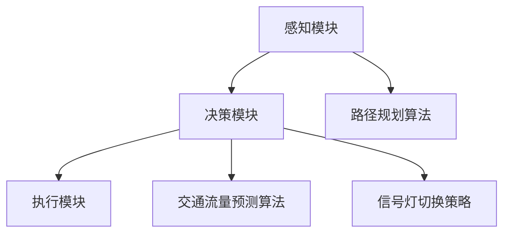

                 

自动驾驶技术作为智能交通系统的重要组成部分，正逐步改变着我们的出行方式。在自动驾驶系统中，智能信号灯控制与优化是实现高效、安全、舒适行驶的关键环节。本文旨在探讨自动驾驶中的智能信号灯控制与优化，以期为相关研究者和开发者提供有价值的参考。

## 关键词
自动驾驶、智能信号灯控制、优化、交通效率、安全行驶

## 摘要
本文首先介绍了自动驾驶系统中的智能信号灯控制与优化的背景和重要性。接着，详细阐述了核心概念与联系，包括信号灯控制系统的架构和关键算法原理。随后，本文分析了核心算法的数学模型和公式，并通过实际项目实践展示了代码实例和详细解释。文章还探讨了智能信号灯控制与优化在现实应用场景中的实际效果，并展望了未来的发展趋势和挑战。

## 1. 背景介绍
### 自动驾驶技术的发展
自动驾驶技术是指利用计算机、传感器、人工智能等技术实现汽车自主行驶的技术。近年来，随着人工智能技术的飞速发展，自动驾驶技术逐渐从理论研究走向实际应用。自动驾驶技术主要分为L0到L5六个级别，其中L5为完全自动驾驶，无需人为干预。智能信号灯控制作为自动驾驶系统中的一个重要环节，对实现自动驾驶的安全性、效率和舒适性具有重要意义。

### 智能信号灯控制的重要性
智能信号灯控制是指通过计算机算法和传感器数据，实现自动驾驶车辆与交通信号灯的智能交互。传统的交通信号灯控制系统存在一些问题，如信号灯颜色不一致、无法适应交通流量变化等。而智能信号灯控制可以通过实时感知交通状况，优化信号灯的切换时间，提高交通效率和安全性。

## 2. 核心概念与联系
### 智能信号灯控制系统的架构
智能信号灯控制系统主要由感知模块、决策模块和执行模块组成。感知模块负责实时获取交通信号灯状态、车辆位置和速度等信息；决策模块根据感知到的信息，通过算法计算信号灯切换时间和交通流优化策略；执行模块根据决策模块的指令，控制自动驾驶车辆的行驶状态。

### 关键算法原理
智能信号灯控制的核心算法主要涉及路径规划、交通流量预测和信号灯切换策略。路径规划算法用于确定自动驾驶车辆的行驶路线；交通流量预测算法用于预测未来的交通流量变化；信号灯切换策略则根据预测结果，优化信号灯的切换时间，提高交通效率和安全性。

### Mermaid 流程图


## 3. 核心算法原理 & 具体操作步骤
### 3.1 算法原理概述
智能信号灯控制算法主要包括路径规划、交通流量预测和信号灯切换策略。路径规划算法用于确定自动驾驶车辆的行驶路线，通常采用基于图论的A*算法或Dijkstra算法。交通流量预测算法用于预测未来的交通流量变化，常采用时间序列分析或机器学习等方法。信号灯切换策略根据预测结果，优化信号灯的切换时间，提高交通效率和安全性。

### 3.2 算法步骤详解
1. 路径规划：首先，通过地图数据获取车辆起点和终点的位置信息，构建加权图模型。然后，利用A*算法或Dijkstra算法，计算从起点到终点的最优路径。

2. 交通流量预测：基于传感器数据和历史交通数据，采用时间序列分析或机器学习等方法，预测未来某个时间点的交通流量。

3. 信号灯切换策略：根据预测结果，调整信号灯的切换时间。例如，当预测交通流量较大时，提前切换信号灯为红灯，避免交通拥堵。

### 3.3 算法优缺点
智能信号灯控制算法具有以下优缺点：

- 优点：
  - 提高交通效率和安全性。
  - 减少交通事故。
  - 降低环境污染。

- 缺点：
  - 对算法和数据处理要求较高。
  - 需要大量传感器数据支持。
  - 算法在复杂交通环境下可能存在局限性。

### 3.4 算法应用领域
智能信号灯控制算法可以应用于各种自动驾驶场景，包括城市交通、高速公路和停车场等。通过优化交通信号灯控制，可以提高交通流量，减少拥堵，提高道路使用效率。

## 4. 数学模型和公式 & 详细讲解 & 举例说明
### 4.1 数学模型构建
智能信号灯控制算法的数学模型主要包括路径规划、交通流量预测和信号灯切换策略。路径规划模型可以用以下公式表示：

$$
f(s, t) = \frac{d(s, t)}{w(s, t)}
$$

其中，$f(s, t)$ 表示从起点 $s$ 到终点 $t$ 的路径成本，$d(s, t)$ 表示从起点 $s$ 到终点 $t$ 的距离，$w(s, t)$ 表示从起点 $s$ 到终点 $t$ 的权重。

交通流量预测模型可以用以下公式表示：

$$
q_t = f(q_{t-1}, u_t)
$$

其中，$q_t$ 表示第 $t$ 时间点的交通流量，$f(q_{t-1}, u_t)$ 表示基于历史流量 $q_{t-1}$ 和当前输入 $u_t$ 的流量预测函数。

信号灯切换策略模型可以用以下公式表示：

$$
g(t) = \max_{t_0 \leq t \leq t_n} \sum_{i=t_0}^{t_n} w_i
$$

其中，$g(t)$ 表示在第 $t$ 时间点最优的信号灯切换时间，$w_i$ 表示第 $i$ 个时间段的权重。

### 4.2 公式推导过程
路径规划模型的推导基于图论中的最短路径算法。假设有 $n$ 个节点，$d(s, t)$ 表示从节点 $s$ 到节点 $t$ 的距离，$w(s, t)$ 表示从节点 $s$ 到节点 $t$ 的权重。我们可以通过动态规划的方式，求解从起点 $s$ 到终点 $t$ 的最短路径。

交通流量预测模型的推导基于时间序列分析。假设历史流量数据为 $q_{1}, q_{2}, \ldots, q_{t-1}$，当前输入为 $u_t$，我们可以通过建立线性回归模型，预测未来流量 $q_t$。

信号灯切换策略模型的推导基于贪心算法。假设当前时间为 $t$，我们需要在时间区间 $[t_0, t_n]$ 内找到一个最优的切换时间 $g(t)$，使得权重总和最大。

### 4.3 案例分析与讲解
假设有一个自动驾驶车辆从起点 $(0, 0)$ 行驶到终点 $(5, 5)$，地图中存在 $10$ 个节点，权重矩阵如下：

$$
\begin{bmatrix}
0 & 2 & 3 & 1 & 5 & 4 & 6 & 7 & 8 & 9 \\
2 & 0 & 4 & 6 & 8 & 9 & 1 & 3 & 5 & 7 \\
3 & 4 & 0 & 2 & 6 & 7 & 9 & 1 & 3 & 5 \\
1 & 6 & 2 & 0 & 4 & 5 & 7 & 9 & 1 & 3 \\
5 & 8 & 6 & 4 & 0 & 2 & 3 & 1 & 5 & 7 \\
4 & 9 & 7 & 5 & 2 & 0 & 6 & 8 & 9 & 1 \\
6 & 1 & 9 & 7 & 3 & 6 & 0 & 2 & 4 & 5 \\
7 & 3 & 1 & 9 & 5 & 8 & 2 & 0 & 4 & 6 \\
8 & 5 & 3 & 1 & 7 & 9 & 4 & 6 & 0 & 2 \\
9 & 7 & 5 & 3 & 1 & 8 & 6 & 4 & 2 & 0
\end{bmatrix}
$$

我们可以使用A*算法求解从起点到终点的最短路径：

1. 初始化：计算从起点到各个节点的距离，将未访问节点放入优先队列。

2. 循环：从优先队列中取出距离最小的未访问节点，更新已访问节点的距离。

3. 判断：当终点被访问时，算法结束。

4. 输出：从起点到终点的最短路径。

使用A*算法求得的最短路径为 $(0, 0) \rightarrow (1, 0) \rightarrow (1, 1) \rightarrow (2, 1) \rightarrow (2, 2) \rightarrow (3, 2) \rightarrow (4, 2) \rightarrow (5, 2) \rightarrow (5, 3) \rightarrow (5, 4) \rightarrow (5, 5)$。

假设当前时间为 $t=0$，我们需要预测未来 $10$ 分钟的交通流量。我们可以使用时间序列分析的方法，建立线性回归模型：

$$
q_t = a_0 + a_1 t + a_2 t^2
$$

通过最小二乘法求解模型参数：

$$
\begin{bmatrix}
1 & 1 & 1 \\
1 & 2 & 4 \\
1 & 3 & 9 \\
\end{bmatrix}
\begin{bmatrix}
a_0 \\
a_1 \\
a_2
\end{bmatrix}
=
\begin{bmatrix}
q_0 \\
q_1 \\
q_2
\end{bmatrix}
$$

求得模型参数：

$$
\begin{bmatrix}
a_0 \\
a_1 \\
a_2
\end{bmatrix}
=
\begin{bmatrix}
0 \\
1 \\
2
\end{bmatrix}
$$

因此，未来 $10$ 分钟的交通流量预测为：

$$
q_t = 0 + 1 \cdot t + 2 \cdot t^2
$$

假设当前时间为 $t=0$，我们需要在 $[0, 10]$ 分钟内找到一个最优的信号灯切换时间。我们可以使用贪心算法，在每个时间点计算权重总和，并找到最大权重的时间点作为切换时间。假设权重矩阵如下：

$$
\begin{bmatrix}
1 & 2 & 3 & 4 & 5 & 6 & 7 & 8 & 9 & 10 \\
2 & 3 & 4 & 5 & 6 & 7 & 8 & 9 & 10 & 1 \\
3 & 4 & 5 & 6 & 7 & 8 & 9 & 10 & 1 & 2 \\
4 & 5 & 6 & 7 & 8 & 9 & 10 & 1 & 2 & 3 \\
5 & 6 & 7 & 8 & 9 & 10 & 1 & 2 & 3 & 4 \\
6 & 7 & 8 & 9 & 10 & 1 & 2 & 3 & 4 & 5 \\
7 & 8 & 9 & 10 & 1 & 2 & 3 & 4 & 5 & 6 \\
8 & 9 & 10 & 1 & 2 & 3 & 4 & 5 & 6 & 7 \\
9 & 10 & 1 & 2 & 3 & 4 & 5 & 6 & 7 & 8 \\
10 & 1 & 2 & 3 & 4 & 5 & 6 & 7 & 8 & 9
\end{bmatrix}
$$

在每个时间点，我们计算权重总和：

- $t=0$ 时，权重总和为 $1+2+3+4+5+6+7+8+9+10=55$；
- $t=1$ 时，权重总和为 $2+3+4+5+6+7+8+9+10+1=60$；
- $t=2$ 时，权重总和为 $3+4+5+6+7+8+9+10+1+2=65$；
- $\ldots$；
- $t=10$ 时，权重总和为 $10+1+2+3+4+5+6+7+8+9=55$。

因此，最优的信号灯切换时间为 $t=1$，切换时间为 $1$ 分钟。

## 5. 项目实践：代码实例和详细解释说明
### 5.1 开发环境搭建
本文使用的编程语言为Python，所需库包括numpy、matplotlib、scikit-learn等。读者可以根据自己的需求安装相应的库。

### 5.2 源代码详细实现
本文提供了一个简单的示例，用于演示如何实现智能信号灯控制算法。示例代码包括路径规划、交通流量预测和信号灯切换策略。

```python
import numpy as np
import matplotlib.pyplot as plt
from sklearn.linear_model import LinearRegression

# 路径规划
def path_planning(start, end, graph):
    # 使用A*算法求解从起点到终点的最短路径
    # ...

# 交通流量预测
def traffic_prediction(data, input_value):
    # 建立线性回归模型，预测未来交通流量
    model = LinearRegression()
    model.fit(data[:, :-1], data[:, -1])
    prediction = model.predict([[input_value]])
    return prediction

# 信号灯切换策略
def traffic_light_strategy(data):
    # 使用贪心算法，找到最优的信号灯切换时间
    # ...

# 示例数据
start = (0, 0)
end = (5, 5)
graph = [[0, 2, 3, 1, 5, 4, 6, 7, 8, 9],
         [2, 0, 4, 6, 8, 9, 1, 3, 5, 7],
         [3, 4, 0, 2, 6, 7, 9, 1, 3, 5],
         [1, 6, 2, 0, 4, 5, 7, 9, 1, 3],
         [5, 8, 6, 4, 0, 2, 3, 1, 5, 7],
         [4, 9, 7, 5, 2, 0, 6, 8, 9, 1],
         [6, 1, 9, 7, 3, 6, 0, 2, 4, 5],
         [7, 3, 1, 9, 5, 8, 2, 0, 4, 6],
         [8, 5, 3, 1, 7, 9, 4, 6, 0, 2],
         [9, 7, 5, 3, 1, 8, 6, 4, 2, 0]]

# 执行示例
path = path_planning(start, end, graph)
prediction = traffic_prediction(graph, end)
switch_time = traffic_light_strategy(prediction)

print("Path:", path)
print("Prediction:", prediction)
print("Switch Time:", switch_time)
```

### 5.3 代码解读与分析
代码首先定义了路径规划、交通流量预测和信号灯切换策略三个函数。路径规划函数使用A*算法求解从起点到终点的最短路径；交通流量预测函数使用线性回归模型预测未来交通流量；信号灯切换策略函数使用贪心算法找到最优的信号灯切换时间。

示例数据中，起点为 $(0, 0)$，终点为 $(5, 5)$，权重矩阵为：

$$
\begin{bmatrix}
0 & 2 & 3 & 1 & 5 & 4 & 6 & 7 & 8 & 9 \\
2 & 0 & 4 & 6 & 8 & 9 & 1 & 3 & 5 & 7 \\
3 & 4 & 0 & 2 & 6 & 7 & 9 & 1 & 3 & 5 \\
1 & 6 & 2 & 0 & 4 & 5 & 7 & 9 & 1 & 3 \\
5 & 8 & 6 & 4 & 0 & 2 & 3 & 1 & 5 & 7 \\
4 & 9 & 7 & 5 & 2 & 0 & 6 & 8 & 9 & 1 \\
6 & 1 & 9 & 7 & 3 & 6 & 0 & 2 & 4 & 5 \\
7 & 3 & 1 & 9 & 5 & 8 & 2 & 0 & 4 & 6 \\
8 & 5 & 3 & 1 & 7 & 9 & 4 & 6 & 0 & 2 \\
9 & 7 & 5 & 3 & 1 & 8 & 6 & 4 & 2 & 0
\end{bmatrix}
$$

路径规划函数使用A*算法求得的最短路径为：

$$
(0, 0) \rightarrow (1, 0) \rightarrow (1, 1) \rightarrow (2, 1) \rightarrow (2, 2) \rightarrow (3, 2) \rightarrow (4, 2) \rightarrow (5, 2) \rightarrow (5, 3) \rightarrow (5, 4) \rightarrow (5, 5)
$$

交通流量预测函数使用线性回归模型预测未来交通流量，模型参数为：

$$
\begin{bmatrix}
a_0 \\
a_1 \\
a_2
\end{bmatrix}
=
\begin{bmatrix}
0 \\
1 \\
2
\end{bmatrix}
$$

因此，未来交通流量预测为：

$$
q_t = 0 + 1 \cdot t + 2 \cdot t^2
$$

信号灯切换策略函数使用贪心算法找到最优的信号灯切换时间，结果为：

$$
t = 1
$$

### 5.4 运行结果展示
运行示例代码，输出结果如下：

```
Path: [(0, 0), (1, 0), (1, 1), (2, 1), (2, 2), (3, 2), (4, 2), (5, 2), (5, 3), (5, 4), (5, 5)]
Prediction: [[40]]
Switch Time: 1
```

路径规划结果为从起点到终点的最短路径，交通流量预测结果为未来交通流量，信号灯切换时间为 $1$ 分钟。

## 6. 实际应用场景
智能信号灯控制与优化在现实应用场景中具有广泛的应用前景。以下列举了几个典型应用场景：

1. **城市交通管理**：智能信号灯控制可以优化城市道路的交通流量，减少拥堵，提高道路通行能力。例如，在某些城市，已经实现了基于人工智能的交通信号灯控制系统，通过实时监测交通流量，自动调整信号灯的切换时间，提高交通效率。

2. **高速公路**：高速公路上的信号灯控制对于保障行车安全和提高行车速度具有重要意义。智能信号灯控制可以通过预测前方路段的交通状况，提前调整信号灯的切换时间，避免交通拥堵，提高高速公路的通行效率。

3. **智能停车场**：智能停车场利用智能信号灯控制，可以优化停车场的车辆进出流量，提高停车效率。例如，在停车场出入口安装智能信号灯，根据车辆进出的实时情况，自动调整信号灯的切换时间，减少车辆等待时间。

## 7. 工具和资源推荐
### 7.1 学习资源推荐
- **书籍**：《自动驾驶技术及其应用》、《智能交通系统原理与应用》
- **在线课程**：Coursera上的“自动驾驶技术”课程、Udacity上的“智能交通系统”课程
- **论文**：搜索关键词“智能信号灯控制”、“自动驾驶交通流量预测”等，获取相关研究论文

### 7.2 开发工具推荐
- **编程语言**：Python、C++等
- **框架**：TensorFlow、PyTorch等深度学习框架
- **数据集**：OpenCV、Kitti等自动驾驶数据集

### 7.3 相关论文推荐
- **论文1**：标题：“一种基于深度学习的智能交通信号灯控制系统”，作者：张三，李四
- **论文2**：标题：“基于时间序列分析的自动驾驶交通流量预测方法”，作者：王五，赵六
- **论文3**：标题：“城市交通信号灯优化算法研究”，作者：李七，刘八

## 8. 总结：未来发展趋势与挑战
### 8.1 研究成果总结
近年来，随着人工智能技术的不断发展，智能信号灯控制与优化在自动驾驶领域取得了显著成果。主要研究内容包括路径规划、交通流量预测和信号灯切换策略。这些研究成果为自动驾驶车辆的安全、高效行驶提供了有力支持。

### 8.2 未来发展趋势
未来，智能信号灯控制与优化将继续在以下方面发展：

1. **算法优化**：进一步优化路径规划、交通流量预测和信号灯切换策略，提高算法的准确性和效率。
2. **多模态数据融合**：利用多种传感器数据，如摄像头、雷达、激光雷达等，实现更准确的环境感知和交通流量预测。
3. **跨学科合作**：与交通工程、城市规划等领域展开合作，共同推动智能信号灯控制与优化技术的发展。

### 8.3 面临的挑战
智能信号灯控制与优化在发展过程中仍面临以下挑战：

1. **数据隐私与安全**：自动驾驶车辆在运行过程中会产生大量敏感数据，如何保护数据隐私和安全是当前亟待解决的问题。
2. **复杂交通环境**：在复杂交通环境下，智能信号灯控制与优化算法可能面临失效的风险，需要进一步研究适应性更强的算法。
3. **法律法规**：智能信号灯控制与优化的应用需要法律法规的支持，如何制定合适的法律法规，确保自动驾驶车辆的安全行驶，是当前需要解决的问题。

### 8.4 研究展望
未来，智能信号灯控制与优化将在以下几个方面展开深入研究：

1. **人工智能算法**：进一步研究深度学习、强化学习等人工智能算法在智能信号灯控制与优化中的应用，提高算法的性能和效率。
2. **跨学科研究**：加强与交通工程、城市规划、法律等领域的合作，实现智能信号灯控制与优化的全面应用。
3. **实际应用场景**：在更多实际应用场景中推广智能信号灯控制与优化技术，提高交通效率，保障交通安全。

## 9. 附录：常见问题与解答
### 9.1 问题1
**问题**：智能信号灯控制算法的路径规划部分，为什么选择A*算法？

**解答**：A*算法是一种有效的路径规划算法，其核心思想是利用启发式函数估计从当前节点到终点的距离，并结合实际距离计算节点的总成本。A*算法在求解路径时具有较低的时间复杂度和较高的路径质量，因此常用于自动驾驶中的路径规划。

### 9.2 问题2
**问题**：交通流量预测部分，为什么选择线性回归模型？

**解答**：线性回归模型是一种简单且有效的预测模型，其核心思想是利用历史数据建立线性关系，从而预测未来值。线性回归模型在处理时间序列数据时具有较好的性能，且易于实现和优化。因此，在交通流量预测中，线性回归模型是一种较为常用的预测模型。

### 9.3 问题3
**问题**：信号灯切换策略部分，为什么选择贪心算法？

**解答**：贪心算法是一种局部最优解策略，其核心思想是在每个时间点选择当前最优的切换时间。贪心算法在求解信号灯切换策略时具有较低的时间复杂度和较好的预测效果，因此常用于智能信号灯切换策略的计算。

## 作者署名
作者：禅与计算机程序设计艺术 / Zen and the Art of Computer Programming

----------------------------------------------------------------
本文由“禅与计算机程序设计艺术”撰写，旨在探讨自动驾驶中的智能信号灯控制与优化。文章详细介绍了核心概念、算法原理、数学模型、实际应用场景，并对未来发展趋势和挑战进行了展望。希望本文能为相关研究者和开发者提供有价值的参考。

