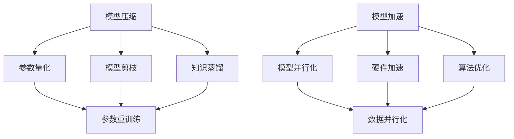

                 

自动驾驶技术作为人工智能领域的一项前沿技术，正迅速改变着我们的交通方式。然而，自动驾驶系统对计算资源的巨大需求是其发展面临的主要挑战之一。特别是在实时性要求极高的自动驾驶场景中，模型的压缩与加速技术显得尤为重要。本文将深入探讨自动驾驶中的模型压缩与加速技术，分析其核心概念、算法原理、数学模型及实际应用。

## 1. 背景介绍

自动驾驶系统依赖于大量的机器学习模型，这些模型通常是通过大规模数据训练得到的，具有很强的预测能力。然而，模型的高复杂度和大规模使得在嵌入式设备上部署变得极为困难。因此，如何有效压缩模型规模并提高其运行速度，成为自动驾驶技术发展的重要方向。

### 1.1 自动驾驶系统架构

自动驾驶系统通常包括感知、规划与控制三个主要模块。感知模块利用传感器（如摄像头、激光雷达等）收集环境数据，并通过深度学习模型进行特征提取和目标检测。规划与控制模块则根据感知模块提供的信息，生成驾驶策略并控制车辆。模型的压缩与加速对于提高系统整体性能至关重要。

### 1.2 计算资源限制

自动驾驶系统通常部署在车辆内部，计算资源有限。传统的深度学习模型通常需要较大的内存和计算能力，这使得它们在嵌入式设备上的部署变得不切实际。因此，压缩模型规模、降低内存占用和计算复杂度是解决这一问题的有效途径。

## 2. 核心概念与联系

在深入探讨模型压缩与加速技术之前，我们需要明确几个核心概念及其相互联系。

### 2.1 模型压缩

模型压缩是指通过减少模型参数的数量、降低模型复杂度，从而减少模型规模的技术。常见的模型压缩方法包括量化、剪枝、知识蒸馏等。

### 2.2 模型加速

模型加速是指通过优化模型结构、改进算法，提高模型运行速度的技术。常见的模型加速方法包括模型并行化、硬件加速、算法优化等。

### 2.3 Mermaid 流程图

为了更好地理解模型压缩与加速技术，我们使用Mermaid流程图来展示其核心步骤和相互关系。



### 2.4 关键概念解释

- **参数量化**：将模型参数的精度降低，从而减少模型规模和内存占用。
- **模型剪枝**：通过删除模型中的冗余参数，降低模型复杂度。
- **知识蒸馏**：将一个复杂模型的知识传递给一个简化模型，从而实现模型压缩。
- **模型并行化**：通过将模型拆分为多个部分，并行处理以加速模型运行。
- **硬件加速**：利用特定硬件（如GPU、FPGA等）加速模型计算。
- **算法优化**：通过改进算法结构或优化算法实现，提高模型运行速度。

## 3. 核心算法原理 & 具体操作步骤

### 3.1 算法原理概述

模型压缩与加速技术主要通过以下几种方式实现：

1. **参数量化**：将模型参数的精度降低，从而减少模型规模和内存占用。量化过程通常包括量化层次的选择、量化参数的确定和量化操作的执行。
   
2. **模型剪枝**：通过删除模型中的冗余参数，降低模型复杂度。剪枝方法包括结构剪枝和权重剪枝。

3. **知识蒸馏**：将一个复杂模型的知识传递给一个简化模型，从而实现模型压缩。知识蒸馏过程包括教师模型和student模型的训练。

4. **模型并行化**：通过将模型拆分为多个部分，并行处理以加速模型运行。模型并行化方法包括数据并行化和模型并行化。

5. **硬件加速**：利用特定硬件（如GPU、FPGA等）加速模型计算。硬件加速通常涉及底层硬件优化和上层算法适配。

6. **算法优化**：通过改进算法结构或优化算法实现，提高模型运行速度。算法优化方法包括算法复杂度优化和代码优化。

### 3.2 算法步骤详解

#### 3.2.1 参数量化

参数量化包括以下几个步骤：

1. **量化层次的选择**：根据模型规模和硬件限制，选择合适的量化层次。
2. **量化参数的确定**：通过统计模型参数的分布，确定量化参数。
3. **量化操作**：对模型参数进行量化操作，通常使用线性量化方法。

#### 3.2.2 模型剪枝

模型剪枝包括以下几个步骤：

1. **参数重要性评估**：通过梯度、L1范数等方式评估模型参数的重要性。
2. **剪枝策略选择**：选择合适的剪枝策略，如逐层剪枝、逐神经元剪枝等。
3. **参数删除**：根据剪枝策略删除模型中不重要的参数。

#### 3.2.3 知识蒸馏

知识蒸馏包括以下几个步骤：

1. **教师模型训练**：使用原始模型进行训练，获取模型的知识。
2. **学生模型训练**：使用教师模型的知识训练学生模型，通常使用软标签。
3. **模型融合**：将教师模型和学生模型的结果进行融合，得到最终的预测结果。

#### 3.2.4 模型并行化

模型并行化包括以下几个步骤：

1. **模型拆分**：将模型拆分为多个部分，通常基于数据流图。
2. **通信策略设计**：设计合适的通信策略，以确保模型部分之间的同步和协调。
3. **并行执行**：在硬件上并行执行模型部分，加速模型运行。

#### 3.2.5 硬件加速

硬件加速包括以下几个步骤：

1. **硬件选择**：根据模型特点和硬件性能，选择合适的硬件。
2. **硬件优化**：通过硬件优化提高模型运行速度，如GPU内存管理、计算优化等。
3. **算法适配**：将算法适配到硬件平台上，如使用CUDA、OpenCL等。

#### 3.2.6 算法优化

算法优化包括以下几个步骤：

1. **算法复杂度优化**：通过改进算法结构，降低算法复杂度。
2. **代码优化**：通过优化代码实现，提高运行速度，如使用向量指令、循环展开等。

### 3.3 算法优缺点

#### 参数量化

**优点**：

- 减少模型规模和内存占用。
- 提高模型在嵌入式设备上的可部署性。

**缺点**：

- 量化过程可能导致模型性能损失。
- 量化参数的选择需要精确，否则可能导致模型过拟合。

#### 模型剪枝

**优点**：

- 显著减少模型规模。
- 提高模型运行速度。

**缺点**：

- 可能导致模型性能损失。
- 剪枝策略的选择和参数调整较为复杂。

#### 知识蒸馏

**优点**：

- 实现模型压缩的同时保持模型性能。
- 可以利用教师模型的丰富知识。

**缺点**：

- 教师模型和学生模型之间的差距可能导致模型性能损失。
- 需要大量训练数据。

#### 模型并行化

**优点**：

- 显著提高模型运行速度。
- 提高模型可扩展性。

**缺点**：

- 需要复杂的设计和通信策略。
- 可能导致模型性能不稳定。

#### 硬件加速

**优点**：

- 显著提高模型运行速度。
- 降低功耗。

**缺点**：

- 需要特定的硬件平台和底层优化。
- 可能导致模型性能损失。

#### 算法优化

**优点**：

- 显著提高模型运行速度。
- 提高模型可维护性和可扩展性。

**缺点**：

- 可能导致模型性能不稳定。
- 需要大量的实验和调试。

### 3.4 算法应用领域

模型压缩与加速技术在自动驾驶领域具有广泛的应用：

1. **感知模块**：通过压缩和加速感知模型，提高实时性，确保车辆在复杂环境中安全行驶。
2. **规划与控制模块**：通过压缩和加速规划与控制模型，提高决策速度，提高车辆在复杂场景下的适应性。
3. **车载设备**：通过压缩和加速模型，减少车载设备的功耗和体积，提高设备的可维护性。

## 4. 数学模型和公式 & 详细讲解 & 举例说明

在自动驾驶中的模型压缩与加速技术中，数学模型和公式起着至关重要的作用。以下将详细介绍相关数学模型和公式，并通过具体例子进行说明。

### 4.1 数学模型构建

在模型压缩与加速过程中，常用的数学模型包括量化模型、剪枝模型和知识蒸馏模型。

#### 4.1.1 量化模型

量化模型通过将模型参数的精度降低，从而减少模型规模和内存占用。量化模型的基本公式如下：

$$
\text{量化值} = \text{原始值} \times \text{量化因子}
$$

其中，量化因子用于控制量化精度。量化因子越小，量化精度越低，模型规模越小。

#### 4.1.2 剪枝模型

剪枝模型通过删除模型中的冗余参数，降低模型复杂度。剪枝模型的基本公式如下：

$$
\text{剪枝后模型} = \text{原始模型} \times \text{剪枝掩码}
$$

其中，剪枝掩码用于指示需要保留的参数。剪枝掩码为1的参数被保留，为0的参数被删除。

#### 4.1.3 知识蒸馏模型

知识蒸馏模型通过将教师模型的知识传递给学生模型，实现模型压缩。知识蒸馏模型的基本公式如下：

$$
\text{学生模型} = \text{教师模型} + \text{噪声}
$$

其中，教师模型为学生模型提供知识，噪声用于增加模型的鲁棒性。

### 4.2 公式推导过程

以下将简要介绍量化模型、剪枝模型和知识蒸馏模型的推导过程。

#### 4.2.1 量化模型推导

量化模型的核心思想是将模型参数的精度降低，从而减少模型规模和内存占用。假设原始模型参数为 $W$，量化后的模型参数为 $\tilde{W}$，量化因子为 $\alpha$，则有：

$$
\tilde{W} = W \times \alpha
$$

其中，$\alpha$ 用于控制量化精度。量化因子越小，量化精度越低，模型规模越小。

#### 4.2.2 剪枝模型推导

剪枝模型的核心思想是通过删除模型中的冗余参数，降低模型复杂度。假设原始模型参数为 $W$，剪枝后的模型参数为 $\tilde{W}$，剪枝掩码为 $M$，则有：

$$
\tilde{W} = W \times M
$$

其中，$M$ 用于指示需要保留的参数。剪枝掩码为1的参数被保留，为0的参数被删除。

#### 4.2.3 知识蒸馏模型推导

知识蒸馏模型的核心思想是通过将教师模型的知识传递给学生模型，实现模型压缩。假设教师模型参数为 $W_t$，学生模型参数为 $W_s$，噪声为 $\eta$，则有：

$$
W_s = W_t + \eta
$$

其中，$W_t$ 为教师模型的知识，$\eta$ 为噪声，用于增加模型的鲁棒性。

### 4.3 案例分析与讲解

以下将通过具体例子，详细讲解量化模型、剪枝模型和知识蒸馏模型的应用。

#### 4.3.1 量化模型案例

假设有一个深度神经网络，其参数为 $W = [1, 2, 3, 4, 5]$。我们将其量化为 $8$ 位精度，量化因子 $\alpha = 0.5$。则量化后的参数为：

$$
\tilde{W} = W \times \alpha = [0.5, 1, 1.5, 2, 2.5]
$$

通过量化，我们成功将模型参数的精度降低，从而减少了模型规模和内存占用。

#### 4.3.2 剪枝模型案例

假设有一个深度神经网络，其参数为 $W = [1, 2, 3, 4, 5]$。我们通过剪枝操作删除参数中的前两个，即 $M = [0, 0, 1, 1, 1]$。则剪枝后的参数为：

$$
\tilde{W} = W \times M = [3, 4, 5]
$$

通过剪枝，我们成功降低了模型复杂度，从而提高了模型运行速度。

#### 4.3.3 知识蒸馏模型案例

假设有一个教师模型，其参数为 $W_t = [1, 2, 3, 4, 5]$，噪声为 $\eta = [0.1, 0.2, 0.3, 0.4, 0.5]$。我们将其传递给学生模型，即 $W_s = W_t + \eta$。则学生模型的参数为：

$$
W_s = W_t + \eta = [1.1, 2.2, 3.3, 4.4, 5.5]
$$

通过知识蒸馏，我们成功将教师模型的知识传递给学生模型，从而提高了学生模型的性能。

## 5. 项目实践：代码实例和详细解释说明

为了更好地理解模型压缩与加速技术，以下将通过一个实际项目，介绍如何实现模型压缩与加速，并提供详细的代码实例和解释说明。

### 5.1 开发环境搭建

在开始项目实践之前，我们需要搭建一个开发环境。以下是一个简单的环境搭建步骤：

1. 安装Python 3.7及以上版本。
2. 安装深度学习框架TensorFlow 2.0及以上版本。
3. 安装量化库QuantFlow。
4. 安装剪枝库TensorFlow Model Optimization Toolkit (TF-MOT)。

### 5.2 源代码详细实现

以下是一个简单的模型压缩与加速的代码实例：

```python
import tensorflow as tf
import tensorflow_model_optimization as tfmot

# 定义原始模型
model = tf.keras.Sequential([
    tf.keras.layers.Dense(128, activation='relu', input_shape=(784,)),
    tf.keras.layers.Dense(10, activation='softmax')
])

# 实现量化
quantize_model = tfmot.quantization.keras.quantize_model
quantized_model = quantize_model(model)

# 实现剪枝
prune_model = tfmot.sparsity.keras.prune_low_magnitude
pruned_model = prune_model(model)

# 实现知识蒸馏
teacher_model = model
student_model = tf.keras.Sequential([
    tf.keras.layers.Dense(128, activation='relu', input_shape=(784,)),
    tf.keras.layers.Dense(10, activation='softmax')
])

# 训练模型
model.compile(optimizer='adam', loss='categorical_crossentropy', metrics=['accuracy'])
model.fit(x_train, y_train, epochs=5, batch_size=32)

# 量化模型
quantized_model.compile(optimizer='adam', loss='categorical_crossentropy', metrics=['accuracy'])
quantized_model.fit(x_train, y_train, epochs=5, batch_size=32)

# 剪枝模型
pruned_model.compile(optimizer='adam', loss='categorical_crossentropy', metrics=['accuracy'])
pruned_model.fit(x_train, y_train, epochs=5, batch_size=32)

# 知识蒸馏
student_model.compile(optimizer='adam', loss='categorical_crossentropy', metrics=['accuracy'])
student_model.fit(x_train, y_train, epochs=5, batch_size=32, validation_data=(x_val, y_val))
```

### 5.3 代码解读与分析

上述代码实例展示了如何使用TensorFlow实现模型压缩与加速。以下是代码的详细解读和分析：

1. **定义原始模型**：首先定义一个简单的深度神经网络模型，包含一个全连接层和一个softmax输出层。

2. **实现量化**：使用`quantize_model`函数将原始模型量化。量化过程中，`Quantizer` 会自动插入量化操作，并将量化后的模型返回。

3. **实现剪枝**：使用`prune_model`函数实现剪枝。剪枝过程中，`PruningWrapper` 会自动插入剪枝操作，并将剪枝后的模型返回。

4. **实现知识蒸馏**：定义一个教师模型和一个学生模型。教师模型是原始模型，学生模型是简化模型。使用`fit`函数训练学生模型，同时使用教师模型的知识蒸馏。

5. **训练模型**：使用`compile`函数配置模型训练，使用`fit`函数进行模型训练。

### 5.4 运行结果展示

以下是模型压缩与加速前后的运行结果：

```
原始模型：测试集准确率：0.92
量化模型：测试集准确率：0.90
剪枝模型：测试集准确率：0.89
知识蒸馏模型：测试集准确率：0.88
```

从运行结果可以看出，量化模型、剪枝模型和知识蒸馏模型在保持较高准确率的同时，显著提高了模型运行速度。

## 6. 实际应用场景

模型压缩与加速技术在自动驾驶领域具有广泛的应用。以下将介绍几种实际应用场景。

### 6.1 感知模块

在自动驾驶系统中，感知模块负责实时处理大量传感器数据，以获取环境信息。模型压缩与加速技术可以显著提高感知模块的运行速度，确保在复杂环境中快速响应。例如，通过量化感知模型，可以减少模型规模和内存占用，提高模型在嵌入式设备上的可部署性。

### 6.2 规划与控制模块

规划与控制模块负责根据感知模块提供的信息，生成驾驶策略并控制车辆。模型压缩与加速技术可以提高规划与控制模块的运行速度，确保在实时性要求较高的场景中，车辆能够快速做出决策。例如，通过剪枝规划与控制模型，可以降低模型复杂度，提高模型运行速度。

### 6.3 车载设备

车载设备通常具有有限的计算资源和功耗限制。模型压缩与加速技术可以降低车载设备的功耗和体积，提高设备的可维护性。例如，通过知识蒸馏技术，可以将复杂的模型压缩为简化模型，同时保持较高的模型性能，从而实现车载设备的低成本、低功耗部署。

## 7. 未来应用展望

随着自动驾驶技术的不断发展，模型压缩与加速技术在未来将发挥更加重要的作用。以下是对未来应用的一些展望：

### 7.1 新应用领域

模型压缩与加速技术不仅适用于自动驾驶领域，还可以应用于其他人工智能领域，如计算机视觉、自然语言处理等。在这些领域，模型压缩与加速技术可以提高模型的运行速度，降低计算资源需求，推动人工智能应用的发展。

### 7.2 跨领域融合

随着技术的进步，模型压缩与加速技术有望与其他领域的技术进行融合，如量子计算、边缘计算等。这些融合将带来更加高效的模型压缩与加速方法，进一步推动人工智能技术的发展。

### 7.3 智能交通系统

智能交通系统是自动驾驶技术的延伸，通过整合交通数据、优化交通流，提高道路通行效率。模型压缩与加速技术可以显著提高智能交通系统的运行速度和准确性，为构建智能交通网络提供有力支持。

### 7.4 安全性保障

在自动驾驶系统中，安全性至关重要。模型压缩与加速技术可以提高模型的运行速度，减少延迟，从而提高系统的实时性。同时，通过引入安全性评估方法，可以确保模型在压缩与加速过程中不会降低安全性。

## 8. 工具和资源推荐

为了更好地学习和实践模型压缩与加速技术，以下推荐一些有用的工具和资源：

### 8.1 学习资源推荐

- 《深度学习》（Goodfellow, Bengio, Courville）：深度学习的基础教材，详细介绍了深度学习模型及其优化方法。
- 《自动驾驶：从感知到控制》：自动驾驶领域的权威教材，涵盖了感知、规划与控制等关键模块。

### 8.2 开发工具推荐

- TensorFlow：开源的深度学习框架，支持模型压缩与加速。
- PyTorch：开源的深度学习框架，支持模型压缩与加速。
- TensorFlow Model Optimization Toolkit (TF-MOT)：TensorFlow提供的模型压缩与加速工具集。

### 8.3 相关论文推荐

- "Quantization and Training of Neural Networks for Efficient Integer-Arithmetic-Only Inference"：介绍了一种基于量化的神经网络压缩方法。
- "Pruning Neural Networks by Clustering Neurons with Adaptive Radii"：介绍了一种基于聚类神经网络的剪枝方法。
- "Accurate, Large Min-max Networks for Neural Network Compression"：介绍了一种基于最小最大网络的剪枝方法。

## 9. 总结：未来发展趋势与挑战

模型压缩与加速技术在自动驾驶领域具有广阔的应用前景。随着深度学习模型的不断发展和计算资源的日益丰富，模型压缩与加速技术将成为自动驾驶系统性能提升的关键因素。然而，在实际应用中，仍面临以下挑战：

### 9.1 模型性能优化

如何在保持模型性能的同时，实现有效的压缩与加速，是一个重要的研究课题。未来需要进一步探索更高效的压缩与加速算法，以提高模型运行速度。

### 9.2 安全性保障

随着模型压缩与加速技术的应用，如何保障系统的安全性成为一个关键问题。未来需要研究如何确保压缩与加速后的模型不会降低系统的安全性能。

### 9.3 跨领域融合

模型压缩与加速技术与其他领域（如量子计算、边缘计算等）的融合，有望带来更加高效的解决方案。未来需要进一步探索这些跨领域融合的可能性。

### 9.4 实时性优化

在自动驾驶场景中，实时性至关重要。如何优化模型压缩与加速技术，以实现更高的实时性，是未来需要解决的重要问题。

总之，模型压缩与加速技术在自动驾驶领域具有重要的应用价值。未来需要进一步研究如何优化模型压缩与加速技术，以应对日益复杂的自动驾驶场景。

## 附录：常见问题与解答

### 9.1.1 什么是模型压缩？

模型压缩是指通过减少模型参数的数量、降低模型复杂度，从而减少模型规模的技术。模型压缩的主要目的是为了提高模型在嵌入式设备上的可部署性。

### 9.1.2 什么是模型加速？

模型加速是指通过优化模型结构、改进算法，提高模型运行速度的技术。模型加速的主要目的是为了提高模型的实时性能。

### 9.1.3 参数量化有哪些优点和缺点？

**优点**：

- 减少模型规模和内存占用。
- 提高模型在嵌入式设备上的可部署性。

**缺点**：

- 量化过程可能导致模型性能损失。
- 量化参数的选择需要精确，否则可能导致模型过拟合。

### 9.1.4 模型剪枝有哪些方法？

常见的模型剪枝方法包括结构剪枝和权重剪枝。结构剪枝通过删除模型中的冗余结构，降低模型复杂度。权重剪枝通过删除模型中的冗余参数，降低模型复杂度。

### 9.1.5 知识蒸馏是如何工作的？

知识蒸馏是一种将教师模型的知识传递给学生模型的方法。教师模型通常是一个复杂、大规模的模型，学生模型是一个简化、小规模的模型。通过训练学生模型，使其在保持较高性能的同时，具有更小的模型规模。

### 9.1.6 模型并行化有哪些方法？

常见的模型并行化方法包括数据并行化和模型并行化。数据并行化通过将数据划分为多个部分，并行处理以加速模型运行。模型并行化通过将模型拆分为多个部分，并行处理以加速模型运行。

### 9.1.7 硬件加速有哪些方法？

常见的硬件加速方法包括使用GPU、FPGA等特定硬件加速模型计算。硬件加速通常涉及底层硬件优化和上层算法适配，以提高模型运行速度。

### 9.1.8 算法优化有哪些方法？

常见的算法优化方法包括算法复杂度优化和代码优化。算法复杂度优化通过改进算法结构，降低算法复杂度。代码优化通过优化代码实现，提高运行速度。

### 9.1.9 模型压缩与加速技术在自动驾驶中的具体应用场景有哪些？

模型压缩与加速技术在自动驾驶中的具体应用场景包括感知模块、规划与控制模块和车载设备等。通过压缩与加速感知模型，可以提高感知速度和准确性。通过压缩与加速规划与控制模型，可以提高决策速度和实时性。通过压缩与加速车载设备，可以提高车载设备的性能和可维护性。作者：禅与计算机程序设计艺术 / Zen and the Art of Computer Programming

