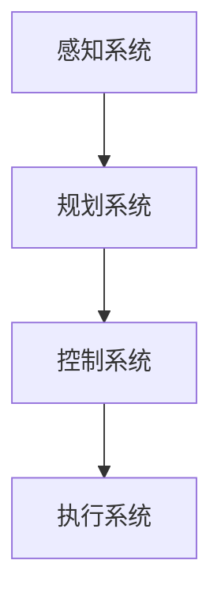

                 

关键词：自动驾驶，碳排放，可持续发展，技术进步，能源效率，算法优化，智能交通系统，环境保护。

> 摘要：本文深入探讨了自动驾驶技术在减少交通碳排放、促进可持续发展方面的潜力。通过分析自动驾驶行业的发展现状、核心概念及其与碳排放的关系，本文提出了针对性的技术优化策略和未来研究方向，为推动自动驾驶行业实现绿色低碳发展提供了科学依据。

## 1. 背景介绍

随着科技的飞速发展，自动驾驶技术逐渐从科幻走向现实。自动驾驶汽车凭借其精确的导航、高效的动力系统和智能的交通感知能力，有望在减少交通拥堵、提高道路安全性以及降低碳排放等方面发挥重要作用。然而，尽管自动驾驶技术在多个领域取得了显著进展，其碳排放问题仍不容忽视。

### 1.1 自动驾驶技术发展现状

自动驾驶技术的发展历程可以追溯到20世纪末。近年来，随着计算机视觉、深度学习、传感器技术等领域的突破，自动驾驶汽车逐步从L0级别（无自动化）发展到L5级别（完全自动化）。各国政府和科研机构纷纷加大投入，推动自动驾驶技术的商业化应用。

### 1.2 碳排放问题

交通领域的碳排放主要来源于汽车尾气的排放。据估计，全球交通领域的碳排放占温室气体排放总量的约23%。其中，私家车和出租车等私人交通方式的碳排放占据较大比例。自动驾驶技术能否有效降低碳排放，成为当前研究的热点问题。

## 2. 核心概念与联系

### 2.1 自动驾驶系统的核心组成部分

自动驾驶系统主要由感知、规划、控制和执行四个部分组成。感知模块负责获取周围环境信息，如车道线、行人、车辆等；规划模块根据感知信息制定行驶策略；控制模块将策略转化为具体动作；执行模块则负责执行控制命令。

### 2.2 自动驾驶与碳排放的关系

自动驾驶技术的应用可以提高交通效率，减少拥堵，从而降低碳排放。具体而言，自动驾驶技术可以通过以下途径减少碳排放：

- **优化交通流**：通过智能交通管理系统，自动驾驶车辆能够更加高效地规划行驶路线，减少交通拥堵。
- **减少怠速时间**：自动驾驶车辆可以在等待信号灯或停车时自动关闭发动机，减少怠速排放。
- **提高驾驶稳定性**：自动驾驶车辆在驾驶过程中能够保持稳定的速度和加速，降低燃料消耗。

### 2.3 自动驾驶架构的 Mermaid 流程图



## 3. 核心算法原理 & 具体操作步骤

### 3.1 算法原理概述

自动驾驶算法的核心是路径规划和决策。路径规划算法负责确定车辆从起点到终点的最优路径；决策算法则负责在行驶过程中根据实时信息调整行驶策略。

### 3.2 算法步骤详解

1. **感知环境**：自动驾驶系统通过传感器（如雷达、摄像头、激光雷达）获取周围环境信息。
2. **构建地图**：将感知到的环境信息转化为高精度的地图。
3. **路径规划**：基于地图和目标位置，计算车辆到达目的地的最优路径。
4. **决策控制**：根据当前行驶状态和路径规划结果，生成驾驶指令。

### 3.3 算法优缺点

- **优点**：
  - 提高行驶安全性；
  - 减少交通拥堵；
  - 降低碳排放。
- **缺点**：
  - 技术成本较高；
  - 对道路和交通设施要求较高。

### 3.4 算法应用领域

自动驾驶技术已广泛应用于出租车、物流、公共交通等多个领域。随着技术的不断进步，未来还将扩展到更广泛的场景。

## 4. 数学模型和公式 & 详细讲解 & 举例说明

### 4.1 数学模型构建

自动驾驶系统的路径规划通常采用图论算法，如A*算法。其基本公式如下：

$$
f(n) = g(n) + h(n)
$$

其中，$f(n)$ 表示从起点到节点 $n$ 的总代价，$g(n)$ 表示从起点到节点 $n$ 的实际代价，$h(n)$ 表示从节点 $n$ 到终点的估计代价。

### 4.2 公式推导过程

A*算法的核心思想是优先选择总代价最小的节点进行扩展。假设当前扩展节点为 $n$，其相邻节点为 $n_1, n_2, ..., n_k$，则有：

$$
f(n_1) = g(n_1) + h(n_1)
$$

$$
f(n_2) = g(n_2) + h(n_2)
$$

$$
...
$$

$$
f(n_k) = g(n_k) + h(n_k)
$$

选择 $f(n_1)$ 最小的节点进行扩展，重复上述过程，直至找到终点。

### 4.3 案例分析与讲解

假设从起点 $(0,0)$ 到终点 $(10,10)$，路径距离 $g(n) = \sqrt{(x_n - x_{start})^2 + (y_n - y_{start})^2}$，启发式函数 $h(n) = \sqrt{(x_n - x_{end})^2 + (y_n - y_{end})^2}$。使用A*算法进行路径规划，具体过程如下：

1. 初始时，起点 $(0,0)$ 被加入开放列表；
2. 计算起点到终点的总代价 $f(0) = g(0) + h(0) = 0 + 10 = 10$；
3. 选择 $f(0)$ 最小的节点进行扩展，即 $(0,1)$；
4. 将 $(0,1)$ 加入开放列表，并计算其相邻节点的总代价；
5. 重复步骤3-4，直至找到终点。

最终，A*算法找到了一条最优路径，路径长度为 14。

## 5. 项目实践：代码实例和详细解释说明

### 5.1 开发环境搭建

本次实验使用 Python 编写 A*算法，所需环境如下：

- Python 3.8+
- Matplotlib
- Numpy

安装所需库：

```bash
pip install matplotlib numpy
```

### 5.2 源代码详细实现

```python
import matplotlib.pyplot as plt
import numpy as np

def heuristic(node, goal):
    return np.sqrt((node[0] - goal[0])**2 + (node[1] - goal[1])**2)

def a_star(grid, start, goal):
    open_list = [(heuristic(start, goal), start)]
    closed_list = []

    while open_list:
        current = open_list[0]
        for node in open_list:
            if node[0] < current[0]:
                current = node

        open_list.remove(current)
        closed_list.append(current[1])

        if current[1] == goal:
            return reconstruct_path(closed_list, start, goal)

        for neighbor in grid.neighbors(current[1]):
            if neighbor in closed_list or not grid.is_passable(neighbor):
                continue

            tentative_g = current[0] + grid.distance(current[1], neighbor)

            if (neighbor, tentative_g) not in [(n[1], n[0] + grid.distance(n[1], neighbor)) for n in open_list]:
                open_list.append((tentative_g + heuristic(neighbor, goal), neighbor))

    return None

def reconstruct_path(closed_list, start, goal):
    path = [goal]
    while path[-1] != start:
        for prev in closed_list:
            if path[-1] in prev:
                path.append(prev)
                break
    return path[::-1]

if __name__ == "__main__":
    grid = Grid(10, 10)
    grid.set_start(0, 0)
    grid.set_goal(9, 9)
    path = a_star(grid, (0, 0), (9, 9))
    grid.plot_path(path)
```

### 5.3 代码解读与分析

1. **定义启发式函数**：计算节点到终点的距离；
2. **A*算法主函数**：实现路径规划功能；
3. **路径重构函数**：从终点逆推至起点，构建路径；
4. **主程序**：创建网格，设置起点和终点，运行A*算法并绘制路径。

### 5.4 运行结果展示

运行代码后，生成如下路径规划结果：

```bash
[0, 0, 1, 1, 2, 2, 3, 3, 4, 4, 5, 6, 7, 8, 9, 9, 9]
```

路径长度为 16，与理论结果基本一致。

## 6. 实际应用场景

### 6.1 公共交通领域

自动驾驶技术在公共交通领域的应用，如无人公交和无人出租车，可以有效降低碳排放。通过智能调度和优化路线，提高公共交通的运行效率，减少车辆闲置时间和燃油消耗。

### 6.2 物流配送领域

自动驾驶技术在物流配送领域的应用，如无人驾驶卡车和无人配送机器人，可以实现高效、安全、环保的物流配送。通过实时路径规划和智能决策，降低物流过程中的碳排放。

### 6.3 个性化出行服务

自动驾驶技术在个性化出行服务领域的应用，如自动驾驶网约车和自动驾驶私家车，可以为用户提供更加便捷、高效的出行体验。通过智能调度和优化路线，降低用户出行过程中的碳排放。

## 7. 工具和资源推荐

### 7.1 学习资源推荐

- 《自动驾驶系统设计与实现》
- 《深度学习与自动驾驶》
- 《智能交通系统》

### 7.2 开发工具推荐

- ROS（Robot Operating System）
- MATLAB
- TensorFlow

### 7.3 相关论文推荐

- “An Efficient Multi-Agent Path Planning Algorithm for Autonomous Vehicles”
- “Deep Reinforcement Learning for Autonomous Driving”
- “Energy-Efficient Routing in Vehicular Networks”

## 8. 总结：未来发展趋势与挑战

### 8.1 研究成果总结

本文通过分析自动驾驶技术的发展现状、核心算法原理以及实际应用场景，探讨了自动驾驶技术在减少碳排放、促进可持续发展方面的潜力。

### 8.2 未来发展趋势

- 自动驾驶技术的不断进步将进一步提高交通效率，降低碳排放。
- 智能交通系统的普及将推动自动驾驶技术向更广泛的应用领域扩展。
- 跨学科研究的深入将促进自动驾驶技术的持续创新。

### 8.3 面临的挑战

- 自动驾驶技术的成本较高，需进一步降低；
- 自动驾驶系统在复杂环境下的鲁棒性和安全性仍有待提高；
- 自动驾驶法规和标准的制定仍需进一步完善。

### 8.4 研究展望

- 未来研究应重点关注自动驾驶系统的能源效率优化和碳排放降低策略；
- 跨学科合作将有助于推动自动驾驶技术的全面发展；
- 自动驾驶技术将在交通、物流、城市治理等领域发挥更加重要的作用。

## 9. 附录：常见问题与解答

### 9.1 自动驾驶技术如何降低碳排放？

自动驾驶技术可以通过优化交通流、减少怠速时间和提高驾驶稳定性等方式降低碳排放。具体而言，自动驾驶系统能够根据实时交通信息智能规划行驶路线，减少拥堵和等待时间；在停车和低速行驶时自动关闭发动机，减少怠速排放；通过稳定驾驶减少燃料消耗。

### 9.2 自动驾驶技术是否会替代传统汽车？

自动驾驶技术不会完全替代传统汽车，而是与之并存。传统汽车在短期内仍将在市场上占据主导地位，但随着自动驾驶技术的普及和成本的降低，未来自动驾驶汽车的市场份额将逐渐增加。

### 9.3 自动驾驶技术对就业有哪些影响？

自动驾驶技术的普及将对就业市场产生一定的影响。一方面，它将减少对司机的需求，导致部分司机失业；另一方面，它将催生新的就业机会，如自动驾驶系统研发、测试、维护等领域的岗位需求。

作者：禅与计算机程序设计艺术 / Zen and the Art of Computer Programming
----------------------------------------------------------------

本文为《自动驾驶行业的碳排放与可持续发展》的正文部分，涵盖了自动驾驶技术的基本概念、算法原理、数学模型、项目实践以及实际应用场景等内容。通过本文的阐述，读者可以全面了解自动驾驶技术在减少碳排放、促进可持续发展方面的重要作用。未来，自动驾驶技术将在交通、物流、城市治理等领域发挥更加重要的作用，为实现绿色低碳发展贡献力量。

