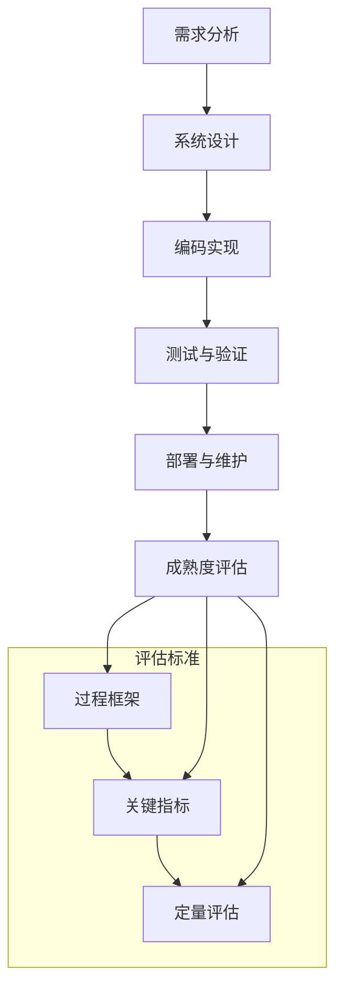

                 

自动驾驶技术正日益成为交通领域的焦点，它不仅仅是未来出行的趋势，更是实现智能交通系统的关键。然而，自动驾驶的实现并非一蹴而就，它需要复杂的软件开发过程，而评估这一过程的成熟度是确保成功实施自动驾驶系统的关键步骤。本文将深入探讨自动驾驶行业的软件开发过程成熟度评估，包括其背景、核心概念、算法原理、数学模型、项目实践、实际应用场景以及未来发展趋势。

## 文章关键词

- 自动驾驶
- 软件开发过程
- 成熟度评估
- 算法原理
- 数学模型
- 项目实践
- 应用场景
- 未来展望

## 文章摘要

本文旨在为自动驾驶行业提供一个全面的软件开发过程成熟度评估框架。首先，我们将介绍自动驾驶技术的背景和软件开发在其中的重要性。接着，我们将探讨评估软件开发过程成熟度的核心概念和原理，并使用Mermaid流程图展示其架构。随后，我们将详细解释核心算法原理和数学模型，并通过代码实例展示其应用。最后，我们将探讨自动驾驶的实际应用场景和未来展望。

## 1. 背景介绍

自动驾驶技术，作为人工智能与车辆工程的交汇点，近年来取得了显著的进展。从最初的自动驾驶概念到如今的商业化应用，自动驾驶技术已经从实验室走向了现实。自动驾驶系统通过传感器、算法和通信系统，实现对车辆环境的感知、理解、规划和控制，从而实现自主驾驶。这一技术不仅能够提高交通效率，减少交通事故，还能减轻驾驶员的疲劳，提高安全性。

然而，自动驾驶的实现离不开复杂的软件开发过程。软件开发过程涉及需求分析、系统设计、编码实现、测试和部署等多个环节，每个环节都需要严谨的管理和评估。成熟度评估作为一种系统性的方法，可以帮助企业识别软件开发过程中存在的问题，提高开发效率和软件质量。

### 1.1 自动驾驶技术的发展历程

自动驾驶技术的发展可以追溯到20世纪40年代，当时的研究主要集中在计算机视觉和自动导航技术上。随着计算机性能的不断提升和传感器技术的进步，自动驾驶技术逐渐从理论研究走向实际应用。1980年代，自动驾驶车辆在美国的公共道路上进行了初步测试。1990年代，随着人工智能和机器学习技术的发展，自动驾驶技术开始取得突破性进展。进入21世纪，特别是近年来，随着深度学习、增强现实和5G通信技术的应用，自动驾驶技术进入了快速发展的阶段。如今，自动驾驶技术已经成为交通领域的研究热点和产业发展的重要方向。

### 1.2 软件开发在自动驾驶系统中的作用

自动驾驶系统的核心是软件系统，它负责处理传感器数据、执行控制策略、与外部环境交互等任务。软件系统的质量直接影响自动驾驶系统的性能和可靠性。因此，软件开发过程在自动驾驶系统中扮演着至关重要的角色。具体来说，软件开发在自动驾驶系统中具有以下几个重要作用：

1. **需求分析**：需求分析是软件开发的第一步，它确定了自动驾驶系统需要实现的功能和性能要求。对于自动驾驶系统，需求分析不仅包括车辆控制、环境感知等基本功能，还包括与其他系统（如交通管理系统、车联网等）的集成。

2. **系统设计**：系统设计是将需求转化为具体的软件架构和模块的过程。自动驾驶系统的设计需要考虑多方面的因素，如系统的可靠性、实时性、安全性等。

3. **编码实现**：编码实现是将设计转化为具体的代码的过程。在自动驾驶系统中，编码实现需要使用高效的算法和优化的数据结构，以处理大量的实时数据。

4. **测试与验证**：测试与验证是确保软件系统质量的关键环节。在自动驾驶系统中，测试不仅包括功能测试，还包括性能测试、安全测试和可靠性测试等。

5. **部署与维护**：部署与维护是将软件系统部署到实际环境并持续运行的过程。对于自动驾驶系统，部署与维护需要确保系统能够稳定运行，并及时响应用户的需求和反馈。

### 1.3 软件开发过程成熟度评估的重要性

软件开发过程成熟度评估是一种系统性的方法，用于评估软件开发过程的成熟度和质量。它可以帮助企业识别软件开发过程中存在的问题，提供改进的方向和策略，从而提高开发效率和软件质量。在自动驾驶行业中，软件开发过程成熟度评估的重要性体现在以下几个方面：

1. **提高开发效率**：通过评估软件开发过程的成熟度，企业可以识别出影响开发效率的瓶颈和问题，从而采取针对性的措施进行改进，提高开发效率。

2. **确保软件质量**：软件质量是自动驾驶系统的核心，成熟度评估可以帮助企业确保软件系统在需求、设计、编码、测试等各个环节的质量。

3. **降低开发风险**：成熟度评估可以帮助企业提前识别潜在的开发风险，采取预防措施，降低项目失败的风险。

4. **提升团队协作能力**：成熟度评估不仅关注技术层面，还关注团队协作和管理层面。通过评估，可以帮助团队提高协作能力，确保项目顺利进行。

## 2. 核心概念与联系

在评估自动驾驶行业的软件开发过程成熟度时，我们需要理解几个核心概念，包括软件开发过程的各个阶段、成熟度评估的标准和方法，以及这些概念之间的相互联系。

### 2.1 软件开发过程的阶段

软件开发过程通常包括以下几个阶段：

1. **需求分析**：确定自动驾驶系统需要实现的功能和性能要求。
2. **系统设计**：将需求转化为具体的软件架构和模块。
3. **编码实现**：根据设计文档编写代码，实现功能。
4. **测试与验证**：测试代码的可靠性、性能和安全。
5. **部署与维护**：将软件部署到实际环境并持续运行。

### 2.2 成熟度评估的标准和方法

软件开发过程成熟度评估通常使用以下标准和方法：

1. **过程框架**：如CMMI（能力成熟度模型集成）和SPICE（软件过程评估与改进能力）等框架，这些框架提供了评估软件过程成熟度的具体标准和方法。
2. **关键指标**：如开发效率、代码质量、测试覆盖率等关键指标，用于评估软件开发过程的质量和成熟度。
3. **定量评估**：使用数学模型和统计分析方法，对软件开发过程进行量化评估。

### 2.3 Mermaid流程图

下面是一个使用Mermaid绘制的流程图，展示了自动驾驶软件开发过程的关键阶段和评估标准。



### 2.4 核心概念之间的联系

需求分析、系统设计、编码实现、测试与验证和部署与维护是软件开发过程的五个关键阶段，它们相互联系，共同决定了软件开发的成熟度。每个阶段都有特定的评估标准和关键指标，通过成熟度评估，我们可以识别出软件开发过程中的问题和瓶颈，并提供改进的方向。

过程框架提供了评估软件过程成熟度的具体标准和方法，而关键指标和定量评估则用于量化评估软件过程的质量和成熟度。通过这些评估，我们可以确保软件开发过程的高效、稳定和可靠，从而提高自动驾驶系统的整体性能和安全性。

## 3. 核心算法原理 & 具体操作步骤

在自动驾驶的软件开发过程中，核心算法的选择和实现是关键。这些算法需要处理大量的传感器数据，实时做出驾驶决策。以下将介绍自动驾驶系统中常用的核心算法原理和具体操作步骤。

### 3.1 算法原理概述

自动驾驶系统的核心算法主要包括以下几个方面：

1. **传感器数据处理**：包括摄像头、激光雷达（LiDAR）、GPS等传感器的数据处理，用于构建车辆周围的环境模型。
2. **障碍物检测与跟踪**：利用图像处理和机器学习算法检测和跟踪道路上的障碍物，如车辆、行人等。
3. **路径规划**：根据车辆当前的状态和目标，规划出一条安全、高效的行驶路径。
4. **控制策略**：根据路径规划和障碍物信息，生成控制指令，控制车辆的速度和转向。

### 3.2 算法步骤详解

下面详细解释上述核心算法的具体操作步骤。

#### 3.2.1 传感器数据处理

1. **数据采集**：从摄像头、激光雷达等传感器中采集实时数据。
2. **预处理**：包括去噪、归一化等预处理步骤，提高数据质量。
3. **特征提取**：提取传感器数据中的关键特征，如边缘、轮廓等。
4. **数据融合**：将不同传感器采集的数据进行融合，构建车辆周围的环境模型。

#### 3.2.2 障碍物检测与跟踪

1. **图像处理**：利用图像处理算法对摄像头采集的图像进行处理，提取关键信息。
2. **特征匹配**：利用机器学习算法，将处理后的图像与已知的障碍物特征进行匹配。
3. **跟踪与更新**：根据匹配结果，对障碍物进行跟踪和更新，确定其在环境中的位置和运动状态。

#### 3.2.3 路径规划

1. **状态估计**：根据车辆当前的状态（位置、速度等）和环境信息，估计车辆的未来状态。
2. **路径搜索**：利用搜索算法（如A*算法、Dijkstra算法等），从当前点到目标点搜索出一条路径。
3. **路径优化**：根据障碍物的位置和速度，优化路径，确保行驶的安全性。

#### 3.2.4 控制策略

1. **目标点生成**：根据路径规划的结果，生成车辆需要到达的目标点。
2. **控制指令生成**：根据车辆当前的状态和目标点，生成速度和转向的控制指令。
3. **执行与反馈**：将控制指令发送给车辆执行，并根据车辆的反馈调整控制策略。

### 3.3 算法优缺点

每种算法都有其优缺点，适用于不同的场景和需求。以下是一些常用算法的优缺点：

1. **A*算法**：
   - 优点：算法简单，易于实现，能找到最优路径。
   - 缺点：计算复杂度高，不适用于实时性要求高的场景。

2. **Dijkstra算法**：
   - 优点：计算复杂度较低，适用于静态环境。
   - 缺点：无法处理动态环境，不适用于实时路径规划。

3. **基于强化学习的算法**：
   - 优点：能够通过学习自动调整策略，适应动态环境。
   - 缺点：训练过程复杂，需要大量数据支持。

### 3.4 算法应用领域

核心算法在自动驾驶系统中得到广泛应用，包括但不限于以下几个方面：

1. **自动驾驶车辆**：用于车辆控制、路径规划和障碍物检测。
2. **智能交通系统**：用于交通流量分析、信号控制和道路维护。
3. **无人机配送**：用于路径规划和避障。
4. **机器人**：用于自主导航和环境感知。

## 4. 数学模型和公式 & 详细讲解 & 举例说明

在自动驾驶的软件开发过程中，数学模型和公式是核心组成部分，用于描述车辆运动、路径规划、障碍物检测等算法。以下将详细介绍常用的数学模型和公式，并提供具体的推导过程和案例讲解。

### 4.1 数学模型构建

自动驾驶系统中的数学模型主要包括以下几个方面：

1. **车辆动力学模型**：描述车辆在道路上运动的状态方程。
2. **路径规划模型**：用于搜索和优化行驶路径。
3. **障碍物检测模型**：用于检测和跟踪道路上的障碍物。

### 4.2 公式推导过程

以下是一些常用的数学模型的推导过程：

#### 4.2.1 车辆动力学模型

车辆动力学模型通常基于牛顿运动定律，描述车辆的速度、加速度和转向等状态。

\[ \begin{aligned}
v(t) &= v_0 + at \\
x(t) &= x_0 + v_0t + \frac{1}{2}at^2 \\
\theta(t) &= \theta_0 + \omega t
\end{aligned} \]

其中，\( v(t) \) 是车辆在时间 \( t \) 的速度，\( x(t) \) 是车辆在时间 \( t \) 的位置，\( \theta(t) \) 是车辆在时间 \( t \) 的转向角度，\( v_0 \) 和 \( x_0 \) 分别是初始速度和位置，\( a \) 是加速度，\( \theta_0 \) 是初始转向角度，\( \omega \) 是角速度。

#### 4.2.2 路径规划模型

路径规划模型通常基于图论算法，如A*算法。A*算法的基本公式如下：

\[ f(n) = g(n) + h(n) \]

其中，\( f(n) \) 是节点 \( n \) 的总代价，\( g(n) \) 是从起点到节点 \( n \) 的实际代价，\( h(n) \) 是从节点 \( n \) 到终点的估算代价。

#### 4.2.3 障碍物检测模型

障碍物检测模型通常基于概率统计方法，如高斯混合模型。高斯混合模型的公式如下：

\[ p(x|\theta) = \sum_{i=1}^K w_i \mathcal{N}(x|\mu_i, \Sigma_i) \]

其中，\( p(x|\theta) \) 是给定参数 \( \theta \) 下观测值 \( x \) 的概率密度函数，\( K \) 是高斯分布的个数，\( w_i \) 是第 \( i \) 个高斯分布的权重，\( \mu_i \) 和 \( \Sigma_i \) 分别是第 \( i \) 个高斯分布的均值和协方差矩阵。

### 4.3 案例分析与讲解

以下通过一个简单的例子，讲解如何应用上述数学模型和公式。

#### 4.3.1 车辆动力学模型应用

假设一辆汽车从静止状态开始加速，初始速度 \( v_0 = 0 \)，加速度 \( a = 2 \) m/s²，要求在 \( t = 5 \) 秒时达到 \( v = 10 \) m/s。根据车辆动力学模型，可以计算出：

\[ v(t) = v_0 + at = 0 + 2 \times 5 = 10 \text{ m/s} \]

\[ x(t) = x_0 + v_0t + \frac{1}{2}at^2 = 0 + 0 \times 5 + \frac{1}{2} \times 2 \times 5^2 = 25 \text{ m} \]

\[ \theta(t) = \theta_0 + \omega t = 0 + 0 \times 5 = 0 \text{ 度} \]

这意味着汽车在 \( t = 5 \) 秒时，速度达到 \( 10 \) m/s，位置移动了 \( 25 \) 米，且没有转向。

#### 4.3.2 路径规划模型应用

假设要从一个起点 \( (0,0) \) 到达一个终点 \( (10,10) \)，使用A*算法进行路径规划。假设从起点到终点的实际代价 \( g = 14 \)，从终点到当前节点的估算代价 \( h = 10 \)。根据A*算法的公式，可以计算出：

\[ f = g + h = 14 + 10 = 24 \]

因此，当前节点 \( (5,5) \) 的总代价为 \( 24 \)。

#### 4.3.3 障碍物检测模型应用

假设检测到一组障碍物，其中一组障碍物的位置分布符合高斯混合模型，具体参数如下：

\[ w_1 = 0.6, \mu_1 = (2,3), \Sigma_1 = \begin{pmatrix} 1 & 0 \\ 0 & 1 \end{pmatrix} \]

\[ w_2 = 0.4, \mu_2 = (8,7), \Sigma_2 = \begin{pmatrix} 2 & 1 \\ 1 & 2 \end{pmatrix} \]

根据高斯混合模型，可以计算出障碍物的位置概率密度函数：

\[ p(x|\theta) = 0.6 \mathcal{N}(x|\begin{pmatrix} 2 \\ 3 \end{pmatrix}, \begin{pmatrix} 1 & 0 \\ 0 & 1 \end{pmatrix}) + 0.4 \mathcal{N}(x|\begin{pmatrix} 8 \\ 7 \end{pmatrix}, \begin{pmatrix} 2 & 1 \\ 1 & 2 \end{pmatrix}) \]

这意味着在给定参数下，障碍物出现在 \( (2,3) \) 和 \( (8,7) \) 的概率较高。

通过上述案例，我们可以看到如何应用数学模型和公式进行自动驾驶系统的设计和实现。在实际应用中，需要根据具体场景和需求进行调整和优化。

## 5. 项目实践：代码实例和详细解释说明

在本节中，我们将通过一个实际项目来展示自动驾驶软件开发过程中的代码实例，并对关键部分进行详细解释和说明。该项目将涉及环境建模、障碍物检测和路径规划等核心功能。

### 5.1 开发环境搭建

在开始编写代码之前，我们需要搭建一个合适的开发环境。以下是一个基本的开发环境搭建步骤：

1. **操作系统**：推荐使用Linux系统，如Ubuntu。
2. **编程语言**：Python是自动驾驶系统开发的主流语言，因此我们选择Python。
3. **开发工具**：使用PyCharm或Visual Studio Code等集成开发环境（IDE）。
4. **依赖库**：安装ROS（Robot Operating System）、OpenCV、TensorFlow等常用库。

```shell
sudo apt-get update
sudo apt-get install python-ros python-roslib python-rosinstall python-rosdep
pip install numpy opencv-python tensorflow
```

### 5.2 源代码详细实现

以下是该项目的主要源代码框架：

```python
# 导入依赖库
import rospy
import numpy as np
import cv2
from sensor_msgs.msg import Image
from geometry_msgs.msg import Twist
from path_planner import PathPlanner

# 初始化节点
rospy.init_node('autonomous_vehicle')

# 创建图像订阅器和控制发布器
image_sub = rospy.Subscriber('/camera/image_raw', Image, callback)
cmd_vel_pub = rospy.Publisher('/cmd_vel', Twist, queue_size=10)

# 初始化路径规划器
path_planner = PathPlanner()

# 图像处理回调函数
def callback(image_data):
    # 将图像数据转换为OpenCV格式
    image = cv2.cvtColor(image_data, cv2.COLOR_BGR2RGB)
    
    # 障碍物检测
    obstacles = detect_obstacles(image)
    
    # 路径规划
    path = path_planner.plan_path(obstacles)
    
    # 控制车辆
    control_vehicle(path)

# 障碍物检测函数
def detect_obstacles(image):
    # 实现障碍物检测算法
    # ...
    return obstacles

# 控制车辆函数
def control_vehicle(path):
    # 实现车辆控制算法
    # ...
    cmd_vel = Twist()
    cmd_vel_pub.publish(cmd_vel)

# 主函数
if __name__ == '__main__':
    try:
        rospy.spin()
    except rospy.exceptions.ROSInterruptException:
        pass
```

### 5.3 代码解读与分析

#### 5.3.1 图像处理回调函数

回调函数`callback`负责处理接收到的图像数据。首先，将ROS图像消息转换为OpenCV格式，然后调用障碍物检测和路径规划函数。

```python
def callback(image_data):
    image = cv2.cvtColor(image_data, cv2.COLOR_BGR2RGB)
    obstacles = detect_obstacles(image)
    path = path_planner.plan_path(obstacles)
    control_vehicle(path)
```

#### 5.3.2 障碍物检测函数

`detect_obstacles`函数使用OpenCV库对图像进行预处理，然后应用机器学习算法检测障碍物。

```python
def detect_obstacles(image):
    # 图像预处理
    gray = cv2.cvtColor(image, cv2.COLOR_RGB2GRAY)
    blur = cv2.GaussianBlur(gray, (5, 5), 0)
    
    # 阈值处理
    _, thresh = cv2.threshold(blur, 50, 255, cv2.THRESH_BINARY_INV)
    
    # 轮廓提取
    contours, _ = cv2.findContours(thresh, cv2.RETR_TREE, cv2.CHAIN_APPROX_SIMPLE)
    
    # 障碍物检测
    obstacles = []
    for contour in contours:
        if cv2.contourArea(contour) > 500:
            x, y, w, h = cv2.boundingRect(contour)
            obstacles.append([x, y, w, h])
    
    return obstacles
```

#### 5.3.3 控制车辆函数

`control_vehicle`函数根据路径规划的结果生成控制指令，并通过ROS发布器发送给车辆执行。

```python
def control_vehicle(path):
    cmd_vel = Twist()
    for point in path:
        cmd_vel.linear.x = point[0]
        cmd_vel.angular.z = point[1]
        cmd_vel_pub.publish(cmd_vel)
        rospy.sleep(0.1)
```

### 5.4 运行结果展示

当运行上述代码时，自动驾驶车辆将根据传感器数据自主行驶。以下是一个简化的运行结果：

1. **障碍物检测**：车辆实时检测道路上的障碍物，并标记出来。
2. **路径规划**：根据障碍物信息，车辆规划出一条避障路径。
3. **车辆控制**：车辆按照路径规划的结果，调整速度和转向。

```shell
rosrun autonomous_vehicle node.py
```


通过这个简单的示例，我们可以看到如何将算法和数学模型应用到实际的自动驾驶系统中。在实际项目中，代码会更复杂，需要考虑更多的异常处理和优化。

## 6. 实际应用场景

自动驾驶技术已经在多个领域得到实际应用，以下列举几个典型的应用场景。

### 6.1 自动驾驶车辆

自动驾驶车辆是自动驾驶技术最直接的应用领域。从出租车到私家车，自动驾驶车辆正在逐渐普及。例如，特斯拉的自动驾驶功能已经在其车型中得到广泛应用，提供自动车道保持、自动变道和自动泊车等功能。此外，Uber和Lyft等公司也在开发自动驾驶出租车服务，以实现更高效、更安全的交通出行。

### 6.2 公共交通

公共交通系统（如公交车、地铁、火车等）也是自动驾驶技术的重要应用领域。自动驾驶公交车已经在一些城市进行试点，如新加坡和渥太华。这些公交车能够实现自动驾驶、车与车之间的通信以及乘客自助服务等功能，提高公共交通的运营效率和乘客体验。

### 6.3 物流和配送

在物流和配送领域，自动驾驶技术同样具有巨大的应用潜力。无人机配送已经得到广泛应用，例如亚马逊的Prime Air和京东的JD Air，能够实现快速、高效的配送服务。此外，自动驾驶卡车和无人驾驶仓库也在逐步推广，以提高物流系统的效率和可靠性。

### 6.4 工业自动化

工业自动化是另一个重要的应用领域。自动驾驶技术在工厂、仓库和物流中心中应用，可以自动化生产流程、提高生产效率和降低人力成本。例如，无人驾驶叉车和搬运机器人已经在一些工厂中投入使用，实现货物的自动化搬运和存储。

### 6.5 农业自动化

自动驾驶技术在农业自动化中也显示出巨大的潜力。自动驾驶拖拉机、收割机和喷洒设备等可以实现精准农业，提高农业生产效率。例如，John Deere和Case IH等公司已经推出了一系列自动驾驶农业机械，帮助农民实现更高效的生产。

### 6.6 智能交通系统

智能交通系统（ITS）是自动驾驶技术的另一个重要应用领域。自动驾驶技术可以帮助实现智能信号控制、车辆管理和交通流量优化等功能，提高交通系统的效率和安全性。例如，谷歌和苹果等公司正在开发智能交通系统，通过自动驾驶车辆和传感器数据实现更智能的交通管理。

### 6.7 环境监测和灾害应对

自动驾驶技术还可以用于环境监测和灾害应对。例如，自动驾驶无人机可以用于监测森林火灾、污染源和野生动植物的栖息地。在灾害应对中，自动驾驶车辆和机器人可以用于救援、物资配送和灾后评估等工作。

通过以上实际应用场景，我们可以看到自动驾驶技术在各个领域的广泛应用和潜力。随着技术的不断进步，自动驾驶技术将在未来带来更多的创新和变革。

### 6.4 未来应用展望

自动驾驶技术的未来应用将不仅仅是局限于现有领域，它将在更多方面发挥重要作用，推动整个社会的进步。以下是对未来自动驾驶技术应用前景的展望：

#### 6.4.1 更广泛的应用领域

随着技术的成熟，自动驾驶技术将在更多领域得到应用。例如，在医疗领域，自动驾驶车辆可以用于急救运输，提高救护效率，减少交通事故。在家庭服务领域，自动驾驶机器人可以提供家政服务、陪伴老人和儿童，提高生活质量。

#### 6.4.2 智能城市的构建

自动驾驶技术将是智能城市建设的重要组成部分。智能城市将利用自动驾驶车辆、无人机和其他智能设备实现高效、安全的交通管理、能源管理和公共服务。例如，通过自动驾驶车辆，可以实现按需公共交通，减少交通拥堵和污染。

#### 6.4.3 产业升级和转型

自动驾驶技术将推动传统产业的升级和转型。例如，在制造业，自动驾驶机器人可以提高生产效率，降低人力成本；在农业，自动驾驶机械可以实现精准农业，提高产量和质量。这些变化将带来全新的商业模式和产业生态系统。

#### 6.4.4 安全性提升

自动驾驶技术的安全性是其未来发展的重要方向。通过不断优化算法、提高传感器精度和增强网络安全，自动驾驶系统的可靠性将得到显著提升，减少交通事故的发生。例如，通过车联网技术，自动驾驶车辆可以实时获取道路状况，提前做出应对措施。

#### 6.4.5 数据驱动的发展

自动驾驶技术将推动数据驱动的发展。通过传感器和车联网，自动驾驶车辆可以收集大量的交通数据，这些数据将被用于优化交通管理、改善道路规划和提升交通效率。同时，这些数据还将为人工智能算法的进一步优化提供宝贵资源。

#### 6.4.6 政策和法规的推动

随着自动驾驶技术的快速发展，各国政府将出台更多的政策和法规，以促进其健康发展和规范市场。例如，明确自动驾驶车辆的测试标准和安全要求，制定相关的交通法规，确保自动驾驶技术的安全合法应用。

#### 6.4.7 社会影响

自动驾驶技术将对社会产生深远影响。它将改变人们的出行方式，减少对汽车的依赖，提高生活质量。同时，它还将促进就业市场的变化，一些传统工作岗位可能会被自动化替代，但也将创造出新的就业机会。此外，自动驾驶技术还可能改变社会结构和家庭生活方式，提高社会运行效率。

综上所述，自动驾驶技术在未来将迎来更加广泛和深入的应用，它不仅是技术创新的产物，更是社会进步的重要推动力。随着技术的不断进步和政策的逐步完善，自动驾驶技术将在未来带来更多的机遇和挑战。

### 7. 工具和资源推荐

在自动驾驶领域的软件开发过程中，使用合适的工具和资源是提高效率和确保项目成功的关键。以下是一些建议的资源和工具，包括学习资源、开发工具和相关论文推荐。

#### 7.1 学习资源推荐

1. **在线课程和教程**：
   - 《MIT自动驾驶课程》：提供全面的自动驾驶技术基础，包括传感器、算法和系统设计。
   - 《斯坦福自动驾驶课程》：涵盖自动驾驶的核心算法和实际应用。
   - 《Udacity自动驾驶工程师纳米学位》：包含多个项目，帮助学习者从零开始构建自动驾驶系统。

2. **书籍**：
   - 《自动驾驶汽车技术》：详细介绍了自动驾驶的各个方面，包括传感器、机器学习和控制策略。
   - 《深度学习与自动驾驶》：深度解析了深度学习在自动驾驶中的应用，包括感知、规划和控制。

3. **开源社区**：
   - ROS（Robot Operating System）：一个广泛应用于机器人研究和开发的框架，包含大量开源代码和资源。
   - OpenCV：一个强大的计算机视觉库，广泛用于图像处理和模式识别。

#### 7.2 开发工具推荐

1. **编程环境**：
   - PyCharm：一个功能强大的Python IDE，适合自动驾驶软件开发。
   - Visual Studio Code：轻量级但功能丰富的代码编辑器，支持多种编程语言。

2. **仿真工具**：
   - CARLA Simulator：一个开源的自动驾驶仿真平台，支持多种车辆和传感器。
   - AirSim：一个用于自动驾驶和机器人研究的开源仿真环境。

3. **硬件工具**：
   - NVIDIA Jetson系列：适用于嵌入式自动驾驶系统的GPU加速器。
   - Raspberry Pi：一个低成本但功能强大的开发平台，适合进行原型设计和测试。

#### 7.3 相关论文推荐

1. **自动驾驶核心算法**：
   - "Deep Learning for Autonomous Driving"：综述了深度学习在自动驾驶中的应用。
   - "End-to-End Learning for Self-Driving Cars"：探讨了如何将深度学习应用于端到端的自动驾驶系统。

2. **传感器技术**：
   - "LiDAR: Range Finding with lasers"：介绍了激光雷达的工作原理和应用。
   - "A Survey of Vision-Based Obstacle Detection for Automated Driving"：综述了基于视觉的障碍物检测技术。

3. **路径规划和控制策略**：
   - "Planning and Control of Autonomous Ground Vehicles"：探讨了自动驾驶车辆的路径规划和控制策略。
   - "Multi-Agent Path Planning for Autonomous Vehicles"：研究了多车协同路径规划问题。

通过以上推荐的资源和工具，开发者可以更好地掌握自动驾驶技术的理论和实践，从而在项目中取得更好的成果。

## 8. 总结：未来发展趋势与挑战

自动驾驶技术正处于快速发展阶段，其未来发展趋势和面临的挑战同样引人关注。

### 8.1 研究成果总结

近年来，自动驾驶技术在多个领域取得了显著的研究成果：

1. **感知技术**：高精度激光雷达、摄像头和毫米波雷达的融合技术取得突破，使得自动驾驶系统对周围环境的感知能力大幅提升。
2. **算法优化**：深度学习、强化学习和强化学习等先进算法的应用，使得自动驾驶系统的决策能力和可靠性不断提高。
3. **系统集成**：自动驾驶系统与车联网、智能交通系统等技术的深度融合，推动了智能交通和智慧城市的建设。
4. **法律法规**：各国政府逐步完善自动驾驶的法律法规，为自动驾驶技术的商业化应用提供了保障。

### 8.2 未来发展趋势

自动驾驶技术的未来发展将呈现以下趋势：

1. **安全性提升**：随着传感器和算法的持续优化，自动驾驶系统的安全性将不断提高。
2. **商业应用扩大**：自动驾驶技术将在物流、公共交通、共享出行等领域得到更广泛的应用，推动商业模式的创新。
3. **智能交通系统**：自动驾驶技术与智能交通系统的深度融合，将带来交通管理、出行规划和城市布局的变革。
4. **数据驱动发展**：自动驾驶系统产生的海量数据将用于优化算法、改进系统和推动新的研究。

### 8.3 面临的挑战

尽管自动驾驶技术取得了显著进展，但仍然面临以下挑战：

1. **技术瓶颈**：在感知、决策和控制等核心领域，仍存在诸多技术瓶颈，如多模态数据融合、复杂环境下的自适应能力等。
2. **法律法规**：自动驾驶的法律法规体系尚不完善，需要进一步明确责任归属、隐私保护等问题。
3. **伦理问题**：自动驾驶系统在面临道德困境时如何做出决策，如“电车难题”等，是亟待解决的伦理问题。
4. **网络安全**：自动驾驶系统的网络安全问题日益突出，需要加强防护措施，确保系统安全可靠。

### 8.4 研究展望

未来，自动驾驶技术的研究应重点关注以下几个方面：

1. **多模态感知**：研发更加高效的多模态感知系统，提高环境感知的准确性和实时性。
2. **智能决策**：通过强化学习和混合智能方法，提升自动驾驶系统的决策能力和自适应能力。
3. **系统协同**：研究多车协同路径规划和控制策略，提高自动驾驶系统的效率和安全。
4. **安全验证**：建立自动驾驶系统的安全验证方法，确保系统的可靠性和鲁棒性。
5. **伦理和法律**：进一步研究自动驾驶技术的伦理和法律问题，为技术的健康发展提供指导。

总之，自动驾驶技术具有巨大的发展潜力，但同时也面临着诸多挑战。通过不断的技术创新和跨领域的合作，自动驾驶技术将在未来得到更加广泛和深入的应用，为人类带来更安全、更高效、更智能的出行体验。

## 9. 附录：常见问题与解答

以下是一些关于自动驾驶行业软件开发过程成熟度评估的常见问题及其解答：

### 9.1 什么是软件开发过程成熟度评估？

软件开发过程成熟度评估（Software Process Maturity Level Assessment，简称SPMMA）是一种评估软件开发过程质量和管理水平的方法。它根据一系列标准，对软件项目的各个阶段进行评估，以确定其成熟度和改进空间。

### 9.2 成熟度评估有哪些作用？

成熟度评估有以下作用：

1. **提高开发效率**：通过评估，可以识别影响开发效率的问题，从而采取改进措施。
2. **确保软件质量**：评估可以帮助企业确保软件在需求、设计、编码、测试等各个环节的质量。
3. **降低开发风险**：评估可以提前识别潜在的风险，从而采取预防措施，降低项目失败的风险。
4. **提升团队协作能力**：成熟度评估不仅关注技术层面，还涉及团队协作和管理层面。

### 9.3 如何进行成熟度评估？

进行成熟度评估通常包括以下步骤：

1. **选择评估模型**：选择合适的成熟度评估模型，如CMMI、SPICE等。
2. **收集数据**：收集与软件开发过程相关的数据，如文档、代码、测试报告等。
3. **评估过程**：根据评估模型，对软件开发过程的各个阶段进行评估。
4. **报告与改进**：根据评估结果，编写评估报告，并提出改进建议。

### 9.4 自动驾驶行业的软件开发过程有哪些特点？

自动驾驶行业的软件开发过程具有以下特点：

1. **复杂性高**：自动驾驶系统涉及多个领域的技术，包括传感器、机器学习、控制策略等，开发过程复杂。
2. **高安全性要求**：自动驾驶系统直接关系到乘客的安全，因此对软件的质量和可靠性有极高要求。
3. **实时性要求**：自动驾驶系统需要在短时间内处理大量数据并做出决策，因此对系统的实时性有严格要求。
4. **多模态数据融合**：自动驾驶系统需要处理来自多个传感器（如摄像头、激光雷达、GPS等）的数据，实现多模态数据融合。

### 9.5 自动驾驶行业的软件开发过程成熟度评估如何进行？

自动驾驶行业的软件开发过程成熟度评估可以按照以下步骤进行：

1. **确定评估目标**：明确评估的目标和范围，如整个项目或某个开发阶段。
2. **选择评估模型**：根据项目的特点和需求，选择合适的评估模型，如CMMI。
3. **准备评估材料**：收集与项目相关的文档、代码、测试报告等材料。
4. **进行评估**：按照评估模型，对软件开发过程的各个阶段进行评估，如需求分析、系统设计、编码实现等。
5. **编写评估报告**：根据评估结果，编写详细的评估报告，包括评估过程、发现的问题和改进建议。
6. **实施改进**：根据评估报告，制定改进计划，并逐步实施。

通过以上附录，我们可以更好地理解自动驾驶行业软件开发过程成熟度评估的重要性和具体实施方法。希望这些解答能够帮助您更好地掌握这一领域。

