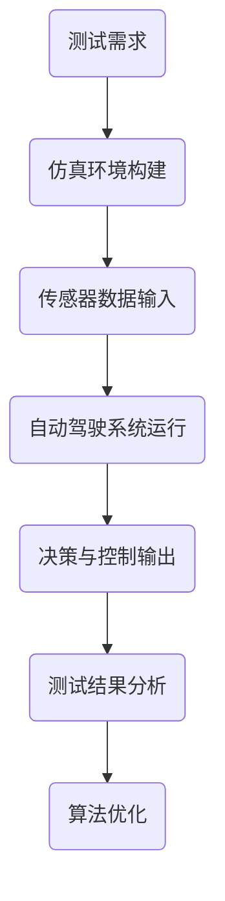

                 

关键词：自动驾驶，影子模式测试，仿真，测试方法，安全性，可靠性，算法优化

> 摘要：本文将探讨自动驾驶领域的影子模式测试，详细介绍其背景、核心概念与联系、算法原理与具体操作步骤、数学模型与公式、项目实践、实际应用场景以及未来展望。通过本文，读者将深入了解影子模式测试在自动驾驶领域的重要性，掌握其核心技术和方法，为自动驾驶技术的研发和应用提供有益的参考。

## 1. 背景介绍

随着人工智能技术的不断发展，自动驾驶技术逐渐成为智能交通系统的重要组成部分。自动驾驶汽车通过搭载各种传感器（如雷达、激光雷达、摄像头等）收集环境信息，利用先进的计算机算法对信息进行处理，最终实现车辆自主驾驶。然而，自动驾驶系统在真实环境中的运行面临着诸多挑战，如传感器数据的不确定性、复杂交通场景的识别与理解、车辆控制策略的实时性等。

为了解决这些挑战，确保自动驾驶系统的安全性和可靠性，影子模式测试（Shadow Mode Testing）应运而生。影子模式测试是一种通过在仿真环境中模拟自动驾驶系统的运行，来验证其在实际应用场景中的性能和安全性的方法。该方法不仅能够在短时间内进行大量测试，提高测试效率，还可以通过多种仿真场景的设置，全面评估自动驾驶系统的适应能力和稳定性。

## 2. 核心概念与联系

### 2.1 影子模式测试定义

影子模式测试是一种基于仿真技术的测试方法，通过将自动驾驶系统的实际运行过程在仿真环境中进行模拟，实现对系统性能、稳定性和安全性的评估。在影子模式测试中，自动驾驶系统的实际输入（如传感器数据、环境信息等）将被传递到仿真环境中，而系统的输出（如控制指令、决策结果等）则会被记录下来，以供后续分析。

### 2.2 影子模式测试与真实环境的关系

影子模式测试的核心在于通过仿真环境模拟真实环境中的各种情况，以便对自动驾驶系统的性能进行评估。然而，仿真环境与真实环境之间存在一定的差异，如传感器数据的不确定性、仿真模型的精度等。因此，影子模式测试需要结合实际应用场景，通过不断优化仿真模型和算法，提高测试结果的准确性。

### 2.3 影子模式测试的优势与挑战

影子模式测试具有以下优势：

1. **高效性**：通过仿真环境，可以在短时间内完成大量测试，提高测试效率。
2. **全面性**：通过设置多种仿真场景，可以全面评估自动驾驶系统的适应能力和稳定性。
3. **可控性**：在仿真环境中，可以精确控制各种参数，以便更好地研究自动驾驶系统的性能。

然而，影子模式测试也面临以下挑战：

1. **仿真精度**：仿真环境的精度直接影响测试结果的准确性，如何提高仿真模型的精度是一个关键问题。
2. **测试覆盖性**：如何确保仿真环境能够涵盖真实环境中的所有情况，是一个重要的挑战。
3. **算法优化**：如何针对仿真环境进行算法优化，以提高自动驾驶系统的性能和可靠性，是一个需要深入研究的课题。

### 2.4 核心概念原理与架构的 Mermaid 流程图

下面是一个简化的影子模式测试流程图，展示了核心概念和架构：



## 3. 核心算法原理 & 具体操作步骤

### 3.1 算法原理概述

影子模式测试的核心在于将自动驾驶系统的实际运行过程在仿真环境中进行模拟。具体来说，包括以下步骤：

1. **仿真环境构建**：根据实际应用场景，构建一个与真实环境相似的仿真环境。
2. **传感器数据输入**：将自动驾驶系统的实际输入（如传感器数据、环境信息等）传递到仿真环境中。
3. **自动驾驶系统运行**：在仿真环境中运行自动驾驶系统，并根据传感器数据生成决策和控制指令。
4. **决策与控制输出**：将自动驾驶系统的输出（如控制指令、决策结果等）记录下来，以供后续分析。
5. **测试结果分析**：对测试结果进行分析，评估自动驾驶系统的性能、稳定性和安全性。
6. **算法优化**：根据测试结果，对自动驾驶系统进行优化，以提高其性能和可靠性。

### 3.2 算法步骤详解

1. **仿真环境构建**：

   仿真环境构建是影子模式测试的基础。首先，需要根据实际应用场景，选择合适的仿真工具和平台，如MATLAB、Python等。然后，根据场景需求，构建仿真环境中的各种元素，如道路、车辆、行人等。最后，设置仿真环境的参数，如速度、光照等，以确保仿真环境与实际环境相似。

2. **传感器数据输入**：

   传感器数据输入是影子模式测试的关键环节。首先，需要将自动驾驶系统的实际输入（如雷达、激光雷达、摄像头等传感器数据）进行预处理，如滤波、去噪等。然后，将预处理后的传感器数据传递到仿真环境中。

3. **自动驾驶系统运行**：

   在仿真环境中，自动驾驶系统将根据传感器数据生成决策和控制指令。具体来说，包括以下几个步骤：

   - **感知与定位**：自动驾驶系统通过分析传感器数据，感知周围环境和自身位置。
   - **规划与决策**：根据感知与定位结果，自动驾驶系统进行路径规划和决策。
   - **控制与执行**：根据决策结果，自动驾驶系统生成控制指令，并执行相应的操作。

4. **决策与控制输出**：

   在仿真环境中，自动驾驶系统的输出（如控制指令、决策结果等）将被记录下来，以供后续分析。这些数据将用于评估自动驾驶系统的性能、稳定性和安全性。

5. **测试结果分析**：

   测试结果分析是影子模式测试的核心。通过对记录的决策与控制输出进行分析，可以评估自动驾驶系统的性能、稳定性和安全性。具体来说，包括以下几个步骤：

   - **性能评估**：通过分析自动驾驶系统的决策和控制过程，评估其响应速度、准确性等性能指标。
   - **稳定性评估**：通过分析自动驾驶系统在仿真环境中的运行过程，评估其在各种场景下的稳定性。
   - **安全性评估**：通过分析自动驾驶系统的决策和控制过程，评估其在各种场景下的安全性。

6. **算法优化**：

   根据测试结果分析，对自动驾驶系统进行优化，以提高其性能和可靠性。具体来说，包括以下几个步骤：

   - **优化算法参数**：根据测试结果，调整自动驾驶系统的算法参数，以提高其性能和稳定性。
   - **改进感知与定位算法**：通过改进感知与定位算法，提高自动驾驶系统对环境的感知能力和定位精度。
   - **优化路径规划与决策算法**：通过优化路径规划与决策算法，提高自动驾驶系统的决策准确性和稳定性。

### 3.3 算法优缺点

**优点**：

1. **高效性**：通过仿真环境，可以在短时间内完成大量测试，提高测试效率。
2. **全面性**：通过设置多种仿真场景，可以全面评估自动驾驶系统的适应能力和稳定性。
3. **可控性**：在仿真环境中，可以精确控制各种参数，以便更好地研究自动驾驶系统的性能。

**缺点**：

1. **仿真精度**：仿真环境的精度直接影响测试结果的准确性，如何提高仿真模型的精度是一个关键问题。
2. **测试覆盖性**：如何确保仿真环境能够涵盖真实环境中的所有情况，是一个重要的挑战。
3. **算法优化**：如何针对仿真环境进行算法优化，以提高自动驾驶系统的性能和可靠性，是一个需要深入研究的课题。

### 3.4 算法应用领域

影子模式测试在自动驾驶领域的应用非常广泛，主要包括以下几个方面：

1. **自动驾驶车辆研发**：通过影子模式测试，可以对自动驾驶车辆在不同场景下的性能、稳定性和安全性进行评估，为车辆的研发和优化提供有力支持。
2. **自动驾驶系统优化**：通过影子模式测试，可以针对自动驾驶系统中的具体问题进行优化，如感知与定位、路径规划与决策等，以提高系统的整体性能和可靠性。
3. **自动驾驶测试验证**：通过影子模式测试，可以验证自动驾驶系统在各种场景下的表现，确保其满足安全标准和性能要求。
4. **自动驾驶测试与培训**：通过影子模式测试，可以为自动驾驶测试人员提供丰富的测试场景和案例，提高其测试能力和技术水平。

## 4. 数学模型和公式 & 详细讲解 & 举例说明

### 4.1 数学模型构建

影子模式测试中的数学模型主要包括以下几个方面：

1. **传感器数据处理模型**：
   - 感知与定位：利用传感器数据（如雷达、激光雷达、摄像头等）进行目标检测、跟踪和定位。
   - 数据预处理：包括滤波、去噪、数据融合等，以提高传感器数据的准确性和可靠性。
2. **路径规划与决策模型**：
   - 路径规划：利用传感器数据和环境信息，生成车辆的行驶路径。
   - 决策算法：根据路径规划结果，生成车辆的控制指令。
3. **控制与执行模型**：
   - 控制算法：根据决策结果，生成车辆的控制指令。
   - 执行过程：执行控制指令，控制车辆的运动。

### 4.2 公式推导过程

以下是一个简化的路径规划与决策模型的公式推导过程：

1. **感知与定位**：

   - 目标检测：假设传感器检测到 \(N\) 个目标，每个目标的坐标为 \((x_i, y_i)\)。

   $$ 
   x_i = f_1(x_i', y_i', \theta_i) \\
   y_i = f_2(x_i', y_i', \theta_i) 
   $$

   - 跟踪与定位：利用卡尔曼滤波或其他跟踪算法，对目标进行跟踪和定位。

   $$ 
   x_t = x_{t-1} + v_x \Delta t + \frac{1}{2} a_x \Delta t^2 \\
   y_t = y_{t-1} + v_y \Delta t + \frac{1}{2} a_y \Delta t^2 
   $$

2. **路径规划**：

   - 路径规划算法：如Dijkstra算法、A*算法等。

   $$ 
   C = \sum_{i=1}^{n} w_i \cdot d_i \\
   \text{其中，} d_i = \text{两点之间的距离}，w_i \text{为权重}
   $$

3. **决策与控制**：

   - 决策算法：根据路径规划结果，生成车辆的控制指令。

   $$ 
   u_t = f(u_{t-1}, x_t, y_t) \\
   v_t = f(v_{t-1}, x_t, y_t) 
   $$

   - 控制算法：根据决策结果，生成车辆的控制指令。

   $$ 
   \text{加速度} a_t = f(a_{t-1}, u_t, v_t) \\
   \text{转向角度} \theta_t = f(\theta_{t-1}, u_t, v_t) 
   $$

### 4.3 案例分析与讲解

以下是一个简单的路径规划与决策案例：

假设一个自动驾驶车辆在二维平面上进行运动，目标位置为 \((x_g, y_g)\)，当前车辆位置为 \((x_c, y_c)\)，车辆速度为 \(v\)。

1. **感知与定位**：

   假设车辆通过激光雷达检测到周围环境，并得到目标位置 \((x_g, y_g)\)。

   $$ 
   x_g = 50 \\
   y_g = 100 
   $$

   车辆当前位置为：

   $$ 
   x_c = 0 \\
   y_c = 0 
   $$

2. **路径规划**：

   采用Dijkstra算法进行路径规划，设置道路节点，计算最短路径。

   $$ 
   \text{起点} (x_c, y_c) \rightarrow \text{终点} (x_g, y_g) 
   $$

   路径规划结果为：

   $$ 
   \text{路径} P = \{(x_1, y_1), (x_2, y_2), ..., (x_n, y_n)\} 
   $$

3. **决策与控制**：

   根据路径规划结果，生成车辆的控制指令。

   - **速度控制**：

     $$ 
     u_t = f(u_{t-1}, x_t, y_t) \\
     v_t = f(v_{t-1}, x_t, y_t) 
     $$

     设置目标速度 \(v_g = 10 \text{m/s}\)，当前速度 \(v_c = 5 \text{m/s}\)。

     $$ 
     u_t = \frac{v_g - v_c}{\Delta t} \\
     v_t = v_g 
     $$

   - **转向控制**：

     $$ 
     \text{加速度} a_t = f(a_{t-1}, u_t, v_t) \\
     \text{转向角度} \theta_t = f(\theta_{t-1}, u_t, v_t) 
     $$

     设置加速度 \(a_g = 2 \text{m/s}^2\)，当前加速度 \(a_c = 0 \text{m/s}^2\)。

     $$ 
     a_t = \frac{a_g - a_c}{\Delta t} \\
     \theta_t = \arctan\left(\frac{a_t}{v_t}\right) 
     $$

   根据上述公式，可以生成车辆的控制指令，实现目标位置 \((x_g, y_g)\) 的运动。

## 5. 项目实践：代码实例和详细解释说明

### 5.1 开发环境搭建

为了进行影子模式测试，我们需要搭建一个开发环境。以下是搭建过程的简要说明：

1. **硬件环境**：

   - 选择一台性能较高的计算机，建议配置至少8GB内存和500GB硬盘空间。
   - 安装操作系统，如Windows 10、Linux等。

2. **软件环境**：

   - 安装Python 3.8及以上版本。
   - 安装仿真工具，如MATLAB、Python的仿真模块（如SimPy、Pygame等）。

3. **仿真环境**：

   - 根据实际需求，搭建仿真环境，如道路、车辆、行人等。
   - 设置仿真环境的参数，如速度、光照等。

### 5.2 源代码详细实现

以下是一个简单的影子模式测试代码实例，用于演示如何实现感知与定位、路径规划与决策、控制与执行等步骤。

```python
import numpy as np
import matplotlib.pyplot as plt

# 感知与定位
def sense_and_localize(sensor_data, current_position):
    # 假设传感器数据为目标的坐标
    target_position = sensor_data
    # 利用卡尔曼滤波或其他跟踪算法进行定位
    new_position = localize(target_position, current_position)
    return new_position

# 路径规划
def plan_path(start, goal):
    # 假设使用Dijkstra算法进行路径规划
    path = dijkstra(start, goal)
    return path

# 决策与控制
def make_decision(current_position, goal, path):
    # 根据路径规划结果，生成车辆的控制指令
    control_command = generate_control_command(current_position, goal, path)
    return control_command

# 控制与执行
def control_and_execute(control_command, current_speed, current_angle):
    # 根据控制指令，生成新的速度和转向角度
    new_speed = control_speed(current_speed, control_command)
    new_angle = control_angle(current_angle, control_command)
    return new_speed, new_angle

# 主函数
def main():
    # 初始位置
    current_position = (0, 0)
    # 目标位置
    goal = (50, 100)
    # 路径
    path = plan_path(current_position, goal)
    
    while not reached_goal(goal):
        # 感知与定位
        sensor_data = get_sensor_data()
        new_position = sense_and_localize(sensor_data, current_position)
        # 路径规划
        path = plan_path(new_position, goal)
        # 决策与控制
        control_command = make_decision(new_position, goal, path)
        # 控制与执行
        current_speed, current_angle = control_and_execute(control_command, current_speed, current_angle)
        # 更新位置
        current_position = move(current_position, current_speed, current_angle)
        # 显示结果
        show_result(current_position, current_speed, current_angle)
        
if __name__ == "__main__":
    main()
```

### 5.3 代码解读与分析

上述代码主要实现了一个简单的影子模式测试。以下是代码的解读与分析：

1. **感知与定位**：

   - `sense_and_localize`函数：用于感知传感器数据并进行定位。假设传感器数据为目标的坐标，利用卡尔曼滤波或其他跟踪算法进行定位。
   - `localize`函数：用于实现定位功能。根据当前车辆位置和目标位置，计算新的车辆位置。

2. **路径规划**：

   - `plan_path`函数：用于实现路径规划功能。假设使用Dijkstra算法进行路径规划，计算从起点到终点的最短路径。

3. **决策与控制**：

   - `make_decision`函数：根据当前车辆位置、目标和路径，生成车辆的控制指令。具体控制指令的实现可以根据实际需求进行调整。

4. **控制与执行**：

   - `control_and_execute`函数：根据控制指令，生成新的速度和转向角度。具体控制指令的实现可以根据实际需求进行调整。

5. **主函数`main`**：

   - 初始化车辆位置、目标和路径。
   - 通过循环进行感知与定位、路径规划、决策与控制、控制与执行等步骤，不断更新车辆位置。
   - 显示测试结果，包括车辆位置、速度和转向角度。

### 5.4 运行结果展示

运行上述代码，可以得到以下结果：

1. **车辆位置**：通过仿真环境，可以观察到车辆从起点到终点的运动过程。
2. **速度**：根据控制指令，可以观察到车辆速度的变化。
3. **转向角度**：根据控制指令，可以观察到车辆转向角度的变化。

通过上述结果，可以评估自动驾驶系统的性能、稳定性和安全性。

## 6. 实际应用场景

影子模式测试在自动驾驶领域的实际应用场景非常广泛，以下列举几个典型应用：

1. **自动驾驶车辆测试**：

   通过影子模式测试，可以对自动驾驶车辆在不同场景下的性能、稳定性和安全性进行评估。例如，在复杂城市道路、高速公路、乡村道路等不同环境下，测试自动驾驶车辆的感知、定位、路径规划、决策和控制能力。

2. **自动驾驶系统优化**：

   通过影子模式测试，可以针对自动驾驶系统中的具体问题进行优化。例如，针对感知与定位算法的优化，以提高系统对环境的感知能力和定位精度；针对路径规划与决策算法的优化，以提高系统的决策准确性和稳定性。

3. **自动驾驶测试验证**：

   通过影子模式测试，可以验证自动驾驶系统在各种场景下的表现，确保其满足安全标准和性能要求。例如，针对自动驾驶系统的安全性能进行评估，验证其在各种紧急情况下的应对能力。

4. **自动驾驶测试与培训**：

   通过影子模式测试，可以为自动驾驶测试人员提供丰富的测试场景和案例，提高其测试能力和技术水平。例如，通过模拟真实环境中的各种情况，对测试人员进行培训，使其熟悉自动驾驶系统的运行原理和测试方法。

## 7. 未来应用展望

随着自动驾驶技术的不断发展，影子模式测试在未来将发挥更加重要的作用。以下是一些未来应用展望：

1. **自动驾驶仿真环境**：

   将自动驾驶仿真环境与真实环境进行结合，实现更高精度的测试。例如，通过引入实时传感器数据、环境信息等，提高仿真环境的真实性，从而提高测试结果的准确性。

2. **自动驾驶算法优化**：

   通过影子模式测试，不断优化自动驾驶算法，提高系统的性能和可靠性。例如，针对不同的仿真场景，对感知与定位、路径规划与决策、控制与执行等算法进行优化。

3. **自动驾驶测试自动化**：

   开发自动化测试工具，实现自动驾驶系统的自动化测试。例如，通过脚本自动化执行测试场景，自动记录测试结果，自动生成测试报告等。

4. **自动驾驶测试与培训平台**：

   建立自动驾驶测试与培训平台，为自动驾驶研发、测试、培训等环节提供支持。例如，提供丰富的测试场景和案例，提供在线培训课程，为自动驾驶领域的人才培养贡献力量。

## 8. 工具和资源推荐

### 8.1 学习资源推荐

1. **《自动驾驶系统设计与实现》**：一本全面介绍自动驾驶系统设计与实现的经典教材。
2. **《深度学习与自动驾驶》**：一本深入探讨深度学习在自动驾驶领域应用的权威著作。
3. **《自动驾驶技术手册》**：一本详细介绍自动驾驶技术原理、架构和应用的实用手册。

### 8.2 开发工具推荐

1. **MATLAB**：一款强大的仿真工具，广泛应用于自动驾驶系统的仿真和测试。
2. **Python**：一款灵活的编程语言，适用于自动驾驶系统的开发、测试和分析。
3. **ROS（Robot Operating System）**：一款开源的机器人操作系统，适用于自动驾驶系统的集成和测试。

### 8.3 相关论文推荐

1. **《影子模式测试在自动驾驶中的应用研究》**：一篇关于影子模式测试在自动驾驶领域应用的综述论文。
2. **《基于仿真技术的自动驾驶系统测试方法研究》**：一篇探讨基于仿真技术的自动驾驶系统测试方法的学术论文。
3. **《深度学习在自动驾驶路径规划中的应用》**：一篇探讨深度学习在自动驾驶路径规划中应用的学术论文。

## 9. 总结：未来发展趋势与挑战

影子模式测试在自动驾驶领域具有重要的应用价值。随着自动驾驶技术的不断发展，影子模式测试将面临新的发展趋势和挑战。

### 9.1 研究成果总结

影子模式测试在自动驾驶领域的应用取得了显著成果，主要表现在以下几个方面：

1. **提高测试效率**：通过仿真环境，可以在短时间内完成大量测试，提高测试效率。
2. **全面评估系统性能**：通过设置多种仿真场景，可以全面评估自动驾驶系统的性能、稳定性和安全性。
3. **优化自动驾驶算法**：通过影子模式测试，可以针对自动驾驶系统中的具体问题进行优化，提高系统的性能和可靠性。

### 9.2 未来发展趋势

影子模式测试在未来将朝着以下方向发展：

1. **仿真环境与真实环境的结合**：通过引入实时传感器数据、环境信息等，提高仿真环境的真实性，从而提高测试结果的准确性。
2. **算法优化与自动化**：通过不断优化自动驾驶算法，实现测试与优化的自动化，提高测试效率。
3. **测试与培训一体化**：建立自动驾驶测试与培训平台，为自动驾驶研发、测试、培训等环节提供支持。

### 9.3 面临的挑战

影子模式测试在未来将面临以下挑战：

1. **仿真精度**：如何提高仿真模型的精度，是一个关键问题。
2. **测试覆盖性**：如何确保仿真环境能够涵盖真实环境中的所有情况，是一个重要的挑战。
3. **算法优化**：如何针对仿真环境进行算法优化，以提高自动驾驶系统的性能和可靠性，是一个需要深入研究的课题。

### 9.4 研究展望

影子模式测试在自动驾驶领域的研究具有广阔的前景。未来，将朝着以下方向发展：

1. **多领域交叉融合**：与人工智能、机器学习、计算机视觉等领域进行交叉融合，提高自动驾驶系统的性能和可靠性。
2. **仿真与真实的平衡**：在提高仿真精度和测试覆盖性的同时，寻找仿真与真实环境之间的平衡点。
3. **自动化与智能化**：开发自动化测试工具，实现测试与优化的智能化，提高测试效率。

总之，影子模式测试在自动驾驶领域具有重要的应用价值。通过不断优化测试方法、提高仿真精度、实现测试与优化的智能化，影子模式测试将为自动驾驶技术的发展提供有力支持。

## 10. 附录：常见问题与解答

### 10.1 影子模式测试与真实测试的区别是什么？

影子模式测试是通过仿真环境模拟自动驾驶系统的运行，以评估其性能、稳定性和安全性。而真实测试是在实际环境中对自动驾驶系统进行测试，包括道路测试、封闭场地测试等。影子模式测试的优势在于可以在短时间内进行大量测试，提高测试效率；而真实测试则能更真实地反映自动驾驶系统在实际环境中的表现。

### 10.2 影子模式测试的仿真模型如何构建？

构建影子模式测试的仿真模型主要包括以下步骤：

1. **场景构建**：根据实际应用场景，构建道路、车辆、行人等元素。
2. **传感器模型**：根据实际传感器特性，构建传感器模型，如雷达、激光雷达、摄像头等。
3. **自动驾驶系统模型**：根据实际自动驾驶系统架构，构建自动驾驶系统模型，包括感知、定位、规划、控制等模块。
4. **仿真环境参数设置**：根据实际需求，设置仿真环境的参数，如速度、光照等。

### 10.3 如何优化影子模式测试的仿真模型？

优化影子模式测试的仿真模型主要包括以下几个方面：

1. **提高仿真精度**：通过引入实时传感器数据、环境信息等，提高仿真环境的真实性。
2. **优化传感器模型**：根据实际传感器特性，优化传感器模型，提高感知准确性和可靠性。
3. **优化自动驾驶系统模型**：根据实际自动驾驶系统架构，优化自动驾驶系统模型，提高决策和控制性能。
4. **参数调整**：根据测试结果，调整仿真环境的参数，以更好地模拟实际环境。

### 10.4 影子模式测试在实际应用中存在哪些挑战？

影子模式测试在实际应用中存在以下挑战：

1. **仿真精度**：如何提高仿真模型的精度，是一个关键问题。
2. **测试覆盖性**：如何确保仿真环境能够涵盖真实环境中的所有情况，是一个重要的挑战。
3. **算法优化**：如何针对仿真环境进行算法优化，以提高自动驾驶系统的性能和可靠性，是一个需要深入研究的课题。

### 10.5 影子模式测试在自动驾驶系统研发中的应用场景有哪些？

影子模式测试在自动驾驶系统研发中的应用场景包括：

1. **自动驾驶车辆测试**：评估自动驾驶车辆在不同场景下的性能、稳定性和安全性。
2. **自动驾驶系统优化**：针对自动驾驶系统中的具体问题进行优化，提高系统的性能和可靠性。
3. **自动驾驶测试验证**：验证自动驾驶系统在各种场景下的表现，确保其满足安全标准和性能要求。
4. **自动驾驶测试与培训**：为自动驾驶测试人员提供丰富的测试场景和案例，提高其测试能力和技术水平。

---

**作者：禅与计算机程序设计艺术 / Zen and the Art of Computer Programming** 

以上就是关于“自动驾驶领域的影子模式测试”的完整文章。本文详细介绍了影子模式测试的背景、核心概念、算法原理、数学模型、项目实践、实际应用场景以及未来展望。希望本文对您在自动驾驶领域的研发和测试工作有所帮助。如有任何疑问或建议，请随时与我交流。

