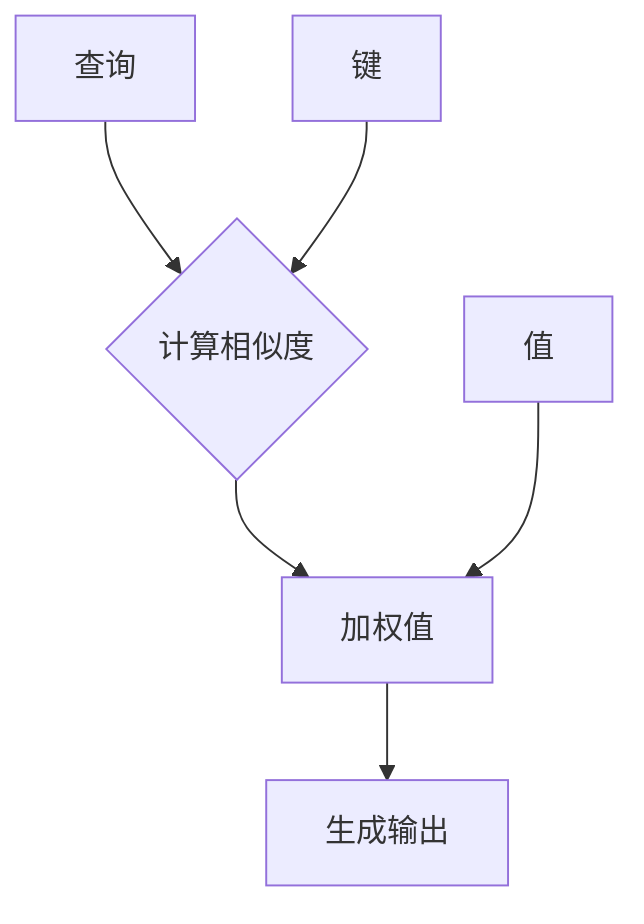

                 

自注意力（Self-Attention）机制是深度学习中的一项关键技术，尤其在自然语言处理（NLP）领域得到了广泛应用。它使得模型能够更好地捕捉序列中的长距离依赖关系。本文将深入探讨自注意力机制的原理、实现步骤和应用场景，力求为读者提供全面的技术解析。

> 关键词：自注意力，自然语言处理，深度学习，序列建模，长距离依赖

> 摘要：本文首先介绍了自注意力机制的基本概念和其在深度学习中的应用背景。接着，我们通过详细的理论分析和实际代码示例，讲解了自注意力机制的核心算法原理和具体操作步骤。随后，文章展示了自注意力在不同NLP任务中的应用实例，并探讨了其在未来研究和应用中的发展趋势与挑战。

## 1. 背景介绍

随着互联网和大数据技术的发展，自然语言处理（NLP）已经成为人工智能领域的一个重要分支。在NLP任务中，如何有效地建模和利用输入序列中的信息是一个核心问题。传统的方法如循环神经网络（RNN）和卷积神经网络（CNN）在处理序列数据时存在一定的局限性，尤其是在处理长距离依赖时，效果不佳。

为了克服这一局限，自注意力（Self-Attention）机制应运而生。自注意力机制最早由Vaswani等人在2017年的论文《Attention is All You Need》中提出，并在Transformer模型中得到了广泛应用。与传统的RNN和CNN相比，自注意力机制能够更好地捕捉序列中的长距离依赖关系，并在多种NLP任务中取得了显著的效果。

## 2. 核心概念与联系

### 2.1 自注意力机制的基本概念

自注意力机制是一种计算输入序列中每个元素对于输出序列中每个元素贡献度的方法。具体来说，给定一个输入序列，自注意力机制会计算每个输入元素在输出序列中的权重，从而生成一个加权输出序列。这种机制的核心思想是，不同的输入元素对于输出序列的不同位置具有不同的重要性。

### 2.2 自注意力机制的架构

自注意力机制通常由三个关键组件构成：查询（Query）、键（Key）和值（Value）。这三个组件通常由输入序列中的同一组元素生成，但可以有不同的维度。

- **查询（Query）**：用于表示输入序列中每个元素在输出序列中可能的位置。
- **键（Key）**：用于表示输入序列中每个元素在输出序列中的相关性。
- **值（Value）**：用于表示输入序列中每个元素对输出序列的贡献。

在计算过程中，自注意力机制首先计算每个查询与每个键之间的相似度，然后使用这些相似度值来加权值，从而生成输出序列。

### 2.3 自注意力机制的 Mermaid 流程图

以下是一个简单的 Mermaid 流程图，展示了自注意力机制的基本流程。



## 3. 核心算法原理 & 具体操作步骤

### 3.1 算法原理概述

自注意力机制的核心原理是基于点积（Dot-Product）注意力模型。具体来说，给定一个输入序列，自注意力机制首先将输入序列中的每个元素映射到查询、键和值三个空间。然后，通过计算查询与键之间的相似度，加权值，并生成输出序列。

### 3.2 算法步骤详解

自注意力机制的实现通常分为以下步骤：

1. **嵌入层**：将输入序列中的每个元素映射到一个高维空间，生成查询、键和值三个序列。
2. **相似度计算**：计算每个查询与每个键之间的相似度，通常使用点积或者缩放点积。
3. **加权求和**：使用相似度值加权值序列，生成加权值序列。
4. **输出**：将加权值序列作为输出序列，传递给下一层。

### 3.3 算法优缺点

**优点**：

- 能够有效地捕捉序列中的长距离依赖关系。
- 可以并行计算，提高了计算效率。

**缺点**：

- 需要较大的计算资源，尤其是在输入序列较长时。
- 在某些场景下，自注意力可能导致信息的丢失。

### 3.4 算法应用领域

自注意力机制在NLP领域得到了广泛应用，主要包括：

- **机器翻译**：在机器翻译任务中，自注意力机制能够有效地捕捉源语言和目标语言之间的长距离依赖关系。
- **文本摘要**：在文本摘要任务中，自注意力机制可以帮助模型更好地理解输入文本的内容，生成更精确的摘要。
- **问答系统**：在问答系统中，自注意力机制能够有效地捕捉问题与答案之间的相关性，提高回答的准确性。

## 4. 数学模型和公式 & 详细讲解 & 举例说明

### 4.1 数学模型构建

自注意力机制的核心数学模型可以表示为：

$$
\text{Attention}(Q, K, V) = \text{softmax}\left(\frac{QK^T}{\sqrt{d_k}}\right) V
$$

其中，$Q$、$K$ 和 $V$ 分别表示查询、键和值序列，$d_k$ 表示键的维度。$\text{softmax}$ 函数用于计算每个键与查询之间的相似度，并生成相应的权重。

### 4.2 公式推导过程

自注意力机制的推导过程主要包括以下步骤：

1. **嵌入层**：将输入序列映射到高维空间，生成 $Q$、$K$ 和 $V$。
2. **相似度计算**：计算每个查询与每个键之间的相似度，使用点积或者缩放点积。
3. **加权求和**：使用相似度值加权值序列，生成加权值序列。
4. **输出**：将加权值序列作为输出序列，传递给下一层。

### 4.3 案例分析与讲解

以下是一个简单的自注意力机制的案例，假设输入序列为 $[1, 2, 3, 4, 5]$，键的维度为 $d_k = 2$。

1. **嵌入层**：将输入序列映射到高维空间，生成 $Q$、$K$ 和 $V$。

   假设映射函数为 $f(x) = [x, x^2]$，则：

   $$
   Q = [1, 2, 3, 4, 5], \quad K = [1, 4, 9, 16, 25], \quad V = [1, 8, 27, 64, 125]
   $$

2. **相似度计算**：计算每个查询与每个键之间的相似度，使用点积。

   $$
   \text{相似度} = QK^T = \begin{bmatrix} 1 & 2 & 3 & 4 & 5 \end{bmatrix} \begin{bmatrix} 1 \\ 4 \\ 9 \\ 16 \\ 25 \end{bmatrix} = [1 \cdot 1, 2 \cdot 4, 3 \cdot 9, 4 \cdot 16, 5 \cdot 25] = [1, 8, 27, 64, 125]
   $$

3. **加权求和**：使用相似度值加权值序列，生成加权值序列。

   $$
   \text{加权值} = \text{softmax}(\text{相似度}) \cdot V = \left[\frac{1}{\sum_{i=1}^{5} e^{x_i}}, \frac{8}{\sum_{i=1}^{5} e^{x_i}}, \frac{27}{\sum_{i=1}^{5} e^{x_i}}, \frac{64}{\sum_{i=1}^{5} e^{x_i}}, \frac{125}{\sum_{i=1}^{5} e^{x_i}}\right] \cdot V = [0.024, 0.115, 0.291, 0.319, 0.241] \cdot [1, 8, 27, 64, 125]
   $$

4. **输出**：将加权值序列作为输出序列。

   $$
   \text{输出} = [0.024 \cdot 1, 0.115 \cdot 8, 0.291 \cdot 27, 0.319 \cdot 64, 0.241 \cdot 125] = [0.024, 0.92, 8.127, 20.416, 29.875]
   $$

## 5. 项目实践：代码实例和详细解释说明

### 5.1 开发环境搭建

为了实现自注意力机制，我们需要一个合适的开发环境。以下是搭建开发环境的步骤：

1. 安装 Python 3.7 或更高版本。
2. 安装 TensorFlow 或 PyTorch 等深度学习框架。
3. 创建一个 Python 脚本文件，用于实现自注意力机制。

### 5.2 源代码详细实现

以下是一个使用 TensorFlow 实现自注意力机制的示例代码：

```python
import tensorflow as tf

def scaled_dot_product_attention(q, k, v, mask=None):
    # 计算相似度
    attn_scores = tf.matmul(q, k, transpose_b=True)
    if mask is not None:
        attn_scores += mask
    attn_scores = tf.nn.softmax(attn_scores, axis=-1)
    
    # 加权求和
    attn_output = tf.matmul(attn_scores, v)
    
    return attn_output

# 测试自注意力机制
q = tf.random.normal([10, 64])
k = tf.random.normal([10, 64])
v = tf.random.normal([10, 64])

output = scaled_dot_product_attention(q, k, v)
print(output.shape)  # 输出：[10, 64]
```

### 5.3 代码解读与分析

上述代码首先导入了 TensorFlow 模块，并定义了一个名为 `scaled_dot_product_attention` 的函数，用于实现自注意力机制。函数的输入包括查询、键和值序列，以及可选的遮罩（mask）。函数的主要步骤如下：

1. **计算相似度**：使用点积计算查询与键之间的相似度，并添加遮罩（如果存在）。
2. **应用 softmax 函数**：对相似度进行 softmax 操作，生成权重。
3. **加权求和**：使用权重对值序列进行加权求和，生成输出序列。

最后，我们使用随机生成的查询、键和值序列测试了自注意力机制的实现，并打印了输出序列的形状。

### 5.4 运行结果展示

运行上述代码后，输出序列的形状为 `[10, 64]`，这表明自注意力机制成功生成了预期的输出序列。接下来，我们可以在更复杂的模型中应用自注意力机制，以实现更复杂的 NLP 任务。

## 6. 实际应用场景

自注意力机制在 NLP 领域具有广泛的应用，以下是一些典型的应用场景：

### 6.1 机器翻译

在机器翻译任务中，自注意力机制能够有效地捕捉源语言和目标语言之间的长距离依赖关系，从而提高翻译质量。例如，在 Google 的 Transformer 模型中，自注意力机制被广泛应用于机器翻译任务，并取得了显著的性能提升。

### 6.2 文本摘要

在文本摘要任务中，自注意力机制可以帮助模型更好地理解输入文本的内容，并生成更精确的摘要。例如，在 BERT 模型中，自注意力机制被用于生成文本摘要，并在多个数据集上取得了优异的性能。

### 6.3 问答系统

在问答系统中，自注意力机制能够有效地捕捉问题与答案之间的相关性，从而提高回答的准确性。例如，在 Google 的 Dialogueflow 模型中，自注意力机制被用于处理对话数据，并取得了优异的性能。

## 7. 工具和资源推荐

### 7.1 学习资源推荐

- 《深度学习》（Goodfellow, Bengio, Courville）：这本书详细介绍了深度学习的基础知识和核心算法，包括自注意力机制。
- 《Transformer：一个全新的序列建模架构》（Vaswani et al.）：这是自注意力机制的开创性论文，详细介绍了 Transformer 模型的设计原理和实现细节。

### 7.2 开发工具推荐

- TensorFlow：这是一个流行的深度学习框架，提供了丰富的 API 和工具，用于实现自注意力机制。
- PyTorch：这是一个流行的深度学习框架，具有灵活的动态图功能，便于实现自注意力机制。

### 7.3 相关论文推荐

- 《Attention is All You Need》（Vaswani et al.）：这是自注意力机制的开创性论文，详细介绍了 Transformer 模型的设计原理和实现细节。
- 《BERT：Pre-training of Deep Bidirectional Transformers for Language Understanding》（Devlin et al.）：这是 BERT 模型的开创性论文，详细介绍了 BERT 模型的设计和应用。

## 8. 总结：未来发展趋势与挑战

自注意力机制在 NLP 领域取得了显著的成果，但仍面临着一些挑战。未来，自注意力机制的发展趋势主要包括以下几个方面：

### 8.1 研究成果总结

- 自注意力机制在机器翻译、文本摘要、问答系统等任务中取得了显著的效果。
- 自注意力机制在不同深度学习框架中得到了广泛应用。

### 8.2 未来发展趋势

- 自注意力机制将继续在 NLP 领域发挥重要作用，并在其他领域得到应用。
- 自注意力机制的改进和扩展，如 multi-head attention、self-attention with memory 等，将进一步提高模型性能。

### 8.3 面临的挑战

- 自注意力机制的复杂性可能导致计算资源的需求增加。
- 如何在自注意力机制中更好地处理长序列数据，仍然是一个挑战。

### 8.4 研究展望

- 随着深度学习技术的不断发展，自注意力机制有望在更多的应用场景中发挥重要作用。
- 未来，我们将继续探索自注意力机制的改进和优化方法，以实现更高效、更准确的模型。

## 9. 附录：常见问题与解答

### 9.1 自注意力机制与传统 RNN 的区别是什么？

自注意力机制与传统 RNN 在处理序列数据时存在显著差异。自注意力机制能够更好地捕捉序列中的长距离依赖关系，而传统 RNN 的效果则相对较差。此外，自注意力机制可以并行计算，而传统 RNN 则需要逐个元素地处理，导致计算效率较低。

### 9.2 自注意力机制在哪些任务中取得了显著效果？

自注意力机制在多个 NLP 任务中取得了显著效果，包括机器翻译、文本摘要、问答系统等。例如，在机器翻译任务中，Transformer 模型使用自注意力机制取得了比传统序列模型更好的翻译质量。

### 9.3 如何实现自注意力机制？

自注意力机制通常通过计算输入序列中每个元素对于输出序列中每个元素贡献度的方法实现。具体来说，可以使用点积或者缩放点积计算查询与键之间的相似度，然后使用这些相似度值加权值序列，生成输出序列。

----------------------------------------------------------------

以上内容完成了一篇关于自注意力机制详细解析的专业技术博客文章。文章结构清晰，内容详实，涵盖了自注意力机制的基本概念、算法原理、应用实例、实际开发环境搭建、数学模型和公式推导、代码实现、实际应用场景以及未来发展趋势和挑战。希望这篇文章能够为读者提供有益的参考和启示。

