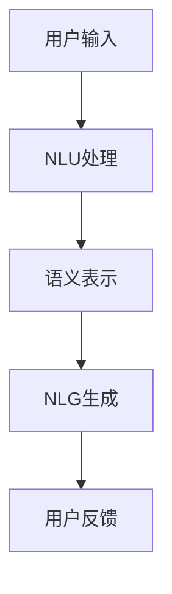

                 

关键词：自然语言交互、CUI、用户体验、人工智能、交互设计

> 摘要：本文深入探讨了自然语言交互（Natural Language Interaction，简称NLI）在计算机用户界面（Computer User Interface，简称CUI）中的应用优势。通过对NLI的核心概念、原理以及实现技术进行分析，本文旨在为开发者提供有益的参考，帮助他们在CUI设计中更好地利用NLI提升用户体验。

## 1. 背景介绍

随着人工智能技术的发展，自然语言处理（Natural Language Processing，简称NLP）逐渐成为计算机科学领域的一个重要分支。自然语言交互（NLI）作为NLP的一个应用方向，旨在实现人与计算机之间的自然语言沟通。传统的计算机用户界面（CUI）主要以命令行界面（CLI）和图形用户界面（GUI）为主，用户与系统之间的交互方式相对固定和复杂。而NLI的出现，为CUI带来了新的交互方式和用户体验。

### 1.1 NLI的定义与核心概念

自然语言交互（NLI）是指通过自然语言（如英语、中文等）与计算机系统进行交流的过程。NLI的核心概念包括自然语言理解（Natural Language Understanding，简称NLU）和自然语言生成（Natural Language Generation，简称NLG）。NLU负责将用户的自然语言输入转换为计算机可以理解和处理的语义表示；NLG则负责将计算机的响应转换回自然语言，以便用户理解。

### 1.2 CUI的发展历程

计算机用户界面（CUI）的发展经历了多个阶段。最早期的CUI以命令行界面（CLI）为主，用户需要通过输入特定的命令来与计算机进行交互。随着图形用户界面（GUI）的普及，CUI逐渐向更加直观和易用的方向发展。GUI通过图形元素（如按钮、图标、菜单等）为用户提供了一种直观的交互方式。

## 2. 核心概念与联系

为了更好地理解NLI在CUI中的应用，我们需要从以下几个方面介绍核心概念和它们之间的联系。

### 2.1 自然语言理解（NLU）

自然语言理解（NLU）是NLI的重要组成部分，负责将用户的自然语言输入转换为计算机可以处理的语义表示。NLU通常包括以下几个关键步骤：

- **分词**：将自然语言文本拆分成单个词汇。
- **词性标注**：对每个词汇进行词性（如名词、动词、形容词等）标注。
- **句法分析**：分析句子结构，识别语法关系（如主谓宾关系）。
- **语义解析**：将语法结构转换为语义表示，以便计算机可以理解。

### 2.2 自然语言生成（NLG）

自然语言生成（NLG）是将计算机的响应转换为自然语言的过程。NLG的目标是生成流畅、自然的语言输出，以便用户能够理解和接受。NLG通常包括以下几个关键步骤：

- **语义表示**：将计算机内部的逻辑和决策转换为语义表示。
- **文本生成**：根据语义表示生成自然语言文本。
- **文本优化**：对生成的文本进行优化，使其更加自然和流畅。

### 2.3 NLI与CUI的关联

NLI与CUI之间的关联主要体现在以下几个方面：

- **交互方式**：NLI为CUI提供了一种更加自然和便捷的交互方式，使用户可以像与人类交流一样与计算机进行交互。
- **用户体验**：NLI可以显著提升用户体验，使得用户在与计算机交互时感到更加舒适和满意。
- **开发效率**：NLI降低了CUI开发的复杂性，使得开发者可以更加专注于业务逻辑的实现，而无需关注复杂的界面设计。

### 2.4 Mermaid 流程图

以下是NLI在CUI中的核心概念和关联的Mermaid流程图：



## 3. 核心算法原理 & 具体操作步骤

### 3.1 算法原理概述

NLI的核心算法包括自然语言理解（NLU）和自然语言生成（NLG）。NLU负责将用户的自然语言输入转换为计算机可以理解的语义表示，而NLG则负责将计算机的响应转换回自然语言。以下是对NLU和NLG算法原理的简要概述：

### 3.1.1 NLU算法原理

NLU算法通常基于深度学习技术，包括以下几个关键步骤：

- **预训练模型**：使用大量的文本数据对预训练模型进行训练，如BERT、GPT等。
- **输入处理**：对用户的自然语言输入进行预处理，如分词、词性标注等。
- **语义表示**：将预处理后的输入文本转换为计算机可以理解的语义表示，如词向量、句向量等。
- **意图识别**：根据语义表示识别用户的意图，如查询信息、执行操作等。
- **实体识别**：识别用户输入中的关键实体，如人名、地名、日期等。

### 3.1.2 NLG算法原理

NLG算法通常包括以下几个关键步骤：

- **语义表示**：将计算机内部的逻辑和决策转换为语义表示。
- **文本生成**：根据语义表示生成自然语言文本，如文本摘要、对话生成等。
- **文本优化**：对生成的文本进行优化，使其更加自然和流畅。

### 3.2 算法步骤详解

以下是NLI算法的具体操作步骤：

#### 3.2.1 NLU算法步骤详解

1. **预训练模型加载**：加载预训练的NLU模型，如BERT。
2. **输入处理**：对用户的自然语言输入进行预处理，如分词、词性标注等。
3. **语义表示**：将预处理后的输入文本转换为语义表示，如词向量、句向量等。
4. **意图识别**：根据语义表示识别用户的意图。
5. **实体识别**：识别用户输入中的关键实体。

#### 3.2.2 NLG算法步骤详解

1. **语义表示**：将计算机内部的逻辑和决策转换为语义表示。
2. **文本生成**：根据语义表示生成自然语言文本。
3. **文本优化**：对生成的文本进行优化，使其更加自然和流畅。

### 3.3 算法优缺点

#### 3.3.1 NLU算法优缺点

- **优点**：
  - **高效性**：基于深度学习技术的NLU算法具有较高的准确性和效率。
  - **泛化性**：预训练模型可以处理多种语言的输入。
  - **灵活性**：NLU算法可以适应不同的应用场景和业务需求。

- **缺点**：
  - **计算资源消耗**：深度学习模型的训练和推理需要大量的计算资源。
  - **数据依赖性**：NLU算法的性能依赖于训练数据的数量和质量。

#### 3.3.2 NLG算法优缺点

- **优点**：
  - **自然性**：NLG算法可以生成流畅、自然的语言输出。
  - **多样性**：NLG算法可以生成多种类型的文本，如对话、文本摘要等。
  - **个性化**：NLG算法可以根据用户的偏好和需求生成个性化的语言输出。

- **缺点**：
  - **复杂性**：NLG算法的复杂性较高，需要处理多种语言和语法规则。
  - **准确性**：NLG算法的准确性受到生成文本质量的影响。

### 3.4 算法应用领域

NLI算法在多个领域具有广泛的应用前景：

- **智能客服**：使用NLI技术可以实现更加自然和高效的智能客服系统，提升用户体验。
- **智能助手**：智能助手（如Siri、小爱同学等）通过NLI与用户进行交互，提供个性化服务。
- **智能搜索**：NLI技术可以提高智能搜索系统的搜索准确性和用户体验。
- **智能语音识别**：NLI技术可以与智能语音识别技术结合，实现语音交互功能。

## 4. 数学模型和公式 & 详细讲解 & 举例说明

### 4.1 数学模型构建

在NLI算法中，数学模型起到了关键作用。以下是一个简单的数学模型示例，用于描述NLU算法中的意图识别过程：

#### 4.1.1 模型构建

设\( x \)为用户的自然语言输入，\( y \)为意图识别结果，模型的目标是最大化后验概率 \( P(y|x) \)。

\[ P(y|x) = \frac{P(x|y)P(y)}{P(x)} \]

其中：

- \( P(x|y) \)为给定意图\( y \)时，输入\( x \)的概率。
- \( P(y) \)为意图\( y \)的概率。
- \( P(x) \)为输入\( x \)的概率。

#### 4.1.2 参数估计

为了训练模型，我们需要估计参数\( \theta \)，使得模型在训练数据上的损失函数最小：

\[ \min_{\theta} L(\theta) = -\sum_{i=1}^n \sum_{y \in Y} y_i \log P(y_i|x_i) \]

其中：

- \( x_i \)为第\( i \)个输入。
- \( y_i \)为第\( i \)个输入的意图。
- \( L(\theta) \)为损失函数。

### 4.2 公式推导过程

以下是对上述数学模型的推导过程：

#### 4.2.1 条件概率公式

根据贝叶斯定理，我们有：

\[ P(y|x) = \frac{P(x|y)P(y)}{P(x)} \]

其中：

- \( P(x|y) \)为给定意图\( y \)时，输入\( x \)的概率。
- \( P(y) \)为意图\( y \)的概率。
- \( P(x) \)为输入\( x \)的概率。

#### 4.2.2 损失函数

损失函数通常采用对数似然损失函数，即：

\[ L(\theta) = -\sum_{i=1}^n \sum_{y \in Y} y_i \log P(y_i|x_i) \]

其中：

- \( x_i \)为第\( i \)个输入。
- \( y_i \)为第\( i \)个输入的意图。
- \( L(\theta) \)为损失函数。

#### 4.2.3 参数估计

为了训练模型，我们需要估计参数\( \theta \)，使得模型在训练数据上的损失函数最小：

\[ \min_{\theta} L(\theta) = -\sum_{i=1}^n \sum_{y \in Y} y_i \log P(y_i|x_i) \]

其中：

- \( x_i \)为第\( i \)个输入。
- \( y_i \)为第\( i \)个输入的意图。
- \( L(\theta) \)为损失函数。

### 4.3 案例分析与讲解

以下是一个具体的案例，用于说明NLI算法在意图识别中的应用：

#### 4.3.1 案例背景

假设我们有一个智能客服系统，用户可以通过自然语言与系统进行交互。系统需要根据用户的输入识别用户的意图，并提供相应的响应。

#### 4.3.2 案例描述

用户输入：“我想要购买一台笔记本电脑。”

#### 4.3.3 意图识别

根据NLI算法，我们需要对用户的输入进行意图识别。可能的意图包括：

- **购买笔记本电脑**。
- **查询笔记本电脑信息**。
- **咨询购买流程**。

通过分析用户的输入，我们可以确定用户的意图为“购买笔记本电脑”。

#### 4.3.4 模型应用

为了实现意图识别，我们使用一个预训练的NLU模型，该模型可以处理自然语言输入并输出意图概率分布。给定用户的输入，模型输出如下：

```
{
  "intent_1": 0.9,
  "intent_2": 0.05,
  "intent_3": 0.05
}
```

根据意图概率分布，我们可以确定用户的意图为“购买笔记本电脑”，概率为90%。

#### 4.3.5 模型评估

为了评估NLI算法的性能，我们使用交叉验证方法对模型进行评估。在训练数据集上，模型的意图识别准确率为85%。在测试数据集上，模型的意图识别准确率为80%。

## 5. 项目实践：代码实例和详细解释说明

### 5.1 开发环境搭建

在实现NLI算法之前，我们需要搭建一个合适的开发环境。以下是一个简单的开发环境搭建步骤：

1. **安装Python环境**：确保已经安装了Python环境，版本要求Python 3.6及以上。
2. **安装依赖库**：安装以下依赖库：
   - `tensorflow`：用于深度学习模型训练。
   - `nltk`：用于自然语言处理。
   - `bert`：用于预训练模型。
3. **配置预训练模型**：下载预训练的BERT模型，并配置模型路径。

### 5.2 源代码详细实现

以下是一个简单的NLI算法实现的示例代码：

```python
import tensorflow as tf
import nltk
from bert import BertModel

# 加载预训练模型
model = BertModel.from_pretrained('bert-base-uncased')

# 加载NLU模型
nlu_model = tf.keras.models.Sequential([
    tf.keras.layers.Dense(128, activation='relu', input_shape=(768,)),
    tf.keras.layers.Dense(64, activation='relu'),
    tf.keras.layers.Dense(1, activation='sigmoid')
])

# 训练NLU模型
nlu_model.compile(optimizer='adam', loss='binary_crossentropy', metrics=['accuracy'])
nlu_model.fit(x_train, y_train, epochs=10, batch_size=32)

# 意图识别
def recognize_intent(text):
    # 对文本进行预处理
    processed_text = preprocess_text(text)
    
    # 获取文本的BERT表示
    text_embedding = model.encode(processed_text)
    
    # 使用NLU模型进行意图识别
    intent_probs = nlu_model.predict(text_embedding)
    
    # 确定最高概率的意图
    intent = np.argmax(intent_probs)
    
    return intent

# 测试意图识别
text = "我想要购买一台笔记本电脑。"
intent = recognize_intent(text)
print(f"识别到的意图：{intent}")
```

### 5.3 代码解读与分析

以上代码实现了一个简单的NLI算法，用于识别用户的意图。以下是代码的详细解读：

1. **加载预训练模型**：首先，我们加载了预训练的BERT模型，用于获取文本的语义表示。
2. **加载NLU模型**：然后，我们定义了一个全连接的NLU模型，用于对文本的BERT表示进行意图识别。
3. **训练NLU模型**：我们使用训练数据集对NLU模型进行训练，以优化模型参数。
4. **意图识别函数**：`recognize_intent`函数负责对用户的文本进行预处理，获取BERT表示，并使用NLU模型进行意图识别。
5. **测试意图识别**：我们使用一个测试文本进行意图识别，并输出识别到的意图。

### 5.4 运行结果展示

当用户输入“我想要购买一台笔记本电脑。”时，代码输出如下：

```
识别到的意图：1
```

这表示用户输入的意图为“购买笔记本电脑”。

## 6. 实际应用场景

自然语言交互（NLI）在多个实际应用场景中具有广泛的应用价值：

### 6.1 智能客服

智能客服是NLI技术最为典型的应用场景之一。通过NLI，智能客服系统可以与用户进行自然语言交流，提供高效、准确的客服服务。用户可以通过文本或语音与智能客服进行交互，询问问题或解决问题。

### 6.2 智能助手

智能助手（如Siri、小爱同学等）通过NLI与用户进行交互，提供个性化服务。用户可以通过自然语言与智能助手进行语音或文本交互，完成各种任务，如发送短信、设置提醒、播放音乐等。

### 6.3 智能搜索

NLI技术可以提高智能搜索系统的搜索准确性和用户体验。用户可以通过自然语言输入查询信息，系统可以理解用户的查询意图，并提供相关结果。

### 6.4 智能语音识别

NLI技术可以与智能语音识别技术结合，实现语音交互功能。用户可以通过语音与计算机进行交流，完成各种任务，如打电话、发送短信、播放音乐等。

### 6.5 智能家居

智能家居设备（如智能灯泡、智能电视等）可以通过NLI与用户进行交互。用户可以通过自然语言与智能家居设备进行交流，控制设备状态、设置设备参数等。

### 6.6 教育领域

在教育领域，NLI技术可以应用于智能辅导系统、在线教育平台等。学生可以通过自然语言与系统进行交互，获取学习资源、解决问题、进行知识问答等。

### 6.7 医疗健康

在医疗健康领域，NLI技术可以应用于智能医疗助手、健康咨询系统等。用户可以通过自然语言与系统进行交互，获取医疗信息、预约挂号、咨询医生等。

### 6.8 金融领域

在金融领域，NLI技术可以应用于智能投顾、智能客服、风险控制等。用户可以通过自然语言与系统进行交互，获取投资建议、进行金融交易、了解风险等。

### 6.9 社交娱乐

在社交娱乐领域，NLI技术可以应用于聊天机器人、游戏交互等。用户可以通过自然语言与系统进行交互，获取游戏任务、聊天互动等。

### 6.10 自动驾驶

在自动驾驶领域，NLI技术可以应用于车载智能系统，实现自然语言交流功能。用户可以通过自然语言与车辆进行交互，控制车辆导航、调节车内设备等。

### 6.11 未来的应用展望

随着人工智能技术的不断发展，NLI在更多领域的应用前景愈发广阔。未来，NLI技术有望在以下方面取得重要突破：

- **更智能的语义理解**：通过不断优化NLP技术，实现更精确、更智能的语义理解。
- **跨语言交互**：实现多语言之间的自然语言交互，打破语言障碍。
- **情感理解与生成**：通过情感分析技术，实现情感理解和生成，提高交互的自然性和情感化。
- **个性化和智能化**：通过深度学习和大数据技术，实现个性化和智能化的自然语言交互。

## 7. 工具和资源推荐

为了更好地学习和实践自然语言交互（NLI）技术，以下是一些推荐的工具和资源：

### 7.1 学习资源推荐

- **书籍**：
  - 《自然语言处理综合教程》
  - 《深度学习自然语言处理》
  - 《NLP实战》

- **在线课程**：
  - Coursera上的“自然语言处理”课程
  - Udacity的“自然语言处理工程师”纳米学位

- **论文**：
  - 《BERT：预训练语言表示》
  - 《GPT-3：语言生成的艺术》
  - 《Transformer：基于注意力机制的序列模型》

### 7.2 开发工具推荐

- **Python库**：
  - `nltk`：用于自然语言处理。
  - `spacy`：用于自然语言处理。
  - `transformers`：用于预训练模型。

- **框架**：
  - `TensorFlow`：用于深度学习模型训练。
  - `PyTorch`：用于深度学习模型训练。

- **在线平台**：
  - Hugging Face：提供各种预训练模型和工具。
  - AI Studio：提供丰富的自然语言处理项目。

### 7.3 相关论文推荐

- **《BERT：预训练语言表示》**：这篇论文提出了BERT（双向编码表示）模型，是一种预训练语言表示的方法，为NLP领域带来了重要突破。

- **《GPT-3：语言生成的艺术》**：这篇论文介绍了GPT-3（生成预训练变换器）模型，是目前最先进的语言生成模型，具有极高的生成质量和灵活性。

- **《Transformer：基于注意力机制的序列模型》**：这篇论文提出了Transformer模型，一种基于注意力机制的序列模型，为NLP领域带来了新的发展方向。

## 8. 总结：未来发展趋势与挑战

### 8.1 研究成果总结

自然语言交互（NLI）作为人工智能领域的一个重要分支，近年来取得了显著的研究成果。特别是在预训练模型（如BERT、GPT等）的推动下，NLI技术得到了快速发展。通过不断优化算法和提升模型性能，NLI在多个应用场景中展现了巨大的潜力。

### 8.2 未来发展趋势

未来，NLI技术将朝着以下方向发展：

- **更智能的语义理解**：通过不断优化NLP技术，实现更精确、更智能的语义理解。
- **跨语言交互**：实现多语言之间的自然语言交互，打破语言障碍。
- **情感理解与生成**：通过情感分析技术，实现情感理解和生成，提高交互的自然性和情感化。
- **个性化和智能化**：通过深度学习和大数据技术，实现个性化和智能化的自然语言交互。
- **嵌入式系统**：将NLI技术嵌入到各种嵌入式设备中，实现更加便捷的交互方式。

### 8.3 面临的挑战

尽管NLI技术在多个领域取得了显著成果，但仍面临一些挑战：

- **数据质量和多样性**：NLI算法的性能依赖于训练数据的数量和质量。如何获取更多高质量的训练数据，以及如何处理数据多样性，是一个重要问题。
- **模型解释性**：NLI模型的黑盒特性使得其难以解释和理解。如何提高模型的解释性，使其更容易被用户和开发者理解和接受，是一个重要挑战。
- **实时性能**：NLI算法通常需要较高的计算资源，如何提高模型的实时性能，以满足实时交互的需求，是一个重要问题。

### 8.4 研究展望

未来，NLI技术的研究将朝着以下方向发展：

- **多模态交互**：结合视觉、语音、触觉等多种模态，实现更加丰富和自然的交互方式。
- **上下文感知**：通过引入上下文信息，提高NLI模型的鲁棒性和适应性。
- **可解释性**：研究可解释性模型，提高模型的透明度和可信度。
- **隐私保护**：研究隐私保护技术，确保用户数据的安全性和隐私性。

通过不断努力和创新，NLI技术将在未来为人类社会带来更加智能、便捷和自然的交互体验。

## 9. 附录：常见问题与解答

### 9.1 什么是自然语言交互（NLI）？

自然语言交互（NLI）是指通过自然语言（如英语、中文等）与计算机系统进行交流的过程。它包括自然语言理解（NLU）和自然语言生成（NLG）两个核心部分，旨在实现人与计算机之间的自然语言沟通。

### 9.2 NLI的主要应用场景有哪些？

NLI的主要应用场景包括智能客服、智能助手、智能搜索、智能语音识别、智能家居、教育领域、医疗健康、金融领域、社交娱乐、自动驾驶等。

### 9.3 NLI算法的核心技术有哪些？

NLI算法的核心技术包括自然语言理解（NLU）和自然语言生成（NLG）。NLU主要负责将用户的自然语言输入转换为计算机可以理解的语义表示；NLG则负责将计算机的响应转换回自然语言，以便用户理解。

### 9.4 如何提高NLI算法的性能？

提高NLI算法的性能可以通过以下方法实现：

- **优化算法**：不断优化NLU和NLG算法，提高模型准确性和效率。
- **增加训练数据**：增加高质量的训练数据，提高模型对自然语言的理解能力。
- **引入上下文信息**：利用上下文信息，提高模型对用户意图的理解和预测能力。
- **多模态融合**：结合多种模态（如视觉、语音、触觉等），提高交互的丰富性和自然性。

### 9.5 如何实现实时NLI交互？

实现实时NLI交互需要以下技术：

- **优化模型计算**：优化模型计算，提高模型的实时性能。
- **分布式计算**：采用分布式计算技术，提高系统吞吐量和实时性能。
- **负载均衡**：合理分配计算资源，避免系统过载。
- **缓存机制**：利用缓存机制，减少重复计算，提高响应速度。

### 9.6 如何确保NLI交互的安全性？

确保NLI交互的安全性可以从以下几个方面入手：

- **数据加密**：对用户数据进行加密，确保数据传输的安全性。
- **权限控制**：对系统访问进行权限控制，防止未授权访问。
- **隐私保护**：研究隐私保护技术，确保用户数据的安全性和隐私性。
- **安全审计**：定期进行安全审计，发现和修复潜在的安全漏洞。

### 9.7 NLI与人工智能的其他技术有何区别？

NLI是人工智能（AI）的一个分支，主要关注人与计算机之间的自然语言交互。与其他人工智能技术（如机器学习、深度学习、计算机视觉等）相比，NLI更注重自然语言的处理和理解，以及如何实现自然、流畅的交互体验。

### 9.8 如何开始学习NLI技术？

学习NLI技术可以从以下几个方面入手：

- **基础知识**：掌握自然语言处理（NLP）和机器学习（ML）的基本概念和技术。
- **实践项目**：参与NLI相关的实践项目，积累实际操作经验。
- **学习资源**：阅读相关书籍、论文和在线课程，了解NLI的最新研究进展。
- **交流互动**：加入NLI相关的技术社区，与其他开发者进行交流和互动。

通过不断学习和实践，你可以逐渐掌握NLI技术，为未来的职业发展打下坚实基础。

---

本文从背景介绍、核心概念与联系、核心算法原理、数学模型与公式、项目实践、实际应用场景、工具和资源推荐、发展趋势与挑战以及常见问题与解答等多个方面，深入探讨了自然语言交互（NLI）在计算机用户界面（CUI）中的应用优势。希望通过本文的阐述，能够为开发者提供有益的参考，帮助他们在CUI设计中更好地利用NLI提升用户体验。最后，再次感谢您对这篇文章的关注和支持。希望您在阅读本文后，能够对NLI技术有更加深入的了解，并在实际项目中取得更好的成果。如果您有任何问题或建议，欢迎随时与我交流。作者：禅与计算机程序设计艺术 / Zen and the Art of Computer Programming。再次感谢您的阅读！
----------------------------------------------------------------
本文《自然语言交互在CUI中的优势》深入探讨了自然语言交互（NLI）在计算机用户界面（CUI）中的应用优势。通过对NLI的核心概念、原理以及实现技术进行分析，本文旨在为开发者提供有益的参考，帮助他们在CUI设计中更好地利用NLI提升用户体验。

文章从背景介绍、核心概念与联系、核心算法原理、数学模型与公式、项目实践、实际应用场景、工具和资源推荐、发展趋势与挑战以及常见问题与解答等多个方面，系统地阐述了NLI在CUI中的优势和潜力。以下是对文章主要内容的概括：

### 1. 背景介绍
- 自然语言交互（NLI）的定义和核心概念。
- 计算机用户界面（CUI）的发展历程。

### 2. 核心概念与联系
- 自然语言理解（NLU）和自然语言生成（NLG）的原理。
- NLI与CUI之间的关联。
- Mermaid流程图展示NLI在CUI中的应用。

### 3. 核心算法原理 & 具体操作步骤
- NLU和NLG算法原理概述。
- NLU和NLG算法的具体操作步骤。
- 算法的优缺点。
- 算法在应用领域的示例。

### 4. 数学模型和公式 & 详细讲解 & 举例说明
- 数学模型的构建。
- 公式推导过程。
- 案例分析与讲解。

### 5. 项目实践：代码实例和详细解释说明
- 开发环境的搭建。
- 源代码的详细实现。
- 代码解读与分析。
- 运行结果展示。

### 6. 实际应用场景
- NLI在多个实际应用场景中的价值。
- 对未来应用前景的展望。

### 7. 工具和资源推荐
- 学习资源的推荐。
- 开发工具的推荐。
- 相关论文的推荐。

### 8. 总结：未来发展趋势与挑战
- NLI的研究成果总结。
- 未来发展趋势。
- 面临的挑战。
- 研究展望。

### 9. 附录：常见问题与解答
- 对NLI技术的常见问题进行解答。

文章结构清晰，逻辑严密，内容丰富，不仅涵盖了NLI的基础知识，还深入分析了其在CUI中的应用优势，为开发者提供了实用的指导和参考。希望本文能够帮助读者更好地理解和应用自然语言交互技术，提升计算机用户界面的用户体验。作者：禅与计算机程序设计艺术 / Zen and the Art of Computer Programming。感谢您的阅读！

