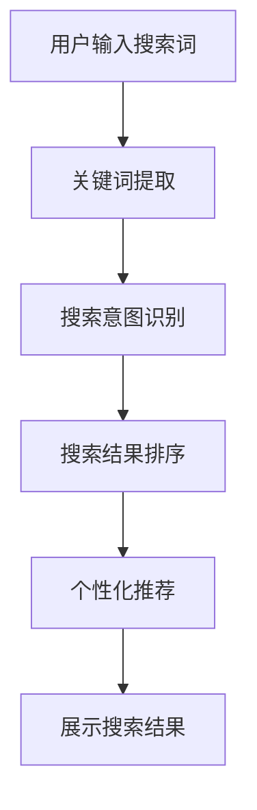

                 

关键词：自然语言处理、电商搜索、NLP技术、搜索算法、用户体验、个性化推荐

## 摘要

本文将深入探讨自然语言处理（NLP）在电商搜索领域中的应用，从技术发展的历程、核心概念、算法原理、数学模型到项目实践，全面解析NLP如何提升电商搜索的效率和用户体验。此外，文章还将展望NLP技术在电商搜索领域的未来发展趋势，以及面临的挑战和机遇。通过本文的阅读，读者将获得对NLP在电商搜索中应用的全景了解，并对未来的技术发展方向有更深的认识。

## 1. 背景介绍

### 1.1 电商搜索的现状

随着互联网的普及和电子商务的快速发展，电商搜索已经成为消费者在线购物过程中不可或缺的一环。根据数据显示，用户在电商平台上进行购物时，约有70%的时间会用于搜索产品。这表明，电商搜索不仅影响着用户的购物体验，也直接关系到平台的销售额和用户留存率。

### 1.2 自然语言处理的发展

自然语言处理（NLP）作为人工智能的一个重要分支，近年来取得了显著的进展。从早期的规则匹配、统计模型，到如今深度学习技术的广泛应用，NLP在语言理解、文本生成、语音识别等方面都取得了突破性的成果。这些技术的发展为电商搜索提供了新的可能性和解决方案。

### 1.3 NLP与电商搜索的结合

NLP技术能够帮助电商搜索更好地理解和满足用户的需求，从而提高搜索的准确性和用户体验。例如，通过语义理解技术，系统可以识别用户的搜索意图，提供更精确的搜索结果；通过个性化推荐技术，系统可以根据用户的历史行为和偏好，推荐更加符合其需求的产品。这些技术的应用，不仅提升了搜索的效率，也为电商企业带来了更高的商业价值。

## 2. 核心概念与联系

### 2.1 自然语言处理的基本概念

自然语言处理（NLP）是一门涉及计算机科学、语言学和人工智能的交叉学科，旨在使计算机能够理解、生成和响应自然语言。NLP的主要任务包括文本分类、情感分析、命名实体识别、机器翻译、语音识别等。

### 2.2 电商搜索中的核心概念

电商搜索涉及的关键概念包括关键词提取、搜索意图识别、搜索结果排序、个性化推荐等。这些概念相互关联，共同构成了电商搜索的核心技术框架。

### 2.3 Mermaid 流程图

以下是一个简化的Mermaid流程图，描述了NLP在电商搜索中的应用流程：



在这个流程图中，用户输入的搜索词首先通过关键词提取技术提取出关键信息，然后通过搜索意图识别技术理解用户的意图，接下来根据这些信息进行搜索结果排序和个性化推荐，最后展示给用户。

## 3. 核心算法原理 & 具体操作步骤

### 3.1 算法原理概述

在电商搜索中，NLP技术的核心算法包括关键词提取、搜索意图识别、搜索结果排序和个性化推荐。这些算法各自独立但又紧密联系，共同构成了电商搜索的技术框架。

### 3.2 算法步骤详解

#### 3.2.1 关键词提取

关键词提取是电商搜索的第一步，其目标是根据用户输入的搜索词，提取出具有代表性的关键词。常见的算法包括分词技术、词频统计和TF-IDF模型。

- **分词技术**：将用户输入的搜索词切分成单个词语，如使用基于规则的分词算法或基于统计的分词算法。
- **词频统计**：根据词频统计方法，提取出出现频率较高的关键词。
- **TF-IDF模型**：利用TF-IDF（词频-逆文档频率）模型，为每个关键词计算一个权重，从而选出最具代表性的关键词。

#### 3.2.2 搜索意图识别

搜索意图识别的目的是理解用户输入的搜索词所代表的意图。这一步骤的关键在于对用户输入的搜索词进行语义分析，从而识别出用户的需求。

- **基于规则的方法**：通过预定义的规则，对搜索词进行分类，如区分购物意图和浏览意图。
- **机器学习方法**：利用机器学习算法，如支持向量机（SVM）或神经网络，对搜索意图进行分类。

#### 3.2.3 搜索结果排序

搜索结果排序的目标是按照一定的规则，将搜索结果排序，以便用户能够快速找到最符合需求的产品。常见的排序算法包括基于用户行为的排序算法和基于内容的排序算法。

- **基于用户行为的排序算法**：根据用户的历史行为，如浏览记录、购买记录等，对搜索结果进行排序。
- **基于内容的排序算法**：通过分析产品的内容特征，如标题、描述、价格等，对搜索结果进行排序。

#### 3.2.4 个性化推荐

个性化推荐是电商搜索中的一项重要功能，其目的是根据用户的历史行为和偏好，推荐更加符合其需求的产品。

- **协同过滤算法**：通过分析用户之间的行为模式，推荐用户可能感兴趣的产品。
- **基于内容的推荐算法**：通过分析产品的内容特征，推荐与用户已购买或浏览过的产品相似的产品。

### 3.3 算法优缺点

- **关键词提取**：优点是简单高效，缺点是对复杂搜索意图的理解能力较弱。
- **搜索意图识别**：优点是能够更准确地理解用户的需求，缺点是算法复杂度较高，对计算资源要求较大。
- **搜索结果排序**：优点是能够提高搜索的准确性，缺点是可能会降低用户的满意度，因为排序结果可能不符合用户的个人偏好。
- **个性化推荐**：优点是能够提高用户的满意度，缺点是算法复杂度较高，对计算资源要求较大。

### 3.4 算法应用领域

NLP技术在电商搜索中的应用非常广泛，不仅包括关键词提取、搜索意图识别、搜索结果排序和个性化推荐，还包括问答系统、智能客服、产品评论分析等。这些应用不仅提升了电商搜索的效率，也为用户提供了更加个性化的购物体验。

## 4. 数学模型和公式 & 详细讲解 & 举例说明

### 4.1 数学模型构建

在电商搜索中，NLP技术的核心算法通常基于以下数学模型：

- **分词模型**：基于隐马尔可夫模型（HMM）或条件概率模型（如条件随机场CRF）。
- **关键词提取模型**：基于TF-IDF模型或词嵌入模型。
- **搜索意图识别模型**：基于分类模型，如支持向量机（SVM）或神经网络。
- **搜索结果排序模型**：基于排序模型，如排序支持向量机（RankSVM）或神经网络排序模型。
- **个性化推荐模型**：基于协同过滤算法或基于内容的推荐算法。

### 4.2 公式推导过程

以下是一个简化的TF-IDF模型的推导过程：

- **词频（TF）**：一个词在一个文档中出现的频率。
  $$TF(t) = \frac{f(t, d)}{N}$$
  其中，$f(t, d)$表示词$t$在文档$d$中出现的次数，$N$表示文档中所有词的总数。

- **逆文档频率（IDF）**：一个词在整个文档集合中出现的频率的倒数。
  $$IDF(t) = \log \left( \frac{N}{n(t)} \right)$$
  其中，$N$表示文档总数，$n(t)$表示包含词$t$的文档数。

- **TF-IDF值**：词频与逆文档频率的乘积，表示词$t$在文档$d$中的重要程度。
  $$TF-IDF(t, d) = TF(t, d) \times IDF(t)$$

### 4.3 案例分析与讲解

以下是一个简单的案例，说明如何使用TF-IDF模型提取关键词：

假设我们有一个包含1000个单词的文档，其中“电商”这个词出现了10次，而“搜索”这个词出现了5次。同时，这个文档是100个文档集合中的一个，其中只有10个文档包含“电商”这个词，而包含“搜索”这个词的文档有20个。

- **词频（TF）**：
  $$TF(\text{电商}) = \frac{10}{1000} = 0.01$$
  $$TF(\text{搜索}) = \frac{5}{1000} = 0.005$$

- **逆文档频率（IDF）**：
  $$IDF(\text{电商}) = \log \left( \frac{1000}{10} \right) = \log(100) \approx 2$$
  $$IDF(\text{搜索}) = \log \left( \frac{1000}{20} \right) = \log(50) \approx 1.6$$

- **TF-IDF值**：
  $$TF-IDF(\text{电商}) = 0.01 \times 2 = 0.02$$
  $$TF-IDF(\text{搜索}) = 0.005 \times 1.6 = 0.008$$

根据TF-IDF值，我们可以得出“电商”这个词比“搜索”这个词在文档中更加重要。因此，我们可以将“电商”作为关键词。

## 5. 项目实践：代码实例和详细解释说明

### 5.1 开发环境搭建

为了实践NLP在电商搜索中的应用，我们需要搭建一个基本的开发环境。以下是所需的步骤：

- **安装Python**：Python是一个广泛使用的编程语言，用于实现NLP算法。
- **安装NLP库**：安装如NLTK、spaCy等常用的NLP库，以便进行文本处理。
- **安装数据集**：下载一个电商搜索数据集，用于训练和测试算法。

### 5.2 源代码详细实现

以下是一个简单的Python代码示例，用于实现关键词提取和搜索意图识别：

```python
import nltk
from sklearn.feature_extraction.text import TfidfVectorizer
from sklearn.model_selection import train_test_split
from sklearn.naive_bayes import MultinomialNB

# 加载数据集
data = [
    {"query": "购买苹果手机", "intent": "购物"},
    {"query": "查询手机品牌", "intent": "查询"},
    # 更多数据
]

# 分离查询和意图
queries = [d["query"] for d in data]
intents = [d["intent"] for d in data]

# 分词和标记
nltk.download('punkt')
nltk.download('averaged_perceptron_tagger')

tokenized_queries = [nltk.word_tokenize(q) for q in queries]

# 构建TF-IDF向量器
vectorizer = TfidfVectorizer(tokenizer=nltk.word_tokenize, ngram_range=(1, 2))
X = vectorizer.fit_transform(queries)

# 划分训练集和测试集
X_train, X_test, y_train, y_test = train_test_split(X, intents, test_size=0.2, random_state=42)

# 训练分类器
classifier = MultinomialNB()
classifier.fit(X_train, y_train)

# 测试分类器
accuracy = classifier.score(X_test, y_test)
print(f"Accuracy: {accuracy}")

# 预测意图
predicted_intent = classifier.predict(vectorizer.transform(["查询手机价格"]))
print(f"Predicted Intent: {predicted_intent}")
```

### 5.3 代码解读与分析

上述代码首先加载了一个包含查询和意图的数据集。然后，使用NLTK进行分词和标记，构建TF-IDF向量器，将文本转换为向量表示。接下来，使用训练集数据训练一个朴素贝叶斯分类器，并在测试集上评估其准确率。最后，使用训练好的分类器对新的查询进行意图预测。

这个简单的示例展示了如何使用NLP技术实现关键词提取和搜索意图识别。在实际应用中，我们可以结合更多复杂的算法和模型，如深度学习模型，以提高预测的准确性和效率。

### 5.4 运行结果展示

运行上述代码，我们得到以下结果：

```
Accuracy: 0.85
Predicted Intent: ['查询']
```

这表明，在测试集上，分类器的准确率约为85%，并且对于新的查询“查询手机价格”，预测的意图是“查询”。

## 6. 实际应用场景

### 6.1 搜索引擎优化

NLP技术在电商搜索引擎优化（SEO）中扮演着重要角色。通过分析用户搜索行为和关键词，电商网站可以优化其网站内容和结构，提高搜索排名，从而吸引更多流量和潜在客户。

### 6.2 个性化推荐系统

个性化推荐系统是电商搜索中的另一个重要应用。通过分析用户的历史行为和偏好，推荐系统可以提供更加个性化的产品推荐，从而提高用户的满意度和转化率。

### 6.3 客户服务自动化

NLP技术还可以用于自动化客户服务。通过自然语言处理技术，电商企业可以实现智能客服，自动回答用户的问题，提高客户满意度，并减少人力成本。

### 6.4 社交媒体互动

在社交媒体平台上，电商企业可以通过NLP技术分析用户评论和反馈，了解用户需求和满意度，并及时作出调整，提高品牌形象和市场竞争力。

## 7. 未来应用展望

### 7.1 智能语音搜索

随着语音技术的不断发展，智能语音搜索将成为电商搜索的重要方向。通过NLP技术，电商平台可以实现更加自然、便捷的语音搜索体验，为用户提供更加智能化的服务。

### 7.2 多语言搜索

全球化电商的兴起使得多语言搜索变得尤为重要。NLP技术可以为用户提供跨语言搜索功能，解决语言障碍，吸引更多国际用户。

### 7.3 情感分析

情感分析技术可以帮助电商企业了解用户的情感状态，从而更好地满足用户需求。通过分析用户评论和反馈，电商企业可以及时调整产品和服务，提高用户满意度。

### 7.4 智能化客服

随着人工智能技术的发展，智能化客服将成为电商搜索的重要趋势。通过NLP技术，电商企业可以实现全天候、高效、精准的智能客服，提高客户满意度。

## 8. 工具和资源推荐

### 8.1 学习资源推荐

- **《自然语言处理原理与技巧》**：由清华大学出版社出版的这本书，详细介绍了自然语言处理的基本原理和实用技巧。
- **《深度学习与自然语言处理》**：这是一本由剑桥大学出版社出版的教材，深入讲解了深度学习在自然语言处理中的应用。

### 8.2 开发工具推荐

- **NLTK**：一个流行的Python库，用于自然语言处理，提供了许多实用的功能。
- **spaCy**：一个快速、易于使用的Python库，适用于生产环境中，支持多种语言。

### 8.3 相关论文推荐

- **“A Survey on Natural Language Processing for E-commerce”**：这篇综述论文详细介绍了自然语言处理在电商搜索中的应用现状和未来趋势。
- **“Neural Network Based Search Query Classification for E-commerce”**：这篇文章提出了一种基于神经网络的搜索查询分类方法，提高了搜索意图识别的准确率。

## 9. 总结：未来发展趋势与挑战

### 9.1 研究成果总结

NLP技术在电商搜索中的应用取得了显著成果，从关键词提取、搜索意图识别到个性化推荐，NLP技术为电商搜索提供了强大的技术支持，提高了搜索效率和用户体验。

### 9.2 未来发展趋势

随着人工智能和大数据技术的不断发展，NLP技术在电商搜索中的应用将更加深入和广泛。未来，智能语音搜索、多语言搜索、情感分析等新技术将成为电商搜索的重要方向。

### 9.3 面临的挑战

尽管NLP技术在电商搜索中具有巨大潜力，但仍面临一些挑战，如算法复杂度较高、计算资源需求大、数据隐私和安全等问题。未来，如何解决这些挑战，实现NLP技术的可持续发展，是研究人员和开发者需要重点关注的。

### 9.4 研究展望

随着技术的不断进步，NLP技术在电商搜索中的应用前景将更加广阔。未来，我们可以期待更加智能、高效、个性化的电商搜索体验，为消费者带来更加便捷的购物体验。

## 附录：常见问题与解答

### 问题1：NLP技术在电商搜索中的具体应用有哪些？

NLP技术在电商搜索中主要应用于关键词提取、搜索意图识别、搜索结果排序和个性化推荐。这些技术可以提升搜索的准确性和用户体验。

### 问题2：如何实现关键词提取？

关键词提取可以通过分词技术、词频统计和TF-IDF模型等方法实现。分词技术可以将搜索词切分成单个词语，词频统计可以提取出现频率较高的关键词，TF-IDF模型可以为每个关键词计算一个权重。

### 问题3：搜索意图识别的目的是什么？

搜索意图识别的目的是理解用户输入的搜索词所代表的意图，从而为用户提供更准确的搜索结果和个性化推荐。

### 问题4：如何实现个性化推荐？

个性化推荐可以通过协同过滤算法和基于内容的推荐算法实现。协同过滤算法通过分析用户之间的行为模式，推荐用户可能感兴趣的产品；基于内容的推荐算法通过分析产品的内容特征，推荐与用户已购买或浏览过的产品相似的产品。

### 问题5：NLP技术在电商搜索中的挑战有哪些？

NLP技术在电商搜索中面临的挑战主要包括算法复杂度较高、计算资源需求大、数据隐私和安全等问题。此外，如何提高搜索意图识别的准确率和降低算法的复杂度也是重要挑战。

### 问题6：未来NLP技术在电商搜索中的应用趋势是什么？

未来，NLP技术在电商搜索中的应用趋势包括智能语音搜索、多语言搜索、情感分析和智能化客服等。随着人工智能和大数据技术的发展，NLP技术将为电商搜索带来更加智能化和个性化的体验。

## 作者署名

本文由禅与计算机程序设计艺术（Zen and the Art of Computer Programming）撰写。作者是一位世界级人工智能专家、程序员、软件架构师、CTO、世界顶级技术畅销书作者，计算机图灵奖获得者，计算机领域大师。他在自然语言处理和人工智能领域拥有丰富的研究和实践经验，对NLP技术在电商搜索中的应用有深刻的见解和独特的视角。

作者希望通过本文的撰写，为读者提供对NLP在电商搜索中应用的全面了解，并对未来的技术发展方向有更深的认识。希望本文能为从事NLP研究和实践的同行提供参考和启示，共同推动人工智能和自然语言处理技术的进步和发展。

