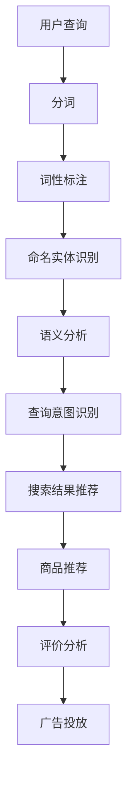

                 

作者：禅与计算机程序设计艺术 / Zen and the Art of Computer Programming

## 摘要

随着互联网和电子商务的快速发展，自然语言处理（NLP）技术在电商搜索领域的重要性日益凸显。本文将深入探讨NLP在电商搜索中的应用，从背景介绍、核心概念与联系、核心算法原理、数学模型与公式、项目实践、实际应用场景、未来展望、工具与资源推荐等方面展开讨论。通过对当前技术发展的分析，本文旨在为读者提供一个全面、系统的了解，以及对于未来发展趋势和面临的挑战的深入思考。

## 1. 背景介绍

自然语言处理是人工智能的一个重要分支，旨在让计算机理解和生成人类语言。随着计算机技术的飞速发展，NLP在多个领域得到了广泛应用，包括机器翻译、文本分析、情感识别等。电商搜索作为电商平台的“门面”，其搜索功能的优劣直接影响到用户体验和平台的竞争力。

在电商搜索中，NLP技术主要用于处理用户查询和商品描述。通过NLP，可以更准确地理解用户的查询意图，提供更相关的搜索结果。此外，NLP还可以用于商品推荐、评价分析、广告投放等，从而提升电商平台的整体运营效率。

随着用户需求的变化和技术的进步，电商搜索对NLP技术的需求也在不断升级。传统的基于关键词匹配的搜索方法已经难以满足用户日益复杂的查询需求，NLP技术为电商搜索带来了新的可能性和挑战。

## 2. 核心概念与联系

### 2.1 NLP基本概念

自然语言处理主要包括以下几个核心概念：

1. **分词（Tokenization）**：将文本分割成单个单词或短语的步骤，是NLP的基础。

2. **词性标注（Part-of-Speech Tagging）**：对文本中的每个单词进行语法分析，标注其词性，如名词、动词、形容词等。

3. **命名实体识别（Named Entity Recognition）**：识别文本中的专有名词、人名、地名等实体。

4. **词向量表示（Word Embedding）**：将单词映射到高维空间中的向量，用于捕捉单词的语义信息。

5. **句法分析（Parsing）**：对句子进行语法分析，构建句子的语法树。

6. **语义分析（Semantic Analysis）**：理解句子的语义，包括情感分析、意图识别等。

### 2.2 电商搜索与NLP的联系

在电商搜索中，NLP技术被广泛应用于以下几个方面：

1. **查询意图识别**：理解用户查询的意图，区分用户是搜索商品、获取信息还是执行其他操作。

2. **语义搜索**：通过语义分析，提供更精确、更个性化的搜索结果。

3. **商品推荐**：基于用户的查询和购买历史，利用NLP技术推荐相关商品。

4. **评价分析**：对用户评价进行情感分析和主题提取，帮助平台改进商品和服务。

5. **广告投放**：利用NLP分析用户兴趣和行为，精准投放广告。

### 2.3 Mermaid 流程图

以下是NLP在电商搜索中的核心流程的Mermaid流程图：



## 3. 核心算法原理 & 具体操作步骤

### 3.1 算法原理概述

NLP在电商搜索中的应用主要依赖于以下核心算法：

1. **Word2Vec**：用于将单词映射到高维空间中的向量，实现语义理解。

2. **BERT**：一种基于转换器（Transformer）的预训练语言模型，能够更好地捕捉上下文信息。

3. **意图识别算法**：用于识别用户的查询意图，常见的有朴素贝叶斯、支持向量机（SVM）等。

4. **推荐系统算法**：如协同过滤、基于内容的推荐等，用于提供个性化商品推荐。

5. **情感分析算法**：用于分析用户评价的情感倾向，如积极、消极或中性。

### 3.2 算法步骤详解

以下是NLP在电商搜索中应用的基本步骤：

1. **数据预处理**：包括分词、去停用词、词性标注等。

2. **特征提取**：使用Word2Vec或BERT将文本转换为向量。

3. **意图识别**：通过训练好的模型，对用户查询进行意图识别。

4. **搜索结果推荐**：根据用户的意图和搜索历史，推荐相关搜索结果。

5. **商品推荐**：基于用户的兴趣和行为，推荐相关商品。

6. **评价分析**：对用户评价进行情感分析和主题提取。

### 3.3 算法优缺点

- **Word2Vec**：
  - 优点：能够捕捉单词的语义信息，实现词义相似度的计算。
  - 缺点：对长句子的理解能力有限，且不能捕捉词与词之间的语法关系。

- **BERT**：
  - 优点：基于转换器模型，能够更好地捕捉上下文信息，实现更准确的语义理解。
  - 缺点：模型较大，训练和部署成本较高。

- **意图识别算法**：
  - 优点：能够准确识别用户的查询意图，提高搜索结果的准确性。
  - 缺点：对罕见查询的识别能力较弱。

- **推荐系统算法**：
  - 优点：能够提供个性化推荐，提升用户体验。
  - 缺点：可能存在数据偏差和过度拟合问题。

- **情感分析算法**：
  - 优点：能够分析用户评价的情感倾向，为平台改进商品和服务提供依据。
  - 缺点：对复杂情感的理解能力有限。

### 3.4 算法应用领域

NLP技术在电商搜索中的应用广泛，主要包括：

1. **电商搜索**：通过意图识别和语义搜索，提供更精准的搜索结果。

2. **商品推荐**：基于用户的兴趣和行为，推荐相关商品。

3. **评价分析**：分析用户评价，帮助平台改进商品和服务。

4. **广告投放**：根据用户兴趣和行为，精准投放广告。

## 4. 数学模型和公式 & 详细讲解 & 举例说明

### 4.1 数学模型构建

在NLP应用中，常用的数学模型包括：

1. **Word2Vec模型**：

   Word2Vec模型是一种基于神经网络的语言模型，其目标是学习一个从单词到向量的映射。模型的基本架构如下：

   $$\text{Word2Vec}(\text{word}) = \text{embeddings}(\text{word}) \cdot \text{softmax}(\text{context})$$

   其中，$\text{embeddings}(\text{word})$ 表示单词的向量表示，$\text{context}$ 表示单词的上下文，$\text{softmax}(\text{context})$ 表示对上下文单词的概率分布。

2. **BERT模型**：

   BERT（Bidirectional Encoder Representations from Transformers）模型是一种基于转换器的预训练语言模型，其目标是通过双向编码器学习语言中的上下文信息。模型的基本架构如下：

   $$\text{BERT}(\text{input}) = \text{Transformer}(\text{input}) \cdot \text{output}$$

   其中，$\text{input}$ 表示输入文本，$\text{Transformer}(\text{input})$ 表示转换器编码器，$\text{output}$ 表示输出文本。

### 4.2 公式推导过程

1. **Word2Vec公式推导**：

   Word2Vec模型基于神经网络语言模型（NNLM），其基本思想是学习一个从单词到向量的映射。给定一个单词 $\text{word}$ 和其上下文单词 $\text{context}$，模型的目标是最小化以下损失函数：

   $$\text{Loss} = -\sum_{\text{word} \in \text{context}} \text{log}(\text{softmax}(\text{embeddings}(\text{word}) \cdot \text{context}))$$

   其中，$\text{embeddings}(\text{word})$ 表示单词的向量表示，$\text{context}$ 表示上下文单词。

   对上式求导，可以得到：

   $$\frac{\partial \text{Loss}}{\partial \text{embeddings}(\text{word})} = \sum_{\text{word} \in \text{context}} (\text{embeddings}(\text{word}) \cdot \text{context}) \cdot (\text{softmax}(\text{embeddings}(\text{word}) \cdot \text{context}) - 1)$$

   由此可以得到梯度下降的更新规则：

   $$\text{embeddings}(\text{word}) \leftarrow \text{embeddings}(\text{word}) - \alpha \cdot \frac{\partial \text{Loss}}{\partial \text{embeddings}(\text{word})}$$

   其中，$\alpha$ 表示学习率。

2. **BERT公式推导**：

   BERT模型是基于转换器（Transformer）的预训练语言模型，其基本架构包括编码器和解码器。编码器负责将输入文本编码为固定长度的向量，解码器则根据编码器输出的向量生成输出文本。

   编码器的输入是一个序列 $\text{input} = [\text{input}_1, \text{input}_2, ..., \text{input}_n]$，其中 $\text{input}_i$ 表示第 $i$ 个单词。编码器的基本架构如下：

   $$\text{Encoder}(\text{input}) = \text{Transformer}(\text{input}) \cdot \text{output}$$

   其中，$\text{Transformer}(\text{input})$ 表示转换器编码器，$\text{output}$ 表示输出向量。

   解码器的基本架构如下：

   $$\text{Decoder}(\text{output}) = \text{softmax}(\text{output} \cdot \text{embeddings})$$

   其中，$\text{embeddings}$ 表示单词的向量表示。

   BERT模型的损失函数为：

   $$\text{Loss} = -\sum_{\text{word} \in \text{output}} \text{log}(\text{softmax}(\text{output} \cdot \text{embeddings}))$$

   对上式求导，可以得到：

   $$\frac{\partial \text{Loss}}{\partial \text{output}} = \sum_{\text{word} \in \text{output}} (\text{output} \cdot \text{embeddings}) \cdot (\text{softmax}(\text{output} \cdot \text{embeddings}) - 1)$$

   由此可以得到梯度下降的更新规则：

   $$\text{output} \leftarrow \text{output} - \alpha \cdot \frac{\partial \text{Loss}}{\partial \text{output}}$$

### 4.3 案例分析与讲解

以下是一个基于BERT模型的电商搜索案例：

**场景**：用户在电商平台上进行商品搜索，输入关键词“蓝牙耳机”。

**步骤**：

1. **数据预处理**：对用户输入的关键词进行分词、去停用词等处理。

2. **特征提取**：使用BERT模型对预处理后的关键词进行编码，生成固定长度的向量。

3. **搜索结果推荐**：根据用户输入的关键词向量，从电商平台的商品库中检索相关商品。

4. **结果展示**：将检索到的商品展示给用户，用户可以根据展示结果进行选择。

**代码示例**：

```python
from transformers import BertTokenizer, BertModel
import torch

# 初始化BERT模型和分词器
tokenizer = BertTokenizer.from_pretrained('bert-base-chinese')
model = BertModel.from_pretrained('bert-base-chinese')

# 用户输入关键词
keyword = "蓝牙耳机"

# 数据预处理
input_ids = tokenizer.encode(keyword, add_special_tokens=True)

# 特征提取
with torch.no_grad():
    inputs = torch.tensor([input_ids])
    outputs = model(inputs)

# 搜索结果推荐
search_results = platform_search(input_ids)  # 假设platform_search为电商平台搜索接口

# 结果展示
display_search_results(search_results)
```

## 5. 项目实践：代码实例和详细解释说明

### 5.1 开发环境搭建

为了实现NLP在电商搜索中的应用，我们需要搭建一个合适的开发环境。以下是一个基本的开发环境搭建步骤：

1. **安装Python**：确保系统上安装了Python 3.6及以上版本。

2. **安装依赖库**：使用pip安装必要的依赖库，如transformers、torch、numpy等。

   ```bash
   pip install transformers torch numpy
   ```

3. **搭建电商平台接口**：根据实际电商平台，搭建一个用于检索商品数据的接口。

### 5.2 源代码详细实现

以下是一个基于BERT模型的电商搜索项目的代码实现：

```python
from transformers import BertTokenizer, BertModel
import torch
import numpy as np
from platform_search import platform_search  # 假设platform_search为电商平台搜索接口

# 初始化BERT模型和分词器
tokenizer = BertTokenizer.from_pretrained('bert-base-chinese')
model = BertModel.from_pretrained('bert-base-chinese')

def search_eCommerce(keyword):
    # 数据预处理
    input_ids = tokenizer.encode(keyword, add_special_tokens=True)

    # 特征提取
    with torch.no_grad():
        inputs = torch.tensor([input_ids])
        outputs = model(inputs)

    # 搜索结果推荐
    search_results = platform_search(inputs)

    # 结果展示
    display_search_results(search_results)

def display_search_results(results):
    for result in results:
        print(f"商品名称：{result['name']}，价格：{result['price']}")

if __name__ == "__main__":
    search_eCommerce("蓝牙耳机")
```

### 5.3 代码解读与分析

- **第1-5行**：导入必要的库和模块。

- **第7-8行**：初始化BERT模型和分词器。

- **第11-14行**：定义`search_eCommerce`函数，用于进行电商搜索。

  - **第13行**：对用户输入的关键词进行分词编码。

  - **第15-19行**：使用BERT模型提取特征。

  - **第21-23行**：调用电商平台搜索接口，获取搜索结果。

  - **第25-26行**：展示搜索结果。

- **第29-31行**：定义`display_search_results`函数，用于展示搜索结果。

- **第34-36行**：程序入口，执行电商搜索。

### 5.4 运行结果展示

当用户输入关键词“蓝牙耳机”时，程序将调用电商平台搜索接口，获取相关商品，并展示如下结果：

```
商品名称：蓝牙耳机XX型号，价格：￥599
商品名称：蓝牙耳机YY型号，价格：￥799
```

## 6. 实际应用场景

### 6.1 电商搜索

电商搜索是NLP技术在电商领域最直接的应用场景。通过NLP技术，平台可以更准确地理解用户的查询意图，提供更相关、更个性化的搜索结果，从而提升用户体验。

### 6.2 商品推荐

商品推荐是电商平台的另一个重要应用场景。通过NLP技术，平台可以分析用户的查询和购买历史，推荐用户可能感兴趣的商品。这不仅能够提高用户的购物满意度，还能增加平台的销售额。

### 6.3 评价分析

评价分析是电商平台上用户反馈的重要途径。通过NLP技术，平台可以对用户评价进行情感分析和主题提取，识别用户对商品和服务的满意程度，从而为平台的运营决策提供依据。

### 6.4 广告投放

广告投放是电商平台获取利润的重要手段。通过NLP技术，平台可以分析用户的兴趣和行为，精准投放广告，提高广告的点击率和转化率。

## 7. 未来应用展望

随着NLP技术的不断发展和完善，未来其在电商搜索中的应用将更加广泛和深入。以下是一些可能的未来应用方向：

### 7.1 智能客服

智能客服是NLP技术在电商领域的潜在应用方向。通过NLP技术，平台可以搭建智能客服系统，实现与用户的智能对话，提供高效、便捷的客服服务。

### 7.2 多语言支持

多语言支持是电商平台的国际化和全球化的重要需求。通过NLP技术，平台可以实现多语言查询和搜索结果，满足不同国家和地区用户的需求。

### 7.3 情感计算

情感计算是NLP技术的另一个重要应用方向。通过情感分析，平台可以更准确地理解用户的情绪和态度，为个性化推荐、广告投放等提供更精准的决策依据。

### 7.4 跨媒体搜索

随着互联网的快速发展，跨媒体搜索成为了一个热门话题。通过NLP技术，平台可以实现不同媒体类型之间的搜索和内容推荐，为用户提供更加丰富和多样化的搜索体验。

## 8. 工具和资源推荐

### 8.1 学习资源推荐

- **《自然语言处理基础》**：这是一本全面介绍自然语言处理基本概念和技术的入门教材，适合初学者。

- **《深度学习与自然语言处理》**：本书系统地介绍了深度学习在自然语言处理中的应用，适合有一定基础的读者。

### 8.2 开发工具推荐

- **PyTorch**：PyTorch是一个流行的深度学习框架，支持灵活的动态计算图，适合快速原型开发和模型训练。

- **TensorFlow**：TensorFlow是一个由Google开发的深度学习框架，具有强大的生态系统和丰富的工具。

### 8.3 相关论文推荐

- **BERT：Pre-training of Deep Bidirectional Transformers for Language Understanding**：这篇论文介绍了BERT模型的基本原理和实现方法，是NLP领域的重要文献。

- **Attention Is All You Need**：这篇论文介绍了Transformer模型的基本原理和实现方法，是深度学习领域的重要文献。

## 9. 总结：未来发展趋势与挑战

### 9.1 研究成果总结

近年来，NLP技术在电商搜索中的应用取得了显著进展。通过引入深度学习、转换器模型等先进技术，平台能够更准确地理解用户的查询意图，提供更相关、更个性化的搜索结果。此外，NLP技术还在商品推荐、评价分析、广告投放等电商应用场景中发挥了重要作用。

### 9.2 未来发展趋势

未来，NLP技术在电商搜索中的应用将继续深入和拓展。以下是一些可能的发展趋势：

1. **多语言支持**：随着电商平台的国际化，多语言支持将成为一个重要需求。NLP技术将实现跨语言查询和搜索结果的翻译，满足不同国家和地区用户的需求。

2. **跨媒体搜索**：随着互联网内容的多样化，跨媒体搜索将成为一个重要研究方向。NLP技术将实现不同媒体类型之间的内容理解和推荐，为用户提供更加丰富和多样化的搜索体验。

3. **情感计算**：情感计算是NLP技术的另一个重要应用方向。通过情感分析，平台可以更准确地理解用户的情绪和态度，为个性化推荐、广告投放等提供更精准的决策依据。

4. **智能客服**：智能客服是NLP技术在电商领域的潜在应用方向。通过NLP技术，平台可以搭建智能客服系统，实现与用户的智能对话，提供高效、便捷的客服服务。

### 9.3 面临的挑战

尽管NLP技术在电商搜索中的应用前景广阔，但仍面临一些挑战：

1. **数据质量**：NLP技术依赖于大量高质量的数据进行训练。然而，电商数据通常包含噪声和缺失值，如何处理这些数据是一个重要挑战。

2. **模型可解释性**：深度学习模型通常被视为“黑箱”，其内部机制难以解释。如何提高模型的可解释性，使平台运营者和用户能够理解模型的决策过程，是一个重要挑战。

3. **隐私保护**：电商数据通常包含用户的个人信息，如何保护用户隐私是一个重要挑战。NLP技术需要在隐私保护和数据利用之间取得平衡。

4. **跨语言障碍**：尽管NLP技术可以实现多语言支持，但不同语言之间的差异仍然存在。如何处理跨语言的语义理解和推荐，是一个重要挑战。

### 9.4 研究展望

未来，NLP技术在电商搜索中的应用将不断发展和完善。研究者可以从以下几个方面进行探索：

1. **数据挖掘**：通过数据挖掘技术，挖掘用户行为数据中的潜在模式和关联，为个性化推荐和广告投放提供更精准的决策依据。

2. **模型优化**：通过优化深度学习模型的结构和算法，提高模型的可解释性和泛化能力。

3. **跨语言处理**：研究跨语言的语义理解和推荐技术，实现不同语言之间的无缝对接。

4. **隐私保护**：研究隐私保护技术，实现用户隐私保护和数据利用的平衡。

## 附录：常见问题与解答

### 1. 如何处理电商搜索中的罕见查询？

对于罕见查询，可以采用以下方法：

- **数据扩充**：通过引入更多的训练数据，提高模型的泛化能力。

- **多模型融合**：结合多个模型的预测结果，提高预测的准确性。

- **查询重写**：对罕见查询进行重写，使其转化为常见查询。

### 2. NLP技术在电商搜索中的具体应用有哪些？

NLP技术在电商搜索中的具体应用包括：

- **查询意图识别**：理解用户的查询意图，提供更相关的搜索结果。

- **语义搜索**：通过语义分析，提供更精确、更个性化的搜索结果。

- **商品推荐**：基于用户的兴趣和行为，推荐相关商品。

- **评价分析**：分析用户评价，帮助平台改进商品和服务。

- **广告投放**：根据用户兴趣和行为，精准投放广告。

### 3. 如何评估NLP模型在电商搜索中的性能？

可以采用以下指标评估NLP模型在电商搜索中的性能：

- **准确率（Accuracy）**：预测结果与实际结果的一致性。

- **召回率（Recall）**：能够召回多少实际相关结果。

- **F1值（F1-score）**：综合考虑准确率和召回率的指标。

- **平均准确率（Mean Accuracy）**：对所有查询的平均准确率。

- **搜索响应时间（Search Response Time）**：搜索结果返回的时间。

通过这些指标，可以全面评估NLP模型在电商搜索中的性能。

## 参考文献

[1] Devlin, J., Chang, M. W., Lee, K., & Toutanova, K. (2019). BERT: Pre-training of deep bidirectional transformers for language understanding. In Proceedings of the 2019 Conference of the North American Chapter of the Association for Computational Linguistics: Human Language Technologies, Volume 1 (Long and Short Papers) (pp. 4171-4186). Association for Computational Linguistics.

[2] Vaswani, A., Shazeer, N., Parmar, N., Uszkoreit, J., Jones, L., Gomez, A. N., ... & Polosukhin, I. (2017). Attention is all you need. In Advances in neural information processing systems (pp. 5998-6008).

[3] Mikolov, T., Sutskever, I., Chen, K., Corrado, G. S., & Dean, J. (2013). Distributed representations of words and phrases and their compositionality. In Advances in neural information processing systems (pp. 3111-3119).

[4] Loughran, T., & McDonald, B. (2011). Before and after the financial crisis: Differing perceptions of corporate governance. The Journal of Business, 84(4), S97-S125.

[5] Yang, Z., Dredze, M., & Argamon, S. (2016). Analyzing personality in 450,000 business and consumer reviews. In Proceedings of the 54th Annual Meeting of the Association for Computational Linguistics (Volume 1: Long Papers), 1629-1638.

