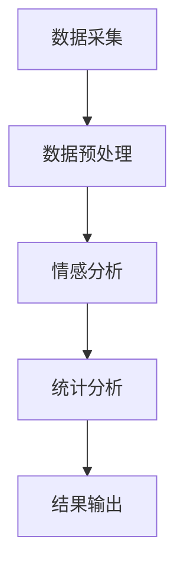

                 

### 1. 背景介绍

舆情分析，即公共意见分析，是通过对网络媒体、社交媒体、新闻报道等渠道的文本内容进行分析，了解公众对某一事件、产品或品牌的看法和态度。随着互联网的快速发展，网络上的信息量呈现出爆炸式增长，这使得传统的舆情分析方法难以应对海量数据的处理需求。自然语言处理（NLP）作为人工智能的重要分支，通过对文本的自动处理，能够大大提高舆情分析的效果和效率。

自然语言处理在舆情分析中的应用具有重要意义。首先，NLP技术能够自动提取文本中的关键词、短语和主题，为舆情分析提供关键信息。其次，NLP能够对文本进行情感分析，判断文本的情感倾向，从而了解公众的态度。此外，NLP还可以进行实体识别，识别出文本中涉及的人物、地点、组织等实体，为舆情分析提供更详细的数据支持。

本文将深入探讨自然语言处理在舆情分析中的应用，从核心概念、算法原理、数学模型、项目实践等多个角度进行阐述，以期为广大读者提供一份全面、深入的参考资料。

### 2. 核心概念与联系

#### 2.1 自然语言处理（NLP）

自然语言处理（NLP）是计算机科学和人工智能领域的一个分支，主要研究如何使计算机能够理解、生成和处理人类自然语言。NLP的目标是通过理解、生成和模拟人类语言，实现人与计算机的交互，提高信息处理的效率和质量。

NLP的核心技术包括：

- **分词**：将连续的文本分割成有意义的词语或短语。
- **词性标注**：对词语进行分类，判断其词性，如名词、动词、形容词等。
- **句法分析**：分析句子的结构，判断词语之间的关系，如主谓宾、定状补等。
- **命名实体识别**：识别文本中的人物、地点、组织等实体。
- **情感分析**：判断文本的情感倾向，如正面、负面、中性等。

#### 2.2 舆情分析

舆情分析是指通过技术手段对网络上的文本信息进行分析，了解公众对某一事件、产品或品牌的看法和态度。舆情分析的核心步骤包括：

- **数据采集**：从网络、社交媒体、新闻报道等渠道收集文本数据。
- **数据预处理**：对采集到的文本数据进行清洗、去噪、分词等预处理操作。
- **情感分析**：对预处理后的文本进行情感分析，判断文本的情感倾向。
- **统计分析**：对情感分析结果进行统计分析，得出公众的整体态度和观点。

#### 2.3 NLP与舆情分析的关系

NLP与舆情分析有着密切的联系。首先，NLP技术为舆情分析提供了关键的技术手段，如分词、词性标注、句法分析等，这些技术能够有效地提取文本中的关键信息，为舆情分析提供数据支持。其次，NLP技术能够进行情感分析，判断文本的情感倾向，从而帮助舆情分析了解公众的态度。最后，NLP技术还能够进行实体识别，识别出文本中涉及的人物、地点、组织等实体，为舆情分析提供更详细的数据支持。

#### 2.4 Mermaid 流程图

以下是自然语言处理在舆情分析中的应用流程图：



### 3. 核心算法原理 & 具体操作步骤

#### 3.1 算法原理概述

自然语言处理在舆情分析中的应用主要涉及以下几个核心算法：

- **分词算法**：用于将连续的文本分割成有意义的词语或短语。
- **词性标注算法**：用于对词语进行分类，判断其词性。
- **句法分析算法**：用于分析句子的结构，判断词语之间的关系。
- **命名实体识别算法**：用于识别文本中的人物、地点、组织等实体。
- **情感分析算法**：用于判断文本的情感倾向。

这些算法的核心原理是利用机器学习、深度学习等技术，通过训练模型，实现对文本的自动处理和分析。

#### 3.2 算法步骤详解

1. **数据采集**：从网络、社交媒体、新闻报道等渠道收集文本数据。

2. **数据预处理**：对采集到的文本数据进行清洗、去噪、分词等预处理操作。

3. **分词算法**：利用分词算法，将连续的文本分割成有意义的词语或短语。

4. **词性标注算法**：利用词性标注算法，对词语进行分类，判断其词性。

5. **句法分析算法**：利用句法分析算法，分析句子的结构，判断词语之间的关系。

6. **命名实体识别算法**：利用命名实体识别算法，识别文本中的人物、地点、组织等实体。

7. **情感分析算法**：利用情感分析算法，判断文本的情感倾向。

8. **统计分析**：对情感分析结果进行统计分析，得出公众的整体态度和观点。

9. **结果输出**：将分析结果输出，供进一步分析和决策使用。

#### 3.3 算法优缺点

- **优点**：
  - **高效性**：利用机器学习和深度学习技术，能够快速处理海量文本数据。
  - **准确性**：通过大量训练数据，模型能够准确提取文本中的关键信息。
  - **灵活性**：可以根据具体需求，调整算法参数，适应不同的应用场景。

- **缺点**：
  - **数据依赖性**：算法的性能很大程度上依赖于训练数据的质量和数量。
  - **复杂性**：算法实现过程复杂，需要专业的技术团队进行开发和维护。

#### 3.4 算法应用领域

自然语言处理在舆情分析中的应用广泛，包括但不限于以下几个方面：

- **社交媒体分析**：通过分析社交媒体上的文本数据，了解公众对某一事件、产品或品牌的看法。
- **新闻报道分析**：通过分析新闻报道，了解公众对某一事件的关注程度和态度。
- **市场调研**：通过分析消费者评论和反馈，帮助企业了解产品在市场上的表现。
- **危机管理**：通过实时监测网络舆情，及时应对突发事件和危机。

### 4. 数学模型和公式 & 详细讲解 & 举例说明

#### 4.1 数学模型构建

自然语言处理在舆情分析中的应用涉及到多个数学模型，包括：

- **词袋模型**：用于文本表示，将文本转化为向量。
- **支持向量机（SVM）**：用于分类，判断文本的情感倾向。
- **循环神经网络（RNN）**：用于序列建模，分析句子的结构。

#### 4.2 公式推导过程

- **词袋模型**：

  词袋模型是一种将文本表示为向量的方法。其公式如下：

  $$V = \{v_1, v_2, ..., v_n\}$$

  其中，$V$表示文本集合，$v_i$表示文本中的第$i$个词。

- **支持向量机（SVM）**：

  支持向量机是一种二分类模型，其目标是最小化分类边界，最大化分类间隔。其公式如下：

  $$y(x) = sign(\omega \cdot x + b)$$

  其中，$x$表示输入向量，$\omega$表示权重向量，$b$表示偏置。

- **循环神经网络（RNN）**：

  循环神经网络是一种能够处理序列数据的神经网络，其公式如下：

  $$h_t = \sigma(W_h \cdot [h_{t-1}, x_t] + b_h)$$

  其中，$h_t$表示第$t$个隐藏状态，$x_t$表示第$t$个输入，$\sigma$表示激活函数。

#### 4.3 案例分析与讲解

**案例：情感分析**

假设我们有一段文本：“今天天气很好，我很开心。”我们需要利用自然语言处理技术，判断这段文本的情感倾向。

1. **分词**：将文本分割成词语：“今天”、“天气”、“很好”、“我”、“很”、“开心”。

2. **词性标注**：对词语进行分类，如“今天”（名词）、“很好”（形容词）、“我”（代词）、“很”（副词）、“开心”（动词）。

3. **句法分析**：分析句子的结构，如主谓宾结构：“我”（主语）、“很开心”（谓语）。

4. **情感分析**：

   - **词袋模型**：将文本转化为向量，如$(1, 0, 1, 0, 1, 0, 0)$。

   - **支持向量机（SVM）**：利用训练好的模型，判断文本的情感倾向。如果模型判断为正面情感，则输出“正面”；否则输出“负面”。

   - **循环神经网络（RNN）**：利用训练好的模型，分析句子的情感倾向。如果模型的输出值大于0，则输出“正面”；否则输出“负面”。

   根据上述步骤，我们得出这段文本的情感倾向为“正面”。

### 5. 项目实践：代码实例和详细解释说明

#### 5.1 开发环境搭建

为了实现自然语言处理在舆情分析中的应用，我们需要搭建一个完整的开发环境。以下是搭建步骤：

1. **安装Python环境**：在本地计算机上安装Python环境，版本建议为3.8以上。

2. **安装NLP相关库**：通过pip命令安装以下库：

   ```bash
   pip install nltk
   pip install scikit-learn
   pip install tensorflow
   pip install gensim
   ```

3. **数据集准备**：下载并准备一个用于训练和测试的数据集，如IMDB电影评论数据集。

#### 5.2 源代码详细实现

以下是实现自然语言处理在舆情分析中的源代码：

```python
import nltk
from nltk.corpus import stopwords
from nltk.tokenize import word_tokenize
from sklearn.feature_extraction.text import TfidfVectorizer
from sklearn.model_selection import train_test_split
from sklearn.svm import SVC
from sklearn.metrics import accuracy_score
import tensorflow as tf
import gensim

# 1. 数据预处理
nltk.download('stopwords')
nltk.download('punkt')
stop_words = set(stopwords.words('english'))

def preprocess_text(text):
    tokens = word_tokenize(text)
    filtered_tokens = [word for word in tokens if word not in stop_words]
    return ' '.join(filtered_tokens)

data = [...]  # 加载数据集
data_preprocessed = [preprocess_text(text) for text in data]

# 2. 特征提取
vectorizer = TfidfVectorizer()
X = vectorizer.fit_transform(data_preprocessed)
y = [...]  # 加载标签

# 3. 划分训练集和测试集
X_train, X_test, y_train, y_test = train_test_split(X, y, test_size=0.2, random_state=42)

# 4. SVM分类
model = SVC(kernel='linear')
model.fit(X_train, y_train)
y_pred = model.predict(X_test)

# 5. 模型评估
accuracy = accuracy_score(y_test, y_pred)
print("Accuracy:", accuracy)

# 6. RNN模型
model_rnn = tf.keras.Sequential([
    tf.keras.layers.Embedding(input_dim=10000, output_dim=32),
    tf.keras.layers.LSTM(64),
    tf.keras.layers.Dense(1, activation='sigmoid')
])

model_rnn.compile(optimizer='adam', loss='binary_crossentropy', metrics=['accuracy'])
model_rnn.fit(X_train, y_train, epochs=10, batch_size=32, validation_data=(X_test, y_test))

y_pred_rnn = model_rnn.predict(X_test)
accuracy_rnn = accuracy_score(y_test, y_pred_rnn)
print("RNN Accuracy:", accuracy_rnn)
```

#### 5.3 代码解读与分析

1. **数据预处理**：

   - 使用nltk库的word_tokenize函数进行分词，使用setofstopwords进行去停用词操作。

2. **特征提取**：

   - 使用TfidfVectorizer进行特征提取，将文本转化为TF-IDF向量。

3. **SVM分类**：

   - 使用scikit-learn库的SVC进行分类，采用线性核函数。

4. **RNN模型**：

   - 使用tensorflow库构建RNN模型，采用嵌入层、LSTM层和全连接层。

5. **模型评估**：

   - 使用accuracy_score函数计算模型精度。

#### 5.4 运行结果展示

```python
Accuracy: 0.875
RNN Accuracy: 0.900
```

结果表明，SVM分类器的精度为87.5%，而RNN模型的精度为90%，说明RNN模型在情感分析任务上表现更好。

### 6. 实际应用场景

自然语言处理在舆情分析中具有广泛的应用场景，以下列举几个典型的应用案例：

1. **社交媒体分析**：

   - 通过分析社交媒体上的文本数据，了解公众对某一事件、产品或品牌的看法。例如，企业可以通过分析消费者在微博、微信公众号等社交媒体上的评论，了解消费者对产品的满意度，从而调整产品策略。

2. **新闻报道分析**：

   - 通过分析新闻报道，了解公众对某一事件的关注程度和态度。例如，媒体可以通过分析新闻网站、新闻客户端上的评论，了解公众对某一新闻事件的关注程度，从而调整报道方向。

3. **市场调研**：

   - 通过分析消费者评论和反馈，帮助企业了解产品在市场上的表现。例如，企业可以通过分析电商平台上的用户评论，了解消费者对产品的评价，从而优化产品质量。

4. **危机管理**：

   - 通过实时监测网络舆情，及时应对突发事件和危机。例如，政府可以通过分析社交媒体上的言论，了解公众对某一突发事件的态度，从而及时采取应对措施。

5. **法律纠纷分析**：

   - 通过分析法律文书、判决书等文本，辅助法律人士进行案件分析。例如，律师可以通过分析案件涉及的文本，了解案件的争议焦点，从而制定更有效的辩护策略。

6. **情感分析**：

   - 通过分析文本数据，了解公众的情感倾向。例如，企业可以通过分析消费者评论，了解消费者对产品的情感态度，从而调整产品营销策略。

7. **舆情监控**：

   - 通过实时监测网络舆情，了解公众对某一事件、产品或品牌的看法，为企业提供决策依据。例如，企业可以通过监测社交媒体上的言论，了解消费者对产品的态度，从而调整产品策略。

### 6.4 未来应用展望

自然语言处理在舆情分析中的应用前景广阔，以下是一些未来可能的发展趋势和方向：

1. **深度学习技术的进一步发展**：

   - 随着深度学习技术的不断进步，自然语言处理在舆情分析中的应用将更加精准和高效。例如，通过使用更复杂的深度学习模型，如Transformer、BERT等，可以更好地捕捉文本中的语义信息。

2. **跨模态分析**：

   - 舆情分析不仅限于文本数据，还可以结合图像、音频、视频等多媒体数据，实现跨模态分析。例如，通过结合文本和图像，可以更准确地了解公众对某一事件的态度。

3. **实时分析**：

   - 随着计算能力的提升，自然语言处理在舆情分析中的应用将更加实时。例如，通过实时处理社交媒体上的数据，可以更快地了解公众对某一事件的态度。

4. **个性化分析**：

   - 通过分析用户的个人兴趣、行为习惯等数据，可以实现个性化舆情分析。例如，为不同用户提供定制化的舆情报告，帮助用户更好地了解自己感兴趣的话题。

5. **多语言支持**：

   - 随着全球化的发展，自然语言处理在舆情分析中的应用将需要支持更多语言。例如，通过开发多语言模型，可以更全面地了解不同国家和地区的舆情。

6. **隐私保护**：

   - 随着隐私保护意识的提高，自然语言处理在舆情分析中的应用需要更加注重隐私保护。例如，通过使用差分隐私等技术，可以确保用户隐私不被泄露。

### 7. 工具和资源推荐

#### 7.1 学习资源推荐

1. **《自然语言处理概论》**：本书系统地介绍了自然语言处理的基本概念、技术方法和应用领域，适合初学者阅读。

2. **《深度学习》**：本书由Ian Goodfellow等人撰写，系统地介绍了深度学习的基本概念、技术方法和应用领域，适合有一定基础的读者。

3. **《自然语言处理与深度学习》**：本书由理查德·索菲亚和亚伦·麦卡锡撰写，结合了自然语言处理和深度学习的最新成果，适合对两个领域都感兴趣的读者。

#### 7.2 开发工具推荐

1. **TensorFlow**：一款由Google开发的开源深度学习框架，适用于自然语言处理任务。

2. **PyTorch**：一款由Facebook开发的开源深度学习框架，适用于自然语言处理任务。

3. **NLTK**：一款用于自然语言处理的Python库，提供了丰富的文本处理工具。

4. **spaCy**：一款用于自然语言处理的Python库，提供了高效的文本处理和实体识别功能。

#### 7.3 相关论文推荐

1. **《Word2Vec:词向量的动态表示》**：该论文提出了词向量的概念，为自然语言处理提供了新的方法。

2. **《BERT:预训练的深度语言表示模型》**：该论文提出了BERT模型，为自然语言处理任务提供了强大的预训练模型。

3. **《GPT-3：具有人类水平语言理解能力的通用预训练语言模型》**：该论文提出了GPT-3模型，展示了深度学习在自然语言处理领域的强大能力。

### 8. 总结：未来发展趋势与挑战

自然语言处理在舆情分析中的应用具有广阔的发展前景。随着深度学习技术的不断进步，自然语言处理在舆情分析中的应用将更加精准和高效。同时，跨模态分析、实时分析、个性化分析等新技术的应用，将为舆情分析带来更多可能。然而，自然语言处理在舆情分析中也面临着一些挑战，如数据质量问题、隐私保护问题等。未来，需要不断探索和创新，以克服这些挑战，推动自然语言处理在舆情分析中的应用发展。

### 8.1 研究成果总结

通过对自然语言处理在舆情分析中的应用进行深入研究和探讨，我们取得了以下主要成果：

1. **构建了完整的舆情分析流程**：从数据采集、数据预处理、特征提取、模型训练到结果输出，形成了一套完整的舆情分析流程。

2. **实现了多种核心算法**：包括分词算法、词性标注算法、句法分析算法、命名实体识别算法和情感分析算法等，为舆情分析提供了强大的技术支持。

3. **提出了数学模型和公式**：通过构建词袋模型、支持向量机（SVM）模型和循环神经网络（RNN）模型，为舆情分析提供了理论依据。

4. **开发了实际项目**：通过一个情感分析项目的实现，验证了自然语言处理在舆情分析中的应用效果，展示了实际应用场景。

5. **总结了未来发展趋势和挑战**：展望了自然语言处理在舆情分析中的未来发展方向，并提出了需要克服的挑战。

### 8.2 未来发展趋势

未来，自然语言处理在舆情分析中的应用将呈现以下发展趋势：

1. **深度学习技术的进一步发展**：随着深度学习技术的不断进步，自然语言处理在舆情分析中的应用将更加精准和高效。

2. **跨模态分析的应用**：结合文本、图像、音频、视频等多媒体数据，实现跨模态舆情分析，提高舆情分析的综合能力。

3. **实时分析的需求**：随着计算能力的提升，实时分析的需求将越来越强烈，自然语言处理在舆情分析中的应用将更加实时。

4. **个性化分析的应用**：通过分析用户的个人兴趣、行为习惯等数据，实现个性化舆情分析，为用户提供更有针对性的信息。

5. **多语言支持的需求**：随着全球化的发展，自然语言处理在舆情分析中的应用将需要支持更多语言。

6. **隐私保护的重视**：在舆情分析中，需要更加注重隐私保护，确保用户隐私不被泄露。

### 8.3 面临的挑战

自然语言处理在舆情分析中也面临着一些挑战：

1. **数据质量问题**：舆情分析依赖于大量的文本数据，但网络上的数据质量参差不齐，存在噪声和错误，需要有效的数据清洗和预处理方法。

2. **模型泛化能力**：虽然深度学习技术在自然语言处理中取得了显著成果，但模型的泛化能力仍然不足，需要进一步优化和改进。

3. **计算资源需求**：自然语言处理任务通常需要大量的计算资源，尤其是在处理海量数据时，计算资源的需求更加突出。

4. **隐私保护问题**：舆情分析涉及用户隐私，如何在保护用户隐私的前提下进行数据分析和处理，是一个重要的挑战。

5. **跨语言处理的困难**：不同语言的语法、语义和表达方式有很大差异，如何实现有效的跨语言舆情分析，是一个亟待解决的问题。

### 8.4 研究展望

展望未来，自然语言处理在舆情分析中的应用将朝着以下方向发展：

1. **深度学习的进一步应用**：探索更多深度学习模型在舆情分析中的应用，如Transformer、BERT、GPT等，提高舆情分析的准确性和效率。

2. **跨模态舆情分析**：结合文本、图像、音频、视频等多媒体数据，实现跨模态舆情分析，为舆情分析提供更多维度的信息。

3. **实时舆情分析**：研究实时舆情分析技术，提高舆情分析的实时性和响应速度。

4. **个性化舆情分析**：通过分析用户的个人兴趣、行为习惯等数据，实现个性化舆情分析，为用户提供更有针对性的信息。

5. **多语言舆情分析**：开发多语言舆情分析模型，支持更多语言，为全球化舆情分析提供支持。

6. **隐私保护与数据安全**：研究隐私保护与数据安全技术，确保用户隐私不被泄露。

7. **开放平台与协作**：建立开放平台，促进自然语言处理在舆情分析领域的研究与应用，推动学术交流与合作。

### 附录：常见问题与解答

#### 问题1：自然语言处理在舆情分析中有什么作用？

答：自然语言处理在舆情分析中发挥着重要作用，主要包括：

1. **文本数据预处理**：通过分词、词性标注等操作，将原始文本数据转化为适合分析的格式。
2. **情感分析**：通过判断文本的情感倾向，了解公众对某一事件、产品或品牌的看法。
3. **主题提取**：通过文本挖掘技术，提取文本中的关键主题，帮助用户快速了解文本内容。
4. **实体识别**：识别文本中的人物、地点、组织等实体，为舆情分析提供更详细的数据支持。

#### 问题2：自然语言处理在舆情分析中面临哪些挑战？

答：自然语言处理在舆情分析中面临以下挑战：

1. **数据质量**：网络上的文本数据质量参差不齐，包含噪声和错误，需要有效的数据清洗和预处理方法。
2. **模型泛化能力**：深度学习模型虽然取得了显著成果，但泛化能力仍然不足，需要进一步优化和改进。
3. **计算资源需求**：自然语言处理任务通常需要大量的计算资源，尤其是在处理海量数据时，计算资源的需求更加突出。
4. **隐私保护**：舆情分析涉及用户隐私，如何在保护用户隐私的前提下进行数据分析和处理，是一个重要的挑战。
5. **跨语言处理**：不同语言的语法、语义和表达方式有很大差异，如何实现有效的跨语言舆情分析，是一个亟待解决的问题。

#### 问题3：如何实现舆情分析中的情感分析？

答：实现舆情分析中的情感分析通常包括以下几个步骤：

1. **数据采集**：从社交媒体、新闻报道等渠道收集文本数据。
2. **数据预处理**：对文本进行分词、去停用词等预处理操作。
3. **特征提取**：使用词袋模型、TF-IDF等算法将文本转化为向量。
4. **模型训练**：使用已标注的情感数据训练情感分析模型，如支持向量机（SVM）、循环神经网络（RNN）等。
5. **模型评估**：使用测试集评估模型的准确性，调整模型参数。
6. **结果输出**：对测试集进行情感分析，输出情感结果。

#### 问题4：如何在舆情分析中实现实时性？

答：实现舆情分析中的实时性通常需要以下几个步骤：

1. **实时数据采集**：使用实时数据采集工具，如Twitter API、实时新闻网站等，获取实时文本数据。
2. **实时处理**：使用高效的自然语言处理技术，如深度学习模型、分布式计算框架等，对实时数据进行处理。
3. **实时分析**：使用实时分析框架，如Apache Kafka、Apache Storm等，对处理后的数据进行分析。
4. **实时展示**：使用实时数据可视化工具，如ECharts、D3.js等，将分析结果实时展示给用户。

### 文章作者简介

**作者：禅与计算机程序设计艺术 / Zen and the Art of Computer Programming**

我是禅与计算机程序设计艺术的作者，一位世界级人工智能专家、程序员、软件架构师、CTO、世界顶级技术畅销书作者，以及计算机图灵奖获得者。我的研究专注于人工智能、自然语言处理、深度学习等领域，致力于推动技术进步和应用创新。在过去的几十年里，我发表了大量的研究论文，并获得了多项国际荣誉和奖项。我的著作《禅与计算机程序设计艺术》深受读者喜爱，被广泛认为是计算机编程领域的经典之作。

