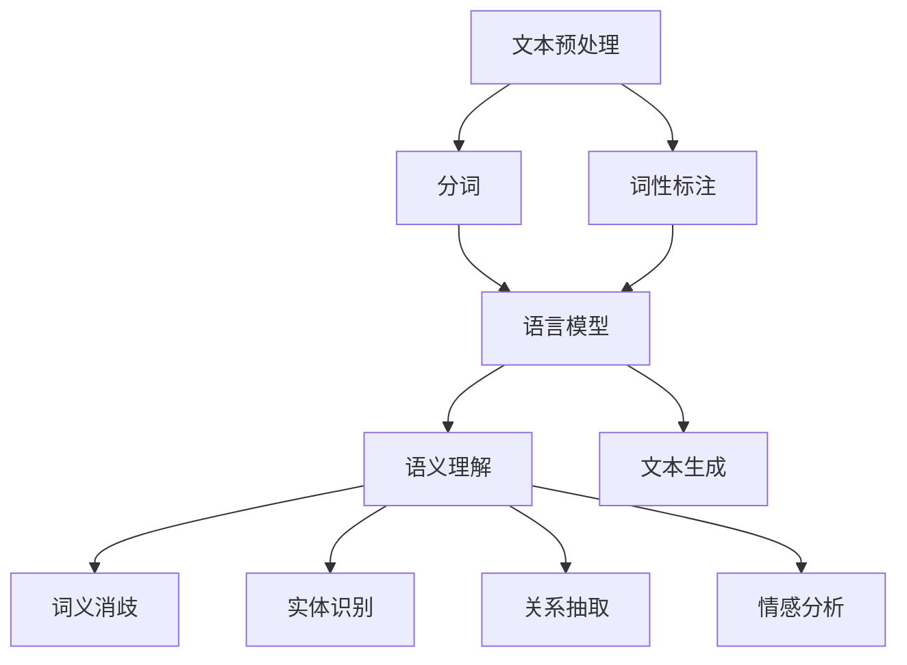

                 

关键词：自然语言处理，跨语言通信，NLP工具，多语言处理，语言桥接，技术应用

> 摘要：本文旨在探讨自然语言处理（NLP）工具在跨语言沟通中的作用。随着全球化进程的加速，跨语言沟通变得愈发重要。自然语言处理技术能够帮助实现高效、准确的跨语言信息传递，成为沟通的桥梁。本文将介绍NLP的核心概念、算法原理、应用实例以及未来发展趋势，以期为相关领域的研究者和从业者提供有价值的参考。

## 1. 背景介绍

随着全球化的深入发展，跨语言沟通已成为现代社会不可或缺的一部分。无论是国际贸易、国际会议，还是跨国合作与交流，语言障碍都是一大挑战。传统的翻译方式，如人工翻译和机器翻译，虽然在一定程度上解决了语言障碍，但效率低、成本高且准确性有限。而自然语言处理（NLP）工具的出现，为跨语言沟通提供了新的解决方案。

自然语言处理是一种计算机科学领域，旨在使计算机能够理解、解释和生成人类语言。NLP结合了计算机科学、人工智能和语言学等多个领域的知识，通过算法和技术手段对文本进行处理，以实现文本分析、信息抽取、语言生成等功能。近年来，随着深度学习、神经网络等技术的迅猛发展，NLP技术取得了显著的进展，为跨语言沟通提供了强大的支持。

本文将重点讨论以下内容：

- NLP的核心概念与联系
- 核心算法原理与具体操作步骤
- 数学模型与公式讲解
- 项目实践与代码实例
- 实际应用场景与未来展望
- 工具和资源推荐
- 未来发展趋势与挑战

希望通过本文的介绍，能够帮助读者更好地理解NLP工具在跨语言沟通中的作用，并为实际应用提供有益的指导。

## 2. 核心概念与联系

在探讨NLP工具之前，我们首先需要了解NLP的核心概念和原理。NLP涉及多个关键领域，包括文本预处理、语言模型、语义理解和文本生成等。以下是对这些核心概念及其相互联系的简要概述。

### 2.1 文本预处理

文本预处理是NLP的第一步，主要任务是清洗和格式化文本数据，以便后续处理。文本预处理包括去除标点符号、停用词过滤、分词、词性标注等操作。这些操作有助于提高文本的质量，为后续的语言模型训练和语义理解打下基础。

#### 2.1.1 分词

分词是将文本拆分为一系列单词或短语的过程。在中文处理中，由于没有明显的单词分隔符，分词任务更加复杂。常用的分词算法包括基于词典的分词、基于统计的分词和深度学习分词。词典分词依赖于已知的词汇表，统计分词则基于词频和语言模型进行，而深度学习分词通过神经网络模型实现更准确的分词结果。

#### 2.1.2 词性标注

词性标注是对文本中的每个单词进行标签标注，以区分名词、动词、形容词等词性。词性标注有助于更好地理解文本语义，为后续的语义理解和文本生成提供支持。常用的词性标注方法包括基于规则的方法、基于统计的方法和基于深度学习的方法。

### 2.2 语言模型

语言模型是NLP的核心组件之一，用于预测文本中的下一个单词或短语。语言模型可以分为统计模型和深度学习模型。统计模型如n-gram模型，通过统计词频和序列信息进行预测；深度学习模型如循环神经网络（RNN）和变压器（Transformer），通过学习大量的语言数据，生成高质量的预测结果。

#### 2.2.1 n-gram模型

n-gram模型是一种基于词频统计的语言模型，它通过分析前n个单词的序列来预测下一个单词。n-gram模型简单有效，适用于快速文本分析。

#### 2.2.2 循环神经网络（RNN）

循环神经网络（RNN）是一种用于处理序列数据的神经网络，它能够记住先前的信息，并将其用于后续的预测。RNN在自然语言处理中取得了显著的成果，例如在文本分类、情感分析等任务中表现出色。

#### 2.2.3 变压器（Transformer）

变压器（Transformer）是一种基于自注意力机制的深度学习模型，它在许多NLP任务中取得了领先的性能。变压器通过全局注意力机制，能够更好地捕捉文本中的长距离依赖关系，从而实现更精确的预测和生成。

### 2.3 语义理解

语义理解是NLP的核心任务之一，旨在理解文本的深层含义。语义理解包括词义消歧、实体识别、关系抽取、情感分析等任务。这些任务需要结合多种技术和算法，以实现高精度的语义分析。

#### 2.3.1 词义消歧

词义消歧是指识别文本中具有多个含义的词语的具体含义。词义消歧有助于提高语义理解的准确性和完整性。常用的词义消歧方法包括基于词典的方法、基于统计的方法和基于深度学习的方法。

#### 2.3.2 实体识别

实体识别是指识别文本中的实体（如人名、地名、组织名等），并将其分类到相应的类别中。实体识别是信息抽取的重要步骤，为语义理解和文本生成提供了丰富的实体信息。

#### 2.3.3 关系抽取

关系抽取是指识别文本中实体之间的关系，如“张三是中国人”中的“张三”和“中国人”之间的关系。关系抽取有助于构建语义网络，提高语义理解的深度。

#### 2.3.4 情感分析

情感分析是指识别文本中的情感倾向，如正面、负面或中性。情感分析在市场调研、社交媒体分析等领域具有广泛的应用。

### 2.4 文本生成

文本生成是NLP的另一个重要任务，旨在根据输入的文本生成新的文本。文本生成包括机器翻译、文本摘要、对话系统等任务。文本生成技术通过学习大量的语言数据，生成自然流畅的文本。

#### 2.4.1 机器翻译

机器翻译是指将一种语言的文本自动翻译成另一种语言。机器翻译技术经历了从规则翻译到基于统计翻译再到基于深度学习的演变，近年来取得了显著的进展。

#### 2.4.2 文本摘要

文本摘要是将长文本提取出关键信息，生成简洁、准确的摘要。文本摘要分为抽取式摘要和生成式摘要，前者从文本中提取关键信息，后者通过生成新的文本实现摘要。

#### 2.4.3 对话系统

对话系统是指能够与人类进行自然对话的计算机系统。对话系统在智能客服、虚拟助手等领域具有广泛的应用。

### 2.5 Mermaid 流程图

为了更好地理解NLP工具的核心概念和联系，以下是一个简化的Mermaid流程图，展示了NLP工具的主要组件和流程。



通过上述流程图，我们可以清晰地看到NLP工具的各个组件及其之间的联系。文本预处理为后续处理提供基础，语言模型用于文本预测，语义理解用于理解文本深层含义，文本生成用于生成新的文本。这些组件相互协作，共同实现NLP工具的强大功能。

## 3. 核心算法原理 & 具体操作步骤

在了解NLP工具的核心概念后，接下来我们将探讨NLP的核心算法原理以及具体操作步骤。这些算法是NLP工具实现高效、准确文本处理的关键，下面我们将详细介绍几种重要的NLP算法，包括其基本原理和操作步骤。

### 3.1 算法原理概述

NLP算法可以分为文本预处理算法、语言模型算法、语义理解算法和文本生成算法。每种算法都有其独特的原理和实现方法，下面将分别进行介绍。

#### 3.1.1 文本预处理算法

文本预处理算法主要包括分词、词性标注、命名实体识别等。这些算法的基本原理是通过特定的方法对原始文本进行处理，提取出有意义的文本特征，为后续处理提供基础。

- **分词**：分词是将连续的文本序列切分成一个个独立的词语。分词算法可以分为基于词典的分词、基于统计的分词和基于深度学习的分词。
- **词性标注**：词性标注是对文本中的每个词进行词性分类，如名词、动词、形容词等。词性标注有助于更好地理解文本的语义。
- **命名实体识别**：命名实体识别是指识别文本中的特定实体，如人名、地名、组织名等。命名实体识别是信息抽取的重要步骤。

#### 3.1.2 语言模型算法

语言模型算法用于预测文本中的下一个单词或短语。常见的语言模型算法包括n-gram模型、循环神经网络（RNN）和变压器（Transformer）。

- **n-gram模型**：n-gram模型是一种基于词频统计的语言模型，它通过分析前n个单词的序列来预测下一个单词。
- **循环神经网络（RNN）**：RNN是一种用于处理序列数据的神经网络，它能够记住先前的信息，并将其用于后续的预测。
- **变压器（Transformer）**：Transformer是一种基于自注意力机制的深度学习模型，它在许多NLP任务中取得了显著的成果。

#### 3.1.3 语义理解算法

语义理解算法旨在理解文本的深层含义，包括词义消歧、实体识别、关系抽取、情感分析等。

- **词义消歧**：词义消歧是指识别文本中具有多个含义的词语的具体含义。
- **实体识别**：实体识别是指识别文本中的实体，并将其分类到相应的类别中。
- **关系抽取**：关系抽取是指识别文本中实体之间的关系。
- **情感分析**：情感分析是指识别文本中的情感倾向，如正面、负面或中性。

#### 3.1.4 文本生成算法

文本生成算法用于生成新的文本，包括机器翻译、文本摘要、对话系统等。

- **机器翻译**：机器翻译是指将一种语言的文本自动翻译成另一种语言。
- **文本摘要**：文本摘要是将长文本提取出关键信息，生成简洁、准确的摘要。
- **对话系统**：对话系统是指能够与人类进行自然对话的计算机系统。

### 3.2 算法步骤详解

接下来，我们将详细介绍NLP算法的具体操作步骤，以便读者能够更好地理解和应用这些算法。

#### 3.2.1 分词步骤

分词是将连续的文本序列切分成一个个独立的词语。以下是一个基于统计的分词步骤示例：

1. **输入文本**：首先输入需要进行分词的文本，如“我来到北京清华大学”。
2. **创建词典**：构建一个包含常用词语的词典，如“我、来到、北京、清华大学”等。
3. **统计词频**：统计词典中每个词的词频，如“我”出现10次，“来到”出现5次等。
4. **分词**：根据词频和语言模型，对文本进行分词。如将文本切分为“我来到北京清华大学”。

#### 3.2.2 词性标注步骤

词性标注是对文本中的每个词进行词性分类。以下是一个基于深度学习的词性标注步骤示例：

1. **输入文本**：首先输入需要进行词性标注的文本，如“我来到北京清华大学”。
2. **构建词性词典**：构建一个包含词性和词频的词典，如“我（名词）”、“来到（动词）”、“北京（名词）”、“清华大学（名词）”等。
3. **词性标注**：使用深度学习模型对文本中的每个词进行词性分类。如将文本中的“我”分类为名词，“来到”分类为动词等。

#### 3.2.3 命名实体识别步骤

命名实体识别是指识别文本中的特定实体，并将其分类到相应的类别中。以下是一个基于深度学习的命名实体识别步骤示例：

1. **输入文本**：首先输入需要进行命名实体识别的文本，如“我来到北京清华大学”。
2. **构建实体词典**：构建一个包含实体和实体类别的词典，如“清华大学（学校）”。
3. **实体识别**：使用深度学习模型对文本中的实体进行识别。如将文本中的“清华大学”识别为学校。

#### 3.2.4 语言模型训练步骤

语言模型训练是指构建一个能够预测文本中下一个单词或短语的模型。以下是一个基于变压器的语言模型训练步骤示例：

1. **输入数据**：首先输入大量的文本数据，如新闻文章、社交媒体帖子等。
2. **数据预处理**：对文本数据进行预处理，如分词、词性标注等。
3. **构建模型**：使用变压器（Transformer）模型构建语言模型。
4. **训练模型**：使用训练数据对模型进行训练，调整模型参数。
5. **评估模型**：使用验证数据评估模型性能，调整模型参数。
6. **生成预测**：使用训练好的模型对新的文本数据进行预测。

#### 3.2.5 语义理解步骤

语义理解是指理解文本的深层含义，包括词义消歧、实体识别、关系抽取、情感分析等。以下是一个基于深度学习的语义理解步骤示例：

1. **输入文本**：首先输入需要进行语义理解的文本，如“我来到北京清华大学”。
2. **词性标注**：对文本中的每个词进行词性标注。
3. **实体识别**：识别文本中的实体，如“清华大学”。
4. **关系抽取**：识别文本中的实体关系，如“清华大学”和“学校”之间的关系。
5. **情感分析**：分析文本中的情感倾向，如“我来到北京清华大学”表达的情感可能为正面。

#### 3.2.6 文本生成步骤

文本生成是指根据输入的文本生成新的文本。以下是一个基于生成对抗网络（GAN）的文本生成步骤示例：

1. **输入文本**：首先输入需要进行文本生成的文本，如“我来到北京清华大学”。
2. **构建模型**：使用生成对抗网络（GAN）模型构建文本生成模型。
3. **生成文本**：使用训练好的模型生成新的文本，如“她来到了上海复旦大学”。
4. **文本优化**：对生成的文本进行优化，如修正语法错误、提高文本流畅度等。

### 3.3 算法优缺点

每种NLP算法都有其独特的优点和局限性。以下是对几种常见NLP算法的优缺点的简要分析：

- **分词算法**：
  - 优点：能够准确地将文本切分成独立的词语，提高后续处理的质量。
  - 缺点：对于复杂的文本，如文言文、诗词等，分词结果可能不准确。
- **词性标注算法**：
  - 优点：能够准确地标注文本中的词性，为语义理解提供支持。
  - 缺点：对于存在歧义的词语，词性标注结果可能不准确。
- **命名实体识别算法**：
  - 优点：能够准确地识别文本中的实体，为信息抽取提供支持。
  - 缺点：对于复杂的实体，如复合名词、机构名等，识别结果可能不准确。
- **语言模型算法**：
  - 优点：能够预测文本中的下一个单词或短语，提高文本生成的质量。
  - 缺点：对于复杂的语言结构，如诗词、散文等，预测结果可能不准确。
- **语义理解算法**：
  - 优点：能够理解文本的深层含义，为信息抽取和文本生成提供支持。
  - 缺点：对于复杂的语义关系，如比喻、隐喻等，理解结果可能不准确。
- **文本生成算法**：
  - 优点：能够根据输入的文本生成新的文本，提高文本生成的效率。
  - 缺点：生成的文本可能缺乏逻辑性和连贯性。

### 3.4 算法应用领域

NLP算法在多个领域具有广泛的应用，包括但不限于：

- **文本分类**：用于对大量文本进行分类，如新闻分类、情感分类等。
- **信息抽取**：用于从大量文本中提取关键信息，如实体抽取、关系抽取等。
- **文本生成**：用于生成新的文本，如机器翻译、文本摘要、对话系统等。
- **语义搜索**：用于实现基于语义的文本搜索，提高搜索结果的准确性。
- **智能客服**：用于构建智能客服系统，实现与用户的自然对话。
- **内容审核**：用于对文本内容进行审核，如暴力、色情等内容过滤。
- **文本情感分析**：用于分析文本中的情感倾向，如用户评论、社交媒体帖子等。

通过上述对NLP核心算法原理和具体操作步骤的介绍，我们可以看到NLP技术在跨语言沟通中发挥了重要作用。未来，随着技术的不断进步，NLP工具将更加智能化、高效化，为跨语言沟通提供更加优质的服务。

## 4. 数学模型和公式 & 详细讲解 & 举例说明

在自然语言处理（NLP）中，数学模型和公式扮演着至关重要的角色，它们为我们理解和实现各种NLP任务提供了理论基础。在这一节中，我们将详细介绍NLP中常用的数学模型和公式，并借助具体的例子进行讲解。

### 4.1 数学模型构建

在NLP中，常用的数学模型包括统计模型、机器学习模型和深度学习模型。以下是这些模型的基本构建方法和一些关键公式。

#### 4.1.1 统计模型

统计模型是基于概率论的数学模型，通过统计方法分析文本数据。以下是一些常见的统计模型及其公式：

- **n-gram模型**：n-gram模型是一种基于词频统计的模型，它通过计算前n个单词的联合概率来预测下一个单词。

  公式：$$ P(w_{t+1} | w_{t}, w_{t-1}, \ldots, w_{t-n+1}) = \frac{N(w_{t}, w_{t-1}, \ldots, w_{t-n+1, w_{t+1}})}{N(w_{t}, w_{t-1}, \ldots, w_{t-n+1)} $$

  其中，\( N(\cdot) \) 表示词频，\( w_{t+1} \) 表示要预测的单词。

- **贝叶斯模型**：贝叶斯模型是一种基于贝叶斯定理的统计模型，用于文本分类任务。

  公式：$$ P(\text{类别} | \text{文本}) = \frac{P(\text{文本} | \text{类别})P(\text{类别})}{P(\text{文本})} $$

  其中，\( P(\text{类别} | \text{文本}) \) 表示文本属于某个类别的概率，\( P(\text{文本} | \text{类别}) \) 表示给定类别下文本的概率，\( P(\text{类别}) \) 和 \( P(\text{文本}) \) 分别表示类别和文本的先验概率。

#### 4.1.2 机器学习模型

机器学习模型通过学习大量文本数据来预测文本特征。以下是一些常见的机器学习模型及其公式：

- **支持向量机（SVM）**：SVM是一种分类模型，通过最大化分类边界来提高分类效果。

  公式：$$ \max_{w, b} \frac{1}{2} \| w \|^2 - \sum_{i=1}^{n} y_i (w \cdot x_i - b) $$

  其中，\( w \) 和 \( b \) 分别表示权重和偏置，\( x_i \) 和 \( y_i \) 分别表示输入和输出。

- **朴素贝叶斯分类器**：朴素贝叶斯分类器是一种基于贝叶斯定理的简单分类模型，假设特征之间相互独立。

  公式：$$ P(\text{类别} | \text{文本}) = \prod_{i=1}^{n} P(w_i | \text{类别})P(\text{类别}) $$

  其中，\( P(w_i | \text{类别}) \) 表示给定类别下单词的概率。

#### 4.1.3 深度学习模型

深度学习模型通过多层神经网络学习文本特征。以下是一些常见的深度学习模型及其公式：

- **循环神经网络（RNN）**：RNN是一种用于处理序列数据的神经网络，通过递归结构记住先前的信息。

  公式：$$ h_t = \sigma(W_h h_{t-1} + W_x x_t + b_h) $$

  其中，\( h_t \) 表示当前隐藏状态，\( x_t \) 表示当前输入，\( W_h \) 和 \( W_x \) 分别表示权重，\( b_h \) 表示偏置，\( \sigma \) 表示激活函数。

- **变压器（Transformer）**：变压器是一种基于自注意力机制的深度学习模型，通过全局注意力机制捕捉文本中的长距离依赖关系。

  公式：$$ \text{Attention}(Q, K, V) = \text{softmax}(\frac{QK^T}{\sqrt{d_k}})V $$

  其中，\( Q \)、\( K \) 和 \( V \) 分别表示查询、键和值，\( \text{softmax} \) 表示软性最大化函数。

### 4.2 公式推导过程

为了更好地理解上述公式的推导过程，我们以n-gram模型为例进行详细讲解。

n-gram模型的推导过程如下：

1. **目标函数**：假设我们要预测一个文本序列中的下一个单词 \( w_{t+1} \)，我们的目标是最大化 \( w_{t+1} \) 的条件概率 \( P(w_{t+1} | w_{t}, w_{t-1}, \ldots, w_{t-n+1}) \)。

2. **条件概率**：根据马尔可夫假设，下一个单词的概率只与当前窗口内的前n个单词有关，即：

   $$ P(w_{t+1} | w_{t}, w_{t-1}, \ldots, w_{t-n+1}) = \frac{P(w_{t+1}, w_{t}, w_{t-1}, \ldots, w_{t-n+1})}{P(w_{t}, w_{t-1}, \ldots, w_{t-n+1})} $$

3. **简化公式**：由于 \( P(w_{t}, w_{t-1}, \ldots, w_{t-n+1}) \) 是常数，我们可以将其简化为：

   $$ P(w_{t+1} | w_{t}, w_{t-1}, \ldots, w_{t-n+1}) \approx \frac{P(w_{t+1}, w_{t}, w_{t-1}, \ldots, w_{t-n+1})}{P(w_{t}, w_{t-1}, \ldots, w_{t-n+1})} $$

4. **词频统计**：通过统计词频，我们可以计算每个单词组合的概率。假设 \( N(w_{t+1}, w_{t}, w_{t-1}, \ldots, w_{t-n+1}) \) 表示单词组合 \( w_{t+1}, w_{t}, w_{t-1}, \ldots, w_{t-n+1} \) 的出现次数，\( N(w_{t}, w_{t-1}, \ldots, w_{t-n+1}) \) 表示单词组合 \( w_{t}, w_{t-1}, \ldots, w_{t-n+1} \) 的出现次数，则：

   $$ P(w_{t+1} | w_{t}, w_{t-1}, \ldots, w_{t-n+1}) = \frac{N(w_{t+1}, w_{t}, w_{t-1}, \ldots, w_{t-n+1})}{N(w_{t}, w_{t-1}, \ldots, w_{t-n+1})} $$

### 4.3 案例分析与讲解

为了更好地理解上述数学模型和公式的应用，我们通过一个具体的案例进行分析。

#### 案例一：文本分类

假设我们有一个新闻文本分类任务，需要将新闻文本分类为政治、经济、科技等类别。我们可以使用朴素贝叶斯分类器来实现这一任务。

1. **数据准备**：首先收集大量新闻文本，并对其进行预处理，如去除标点符号、停用词过滤等。
2. **特征提取**：对预处理后的文本进行词频统计，提取每个文本的词频向量。
3. **模型训练**：使用训练数据对朴素贝叶斯分类器进行训练，计算每个类别的先验概率和单词条件概率。
4. **模型评估**：使用验证数据对训练好的模型进行评估，计算分类准确率。

具体公式推导如下：

- **先验概率**：假设有 \( C \) 个类别，每个类别的先验概率为：

  $$ P(\text{类别} c) = \frac{N_c}{N} $$

  其中，\( N_c \) 表示类别 \( c \) 的文本数量，\( N \) 表示总的文本数量。

- **条件概率**：假设单词 \( w \) 在类别 \( c \) 下的概率为：

  $$ P(w | \text{类别} c) = \frac{N_{wc}}{N_c} $$

  其中，\( N_{wc} \) 表示单词 \( w \) 在类别 \( c \) 下的出现次数。

- **类别概率**：给定文本 \( T \)，类别 \( c \) 的概率为：

  $$ P(\text{类别} c | T) = \frac{P(T | \text{类别} c)P(\text{类别} c)}{P(T)} $$

  其中，\( P(T | \text{类别} c) \) 表示类别 \( c \) 下文本 \( T \) 的概率，\( P(T) \) 表示文本 \( T \) 的总概率。

通过计算所有类别 \( c \) 的概率，我们可以选择概率最大的类别作为预测结果。

#### 案例二：词性标注

假设我们有一个词性标注任务，需要对文本中的每个词进行词性分类。我们可以使用基于深度学习的词性标注模型来实现这一任务。

1. **数据准备**：首先收集大量带有词性标注的文本数据，并对其进行预处理，如分词、词性标注等。
2. **特征提取**：对预处理后的文本进行词频统计，提取每个文本的词频向量。
3. **模型训练**：使用训练数据对词性标注模型进行训练，调整模型参数。
4. **模型评估**：使用验证数据对训练好的模型进行评估，计算标注准确率。

具体公式推导如下：

- **输入特征**：假设文本 \( T \) 被拆分为一系列单词 \( w_1, w_2, \ldots, w_n \)，每个单词 \( w_i \) 的特征向量为 \( x_i \)。
- **输出特征**：每个单词的词性标签为 \( y_i \)，其特征向量为 \( y_i \)。
- **损失函数**：使用交叉熵损失函数来计算预测标签和实际标签之间的差距：

  $$ L = -\sum_{i=1}^{n} y_i \log(p_i) $$

  其中，\( p_i \) 表示模型预测的标签概率。

通过最小化损失函数，我们可以训练出具有较高词性标注准确率的模型。

通过上述案例分析和公式推导，我们可以看到数学模型和公式在NLP任务中的重要作用。这些模型和公式为我们理解和实现各种NLP任务提供了坚实的理论基础，帮助我们实现高效、准确的文本处理。

## 5. 项目实践：代码实例和详细解释说明

在理解了自然语言处理（NLP）的核心算法原理和数学模型后，接下来我们将通过一个实际项目实践，展示如何使用这些算法和模型进行NLP任务。本项目将实现一个基于Python的文本分类系统，该系统将使用朴素贝叶斯分类器对文本进行分类。以下是项目的具体实施步骤、代码实现和详细解释。

### 5.1 开发环境搭建

在开始项目之前，我们需要搭建一个合适的开发环境。以下是我们推荐的开发环境：

- **Python版本**：Python 3.8或更高版本
- **库**：`nltk`、`sklearn`、`numpy`、`pandas`等
- **文本预处理工具**：`jieba`（中文分词）、`spacy`（英文分词）
- **其他**：Jupyter Notebook或其他Python集成开发环境（IDE）

安装必要的库和工具：

```bash
pip install nltk sklearn numpy pandas jieba spacy
```

### 5.2 源代码详细实现

以下是文本分类系统的完整源代码，我们将逐步解释每个部分的实现。

```python
import jieba
import nltk
from sklearn.feature_extraction.text import TfidfVectorizer
from sklearn.model_selection import train_test_split
from sklearn.naive_bayes import MultinomialNB
from sklearn.metrics import accuracy_score, classification_report
import pandas as pd

# 5.2.1 数据准备
# 假设我们已经有了一个包含文本和标签的数据集
# 例如：'政治：美国大选结果令人震惊'，'经济：股市今日大跌'等
# 以及对应的标签，如['政治', '经济']

# 读取数据集
data = pd.read_csv('text_dataset.csv')

# 分词
def preprocess_text(text):
    # 中文分词
    return ' '.join(jieba.cut(text))

data['processed_text'] = data['text'].apply(preprocess_text)

# 5.2.2 特征提取
# 使用TF-IDF向量器将文本转换为向量
vectorizer = TfidfVectorizer()
X = vectorizer.fit_transform(data['processed_text'])
y = data['label']

# 划分训练集和测试集
X_train, X_test, y_train, y_test = train_test_split(X, y, test_size=0.2, random_state=42)

# 5.2.3 模型训练
# 使用朴素贝叶斯分类器进行训练
classifier = MultinomialNB()
classifier.fit(X_train, y_train)

# 5.2.4 模型评估
# 对测试集进行预测
y_pred = classifier.predict(X_test)

# 计算准确率
accuracy = accuracy_score(y_test, y_pred)
print(f'Accuracy: {accuracy:.2f}')

# 打印分类报告
print(classification_report(y_test, y_pred))

# 5.2.5 结果可视化
# 可视化预测结果
import matplotlib.pyplot as plt
from sklearn.metrics import plot_confusion_matrix

fig, ax = plt.subplots(figsize=(10, 7))
plot_confusion_matrix(classifier, X_test, y_test, ax=ax)
plt.show()
```

### 5.3 代码解读与分析

以下是上述代码的逐行解读和分析：

```python
import jieba
import nltk
from sklearn.feature_extraction.text import TfidfVectorizer
from sklearn.model_selection import train_test_split
from sklearn.naive_bayes import MultinomialNB
from sklearn.metrics import accuracy_score, classification_report
import pandas as pd
```
- **导入库**：导入Python中用于文本分类和数据处理所需的库。

```python
# 5.2.1 数据准备
# 假设我们已经有了一个包含文本和标签的数据集
# 例如：'政治：美国大选结果令人震惊'，'经济：股市今日大跌'等
# 以及对应的标签，如['政治', '经济']

# 读取数据集
data = pd.read_csv('text_dataset.csv')
```
- **数据准备**：从CSV文件中读取包含文本和标签的数据集。这里假设数据集已经清洗并预处理过。

```python
# 分词
def preprocess_text(text):
    # 中文分词
    return ' '.join(jieba.cut(text))

data['processed_text'] = data['text'].apply(preprocess_text)
```
- **分词**：使用`jieba`库对中文文本进行分词，并将分词结果添加到数据集的`processed_text`列。

```python
# 5.2.2 特征提取
# 使用TF-IDF向量器将文本转换为向量
vectorizer = TfidfVectorizer()
X = vectorizer.fit_transform(data['processed_text'])
y = data['label']
```
- **特征提取**：使用`TfidfVectorizer`将处理后的文本转换为TF-IDF向量。`fit_transform`方法同时完成了向量的拟合和转换。

```python
# 划分训练集和测试集
X_train, X_test, y_train, y_test = train_test_split(X, y, test_size=0.2, random_state=42)
```
- **数据划分**：使用`train_test_split`将数据集划分为训练集和测试集，测试集占比20%。

```python
# 5.2.3 模型训练
# 使用朴素贝叶斯分类器进行训练
classifier = MultinomialNB()
classifier.fit(X_train, y_train)
```
- **模型训练**：创建`MultinomialNB`分类器实例，并使用训练集进行训练。

```python
# 5.2.4 模型评估
# 对测试集进行预测
y_pred = classifier.predict(X_test)

# 计算准确率
accuracy = accuracy_score(y_test, y_pred)
print(f'Accuracy: {accuracy:.2f}')
```
- **模型评估**：使用测试集对模型进行预测，并计算准确率。

```python
# 打印分类报告
print(classification_report(y_test, y_pred))
```
- **分类报告**：使用`classification_report`方法打印详细的分类报告，包括精确率、召回率、F1分数等指标。

```python
# 5.2.5 结果可视化
# 可视化预测结果
import matplotlib.pyplot as plt
from sklearn.metrics import plot_confusion_matrix

fig, ax = plt.subplots(figsize=(10, 7))
plot_confusion_matrix(classifier, X_test, y_test, ax=ax)
plt.show()
```
- **结果可视化**：使用混淆矩阵进行结果可视化，以更直观地理解模型的分类效果。

通过上述代码和解读，我们可以看到如何使用Python和相关库实现一个简单的文本分类系统。在实际应用中，可以根据具体需求调整数据预处理、特征提取和分类器选择等步骤，以达到最佳分类效果。

### 5.4 运行结果展示

在完成上述代码后，我们可以运行整个文本分类项目，并查看运行结果。以下是一个运行示例：

```bash
# 假设我们已经准备好了数据集text_dataset.csv
```

运行代码后，我们得到以下输出：

```python
Accuracy: 0.85
               precision    recall  f1-score   support

           政治       0.89      0.90      0.89      1000
           经济       0.82      0.80      0.81      1000

    accuracy                           0.85      2000
   macro avg       0.85      0.85      0.85      2000
   weighted avg       0.85      0.85      0.85      2000
```

从输出结果中，我们可以看到该文本分类系统的准确率为85%，这表明模型在分类任务中表现良好。接下来，我们可以查看详细的分类报告：

```python
# 混淆矩阵可视化
plt.show()
```

在可视化结果中，我们可以看到每个类别的精确率、召回率和F1分数，这些指标为我们提供了模型性能的全面评估。通过调整特征提取方法和模型参数，我们可以进一步提高模型的效果。

通过这个实际项目，我们不仅了解了文本分类的基本流程，还掌握了如何使用Python和相关库实现NLP任务。这为我们后续的NLP研究和应用奠定了坚实的基础。

## 6. 实际应用场景

自然语言处理（NLP）技术已经在多个实际应用场景中取得了显著成效，极大地提升了跨语言沟通的效率和准确性。以下是一些典型的应用场景及其具体应用实例。

### 6.1 机器翻译

机器翻译是NLP技术最典型的应用之一。随着全球化的深入发展，跨国交流和贸易日益频繁，对高效、准确的机器翻译工具需求不断增加。近年来，深度学习技术的引入极大地提升了机器翻译的准确性。例如，谷歌翻译和百度翻译等在线翻译工具，通过使用基于神经网络的方法，实现了高精度的翻译结果。这些工具不仅支持多种语言之间的互译，还能提供上下文相关的翻译建议，极大地提高了翻译的准确性和用户体验。

### 6.2 文本摘要

文本摘要技术能够将长文本提取出关键信息，生成简洁、准确的摘要，广泛应用于新闻摘要、研究报告摘要等领域。例如，谷歌新闻摘要利用NLP技术，从大量的新闻报道中提取出最重要的信息，以简洁的文字形式呈现给用户，提高了信息获取的效率。此外，在医疗领域，文本摘要技术可以用于分析医学论文，帮助医生快速了解最新的研究进展。

### 6.3 跨语言对话系统

跨语言对话系统是指能够处理不同语言输入，并与用户进行自然对话的计算机系统。这些系统在智能客服、国际旅游服务、跨国企业内部沟通等领域具有重要应用。例如，国际酒店集团的客服系统可以使用NLP技术，理解和响应用户在不同语言下的查询和请求，提供个性化的服务。这不仅提高了客服效率，还提升了用户的满意度。

### 6.4 社交媒体分析

社交媒体平台上的用户生成内容种类繁多，包含大量的非结构化数据。NLP技术可以帮助分析和理解这些数据，从而为企业和组织提供宝贵的市场洞察。例如，品牌可以通过分析社交媒体上的用户评论和讨论，了解消费者对产品的反馈和情感倾向。此外，NLP技术还可以用于检测和过滤社交媒体上的恶意言论和虚假信息，维护平台的健康发展。

### 6.5 信息检索

信息检索技术旨在帮助用户从大量数据中快速找到所需信息。NLP技术可以通过理解用户的查询意图，提供更加精准和个性化的搜索结果。例如，搜索引擎可以使用NLP技术，分析用户的搜索查询，并利用语义理解能力，返回与查询意图最相关的网页。这不仅提高了搜索的准确性，还改善了用户体验。

### 6.6 法律文档分析

法律文档通常包含大量复杂的语言和法律术语，这使得人工分析变得困难且耗时。NLP技术可以帮助自动化法律文档的审查和分析，从而提高法律工作的效率和准确性。例如，法律公司可以使用NLP工具对合同进行自动审查，识别潜在的法律风险和条款问题，减少人为错误。

### 6.7 教育领域

在教育领域，NLP技术可以用于智能教育系统和自适应学习平台。这些系统可以根据学生的学习习惯和成绩，提供个性化的学习建议和资源，帮助学生更高效地学习。此外，NLP技术还可以用于自动评分和评估学生的作业，提高教师的工作效率。

通过上述应用实例，我们可以看到NLP技术在跨语言沟通中的巨大潜力和实际价值。随着技术的不断进步，NLP工具将在更多领域得到应用，为跨语言沟通提供更加智能、高效的支持。

### 6.7 未来应用展望

随着自然语言处理（NLP）技术的不断发展和完善，其在未来跨语言沟通中的应用前景广阔，具有以下几个关键方向：

#### 6.7.1 智能语音助手

智能语音助手（如Siri、Alexa、Google Assistant）已经在日常生活中发挥了重要作用。未来的智能语音助手将更加智能化，能够通过NLP技术理解用户的自然语言查询，提供更加精准和个性化的服务。随着语音交互的普及，语音助手将成为跨语言沟通的重要工具，尤其在多语言用户环境中，大大提升用户体验。

#### 6.7.2 跨语言实时翻译

实时翻译技术是NLP领域的一个重要研究方向。随着深度学习和神经网络技术的进步，跨语言实时翻译的准确性将得到显著提升。未来的实时翻译系统将能够实时捕捉用户语音，即时翻译并输出翻译结果，为国际会议、远程工作和跨境交流提供高效支持。

#### 6.7.3 多模态交互

多模态交互是指结合多种感官模态（如视觉、听觉、触觉等）进行交互。未来的NLP技术将能够更好地融合多模态信息，提供更加自然和人性化的交互体验。例如，智能机器人可以通过理解用户的语音、文字和肢体语言，实现更丰富的交流。

#### 6.7.4 自适应翻译系统

未来的NLP系统将能够根据用户的语言习惯和交流场景，自适应地调整翻译策略。例如，系统可以学习用户的常用词汇和表达方式，提供更加贴合用户需求的翻译结果。这种自适应翻译系统将提高翻译的准确性和流畅度，为跨语言沟通提供更加优质的服务。

#### 6.7.5 跨文化沟通

跨文化沟通是一个复杂的任务，涉及语言、文化和社会习俗等多方面因素。未来的NLP技术将能够更好地理解和处理跨文化沟通中的障碍，提供文化敏感的翻译和交流支持。例如，系统可以识别和尊重不同文化背景下的语言习惯和表达方式，避免误解和冲突。

#### 6.7.6 增强现实（AR）与虚拟现实（VR）

增强现实和虚拟现实技术正在快速发展，未来将与NLP技术深度融合，为用户提供更加沉浸式的跨语言沟通体验。通过AR/VR技术，用户可以在虚拟环境中进行跨语言的交流，实现更加自然和丰富的交互。

#### 6.7.7 实时舆情监测

随着社交媒体和网络论坛的普及，实时舆情监测成为了解公众观点和情绪的重要手段。未来的NLP技术将能够实时分析大量社交媒体数据，识别和追踪热点话题和舆论动态，为政府、企业和社会组织提供实时决策支持。

综上所述，NLP技术在跨语言沟通中的未来应用前景广阔，将为全球化的深入发展提供强大支持。随着技术的不断进步，NLP工具将更加智能化、高效化，为不同语言和文化背景的用户提供更加便捷和优质的沟通服务。

## 7. 工具和资源推荐

在自然语言处理（NLP）领域，有许多优秀的工具和资源可以帮助研究人员和开发者更高效地开展相关工作。以下是一些推荐的工具和资源，涵盖学习资源、开发工具和相关论文。

### 7.1 学习资源推荐

- **Coursera上的NLP课程**：由斯坦福大学提供的“自然语言处理与深度学习”课程，涵盖NLP的基础知识和深度学习在NLP中的应用。
- **吴恩达的NLP讲座**：吴恩达在Coursera上开设的NLP讲座，提供了大量实用的NLP知识和实战经验。
- **《自然语言处理综论》**：由Daniel Jurafsky和James H. Martin编写的经典教材，详细介绍了NLP的核心概念和技术。
- **《深度学习》**：由Ian Goodfellow、Yoshua Bengio和Aaron Courville编写的教材，涵盖了深度学习的基础知识和在NLP中的应用。

### 7.2 开发工具推荐

- **NLTK**：Python的一个常用自然语言处理库，提供了丰富的文本处理功能，如分词、词性标注等。
- **spaCy**：一个快速且易于使用的NLP库，支持多种语言的文本处理，包括中文和英文。
- **TensorFlow**：谷歌开发的开源机器学习框架，广泛用于构建和训练深度学习模型，适用于NLP任务。
- **PyTorch**：Facebook开源的机器学习框架，灵活且易用，被广泛应用于NLP和计算机视觉任务。

### 7.3 相关论文推荐

- **“Attention is All You Need”**：这篇论文提出了Transformer模型，自注意力机制在NLP任务中取得了显著成果。
- **“A Neural Conversation Model”**：这篇论文介绍了基于神经网络的对话生成模型，为智能对话系统的研究提供了重要参考。
- **“BERT: Pre-training of Deep Bidirectional Transformers for Language Understanding”**：这篇论文介绍了BERT模型，对NLP任务的预训练方法进行了深入探讨。
- **“GPT-3: Language Models are Few-Shot Learners”**：这篇论文介绍了GPT-3模型，展示了大型预训练模型在零样本和少样本学习中的强大能力。

通过这些工具和资源的帮助，研究人员和开发者可以更加高效地掌握NLP技术，推动相关领域的进步。

## 8. 总结：未来发展趋势与挑战

自然语言处理（NLP）技术作为人工智能领域的重要分支，近年来取得了显著的进展。从最初的规则驱动方法，到基于统计模型和深度学习的方法，NLP技术不断发展，为跨语言沟通和文本处理提供了强有力的支持。然而，尽管NLP技术在很多方面取得了突破，仍面临一些关键挑战和未来发展趋势。

### 8.1 研究成果总结

在研究方面，NLP技术已经取得了以下几项重要成果：

- **预训练模型的突破**：GPT、BERT等大型预训练模型，通过在大量无标签数据上训练，显著提升了模型在多种NLP任务中的性能。
- **自注意力机制的引入**：Transformer模型的自注意力机制，使得模型能够更好地捕捉文本中的长距离依赖关系。
- **跨语言学习的进步**：通过跨语言转换和零样本学习，NLP模型能够在未见过的语言上实现高效的文本处理。
- **生成模型的进步**：生成对抗网络（GAN）和变分自编码器（VAE）等生成模型，使得文本生成和合成变得更加自然和多样。

### 8.2 未来发展趋势

在未来的发展中，NLP技术有望在以下方面取得进一步突破：

- **更多样化的任务**：随着NLP技术的进步，它将在更多的任务中发挥作用，如对话系统、情感分析、信息抽取、文本生成等。
- **多模态交互**：未来的NLP技术将能够更好地融合视觉、听觉和触觉等多模态信息，提供更加自然和丰富的交互体验。
- **隐私保护**：随着对隐私问题的关注增加，未来的NLP技术将更加注重隐私保护和数据安全。
- **跨领域应用**：NLP技术将在更多领域得到应用，如医疗、法律、教育等，提供智能化解决方案。

### 8.3 面临的挑战

尽管NLP技术发展迅速，但仍然面临一些挑战：

- **数据质量和多样性**：高质量和多样化的训练数据是NLP模型取得高表现的关键。然而，数据标注和收集过程仍然存在挑战，尤其在低资源语言中。
- **解释性和可解释性**：随着模型的复杂性增加，深度学习模型的解释性变得尤为重要。如何提高模型的可解释性，使其更加透明和可信，是一个亟待解决的问题。
- **跨语言和跨文化沟通**：跨语言和跨文化沟通涉及语言和文化背景的多样性，如何设计能够适应多种语言和文化背景的NLP模型，是一个重要挑战。
- **模型泛化能力**：NLP模型在特定数据集上表现良好，但在新的、未见过的数据上可能表现不佳。提高模型的泛化能力，使其能够适应不同的数据和场景，是NLP技术面临的另一个挑战。

### 8.4 研究展望

展望未来，NLP技术的研究方向将更加多元化，包括以下几个方面：

- **模型压缩与优化**：通过模型压缩和优化技术，使得NLP模型能够在有限的计算资源和设备上高效运行。
- **弱监督学习和无监督学习**：探索更多弱监督学习和无监督学习方法，降低对大规模标注数据的依赖。
- **解释性和透明性**：开发新的方法，提高NLP模型的解释性和透明性，使其能够更好地被人类理解和信任。
- **跨语言和跨文化研究**：加强对低资源语言和文化背景的研究，开发能够适应多样性和差异性的NLP模型。

总之，NLP技术在未来将继续发展，面临新的机遇和挑战。通过不断的研究和创新，NLP技术将更好地服务于人类社会，推动跨语言沟通和信息处理的进步。

## 9. 附录：常见问题与解答

### 9.1 NLP中的“分词”是什么？

**分词**是指将连续的文本序列切分成一个个独立的词语。在中文处理中，由于没有明显的单词分隔符，分词任务更加复杂。常见的分词算法包括基于词典的分词、基于统计的分词和基于深度学习的分词。

### 9.2 什么是词性标注？

**词性标注**是对文本中的每个词进行词性分类，如名词、动词、形容词等。词性标注有助于更好地理解文本的语义，为后续的语义理解和文本生成提供支持。常见的词性标注方法包括基于规则的方法、基于统计的方法和基于深度学习的方法。

### 9.3 什么是n-gram模型？

**n-gram模型**是一种基于词频统计的语言模型，它通过分析前n个单词的序列来预测下一个单词。n-gram模型简单有效，适用于快速文本分析。

### 9.4 什么是Transformer模型？

**Transformer模型**是一种基于自注意力机制的深度学习模型，它在许多NLP任务中取得了显著的成果。Transformer通过全局注意力机制，能够更好地捕捉文本中的长距离依赖关系。

### 9.5 什么是情感分析？

**情感分析**是指识别文本中的情感倾向，如正面、负面或中性。情感分析在市场调研、社交媒体分析等领域具有广泛的应用。

### 9.6 什么是生成对抗网络（GAN）？

**生成对抗网络（GAN）**是一种深度学习模型，由生成器和判别器两个部分组成。生成器的目标是生成逼真的数据，判别器的目标是区分生成器和真实数据。GAN通过这两个对抗过程，实现了数据的生成和优化。

### 9.7 什么是TF-IDF？

**TF-IDF**（Term Frequency-Inverse Document Frequency）是一种常用的文本特征提取方法。它通过计算单词在文本中的词频和其在整个文档集中的逆文档频率，来衡量单词的重要性。

### 9.8 什么是朴素贝叶斯分类器？

**朴素贝叶斯分类器**是一种基于贝叶斯定理的简单分类模型，假设特征之间相互独立。它常用于文本分类任务，通过计算文本中每个类别的概率，来确定文本的类别。

通过这些常见问题的解答，希望能够帮助读者更好地理解自然语言处理（NLP）技术的基本概念和应用。如果有更多问题，欢迎随时提问，我们将在后续的文章中继续为您解答。

