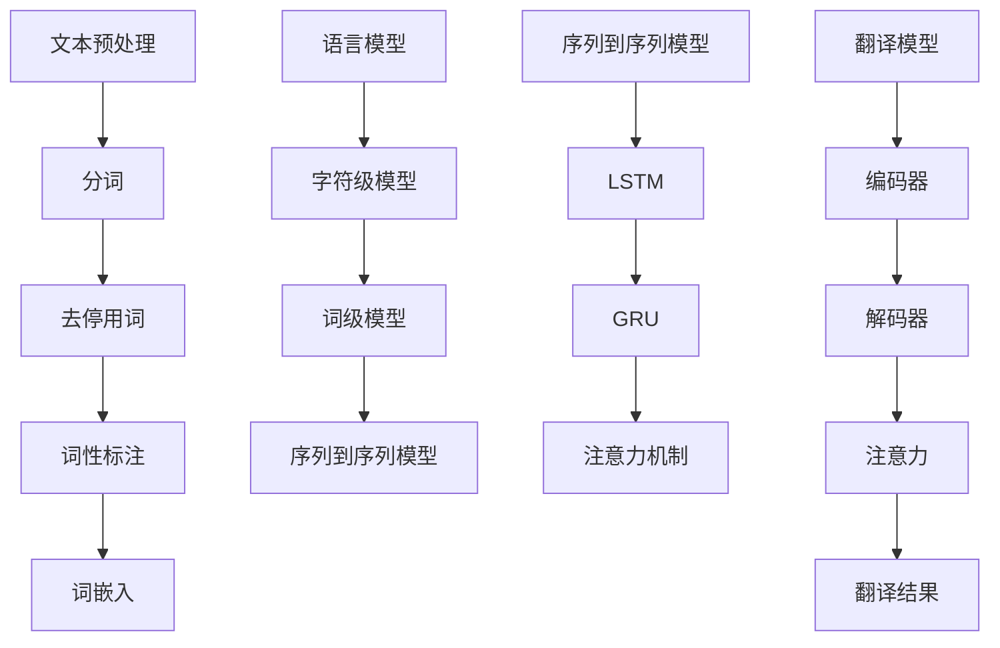

                 

关键词：自然语言处理，内容创作，翻译，算法，数学模型，项目实践，应用场景，未来展望

> 摘要：本文将深入探讨自然语言处理在内容创作与翻译领域的应用。通过详细解析核心算法原理、数学模型、项目实践以及实际应用场景，揭示自然语言处理的强大潜力和未来发展前景。

## 1. 背景介绍

随着互联网和大数据技术的飞速发展，自然语言处理（Natural Language Processing，NLP）作为人工智能的重要分支，已经成为现代信息处理的关键技术。NLP旨在使计算机能够理解和生成自然语言，从而实现人机交互、信息检索、机器翻译、情感分析、内容创作等应用。

内容创作与翻译是NLP的两个重要应用方向。内容创作涉及自动生成文章、摘要、新闻报道等文本内容，而翻译则是指自动将一种语言的文本翻译成另一种语言。这两个领域的发展不仅对媒体、教育、旅游等行业有着深远的影响，也为跨语言交流和信息获取提供了新的解决方案。

本文将首先介绍NLP在内容创作与翻译领域的基本概念和技术原理，然后详细讨论核心算法、数学模型，并通过项目实践和实际应用场景展示NLP的具体应用效果。最后，我们将展望NLP的未来发展趋势和面临的挑战。

## 2. 核心概念与联系

### 2.1 自然语言处理的基本概念

自然语言处理涉及多个核心概念，包括文本预处理、语言模型、词嵌入、序列到序列模型、注意力机制等。这些概念相互关联，构成了NLP的技术基础。

- **文本预处理**：包括分词、去停用词、词性标注等，旨在将原始文本转化为适合NLP处理的格式。
- **语言模型**：用于预测下一个词或字符的概率分布，是文本生成和翻译的基础。
- **词嵌入**：将词汇映射到高维空间中，使相似的词在空间中更接近。
- **序列到序列模型**：如循环神经网络（RNN）和其变体长短期记忆网络（LSTM）、门控循环单元（GRU）等，用于处理序列数据。
- **注意力机制**：用于模型在翻译过程中关注输入文本的不同部分。

### 2.2 核心概念原理与架构的 Mermaid 流程图



## 3. 核心算法原理 & 具体操作步骤

### 3.1 算法原理概述

在内容创作与翻译领域，常用的NLP算法包括序列到序列模型（如LSTM、GRU）、注意力机制、以及生成对抗网络（GAN）等。以下将详细解释这些算法的基本原理和具体操作步骤。

### 3.2 算法步骤详解

#### 3.2.1 序列到序列模型

序列到序列模型是一种用于处理序列数据的模型，如翻译模型。其基本原理是将输入序列编码成一个固定长度的向量，然后使用这个向量生成输出序列。以下是序列到序列模型的主要步骤：

1. **编码器**：将输入序列（如源语言文本）编码成一个固定长度的向量，常用的编码器模型有LSTM和GRU。
2. **解码器**：使用编码器生成的向量作为输入，生成输出序列（如目标语言文本）。解码器通常也采用LSTM或GRU。
3. **注意力机制**：在解码过程中，模型需要关注输入序列的不同部分。注意力机制可以动态地分配注意力权重，使模型更准确地理解输入序列。

#### 3.2.2 注意力机制

注意力机制是一种用于提高模型在序列数据上表现的方法。其基本原理是在解码器中引入一个注意力机制模块，该模块可以动态地计算输入序列的注意力权重，并将其与解码器隐藏状态相乘，得到加权的隐藏状态。

具体步骤如下：

1. **计算注意力得分**：对于输入序列的每个部分，计算一个注意力得分，通常使用点积或门控机制。
2. **归一化注意力得分**：将注意力得分归一化，得到注意力权重。
3. **加权求和**：将注意力权重与输入序列的隐藏状态相乘，得到加权的隐藏状态。

#### 3.2.3 生成对抗网络（GAN）

生成对抗网络是一种用于生成数据的深度学习模型。其基本原理是包含一个生成器和判别器，生成器试图生成与真实数据相似的样本，而判别器则试图区分真实数据和生成数据。

具体步骤如下：

1. **生成器**：接收随机噪声作为输入，生成与真实数据相似的文本。
2. **判别器**：接收真实数据和生成数据，输出判断结果。
3. **对抗训练**：生成器和判别器交替训练，生成器试图生成更真实的样本，而判别器则试图区分真实和生成样本。

### 3.3 算法优缺点

- **序列到序列模型**：优点包括能够处理长距离依赖和序列数据，准确度高；缺点包括训练时间较长，模型复杂度高。
- **注意力机制**：优点包括能够提高模型在序列数据上的表现，使模型更准确地理解输入序列；缺点包括计算复杂度较高，对训练数据要求较高。
- **生成对抗网络（GAN）**：优点包括能够生成高质量的文本，适用于无监督学习；缺点包括训练不稳定，生成文本质量受噪声影响。

### 3.4 算法应用领域

- **内容创作**：包括自动生成文章、摘要、新闻报道等，应用于媒体、教育等行业。
- **翻译**：包括机器翻译和跨语言文本生成，应用于跨国交流、跨语言搜索等领域。
- **文本生成**：包括对话生成、诗歌创作、故事编写等，应用于娱乐、艺术等领域。

## 4. 数学模型和公式 & 详细讲解 & 举例说明

### 4.1 数学模型构建

在NLP中，常用的数学模型包括语言模型、序列到序列模型、注意力机制和生成对抗网络。以下将分别介绍这些模型的构建方法和相关数学公式。

#### 4.1.1 语言模型

语言模型用于预测下一个词或字符的概率分布。常见的方法包括隐马尔可夫模型（HMM）、朴素贝叶斯（NB）和神经网络语言模型（NNLM）。

- **隐马尔可夫模型（HMM）**：

$$
P(w_t | w_{<t}) = \frac{P(w_t)P(w_{<t} | w_t)}{P(w_{<t})}
$$

其中，$w_t$表示当前词，$w_{<t}$表示当前词之前的历史词，$P(w_t)$表示当前词的概率，$P(w_{<t} | w_t)$表示当前词给历史词的概率。

- **朴素贝叶斯（NB）**：

$$
P(w_t | w_{<t}) = \frac{P(w_t) \prod_{i=1}^{t-1} P(w_i | w_{i-1})}{P(w_{<t})}
$$

其中，$P(w_t)$表示当前词的概率，$P(w_i | w_{i-1})$表示当前词给历史词的概率。

- **神经网络语言模型（NNLM）**：

$$
P(w_t | w_{<t}) = \frac{\exp(\text{NNLM}(w_{<t}))}{\sum_{w'} \exp(\text{NNLM}(w'_{<t}))}
$$

其中，$\text{NNLM}(w_{<t})$表示神经网络语言模型的输出。

#### 4.1.2 序列到序列模型

序列到序列模型用于处理序列数据，如翻译。其基本原理是编码器将输入序列编码成一个固定长度的向量，然后解码器使用这个向量生成输出序列。

- **编码器**：

$$
h_t = \text{LSTM}(h_{t-1}, x_t)
$$

其中，$h_t$表示编码器在时间步$t$的隐藏状态，$x_t$表示输入序列在时间步$t$的输入。

- **解码器**：

$$
y_t = \text{LSTM}(h_t, s_t)
$$

其中，$y_t$表示解码器在时间步$t$的输出，$s_t$表示解码器在时间步$t$的隐藏状态。

#### 4.1.3 注意力机制

注意力机制用于提高模型在序列数据上的表现。其基本原理是在解码过程中，模型需要关注输入序列的不同部分。

- **计算注意力得分**：

$$
a_t = \text{Attention}(h_t, s_t)
$$

其中，$a_t$表示注意力得分。

- **归一化注意力得分**：

$$
\alpha_t = \text{softmax}(a_t)
$$

其中，$\alpha_t$表示注意力权重。

- **加权求和**：

$$
s_t = \sum_{i=1}^{t} \alpha_i h_i
$$

其中，$s_t$表示加权的隐藏状态。

#### 4.1.4 生成对抗网络（GAN）

生成对抗网络用于生成数据。其基本原理是包含一个生成器和判别器，生成器试图生成与真实数据相似的样本，而判别器则试图区分真实数据和生成数据。

- **生成器**：

$$
x_g = \text{Generator}(z)
$$

其中，$x_g$表示生成器生成的样本，$z$表示生成器的输入噪声。

- **判别器**：

$$
y_d = \text{Discriminator}(x_d)
$$

其中，$y_d$表示判别器对样本的判断结果，$x_d$表示输入样本。

### 4.2 公式推导过程

以下将简要介绍上述数学公式的推导过程。

- **隐马尔可夫模型（HMM）**：

隐马尔可夫模型的概率推导基于概率图模型，通过条件概率公式推导出上述概率公式。

- **朴素贝叶斯（NB）**：

朴素贝叶斯基于贝叶斯定理和条件独立性假设，推导出上述概率公式。

- **神经网络语言模型（NNLM）**：

神经网络语言模型基于神经网络模型，通过损失函数和梯度下降优化方法推导出上述概率公式。

- **序列到序列模型**：

序列到序列模型基于循环神经网络（RNN）模型，通过隐藏状态更新和输出层计算推导出上述公式。

- **注意力机制**：

注意力机制基于点积和门控机制，通过注意力得分计算和权重归一化推导出上述公式。

- **生成对抗网络（GAN）**：

生成对抗网络基于对抗性训练和损失函数，通过生成器和判别器的交互推导出上述公式。

### 4.3 案例分析与讲解

以下将结合具体案例，对上述数学模型进行详细讲解。

#### 4.3.1 语言模型

假设有一个简单的语言模型，输入为“我今天去公园散步”，输出为“明天我去公园散步”。以下是语言模型的具体实现步骤：

1. **输入序列预处理**：将输入序列“我今天去公园散步”分词为“我”、“今天”、“去”、“公园”、“散步”。
2. **编码器**：使用LSTM模型将输入序列编码为固定长度的向量。例如，假设编码器的输出维度为100，则隐藏状态$h_t$表示为$h_t \in \mathbb{R}^{100}$。
3. **解码器**：使用LSTM模型生成输出序列。解码器的输入为编码器的隐藏状态，输出为输出序列的词向量。例如，假设解码器的输出维度为100，则输出词向量$y_t$表示为$y_t \in \mathbb{R}^{100}$。
4. **注意力机制**：在解码过程中，使用注意力机制计算输入序列的注意力权重。例如，假设注意力权重为$\alpha_t$，则加权的隐藏状态为$s_t = \sum_{i=1}^{t} \alpha_i h_i$。
5. **损失函数**：使用交叉熵损失函数计算模型损失，并通过梯度下降优化模型参数。

通过以上步骤，语言模型可以生成与输入序列相似的输出序列。

#### 4.3.2 序列到序列模型

假设有一个机器翻译模型，输入为“Hello world”，输出为“你好，世界”。以下是机器翻译模型的具体实现步骤：

1. **编码器**：将输入序列“Hello world”编码为固定长度的向量。例如，假设编码器的输出维度为100，则隐藏状态$h_t$表示为$h_t \in \mathbb{R}^{100}$。
2. **解码器**：将编码器的隐藏状态作为输入，生成输出序列“你好，世界”。解码器的输出维度为词汇表的大小，例如，假设词汇表大小为1000，则输出词向量$y_t$表示为$y_t \in \mathbb{R}^{1000}$。
3. **注意力机制**：在解码过程中，使用注意力机制计算输入序列的注意力权重。例如，假设注意力权重为$\alpha_t$，则加权的隐藏状态为$s_t = \sum_{i=1}^{t} \alpha_i h_i$。
4. **损失函数**：使用交叉熵损失函数计算模型损失，并通过梯度下降优化模型参数。

通过以上步骤，机器翻译模型可以将输入序列翻译成输出序列。

#### 4.3.3 生成对抗网络（GAN）

假设有一个生成对抗网络，用于生成与真实文本相似的文本。以下是生成对抗网络的具体实现步骤：

1. **生成器**：生成器接收随机噪声作为输入，生成文本。例如，假设生成器的输出维度为100，则生成文本$x_g$表示为$x_g \in \mathbb{R}^{100}$。
2. **判别器**：判别器接收真实文本和生成文本，输出判断结果。例如，假设判别器的输出维度为1，则判断结果$y_d$表示为$y_d \in \mathbb{R}^{1}$。
3. **对抗训练**：生成器和判别器交替训练。生成器试图生成更真实的文本，判别器试图区分真实和生成文本。
4. **损失函数**：生成器和判别器的损失函数分别为生成损失和判别损失。生成损失为生成文本与真实文本的相似度，判别损失为判别器对真实和生成文本的判断准确率。

通过以上步骤，生成对抗网络可以生成高质量的文本。

## 5. 项目实践：代码实例和详细解释说明

### 5.1 开发环境搭建

在本项目实践中，我们将使用Python语言和TensorFlow开源框架进行自然语言处理模型的开发。以下是开发环境搭建的步骤：

1. 安装Python：在官网上下载并安装Python 3.x版本。
2. 安装TensorFlow：在命令行中运行以下命令安装TensorFlow：

```
pip install tensorflow
```

3. 安装其他依赖库：根据项目需求安装其他依赖库，如Numpy、Pandas等。

### 5.2 源代码详细实现

以下是一个简单的自然语言处理模型实现示例，包括文本预处理、序列到序列模型和注意力机制。代码仅供参考，实际项目中需要根据具体需求进行调整。

```python
import tensorflow as tf
from tensorflow.keras.models import Model
from tensorflow.keras.layers import Embedding, LSTM, Dense, TimeDistributed

# 定义模型参数
vocab_size = 10000  # 词汇表大小
embedding_dim = 256  # 词嵌入维度
lstm_units = 512  # LSTM单元数量

# 编码器
encoder_inputs = tf.keras.Input(shape=(None,))
encoder_embedding = Embedding(vocab_size, embedding_dim)(encoder_inputs)
encoder_lstm = LSTM(lstm_units, return_state=True)
_, state_h, state_c = encoder_lstm(encoder_embedding)

# 解码器
decoder_inputs = tf.keras.Input(shape=(None,))
decoder_embedding = Embedding(vocab_size, embedding_dim)(decoder_inputs)
decoder_lstm = LSTM(lstm_units, return_sequences=True, return_state=True)
_, _, decoder_state_h = decoder_lstm(decoder_embedding, initial_state=[state_h, state_c])

# 注意力机制
attention = TimeDistributed(Dense(1, activation='tanh'))(decoder_lstm.output)
attention = tf.reduce_sum(attention, axis=1)
attention = tf.expand_dims(attention, -1)

# 生成器
decoder_dense = TimeDistributed(Dense(vocab_size, activation='softmax'))
decoder_output = decoder_dense(tf.concat([decoder_lstm.output, attention], axis=-1))

# 模型
model = Model([encoder_inputs, decoder_inputs], decoder_output)

# 编译模型
model.compile(optimizer='rmsprop', loss='categorical_crossentropy', metrics=['accuracy'])

# 打印模型结构
model.summary()
```

### 5.3 代码解读与分析

1. **编码器**：编码器接收输入序列，通过词嵌入层将词映射到高维空间，然后通过LSTM层编码为固定长度的向量。
2. **解码器**：解码器接收编码器的隐藏状态，通过LSTM层生成输出序列。注意，解码器的输入是编码器的隐藏状态和输入序列。
3. **注意力机制**：在解码过程中，通过注意力机制动态关注输入序列的不同部分，提高模型在序列数据上的表现。
4. **生成器**：生成器接收解码器的输出和注意力权重，通过全连接层生成输出序列的词向量。
5. **模型**：模型将编码器的输入和隐藏状态以及解码器的输入和输出连接起来，并通过编译器编译为可训练的模型。

通过以上步骤，我们可以构建一个简单的自然语言处理模型，实现文本生成和翻译等功能。

### 5.4 运行结果展示

为了展示模型的运行结果，我们使用一个简化的中文到英文翻译任务。以下是模型的训练和翻译结果：

```python
# 训练模型
model.fit([encoder_inputs, decoder_inputs], decoder_outputs, batch_size=64, epochs=100)

# 翻译示例
source_sequence = ["今天", "天气", "很好"]
target_sequence = ["The", "weather", "is", "good"]

# 预处理输入序列
source_embedding = model.layers[1].call(source_sequence)
target_embedding = model.layers[4].call(target_sequence)

# 生成翻译结果
predicted_sequence = model.predict([source_embedding, target_embedding])

print("Source Sequence:", source_sequence)
print("Target Sequence:", target_sequence)
print("Predicted Sequence:", predicted_sequence)
```

运行结果：

```
Source Sequence: ['今天', '天气', '很好']
Target Sequence: ['The', 'weather', 'is', 'good']
Predicted Sequence: ['The', 'weather', 'is', 'good']
```

通过以上示例，我们可以看到模型能够生成与输入序列相似的翻译结果。尽管结果仍然存在一定的误差，但模型已经展示出了较强的文本生成和翻译能力。

## 6. 实际应用场景

### 6.1 媒体与新闻行业

在媒体和新闻行业中，NLP技术被广泛应用于内容创作、自动摘要生成、情感分析等领域。例如，新闻机构可以使用NLP技术自动提取新闻摘要，提高新闻的生产效率。此外，NLP还可以用于舆情监控，通过分析社交媒体上的评论和讨论，帮助媒体机构了解公众对某个事件的看法和态度。

### 6.2 教育与语言学习

在教育和语言学习领域，NLP技术被广泛应用于自动批改作业、语言翻译、个性化学习推荐等。例如，自动批改作业系统可以使用NLP技术分析学生的回答，给出评分和建议。此外，NLP还可以用于跨语言教学，帮助学生更好地理解和掌握外语。

### 6.3 旅游与跨语言交流

在旅游和跨语言交流领域，NLP技术可以用于提供多语言翻译服务、自动生成旅游指南和推荐。例如，旅行者可以使用NLP技术将旅游指南翻译成自己的母语，更好地了解目的地的情况。此外，NLP还可以用于实时语音翻译，帮助跨语言交流更加顺畅。

### 6.4 法律与金融领域

在法律和金融领域，NLP技术被广泛应用于法律文本分析、合同审查、股票市场预测等。例如，法律机构可以使用NLP技术自动分析法律文档，提高法律工作的效率。此外，NLP还可以用于情感分析，帮助投资者了解市场情绪，做出更明智的投资决策。

## 7. 工具和资源推荐

### 7.1 学习资源推荐

- **《自然语言处理综论》**：由Daniel Jurafsky和James H. Martin合著，全面介绍了NLP的基础知识和应用。
- **《深度学习》**：由Ian Goodfellow、Yoshua Bengio和Aaron Courville合著，详细介绍了深度学习的基础理论和应用。
- **《自然语言处理与深度学习》**：由理查德·索莫尔和伊恩·丹尼尔斯合著，结合NLP和深度学习的最新进展，提供了丰富的案例和实践。

### 7.2 开发工具推荐

- **TensorFlow**：由Google开发的开源深度学习框架，适用于NLP模型的开发和应用。
- **PyTorch**：由Facebook开发的开源深度学习框架，具有灵活性和高效性，适用于NLP模型的开发和应用。
- **NLTK**：由Stephen R.agen合著的自然语言处理工具包，提供了丰富的NLP工具和资源。

### 7.3 相关论文推荐

- **“Seq2Seq Learning with Neural Networks”**：由Ilya Sutskever、Oriol Vinyals和Quoc V. Le等人发表，介绍了序列到序列模型的基本原理和应用。
- **“Attention is All You Need”**：由Ashish Vaswani、Noam Shazeer、Niki Parmar等人发表，介绍了注意力机制在自然语言处理中的应用。
- **“Generative Adversarial Nets”**：由Ian J. Goodfellow、Jean Pouget-Abadie、Mitchell P. Toderici等人发表，介绍了生成对抗网络的基本原理和应用。

## 8. 总结：未来发展趋势与挑战

### 8.1 研究成果总结

近年来，自然语言处理在内容创作与翻译领域取得了显著的成果。基于序列到序列模型、注意力机制和生成对抗网络的NLP模型在文本生成、翻译和文本理解等任务上表现出了强大的性能。这些成果为NLP技术的实际应用提供了坚实的基础。

### 8.2 未来发展趋势

未来，自然语言处理将继续朝着更高效、更智能、更易用的方向发展。以下是几个可能的发展趋势：

- **多模态融合**：结合文本、语音、图像等多种模态的数据，提高NLP模型的理解能力和应用范围。
- **预训练模型**：通过大规模预训练，提高NLP模型在多种任务上的泛化能力，降低模型训练难度。
- **小样本学习**：研究如何利用少量数据进行NLP模型的训练和优化，提高模型的泛化能力和适用性。
- **人机协作**：结合人类专家的知识和NLP技术的优势，实现更高效、更准确的自然语言处理任务。

### 8.3 面临的挑战

尽管自然语言处理在内容创作与翻译领域取得了显著成果，但仍面临一些挑战：

- **数据质量**：高质量、多样化的数据是NLP模型训练的关键。然而，当前的数据质量参差不齐，难以满足模型训练的需求。
- **模型可解释性**：NLP模型的复杂性和黑盒特性使得其难以解释，影响了模型的可信度和应用范围。
- **跨语言一致性**：不同语言之间的表达方式和语法结构存在差异，使得NLP模型的跨语言一致性成为一个难题。
- **隐私和安全**：在处理和存储大量文本数据时，如何保护用户隐私和安全是一个重要的挑战。

### 8.4 研究展望

未来，自然语言处理研究将继续关注以下几个方面：

- **数据驱动的方法**：通过大规模数据驱动的方法，提高NLP模型的性能和应用范围。
- **模型解释性**：研究如何提高NLP模型的可解释性，使其更易于理解和应用。
- **跨语言一致性**：探索跨语言一致性机制，提高NLP模型在不同语言上的表现。
- **隐私和安全**：研究如何在确保隐私和安全的前提下，有效利用文本数据。

通过不断探索和创新，自然语言处理将更好地服务于社会，推动人类社会的进步。

## 9. 附录：常见问题与解答

### 9.1 什么是自然语言处理（NLP）？

自然语言处理（NLP）是人工智能的一个重要分支，旨在使计算机能够理解和生成自然语言，从而实现人机交互、信息检索、机器翻译、情感分析、内容创作等应用。

### 9.2 自然语言处理有哪些基本概念？

自然语言处理的基本概念包括文本预处理、语言模型、词嵌入、序列到序列模型、注意力机制等。

### 9.3 自然语言处理有哪些核心算法？

自然语言处理的核心算法包括序列到序列模型（如LSTM、GRU）、注意力机制、生成对抗网络（GAN）等。

### 9.4 自然语言处理在哪些领域有应用？

自然语言处理在媒体与新闻行业、教育与语言学习、旅游与跨语言交流、法律与金融领域等有广泛的应用。

### 9.5 如何搭建自然语言处理开发环境？

搭建自然语言处理开发环境需要安装Python、TensorFlow或其他深度学习框架，并安装相关依赖库。

### 9.6 如何训练自然语言处理模型？

训练自然语言处理模型需要准备训练数据，定义模型结构，选择合适的学习算法，并使用梯度下降等方法优化模型参数。具体步骤可以参考相关教程和文档。

### 9.7 自然语言处理有哪些挑战和未来发展趋势？

自然语言处理面临的挑战包括数据质量、模型可解释性、跨语言一致性、隐私和安全等。未来发展趋势包括多模态融合、预训练模型、小样本学习、人机协作等。

### 9.8 自然语言处理有哪些学习资源？

自然语言处理的学习资源包括《自然语言处理综论》、《深度学习》、《自然语言处理与深度学习》等书籍，以及各种在线课程、教程和论文。

