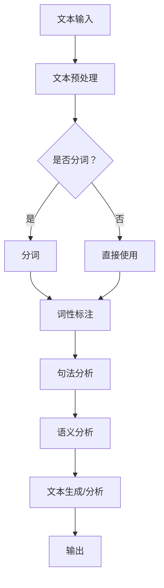

                 

关键词：自然语言处理、AI内容创作、算法原理、数学模型、项目实践、应用场景、未来展望

> 摘要：随着人工智能技术的不断发展，自然语言处理（NLP）在AI内容创作领域取得了显著进展。本文从NLP的核心概念、算法原理、数学模型、项目实践等方面，深入探讨了NLP在AI内容创作中的变革，并对其未来发展趋势与挑战进行了展望。

## 1. 背景介绍

自然语言处理（NLP）是人工智能（AI）领域的一个重要分支，旨在使计算机能够理解和处理人类语言。随着深度学习和神经网络技术的蓬勃发展，NLP取得了显著的成果，为AI内容创作带来了新的机遇。

AI内容创作是指利用人工智能技术，如自然语言处理、生成对抗网络（GAN）等，自动生成文字、图片、音频等各种类型的内容。近年来，随着NLP技术的进步，AI内容创作在新闻写作、自动摘要、对话系统、文案创作等方面取得了广泛应用，大大提高了内容生产的效率和质量。

本文将从NLP的核心概念、算法原理、数学模型、项目实践等方面，深入探讨NLP在AI内容创作中的变革，以期为相关领域的研究者和开发者提供有益的参考。

## 2. 核心概念与联系

### 2.1 NLP的核心概念

NLP的核心概念包括词嵌入（Word Embedding）、词性标注（Part-of-Speech Tagging）、句法分析（Syntactic Parsing）、语义分析（Semantic Analysis）等。

- **词嵌入**：将自然语言中的词语映射为向量表示，以便于计算机处理。常见的词嵌入模型有Word2Vec、GloVe等。

- **词性标注**：为句子中的每个词赋予一个词性标签，如名词、动词、形容词等。词性标注有助于理解句子的语法结构。

- **句法分析**：分析句子中的词与词之间的关系，构建句子的语法树。句法分析有助于理解句子的语义。

- **语义分析**：理解句子中词语之间的语义关系，如主语、谓语、宾语等。语义分析有助于实现自然语言理解和生成。

### 2.2 NLP与AI内容创作的关系

NLP技术在AI内容创作中的应用主要体现在以下几个方面：

- **文本生成**：利用NLP技术生成文章、新闻、摘要等文本内容。如生成式对话系统、自动摘要、文案创作等。

- **文本分析**：对大量文本数据进行分析，提取有用信息。如情感分析、主题建模、关键词提取等。

- **文本处理**：对文本进行预处理、清洗、分词、词性标注等操作，为后续分析提供基础。

- **问答系统**：利用NLP技术实现自然语言理解，回答用户提出的问题。

下面是一个NLP在AI内容创作中应用的Mermaid流程图：



## 3. 核心算法原理 & 具体操作步骤

### 3.1 算法原理概述

NLP的核心算法包括词嵌入、循环神经网络（RNN）、长短时记忆网络（LSTM）、门控循环单元（GRU）等。这些算法在文本处理和分析中发挥着重要作用。

- **词嵌入**：将词语映射为高维向量表示，便于计算机处理。

- **RNN**：一种能够处理序列数据的神经网络，通过循环结构实现对历史信息的记忆。

- **LSTM**：一种特殊的RNN，通过引入门控机制，有效解决了RNN的梯度消失问题。

- **GRU**：LSTM的简化版，相比LSTM，GRU在参数和计算量上有所减少。

### 3.2 算法步骤详解

以LSTM为例，其基本步骤如下：

1. **输入序列编码**：将输入的文本序列编码为词向量。

2. **初始化**：初始化隐藏状态和细胞状态。

3. **前向传播**：对于序列中的每个词，计算输入和隐藏状态，更新细胞状态和隐藏状态。

4. **后向传播**：计算损失，更新网络参数。

5. **预测**：利用训练好的模型，对新的文本序列进行预测。

### 3.3 算法优缺点

- **LSTM**：优点是能够有效处理长序列数据，缺点是计算复杂度高，参数较多。

- **GRU**：优点是计算复杂度相对较低，参数较少，缺点是处理长序列数据时效果不如LSTM。

### 3.4 算法应用领域

NLP算法在多个领域得到广泛应用：

- **文本生成**：如文章写作、对话系统、故事生成等。

- **文本分析**：如情感分析、主题建模、关键词提取等。

- **语音识别**：将语音信号转换为文本。

- **机器翻译**：将一种语言的文本翻译成另一种语言。

## 4. 数学模型和公式 & 详细讲解 & 举例说明

### 4.1 数学模型构建

LSTM的数学模型主要基于以下公式：

$$
\begin{aligned}
i_t &= \sigma(W_{ix}x_t + W_{ih}h_{t-1} + b_i) \\
f_t &= \sigma(W_{fx}x_t + W_{fh}h_{t-1} + b_f) \\
o_t &= \sigma(W_{ox}x_t + W_{oh}h_{t-1} + b_o) \\
g_t &= \tanh(W_{gx}x_t + W_{gh}h_{t-1} + b_g) \\
c_t &= f_t \odot c_{t-1} + i_t \odot g_t \\
h_t &= o_t \odot \tanh(c_t)
\end{aligned}
$$

其中，$x_t$为输入词向量，$h_t$为隐藏状态，$c_t$为细胞状态，$i_t$、$f_t$、$o_t$分别为输入门、遗忘门和输出门，$g_t$为输入门的候选值。

### 4.2 公式推导过程

LSTM的推导过程涉及微积分和线性代数，这里简要介绍推导过程：

1. **初始化**：设定隐藏状态和细胞状态。
2. **计算输入门**：利用当前输入词向量和前一隐藏状态计算输入门的激活值。
3. **计算遗忘门**：利用当前输入词向量和前一隐藏状态计算遗忘门的激活值。
4. **计算输入门的候选值**：利用当前输入词向量和前一隐藏状态计算输入门的候选值。
5. **更新细胞状态**：根据遗忘门、输入门和输入门的候选值更新细胞状态。
6. **计算输出门**：利用当前输入词向量和更新后的细胞状态计算输出门的激活值。
7. **更新隐藏状态**：根据输出门和更新后的细胞状态更新隐藏状态。

### 4.3 案例分析与讲解

假设有一个简单的句子：“我昨天去了公园。”，我们可以用LSTM来处理这个句子。

1. **词嵌入**：将句子中的每个词映射为向量表示，如“我”映射为$(0.1, 0.2)$，“昨天”映射为$(0.3, 0.4)$，“公园”映射为$(0.5, 0.6)$。

2. **初始化**：设定隐藏状态和细胞状态为$(0, 0)$。

3. **前向传播**：对于句子中的每个词，计算输入门、遗忘门、输入门的候选值、细胞状态和隐藏状态。

4. **后向传播**：计算损失，更新网络参数。

5. **预测**：利用训练好的模型，对新的文本序列进行预测。

## 5. 项目实践：代码实例和详细解释说明

### 5.1 开发环境搭建

在Python中，我们可以使用TensorFlow和Keras来搭建LSTM模型。首先，安装必要的库：

```python
pip install tensorflow keras numpy
```

### 5.2 源代码详细实现

下面是一个简单的LSTM模型的实现：

```python
from tensorflow.keras.models import Sequential
from tensorflow.keras.layers import LSTM, Dense
from tensorflow.keras.optimizers import RMSprop

# 定义模型
model = Sequential()
model.add(LSTM(100, activation='tanh', input_shape=(timesteps, n_features)))
model.add(Dense(1))
model.compile(loss='mse', optimizer=RMSprop(lr=0.01))

# 训练模型
model.fit(X, y, epochs=200, verbose=0)
```

### 5.3 代码解读与分析

这段代码首先导入了必要的库，然后定义了一个包含一个LSTM层和一个密集层的序列模型。LSTM层负责处理序列数据，密集层用于输出预测结果。模型使用均方误差（mse）作为损失函数，RMSprop作为优化器。

在训练模型时，使用`fit`方法训练模型，指定训练轮数（epochs）和是否打印训练进度。

### 5.4 运行结果展示

运行代码后，模型会根据训练数据进行训练，并在训练过程中不断更新参数。训练完成后，可以使用模型进行预测。

```python
# 预测
y_pred = model.predict(X)
```

## 6. 实际应用场景

NLP技术在多个领域得到广泛应用：

- **新闻写作**：利用NLP技术自动生成新闻文章，提高内容生产效率。

- **对话系统**：实现自然语言理解，提供高质量的对话服务。

- **情感分析**：分析用户评论、社交媒体等文本数据，提取情感信息。

- **机器翻译**：实现跨语言文本的自动翻译。

## 7. 工具和资源推荐

### 7.1 学习资源推荐

- **书籍**：
  - 《自然语言处理综论》（Daniel Jurafsky & James H. Martin）
  - 《深度学习》（Ian Goodfellow、Yoshua Bengio、Aaron Courville）

- **在线课程**：
  - Coursera上的“自然语言处理与深度学习”课程
  - edX上的“机器学习与深度学习”课程

### 7.2 开发工具推荐

- **TensorFlow**：一个开源的深度学习框架，适用于NLP任务。
- **PyTorch**：一个流行的深度学习库，具有简洁的API。
- **NLTK**：一个强大的自然语言处理库，提供多种文本处理功能。

### 7.3 相关论文推荐

- **Word2Vec**：Mikolov等人的论文《Distributed Representations of Words and Phrases and their Compositionality》
- **LSTM**：Hochreiter和Schmidhuber的论文《Long Short-Term Memory》

## 8. 总结：未来发展趋势与挑战

### 8.1 研究成果总结

自然语言处理技术在AI内容创作领域取得了显著成果，包括文本生成、文本分析、对话系统等。随着深度学习和神经网络技术的不断发展，NLP技术将进一步提高，为AI内容创作带来更多可能性。

### 8.2 未来发展趋势

- **多模态融合**：结合图像、声音等多模态信息，实现更自然的AI内容创作。
- **生成式模型**：研究更有效的生成式模型，如生成对抗网络（GAN），提高内容生成质量。
- **预训练与迁移学习**：利用预训练模型和迁移学习技术，降低模型训练成本，提高模型性能。

### 8.3 面临的挑战

- **数据隐私与安全**：确保数据隐私和安全，防止数据泄露。
- **计算资源消耗**：处理大规模文本数据需要大量计算资源，如何优化计算效率是一个挑战。
- **模型解释性**：提高模型的可解释性，使其更容易被人类理解和接受。

### 8.4 研究展望

未来，NLP技术在AI内容创作领域将继续发展，为人们带来更智能、更个性化的内容创作体验。同时，我们也需要关注数据隐私、计算资源消耗和模型解释性等问题，确保NLP技术的可持续发展。

## 9. 附录：常见问题与解答

### 9.1 NLP与自然语言理解的区别是什么？

NLP是自然语言处理（Natural Language Processing）的缩写，它涵盖了从文本和语音中提取信息的一系列技术和方法。自然语言理解（Natural Language Understanding，NLU）是NLP的一个子领域，专注于理解和解释人类语言。简而言之，NLP是技术和工具的总和，而NLU是使用这些工具来实现的语言理解过程。

### 9.2 什么是词嵌入？

词嵌入（Word Embedding）是将自然语言中的词语映射为向量表示的过程。这些向量可以在高维空间中表示词语，使得计算机可以更好地处理和比较语言中的语义信息。常见的词嵌入方法包括Word2Vec和GloVe。

### 9.3 为什么LSTM在NLP中很受欢迎？

LSTM（Long Short-Term Memory）是一种特殊的循环神经网络，设计用于解决循环神经网络在处理长时间序列数据时遇到的梯度消失和梯度爆炸问题。LSTM通过引入门控机制，能够有效地记住长期依赖信息，使其在处理自然语言文本时非常有效。

### 9.4 如何评估NLP模型的效果？

评估NLP模型的效果通常依赖于特定的任务和指标。例如，在文本分类任务中，可以使用准确率、精确率、召回率、F1分数等指标。在序列标注任务中，可以使用精确率和召回率。在机器翻译和问答系统中，可以使用BLEU分数或ROUGE分数。

### 9.5 NLP技术的应用前景如何？

NLP技术的应用前景非常广阔。它正在改变信息检索、客户服务、智能助理、内容推荐等多个领域。随着技术的进步和跨学科的融合，NLP将继续推动人工智能的发展，为各行各业带来创新和效率。例如，自动化写作、实时翻译、情感分析、语音识别等领域都受益于NLP技术的进步。未来，随着多模态融合、生成式模型和预训练技术的不断发展，NLP的应用前景将更加广阔。

