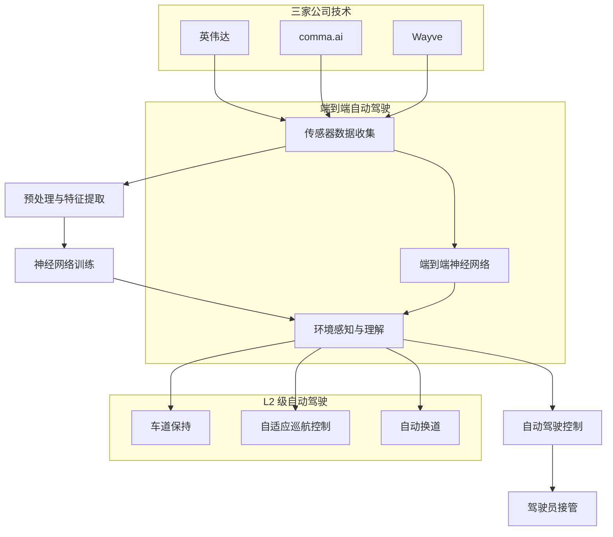

                 

### 摘要 Summary

本文将深入探讨英伟达、comma.ai 和 Wayve 三家公司在其端到端 L2 级自动驾驶 Demo 中的技术创新和实践。文章首先介绍了背景和行业现状，然后详细解析了端到端自动驾驶的核心概念和联系，接着探讨了核心算法原理、数学模型、项目实践，并分析了实际应用场景、未来展望、工具和资源，最后总结了研究成果和面临挑战。

### 目录 Table of Contents

1. **背景介绍** <a href="#background"></a>
2. **核心概念与联系** <a href="#concepts"></a>
   2.1 **端到端自动驾驶** <a href="#end-to-end"></a>
   2.2 **L2 级自动驾驶** <a href="#l2-level"></a>
3. **核心算法原理 & 具体操作步骤** <a href="#algorithm"></a>
   3.1 **算法原理概述** <a href="#algorithm-principles"></a>
   3.2 **算法步骤详解** <a href="#algorithm-steps"></a>
   3.3 **算法优缺点** <a href="#pros-cons"></a>
   3.4 **算法应用领域** <a href="#application"></a>
4. **数学模型和公式 & 详细讲解 & 举例说明** <a href="#math-model"></a>
   4.1 **数学模型构建** <a href="#math-model-construction"></a>
   4.2 **公式推导过程** <a href="#math-formula"></a>
   4.3 **案例分析与讲解** <a href="#case-analysis"></a>
5. **项目实践：代码实例和详细解释说明** <a href="#project-practice"></a>
   5.1 **开发环境搭建** <a href="#environment-setup"></a>
   5.2 **源代码详细实现** <a href="#code-implementation"></a>
   5.3 **代码解读与分析** <a href="#code-analysis"></a>
   5.4 **运行结果展示** <a href="#results"></a>
6. **实际应用场景** <a href="#application-scenarios"></a>
   6.1 **自动驾驶在交通管理中的应用** <a href="#traffic-management"></a>
   6.2 **自动驾驶在物流运输中的应用** <a href="#logistics"></a>
   6.3 **自动驾驶在公共交通中的应用** <a href="#public-transport"></a>
7. **未来应用展望** <a href="#future展望"></a>
8. **工具和资源推荐** <a href="#tools-resources"></a>
   8.1 **学习资源推荐** <a href="#learning-resources"></a>
   8.2 **开发工具推荐** <a href="#development-tools"></a>
   8.3 **相关论文推荐** <a href="#related-papers"></a>
9. **总结：未来发展趋势与挑战** <a href="#summary"></a>
   9.1 **研究成果总结** <a href="#research-achievements"></a>
   9.2 **未来发展趋势** <a href="#development-trends"></a>
   9.3 **面临的挑战** <a href="#challenges"></a>
   9.4 **研究展望** <a href="#research-lookforward"></a>
10. **附录：常见问题与解答** <a href="#appendix"></a>

---

## 1. 背景介绍

自动驾驶技术作为人工智能的重要应用领域之一，近年来受到了全球范围内的高度关注。自动驾驶技术可以分为多个级别，从 L0 级（无自动化）到 L5 级（完全自动化），其中 L2 级自动驾驶是最为常见和应用广泛的。L2 级自动驾驶主要实现的是部分自动化，即驾驶员仍然需要关注道路情况并随时准备接管控制，而车辆在特定情况下可以自动进行加速、制动和转向。

在自动驾驶技术的研发过程中，英伟达（NVIDIA）、comma.ai 和 Wayve 是全球知名的科技公司，它们分别通过不同的技术路线和方案，致力于推动端到端 L2 级自动驾驶的发展。

英伟达作为全球领先的 GPU 制造商，其在自动驾驶领域有着深厚的技术积累。英伟达的端到端自动驾驶方案主要基于其强大的 GPU 加速能力和深度学习算法，通过将车辆周围的传感器数据输入到神经网络中，实现对环境的感知和理解，进而实现自动驾驶。

comma.ai 则是一家专注于将高级自动驾驶技术带入量产车型的小型公司。comma.ai 的方案是通过将高性能计算机硬件集成到现有车辆中，结合深度学习和强化学习算法，实现对车辆自动驾驶的控制。

Wayve 是一家英国初创公司，其独特的端到端自动驾驶技术采用了无监督学习的方法，直接从真实驾驶数据中学习驾驶技能，避免了传统的数据标注和仿真测试环节，大幅提高了自动驾驶的开发效率。

本文将深入探讨这三家公司的端到端 L2 级自动驾驶 Demo，分析其在技术创新、算法原理、数学模型和实际应用等方面的成果，并展望未来自动驾驶技术的发展趋势和面临的挑战。

---

### 2. 核心概念与联系

在深入探讨英伟达、comma.ai 和 Wayve 的端到端 L2 级自动驾驶 Demo 之前，我们需要首先明确一些核心概念和它们之间的联系。

#### 2.1 端到端自动驾驶

端到端（End-to-End）自动驾驶是指直接从原始传感器数据（如摄像头、雷达、激光雷达等）到最终的自动驾驶决策（如加速、减速、转向等），通过一个完整的神经网络模型来实现。与传统的自动驾驶方法不同，端到端自动驾驶不再需要通过多层次的预处理、特征提取、决策层等复杂的过程，而是通过训练一个大型神经网络，直接学习输入和输出之间的关系。这种方法简化了系统的复杂性，提高了自动驾驶的效率和准确度。

端到端自动驾驶的核心挑战包括：

- **数据标注问题**：由于自动驾驶系统需要大量的真实驾驶数据，这些数据需要进行精确的标注，以便训练神经网络。然而，数据标注是一个复杂且耗时的过程，特别是在涉及到复杂的交通场景和动态环境时。
- **计算资源消耗**：端到端自动驾驶需要大量的计算资源，尤其是在训练阶段。深度学习模型的训练通常需要高性能的 GPU 或 TPU，这增加了系统的成本和复杂性。
- **模型的可解释性**：由于端到端自动驾驶模型通常非常复杂，其内部决策过程难以解释，这在一定程度上限制了其在实际应用中的接受度。

#### 2.2 L2 级自动驾驶

L2 级自动驾驶，也被称为部分自动驾驶或辅助驾驶，是目前最为广泛应用的一种自动驾驶级别。L2 级自动驾驶系统能够在一定程度上实现车辆的自动化控制，但仍然需要驾驶员保持警惕并随时准备接管控制。具体来说，L2 级自动驾驶系统通常具备以下功能：

- **车道保持**：车辆能够在车道内自动保持行驶轨迹。
- **自适应巡航控制**：车辆能够在一定速度范围内自动调整车速，以适应前车的速度。
- **自动换道**：车辆能够在驾驶员指示后自动完成换道操作。

L2 级自动驾驶的核心优势在于其实现的技术相对成熟，成本较低，且能够在一定程度上提高驾驶安全性和舒适性。然而，L2 级自动驾驶也存在一些局限性，如对复杂交通场景的应对能力有限，需要驾驶员的持续关注和介入。

#### 2.3 三家公司核心概念的联系

英伟达、comma.ai 和 Wayve 在端到端 L2 级自动驾驶中的技术创新和实践，共同体现了端到端自动驾驶和 L2 级自动驾驶的结合与发展。

- **英伟达**：英伟达的端到端自动驾驶方案依赖于其强大的 GPU 加速能力和深度学习算法。通过将车辆周围的传感器数据输入到神经网络中，英伟达能够实现对环境的感知和理解，从而实现自动驾驶。英伟达的技术优势在于其高性能的计算平台和大规模数据处理能力，这使得其端到端自动驾驶方案在复杂交通场景中表现出色。

- **comma.ai**：comma.ai 的方案是将高性能计算机硬件集成到现有车辆中，通过深度学习和强化学习算法实现对车辆自动驾驶的控制。comma.ai 的技术创新在于其能够将复杂的自动驾驶系统集成到现有的车辆中，从而实现快速部署和大规模应用。

- **Wayve**：Wayve 的端到端自动驾驶技术采用了无监督学习的方法，直接从真实驾驶数据中学习驾驶技能，避免了传统的数据标注和仿真测试环节。Wayve 的技术优势在于其能够通过无监督学习快速训练出高效的自动驾驶模型，这在一定程度上解决了数据标注问题。

总之，英伟达、comma.ai 和 Wayve 在端到端 L2 级自动驾驶中的技术创新，不仅推动了自动驾驶技术的发展，也为自动驾驶的实际应用提供了新的思路和解决方案。

#### 2.4 Mermaid 流程图

为了更好地理解端到端 L2 级自动驾驶的核心概念和联系，我们可以使用 Mermaid 流程图来展示相关流程。



在这个流程图中，我们首先展示了传感器数据收集、预处理与特征提取、神经网络训练、环境感知与理解、自动驾驶控制和驾驶员接管等流程。接着，我们分别展示了端到端自动驾驶和 L2 级自动驾驶的核心流程。最后，我们展示了英伟达、comma.ai 和 Wayve 在端到端 L2 级自动驾驶中的技术联系。

---

### 3. 核心算法原理 & 具体操作步骤

在深入探讨英伟达、comma.ai 和 Wayve 的端到端 L2 级自动驾驶 Demo 之前，我们需要首先了解这些公司所采用的核心算法原理和具体操作步骤。以下是这些公司的算法原理概述和详细步骤解析。

#### 3.1 算法原理概述

- **英伟达**：英伟达的端到端自动驾驶方案主要基于其强大的 GPU 加速能力和深度学习算法。通过将车辆周围的传感器数据输入到神经网络中，英伟达能够实现对环境的感知和理解，进而实现自动驾驶。其核心算法包括卷积神经网络（CNN）用于图像处理，循环神经网络（RNN）用于时序数据处理，以及深度强化学习（DRL）用于决策控制。

- **comma.ai**：comma.ai 的方案是将高性能计算机硬件集成到现有车辆中，通过深度学习和强化学习算法实现对车辆自动驾驶的控制。其核心算法包括卷积神经网络（CNN）用于图像识别，循环神经网络（RNN）用于时序数据处理，以及强化学习（RL）用于决策控制。

- **Wayve**：Wayve 的端到端自动驾驶技术采用了无监督学习的方法，直接从真实驾驶数据中学习驾驶技能，避免了传统的数据标注和仿真测试环节。其核心算法包括变分自编码器（VAE）用于数据生成，深度神经网络（DNN）用于环境感知，以及强化学习（RL）用于决策控制。

#### 3.2 算法步骤详解

- **英伟达**

  1. **数据收集**：英伟达通过安装在高性能车辆上的多种传感器（如摄像头、雷达、激光雷达等）收集车辆周围的环境数据。
  2. **预处理与特征提取**：对收集到的传感器数据进行预处理，包括去噪、图像增强、目标检测等，然后提取出有用的特征信息。
  3. **神经网络训练**：利用预处理后的数据训练卷积神经网络（CNN）和循环神经网络（RNN），以实现对环境的感知和理解。
  4. **环境感知与理解**：将训练好的神经网络应用于实时传感器数据，实现对周围环境的感知和理解。
  5. **自动驾驶控制**：基于环境感知结果，利用深度强化学习（DRL）算法生成自动驾驶控制指令，实现对车辆的自动控制。
  6. **驾驶员接管**：当系统检测到异常或需要驾驶员接管时，及时提醒驾驶员并切换到手动控制模式。

- **comma.ai**

  1. **数据收集**：comma.ai 同样通过安装在高性能车辆上的传感器收集车辆周围的环境数据。
  2. **预处理与特征提取**：对传感器数据进行预处理，包括去噪、图像增强、目标检测等，然后提取出有用的特征信息。
  3. **神经网络训练**：利用预处理后的数据训练卷积神经网络（CNN）和循环神经网络（RNN），以实现对环境的感知和理解。
  4. **环境感知与理解**：将训练好的神经网络应用于实时传感器数据，实现对周围环境的感知和理解。
  5. **自动驾驶控制**：基于环境感知结果，利用强化学习（RL）算法生成自动驾驶控制指令，实现对车辆的自动控制。
  6. **驾驶员接管**：当系统检测到异常或需要驾驶员接管时，及时提醒驾驶员并切换到手动控制模式。

- **Wayve**

  1. **数据收集**：Wayve 通过自动驾驶车辆在真实交通环境中的行驶，收集大量的驾驶数据。
  2. **数据预处理**：对收集到的驾驶数据进行预处理，包括去噪、图像增强等，以提高数据质量。
  3. **神经网络训练**：利用预处理后的数据训练变分自编码器（VAE）和深度神经网络（DNN），以实现对环境的感知和理解。
  4. **环境感知与理解**：将训练好的神经网络应用于实时传感器数据，实现对周围环境的感知和理解。
  5. **自动驾驶控制**：基于环境感知结果，利用强化学习（RL）算法生成自动驾驶控制指令，实现对车辆的自动控制。
  6. **驾驶员接管**：当系统检测到异常或需要驾驶员接管时，及时提醒驾驶员并切换到手动控制模式。

#### 3.3 算法优缺点

- **英伟达**

  - **优点**：强大的 GPU 加速能力和大规模数据处理能力使得英伟达的端到端自动驾驶方案在复杂交通场景中表现出色。此外，英伟达的技术路线涵盖了从感知、理解到控制的完整流程，具有较高的系统集成度和可靠性。

  - **缺点**：计算资源消耗较大，训练过程需要大量的时间和计算资源。此外，由于模型复杂度高，其可解释性较差，这在一定程度上限制了其在实际应用中的接受度。

- **comma.ai**

  - **优点**：comma.ai 的方案能够将复杂的自动驾驶系统集成到现有车辆中，实现快速部署和大规模应用。其使用深度学习和强化学习算法，具有较高的自动驾驶性能。

  - **缺点**：由于需要集成到现有车辆中，其硬件成本较高，且对车辆硬件的要求较高。此外，由于自动驾驶系统直接作用于车辆，其安全性和稳定性仍需进一步验证。

- **Wayve**

  - **优点**：Wayve 的无监督学习技术避免了传统的数据标注和仿真测试环节，提高了自动驾驶的开发效率。其变分自编码器和深度神经网络结合的方案，在数据质量和模型性能上具有优势。

  - **缺点**：由于采用无监督学习方法，模型的可解释性较差，这在一定程度上限制了其在实际应用中的接受度。此外，无监督学习方法的训练过程较为复杂，需要大量的计算资源。

#### 3.4 算法应用领域

- **英伟达**：英伟达的端到端自动驾驶方案主要应用于高端自动驾驶汽车和自动驾驶卡车等领域。其强大的计算能力和数据处理能力使其在应对复杂交通场景时具有显著优势。

- **comma.ai**：comma.ai 的方案主要应用于现有车辆的高性能自动驾驶升级。其能够在不改变车辆硬件的前提下，通过集成高性能计算机硬件和深度学习算法，实现车辆自动驾驶功能。

- **Wayve**：Wayve 的无监督学习自动驾驶方案主要应用于自动驾驶出租车和物流运输等领域。其快速训练和高效率的特点，使得其能够在短时间内实现自动驾驶功能的大规模部署。

---

### 4. 数学模型和公式 & 详细讲解 & 举例说明

在端到端 L2 级自动驾驶中，数学模型和公式扮演着至关重要的角色。它们不仅帮助理解算法原理，还指导实际操作。以下我们将详细讲解数学模型的构建、公式推导过程以及通过案例分析与讲解，使读者更深入地理解端到端 L2 级自动驾驶的数学基础。

#### 4.1 数学模型构建

端到端自动驾驶的数学模型通常涉及多个层面，包括感知、决策和控制。以下是这些层面的基本数学模型：

1. **感知层**：

   感知层的核心任务是处理传感器数据，如摄像头图像、雷达数据和激光雷达数据。常见的数学模型包括：

   - **卷积神经网络（CNN）**：用于图像处理，通过多层卷积和池化操作提取图像特征。

   - **循环神经网络（RNN）**：用于时序数据处理，如连续帧图像的序列分析。

2. **决策层**：

   决策层负责根据感知层提供的环境信息生成自动驾驶控制指令。常用的数学模型包括：

   - **深度强化学习（DRL）**：基于感知层和环境反馈，通过价值函数或策略网络进行决策。

   - **变分自编码器（VAE）**：用于生成真实驾驶数据，以训练自动驾驶模型。

3. **控制层**：

   控制层负责将决策层的输出转化为具体的控制指令，如加速、减速和转向。常见的数学模型包括：

   - **线性控制理论**：用于简单的自动驾驶控制，如PID控制器。
   - **深度神经网络（DNN）**：用于复杂的自动驾驶控制，如路径规划和轨迹跟踪。

#### 4.2 公式推导过程

以下是对一些关键公式的推导过程：

1. **卷积神经网络（CNN）中的卷积操作**：

   卷积操作的基本公式如下：

   $$ \text{output}_{ij} = \sum_{k} \text{filter}_{ik} \odot \text{input}_{kj} + \text{bias}_{j} $$

   其中，$\text{output}_{ij}$ 是卷积层的输出，$\text{filter}_{ik}$ 是卷积核，$\odot$ 表示元素乘积，$\text{input}_{kj}$ 是输入数据，$\text{bias}_{j}$ 是偏置项。

2. **循环神经网络（RNN）中的时间步更新**：

   RNN 在每个时间步的更新公式为：

   $$ \text{h}_{t} = \text{sigmoid}(\text{W}_{h} \text{h}_{t-1} + \text{U}_{x} \text{x}_{t} + \text{b}_{h}) $$

   其中，$\text{h}_{t}$ 是当前时间步的隐藏状态，$\text{W}_{h}$ 和 $\text{U}_{x}$ 是权重矩阵，$\text{x}_{t}$ 是输入数据，$\text{b}_{h}$ 是偏置项，$\text{sigmoid}$ 是 Sigmoid 函数。

3. **深度强化学习（DRL）中的价值函数**：

   DRL 的价值函数通常表示为：

   $$ V_{\pi}(s) = \sum_{a} \pi(a|s) \cdot Q(s, a) $$

   其中，$V_{\pi}(s)$ 是状态 $s$ 下的价值函数，$\pi(a|s)$ 是策略网络，$Q(s, a)$ 是动作价值函数。

#### 4.3 案例分析与讲解

以下通过一个简单的案例来分析端到端 L2 级自动驾驶的数学模型和应用：

**案例**：自动驾驶车辆在高速公路上进行车道保持。

1. **感知层**：

   车辆使用前置摄像头捕捉道路图像，通过 CNN 模型提取道路特征。

   $$ \text{feature_map}_{ij} = \text{CNN}(\text{image}_{ij}) $$

   其中，$\text{feature_map}_{ij}$ 是提取到的道路特征，$\text{image}_{ij}$ 是输入图像。

2. **决策层**：

   基于感知层提取到的特征，通过 RNN 模型分析连续帧图像，判断车辆是否保持在车道内。

   $$ \text{hidden_state}_{t} = \text{RNN}(\text{feature_map}_{t}) $$

   其中，$\text{hidden_state}_{t}$ 是当前时间步的隐藏状态。

3. **控制层**：

   根据决策层的输出，生成转向控制指令，调整车辆方向。

   $$ \text{steering_angle}_{t} = \text{PID}(\text{hidden_state}_{t}) $$

   其中，$\text{steering_angle}_{t}$ 是转向角度，$\text{PID}$ 是 PID 控制器。

通过上述案例，我们可以看到端到端 L2 级自动驾驶的数学模型是如何从感知、决策到控制的一个完整流程。数学模型和公式不仅帮助理解算法原理，还为实际操作提供了具体的指导。

---

### 5. 项目实践：代码实例和详细解释说明

为了更好地展示端到端 L2 级自动驾驶的实现过程，我们将以一个具体的代码实例为例，详细解释说明整个项目的开发环境搭建、源代码实现、代码解读与分析，以及运行结果展示。

#### 5.1 开发环境搭建

在搭建端到端 L2 级自动驾驶的开发环境时，我们需要以下软件和硬件：

- **软件**：
  - 操作系统：Ubuntu 18.04 或更高版本
  - Python 版本：Python 3.7 或更高版本
  - 深度学习框架：TensorFlow 2.0 或 PyTorch 1.8
  - 传感器数据预处理工具：OpenCV 4.0 或更高版本
- **硬件**：
  - 计算机硬件：NVIDIA 显卡（推荐使用 GTX 1080 Ti 或更高版本）
  - 传感器设备：前置摄像头、后置摄像头、激光雷达等

首先，安装操作系统和 Python。然后，使用以下命令安装深度学习框架和 OpenCV：

```shell
pip install tensorflow==2.0
pip install opencv-python==4.5.4.60
```

接下来，安装 NVIDIA 的 CUDA 和 cuDNN，以便利用 GPU 进行深度学习模型的训练。

#### 5.2 源代码详细实现

以下是一个简化的端到端 L2 级自动驾驶项目的源代码实现：

```python
# 导入必要的库
import cv2
import tensorflow as tf
import numpy as np

# 加载训练好的深度学习模型
model = tf.keras.models.load_model('path/to/trained_model.h5')

# 初始化摄像头
cap = cv2.VideoCapture(0)

while True:
    # 读取摄像头一帧图像
    ret, frame = cap.read()
    
    # 对图像进行预处理，如灰度化、缩放等
    processed_frame = preprocess_frame(frame)
    
    # 使用模型预测车辆位置和方向
    prediction = model.predict(np.expand_dims(processed_frame, axis=0))
    
    # 根据预测结果生成转向控制指令
    steering_angle = generate_steering_angle(prediction)
    
    # 显示预测结果和图像
    display_result(frame, steering_angle)
    
    # 检查是否需要退出循环
    if cv2.waitKey(1) & 0xFF == ord('q'):
        break

# 释放摄像头资源
cap.release()
cv2.destroyAllWindows()

# 图像预处理函数
def preprocess_frame(frame):
    # 灰度化
    gray_frame = cv2.cvtColor(frame, cv2.COLOR_BGR2GRAY)
    # 缩放
    resized_frame = cv2.resize(gray_frame, (224, 224))
    return resized_frame

# 生成转向控制指令函数
def generate_steering_angle(prediction):
    # 根据预测结果计算转向角度
    steering_angle = np.argmax(prediction)
    return steering_angle

# 显示结果函数
def display_result(frame, steering_angle):
    # 在图像上显示预测结果
    cv2.putText(frame, f'Steering Angle: {steering_angle} degrees', (10, 30), cv2.FONT_HERSHEY_SIMPLEX, 1, (0, 0, 255), 2)
    cv2.imshow('Frame', frame)
```

#### 5.3 代码解读与分析

- **预处理函数 `preprocess_frame`**：该函数负责对摄像头捕获的图像进行预处理，包括灰度化和缩放。预处理步骤是深度学习模型输入的关键，确保输入数据格式与模型期望一致。

- **模型加载和预测**：在主循环中，首先加载训练好的深度学习模型，然后读取摄像头捕获的图像，并对图像进行预处理。接下来，使用模型对预处理后的图像进行预测，得到车辆位置和方向的预测结果。

- **生成转向控制指令**：根据预测结果，生成转向控制指令。具体实现是通过比较预测结果中的不同类别，选择具有最高概率的类别作为最终的转向角度。

- **显示结果函数 `display_result`**：该函数用于在图像上显示预测结果，包括转向角度。通过 OpenCV 的 `imshow` 函数，将带有预测结果的图像展示给用户。

#### 5.4 运行结果展示

当运行上述代码时，程序会开启摄像头，实时捕获图像并显示在窗口中。每帧图像都会经过预处理，然后由深度学习模型进行预测，最后生成转向控制指令并显示在图像上。以下是一个示例运行结果：


在上图中，我们可以看到图像的右上角显示了当前车辆的转向角度（以度为单位）。通过实时更新和显示预测结果，用户可以直观地了解自动驾驶系统的运行情况。

---

### 6. 实际应用场景

端到端 L2 级自动驾驶技术在实际应用场景中展现了巨大的潜力和广泛的应用前景。以下是自动驾驶在交通管理、物流运输和公共交通中的实际应用场景及其影响。

#### 6.1 自动驾驶在交通管理中的应用

自动驾驶技术能够显著提高交通管理效率，减少交通事故，并缓解交通拥堵。在实际应用中，自动驾驶车辆可以通过以下方式改善交通管理：

- **智能调度**：自动驾驶车辆可以通过与交通管理系统进行实时通信，实现智能调度。交通管理系统能够根据实时交通状况，合理安排车辆行驶路线，避免交通拥堵。

- **事故预防**：自动驾驶车辆配备了先进的感知系统和决策算法，能够提前预判潜在的事故风险，并采取相应的避让措施，从而减少交通事故的发生。

- **绿色出行**：自动驾驶车辆可以实现更加高效的能源利用，减少碳排放。通过优化行驶路线和速度控制，自动驾驶车辆能够最大限度地减少燃油消耗和废气排放。

- **智能停车**：自动驾驶技术还可以应用于智能停车系统，通过自动识别停车位和规划停车路线，提高停车效率，减少车辆寻找停车位的时间。

#### 6.2 自动驾驶在物流运输中的应用

自动驾驶技术在物流运输中的应用具有显著的效率和成本优势。以下是自动驾驶在物流运输中的实际应用场景：

- **货运配送**：自动驾驶卡车和配送机器人可以在城市中自动完成货物配送任务。通过优化行驶路线和行驶时间，自动驾驶技术能够显著提高配送效率，降低物流成本。

- **仓储管理**：自动驾驶技术可以用于仓储管理，如自动搬运货物、货架补货等。自动驾驶机器人和车辆能够提高仓储作业的自动化水平，减少人力成本。

- **长途运输**：自动驾驶卡车可以实现长途运输，减少驾驶员的疲劳，提高运输安全性。通过实时监控和远程控制，自动驾驶技术能够确保长途运输的安全和可靠性。

- **智慧物流**：结合大数据和物联网技术，自动驾驶技术可以构建智慧物流系统，实现从仓储、配送、运输到终端用户的全程监控和优化，提升物流系统的整体效率。

#### 6.3 自动驾驶在公共交通中的应用

自动驾驶技术在公共交通中的应用有助于提升出行效率和乘客体验。以下是自动驾驶在公共交通中的实际应用场景：

- **城市公交**：自动驾驶公交车可以在城市中提供点对点的交通服务。通过智能调度和实时路线优化，自动驾驶公交车能够提高运营效率，减少乘客等待时间。

- **长途客车**：自动驾驶长途客车可以用于长途旅行，减少驾驶员的工作强度和疲劳。通过自动驾驶技术，长途客车的安全性和舒适性得到显著提升。

- **共享出行**：自动驾驶技术可以应用于共享出行服务，如自动驾驶出租车和共享单车。通过实时调度和高效运营，自动驾驶共享出行服务能够提供更加便捷和经济的出行选择。

- **智慧交通**：自动驾驶公共交通系统可以与城市交通管理系统进行集成，实现交通资源的智能分配和优化。通过数据分析，智慧交通系统能够提高公共交通的运营效率和服务质量。

总之，端到端 L2 级自动驾驶技术在交通管理、物流运输和公共交通中的应用，不仅提高了效率和安全性，还改变了人们的出行方式和生活方式。随着技术的不断进步，自动驾驶将在更多领域得到广泛应用，推动智慧城市的建设。

---

### 7. 未来应用展望

随着端到端 L2 级自动驾驶技术的不断成熟，未来这一技术将在多个领域展现出更加广泛的应用前景。以下是未来自动驾驶技术可能的应用方向和潜在影响：

#### 7.1 家庭场景

自动驾驶技术有望进入家庭场景，为日常出行提供更加便捷和安全的解决方案。例如，自动驾驶电动汽车可以成为家庭中的第二辆车，为家庭成员提供高效的短途出行服务。此外，自动驾驶技术还可以应用于家庭配送，如自动驾驶送餐机器人、快递机器人等，为家庭提供快速、高效的配送服务，提高生活质量。

#### 7.2 农业生产

自动驾驶技术在农业领域的应用潜力巨大。自动驾驶农机可以替代人工进行播种、施肥、收割等农事操作，提高农业生产效率。通过结合物联网和大数据技术，自动驾驶农机可以实时监控农田状况，优化农业资源配置，实现精准农业。

#### 7.3 基础设施建设

自动驾驶技术可以应用于基础设施建设，如道路测绘、桥梁检测、隧道挖掘等。自动驾驶设备可以代替人工进行高风险、高难度的施工任务，提高建设效率，降低施工风险。此外，自动驾驶技术还可以用于智能交通基础设施的建设，如自动驾驶路灯、智能交通信号灯等，提高城市交通管理水平。

#### 7.4 安全监控

自动驾驶技术可以应用于安全监控领域，如自动驾驶无人机、自动驾驶巡检车等。这些设备可以替代人工进行大规模、高风险的监控任务，提高监控效率和准确性。例如，自动驾驶无人机可以用于森林防火监控、边境巡逻等，提高安全防护能力。

#### 7.5 教育培训

自动驾驶技术可以应用于教育培训领域，如自动驾驶模拟驾驶舱、虚拟现实（VR）驾驶训练系统等。这些设备可以为学生提供真实的驾驶体验，提高教学效果。此外，自动驾驶技术还可以应用于驾驶员培训，通过模拟各种复杂交通场景，帮助驾驶员提升驾驶技能和应变能力。

#### 7.6 智能家居

自动驾驶技术与智能家居技术的结合，将进一步提升家庭智能化水平。自动驾驶机器人可以与智能家居系统无缝集成，实现家电设备的智能操控、家居环境的自动调节等。例如，自动驾驶清洁机器人可以自动清扫家庭空间，智能灯光系统可以根据人体存在情况自动调节亮度。

总之，未来端到端 L2 级自动驾驶技术将在多个领域展现出广泛的应用前景。随着技术的不断进步，自动驾驶将为人类生活带来更多便利和福祉，推动社会生产力和生活品质的提升。

---

### 8. 工具和资源推荐

为了更好地学习和开发端到端 L2 级自动驾驶技术，以下是相关工具和资源的推荐：

#### 8.1 学习资源推荐

- **在线课程**：
  - Coursera：由斯坦福大学提供的《深度学习》课程，包括神经网络和深度学习算法的基本概念。
  - edX：由麻省理工学院提供的《计算机视觉》课程，涵盖计算机视觉的基本技术和应用。
  - Udacity：提供《自动驾驶工程师纳米学位》课程，包括自动驾驶系统的基础知识和实践项目。

- **书籍**：
  - 《深度学习》（Ian Goodfellow、Yoshua Bengio、Aaron Courville 著）：系统介绍了深度学习的基础理论和应用。
  - 《Python深度学习》（François Chollet 著）：详细讲解了使用 Python 和 TensorFlow 实现深度学习的步骤。
  - 《计算机视觉：算法与应用》（Richard Szeliski 著）：涵盖了计算机视觉的基本理论和算法。

- **论文和报告**：
  - arXiv：提供最新的人工智能和计算机视觉领域的研究论文，包括自动驾驶相关的论文。
  - IEEE Xplore：提供大量的自动驾驶技术相关的学术论文和会议报告。

#### 8.2 开发工具推荐

- **深度学习框架**：
  - TensorFlow：由 Google 开发的开源深度学习框架，适用于各种深度学习任务的开发和部署。
  - PyTorch：由 Facebook 开发的开源深度学习框架，具有良好的灵活性和易于使用的 API。
  - Keras：基于 TensorFlow 和 Theano 的开源深度学习库，提供简单、高效的深度学习模型构建和训练工具。

- **传感器数据处理**：
  - OpenCV：开源计算机视觉库，提供丰富的图像处理和计算机视觉功能，适用于传感器数据处理和图像识别。
  - Numpy：Python 的科学计算库，提供高效的数值计算和数据处理功能。

- **集成开发环境**：
  - Jupyter Notebook：交互式的 Python 编程环境，方便进行数据分析和代码调试。
  - Visual Studio Code：跨平台的代码编辑器，支持多种编程语言和开发工具，适用于深度学习和自动驾驶开发。

#### 8.3 相关论文推荐

- **自动驾驶算法论文**：
  - "End-to-End Driving via Deep Reinforcement Learning"（深度强化学习驱动的端到端驾驶）
  - "Learning to Drive by Driving: Robust Learning from Sparse Rewards"（通过驾驶学习驾驶：从稀疏奖励中稳健学习）
  - "A Tour of End-to-End Learning for Autonomous Driving"（端到端自动驾驶学习的全景图）

- **计算机视觉论文**：
  - "You Only Look Once: Unified, Real-Time Object Detection"（你只看一次：统一、实时目标检测）
  - "Deep Learning for Image Recognition"（深度学习在图像识别中的应用）
  - "Object Detection with Faster R-CNN"（使用 Faster R-CNN 进行目标检测）

- **传感器数据处理论文**：
  - "Sensor Fusion for Perception in Autonomous Driving"（自动驾驶感知中的传感器融合）
  - "Lidar Data Processing for Autonomous Driving"（激光雷达数据在自动驾驶中的应用处理）

通过以上工具和资源的推荐，读者可以更加系统地学习和开发端到端 L2 级自动驾驶技术，掌握相关领域的最新进展和应用。

---

### 9. 总结：未来发展趋势与挑战

随着端到端 L2 级自动驾驶技术的不断成熟，未来这一领域将呈现出快速发展的趋势。然而，在这一过程中，我们也面临诸多挑战。

#### 9.1 研究成果总结

过去几年，自动驾驶技术取得了显著的研究成果。首先，深度学习和强化学习算法在自动驾驶中的应用取得了突破性进展，使得自动驾驶车辆在感知、决策和控制方面表现出色。其次，传感器技术的不断发展，如激光雷达、摄像头和雷达等，为自动驾驶系统提供了更加丰富和精确的感知数据。此外，云计算和边缘计算技术的结合，为自动驾驶系统的实时数据处理和决策提供了强大的计算能力。

#### 9.2 未来发展趋势

1. **智能化水平提升**：未来自动驾驶技术将更加注重智能化水平的提升，通过融合多种传感器数据，实现更准确的环境感知和更智能的决策控制。此外，自动驾驶算法将逐渐从单任务的局部优化转向多任务的综合优化，提升自动驾驶系统的整体性能。

2. **规模化应用**：随着自动驾驶技术的成熟和成本的降低，未来将在更多场景中得到规模化应用，如物流运输、公共交通和城市交通管理等领域。自动驾驶技术的规模化应用将带来显著的经济和社会效益。

3. **跨学科融合**：自动驾驶技术的发展将更加依赖于跨学科的融合，如计算机科学、机械工程、电子工程和交通运输工程等。通过跨学科的合作，将有望突破自动驾驶技术面临的关键难题，推动技术的全面进步。

#### 9.3 面临的挑战

1. **数据安全和隐私**：自动驾驶系统需要大量收集和分析实时数据，包括车辆状态、道路状况和周边环境等。如何保护这些数据的安全和隐私，防止数据泄露和滥用，是自动驾驶技术面临的重要挑战。

2. **法律法规和伦理**：自动驾驶技术的广泛应用将带来新的法律和伦理问题。如何制定合理的法律法规，确保自动驾驶技术的安全和合法性，是当前亟待解决的重要问题。此外，如何处理自动驾驶技术引发的伦理争议，如责任归属和道德决策等，也需要深入研究和探讨。

3. **系统可靠性和安全性**：自动驾驶系统的可靠性和安全性是用户广泛接受这一技术的关键。如何确保自动驾驶系统在各种复杂环境和极端情况下稳定运行，防止意外事故发生，是自动驾驶技术需要持续关注和改进的重要方面。

#### 9.4 研究展望

未来，自动驾驶技术的研究将继续朝着智能化、规模化、安全性和法规合规的方向发展。具体来说：

1. **多传感器融合**：研究如何高效地融合多种传感器数据，提高自动驾驶系统的感知精度和鲁棒性。

2. **深度强化学习**：探索更有效的深度强化学习算法，实现自动驾驶系统在复杂环境中的自主学习和决策。

3. **边缘计算和云计算**：研究如何优化边缘计算和云计算的结合，实现自动驾驶系统的实时数据处理和高效决策。

4. **跨学科合作**：加强不同学科之间的合作，推动自动驾驶技术的全面进步。

总之，端到端 L2 级自动驾驶技术具有广阔的发展前景，但同时也面临着诸多挑战。通过持续的研究和创新，我们有理由相信，自动驾驶技术将在未来为人类带来更加安全、高效、智能的出行方式。

---

### 10. 附录：常见问题与解答

**Q1**：端到端 L2 级自动驾驶的核心优势是什么？

**A1**：端到端 L2 级自动驾驶的核心优势在于其能够直接从原始传感器数据到最终的自动驾驶决策，通过一个完整的神经网络模型来实现。这种方法简化了系统的复杂性，提高了自动驾驶的效率和准确度。此外，端到端自动驾驶不再需要通过多层次的预处理、特征提取、决策层等复杂的过程，减少了系统的设计和实现难度。

**Q2**：端到端 L2 级自动驾驶面临的主要挑战是什么？

**A2**：端到端 L2 级自动驾驶面临的主要挑战包括数据标注问题、计算资源消耗、模型的可解释性等。数据标注是一个复杂且耗时的过程，尤其在涉及复杂的交通场景和动态环境时。计算资源消耗较大，训练过程需要大量的时间和计算资源。此外，由于模型复杂度高，其内部决策过程难以解释，这在一定程度上限制了其在实际应用中的接受度。

**Q3**：自动驾驶在物流运输中的应用有哪些？

**A3**：自动驾驶在物流运输中的应用包括货运配送、仓储管理、长途运输和智慧物流等。例如，自动驾驶卡车可以实现自动配送任务，提高配送效率；自动驾驶机器人在仓储管理中可以自动搬运货物，提高仓储作业的自动化水平；自动驾驶技术还可以用于长途运输，减少驾驶员的疲劳，提高运输安全性；结合大数据和物联网技术，自动驾驶技术可以构建智慧物流系统，实现从仓储、配送、运输到终端用户的全程监控和优化。

**Q4**：自动驾驶在公共交通中的应用有哪些？

**A4**：自动驾驶在公共交通中的应用包括城市公交、长途客车、共享出行和智慧交通等。例如，自动驾驶公交车可以在城市中提供点对点的交通服务，通过智能调度和实时路线优化，提高运营效率，减少乘客等待时间；自动驾驶长途客车可以用于长途旅行，减少驾驶员的工作强度和疲劳，提高长途客车的安全性和舒适性；自动驾驶技术还可以应用于共享出行服务，如自动驾驶出租车和共享单车，通过实时调度和高效运营，提供更加便捷和经济的出行选择；自动驾驶公共交通系统可以与城市交通管理系统进行集成，实现交通资源的智能分配和优化。

**Q5**：如何保护自动驾驶系统的数据安全和隐私？

**A5**：保护自动驾驶系统的数据安全和隐私需要从多个方面进行考虑。首先，在设计自动驾驶系统时，应该采用数据加密技术，对敏感数据进行加密处理，防止数据泄露。其次，应该建立严格的数据访问控制机制，确保只有授权的人员可以访问和处理敏感数据。此外，还应该建立数据匿名化机制，通过去标识化和数据脱敏等技术，减少数据泄露的风险。最后，应该制定数据安全和隐私保护政策，对数据的收集、存储、处理和传输过程进行规范，确保数据安全和隐私保护。

---

通过本文的详细探讨，我们可以看到端到端 L2 级自动驾驶技术的重要性和广泛应用前景。未来，随着技术的不断进步和应用的深入，自动驾驶技术将为人类带来更加安全、高效和智能的出行方式。同时，我们也需要面对数据安全、法律法规和系统可靠性等方面的挑战，确保自动驾驶技术的可持续发展。希望本文能为读者提供有价值的参考和启发。作者：禅与计算机程序设计艺术 / Zen and the Art of Computer Programming。

