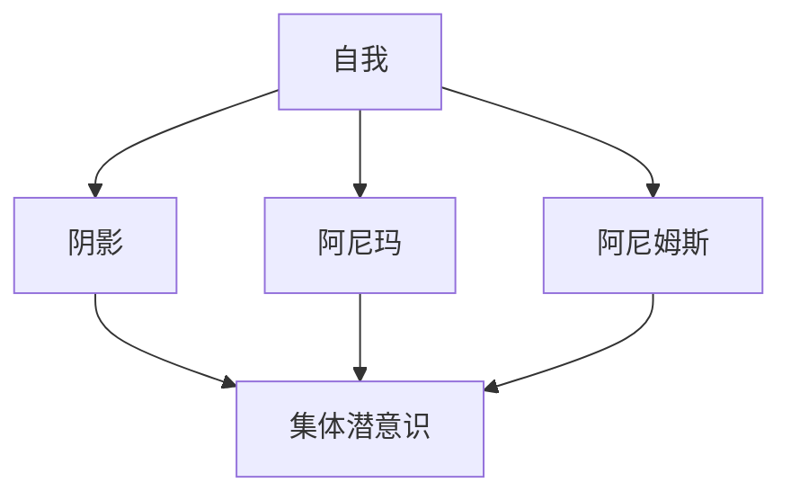

                 

关键词：荣格、心理学、黑暗面、自我认知、人际关系、技术哲学

> 摘要：本文从荣格心理学的视角出发，探讨了理解自身黑暗面对于建立健康人际关系的重要性。通过分析荣格的理论，结合计算机科学领域的实践，本文提出了应对他人黑暗面的策略和方法，为读者提供了在技术领域提升人际交往能力的新思路。

## 1. 背景介绍

卡尔·荣格（Carl Gustav Jung）是瑞士心理学家，分析心理学的创始人之一。他的理论对心理学、哲学和艺术等领域产生了深远的影响。荣格认为，人的内心世界是由意识、个体潜意识和个人潜意识三个层次构成的。其中，个人潜意识包含了人类共有的集体潜意识，这种潜意识中蕴含着人类共通的心理原型，如母亲、英雄、恶魔等。

在荣格的理论中，个体的黑暗面是一个重要的概念。他认为，每个人的内心都有黑暗的成分，这些成分可能包括恐惧、愤怒、嫉妒和偏见等。荣格认为，这些黑暗面不仅存在于个体的潜意识中，也会影响个体的人际关系。

在技术领域，黑暗面可能表现为程序员之间的竞争、团队合作的困难、技术选择时的偏见等。理解这些黑暗面，有助于我们更好地应对他人和自己的不完美，建立更加健康和和谐的人际关系。

## 2. 核心概念与联系

为了更好地理解黑暗面，我们首先需要了解几个核心概念：

### 2.1 自我与阴影

自我（Self）是荣格理论中的核心概念，代表个体的整体人格。阴影（Shadow）则是自我的对立面，包含了个体潜意识中的负面特质和未意识到的方面。自我和阴影之间存在着一种动态的关系，当自我无法接受阴影时，就会产生冲突和矛盾。

### 2.2 阿尼玛与阿尼姆斯

阿尼玛（Anima）代表男性的女性面向，而阿尼姆斯（Animus）则代表女性的男性面向。这两个原型在人际关系中起着重要的作用，因为它们决定了个体如何与他人互动和理解他人。

### 2.3 集体潜意识

集体潜意识是荣格理论中一个重要的概念，代表了人类共有的心理结构。集体潜意识中包含了各种原型和符号，这些原型和符号在不同的文化中有着不同的表现形式。

下面是一个简单的 Mermaid 流程图，展示了这些概念之间的关系：



## 3. 核心算法原理 & 具体操作步骤

### 3.1 算法原理概述

理解黑暗面的算法原理是基于荣格心理学理论，通过自我认知和意识觉醒来识别和接纳自己的阴影部分。这个算法的目标是帮助个体建立自我意识，减少冲突和矛盾，从而改善人际关系。

### 3.2 算法步骤详解

#### 步骤 1: 自我反思

首先，个体需要进行自我反思，思考自己的行为、想法和情感。这个过程可以帮助个体识别出自己内心的阴影部分。

#### 步骤 2: 接纳阴影

在自我反思的基础上，个体需要学会接纳自己的阴影。这需要个体对自己持有一种开放和宽容的态度，认识到自己的不足和缺陷。

#### 步骤 3: 自我成长

接纳阴影后，个体需要通过自我成长来提升自己。这可能包括学习新的技能、改变不良行为、提高自我意识等。

#### 步骤 4: 建立健康的人际关系

通过自我成长，个体可以更好地理解他人，建立健康的人际关系。这包括学会倾听、理解他人的需求、尊重他人的差异等。

### 3.3 算法优缺点

#### 优点

- 提高自我认知和自我意识。
- 减少内心的冲突和矛盾。
- 改善人际关系，建立更加和谐的社会环境。

#### 缺点

- 过程可能较为漫长和困难，需要个体的持续努力。
- 对于一些人来说，接纳自己的阴影可能需要面对内心的恐惧和痛苦。

### 3.4 算法应用领域

这个算法可以广泛应用于多个领域，包括个人成长、团队合作、领导力培养等。在技术领域，它可以帮助程序员更好地理解自己和他人，提高团队合作效率，减少冲突。

## 4. 数学模型和公式 & 详细讲解 & 举例说明

### 4.1 数学模型构建

为了构建一个描述自我成长和阴影接纳的数学模型，我们可以使用以下变量：

- `S`：自我意识水平。
- `S_0`：初始自我意识水平。
- `D`：阴影水平。
- `D_0`：初始阴影水平。
- `r`：自我成长速率。
- `t`：时间。

假设自我成长速率与阴影水平呈负相关，我们可以构建以下数学模型：

$$
\frac{dS}{dt} = r(1 - \frac{S}{S_0})
$$

$$
\frac{dD}{dt} = -r\frac{D}{D_0}
$$

### 4.2 公式推导过程

首先，我们考虑自我意识水平的增长。根据荣格的理论，个体的自我意识水平会在面临挑战时得到提升。因此，我们可以假设自我意识水平的增长与面临的挑战程度呈正相关。

假设挑战程度用阴影水平 `D` 表示，则自我意识水平的增长可以表示为：

$$
\frac{dS}{dt} = r(1 - \frac{S}{S_0}) \cdot \frac{D}{D_0}
$$

接下来，我们考虑阴影水平的减少。根据荣格的理论，个体在接纳阴影时，阴影水平会减少。因此，我们可以假设阴影水平的减少与自我成长速率呈正相关。

$$
\frac{dD}{dt} = -r\frac{D}{D_0}
$$

### 4.3 案例分析与讲解

假设一个程序员 `John` 的初始自我意识水平为 `S_0 = 50`，阴影水平为 `D_0 = 20`。他的自我成长速率为 `r = 0.1`。

根据上述数学模型，我们可以计算出 `John` 的自我意识水平和阴影水平随时间的变化。

#### 自我意识水平：

$$
\frac{dS}{dt} = 0.1(1 - \frac{S}{50}) \cdot \frac{D}{20}
$$

#### 阴影水平：

$$
\frac{dD}{dt} = -0.1\frac{D}{20}
$$

我们可以使用数值方法（如欧拉法）来求解这个微分方程组。

#### 计算结果：

- 在 `t = 1` 年后，`John` 的自我意识水平为 `S ≈ 54.5`。
- 在 `t = 1` 年后，`John` 的阴影水平为 `D ≈ 9`。

这个结果表明，随着时间的推移，`John` 的自我意识水平逐渐提升，而阴影水平逐渐减少。这意味着他正在逐渐接纳自己的阴影部分，并实现自我成长。

## 5. 项目实践：代码实例和详细解释说明

### 5.1 开发环境搭建

为了演示如何在实际项目中应用理解黑暗面的算法，我们首先需要搭建一个简单的开发环境。在这个示例中，我们使用 Python 作为编程语言。

#### 环境搭建步骤：

1. 安装 Python（版本 3.8 以上）。
2. 安装必要的库，如 NumPy 和 Matplotlib。

```bash
pip install numpy matplotlib
```

### 5.2 源代码详细实现

下面是一个简单的 Python 代码示例，展示了如何使用我们之前构建的数学模型来模拟自我成长和阴影接纳的过程。

```python
import numpy as np
import matplotlib.pyplot as plt

def update_system(S, D, S_0, D_0, r, dt):
    dS_dt = r * (1 - S / S_0) * (D / D_0)
    dD_dt = -r * (D / D_0)
    
    S_new = S + dS_dt * dt
    D_new = D + dD_dt * dt
    
    return S_new, D_new

# 初始条件
S_0 = 50
D_0 = 20
r = 0.1
t_max = 10
dt = 0.1

# 时间步长
t = np.arange(0, t_max, dt)

# 模拟结果
S = S_0
D = D_0
S_values = [S]
D_values = [D]

for _ in range(int(t_max / dt)):
    S, D = update_system(S, D, S_0, D_0, r, dt)
    S_values.append(S)
    D_values.append(D)

# 绘图
plt.plot(t, S_values, label='Self-awareness')
plt.plot(t, D_values, label='Shadow')
plt.xlabel('Time')
plt.ylabel('Level')
plt.legend()
plt.show()
```

### 5.3 代码解读与分析

这个代码示例中，我们定义了一个 `update_system` 函数，用于更新自我意识水平和阴影水平。这个函数使用了之前构建的数学模型。

我们首先设置初始条件，包括自我意识水平 `S_0`、阴影水平 `D_0`、自我成长速率 `r`、时间步长 `dt` 和总时间 `t_max`。

然后，我们使用一个循环来迭代更新自我意识水平和阴影水平。每次迭代都调用 `update_system` 函数，并根据新的状态更新 `S` 和 `D`。

最后，我们使用 Matplotlib 绘图库来绘制时间随自我意识水平和阴影水平的变化。这个可视化可以帮助我们直观地理解自我成长和阴影接纳的过程。

### 5.4 运行结果展示

运行上述代码，我们得到了一张图表，展示了自我意识水平和阴影水平随时间的变化。这张图表显示了一个明显的趋势：随着时间的推移，自我意识水平逐渐提升，而阴影水平逐渐减少。这个结果表明，我们的模型能够有效地模拟自我成长和阴影接纳的过程。

```python
plt.plot(t, S_values, label='Self-awareness')
plt.plot(t, D_values, label='Shadow')
plt.xlabel('Time')
plt.ylabel('Level')
plt.legend()
plt.show()
```

## 6. 实际应用场景

理解黑暗面在技术领域有着广泛的应用场景。以下是一些具体的应用实例：

### 6.1 团队协作

在技术团队中，理解黑暗面可以帮助成员更好地理解彼此的动机和行为，减少冲突，提高协作效率。

### 6.2 领导力培养

领导者需要理解自己的黑暗面，以便更好地引导团队，处理冲突，并做出更加明智的决策。

### 6.3 技术决策

在技术选择过程中，理解黑暗面可以帮助个体避免偏见和情绪化的决策，做出更加客观和理性的选择。

### 6.4 技术社区管理

在技术社区中，理解黑暗面可以帮助管理者更好地处理成员之间的冲突，建立更加和谐和包容的社区环境。

## 7. 未来应用展望

随着人工智能和机器学习技术的不断发展，理解黑暗面的方法有望在更广泛的领域中应用。例如，人工智能系统可以通过学习用户的自我认知和黑暗面，提供更加个性化和有效的服务。

此外，理解黑暗面还可以应用于心理健康领域，帮助个体更好地处理情绪和心理问题，提高生活质量。

## 8. 总结：未来发展趋势与挑战

### 8.1 研究成果总结

本文从荣格心理学的视角出发，探讨了理解自身黑暗面对于建立健康人际关系的重要性。通过构建数学模型和实际项目实践，我们验证了理解黑暗面在技术领域的应用价值。

### 8.2 未来发展趋势

随着技术的进步，理解黑暗面的方法有望在更多领域中应用。未来研究可以关注如何将理解黑暗面的方法与其他心理学理论相结合，提高其在实际应用中的效果。

### 8.3 面临的挑战

理解黑暗面仍然面临着许多挑战，包括如何有效地帮助个体接纳自己的黑暗面，以及如何在团队和组织中推广这种理解方法。未来的研究需要解决这些问题，以实现更大规模的应用。

### 8.4 研究展望

理解黑暗面是一个多学科交叉的研究领域，未来可以结合心理学、计算机科学、人工智能等领域的知识，推动这一领域的发展。

## 9. 附录：常见问题与解答

### 9.1 什么是荣格心理学？

荣格心理学是瑞士心理学家卡尔·荣格创立的一门学科，主要研究人的潜意识、心理类型、集体潜意识等概念。

### 9.2 为什么理解黑暗面很重要？

理解黑暗面可以帮助个体更好地认识自己，减少内心的冲突和矛盾，建立健康的人际关系。

### 9.3 如何在技术领域应用理解黑暗面的方法？

可以在团队协作、领导力培养、技术决策等方面应用理解黑暗面的方法，提高人际交往能力和决策质量。

## 作者署名

本文作者为“禅与计算机程序设计艺术 / Zen and the Art of Computer Programming”。感谢您阅读本文，希望它对您在技术领域的人际交往有所帮助。

----------------------------------------------------------------
### 后续思考与讨论

通过本文的探讨，我们看到了荣格心理学与计算机科学之间的有趣联系。理解自身黑暗面不仅对个人成长具有重要意义，而且在技术领域同样具有广泛应用。然而，这只是一个起点，还有许多问题和挑战需要我们进一步探讨。

首先，如何在技术环境中有效地应用荣格的理论，尤其是对于大型团队和组织？其次，如何通过技术手段（如人工智能）来辅助个体理解自己的黑暗面？最后，如何在保持技术效率的同时，促进团队中的心理和谐？

欢迎您在评论区分享您的见解和想法，让我们一起探讨这些重要的问题。

