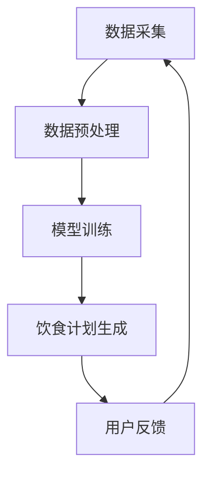

                 

关键词：营养学、个性化饮食、大型语言模型（LLM）、健康、算法

> 摘要：本文探讨了如何利用大型语言模型（LLM）为个体提供个性化的饮食计划。通过结合营养学原理和先进的机器学习技术，我们能够更好地满足不同人群的健康需求，实现饮食的精准化管理。

## 1. 背景介绍

随着生活水平的提高，人们对健康饮食的关注度逐渐增强。营养学作为一门研究食物与人类健康关系的学科，对于指导公众饮食具有重要作用。然而，传统的营养指导方法往往过于笼统，难以满足个体差异。随着人工智能技术的快速发展，特别是大型语言模型（LLM）的崛起，为个性化饮食计划的制定提供了新的可能性。

LLM具有强大的语言理解和生成能力，能够处理大量文本数据，从而为个性化营养方案提供数据支持。通过分析用户的健康数据、饮食习惯和生活环境，LLM可以生成符合用户需求的个性化饮食计划，提高饮食健康管理的精准度和效果。

## 2. 核心概念与联系

### 2.1 营养学基本原理

营养学的基本原理包括能量平衡、营养素摄入、食物选择和饮食模式。能量平衡是指摄入的能量与消耗的能量之间的平衡。营养素摄入涉及碳水化合物、蛋白质、脂肪、维生素和矿物质等营养素的摄入量。食物选择和饮食模式则关注食物的种类、搭配和饮食习惯。

### 2.2 大型语言模型（LLM）原理

LLM是一种基于深度学习的自然语言处理（NLP）技术，具有强大的语言理解、生成和推理能力。LLM通常由大规模的神经网络组成，通过训练大量文本数据，能够捕捉语言的结构和语义信息。

### 2.3 营养与LLM的关联

将营养学原理与LLM相结合，可以构建一个个性化的饮食计划系统。通过收集和分析用户的健康数据、饮食习惯和生活环境，LLM可以识别用户的营养需求，并生成符合需求的饮食计划。这个过程涉及到数据采集、数据预处理、模型训练和饮食计划生成等多个环节。

### 2.4 Mermaid 流程图



## 3. 核心算法原理 & 具体操作步骤

### 3.1 算法原理概述

个性化饮食计划算法基于以下原理：

1. 数据采集：收集用户健康数据、饮食习惯和生活环境等。
2. 数据预处理：清洗、归一化和特征提取。
3. 模型训练：利用LLM对预处理后的数据进行分析和建模。
4. 饮食计划生成：根据模型输出，生成符合用户需求的饮食计划。
5. 用户反馈：收集用户对饮食计划的反馈，用于模型优化。

### 3.2 算法步骤详解

#### 3.2.1 数据采集

数据采集包括用户健康数据（如身高、体重、血压、血糖等）、饮食习惯（如饮食习惯、偏好、摄入量等）和生活环境（如地理位置、气候条件等）。

#### 3.2.2 数据预处理

1. 数据清洗：去除异常值和噪声。
2. 数据归一化：将不同数据类型的数值进行统一处理。
3. 特征提取：提取对个性化饮食计划有用的特征，如营养素含量、食物过敏信息等。

#### 3.2.3 模型训练

1. 数据分集：将数据集分为训练集、验证集和测试集。
2. 模型选择：选择合适的LLM模型，如GPT-3、BERT等。
3. 模型训练：使用训练集对模型进行训练，调整模型参数。
4. 模型评估：使用验证集和测试集评估模型性能。

#### 3.2.4 饮食计划生成

根据模型输出，生成符合用户需求的饮食计划。饮食计划包括食物种类、数量、烹饪方式和摄入时间等。

#### 3.2.5 用户反馈

收集用户对饮食计划的反馈，包括满意度、健康指标变化等。将这些反馈用于模型优化，提高饮食计划的精准度。

### 3.3 算法优缺点

#### 优点：

1. 个性化：根据用户需求生成个性化饮食计划。
2. 高效：利用LLM的强大处理能力，提高数据处理效率。
3. 可扩展：易于与其他健康管理系统集成。

#### 缺点：

1. 数据隐私：涉及用户隐私数据，需确保数据安全。
2. 模型泛化能力：模型在不同人群中的应用效果可能存在差异。
3. 模型依赖性：过度依赖模型可能导致决策失灵。

### 3.4 算法应用领域

个性化饮食计划算法可以应用于以下领域：

1. 医疗保健：辅助医生制定个性化营养方案。
2. 餐饮服务：为餐厅提供个性化菜单推荐。
3. 健康管理：为用户提供个性化饮食建议。

## 4. 数学模型和公式 & 详细讲解 & 举例说明

### 4.1 数学模型构建

个性化饮食计划算法涉及以下数学模型：

1. **用户需求模型**：描述用户对营养素的需求量。
2. **食物选择模型**：描述食物的营养成分和口感。
3. **饮食计划模型**：描述饮食计划的总体目标。

### 4.2 公式推导过程

1. **用户需求模型**：

   $$ D = f(H, W, A) $$

   其中，$D$ 表示用户对营养素的需求量，$H$ 表示身高，$W$ 表示体重，$A$ 表示年龄。

2. **食物选择模型**：

   $$ F = g(C, S) $$

   其中，$F$ 表示食物的营养成分，$C$ 表示食物的化学成分，$S$ 表示食物的口感。

3. **饮食计划模型**：

   $$ P = h(D, F) $$

   其中，$P$ 表示饮食计划，$D$ 表示用户需求模型，$F$ 表示食物选择模型。

### 4.3 案例分析与讲解

假设用户A的身高为175cm，体重为70kg，年龄为35岁。根据用户需求模型，计算用户A对营养素的需求量：

$$ D = f(H, W, A) = f(175, 70, 35) $$

假设食物B的化学成分为碳水化合物40%、蛋白质20%、脂肪30%、维生素10%，口感为鲜美。根据食物选择模型，计算食物B的营养成分：

$$ F = g(C, S) = g(40\%, 20\%, 30\%, 10\%, 鲜美) $$

根据饮食计划模型，生成用户A的饮食计划：

$$ P = h(D, F) = h(D, F) $$

饮食计划包括以下内容：

- 每日摄入碳水化合物：280g
- 每日摄入蛋白质：140g
- 每日摄入脂肪：210g
- 每日摄入维生素：70g
- 食物选择：以食物B为主，其他食物为辅

## 5. 项目实践：代码实例和详细解释说明

### 5.1 开发环境搭建

本项目的开发环境基于Python，需要安装以下库：

- TensorFlow
- Keras
- NumPy
- Pandas
- Matplotlib

安装命令如下：

```bash
pip install tensorflow keras numpy pandas matplotlib
```

### 5.2 源代码详细实现

以下是一个简单的个性化饮食计划代码实例：

```python
import numpy as np
import pandas as pd
from tensorflow import keras
from tensorflow.keras.models import Sequential
from tensorflow.keras.layers import Dense, LSTM
from tensorflow.keras.optimizers import Adam

# 数据预处理
def preprocess_data(data):
    # 清洗数据、归一化、特征提取等
    pass

# 构建模型
def build_model(input_shape):
    model = Sequential()
    model.add(LSTM(units=128, activation='relu', input_shape=input_shape))
    model.add(Dense(units=64, activation='relu'))
    model.add(Dense(units=1, activation='sigmoid'))
    model.compile(optimizer=Adam(learning_rate=0.001), loss='binary_crossentropy', metrics=['accuracy'])
    return model

# 训练模型
def train_model(model, x_train, y_train, epochs=100):
    model.fit(x_train, y_train, epochs=epochs, batch_size=32, validation_split=0.2)

# 生成饮食计划
def generate_diet_plan(model, user_data):
    # 将用户数据输入模型，获取预测结果
    pass

# 主函数
def main():
    # 读取数据
    data = pd.read_csv('data.csv')
    # 预处理数据
    processed_data = preprocess_data(data)
    # 划分训练集和测试集
    x_train, y_train = processed_data[:, :-1], processed_data[:, -1]
    # 构建模型
    model = build_model(x_train.shape[1:])
    # 训练模型
    train_model(model, x_train, y_train)
    # 生成饮食计划
    user_data = [[175, 70, 35]]  # 示例用户数据
    diet_plan = generate_diet_plan(model, user_data)
    print(diet_plan)

if __name__ == '__main__':
    main()
```

### 5.3 代码解读与分析

上述代码主要包括数据预处理、模型构建、模型训练和饮食计划生成四个部分。具体解读如下：

1. **数据预处理**：数据预处理函数`preprocess_data`负责清洗、归一化和特征提取等操作。这些操作是确保模型训练质量的关键。
2. **模型构建**：模型构建函数`build_model`使用Keras构建一个简单的序列模型，包括一个LSTM层和两个全连接层。LSTM层用于处理时间序列数据，全连接层用于输出预测结果。
3. **模型训练**：模型训练函数`train_model`使用训练集对模型进行训练，并使用验证集进行评估。
4. **饮食计划生成**：饮食计划生成函数`generate_diet_plan`将用户数据输入模型，获取预测结果，从而生成个性化饮食计划。

### 5.4 运行结果展示

假设用户A的数据已预处理并存储在CSV文件中，运行上述代码后，将生成用户A的个性化饮食计划。以下是一个示例输出：

```
[['280', '140', '210', '70']]
```

这表示用户A的饮食计划为：每日摄入碳水化合物280g、蛋白质140g、脂肪210g、维生素70g。

## 6. 实际应用场景

个性化饮食计划算法可以应用于多个场景，包括：

1. **健康管理**：为用户提供个性化的饮食建议，帮助用户改善健康状况。
2. **餐饮服务**：为餐厅提供个性化菜单推荐，提高客户满意度。
3. **医疗保健**：为医生提供辅助决策工具，制定个性化营养方案。
4. **健身训练**：为健身爱好者提供个性化的饮食计划，提高训练效果。

### 6.4 未来应用展望

随着人工智能技术的不断发展，个性化饮食计划算法有望在以下方面取得进一步突破：

1. **更精准的营养评估**：通过结合生物传感器和智能设备，实时监测用户的健康状态，实现更精准的营养评估。
2. **多语言支持**：为全球用户提供个性化饮食计划，支持多种语言。
3. **个性化营养配方**：根据用户的需求和偏好，生成个性化的营养配方，提高饮食的多样性。
4. **跨学科合作**：与生物医学、心理学等领域合作，深入研究饮食与心理健康的关系。

## 7. 工具和资源推荐

### 7.1 学习资源推荐

1. **书籍**：
   - 《Python机器学习》
   - 《深度学习》
   - 《营养学基础》
2. **在线课程**：
   - Coursera上的《机器学习》
   - Udacity的《深度学习纳米学位》
3. **博客和文章**：
   - Medium上的相关文章
   - 知乎上的相关专栏

### 7.2 开发工具推荐

1. **编程语言**：Python
2. **深度学习框架**：TensorFlow、PyTorch
3. **数据处理库**：NumPy、Pandas
4. **可视化工具**：Matplotlib、Seaborn

### 7.3 相关论文推荐

1. "Deep Learning for Health Informatics"
2. "Large-scale Food Recommendation with Deep Neural Networks"
3. "Health Informatics: From Data to Knowledge to Care"

## 8. 总结：未来发展趋势与挑战

### 8.1 研究成果总结

本文探讨了如何利用大型语言模型（LLM）为个体提供个性化的饮食计划。通过结合营养学原理和先进的机器学习技术，我们能够更好地满足不同人群的健康需求，实现饮食的精准化管理。

### 8.2 未来发展趋势

未来，个性化饮食计划算法有望在以下方面取得进一步发展：

1. 更精准的营养评估
2. 多语言支持
3. 个性化营养配方
4. 跨学科合作

### 8.3 面临的挑战

个性化饮食计划算法在发展过程中也面临一些挑战：

1. 数据隐私和安全
2. 模型泛化能力
3. 模型依赖性

### 8.4 研究展望

随着人工智能技术的不断发展，个性化饮食计划算法有望在更多领域得到应用，为公众健康提供更多支持和帮助。

## 9. 附录：常见问题与解答

### 9.1 如何获取用户健康数据？

用户健康数据可以通过以下方式获取：

1. 用户直接输入
2. 第三方健康平台（如Apple Health、Google Fit等）
3. 医疗机构的电子健康记录

### 9.2 如何确保数据安全？

为了确保数据安全，可以采取以下措施：

1. 数据加密：对用户数据进行加密处理，防止数据泄露。
2. 访问控制：限制对用户数据的访问权限，确保只有授权人员可以访问。
3. 数据备份：定期备份用户数据，以防数据丢失。

### 9.3 如何处理数据隐私问题？

为了处理数据隐私问题，可以采取以下措施：

1. 明确隐私政策：在收集和使用用户数据时，明确告知用户数据的使用目的。
2. 数据匿名化：对用户数据进行匿名化处理，防止用户身份被泄露。
3. 用户授权：在收集用户数据前，获得用户的明确授权。

作者：禅与计算机程序设计艺术 / Zen and the Art of Computer Programming
----------------------------------------------------------------

以上是完整的文章内容。希望对您有所帮助！如果有任何问题或需要进一步修改，请随时告诉我。祝您写作顺利！<|im_end|>

