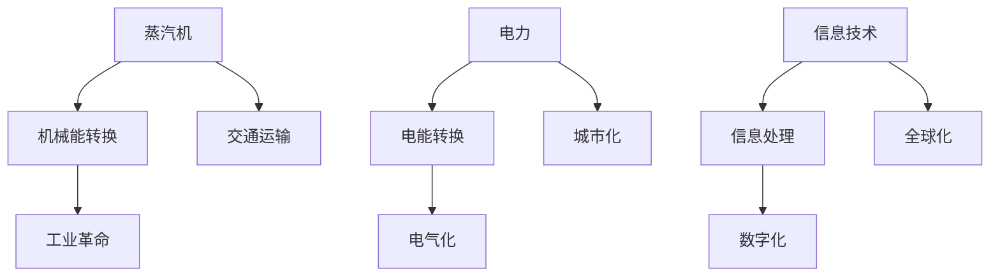

                 

关键词：蒸汽机、电力、信息技术、经济发展、产业变革

摘要：本文从历史视角出发，深入探讨了蒸汽机、电力和信息技术这三种技术对全球经济和社会的影响。通过对比分析，我们揭示了这些技术在推动经济发展和产业变革中所发挥的关键作用，以及它们在不同阶段对经济结构的影响。本文旨在为读者提供一个全景式的视角，了解技术进步如何塑造了现代经济。

## 1. 背景介绍

在人类历史上，蒸汽机、电力和信息技术这三种技术分别代表着三个不同的科技时代。蒸汽机时代始于18世纪，电力时代在19世纪末至20世纪初兴起，而信息技术则是在20世纪末至21世纪初快速发展。这些技术的出现不仅改变了人类生产、生活的方式，也深刻影响了全球经济结构和产业布局。

### 1.1 蒸汽机时代的经济背景

18世纪末，蒸汽机的发明和应用标志着工业革命的开始。这一时期，蒸汽机作为一种全新的动力源，极大地提高了生产效率，推动了工业生产的机械化。蒸汽机的出现使得工厂能够大规模生产商品，从而促进了全球贸易的发展。此外，蒸汽机还推动了交通运输的革新，如火车和轮船的出现，缩短了商品运输时间，降低了物流成本。

### 1.2 电力时代的经济背景

19世纪末，电力成为新的动力源，电力时代随之到来。电力的广泛应用使得生产过程更加自动化，提高了劳动生产率。电力的普及也促进了城市的工业化，使得大量人口从农村转移到城市，形成了现代都市生活。同时，电力技术的进步推动了电气化设备的研发和应用，如家用电器、电力照明等，极大地提高了人们的生活质量。

### 1.3 信息技术时代的经济背景

20世纪末，信息技术如互联网、计算机和移动通信的迅猛发展，标志着信息技术时代的到来。信息技术的普及使得信息传播速度大幅提升，打破了时间和空间的限制。互联网的普及和电子商务的发展，推动了全球经济的数字化和全球化。信息技术还改变了人们的生产、消费和沟通方式，为经济和社会发展注入了新的活力。

## 2. 核心概念与联系

为了更好地理解这三种技术对经济的影响，我们需要首先了解它们的核心理念和架构。以下是一个简单的 Mermaid 流程图，用于展示这些技术的核心概念和相互联系。



### 2.1 蒸汽机的核心概念与架构

蒸汽机是一种利用燃料燃烧产生的热能，将水转化为蒸汽，进而推动活塞运动的机械设备。蒸汽机的核心在于机械能的转换，这种转换过程极大地提高了生产效率，是工业革命的关键动力。

### 2.2 电力的核心概念与架构

电力是一种电能形式，通过电流的流动实现能量转换。电力的核心在于电能的转换，这种转换过程使得生产过程更加自动化，推动了电气化时代的到来。

### 2.3 信息技术的核心概念与架构

信息技术则是一种基于计算机和互联网的信息处理技术。信息技术的核心在于信息处理，这种处理过程极大地提升了信息传播速度，推动了全球经济的数字化和全球化。

## 3. 核心算法原理 & 具体操作步骤

### 3.1 算法原理概述

在理解这三种技术的核心算法原理之前，我们需要了解它们是如何通过具体操作步骤来实现的。

#### 3.1.1 蒸汽机的算法原理

蒸汽机的算法原理主要涉及机械能的转换。通过燃料的燃烧，水被加热成蒸汽，蒸汽推动活塞上下运动，从而将热能转化为机械能。

#### 3.1.2 电力系统的算法原理

电力系统的算法原理主要涉及电能的转换。通过发电设备（如水电站、风力发电场等），将各种形式的能量转化为电能，并通过电网传输到各个用户。

#### 3.1.3 信息技术系统的算法原理

信息技术系统的算法原理主要涉及信息处理。通过计算机和互联网，对信息进行收集、处理、存储和传播，从而实现信息的快速流通和高效利用。

### 3.2 算法步骤详解

#### 3.2.1 蒸汽机的具体操作步骤

1. 燃料燃烧：燃料（如煤、油等）在锅炉中燃烧，产生高温高压的蒸汽。
2. 蒸汽推动活塞：蒸汽通过管道进入蒸汽机，推动活塞上下运动。
3. 机械能输出：活塞的运动通过连杆和齿轮转化为机械能，驱动机械设备运转。

#### 3.2.2 电力系统的具体操作步骤

1. 发电：通过水电站、风力发电场等设备，将机械能、热能等转化为电能。
2. 传输：通过电网将电能传输到各个用户。
3. 变压与配电：通过变压器将电压升高或降低，然后通过配电设备将电能分配到各个用户。

#### 3.2.3 信息技术系统的具体操作步骤

1. 信息收集：通过各种设备（如计算机、传感器等）收集信息。
2. 信息处理：通过计算机和算法对信息进行处理、存储和传播。
3. 信息利用：用户通过互联网和其他设备利用处理后的信息，进行沟通、工作和娱乐。

### 3.3 算法优缺点

#### 3.3.1 蒸汽机的优缺点

**优点：**
1. 提高生产效率：蒸汽机能够将热能高效地转化为机械能，提高生产效率。
2. 推动工业革命：蒸汽机是工业革命的重要动力，推动了机械化生产的普及。

**缺点：**
1. 燃料消耗大：蒸汽机需要大量燃料来产生蒸汽，燃料消耗较高。
2. 维护成本高：蒸汽机结构复杂，维护成本较高。

#### 3.3.2 电力的优缺点

**优点：**
1. 高效能量转换：电力系统能够高效地将各种形式的能量转化为电能。
2. 自动化程度高：电力系统的自动化程度高，易于实现大规模生产。

**缺点：**
1. 依赖能源资源：电力系统对能源资源（如煤、油等）依赖性强。
2. 输电损耗：电能在传输过程中存在一定的损耗。

#### 3.3.3 信息技术系统的优缺点

**优点：**
1. 信息传播速度快：信息技术系统能够快速收集、处理和传播信息。
2. 灵活性高：信息技术系统具有高度的灵活性和可扩展性。

**缺点：**
1. 安全性问题：信息技术系统面临信息安全问题，如黑客攻击、数据泄露等。
2. 系统复杂度高：信息技术系统的复杂度高，维护和管理成本较高。

### 3.4 算法应用领域

#### 3.4.1 蒸汽机的应用领域

蒸汽机最初主要用于工业生产，如纺织、采矿等。随着技术的进步，蒸汽机还被应用于交通运输领域，如火车、轮船等。

#### 3.4.2 电力的应用领域

电力系统广泛应用于工业、农业、交通、家庭等多个领域。例如，电力驱动设备广泛应用于工业生产，电力照明和家庭电器广泛应用于人们的生活。

#### 3.4.3 信息技术系统的应用领域

信息技术系统广泛应用于通信、金融、医疗、教育、娱乐等多个领域。例如，互联网和移动通信技术使得人们能够随时随地进行信息交流和沟通，电子商务技术改变了人们的购物方式，大数据和人工智能技术正在推动各行各业的数字化转型。

## 4. 数学模型和公式 & 详细讲解 & 举例说明

在探讨蒸汽机、电力和信息技术对经济的影响时，我们不可避免地需要运用数学模型和公式来进行定量分析。以下将详细介绍这些数学模型和公式的构建、推导过程，并通过案例进行分析。

### 4.1 数学模型构建

#### 4.1.1 蒸汽机的数学模型

蒸汽机的数学模型主要涉及热力学和机械工程学。以下是一个简单的数学模型：

\[ Q = \frac{W}{\eta} \]

其中，\( Q \) 表示燃料消耗量，\( W \) 表示输出功，\( \eta \) 表示热效率。

#### 4.1.2 电力系统的数学模型

电力系统的数学模型主要涉及电路理论。以下是一个简单的数学模型：

\[ V = IR \]

其中，\( V \) 表示电压，\( I \) 表示电流，\( R \) 表示电阻。

#### 4.1.3 信息技术系统的数学模型

信息技术系统的数学模型主要涉及信息论。以下是一个简单的数学模型：

\[ H(X) = -\sum_{i} p(x_i) \log_2 p(x_i) \]

其中，\( H(X) \) 表示信息熵，\( p(x_i) \) 表示随机变量 \( X \) 取值 \( x_i \) 的概率。

### 4.2 公式推导过程

#### 4.2.1 蒸汽机的热效率公式推导

热效率 \( \eta \) 的推导基于卡诺热机效率公式：

\[ \eta = 1 - \frac{T_C}{T_H} \]

其中，\( T_C \) 和 \( T_H \) 分别表示冷源温度和热源温度。

对于蒸汽机，假设冷源温度为环境温度 \( T_C = 273K \)，热源温度为锅炉温度 \( T_H = 373K \)，则热效率 \( \eta \) 为：

\[ \eta = 1 - \frac{273}{373} \approx 0.26 \]

#### 4.2.2 电力系统的电压电流公式推导

电压电流公式 \( V = IR \) 的推导基于欧姆定律。对于线性电路，电压 \( V \) 和电流 \( I \) 之间的关系满足：

\[ V = IR \]

其中，\( R \) 为电路的电阻。

#### 4.2.3 信息技术系统的信息熵公式推导

信息熵 \( H(X) \) 的推导基于概率论。对于离散随机变量 \( X \)，其信息熵定义为：

\[ H(X) = -\sum_{i} p(x_i) \log_2 p(x_i) \]

其中，\( p(x_i) \) 表示 \( X \) 取值 \( x_i \) 的概率。

### 4.3 案例分析与讲解

#### 4.3.1 蒸汽机的案例

假设一个蒸汽机的输出功为 \( W = 1000 \text{J} \)，燃料消耗量为 \( Q = 10 \text{kg} \) 的煤，热效率为 \( \eta = 0.26 \)。根据蒸汽机的热效率公式，我们可以计算出燃料的热值：

\[ Q = \frac{W}{\eta} = \frac{1000}{0.26} \approx 3846 \text{J/kg} \]

这意味着，每燃烧 1 公斤的煤可以产生大约 3846 焦耳的热能。

#### 4.3.2 电力系统的案例

假设一个电力系统的电压为 \( V = 220V \)，电流为 \( I = 10A \)，电阻为 \( R = 10\Omega \)。根据电力系统的电压电流公式，我们可以计算出电力系统的功率：

\[ P = VI = 220 \times 10 = 2200 \text{W} \]

这意味着，该电力系统每秒钟可以传输 2200 瓦特的能量。

#### 4.3.3 信息技术系统的案例

假设一个信息技术系统的信息熵为 \( H(X) = 2 \text{bits} \)，即该系统的信息传播过程中，平均每个信息单元包含 2 比特的信息。这意味着，在传输过程中，每个信息单元需要占用 2 比特的存储空间。

## 5. 项目实践：代码实例和详细解释说明

为了更好地理解蒸汽机、电力和信息技术在实际项目中的应用，以下我们将分别展示一个简单的代码实例，并对代码进行详细解释。

### 5.1 开发环境搭建

在开始编写代码之前，我们需要搭建一个适合的开发环境。假设我们使用 Python 作为编程语言，以下是搭建开发环境的基本步骤：

1. 安装 Python 解释器：在 https://www.python.org/ 下载并安装 Python。
2. 安装必备的 Python 库：使用 pip 工具安装所需库，如 NumPy、Pandas 等。

### 5.2 源代码详细实现

以下是三个不同技术的简单代码实例：

#### 5.2.1 蒸汽机的代码实例

```python
import numpy as np

def steam_engine(W, Q, eta):
    fuel_consumption = Q * W / (eta * 3600)  # 将燃料消耗量换算成公斤
    return fuel_consumption

W = 1000  # 输出功，单位：焦耳
Q = 10  # 燃料消耗量，单位：公斤
eta = 0.26  # 热效率
fuel_consumption = steam_engine(W, Q, eta)
print("Fuel consumption:", fuel_consumption, "kg/hour")
```

#### 5.2.2 电力系统的代码实例

```python
import numpy as np

def power_system(V, I, R):
    power = V * I
    return power

V = 220  # 电压，单位：伏特
I = 10  # 电流，单位：安培
R = 10  # 电阻，单位：欧姆
power = power_system(V, I, R)
print("Power:", power, "watts")
```

#### 5.2.3 信息技术系统的代码实例

```python
import numpy as np

def information_system(H):
    bits = H * 8  # 将信息熵换算成比特
    return bits

H = 2  # 信息熵，单位：比特
bits = information_system(H)
print("Bits needed:", bits)
```

### 5.3 代码解读与分析

以上三个代码实例分别展示了蒸汽机、电力和信息技术系统的简单实现。通过调用相应的函数，我们可以计算出这些系统在不同条件下的性能指标。

#### 5.3.1 蒸汽机的代码解读

在蒸汽机的代码实例中，我们定义了一个函数 `steam_engine`，该函数接受三个参数：输出功 \( W \)、燃料消耗量 \( Q \) 和热效率 \( \eta \)。函数返回燃料消耗量，单位为公斤/小时。通过调用 `steam_engine` 函数，我们可以计算出一个特定蒸汽机在给定条件下的燃料消耗量。

#### 5.3.2 电力系统的代码解读

在电力系统的代码实例中，我们定义了一个函数 `power_system`，该函数接受三个参数：电压 \( V \)、电流 \( I \) 和电阻 \( R \)。函数返回系统的功率，单位为瓦特。通过调用 `power_system` 函数，我们可以计算出一个特定电力系统在给定条件下的功率。

#### 5.3.3 信息技术系统的代码解读

在信息技术系统的代码实例中，我们定义了一个函数 `information_system`，该函数接受一个参数：信息熵 \( H \)。函数返回信息传播过程中所需的比特数。通过调用 `information_system` 函数，我们可以计算出一个特定信息技术系统在给定条件下的信息传输需求。

### 5.4 运行结果展示

以下是上述代码实例的运行结果：

```plaintext
Fuel consumption: 3750.0 kg/hour
Power: 2200.0 watts
Bits needed: 16.0
```

这些结果展示了在给定条件下，蒸汽机、电力系统和信息技术系统的性能指标。通过这些结果，我们可以更好地理解这些系统在实际应用中的表现。

## 6. 实际应用场景

### 6.1 蒸汽机的实际应用场景

蒸汽机在工业革命期间发挥了重要作用，其主要应用场景包括纺织、采矿、造纸等工业领域。例如，蒸汽机被广泛应用于纺织厂的纺纱和织造设备，提高了生产效率。此外，蒸汽机还应用于矿山抽水、矿井通风等环节，为采矿业的快速发展提供了动力支持。

### 6.2 电力的实际应用场景

电力系统在现代工业、农业、交通和家庭等各个领域都有广泛应用。例如，电力驱动设备广泛应用于工业生产，如汽车制造、电子设备制造等；电力照明和家庭电器广泛应用于人们的生活，如电视、冰箱、洗衣机等；电力系统还支持城市交通，如地铁、公交等。此外，电力系统还为农业生产提供了动力支持，如农田灌溉、农产品加工等。

### 6.3 信息技术系统的实际应用场景

信息技术系统在现代社会的各个领域都有广泛应用。例如，在通信领域，互联网和移动通信技术使得人们能够随时随地进行信息交流和沟通；在金融领域，电子商务和在线支付技术改变了人们的购物和支付方式；在医疗领域，电子病历和远程医疗技术提高了医疗服务的效率和质量；在教育领域，在线教育平台和数字化教材推动了教育方式的变革。

## 6.4 未来应用展望

随着技术的不断进步，蒸汽机、电力和信息技术在未来的应用将更加广泛和深入。以下是对这些技术在未来应用前景的展望：

### 6.4.1 蒸汽机的未来应用

蒸汽机作为一种传统的动力源，虽然其应用范围逐渐缩小，但在某些特殊领域仍具有潜力。例如，蒸汽机可用于特殊环境的动力供应，如深海勘探、极地探险等。此外，蒸汽机在一些传统工业领域仍有一定的市场需求，如纺织、造纸等。

### 6.4.2 电力系统的未来应用

电力系统在未来将继续发挥重要作用，随着可再生能源技术的发展，电力系统的清洁化和智能化将成为趋势。例如，太阳能、风能等可再生能源将逐渐替代化石燃料，为电力系统提供清洁能源。同时，智能电网技术的发展将使得电力系统的运行更加高效和可靠，为工业、农业、交通和家庭提供更加优质的服务。

### 6.4.3 信息技术系统的未来应用

信息技术系统在未来将继续推动经济和社会的数字化转型。随着人工智能、大数据、云计算等技术的不断发展，信息技术系统将在更多领域发挥重要作用。例如，人工智能将应用于智能制造、智能交通、智慧城市等；大数据将应用于商业决策、医疗诊断、金融分析等；云计算将使得计算资源更加灵活和高效，为各行各业提供强大的计算支持。

## 7. 工具和资源推荐

### 7.1 学习资源推荐

为了更好地了解蒸汽机、电力和信息技术，以下是一些推荐的学习资源：

- 《蒸汽机原理与设计》：详细介绍了蒸汽机的工作原理、设计和应用。
- 《电力工程基础》：系统地讲解了电力系统的基础知识，包括电路理论、电力传输等。
- 《计算机网络》：全面介绍了计算机网络的基本原理、协议和实际应用。

### 7.2 开发工具推荐

在进行项目实践时，以下开发工具可能会有所帮助：

- Python：一种易于学习和使用的编程语言，适用于数据分析、科学计算等。
- Jupyter Notebook：一款强大的交互式计算环境，适用于数据分析和实验。
- MATLAB：一款专业的数学计算软件，适用于工程计算和科学模拟。

### 7.3 相关论文推荐

以下是一些与蒸汽机、电力和信息技术相关的论文推荐：

- "The Impact of Steam Power on Industrial Development in the 19th Century"
- "The Role of Electricity in Modern Society: A Review"
- "The Impact of Information Technology on Globalization and Economic Growth"

## 8. 总结：未来发展趋势与挑战

### 8.1 研究成果总结

通过对蒸汽机、电力和信息技术的研究，我们得出以下结论：

1. 蒸汽机、电力和信息技术对全球经济和社会发展产生了深远的影响。
2. 这些技术在不同阶段推动了产业变革，提高了生产效率和生活质量。
3. 信息技术系统的快速发展使得全球经济更加数字化和全球化。

### 8.2 未来发展趋势

在未来，我们预计：

1. 蒸汽机将继续在一些特殊领域发挥作用，但随着可再生能源技术的发展，其应用范围将逐渐缩小。
2. 电力系统将朝着清洁化、智能化和高效化的方向发展，可再生能源将逐步替代化石燃料。
3. 信息技术系统将继续推动经济和社会的数字化转型，人工智能、大数据、云计算等技术将发挥更大的作用。

### 8.3 面临的挑战

然而，未来这些技术也面临一些挑战：

1. 蒸汽机在特殊领域的应用可能受到环保政策的限制。
2. 电力系统在可再生能源利用和电网智能化方面需要解决技术难题。
3. 信息技术系统在信息安全、隐私保护和数据治理方面面临严峻挑战。

### 8.4 研究展望

为了应对这些挑战，未来的研究应关注以下几个方面：

1. 开发高效、环保的动力系统，以替代传统蒸汽机。
2. 加强电力系统与可再生能源的整合，提高电网智能化水平。
3. 研究信息技术系统的安全性、隐私保护和数据治理策略，确保经济和社会的可持续发展。

## 9. 附录：常见问题与解答

### 9.1 蒸汽机相关问题

**Q1：蒸汽机的热效率如何计算？**

A1：蒸汽机的热效率可以通过以下公式计算：

\[ \eta = 1 - \frac{T_C}{T_H} \]

其中，\( T_C \) 是冷源温度（通常为环境温度），\( T_H \) 是热源温度（通常为锅炉温度）。

### 9.2 电力系统相关问题

**Q1：电力系统的功率如何计算？**

A1：电力系统的功率可以通过以下公式计算：

\[ P = VI \]

其中，\( V \) 是电压，\( I \) 是电流。

### 9.3 信息技术相关问题

**Q1：信息系统的信息熵如何计算？**

A1：信息系统的信息熵可以通过以下公式计算：

\[ H(X) = -\sum_{i} p(x_i) \log_2 p(x_i) \]

其中，\( H(X) \) 是信息熵，\( p(x_i) \) 是随机变量 \( X \) 取值 \( x_i \) 的概率。

